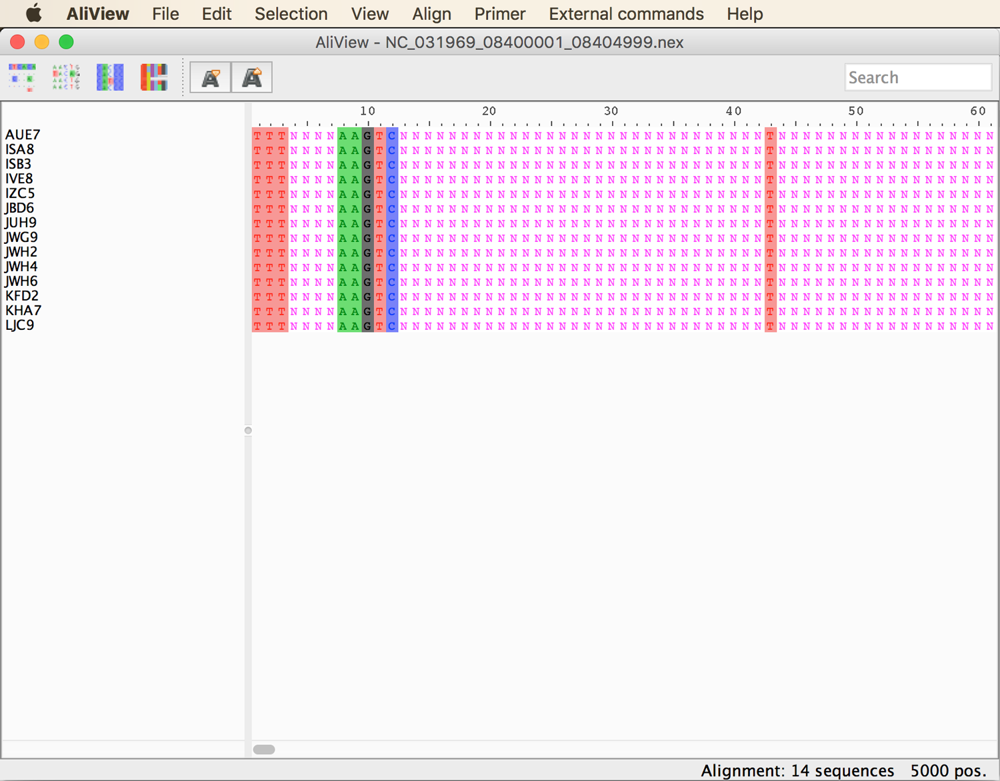
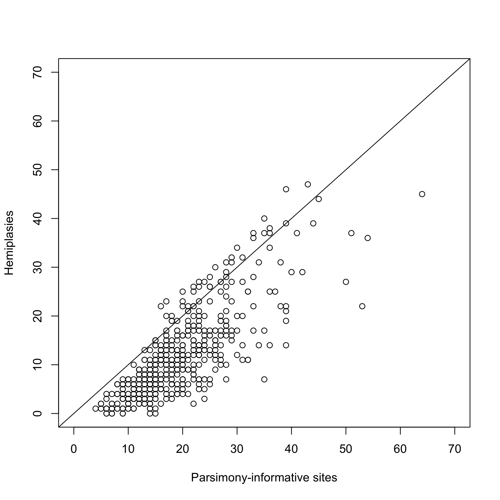
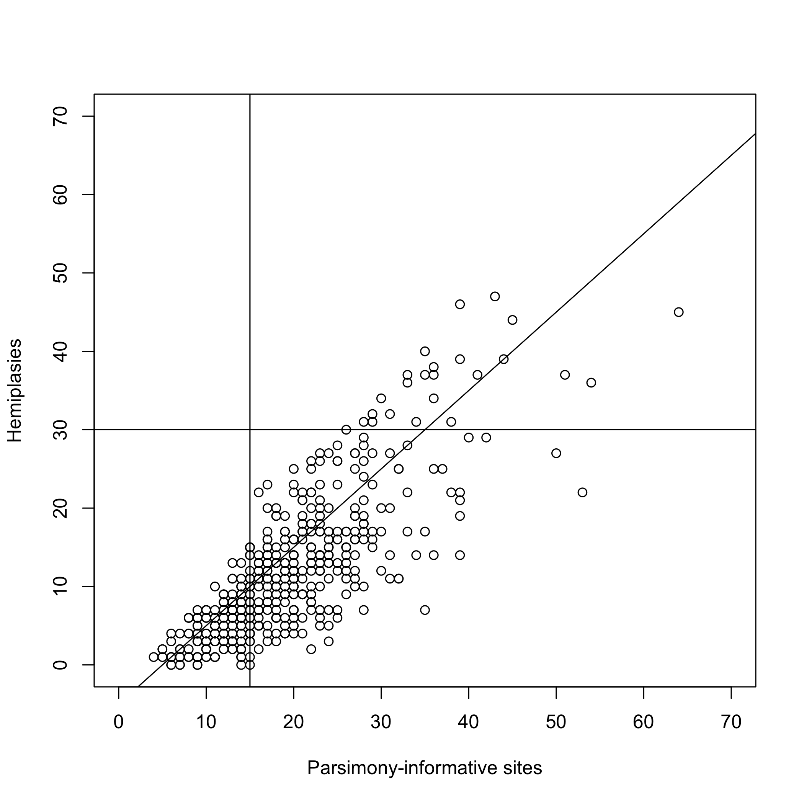
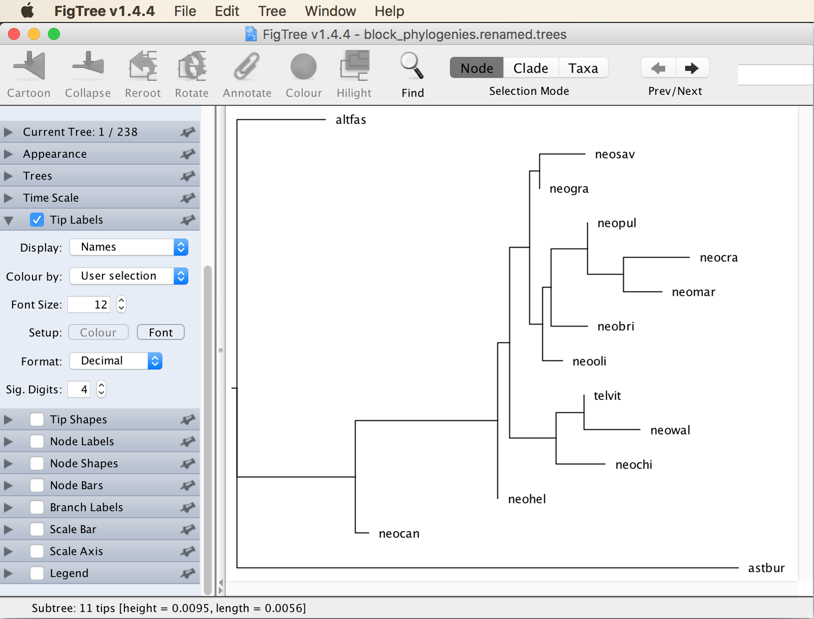
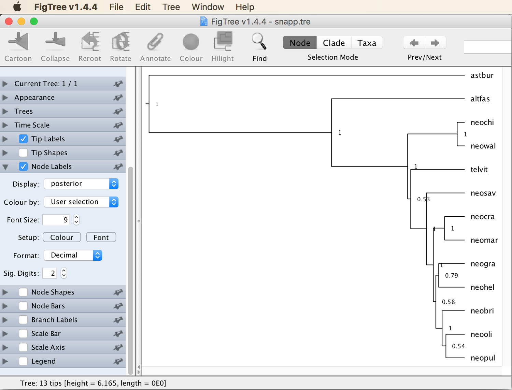
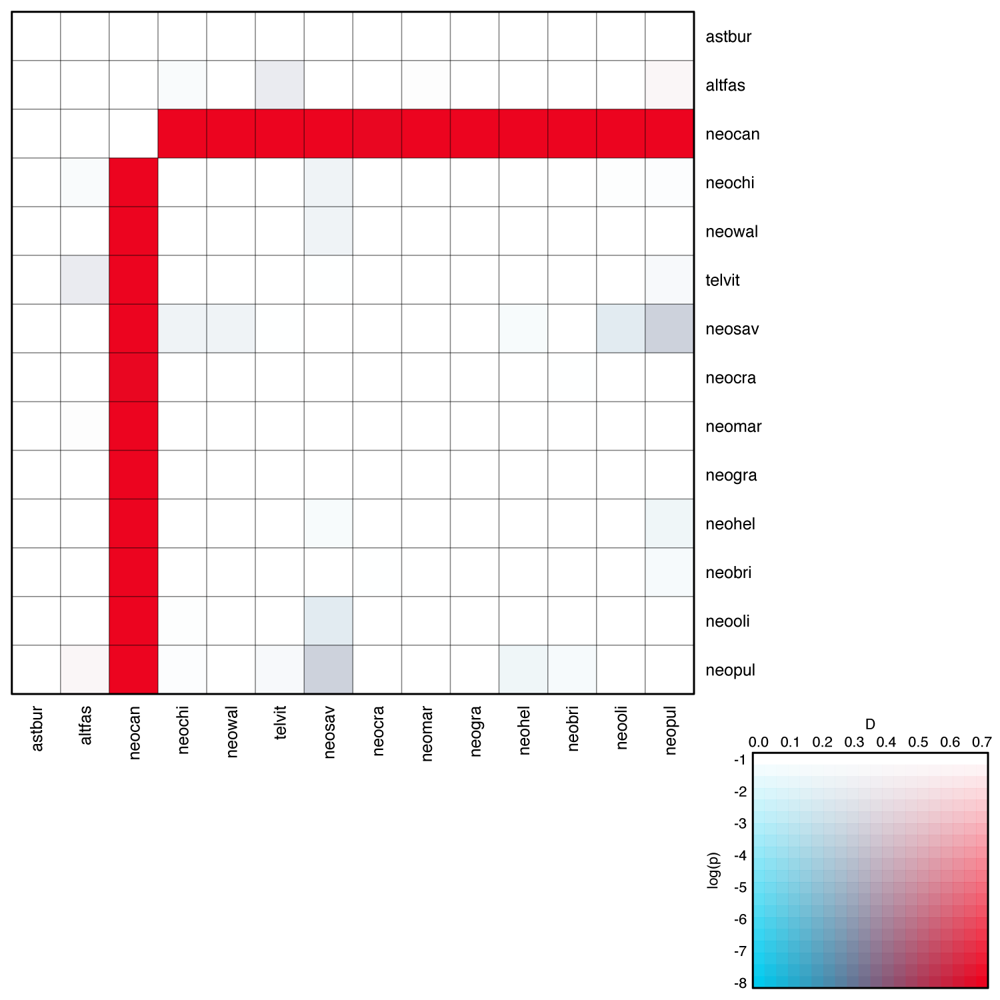
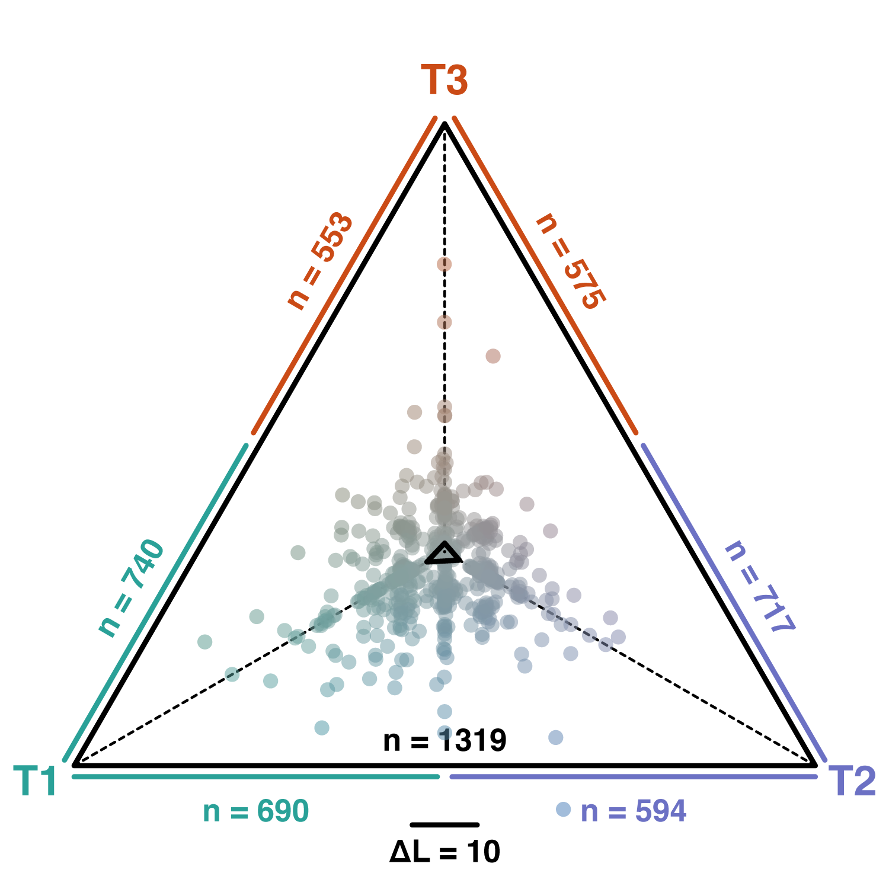

# Analysis of Introgression with Chromosome-Length Alignments

A tutorial on the analysis of hybridization and introgression with whole-chromosome alignments

## Summary

Phylogenetic approaches based on sequence alignments from across the genome can serve as a useful complement to SNP-based analyses for the detection of past introgression events. In contrast to SNP-based analyses such as the ABBA-BABA test, the use of sequence alignments permits the inference of local phylogenies when more than four species are included in the dataset. Importantly, introgression tests based on such sets of phylogenies could be robust to conditions that may produce misleading results in the ABBA-BABA test. In particular, the ABBA-BABA test assumes identical substitution rates for all species and the absence of homoplasies so that derived sites can only be shared if they had the same origin; independent substitutions at the same site are ignored. These conditions assumed by the ABBA-BABA test are likely to hold in sets of recently diverged species, but may be problematic when more divergent species are compared. Phylogenetic approaches based on sequence alignments can therefore serve to verify or reject patterns of introgression determined with SNP-based methods.

On the other hand, the identification of suitable alignment blocks for phylogenetic inference across the genome can be difficult, for example when chromosome-length alignments were generated by read mapping to a distantly related reference species, a process that may result in a large proportion of missing data. One way to compensate for missing data is the use of sufficiently long alignment blocks for phylogenetic analyses, given that there is usually no shortage in overall sequence data in genomic studies. However, the use of long alignment blocks can also be problematic because the probability of within-block recombination, which violates the assumptions of most phylogenetic approaches, increases with the length of the alignment block. To account for this, methods can be applied to identify recombination breakpoints and to filter the alignment blocks accordingly. The accuracy of these methods, however, so far remains questionable, and the consequences of undetected recombination have not been tested thoroughly. Despite these potential caveats, a growing number of phylogenomic studies (e.g. [Gante et al. 2016](https://onlinelibrary.wiley.com/doi/abs/10.1111/mec.13767), [Li et al. 2016](https://genome.cshlp.org/content/early/2015/10/30/gr.186668.114)) uses long sequence alignments from aross the chromosome to detect introgression.

## Table of contents

* [Outline](#outline)
* [Dataset](#dataset)
* [Requirements](#requirements)
* [Genotype phasing](#phasing)
* [Preparing a chromosome-length alignment](#preparing)
* [Identifying alignment blocks for phylogenetic analysis](#blocks)
* [Inferring block phylogenies with IQ-TREE](#iqtree)
* [Analyzing asymmetry of trio topologies](#asymmetry)
* [Simulating recombination with c-genie](#cgenie)
* [Genome-wide genealogy interrogation](#interrogation)

## Outline

In this tutorial I am going to demonstrate how phylogenies from across the genome can be used to infer past introgression events. The alignment blocks used for phylogenetic inference will be extracted from a phased chromosome-length alignment, and they will be filtered according to their proportion of missing data and their frequency of recombination breakpoints to identify the most suitable alignment blocks for phylogenetic analysis. This analysis will then be conducted for each selected alignment block based on maximum likelihood with IQ-TREE. The resulting set of block phylogenies will then be used to determine imbalance among alternative phylogenetic topologies for each species trio, and as in the ABBA-BABA test in tutorial [Analysis of Introgression with SNP data](../analysis_of_introgression_with_snp_data/README.md), these imbalances will be visualized in the form of a heatmap. Additionally, one particular phylogenetic relationships will be analyzed in more detail by plotting differences in likelihood support for competing topological hypotheses.

## Dataset

The dataset used in this tutorial will be a chromosome-length alignment with phased sequences for the same 14 cichlid species that were already used in tutorials [Species-Tree Inference with SNP Data](../species_tree_inference_with_snp_data/README.md) and [Analysis of Introgression with SNP Data](../analysis_of_introgression_with_snp_data/README.md). As in these other tutorials, only data homologous to chromosome 5 of the tilapia (*Oreochromis niloticus*) genome assembly ([Conte et al. 2017](https://bmcgenomics.biomedcentral.com/articles/10.1186/s12864-017-3723-5)) will be used to reduce the computational demand of the analyses. The phased chromosome-length alignment will be generated in the first part of this tutorial based on three different types of input: The VCF file [`NC_031969.f5.sub1.vcf.gz`](data/NC_031969.f5.sub1.vcf.gz) with phased SNP data produced in tutorial [Analysis of Introgression with SNP Data](../analysis_of_introgression_with_snp_data/README.md), the reference sequence for the chromosome from the tilapia assembly, and a set of files in BED format that specify, for each sample, where on the chromosome SNPs could have been detected if there were any of them. Further information on the origin of the genomic dataset can be found in the instructions to tutorial [Species-Tree Inference with SNP Data](../species_tree_inference_with_snp_data/README.md). Note, however, that after phasing the VCF file, the number of samples will be reduced to one per species to limit the run time of the analyses. As in tutorial [Divergence-Time Estimation with SNP Data](../divergence_time_estimation_with_snp_data/README.md), the sample selected per species will be the one with the least amount of missing data. These samples are listed in the table shown below:

| Sample ID | Species ID | Species name                  | Tribe         |
|-----------|------------|-------------------------------|---------------|
| IZC5      | astbur     | *Astatotilapia burtoni*       | Haplochromini |
| AUE7      | altfas     | *Altolamprologus fasciatus*   | Lamprologini  |
| JBD6      | telvit     | *Telmatochromis vittatus*     | Lamprologini  |
| JUH9      | neobri     | *Neolamprologus brichardi*    | Lamprologini  |
| LJC9      | neocan     | *Neolamprologus cancellatus*  | Lamprologini  |
| KHA7      | neochi     | *Neolamprologus chitamwebwai* | Lamprologini  |
| IVE8      | neocra     | *Neolamprologus crassus*      | Lamprologini  |
| JWH2      | neogra     | *Neolamprologus gracilis*     | Lamprologini  |
| JWG9      | neohel     | *Neolamprologus helianthus*   | Lamprologini  |
| JWH4      | neomar     | *Neolamprologus marunguensis* | Lamprologini  |
| JWH6      | neooli     | *Neolamprologus olivaceous*   | Lamprologini  |
| ISB3      | neopul     | *Neolamprologus pulcher*      | Lamprologini  |
| ISA8      | neosav     | *Neolamprologus savoryi*      | Lamprologini  |
| KFD2      | neowal     | *Neolamprologus walteri*      | Lamprologini  |

Moreover, when converting the dataset from VCF into a sequence alignment in Nexus format, only one of the phased haplotypes for each sample will be randomly selected, so that each species is then represented only by a single phased chromosome-length sequence.

## Requirements

* **bcftools:** If you did tutorial [Species-Tree Inference with SNP Data](../species_tree_inference_with_snp_data/README.md), you probably have [bcftools](http://www.htslib.org/doc/bcftools.html) ([Li 2011](https://academic.oup.com/bioinformatics/article/27/21/2987/217423)) installed already. If not, you can find downloads and installation instructions for Mac OS X and Linux at the [HTSlib download webpage](http://www.htslib.org/download/).

* **AliView:** To visualize sequence alignments, the software [AliView](http://www.ormbunkar.se/aliview/) ([Larsson 2014](https://academic.oup.com/bioinformatics/article/30/22/3276/2391211)) is recommended. The installation of AliView is described at [http://www.ormbunkar.se/aliview/](http://www.ormbunkar.se/aliview/) and should be possible on all operating systems.

* **PAUP\* (command-line version):** Unlike in tutorials [Substitution Model Selection](../substitution_model_selection/README.md) and [Species-Tree Inference with SNP Data](../species_tree_inference_with_snp_data/README.md), the command-line version of PAUP* will be required for this tutorial. Precompiled binaries of these versions are available for Mac OS X, Linux, and Windwows from the [PAUP\* website]([http://phylosolutions.com/paup-test/](http://phylosolutions.com/paup-test/)). Download the correct version for your system and place it somewhere on your computer where your system can find it (i.e. in a directory that is included in your [PATH](https://en.wikipedia.org/wiki/PATH_(variable))).

* **IQ-TREE:** Precompiled binaries for Mac OS X, Linux, and Windows are available on [http://www.iqtree.org/#download](http://www.iqtree.org/#download). To install IQ-TREE on any of these systems, download the version for your operating system, and decompress this file on your machine if necessary. In the decompressed directory, you'll find a subdirectory named `bin` and inside of this subdirectory should be a file named `iqtree` or `iqtree.exe`. To easily access this executable from the command line, also place it in a directory that is included in your [PATH](https://en.wikipedia.org/wiki/PATH_(variable))).

* **FigTree:** The program [FigTree](http://tree.bio.ed.ac.uk/software/figtree/) should also already be installed if you followed the tutorials [Bayesian Phylogenetic Inference](../bayesian_phylogeny_inference/README.md) or [Phylogenetic Divergence-Time Estimation](../divergence_time_estimation/README.md). If not, you can download it for Mac OS X, Linux, and Windows from [https://github.com/rambaut/figtree/releases](https://github.com/rambaut/figtree/releases).

* **msprime:** The Python library [msprime](https://msprime.readthedocs.io/en/stable/index.html) [(Kelleher et al. 2016)](http://journals.plos.org/ploscompbiol/article?id=10.1371/journal.pcbi.1004842) will be required for simulations of recombination. The library can be installed with pip for Python 3, using the following command:

		python3 -m pip install --user msprime
		
	The installation can be tested with these commands:
	
		python3 -c 'import msprime'

## Genotype phasing

When sequences used for phylogenetic inference of diploid organisms include heterozygous sites, inference methods like IQ-TREE usually interpret those sites as being ambiguous for two nucleotides, which means that available information (namely that both nucleotides are in fact present) is not used in the analysis. Ignoring this information could lead to shorter inferred branches for highly heterozygous samples and thus potentially to unreliable phylogenetic estimates. A better alternative is thus to "phase" heterozygous sequences before the phylogenetic analysis, and thus, to replace the single sequence per sample that may contain heterozygous sites with two sequences representing the two haplotypes of the diploid sample. In the absence of long sequencing reads such as those generated on the PacBio platform, any attempt at phasing will most likely not succeed in correctly determining both haplotypes across the entire chromosome. Nevertheless, one could expect that at least within the short regions of the genome that are used for individual phylogenetic analyses, the phasing may be correct. And even if only one of the two sequences per sample are ultimately used for the phylogenetic inference (as will be the case here), phasing will increase the amount of information available for the analysis. Because phasing is more reliable with more samples, we are going to perform phasing before, not after, reducing the dataset to one sample per species.

The two programs [BEAGLE](https://faculty.washington.edu/browning/beagle/beagle.html) ([Browning and Browning 2007](https://www.cell.com/ajhg/fulltext/S0002-9297(07)63882-8)) and [SHAPEIT](https://mathgen.stats.ox.ac.uk/genetics_software/shapeit/shapeit.html) ([Delaneau et al. 2012](https://www.nature.com/articles/nmeth.1785)) both allow rapid phasing. From my experience, the performance of both tools is very comparable. BEAGLE, however, has the advantage that it requires no conversion from VCF format into other formats; therefore, we are here going to use BEAGLE.

* Download the Java jar file of the latest version of BEAGLE from the [BEAGLE webpage](https://faculty.washington.edu/browning/beagle/beagle.html), either using a browser or the following command:

		wget https://faculty.washington.edu/browning/beagle/beagle.28Sep18.793.jar

* Have a look at the available options for BEAGLE, which you should see when you start the program without any input, as with the following command:

		java -jar beagle.28Sep18.793.jar

* Almost all of the default settings of BEAGLE are fine for our analysis. We could, however, set the population size estimate used for phasing to a value comparable to the estimate obtained in tutorial [Divergence-Time Estimation with SNP Data](../divergence_time_estimation_with_snp_data/README.md). As this estimate was on the order of 100,000, we'll specify `ne=100000`. According to the [BEAGLE manual](https://faculty.washington.edu/browning/beagle/beagle_5.0_07Sep18.pdf), specifying a correct population size is mainly important when phasing very inbred populations, so this setting is probably not very important in our case. More importantly, make sure to specify that BEAGLE should run on a single CPU with `nthreads=1`. Without this option, BEAGLE will use all CPUs available, which reduces the run time but leads to higher memory requirements that may exceed the available memory on your machine. To run phasing with BEAGLE using a single CPU and up to 4 Gb of memory, run the following command:

		java -jar -Xmx4G beagle.28Sep18.793.jar nthreads=1 ne=100000 gt="NC_031969.f5.sub1.vcf.gz" out="NC_031969.f5.sub1.phased"

	This analysis should take around 7 minutes.

* Have a look at the output file [`NC_031969.f5.sub1.phased.vcf.gz`](res/NC_031969.f5.sub1.phased.vcf.gz) written by BEAGLE, for example with `zless -S` using the following command:

		zless -S NC_031969.f5.sub1.phased.vcf.gz

	You should note that the genotypes are now separated with the pipe symbol "|" instead of the forward slash "/", and that a distinction is now being made between heterozygous genotypes such as "0|1" and "1|0". With unphased data, the lower number was always listed first as in "0/1" because their order did not have a meaning, but after phasing, all alleles before the pipe symbol are considered to form one haplotype while those after the pipe symbol form the other. **Question 1:** Do you also notice something that is unexpected? [(see answer)](#q1)

* Given that we did not run BEAGLE with a reference set of haplotypes, we should probably consider the imputed alleles as being potentially incorrect and misleading for phylogenetic analyses. Thus, it might be safer to undo the imputation before using the dataset for phylogenetic analyses. We can do so by comparing the unphased VCF file [`NC_031969.f5.sub1.vcf.gz`](data/NC_031969.f5.sub1.vcf.gz) with the phased VCF file [`NC_031969.f5.sub1.phased.vcf.gz`](res/NC_031969.f5.sub1.phased.vcf.gz) and by setting all genotypes in the phased VCF file to missing (coded by ".|.") if they were also missing in the unphased VCF file. This can be done with the Ruby script [`mask_imputed_gts.rb`](src/mask_imputed_gts.rb). The script expects as input both the unphased and phased VCF files without their headers; thus, we'll first generate versions of the two files with their headers removed. We can do so with the following commands:

		gunzip -c NC_031969.f5.sub1.vcf.gz | grep -v "#" > original.vcf
		gunzip -c NC_031969.f5.sub1.phased.vcf.gz | grep -v "#" > phased.vcf

* Then, run the script [`mask_imputed_gts.rb`](src/mask_imputed_gts.rb) with the names of the two files generated in the last step as input, followed by the name of a new file, `masked.vcf`, to which the output of the script will be written:

		ruby mask_imputed_gts.rb original.vcf phased.vcf masked.vcf

* Have a look at file `masked.vcf`, for example with using `less -S` as in the following command:

		less -S masked.vcf

	You should see that this file does contain the phased genotypes marked by the pipe ("|") symbol separating the two alleles, but that it also includes missing data just like the unphased file `NC_031969.f5.sub1.vcf.gz` did.
	
* Finally, because the file `masked.vcf` does not contain a header, we will generate a new file containing only the header of the unphased file `NC_031969.f5.sub1.vcf.gz`, and we will combine this file containing only the header with the header-less file `masked.vcf` into a new file. We will also compress the new file at the same time and name it `NC_031969.f5.sub1.phased.masked.vcf.gz`. To do so, use the following two commands:

		gunzip -c NC_031969.f5.sub1.vcf.gz | grep "#" > header.vcf
		cat header.vcf masked.vcf | gzip > NC_031969.f5.sub1.phased.masked.vcf.gz
		
* Before continuing with the next section of the tutorial, you might want to remove some of the larger files generated in the last couple of steps that we will not need anymore. To do so, use the following command:
		
		rm original.vcf header.vcf phased.vcf masked.vcf

## Preparing a chromosome-length alignment

In this part of the tutorial, we are going to prepare a single chromosome-length alignment, including one phased sequence for each of the 14 cichlid species included in the dataset. We are going to need three different sources of information:

1.	The VCF file [`NC_031969.f5.sub1.phased.masked.vcf.gz`](res/NC_031969.f5.sub1.phased.masked.vcf.gz) with phased SNP variation generated in tutorial [Analysis of Introgression with SNP Data](../analysis_of_introgression_with_snp_data/README.md).

2. As the VCF file `NC_031969.f5.sub1.phased.masked.vcf.gz` does not contain information about invariant sites but these are required for phylogenetic inference with IQ-TREE, we assume that the sites between those included in the VCF file are in fact unchanged between the species in the dataset and the tilapia reference sequence. Thus, we'll use the reference sequence for chromosome 5 of tilapia to fill the gaps between SNPs included in the VCF. 		
3. The assumption that sites between SNPs are invariant is only justified for sites in which SNPs could have been called at all if there had been any. This is not the case for all of the sites between the SNPs, due to low sequencing coverage in some regions or low mapping quality in repetitive regions. It would also have been impossible to call SNPs very close to indel variation, because these were filtered when the original VCF file `NC_031969.f5.sub1.vcf.gz` (see tutorial [Species-Tree Inference with SNP Data](../species_tree_inference_with_snp_data/README.md)) was prepared. Thus, we will take into account information about the chromosomal regions in which SNP variation could not have been called in the first place, and we will conservatively set these chromosomal regions to missing, coded by "N", in the generated alignment. The information about callable chromosomal regions is contained in a set of files in [BED format](http://genome.ucsc.edu/FAQ/FAQformat#format1); these files are within a compressed directory named [`masks.tgz`](data/masks.tgz).

* Obtain all required input files and place them in your analysis directory. To download the sequence for chromosome 5 of tilapia from GenBank, you can use the following command:

		wget 'http://www.ncbi.nlm.nih.gov/sviewer/viewer.fcgi?tool=portal&sendto=on&log$=seqview&db=nuccore&dopt=fasta&val=NC_031969.1&extrafeat=0&maxplex=1' -O NC_031969.fasta
		
	The downloaded sequence will in in Fasta format in a file named `NC_031969.fasta`.

* Unless the directory with the files in BED format has already been uncompressed automatically, do so with the following command:

		tar -xzf masks.tgz
		
* Have a look at the content of one of the files in BED format, for example using the following command:

		less masks/AUE7.NC_031969.f5.merged.bed
		
	You'll see that these files contain three columns, as shown in the text below:
	
		NC_031969       0       45144
		NC_031969       45169   88297
		NC_031969       88299   88363
		NC_031969       88365   88370
		NC_031969       88372   98367
		NC_031969       98368   98403
		NC_031969       98405   98409
		NC_031969       98411   98429
		NC_031969       98431   100023
		...
		
	The second and third of these columns indicate the beginning and the end of chromosomal regions that were masked because SNPs in these regions would not have been detected due to low coverage or other reasons. You'll see that these uncallable regions are quite long compared to the callable regions in between them. In the example shown above, only few callable sites were found within the first 100 kbp of the chromosome. Overall, about two thirds of the chromosome are uncallable, which can be explained by a combination of several causes, including mapping to a distant reference, masking of repetitive regions, and rigorous filtering of sites close to insertions and deletions. However, even after conservatively setting all these regions to missing, the remaining sequence information will be sufficient for phylogenetic analysis.

* The three different types of information (the SNP data, the reference sequence, and the information on uncallable regions) will be combined to generate chromosome-length sequences in Fasta format by the Ruby script [`fill_seq.rb`](src/fill_seq.rb). To reduce the memory requirement of this script, we are going to run it separately for each of the samples included in the dataset, and as input for the script we are going to use individual VCF files that contain SNP data only for the respective sample. Prepare these individual VCF files from the full VCF file [`NC_031969.f5.sub1.phased.masked.vcf.gz`](data/NC_031969.f5.sub1.phased.masked.vcf.gz), using the following command (if you copied the VCF file from the analysis directory of tutorial [Analysis of Introgression with SNP Data](../analysis_of_introgression_with_snp_data/README.md), it might be uncompressed; if so, just remove the file extension `.gz` in this command):

		for i in IZC5 AUE7 JBD6 JUH9 LJC9 KHA7 IVE8 JWH2 JWG9 JWH4 JWH6 ISB3 ISA8 KFD2
		do
			bcftools view -s ${i} -o ${i}.NC_031969.f5.masked.vcf NC_031969.f5.sub1.phased.masked.vcf.gz
		done
		
	The above command should have written 14 separate uncompressed VCF files. To make sure that these have been generated, you could use `ls *.NC_031969.f5.masked.vcf`.

* We can now run the script [`fill_seq.rb`](src/fill_seq.rb) to combine, for each sample, the SNP data with the reference sequence and the information on callable regions, using the following command:

		for i in *.NC_031969.f5.masked.vcf
		do
			sample_id=`basename ${i%.NC_031969.f5.masked.vcf}`
			echo -n "Translating file ${i}..."
			ruby fill_seq.rb ${i} NC_031969.fasta masks/${sample_id}.NC_031969.f5.merged.bed ${sample_id}.NC_031969.f5.masked.fasta 1
			echo " done."
		done

	 This should take about ten minutes to finish. As you can see from the command above, the script `fill_seq.rb` expects five command-line arguments. These are, in this order,
	
	* the VCF file with SNP information,
	* the reference sequence in Fasta format,
	* the file in BED format containing information about callable regions,
	* the name of an output file, which will be written in Fasta format.
	* a flag specifying whether only the first, the second, or both phased haplotypes should be written to the output. Here, we arbitrarily chose the first haplotype.

	The script expects that all input files are for a single chromosome only, so we would have to run it multiple times if we would use information from several chromosomes.

* Have a look at one of the Fasta files generated by script `fill_seq.rb`, for example using the following command:

		less -S AUE7.NC_031969.f5.masked.fasta
		
	You'll see that it contains a single sequence, the first haplotype of the phased VCF file.

* Next, combine all sequences into a single file in Fasta format named `NC_031969.f5.masked.fasta`. Because all sequences are already aligned in the same way to the tilapia reference sequence, the combined file will already be perfectly aligned and no realignment with a tool like MAFFT (see tutorial [Multiple Sequence Alignment](../multiple_sequence_alignment/README.md)) will be necessary. The combined Fasta file `NC_031969.f5.masked.fasta` will have a file size of about 500 MB. To combine the sequences, execute the following command:

		cat *.NC_031969.f5.masked.fasta > NC_031969.f5.masked.fasta
		
* You could now remove the per-sample Fasta and VCF files to save disk space, using the following commands:

		rm *.NC_031969.f5.masked.fasta
		rm *.NC_031969.f5.masked.vcf

## Identifying alignment blocks for phylogenetic analysis

After having generated a chromosome-length alignment, we can now apply a sliding-window approach to identify blocks of the alignment that are suitable for phylogenetic analysis. Ideally, the blocks used for phylogenetic analysis should have as little missing data as possible, be as informative as possible, and show no signs of within-block recombination. Thus, we are going to filter alignment blocks based on informativeness and signals of recombination after extracting them from the chromosome-length alignment, and the extraction itself will exclude blocks with a high proportion of missing data.

As the length of each block, we here use 5 kbp, assuming that this length is a good compromise between increasing probability of undetected recombination with longer blocks and decreasing phylogenetic signal with shorter blocks. For a more thorough analysis, however, it might be worth testing this assumption with different block sizes.

* To extract alignment blocks from the chromosome-length alignment, we can use the Ruby script [`extract_blocks.rb`](src/extract_blocks.rb). This script expects four command-line arguments; these are
	* the name of the chromosome-length alignment in Fasta format,
	* the name of a new directory to which all block-alignment files will be written in Nexus format,
	* the size of the alignment blocks,
	* (optionally) a maximum proportion of missing data allowed in alignment blocks.

	Thus, to name the output directory `blocks`, use a block size 5,000 bp, and allow maximally half of the block alignment to consist of missing data, run the script with the following command:
	
		ruby extract_blocks.rb NC_031969.f5.masked.fasta blocks 5000 0.5
		
	**Question 2:** How many alignment blocks were written and how many were removed due to a high proportion of missing data? [(see answer)](#q2)
	
* Have a look at the new directory named `blocks`. Note that the files in this directory are named according to the name of the linkage group and the first and the last position of the alignment block:

		NC_031969.f5.masked_02505001_02509999.nex
		NC_031969.f5.masked_04865001_04869999.nex
		NC_031969.f5.masked_04910001_04914999.nex
		NC_031969.f5.masked_04925001_04929999.nex
		NC_031969.f5.masked_04935001_04939999.nex
		NC_031969.f5.masked_05010001_05014999.nex
		NC_031969.f5.masked_05030001_05034999.nex
		...

* To facilitate the phylogenetic analyses, it will help to simplify the alignment names with the following set of commands.

		for i in blocks/*.nex
		do
			new_name=`echo ${i} | sed 's/\.f5\.masked//g'`
			mv ${i} ${new_name}
		done

* The files in directory `blocks` should now be named like this:

		NC_031969_02505001_02509999.nex
		NC_031969_04865001_04869999.nex
		NC_031969_04910001_04914999.nex
		NC_031969_04925001_04929999.nex
		NC_031969_04935001_04939999.nex
		NC_031969_05010001_05014999.nex
		NC_031969_05030001_05034999.nex
		...

* Pick one of the files in this directory at random, and open it either in a text editor or in AliView just to get a feeling for the size of the alignment block, as well as for its sequence variation and the amount of missing data. You should see something like this:

 Like the alignment shown above, many alignments still contain quite a proportion of missing data due to the strict filtering based on coverage, mapping quality, and indel proximity.

* To filter the alignment blocks by phylogenetic informativeness, we are going to quantify their numbers of parsimony-informative sites. These are the sites at which at least two sequences share a derived site, so that their grouping is supported by this site. In other words, parsimony-informative sites result only from subsitutions on internal branches of the phylogeny, not from those that occur on terminal branches. The Ruby script [`get_number_of_pi_sites.rb`](src/get_number_of_pi_sites.rb) allows the quick calculation of this number from an alignment in Nexus format. Run this script with the following command to quantify the numbers of parsimony-informative sites in all alignment blocks:

		for i in blocks/*.nex
		do
			ruby get_number_of_pi_sites.rb ${i}
		done

	This should show that most alignments contain between 10 and 30 parsimony-informative sites. Particularly those with 10 or less such sites will not be informative enough to fully resolve the phylogeny of the 14 species in the dataset, because even if every internal branch would be supported by only a single substitution, this would require 11 parsimony-informative sites.

* Before applying a threshold on the number of parsimony-informative sites, we are going to quantify the number of so-called hemiplasies in each alignment block as a second criterion for filtering. Simply put, a hemiplasy is a site that supports a grouping that is in conflict with a grouping supported by another site of the same alignment. Possible explanations for hemiplasy include sequencing errors but within-alignment recombination in combination with incomplete lineage sorting can also produce them. And because within-alignment recombination can lead to unreliable phylogenetic inference, this means that alignments with none of few hemiplasies are more suitable for phylogenetic inference than other alignments with many hemiplasies ([Maynard Smith and Smith, 1998](https://academic.oup.com/mbe/article/15/5/590/987861)).

	Fortunately, the number of hemiplasies can easily be approximated as the difference between the number of variable sites and the so-called parsimony score of an alignment, which is the lowest number of substitutions on a phylogeny that is required to produce the alignment (the result is only an approximation because some hemiplasies may increase the parsimony-score by more than 1 if three or more substitutions are required to explain them). To calculate the number of variable sites, the script [`get_number_of_variable_sites.rb`](src/get_number_of_variable_sites.rb) can be used. Before moving on to calculate parsimony scores, first apply this script alone to get a feeling of the number of variable sites in the alignments:
	
		for i in blocks/*.nex
		do
			ruby get_number_of_variable_sites.rb ${i}
		done

	You should see that most alignments have around 40-70 variable sites, but some particularly variable alignments have over 100.

* The calculation of parsimony scores requires that the software PAUP* is installed on the command line, which can be checked with `paup -V`. If PAUP* seems to be working, the BASH script [`get_parsimony_score.sh`](src/get_parsimony_score.sh) can be used to obtain the parsimony score of a Nexus-format alignment. This script performs several steps: It writes a command file for PAUP* which specifies the task that PAUP* should perform as well as the input file, then it runs PAUP* with this command file, it reads the output of PAUP* to extract the parsimony score, and finally, it removes the temporary files that were written by PAUP* to clean up the directory. To see whether this process works well, run script [`get_parsimony_score.sh`](src/get_parsimony_score.sh) with a randomly selected alignment file as in the following command:

		bash get_parsimony_score.sh blocks/NC_031969_08400001_08404999.nex
		
	With this alignment, the parsimony score is 115.
	
* Now, let's combine the different scripts to quantify the parsimony-score and the number of hemiplasies for all alignments, and to record this information in a table. The following block of code will allow this, writing the result to a new file named `block_stats.txt`:

		echo -e "id\tn_pi_sites\tn_hemiplasies" > block_stats.txt
		for i in blocks/*.nex
		do
			id=`basename ${i%.nex}`
			n_pi_sites=`ruby get_number_of_pi_sites.rb ${i}`
			n_variable_sites=`ruby get_number_of_variable_sites.rb ${i}`
			parsimony_score=`bash get_parsimony_score.sh ${i}`
			n_hemiplasies=$((${parsimony_score}-${n_variable_sites}))
			echo -e "${id}\t${n_pi_sites}\t${n_hemiplasies}"
		done >> block_stats.txt

* Have a look at the content of file [`block_stats.txt`](res/block_stats.txt). The first part of the content should be the following, where the number of parsimony-informative sites is written in the second column and the third column contains the (approximated) number of hemiplasies:

		id	n_pi_sites	n_hemiplasies
		NC_031969_02505001_02509999	13	2
		NC_031969_04865001_04869999	6	3
		NC_031969_04910001_04914999	8	6
		NC_031969_04925001_04929999	13	11
		NC_031969_04935001_04939999	5	2
		NC_031969_05010001_05014999	6	1
		NC_031969_05030001_05034999	8	2
		NC_031969_05040001_05044999	9	3
		NC_031969_05065001_05069999	15	11
		NC_031969_05185001_05189999	12	9
		NC_031969_05220001_05224999	19	16
		NC_031969_05230001_05234999	14	7
		NC_031969_05255001_05259999	5	1
		NC_031969_05915001_05919999	44	39
		NC_031969_05920001_05924999	36	37
		...

	It appears that the two values are closely correlated: the more parsimony-informative sites an alignment has the more hemiplasies is contains. This is in part expected because without parsimony-informative sites there could be no hemiplasies. It means, however, that a compromise will need to be made between too little information and too many hemiplasies, indicating within-alignment recombination.
	
* To allow us to decide on appropriate thresholds for the numbers of parsimony-informative sites and hemiplasies, let's plot the two values. In the R environment, you could use the following commands to do so (just type `R` to enter the R environment from the command line):

		table <- read.table("block_stats.txt", header=T)
		pdf("block_stats.pdf", height=7, width=7)
		plot(table$n_pi_sites, table$n_hemiplasies, xlim=c(0,70), ylim=c(0,70), xlab="Parsimony-informative sites", ylab="Hemiplasies")
		abline(a=0, b=1)
		dev.off()

	(to quit the R environment, type `quit(save="no")`). This should produce the plot shown below, written to file [`block_stats.pdf`](res/block_stats.pdf), where the black line indicates the diagonal:

 The fact that some points lie above the diagonal means the these alignments have more hemiplasies than parsimony-informative sites, which can only be explained by site patterns that require more than three changes on even the most parsimonious phylogeny. These results suggest that none of the alignments are free of recombination; therefore, the phylogenies that will be inferred from these alignments may not be completely reliable. Selecting shorter alignment blocks could help to reduce within-alignment recombination; however, this would also further reduce the informativeness of the alignments, which is already low in the current alignments.
	
	Given the above plot, a reasonable choice for filtering the most suitable alignments may be to exclude those with less than 15 parsimony-informative sites, those with more than 30 hemiplasies, and those in which the difference between the numbers of parsimony-informative sites and hemiplasies is less than 5. The added lines in the plot below indicate the selected region of the block (the region to the bottom-right of the three lines):

	
* Remove all block alignments that are considered unsuitable according to the thresholds for the numbers of parsimony-informative sites and hemiplasies and the threshold for the difference between these two numbers. Use the following set of commands to do so:
	
		cat block_stats.txt | tail -n +2 > tmp.txt
		while read line
		do
		    id=`echo ${line} | cut -d " " -f 1`
		    n_pi_sites=`echo ${line} | cut -d " " -f 2`
		    n_hemiplasies=`echo ${line} | cut -d " " -f 3`
			if (( ${n_pi_sites} < 15 )) || (( ${n_hemiplasies} > 30 )) || (( ${n_pi_sites} < ${n_hemiplasies} + 5 ))
			then
				echo "Removing file blocks/${id}.nex"
				rm blocks/${id}.nex
			fi
		done < tmp.txt
		rm tmp.txt

	**Question 3:** How many block alignments remain in the `blocks` directory after applying these thresholds? [(see answer)](#q3)

## Inferring block phylogenies with IQ-TREE

In this part of the tutorial, we are going to infer phylogenies for each remaining alignment block; the set of inferred phylogenies will subsequently be used to determine asymmetries in the topologies of species trios which can serve as an indicator for introgression. Note that it may in fact be important for this subsequent test that the set of phylogenies is generated based on maximum likelihood, without assuming a clock model as in BEAST2 analyses. While this conclusion should be tested in more detail, I found in preliminary analyses that clock-rate variation among species may influence the frequencies of species-trio topologies in time-calibrated analyses, but that it has no or only weak effect on maximum-likelihood inference without a clock model. As a result, I also do not recommend any longer to use the related approach of [Meyer et al. (2017)](https://academic.oup.com/sysbio/article/66/4/531/2670093), in which asymmetry in divergence times among species trios was used to infer introgression.

* As in tutorials [Maximum-Likelihood Phylogenetic Inference](../ml_phylogeny_inference/README.md) and [Maximum-Likelihood Species-Tree Inference](../ml_species_tree_inference/README.md), we are going to use IQ-TREE for maximum-likelihood phylogenetic inference and by not specifying a substitution model we allow IQ-TREE to automatically select the best-fitting model itself. No bootstrap replicates are required this time, but we will need to specify the sample ID for the included individual of *Astatotilapia burtoni*, IZC5, as the outgroup, so that the resulting trees are rooted. To run IQ-TREE for all alignments, use the following command:

		for i in blocks/*.nex
		do
			iqtree -s ${i} -o IZC5
		done

	IQ-TREE should require around 10 minutes to finish this set of analyses.
	
* Combine all inferred phylogenies into a single file, using the following command:

		cat blocks/*.treefile > block_phylogenies.trees
		
* You could then remove all output files produced by IQ-TREE to clean up the directory:

		rm blocks/*.nex.*

* Before analyzing asymmetry in the topologies of species trios in the next section of the tutorial, we'll first replace the sample IDs in the tree file [`block_phylogenies.trees`](res/block_phylogenies.trees) with the corresponding species names; this will facilitate the interpretation of the results. To prepare this translation, write the following table of sample IDs and species names to a new file named `samples.txt` (note that the content of this file is different from other files with the same name used in other tutorials):

		IZC5	astbur
		AUE7	altfas
		JBD6	telvit
		JUH9	neobri
		LJC9	neocan
		KHA7	neochi
		IVE8	neocra
		JWH2	neogra
		JWG9	neohel
		JWH4	neomar
		JWH6	neooli
		ISB3	neopul
		ISA8	neosav
		KFD2	neowal
		
	When writing the above text to file `samples.txt`, make sure that the last line ends with a line break.

* To then replace all sample IDs in the tree file [`block_phylogenies.trees`](res/block_phylogenies.trees) and write a new file named `block_phylogenies.renamed.trees`, you can use the following set of commands:

		cp block_phylogenies.trees tmp.trees
		while read line
		do
			sample_id=`echo ${line} | cut -d " " -f 1`
			species_name=`echo ${line} | cut -d " " -f 2`
			cat tmp.trees | sed "s/${sample_id}/${species_name}/g" > tmp2.trees
			mv -f tmp2.trees tmp.trees
		done < samples.txt
		mv tmp.trees block_phylogenies.renamed.trees

* You may want to browse through some of the block phylogenies to get a feeling of how reliable they are. To do so, open file [`block_phylogenies.renamed.trees`](res/block_phylogenies.renamed.trees) in FigTree. The first block phylogeny should look similar to the one shown in the screenshot below:

 This block phylogeny is rather different from the species tree inferred with SNAPP in tutorial [Species-Tree Inference with SNP Data](../species_tree_inference_with_snp_data/README.md). For comparison, this species tree is shown in the next screenshot:

 For example, the species tree strongly supports monophyly of *Neolamprologus chitamwebwai* ("neochi") and *N. walteri* ("neowal"), but the latter species is closer to *Telmatochromis vittatus* ("telvit") in the block phylogeny. Such differences can of course be due to incomplete lineage sorting, but they could also arise from low information content of the alignment. Browse through some of the other block phylogenies contained in file [`block_phylogenies.renamed.trees`](res/block_phylogenies.renamed.trees) by clicking on on arrows at the top right of the FigTree window.

* Finally, we could quantify the differences between all block phylogenies and the species tree generated with SNAPP. The [Robinson-Foulds distance](https://en.wikipedia.org/wiki/Robinson–Foulds_metric), measuring the number of nodes that one would need to change to convert one tree into the other, would be suitable to quantify this differene and can quickly be calculated with IQ-TREE (as in tutorial [Maximum-Likelihood Phylogenetic Inference](ml_phylogeny_inference)). To do so, use file [`snapp.nwk`](data/snapp.nwk), which is a version of the species tree in Newick format. Then, calculate the Robinson-Foulds distance between all block phylogenies and the species tree with the following command:

		iqtree -t block_phylogenies.renamed.trees --tree-dist2 snapp.nwk

	The screen output should indicate that the results were written to a file named `block_phylogenies.renamed.trees.rfdist`.
	
* Have a look at file [`block_phylogenies.renamed.trees.rfdist`](res/block_phylogenies.renamed.trees.rfdist), for example with the `less` command. This should show that most block phylogenies have a Robinson-Foulds distance to the species tree around 20. This is quite high and indicates either very pervasive incomplete lineage sorting, very low information content in the alignments, or both. But as we will see, the collection of block phylogenies will nevertheless be very useful to identify introgression.

## Analyzing asymmetry of trio topologies

Analogous to the logic behind the ABBA-BABA test in tutorial [Analysis of Introgression with SNP Data](../analysis_of_introgression_with_snp_data/README.md), asymmetry in the topologies of species trios can be used to identify past introgression. In the absence of introgression, we would expect that local phylogenies of three species P1, P2, and P3 most frequently support the topology of the true species tree (e.g. a clade formed by P1 and P2 if these are in fact sister species), and that the two alternative topologies (e.g. a clade formed by P1 and P3 or a clade formed by P2 and P3) should occur equally frequently. A significant difference in the frequencies of the two alternative topologies is therefore not compatible with a null hypothesis of no introgression, meaning that such a significant difference would support the occurrence of past introgression. An important difference to the ABBA-BABA test may be that the analysis of tree asymmetry could be more robust to rate variation among species; however, this hypothesis remains to be tested with simulations.

To analyze the frequencies of alternative trio topologies in the set of block phylogenies, we can use the Ruby script [`analyze_tree_asymmetry.rb`](src/analyze_tree_asymmetry.rb). This script should work well with any file that contains a set of trees in Newick format. It determines the set of species in these trees and then tests for each possible species trio how often two of the three species form a pair relative to the third species. These frequencies are then used to place the three species in positions P1, P2, and P3 so that

*N*(P1,P2) > *N*(P2,P3) > *N*(P1,P3),

where *N*(P1,P2) is the frequency at which P1 and P2 form a pair, *N*(P2,P3) is the frequency of pairs formed by P2 and P3, and *N*(P1,P3) is the frequency of pairs formed by P1 and P3. An equivalent to the *D*-statistic is then calculated as

*D* = (*N*(P2,P3) - *N*(P1,P3)) / (*N*(P2,P3) + *N*(P1,P3))

and a *p*-value for the null hypothesis of no imbalance between *N*(P1,P3) and *N*(P2,P3) is calculated based on a [binomial test](https://en.wikipedia.org/wiki/Binomial_coefficient).

* To quantify tree asymmetry, run the script [`analyze_tree_asymmetry.rb`](src/analyze_tree_asymmetry.rb) with the tree file [`block_phylogenies.renamed.trees`](res/block_phylogenies.renamed.trees), and specify that the output should be written to a new file named `block_topology_frequencies.txt`, using the following command:

		ruby analyze_tree_asymmetry.rb block_phylogenies.renamed.trees block_topology_frequencies.txt

* Have a look at the file [`block_topology_frequencies.txt`](res/block_topology_frequencies.txt) produced by script `analyze_tree_asymmetry.rb`, for example using the `less` command:

		less block_topology_frequencies.txt

	The content of this file should show results similar to the following:
	
		p1        p2        p3         n(p1,p2)  n(p2,p3)  n(p1,p3)    d         p
		neobri    altfas    astbur           66         0         0    0.000    1.00000000
		neocan    altfas    astbur          183         0         0    0.000    1.00000000
		neochi    altfas    astbur           66         0         0    0.000    1.00000000
		neocra    altfas    astbur           61         0         0    0.000    1.00000000
		neogra    altfas    astbur           62         0         0    0.000    1.00000000
		neohel    altfas    astbur           61         0         0    0.000    1.00000000
		neomar    altfas    astbur           67         0         0    0.000    1.00000000
		neooli    altfas    astbur           63         0         0    0.000    1.00000000
		neopul    altfas    astbur           67         0         0    0.000    1.00000000
		neosav    altfas    astbur           60         0         0    0.000    1.00000000
		neowal    altfas    astbur           67         0         0    0.000    1.00000000
		telvit    altfas    astbur           76         0         0    0.000    1.00000000
		altfas    neocan    neobri          171        60         7    0.791    0.00000000
		neobri    neochi    altfas          162        43        33    0.132    0.30187249
		neocra    neobri    altfas          204        19        15    0.118    0.60759136
		...

	The format of this file is similar to that written by the program Dsuite in tutorial [Analysis of Introgression with SNP Data](../analysis_of_introgression_with_snp_data/README.md). Each row includes results for one species trio, with the frequencies of the three alternative topologies in columns 4 to 6, followed by the equivalent to the *D*-statistic in the seventh column and the *p*-value in the last. The species trios in the first couple of rows all include *Astatotilapia burtoni* ("astbur"), and because this species was set to be the outgroup, it is not surprising that the frequencies *N*(P1,P3) and *N*(P2,P3) are 0. The reason why only a proportion of the 238 filtered block phylogenies support *N*(P1,P2) is that, as in the screenshot of a block phylogeny shown above, IQ-TREE places the outgroup with another species in a polytomy at the root, and the script [`analyze_tree_asymmetry.rb`](src/analyze_tree_asymmetry.rb) ignores trios connected by polytomies. But since the frequencies of topologies in species trios that include the outgroup are by definition never asymmetric, we can ignore these comparisons anyway. More conclusive results are shown in the subsequent rows of the table, for example for the trio of "altfas", "neocan", and "neobri", where 171 block phylogenies pair "altfas" and "neocan" and 60 phylogenies pair "neocan" and "neobri", but only 7 phylogenies pair "altfas" and "neobri". As indicated by the high *D*-statistic around 0.8 and the *p*-value of 0, this asymmetry can not be explained by incomplete lineage sorting alone. **Question 4:** Which species trio has the highest *D*-statistic in this table? [(see answer)](#q4)

* A good way of plotting the asymmetry among alternative trio topologies, and the significance of this asymmetry, is in the form of a heatmap, just like the results of the Dsuite analyses were plotted in tutorial [Analysis of Introgression with SNP Data](../analysis_of_introgression_with_snp_data/README.md). This heatmap plot can be generated with the Ruby script [`plot_tree_asymmetry.rb`](src/plot_tree_asymmetry.rb). This script requires the following four command-line arguments:

	* the name of the file produced by script `analyze_tree_asymmetry.rb`,
	* the name of a file that lists the order in which the species should be listed along the heatmap axes,
	* the *D*-statistic corresponding to the end of the color range used in the plot,
	* the name of the output file, which will be in scalable vector graphic (SVG) format.

	Thus, the only input that is still missing is the file specifying the order in which species should be plotted. To generate this file, simply copy the list below and save it in a file named `species_order.txt`:

		astbur
		altfas
		neocan
		neochi
		neowal
		telvit
		neosav
		neocra
		neomar
		neogra
		neohel
		neobri
		neooli
		neopul

* Use script [`plot_tree_asymmetry.rb`](src/plot_tree_asymmetry.rb) with files [`block_topology_frequencies.txt`](res/block_topology_frequencies.txt) and [`species_order.txt`](res/species_order.txt) as input, specify a maximum *D*-statistic of 0.7, and name the output file `block_topology_frequencies.svg`:

		ruby plot_tree_asymmetry.rb block_topology_frequencies.txt species_order.txt 0.7 block_topology_frequencies.svg

	Open the output file [`block_topology_frequencies.svg`](res/block_topology_frequencies.svg) with a program capable of reading files in SVG format, for example with a browser such as Firefox or with Adobe Illustrator. The heatmap plot should look as shown below:

	The by far strongest signal is shown for comparisons of *Neolamprologus cancellatus* ("neocan") and either other species of the genus *Neolamprologus* or *Telmatochromis vittatus* ("telvit"). While this heatmap does not allow us to tell whether "neocan" was in the P2 or P3 position in those trios that produced these large *D*-statistics, a comparison with file [`block_topology_frequencies.txt`](res/block_topology_frequencies.txt) reveals that the largest *D*-statistics result from trios that have "neocan" in the P2 position. This can be confirmed e.g. with the following command:
	
		cat block_topology_frequencies.txt | tail -n +2 | sort -n -k 7 -r | less

	The patterns of topology asymmetry therefore strongly support introgression between *Neolamprologus cancellatus* ("neocan") and either another *Neolamprologus* or *Telmatochromis vittatus* ("telvit"). Given that the highest *D*-statistic is found for the trio with *Telmatochromis vittatus*, these results therefore corroborate those obtained in tutorial [Analysis of Introgression with SNP Data](../analysis_of_introgression_with_snp_data/README.md), according to which *Neolamprologus cancellatus* is formed by hybridization between *Altolamprologus fasciatus* and *Telmatochromis vittatus*. In combination with this conclusion from the other tutorial, the results obtained here actually also confirm that the phasing done with BEAGLE did not resolve the haplotypes correctly across the entire chromosome. If this had been the case and the *Neolamprologus cancellatus* would in fact be first-generation hybrids, then all of the sequences from the first haplotype that we used should have grouped consistently with the same parental species.

As we have seen in this part of the tutorial, the observed topology frequencies support introgression among the cichlid species included in our dataset and are consistent with the hypothesis from tutorial [Analysis of Introgression with SNP Data](../analysis_of_introgression_with_snp_data/README.md) that *Neolamprologus cancellatus* is a first-generation hybrid between *Altolamprologus fasciatus* and *Telmatochromis vittatus*. The results are more ambiguous regarding other introgression events among *Neolamprologus* species, such as that identified between *N. brichardi* and *N. pulcher* by [Gante et al. (2016)](https://onlinelibrary.wiley.com/doi/abs/10.1111/mec.13767) and [Bouckaert et al. (2019)](https://journals.plos.org/ploscompbiol/article?id=10.1371/journal.pcbi.1006650); however, considering that we only used data from a single chromosome and just a single sample per species, more definite conclusions could certainly be gained from more extensive analyses!

## Simulating recombination with c-genie

One assumption underlying the phylogenetic analyses in this tutorial is that the alignment blocks used for tree inference are free of recombination. If this assumption should be violated, the consequences for the accuracy of the phylogenetic analyses as well as all analyses of introgression based on these phylogenies would be difficult to predict. Given that we excluded alignments with high numbers of hemiplasies, one could probably argue that we minimized the possible effect of recombination sufficiently, so that our conclusions based on the inferred phylogenies may be reliable. However, how certain can we be that recombination is really absent from the alignments? And how would our inference be influenced if it was not? 

These questions are so far rather poorly answered, even though they are actively debated in the recent literature (e.g. [Springer and Gatesy 2016](https://www.sciencedirect.com/science/article/pii/S1055790315002225); [Edwards et al. 2016](https://www.sciencedirect.com/science/article/pii/S1055790315003309?via%3Dihub)). One way to approach the problem is with simulations: We could simulate how probable it would be to actually have not even a single recombination breakpoint in an alignment of a certain length, and simulated sequences could also be used to test the reliability of phylogenetic inference under these conditions. In one such study, [Lanier and Knowles (2012)](https://academic.oup.com/sysbio/article/61/4/691/1637909) concluded that within-alignment recombination had no noticeable effect on species-tree reconstruction; however, the simulations used in this study were for a rather small set of species, and it is not clear if the results would hold for larger phylogenies. Furthermore, the possible effects of within-alignment recombination on phylogenomic tests for introgression have so far not been tested.

To address at least the question of how probable the absence of recombination is in alignment blocks of 5 kbp, we can use the Python program [c-genie](https://github.com/mmatschiner/c-genie) (Malinsky and Matschiner; unpublished). This program simulates phylogenetic histories with recombination and calculates the average length of "c-genes" ("coalescent genes"; [Doyle 1995](https://www.jstor.org/stable/2419811)), genomic regions uninterrupted by recombination. In addition, c-genie also calculates the lengths of "single-topology tracts", fragments sharing the same tree topology even though recombination within these fragments might have led to variable branch lengths in different parts of the fragment. The length of these single-topology tracts might be more relevant for phylogenetic analysis, because one could argue that only those recombination breakpoints that change the tree topology within an aligment have negative consequence for phylogenetic inference while those breakpoints that only change the branch lengths are safe to ignore.

As the probability of recombination depends on many factors, including the recombination rate, the generation time, the length of branches in the species tree, and the population size, c-genie requires estimates for these parameters as input. Conveniently, we can use the species tree as well as the population size estimate inferred by SNAPP in tutorial [Divergence-Time Estimation with SNP Data](../divergence_time_estimation_with_snp_data/README.md) for the simulations with c-genie. In addition, we'll assume (as in other tutorials) again a generation time of 3 years for cichlid fishes and a recombination rate of 2&times;10-8 per generation.

* Start by download the c-genie program from its [github repository](https://github.com/mmatschiner/c-genie), using the following command:

		wget https://raw.githubusercontent.com/mmatschiner/c-genie/master/c-genie

* Make c-genie executable with this command:

		chmod +x c-genie

* Then, have a look at the help text of c-genie with this command:

		./c-genie -h
		
	You'll see that besides calculating the lengths of c-genes and single-topology tracts, c-genie also allows the simulation of alignments with recombination, which can then be used to test the accuracy of phylogenetic methods in the presence of within-alignment recombination. Here, however, we will use c-genie only to find out how plausible the assumed absence of recombination in our 5 kbp-alignment blocks really is.
	
* You may also have noticed from c-genie's help text that a generation time of 3 years and a recombination rate of 2&times;10-8 are already the default values for these two parameters; thus, we only need to specify the species tree and the population size estimate from the SNAPP analysis in tutorial [Divergence-Time Estimation with SNP Data](../divergence_time_estimation_with_snp_data/README.md).

* Run c-genie with file [`snapp.tre`](data/snapp.tre) as the species tree, "lamprologini" as the prefix for the file, and an assumed population size of 100,000, according to the estimate from the SNAPP analysis:

		./c-genie snapp.tre lamprologini -n 100000

	This anaysis should finish within a few minutes.
	
* As you will see from the screen output of c-genie, an output file in HTML format has been written to file [`lamprologini.html`](res/lamprologini.html). Open this HTML file in a web browser such as Firefox and scroll through the plots included in this file.

	**Question 5:** What are the mean lengths of c-genes and single-topology tracts? What is the probability that an alignment of 5 kbp includes just one c-gene or one single-topology tract? [(see answer)](#q5)

* Repeat the simulations with different assumptions for the population size to see how these assumptions inluence the resulting lengths of c-genes and single-topology tracts.

There are some reasons why the lengths of c-genes and single-topology tracts may not be as short in practice as the results of c-genie may suggest. For example, undetected past population bottlenecks would reduce the amount of incomplete lineage sorting, which could extend the length of both types of fragments. In addition, the presence of "recombination deserts" ([Yu et al. 2001](https://www.nature.com/articles/35057185)) could lead to some very large c-genes and single-topology tracts. Nevertheless, it is important to be aware of the possible presence of recombination within the alignments used for phylogenetic inference. While the study of [Lanier and Knowles (2012)](https://academic.oup.com/sysbio/article/61/4/691/1637909) as well as preliminary analyses with c-genie suggest that within-alignment recombination may in fact not have a strong influence on the inference of the species-tree topology, the consequences for divergence-time estimates and downstream analyses of introgression are less clear and should be investigated in future studies.

## Genome-wide genealogy interrogation

When recombination is frequent in genome-length alignments, as suggested for the clade of cichlid fishes by the above simulations, the use of short genomic regions for phylogenetic analyses could help to avoid the issues of within-alignment recombination. Unfortunately, such short regions often do not have sufficient information to provide reliable phylogenies of entire clades; however, they can still be very useful to investigate phylogenetic relationships at one particular node, in a method termed genealogy interrogation by [Arcila et al. (2017)](https://www.nature.com/articles/s41559-016-0020). When using this method, each alignment is used repeatedly in maximum-likelihood phylogenetic analyses, each time with a different topological constraint for a particular relationship. The results of interest in these constrained analyses are then not the inferred phylogenies, but the likelihoods obtained with the different constraints. Even with alignments that are too short to resolve much of the phylogeny, those likelihoods can differ to the extent that it is possible to discriminate the support for the different topological hypotheses, as the hypothesis leading to the highest likelihoods for most alignments could then be considered to correspond to the species-tree topology. Moreover, asymmetry in the likelihood values supporting the two alternative topologies can again indicate whether these alternative topologies result from incomplete lineage sorting and low phylogenetic signal or whether introgression has influenced their frequencies.

In this part of the tutorial, we are going to apply genealogy interrogation to investigate, in more detail than above, the relationship among the three species *Neolamprologus brichardi* ("neobri"), *Neolamprologus pulcher* ("neobri"), and *Neolamprologus olivaceous* ("neooli"). Among these species, introgression between *Neolamprologus brichardi* and *Neolamprologus pulcher* was inferred in the studies of [Gante et al. (2016)](https://onlinelibrary.wiley.com/doi/abs/10.1111/mec.13767) and [Bouckaert et al. (2019)](https://journals.plos.org/ploscompbiol/article?id=10.1371/journal.pcbi.1006650), but did not seem to receive much support in the above analysis of block-topology frequencies.

* Have a look once again at the file [`block_topology_frequencies.txt`](res/block_topology_frequencies.txt) to find the results for the species trio "neobri", "neopul", and "neooli". You could use the following command to do so:

		cat block_topology_frequencies.txt | grep neobri | grep neopul | grep neooli

	This should show that "neooli" and "neopul" are most frequently found as sister species, and that the *D*-statistic equivalent for this trio is around 0.18, with a *p*-value that is close to significance or barely significant. In my analyses, "neopul" and "neobri" formed a pair in 79 phylogenies while the other alternative topology, grouping "neooli" and "neobri", occurred 55 times. The difference between these frequencies of the alternative topologies is not large. Whether or not this difference occurred by chance or resulted from introgression between "neopul" and "neobri" is therefore difficult to tell from these results. To obtain more conclusive evidence for or against introgression among these species, a larger set of alignments might thus be required. While our dataset does not allow the extraction of more alignments of the same size as before, we can extract a larger number of shorter alignments that, even if they would not be sufficiently informative for full phylogenetic analyses, could be useful for genealogy interrogation.

* Use the Ruby script [`extract_blocks.rb`](src/extract_blocks.rb) once again to extract alignment blocks from the chromosome-length alignment `NC_031969.f5.masked.fasta`, this time with a shorter size of 1,000 bp and a maximum proportion of missing data of 0.35:

		ruby extract_blocks.rb NC_031969.f5.masked.fasta short_blocks 1000 0.35

* Check how many alignments were extracted this time, using the following command:

		ls short_blocks/*.nex | wc -l

	This should show that 1,398 alignments were extracted.

* Next, we'll need to specify the three topological hypotheses that we want to compare. For IQ-TREE to understand these hypotheses, we'll need to write them as constraints in Newick format. This is actually rather simple because we only need to write all sample IDs, separated by commas, within parentheses and we need to use one additional pair of parentheses to group the samples of the two species that form a pair in a given hypothesis. For example, the hypothesis that "neooli" and "neopul", represented by samples JWH6 and ISB3, respectively, form a pair can be encoded in Newick format as "(IZC5,AUE7,JBD6,LJC9,KHA7,IVE8,JWH2,JWG9,JWH4,ISA8,KFD2,JUH9,(JWH6,ISB3));". We call this hypothesis "T1" and label the two alternative hypotheses, in which either "neopul" and "neobri" or "neooli" and "neobri" form a pair, "T2" and "T3", resepectively. To save these three hypotheses to files in Newick format named `t1.tre`, `t2.tre`, and `t3.tre`, you could use the three following commands:

		echo "(IZC5,AUE7,JBD6,LJC9,KHA7,IVE8,JWH2,JWG9,JWH4,ISA8,KFD2,JUH9,(JWH6,ISB3));" > t1.tre
		echo "(IZC5,AUE7,JBD6,LJC9,KHA7,IVE8,JWH2,JWG9,JWH4,ISA8,KFD2,JWH6,(JUH9,ISB3));" > t2.tre
		echo "(IZC5,AUE7,JBD6,LJC9,KHA7,IVE8,JWH2,JWG9,JWH4,ISA8,KFD2,ISB3,(JWH6,JUH9));" > t3.tre

* We are then ready to run IQ-TREE with each alignment and each topological constraint. To allow the resulting likelihoods to be comparable, we will ensure that the same substitution model is used in all analyses rather than using IQ-TREE's automatic model selection; therefore, we specify the GTR substitution model with the `-m` option in all analyses. In addition, we need to specify the topological constraint file with the `-g` option, and we turn off the verbose screen output of IQ-TREE with the `--quiet` option. Thus, the set of commands to run IQ-TREE with all alignments and constraints is the following:

		for i in short_blocks/*.nex
		do
			# Run iqtree with the t1 hypothesis.
			iqtree -s ${i} -m GTR -g t1.tre --quiet
			
			# Rename the main output and remove unneeded output files.
			mv ${i}.iqtree ${i%.iqtree}.t1.log
			rm ${i}.*
			
			# Run iqtree with the t2 hypothesis.
			iqtree -s ${i} -m GTR -g t2.tre --quiet
			
			# Rename the main output and remove unneeded output files.
			mv ${i}.iqtree ${i%.iqtree}.t2.log
			rm ${i}.*
			
			# Run iqtree with the t3 hypothesis.
			iqtree -s ${i} -m GTR -g t3.tre --quiet
			
			# Rename the main output and remove unneeded output files.
			mv ${i}.iqtree ${i%.iqtree}.t3.log
			rm ${i}.*
		done

	These analyses should take around half an hour to finish. However, instead of waiting this long, you could also replace your `short_blocks` directory with a version of it in which all IQ-TREE results are already present. If you prefer to do so, download the compressed directory [`short_blocks.tgz`](res/short_blocks.tgz), place it in your analysis directory, and uncompress it with `tar -xzf short_blocks.tgz`.
	
	The `short_blocks` directory should then contain three files with endings `.t1.log`, `.t2.log`, and `.t3.log`.
	
* Have a look one of the files with ending `.t1.log`, e.g. file [`NC_031969.f5.masked_00581001_00581999.t1.log`](res/NC_031969.f5.masked_00581001_00581999.t1.log), using the `less` command:

		less short_blocks/NC_031969.f5.masked_00581001_00581999.t1.log
		
	When you scroll down to just below "MAXIMUM LIKELIHOOD TREE", you should see a line like the following:
	
		Log-likelihood of the tree: -1404.8564 (s.e. 58.5720)
		
	This number, the log-likelihood of -1404.8564, is the only result of this IQ-TREE analysis that we need for genealogy interrogation.
	
* Compare the log-likelihoods among the three different hypotheses for the first alignment, using the following command:

		cat short_blocks/NC_031969.f5.masked_00581001_00581999.t?.log | grep "Log-likelihood"
		
	This should show output similar to the one below:
	
		Log-likelihood of the tree: -1404.8564 (s.e. 58.5720)
		Log-likelihood of the tree: -1404.3751 (s.e. 58.4653)
		Log-likelihood of the tree: -1401.8835 (s.e. 57.5254)
		
	So this means that the first two hypotheses, T1 and T2, had a very similar likelihood while the likelihood of the third hypothesis, T3, was about three log units higher and thus better.
	
* To extract and compare the log-likelihood values from the output files of all IQ-TREE analyses, we can use the BASH script [`summarize_ggi.sh`](src/summarize_ggi.sh). This script expects two arguments, namely the name of a directory in which it can find the files with endings `.t1.log`, `.t2.log`, and `.t3.log`, and the name of a new file to which its output will be written. We'll use `short_blocks_ggi.txt` as the name of this output file; thus, run the script with this command:
	
		bash summarize_ggi.sh short_blocks short_blocks_ggi.txt

* Have a look at the output file [`short_blocks_ggi.txt`](res/short_blocks_ggi.txt). You'll see that each line reports the comparison of likelihoods for one alignment. The second column specifies the hypothesis that received the best likelihood, and the third column indicates the difference between this likelihood and the second-best likelihood, in log units. The last three columns show the log-likelihoods themselves.

* The output in file [`short_blocks_ggi.txt`](res/short_blocks_ggi.txt) can be analyzed and plotted with the Ruby script [`plot_ggi.rb`](src/plot_ggi.rb), specifying [`short_blocks_ggi.txt`](res/short_blocks_ggi.txt) as the name of the input file and `short_blocks_ggi.svg` as the name of the output file to which the plot will be written in SVG format:

		ruby plot_ggi.rb short_blocks_ggi.txt short_blocks_ggi.svg

* Open the output file [`short_blocks_ggi.svg`](res/short_blocks_ggi.svg) with Firefox, Adobe Illustrator, or another program capable of reading SVG format. The plot should look similar to the one shown below:

 In this plot, each dot represents one alignment, and the position of the dot indicates the difference in likelihood support among the three competing hypotheses. If a dot is directly on the dashed line leading towards T1 at the bottom-left, this alignment has the best likelihood when using the T1 hypothesis and identical likelihoods when the other two hypotheses are used as constraints. When the two alternative hypotheses have different likelihoods (but both are lower than the best likelihood), then the dot is not placed directly on a dashed line but in one of the regions between them. A dot in the very center of the plot would represent an alignment that has the exact same likelihood no matter which hypothesis is used; this alignment would therefore be entirely uninformative. The black triangle near the middle of the plot connects the mean likelihoods, drawn on the three axes, of alignments that support the hypothesis corresponding to those axes. Thus, the further the central black triangle points towards the three hypotheses, the more these are supported overall. In the above plot, this central black triangle mostly indicates support for hypotheses T1 and T2 but less for T3. Finally, the numbers outside the plot indicate how many alignments have better support with T1 than with T2 or vice versa (at the bottom), better support with T2 than with T3 or vice versa (at the right), and better support with T1 than with T3 or vice versa (at the left). For example, in the above plot, 690 alignments support T1 over T2, and 594 alignments support T2 over T1.

	Overall, most alignments seem to support T1, followed by T2. Genealogy interrogation therefore supports the hypothesis that *Neolamprologus olivaceous* and *Neolamprologus pulcher* form sister species in the species tree, in line with the results obtained in tutorial [Divergence-Time Estimation with SNP Data](../divergence_time_estimation_with_snp_data/README.md). However, genealogy interrogation further shows that the support for the two alternative topologies T2 and T3 is not balanced, instead 717 alignments support T2 over T3 and only 575 alignments support T3 over T2. This imbalance corroborates the conclusions of [Gante et al. (2016)](https://onlinelibrary.wiley.com/doi/abs/10.1111/mec.13767) and [Bouckaert et al. (2019)](https://journals.plos.org/ploscompbiol/article?id=10.1371/journal.pcbi.1006650), according to which introgression occurred between *Neolamprologus pulcher* and *Neolamprologus brichardi*.

As the analyses in this part of the tutorial have shown, genealogy interrogation can be useful to resolve relationships and identify introgression at one selected node of a phylogeny. The good thing about this type of analysis is that short and rather uninformative alignments can be used, which reduces the degree to which the analyses could be influenced by within-alignment recombination. Importantly, the fact that short alignments are sufficient also means that genealogy interrogation can be applied to datasets that consist exclusively of short alignments, such as RADseq data, opening up new possibilities for phylogenetic analyses and introgression tests in studies based on such datasets.

 

                   

## Answers

* **Question 1:** You might have noticed that the file does not contain any missing data anymore, as shown in the text below. This is because the imputation that is part of phasing with BEAGLE does exactly that: it replaces missing data with "imputed" alleles that are estimated based on the alleles present in other samples. This approach may work well with population-level data for model species where a reference set of haplotypes is available (such a reference set can be passed to BEAGLE with the `ref=` option); however, the accuracy of the imputed alleles may be questioned when the imputation is applied to datasets comprising multiple species without a reference set.

		##fileformat=VCFv4.2
		##filedate=20180523
		##source="beagle.16May18.771.jar"
		##INFO=<ID=AF,Number=A,Type=Float,Description="Estimated ALT Allele Frequencies">
		##INFO=<ID=DR2,Number=1,Type=Float,Description="Dosage R-Squared: estimated squared correlation between estimated REF dose [P(RA) + 2*P(RR)] and true REF dose">
		##INFO=<ID=IMP,Number=0,Type=Flag,Description="Imputed marker">
		##FORMAT=<ID=GT,Number=1,Type=String,Description="Genotype">
		##FORMAT=<ID=DS,Number=A,Type=Float,Description="estimated ALT dose [P(RA) + P(AA)]">
		##FORMAT=<ID=GP,Number=G,Type=Float,Description="Estimated Genotype Probability">
		#CHROM  POS     ID      REF     ALT     QUAL    FILTER  INFO    FORMAT  IZA1    IZC5    AUE7    AXD5    JBD5    JBD6    JUH9    JUI1    LJC9    LJD1    KHA7    KHA9    IVE8    IVF1    JWH1    JWH2    JWG8    JWG9    JWH3    JWH4    JWH5    JWH6    ISA6    ISB3    ISA8    IYA4    KFD2    KFD4
		NC_031969       45158   .       A       C       .       PASS    .       GT      0|0     0|0     0|0     0|0     0|0     0|0     0|0     0|0     0|0     0|0     0|0     0|0     0|0     0|0     0|0     0|0     0|0     0|1     0|0     0|1     0|0     0|0     0|0     0|0     0|0     0|0     0|0     0|0
		NC_031969       58829   .       T       C       .       PASS    .       GT      1|1     1|1     1|1     1|1     1|0     1|1     1|1     1|1     1|1     1|1     1|0     1|0     1|1     1|1     1|1     1|1     1|1     1|1     1|1     1|1     1|1     1|1     1|1     1|1     1|1     1|1     0|1     1|1
		NC_031969       88364   .       T       G       .       PASS    .       GT      1|1     1|1     1|1     1|1     1|1     1|1     1|1     1|1     1|1     1|1     1|1     1|1     1|1     1|1     1|1     1|1     1|1     1|1     1|1     1|1     1|1     1|1     1|1     1|1     1|1     1|1     1|1     1|1
		NC_031969       88371   .       C       T       .       PASS    .       GT      1|1     1|1     1|1     1|1     1|1     1|1     1|1     1|1     1|1     1|1     1|1     1|1     1|1     1|1     1|1     1|1     1|1     1|1     1|1     1|1     1|1     1|1     1|1     1|1     1|1     1|1     1|1     1|1
		NC_031969       98367   .       T       A       .       PASS    .       GT      1|1     1|1     1|1     1|1     1|1     1|1     1|1     1|1     1|1     1|1     1|1     1|1     1|1     1|1     1|1     1|1     1|1     1|1     1|1     1|1     1|1     1|1     1|1     1|1     1|1     1|1     1|1     1|1
		NC_031969       98404   .       G       C       .       PASS    .       GT      0|0     0|0     0|0     0|0     0|0     0|0     0|0     0|0     0|0     0|0     0|0     0|0     1|0     1|0     0|0     0|0     0|0     0|0     1|0     1|0     0|0     0|0     0|0     0|0     0|1     1|0     0|0     0|0
		NC_031969       124768  .       A       C       .       PASS    .       GT      0|0     0|0     0|0     0|0     1|0     0|0     0|0     0|0     0|0     0|0     0|0     0|0     0|0     0|0     0|0     0|0     0|0     0|0     0|0     0|0     0|0     0|0     0|0     0|0     0|0     0|0     0|0     0|0
		NC_031969       141856  .       G       A       .       PASS    .       GT      1|1     0|1     1|1     1|1     1|1     1|1     1|1     1|1     1|1     1|1     1|1     1|1     1|1     1|1     1|1     1|1     1|1     1|1     1|1     1|1     1|1     1|1     1|1     1|1     1|1     1|1     1|1     1|1
		NC_031969       141896  .       G       T       .       PASS    .       GT      0|0     0|0     1|0     1|0     0|0     0|0     0|0     0|0     0|0     0|0     0|0     0|0     0|0     0|0     0|0     0|0     0|0     0|0     0|0     0|0     0|0     0|0     0|0     0|0     0|0     0|0     0|0     0|0
		NC_031969       141908  .       G       A       .       PASS    .       GT      1|1     1|1     1|1     1|1     1|1     1|1     1|1     1|1     1|1     1|1     1|1     1|1     1|1     1|1     1|1     1|1     1|1     1|1     1|1     1|1     1|1     1|1     1|1     1|1     1|1     1|1     1|1     1|1

* **Question 2:** The script `extract_blocks.rb` should report on the command line that 493 alignment blocks were written while 7,114 were excluded due to a high proportion of missing data. Thus, we could have obtained a larger number of alignments if we had allowed a greater proportion of missing data; however, these additional blocks would have been less suitable for phylogenetic analysis. Alternatively, less strict filters for quality and depth could have been chosen in variant calling, which would have led to an overall lower proportion of missing data. This, however, could also have compromised the reliability of the resulting alignments. Of course, if we wouldn't be limited to the use of a single chromosome as in this tutorial, but would use data from across the whole genome, the number of suitable block alignments could be much larger. Nevertheless, it may be worthwhile to aim for a higher coverage and better quality already at the sequencing stage (here, an Illumina read coverage around 10&times; was used) to increase the proportion of the dataset that can ultimately be used for phylogenetic analyses.

* **Question 3:** Executing the command `ls blocks/*.nex | wc -l` indicates that 238 block alignments remain in the `blocks` directory.

* **Question 4:** The trio with the highest *D*-statistic can be identified with the following command:

		cat block_topology_frequencies.txt | tail -n +2 | sort -n -k 7 -r | head -n 1

	This should show that the trio of "altfas", "neocan", and "telvit" have a *D*-statistic of 0.842.

* **Question 5:** Unfortunately, the mean lengths of c-genes and single-topology tracts are extremely short: between 14 and 27 bp. Consequently, the probability that a 5 kbp alignment contains just one c-gene or single-topology tract is 0. Instead, alignments of this length contain on average around 368 c-genes and about 185 single-topology tracts. This means that if our assumptions for the species tree, the recombination rate, and the population size were correct, all the phylogenies inferred for block alignments in fact averaged over a large number of different topologies.