# Analysis of Introgression with Chromosome-Length Alignments

A tutorial on the analysis of hybridization and introgression with whole-chromosome alignments

## Summary

XXX

## Table of contents

* [Outline](#outline)
* [Dataset](#dataset)
* [Requirements](#requirements)
* [Inferring recombination breakpoints with Saguaro](#saguaro)
* [Automating BEAST2 analyses](#beast2)
* [Analyzing introgression with divergence times](#divtimes)
* [Simulating recombination with c-genie](#cgenie)

## Outline

In this tutorial I am going XXX

## Dataset

XXX

| Sample ID | Species ID | Species name                  | Tribe         |
|-----------|------------|-------------------------------|---------------|
| IZC5      | astbur     | *Astatotilapia burtoni*       | Haplochromini |
| AUE7      | altfas     | *Altolamprologus fasciatus*   | Lamprologini  |
| JBD6      | telvit     | *Telmatochromis vittatus*     | Lamprologini  |
| JUH9      | neobri     | *Neolamprologus brichardi*    | Lamprologini  |
| LJC9      | neocan     | *Neolamprologus cancellatus*  | Lamprologini  |
| KHA7      | neochi     | *Neolamprologus chitamwebwai* | Lamprologini  |
| IVE8      | neocra     | *Neolamprologus crassus*      | Lamprologini  |
| JWH2      | neogra     | *Neolamprologus gracilis*     | Lamprologini  |
| JWG9      | neohel     | *Neolamprologus helianthus*   | Lamprologini  |
| JWH4      | neomar     | *Neolamprologus marunguensis* | Lamprologini  |
| JWH6      | neooli     | *Neolamprologus olivaceous*   | Lamprologini  |
| ISB3      | neopul     | *Neolamprologus pulcher*      | Lamprologini  |
| ISA8      | neosav     | *Neolamprologus savoryi*      | Lamprologini  |
| KFD2      | neowal     | *Neolamprologus walteri*      | Lamprologini  |

## Requirements

XXX CODA XXX (+ gplot)

## Inferring recombination breakpoints with Saguaro
		
* Download the reference sequence for chromosome 5 of tilapia:

		wget 'http://www.ncbi.nlm.nih.gov/sviewer/viewer.fcgi?tool=portal&sendto=on&log$=seqview&db=nuccore&dopt=fasta&val=NC_031969&extrafeat=0&maxplex=1' -O NC_031969.fasta
		
		
* Split the VCF file:

		for i in IZC5 AUE7 JBD6 JUH9 LJC9 KHA7 IVE8 JWH2 JWG9 JWH4 JWH6 ISB3 ISA8 KFD2
		do
			bcftools view -s ${i} -o ${i}.NC_031969.f5.masked.mod.vcf NC_031969.f5.sub1.phased.masked.mod.vcf.gz
		done

* Download and uncompress the masks directory.

		tar -xzf masks.tgz

* Translate each split VCF into Fasta format, and apply the bed mask.

		for i in *.NC_031969.f5.masked.mod.vcf
		do
			sample_id=`basename ${i%.NC_031969.f5.masked.mod.vcf}`
			echo -n "Translating file ${i}..."
			ruby fill_seq.rb ${i} NC_031969.fasta masks/${sample_id}.NC_031969.f5.merged.bed ${sample_id}.NC_031969.f5.masked.mod.fasta
			echo " done."
		done

	This might take around 10 minutes.

* Combine all sequences into a single Fasta file:

		cat *.NC_031969.f5.masked.mod.fasta > NC_031969.f5.masked.mod.fasta

* Combine the first sequence of each sample into a single file:

		cat NC_031969.f5.masked.mod.fasta | grep -A 1 "_A" | grep -v "^--$" > NC_031969.f5.masked.mod.A.fasta

* Convert the sequence alignment from Fasta format into the Feature format of Saguaro. (As lg ID, we use "NC\_031969.f5.masked.mod" instead of "NC\_031969.f5.masked.mod.A" because alignments will then be cut from `NC_031969.f5.masked.mod.fasta`)

		Fasta2HMMFeature -i NC_031969.f5.masked.mod.A.fasta -o NC_031969.f5.masked.mod.A.feature -n NC_031969.f5.masked.mod

* Run Saguaro:

		Saguaro -f NC_031969.f5.masked.mod.A.feature -o saguaro_results -iter 10 -cycle 1 -neurons 100

* Make a chromosome painting from the Saguaro results:

		ruby paint_chromosomes.rb saguaro_results/LocalTrees.out

	This should look as shown below:
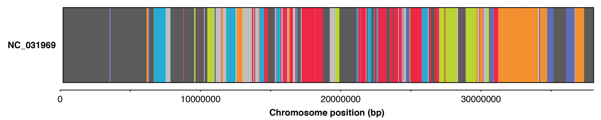

* Make alignments:

		ruby generate_alignments.rb saguaro_results/LocalTrees.out . alignment_blocks 50000

* Count the number of alignments.

		ls alignment_blocks/*.nex | wc -l
		
	<!--672 alignments-->

* Simplify the alignment names.

		for i in alignment_blocks/*.nex
		do
			new_name=`echo ${i} | sed 's/\.f5\.masked\.mod//g'`
			mv ${i} ${new_name}
		done

* Remove alignments with much missing data.

		for i in alignment_blocks/*.nex
		do
			p_missing=`ruby get_proportion_of_missing_data.rb ${i}`
			if [[ ${p_missing} > 0.9 ]]
			then
				rm ${i}
			fi
		done

* Count the number of alignments once again.

		ls alignment_blocks/*.nex | wc -l

	<!--477 alignments-->

* Run RAxML for each alignment.

		for i in alignment_blocks/*.nex
		do
			python3 convert.py -f phylip ${i} tmp.phy
			id=`basename ${i%.nex}`
			raxml -T 4 -m GTRCAT -n ${id} -s tmp.phy --silent -p ${RANDOM} -f a -x ${RANDOM} -N 100
			rm tmp.phy*
			rm RAxML_bipartitionsBranchLabels.*
			rm RAxML_bestTree.*
			rm RAxML_bootstrap.*
			mv RAxML_bipartitions.* alignment_blocks/${id}.tre
			mv RAxML_info.* alignment_blocks/${id}.info
		done

* Get summary statistics for each alignment.

		echo -e "block_id\tp_missing\tn_pi_sites\tmean_bootstrap_support\tphi_p" > block_stats.txt
		for i in alignment_blocks/*.nex
		do
			# Get the block ID.
			block_id=`basename ${i%.nex}`
			
			# Provide feedback on screen.
			echo -n "Analyzing file ${i}..."
			
			# Get the proportion of missing data.
			proportion_of_missing_data=`ruby get_proportion_of_missing_data.rb $i`

			# Get the number of parsimony-informative sites.
			number_of_pi_sites=`ruby get_number_of_pi_sites.rb $i`
						
			# Get the mean bootstrap support.
			bootstrap_value=`python3 get_mean_node_support.py ${i%.nex}.tre`
			bootstrap_value_strip=`echo -n $bootstrap_value`
			
			# Run PhiPack to test for recombination and get the resulting p-value.
			mkdir ${block_id}
			python3 convert.py ${i} -f fasta > ${block_id}/tmp.fasta
			cd ${block_id}
			p_value=`Phi -f tmp.fasta | tail -n 2 | head -n 1 | cut -d ":" -f 2 | tr -d '[[:space:]]'`
			cd ../
			rm -r ${block_id}
			
			# Print all output.
			echo -e -n ${block_id} >> block_stats.txt
			echo -e -n "\t" >> block_stats.txt
			printf "%.3f" ${proportion_of_missing_data} >> block_stats.txt
			echo -e -n "\t" >> block_stats.txt
			echo -n ${number_of_pi_sites} >> block_stats.txt
			echo -e -n "\t" >> block_stats.txt
			printf "%.1f" ${bootstrap_value_strip} >> block_stats.txt
			echo -e -n "\t" >> block_stats.txt
			echo -e -n ${p_value} >> block_stats.txt
			echo >> block_stats.txt
			
			# Provide feedback on screen.
			echo " done."

		done

* Make some plots in R to see correlations between the different parameters.

		R
	
	Then, ...
		
		t <- read.table("block_stats.txt", header=T)
		get_third_as_num <- function(x, split="_"){ return(as.numeric(strsplit(x, split=split)[[1]][3])) }
		get_fourth_as_num <- function(x, split="_"){ return(as.numeric(strsplit(x, split=split)[[1]][4])) }
		froms <- unlist(lapply(as.character(t$block_id), get_third_as_num))
		tos <- unlist(lapply(as.character(t$block_id), get_fourth_as_num))
		block_centers <- (froms + tos)/2
		
		pdf("alignment_blocks_missing.pdf", height=7, width=7)
		plot(block_centers, t$p_missing, xlab="Position", ylab="Proportion missing", main="NC_031969")
		abline(h=0.8)
		rect(-5000000, 0, 40000000, 0.8, col=rgb(0.164,0.629,0.594,alpha=0.25))
		dev.off()

	
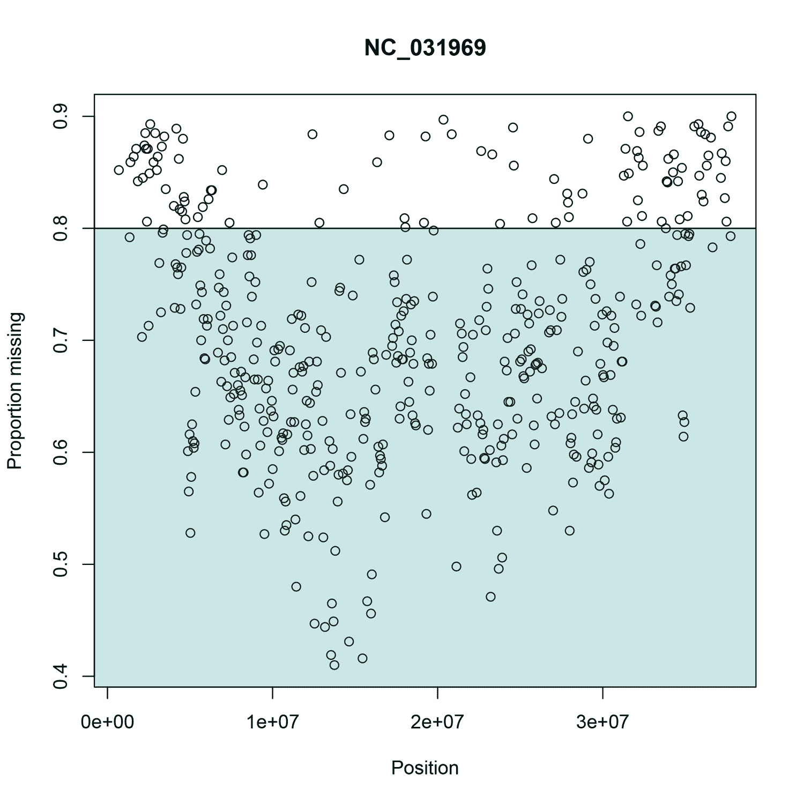

		pdf("alignment_blocks_pi_sites.pdf", height=7, width=7)
		plot(t$p_missing, t$n_pi_sites, xlab="Proportion missing", ylab="Number PI sites", main="NC_031969")
		abline(h=250)
		abline(v=0.8)
		rect(0, 250, 0.8, 1000, col=rgb(0.164,0.629,0.594,alpha=0.25))
		dev.off()
		
	
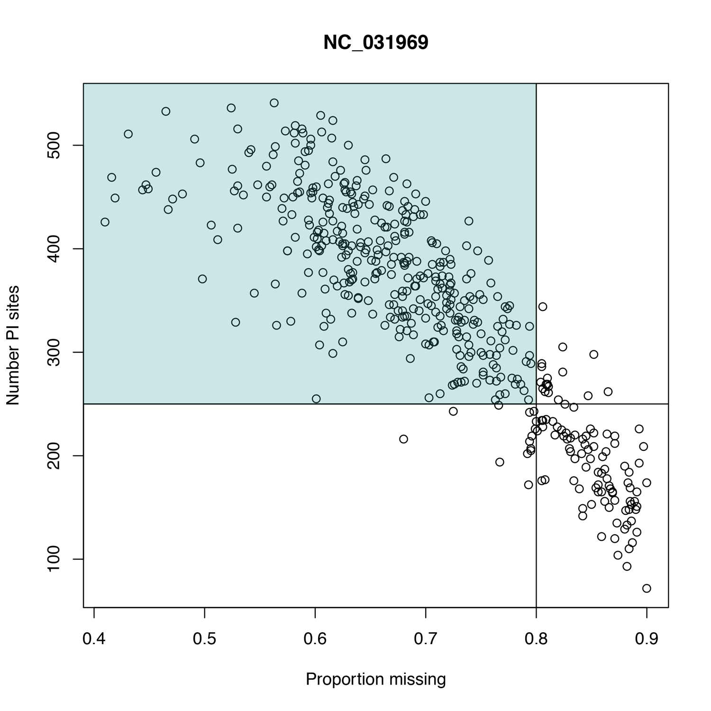

		
		pdf("alignment_blocks_bootstrap.pdf", height=7, width=7)
		plot(t$p_missing, t$mean_bootstrap_support, xlab="Proportion missing", ylab="Mean Bootstrap support", main="NC_031969")
		abline(h=70)
		abline(v=0.8)
		rect(0, 70, 0.8, 1000, col=rgb(0.164,0.629,0.594,alpha=0.25))
		dev.off()
		quit(save="no")

	
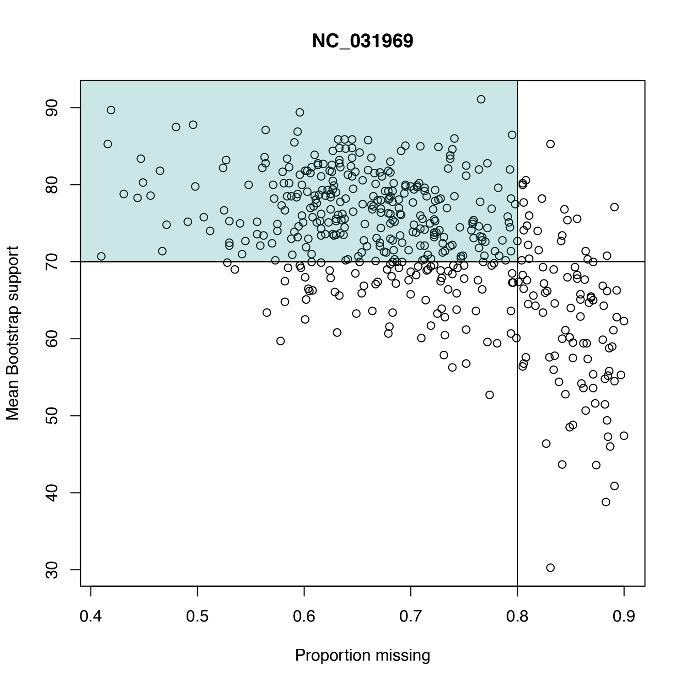

* Test some parameter combinations for filtering, how many blocks are left then? For example:

		ruby filter_blocks.rb block_stats.txt 0.8 250 70 0.05 | wc -l
		
* Make a list of filtered blocks:

		ruby filter_blocks.rb block_stats.txt 0.8 250 70 0.05 > block_stats_filtered.txt
			
* Copy the filtered blocks to a new directory.

		for i in `cat block_stats_filtered.txt | tail -n +2 | cut -f 1`
		do
			mkdir -p alignment_blocks_filtered/${i}
			cp alignment_blocks/${i}.nex alignment_blocks_filtered/${i}
		done

## Automating BEAST2 analyses

XXX

* Make a constraints file. Save the following as a new file named `constraints.xml`:

						<distribution id="All.prior" monophyletic="true" spec="beast.math.distributions.MRCAPrior" tree="@tree.t:Species">
							<taxonset id="All" spec="TaxonSet">
								<taxon idref="IZC5_A"/>
								<taxon idref="IZC5_B"/>
								<taxon idref="AUE7_A"/>
								<taxon idref="AUE7_B"/>
								<taxon idref="JBD6_A"/>
								<taxon idref="JBD6_B"/>
								<taxon idref="JUH9_A"/>
								<taxon idref="JUH9_B"/>
								<taxon idref="LJC9_A"/>
								<taxon idref="LJC9_B"/>
								<taxon idref="KHA7_A"/>
								<taxon idref="KHA7_B"/>
								<taxon idref="IVE8_A"/>
								<taxon idref="IVE8_B"/>
								<taxon idref="JWH2_A"/>
								<taxon idref="JWH2_B"/>
								<taxon idref="JWG9_A"/>
								<taxon idref="JWG9_B"/>
								<taxon idref="JWH4_A"/>
								<taxon idref="JWH4_B"/>
								<taxon idref="JWH6_A"/>
								<taxon idref="JWH6_B"/>
								<taxon idref="ISB3_A"/>
								<taxon idref="ISB3_B"/>
								<taxon idref="ISA8_A"/>
								<taxon idref="ISA8_B"/>
								<taxon idref="KFD2_A"/>
								<taxon idref="KFD2_B"/>
							</taxonset>
							<LogNormal meanInRealSpace="true" name="distr" offset="0.0">
								<parameter estimate="false" name="M">6.2666</parameter>
								<parameter estimate="false" name="S">0.13</parameter>
							</LogNormal>
						</distribution>
						
						<distribution id="Outgroup.prior" monophyletic="true" spec="beast.math.distributions.MRCAPrior" tree="@tree.t:Species">
							<taxonset id="Outgroup" spec="TaxonSet">
								<taxon idref="IZC5_A"/>
								<taxon idref="IZC5_B"/>
							</taxonset>
						</distribution>

						<distribution id="Ingroup.prior" monophyletic="true" spec="beast.math.distributions.MRCAPrior" tree="@tree.t:Species">
							<taxonset id="Ingroup" spec="TaxonSet">
								<taxon idref="AUE7_A"/>
								<taxon idref="AUE7_B"/>
								<taxon idref="JBD6_A"/>
								<taxon idref="JBD6_B"/>
								<taxon idref="JUH9_A"/>
								<taxon idref="JUH9_B"/>
								<taxon idref="LJC9_A"/>
								<taxon idref="LJC9_B"/>
								<taxon idref="KHA7_A"/>
								<taxon idref="KHA7_B"/>
								<taxon idref="IVE8_A"/>
								<taxon idref="IVE8_B"/>
								<taxon idref="JWH2_A"/>
								<taxon idref="JWH2_B"/>
								<taxon idref="JWG9_A"/>
								<taxon idref="JWG9_B"/>
								<taxon idref="JWH4_A"/>
								<taxon idref="JWH4_B"/>
								<taxon idref="JWH6_A"/>
								<taxon idref="JWH6_B"/>
								<taxon idref="ISB3_A"/>
								<taxon idref="ISB3_B"/>
								<taxon idref="ISA8_A"/>
								<taxon idref="ISA8_B"/>
								<taxon idref="KFD2_A"/>
								<taxon idref="KFD2_B"/>
							</taxonset>
						</distribution>

* Generate XML input files for BEAST2.

		for i in alignment_blocks_filtered/*
		do
			run_id=`basename ${i}`
			ruby beauti.rb -id ${run_id} -n ${i} -o ${i} -c constraints.xml -l 500000 -m HKY
		done
		
* Run all BEAST2 analyses.

		home=`pwd`
		for i in alignment_blocks_filtered/*
		do
			block_id=`basename ${i}`
			cd ${i}
			/Applications/Beast/2.5.0/bin/beast ${block_id}.xml
			cd ${home}
		done

* Open R:

		R
		
* Then:

		# Load the coda library.
		library(coda)
		
		# Read the log file as a table.
		t <- read.table("alignment_blocks_filtered/NC_031969_02066951_02116950/NC_031969_02066951_02116950.log", header=T)
		
		# Get the chain length as the number of rows in the table.
		chain_length = dim(t)[1]
		
		# Convert the table into a mcmc object.
		MCMCdata = mcmc(data=t, start=1, end=chain_length, thin=1)
		
		# Make a subset of the mcmc object, removing the burning and some parameter traces.
		MCMCsub <- as.mcmc(MCMCdata[(chain_length/10):chain_length, c(2, 3, 4, 8, 9, 10)])
		
		# Show a summary of the parameter estimates.
		summary(MCMCsub)
		
		# Calculate effective sample sizes for all parameters.
		effectiveSize(MCMCsub)
		
		# Find the lowest effective sample size.
		min(effectiveSize(MCMCsub))
		
* Then:

		# Make a pdf plot of the selected parameter traces.
		pdf("mcmc_traces.pdf", height=7, width=7)
		plot(MCMCsub, trace=TRUE, density=FALSE, smooth=TRUE, auto.layout=TRUE)
		dev.off()
		quit(save="no")

	
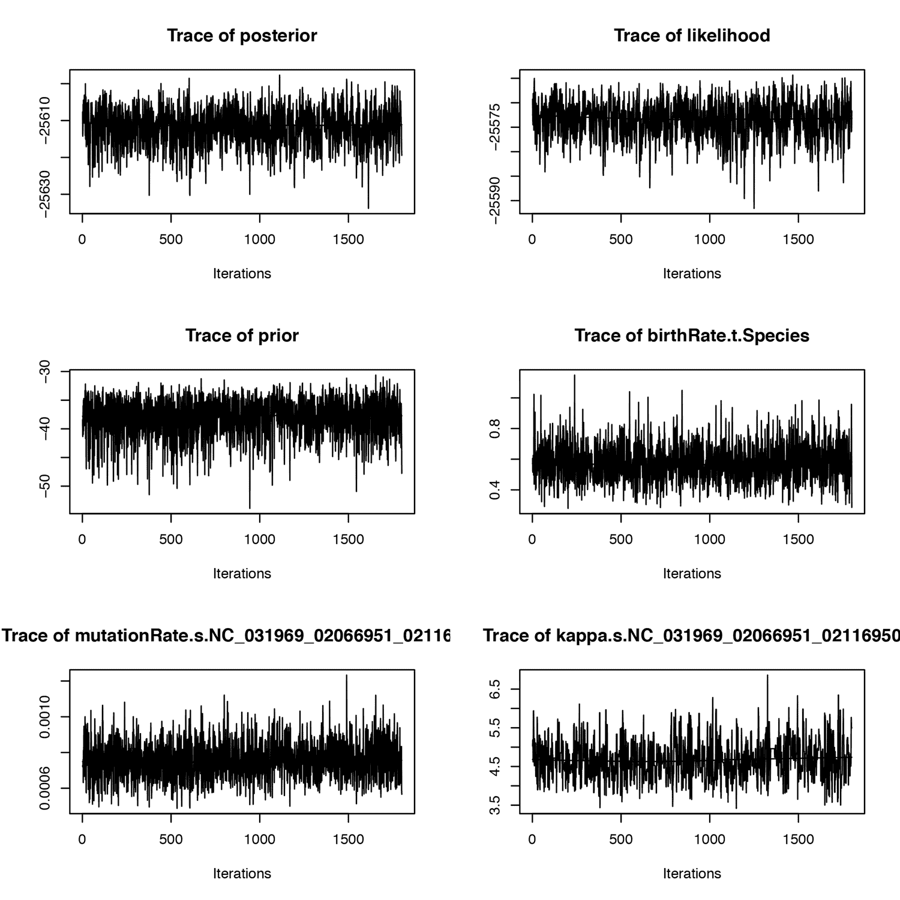

* Write the following code to a new file named `get_min_ess.r`:

		# Load the coda library.
		library(coda)
		
		# Get the command-line arguments.
		args <- commandArgs(trailingOnly = TRUE)
		log_file_name <- args[1]

		# Read the log file as a table.
		t <- read.table(log_file_name, header=T)
		
		# Get the chain length as the number of rows in the table.
		chain_length = dim(t)[1]
		
		# Convert the table into a mcmc object.
		MCMCdata = mcmc(data=t, start=1, end=chain_length, thin=1)

		# Make a subset of the mcmc object, removing the burning and some parameter traces.
		MCMCsub <- as.mcmc(MCMCdata[(chain_length/10):chain_length, c(2, 3, 4, 8, 9, 10)])
		
		# Find the lowest effective sample size.
		cat(min(effectiveSize(MCMCsub)), "\n")
		
* Then, run the R script first with a single file, the log file from the first alignment named [`NC_031969_02066951_02116950.log`](res/NC_031969_02066951_02116950.log):

		Rscript get_min_ess.r alignment_blocks_filtered/NC_031969_02066951_02116950/NC_031969_02066951_02116950.log

* Then, use the script to find the lowest ESS value of each log file:

		for i in alignment_blocks_filtered/*/*.log
		do
			echo -n -e "${i}\t"
			Rscript get_min_ess.r ${i} | tail -n 1
		done

* Remove the directories of all blocks with ESS values below 100:

		for i in alignment_blocks_filtered/*/*.log
		do
			block_id=`basename ${i%.log}`
			min_ess=`Rscript get_min_ess.r ${i} | tail -n 1 | cut -d "." -f 1`
			if [[ ${min_ess} -lt 100 ]]
			then
				rm -r alignment_blocks_filtered/${block_id}
				echo "Deleted directory alignment_blocks_filtered/${block_id}."
			fi
		done
		
* Make MCC summary trees for all genes:

		for i in alignment_blocks_filtered/*/*.trees
		do
			/Applications/Beast/2.5.0/bin/treeannotator -burnin 10 -heights mean ${i} ${i%.trees}.tre
		done

* Check the mean node support of all trees, using Python script [`get_mean_node_support.py`](src/get_mean_node_support.py):

		for i in alignment_blocks_filtered/*/*.tre
		do
			echo -ne "${i}\t"
			python3 get_mean_node_support.py ${i}
		done

* Combine all MCC trees in a single file, using the Python script [`logcombiner.py`](src/logcombiner.py):

		ls alignment_blocks_filtered/*/*.tre > mcc_trees.txt
		python3 logcombiner.py mcc_trees.txt mcc_trees.trees

* Open file [`mcc_trees.trees`](res/mcc_trees.trees) in DensiTree.

	
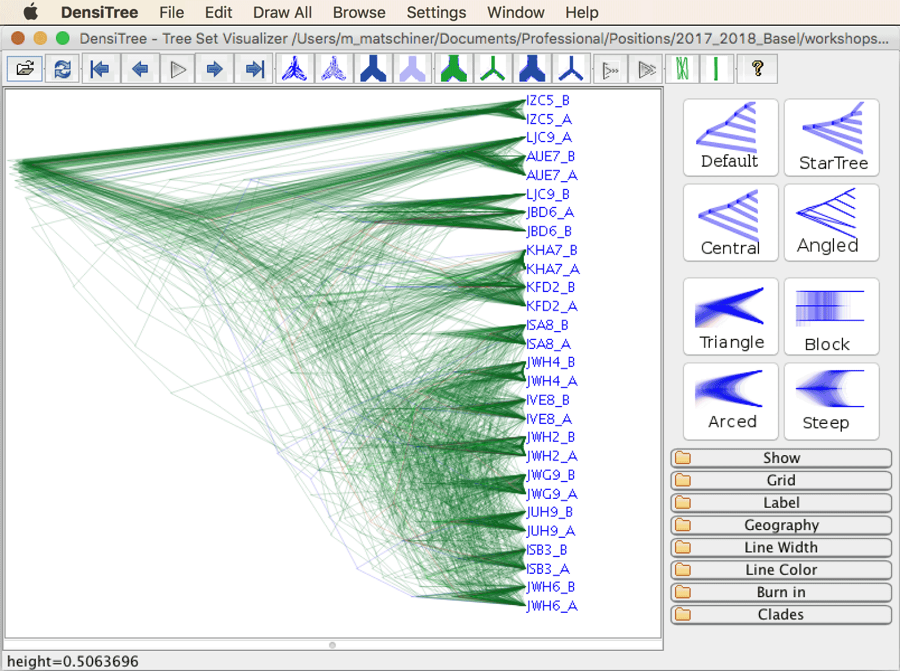

	

## Analyzing introgression with divergence times

XXX

* Sample 100 trees from the posterior distribution of each block.

		for i in alignment_blocks_filtered/*/*.trees
		do
			python3 logcombiner.py -b 10 -n 100 --remove-comments ${i} ${i%.trees}.100.trees
		done 

* Extract the node ages from each gene tree.

		mkdir node_ages
		for i in alignment_blocks_filtered/*/*.100.trees
		do
			block_id=`basename ${i%.100.trees}`
			echo -n "Reading node ages from file ${block_id}.100.trees..."
			Rscript get_mrca_table.r ${i} > node_ages/${block_id}.txt
			echo " done."
			echo "Wrote file node_ages/${block_id}.txt."
		done

* Use the Ruby script [`summarize_mrca_tables.rb`](src/summarize_mrca_tables.rb) to analyze all tables of node ages and to generate a single table of the mean pairwise node ages:

		ruby summarize_mrca_tables.rb node_ages mean_node_ages.txt

* Make a heatmap with individual sequences as units:

		R
		table <- read.table("mean_node_ages.txt")
		matrix <- as.matrix(table)
		col_palette <- colorRampPalette(c("#848e79","#6b857a","#537b7c","#3b727d","#2a667b","#255771","#204768","#1b385f","#162955","#111a4c","#0d133d","#0a0e2d"),space="rgb")(n = 25)
		col_breaks=seq(0,max(matrix),length=26)
		pdf("mean_node_ages.pdf", height=7, width=7)
		heatmap(matrix, Rowv=T, symm=T, scale="none", col=col_palette, breaks=col_breaks)
		dev.off()
		quit(save="no")

	
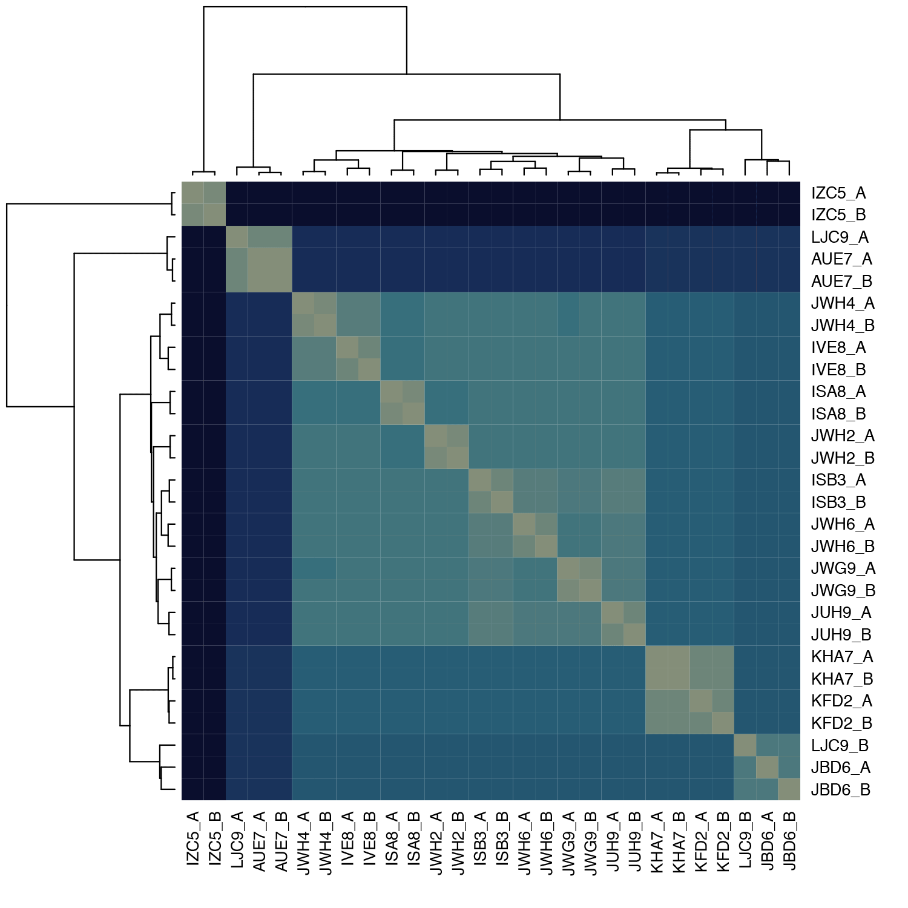

* Prepare a file with a table assigning sequence IDs to species. Copy the following text into a new file named `species.txt`:

		IZC5_A	astbur
		IZC5_B	astbur
		AUE7_A	altfas
		AUE7_B	altfas
		JBD6_A	telvit
		JBD6_B	telvit
		JUH9_A	neobri
		JUH9_B	neobri
		LJC9_A	neocan
		LJC9_B	neocan
		KHA7_A	neochi
		KHA7_B	neochi
		IVE8_A	neocra
		IVE8_B	neocra
		JWH2_A	neogra
		JWH2_B	neogra
		JWG9_A	neohel
		JWG9_B	neohel
		JWH4_A	neomar
		JWH4_B	neomar
		JWH6_A	neooli
		JWH6_B	neooli
		ISB3_A	neopul
		ISB3_B	neopul
		ISA8_A	neosav
		ISA8_B	neosav
		KFD2_A	neowal
		KFD2_B	neowal

* Shrink the matrix with script [`shrink_matrix.rb`](src/shrink_matrix.rb):

		ruby shrink_matrix.rb mean_node_ages.txt species.txt mean_node_ages_species.txt

* Make a heatmap with species as units:

		R
		table <- read.table("mean_node_ages_species.txt")
		matrix <- as.matrix(table)
		col_palette <- colorRampPalette(c("#848e79","#6b857a","#537b7c","#3b727d","#2a667b","#255771","#204768","#1b385f","#162955","#111a4c","#0d133d","#0a0e2d"),space="rgb")(n = 25)
		col_breaks=seq(0,max(matrix),length=26)
		pdf("mean_node_ages_species.pdf", height=7, width=7)
		heatmap(matrix, Rowv=T, symm=T, scale="none", col=col_palette, breaks=col_breaks)
		dev.off()
		quit(save="no")

	
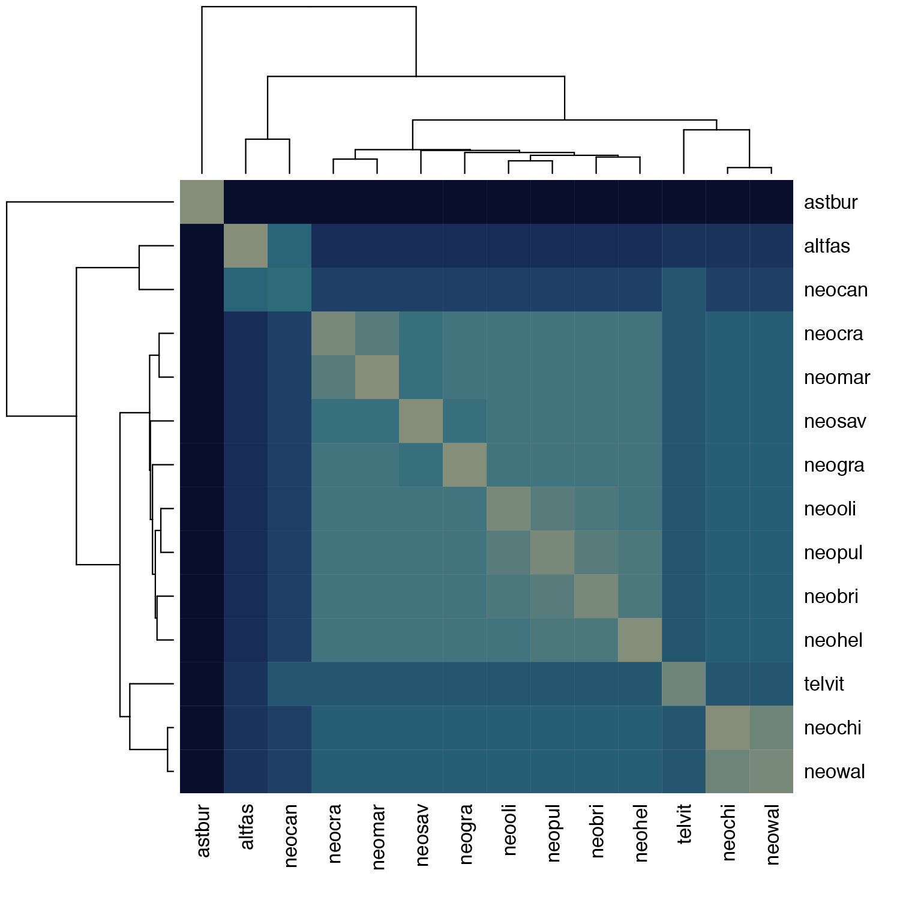

* Calculate the maximum age reduction with the Ruby script [`check_treeness.rb`](src/check_treeness.rb).

		ruby check_treeness.rb mean_node_ages_species.txt age_reductions.txt

* Plot the age reduction:

		R
		table <- read.table("age_reductions.txt")
		matrix <- as.matrix(table)
		max(matrix)
		col_palette <- colorRampPalette(c("#848e79","#6b857a","#537b7c","#3b727d","#2a667b","#255771","#204768","#1b385f","#162955","#111a4c","#0d133d","#0a0e2d"),space="rgb")(n = 25)
		col_breaks=seq(0,max(matrix),length=26)
		pdf("age_reductions.pdf", height=7, width=7)
		heatmap(matrix, Rowv=NA, Colv=NA, symm=F, scale="none", col=col_palette, breaks=col_breaks, xlab="Taxon C (donor)", ylab="Taxon A (recipient)", margins = c(6, 6))
		dev.off()
		quit(save="no")

	
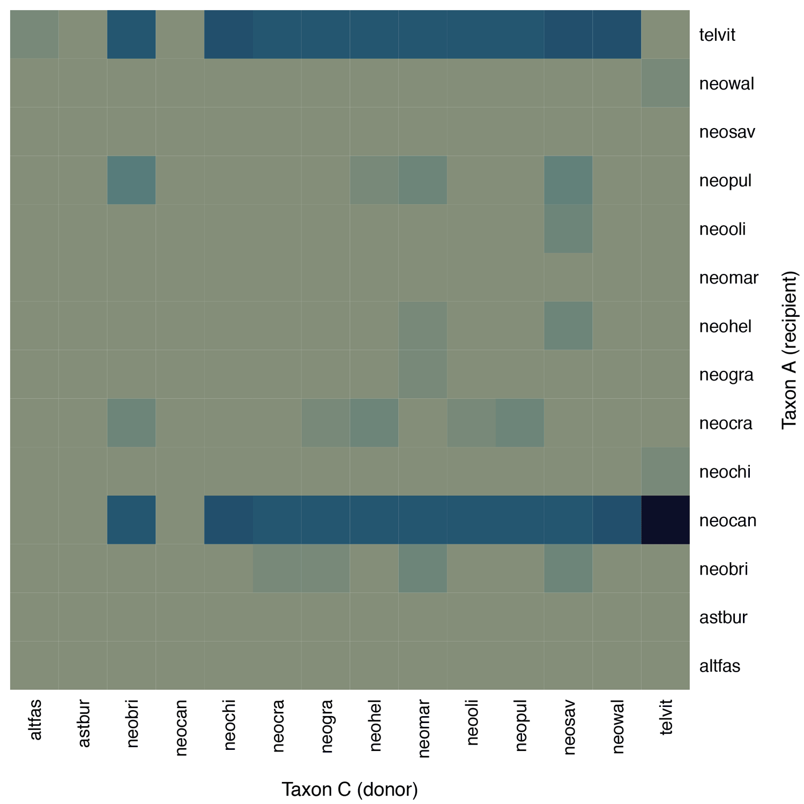

	
	<!--The upper dark row for telvit comes from comparisons with neocan. For example, in the comparison neocan (B), telvit (A), and neowal (C), the mean age for B-A is 3.005, that for B-C is 3.78, and that for A-C is 3.07.-->

* Calculate once again the maximum age reduction, after excluding "neocan" with the Ruby script [`check_treeness.rb`](src/check_treeness.rb).

		ruby check_treeness.rb mean_node_ages_species.txt age_reductions_sub1.txt neocan

* Make a new plot of the age reduction, now without "neocan":

		R
		table <- read.table("age_reductions_sub1.txt")
		matrix <- as.matrix(table)
		max(matrix)
		col_palette <- colorRampPalette(c("#848e79","#6b857a","#537b7c","#3b727d","#2a667b","#255771","#204768","#1b385f","#162955","#111a4c","#0d133d","#0a0e2d"),space="rgb")(n = 25)
		col_breaks=seq(0,max(matrix),length=26)
		pdf("age_reductions_sub1.pdf", height=7, width=7)
		heatmap(matrix, Rowv=NA, Colv=NA, symm=F, scale="none", col=col_palette, breaks=col_breaks, xlab="Taxon C (donor)", ylab="Taxon A (recipient)", margins = c(6, 6))
		dev.off()
		quit(save="no")

	
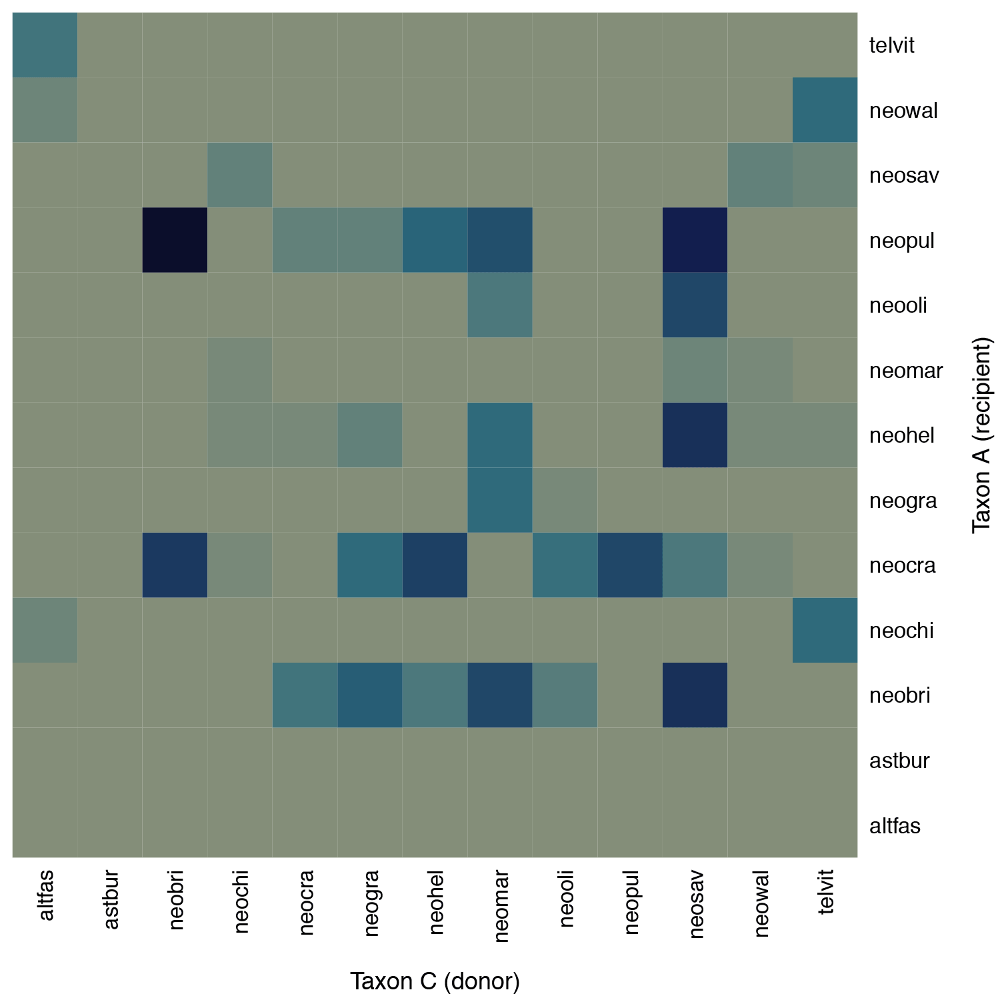

* Calculate age reductions again, excluding both "neocan" and "neopul"

		ruby check_treeness.rb mean_node_ages_species.txt age_reductions_sub2.txt neocan,neopul

* Make a new plot of the age reduction, now without "neocan" and "neopul":

		R
		table <- read.table("age_reductions_sub2.txt")
		matrix <- as.matrix(table)
		max(matrix)
		col_palette <- colorRampPalette(c("#848e79","#6b857a","#537b7c","#3b727d","#2a667b","#255771","#204768","#1b385f","#162955","#111a4c","#0d133d","#0a0e2d"),space="rgb")(n = 25)
		col_breaks=seq(0,max(matrix),length=26)
		pdf("age_reductions_sub2.pdf", height=7, width=7)
		heatmap(matrix, Rowv=NA, Colv=NA, symm=F, scale="none", col=col_palette, breaks=col_breaks, xlab="Taxon C (donor)", ylab="Taxon A (recipient)", margins = c(6, 6))
		dev.off()
		quit(save="no")

	
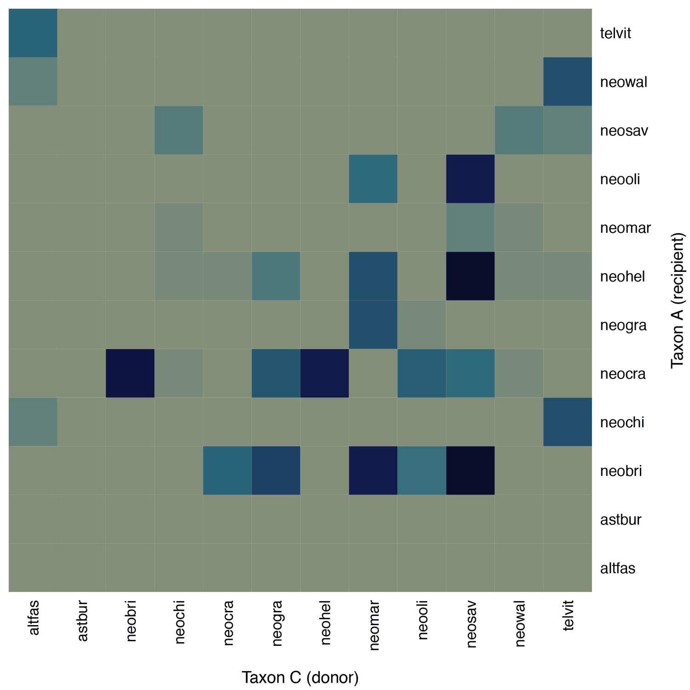

* Write the following text assigning sample IDs to species IDs for the three species "neobri", "neooli", and "neopul" to a new file named `species_trio1.txt`:

		JUH9_A	neobri
		JUH9_B	neobri
		JWH6_A	neooli
		JWH6_B	neooli
		ISB3_A	neopul
		ISB3_B	neopul

* Count topologies for "neobri", "neooli", "neopul":

		python3 get_topologies.py -t alignment_blocks_filtered/*/*.100.trees -s species_trio1.txt
		
* Repeat the same with another species trio.

## Simulating recombination with c-genie

XXX

* Download c-genie recombination with c-genie:

		wget https://raw.githubusercontent.com/mmatschiner/c-genie/master/c-genie

* Make the script executable:

		chmod +x c-genie

* Have a look at the available options:

		./c-genie -h

* Run c-genie with the time calibrated SNAPP phylogeny from tutorial [Divergence-Time Estimation with SNP Data](../divergence_time_estimation_with_snp_data/README.md):

		./c-genie snapp.tre lamprologini

 

                   

## Answers

* **Question 1:** XXX