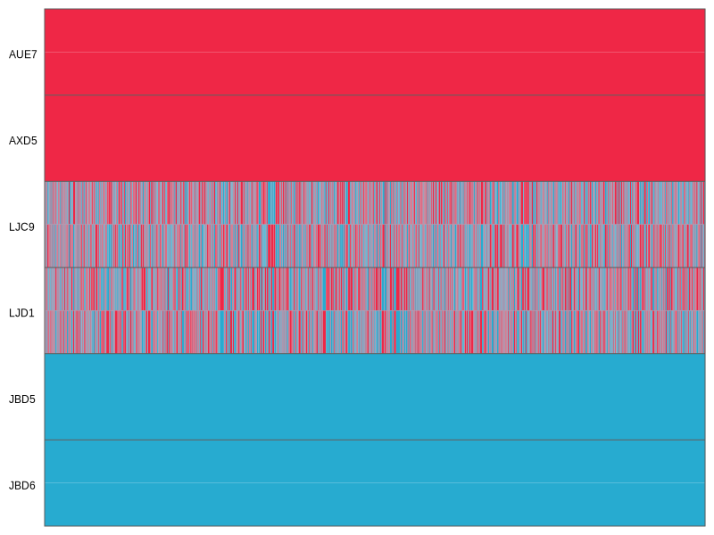

# Analysis of Introgression with SNP Data

A tutorial on the analysis of hybridization and introgression with SNP data

## Summary

XXX

## Table of contents

* [Outline](#outline)
* [Dataset](#dataset)
* [Requirements](#requirements)
* [Assessing introgression with D-statistics](#dstatistics)
* [Allele phasing](#phasing)
* [Topology weighting with TWISST](#twisst)
* [Ancestry painting](#painting)
* [Improved allele phasing for recent hybrids](#improvedphasing)

## Outline

In this tutorial I am going XXX

## Dataset

The SNP data used in this tutorial is the unfiltered dataset used for species-tree inference with SVDQuartets in tutorial [Species-Tree Inference with SNP Data](../species_tree_inference_with_snp_data/README.md). More detailed information about the origin of this dataset is given in the Dataset section of this other tutorial. In brief, the dataset includes SNP data for the 28 samples of 14 cichlid species listed in the table below, and this data has already filtered based on read quality and depth. Only SNPs mapping to chromosome 5 of the tilapia genome assembly ([Conte et al. 2017](https://bmcgenomics.biomedcentral.com/articles/10.1186/s12864-017-3723-5)) are included in the dataset.

| Sample ID | Species ID | Species name                  | Tribe         |
|-----------|------------|-------------------------------|---------------|
| IZA1      | astbur     | *Astatotilapia burtoni*       | Haplochromini |
| IZC5      | astbur     | *Astatotilapia burtoni*       | Haplochromini |
| AUE7      | altfas     | *Altolamprologus fasciatus*   | Lamprologini  |
| AXD5      | altfas     | *Altolamprologus fasciatus*   | Lamprologini  |
| JBD5      | telvit     | *Telmatochromis vittatus*     | Lamprologini  |
| JBD6      | telvit     | *Telmatochromis vittatus*     | Lamprologini  |
| JUH9      | neobri     | *Neolamprologus brichardi*    | Lamprologini  |
| JUI1      | neobri     | *Neolamprologus brichardi*    | Lamprologini  |
| LJC9      | neocan     | *Neolamprologus cancellatus*  | Lamprologini  |
| LJD1      | neocan     | *Neolamprologus cancellatus*  | Lamprologini  |
| KHA7      | neochi     | *Neolamprologus chitamwebwai* | Lamprologini  |
| KHA9      | neochi     | *Neolamprologus chitamwebwai* | Lamprologini  |
| IVE8      | neocra     | *Neolamprologus crassus*      | Lamprologini  |
| IVF1      | neocra     | *Neolamprologus crassus*      | Lamprologini  |
| JWH1      | neogra     | *Neolamprologus gracilis*     | Lamprologini  |
| JWH2      | neogra     | *Neolamprologus gracilis*     | Lamprologini  |
| JWG8      | neohel     | *Neolamprologus helianthus*   | Lamprologini  |
| JWG9      | neohel     | *Neolamprologus helianthus*   | Lamprologini  |
| JWH3      | neomar     | *Neolamprologus marunguensis* | Lamprologini  |
| JWH4      | neomar     | *Neolamprologus marunguensis* | Lamprologini  |
| JWH5      | neooli     | *Neolamprologus olivaceous*   | Lamprologini  |
| JWH6      | neooli     | *Neolamprologus olivaceous*   | Lamprologini  |
| ISA6      | neopul     | *Neolamprologus pulcher*      | Lamprologini  |
| ISB3      | neopul     | *Neolamprologus pulcher*      | Lamprologini  |
| ISA8      | neosav     | *Neolamprologus savoryi*      | Lamprologini  |
| IYA4      | neosav     | *Neolamprologus savoryi*      | Lamprologini  |
| KFD2      | neowal     | *Neolamprologus walteri*      | Lamprologini  |
| KFD4      | neowal     | *Neolamprologus walteri*      | Lamprologini  |

## Requirements

* **Python library ete3:** The [ete toolkit](http://etetoolkit.org) ([Huerta-Cepas et al. 2016](https://academic.oup.com/mbe/article/33/6/1635/2579822)) will be required for [topology-weighting](#twisst) analyses with [TWISST](https://github.com/simonhmartin/twisst) ([Martin and van Belleghem 2017](http://www.genetics.org/content/206/1/429)). Instructions for the installation of the ete toolkit on Mac OS X and Linux are provided on the [ete download webpage](http://etetoolkit.org/download/); however, the easiest way to install the ete3 toolkit might be with the pip package manager for Python, using the following command:

		python -m pip install --user ete3
		
	To ensure that the installation worked, you could execute the following command:
	
		python -c 'import ete3'
		
	If no error message is given, the ete3 library is correctly installed and ready to be used.

* **RAxML:** Like the ete toolkit, [RAxML](https://sco.h-its.org/exelixis/web/software/raxml/index.html) ([Stamatakis 2014](https://academic.oup.com/bioinformatics/article/30/9/1312/238053)) is also going to be required for [Topology weighting with TWISST](#twisst). Source code for Mac OS X and Linux, as well as precompiled executables for Windows, can be found on RAxML's github page [https://github.com/stamatak/standard-RAxML](https://github.com/stamatak/standard-RAxML). The installation of RAxML is also described in more detail in tutorial [Maximum-Likelihood Phylogenetic Inference](../ml_phylogeny_inference/README.md).

## Assessing introgression with <i>D</i>-statistics
		
Under incomplete lineage sorting alone, both of two sister species are expected to share about the same proportion of derived alleles with a third closely related species. Thus, if species "spc1" and "spc2" are sisters and "spc3" is a closely related species, then the number of derived alleles shared by "spc1" and "spc3" but not "spc2" and the number of derived alleles that is shared by "spc2" and "spc3" but not "spc1" should be approximately similar. In contrast, if hybridization leads to introgression between species "spc3" and one out the two species "spc1" and "spc2", then "spc3" should share more derived alleles with that species than it does with the other one, leading to asymmetry in the sharing of derived alleles. These expectations are the basis for the so-called "ABBA-BABA test" (first described in the Supporting Material of [Green et al. 2010](http://science.sciencemag.org/content/328/5979/710.full)) that quantifies support for introgression by the <i>D-statistic</i>. In addition to the three species "spc1", "spc2", and "spc3", the ABBA-BABA test requires a fourth species, "spc4", which should be a common outgroup to "spc1", "spc2", and "spc3", and only serves to determine which allele is the ancestral one and which is derived; the ancestral allele is then labelled "A" and the derived allele of a bi-allelic SNP is labelled "B". In the simplest case in which only a single haploid sequence is sampled from each of the four species, "ABBA sites" are those where species "spc2" and "spc3" share the derived allele "B" while "spc1" retains the ancestral allele "A". Similarly "BABA sites" are those where "spc1" and "spc3" share the derived allele "B" while "spc2" retains the ancestral allele "A". The <i>D</i>-statistic is then defined as the difference between the number of ABBA sites and BABA sites relative to the sum of both types of sites. This statistic is expected to be 0 if no introgression occurred, to be 1 in the extreme case of no incomplete lineage sorting but introgression between "spc2" and "spc3", and -1 if incomplete lineage sorting is absent but introgression occurred between "spc1" and "spc3". By convention, however, "spc1" and "spc2" are swapped if "spc1" turns out to be closer to "spc3" than "spc2" is to "spc3", so that the <i>D</i>-statistic remains within the interval [0, 1] and the number of ABBA sites is always greater than the number of BABA sites. When the dataset includes more than a single sequence per species, the calculation of the <i>D</i>-statistic is slightly more complicated and involves weighting each site for the ABBA or BABA pattern based on the alleles observed in each species.

A popular set of scripts for the calculation of the <i>D</i>-statistic has been written by Simon Martin ([Martin et al. 2014](https://academic.oup.com/mbe/article/32/1/244/2925550)) and these scripts can be found on his github repository. In addition to the <i>D</i>-statistic, these scripts allow the calculation of a p-value based on jackknifing for the null hypothesis that the <i>D</i>-statistic is 0, which means that the absence of introgression can be rejected if the p-value is below the significance level. The scripts also allow the calculation of the Martin's <i>f</i>d ([Martin et al. 2014](https://academic.oup.com/mbe/article/32/1/244/2925550)), a more conservative estimator of introgression that is better-suited for sliding-window analyses.

In this part of the tutorial, we are going to calculate the <i>D</i> and <i>f</i>d statistics to test for introgression among sets of four species from our dataset. As a first test, we will apply these statistics to determine potential introgression into *Neolamprologus cancellatus*, the species that had been excluded from species-tree analyses in tutorials [Species-Tree Inference with SNP Data](../species_tree_inference_with_snp_data/README.md) and [Divergence-Time Estimation with SNP Data](../divergence_time_estimation_with_snp_data/README.md) due to its presumed hybrid nature. As mentioned in tutorial [Species-Tree Inference with SNP Data](../species_tree_inference_with_snp_data/README.md), *Neolamprologus cancellatus* ("neocan") is not accepted as a valid species by some authors who speculate that it is a "natural hybrid between *Telmatochromis vittatus* and another species" ([Konings 2015](http://www.cichlidpress.com/books/details/tc3.html)), based on field observations.

* Make sure that you have the file [`NC_031969.f5.sub1.vcf.gz`](data/NC_031969.f5.sub1.vcf.gz) in your current analysis directory, either by copying it from the analysis directory for tutorial [Species-Tree Inference with SNP Data](../species_tree_inference_with_snp_data/README.md), or by downloading it with the link. Make sure not to uncompress it yet.

* To be able to use the collection of scripts written by Simon Martin for the calculation of the <i>D</i> and <i>f</i>d statistics, download his entire github repository named "genomics\_general", using the following command:

		git clone https://github.com/simonhmartin/genomics_general.git
		
* To ensure that the libraries included in this repository are recognized by Python, add the repository to the general Python path with the following command:

		export PYTHONPATH=genomics_general
		
* You can test if the genomics library in file `genomics_general/genomics.py` is recognized by Python by executing the following command:

		python -c 'import genomics'
		
	Unless you see an error message as a response, the genomics library can now be used.
		
* As all of Simon Martin's scripts use the more light-weight "genotype" file format instead of the VCF format, we'll first convert the VCF file [`NC_031969.f5.sub1.vcf.gz`](data/NC_031969.f5.sub1.vcf.gz) into genotype file format, by running the `parseVCF.py` Python script with the following command:

		python genomics_general/VCF_processing/parseVCF.py -i NC_031969.f5.sub1.vcf.gz | gzip > NC_031969.f5.sub1.geno.gz
		
* Compare the VCF format to the genotype format by having a look at both `NC_031969.f5.sub1.vcf.gz` and `NC_031969.f5.sub1.geno.gz`, for example with the `zless -S` command:

		zless -S NC_031969.f5.sub1.vcf.gz
		zless -S NC_031969.f5.sub1.geno.gz
		
	(in both cases, return to the command line by hitting the `q` key). You'll see that `NC_031969.f5.sub1.geno.gz` contains the same genotype information for all samples as well as the chromosome ID and the chromosomal position, but no further information.
	
* To assign samples to species for the calculation of the <i>D</i>-statistic, we'll need to write a table with two columns, where the first columns contains the sample IDs and the second column contains the corresponding species ID. Even though we'll use only four species in the first application of the ABBA-BABA test, you could already include all samples and species of the dataset to this table; this will facilitate later analyses with other sets of four species. Thus, write the following text to a new file named `samples.txt`:

		IZA1	astbur
		IZC5	astbur
		AUE7	altfas
		AXD5	altfas
		JBD5	telvit
		JBD6	telvit
		JUH9	neobri
		JUI1	neobri
		LJC9	neocan
		LJD1	neocan
		KHA7	neochi
		KHA9	neochi
		IVE8	neocra
		IVF1	neocra
		JWH1	neogra
		JWH2	neogra
		JWG8	neohel
		JWG9	neohel
		JWH3	neomar
		JWH4	neomar
		JWH5	neooli
		JWH6	neooli
		ISA6	neopul
		ISB3	neopul
		ISA8	neosav
		IYA4	neosav
		KFD2	neowal
		KFD4	neowal

	(note that the file with the same name written in tutorial [Divergence-Time Estimation with SNP Data](../divergence_time_estimation_with_snp_data/README.md) should not be re-used here as its content differs).

* To facilitate later analyses with other sets of four species, we will use variables for the four species IDs. As mentioned above, we will first focus on the potential hybrid nature of *Neolamprologus cancellatus* ("neocan"), which means that we will test for introgression into this species and that we therefore use it as "spc2". Because it has been speculated by [Konings (2015)](http://www.cichlidpress.com/books/details/tc3.html) that *Neolamprologus cancellatus* is a "hybrid between *Telmatochromis vittatus* and another species", we'll put *Telmatochromis vittatus* ("telvit") into the position of the potential donor of introgression, "spc3". And as an outgroup, we'll use the most distant of the species included in the dataset, *Astatotilapia burtoni* ("astbur") (this outgroup status of *Astatotilapia burtoni* was confirmed in the analyses of tutorial [Divergence-Time Estimation with SNP Data](../divergence_time_estimation_with_snp_data/README.md)). However, it is up to you to decide which species you would like to use as the second species to potentially contribute to hybridization. Thus, select any of the species of genus *Neolamprologus* or *Altolamprologus fasciatus* ("altfas") and use this species as "spc1". Then, replace "XXXXXX" in the command below with the ID of the species that you selected for "spc1" and execute the command.

		spc1=XXXXXX; spc2=neocan; spc3=telvit; spc4=astbur

* Then, use script `freq.py` from Simon Martin's repository to calculate allele frequencies of the four species, using the following command:

		python genomics_general/freq.py -g NC_031969.f5.sub1.geno.gz -p ${spc1} -p ${spc2} -p ${spc3} -p ${spc4} --popsFile samples.txt --target derived | grep -v nan | gzip > NC_031969.f5.sub1.pops1.tsv.gz
		
	In the above command, the input file in genotype format is specified with `-g NC_031969.f5.sub1.geno.gz`, the four species that are to be analyzed are separately specified with the `-p` option, and the file assigning samples to species is provided with `--popsFile samples.txt`. The option `--target derived` specifies that the allele observed for the last of the four species IDs (here "spc4") should be considered as the ancestral allele and the alternative allele is therefore the derived allele. Sites where the allele in the fourth species is not fixed are ignored. With `| grep -v nan` The output is passed to the program grep which removes lines corresponding to sites for which allele frequencies could not be calculated. After that, the output is passed to the program gzip for compression with `| gzip`, and then directed into a new file named `NC_031969.f5.sub1.pops1.tsv.gz` (here, "pops1" is used to distinguish from later analyses with other sets of four species that you could then call "pops2", "pops3", etc.). To see further options of the script `freq.py`, you could type `python genomics_general/freq.py -h`.
	
* To calculate the <i>D</i>-statistic, the <i>f</i>d-statistic, and the p-value for the hypothesis that the <i>D</i>-statistic is zero, we are going to use the R script [`calculate_abba_baba.r`](src/calculate_abba_baba.r). This script is not part of Simon Martin's repository, but it is based on R commands from a [tutorial by Simon Martin](http://evomics.org/learning/population-and-speciation-genomics/2018-population-and-speciation-genomics/abba-baba-statistics/). For the jackknifing procedure performed to assess the p-value, the script requires information about the length of each chromosome. Because in our case, we use only a single chromosome, specifying the length of this chromosome would in principle be sufficient. However, the R script [`calculate_abba_baba.r`](src/calculate_abba_baba.r) would have to be rewritten to accept a single chromosome length, which would make it less generally applicable. Therefore, it is easier to specify the lengths of all tilapia chromosomes ([Conte et al. 2017](https://bmcgenomics.biomedcentral.com/articles/10.1186/s12864-017-3723-5))  even though all but one of those lengths will be ignored. To do so, write the following text to a new file and name it `chr_lengths.txt`:

		NC_031965	38372991
		NC_031966	35256741
		NC_031967	14041792
		NC_031968	54508961
		NC_031969	38038224
		NC_031970	34628617
		NC_031971	44571662
		NC_031972	62059223
		NC_031973	30802437
		NC_031974	27519051
		NC_031975	32426571
		NC_031976	36466354
		NC_031977	41232431
		NC_031978	32337344
		NC_031979	39264731
		NC_031980	36154882
		NC_031981	40919683
		NC_031982	37007722
		NC_031983	31245232
		NC_031984	36767035
		NC_031985	37011614
		NC_031986	44097196
		NC_031987	43860769
		UNPLACED	141274046

* Then, run the R script [`calculate_abba_baba.r`](src/calculate_abba_baba.r) to calculate the <i>D</i>-statistic, the <i>f</i>d-statistic, and the p-value for the hypothesis that the <i>D</i>-statistic is zero, using the following command:

		Rscript calculate_abba_baba.r NC_031969.f5.sub1.pops1.tsv.gz pops1.abba_baba.txt ${spc1} ${spc2} ${spc3} ${spc4} chr_lengths.txt
		
	(the script [`calculate_abba_baba.r`](src/calculate_abba_baba.r) assumes that the first command-line argument passed to it is the name of the file with allele frequencies, the second is the output file, the third to sixth are the IDs of "spc1", "spc2", "spc3", and "spc4" in this order, and the seventh is the file with information about chromosome lengths).

* Have a look at file `pops1.abba_baba.txt`, for example with the `less` command:

		less pops1.abba_baba.txt
		
	You'll see a list of the four species IDs used in the analysis, followed by the total number of sites used in the analysis and the numbers of "BBAA", "ABBA", and "BABA" sites. With *Neolamprologus cancellatus* ("neocan") as "spc2" and *Telmatochromis vittatus* ("telvit") as "spc3", the number of "ABBA" sites is likely around 7,500, but the other numbers will depend on which species you used as "spc1". If the number of "BBAA" sites is not greater than the number of "ABBA" sites, you might want to repeat the analysis with script `calculate_abba_baba.r` after switching "spc1" and "spc3" to obtain the right <i>D</i>-statistic.

* Repeat the last steps with different species in the place of "spc1" to find the species with the strongest signal of introgression, measured by the <i>D</i>-statistic. Thus, start again with the following command, using a different species ID this time instead of "XXXXXX":

		spc1=XXXXXX; spc2=neocan; spc3=telvit; spc4=astbur
		
	Then, repeat the subsequent steps but replace "pops1" with "pops2", "pops3", etc. in each command to avoid overwriting the previous results.
	
	**Question 1:** Could you identify the species that maximizes the <i>D</i>-statistic (note that the <i>D</i>-statistic is only valid if the number of "BBAA" sites is greater than the other two numbers)? [(see answer)](#q1)

* Before continuing with the next steps, make sure that the four species are now specified so that the species leading to the highest <i>D</i>-statistic is placed in the position of "spc1". Thus, execute the following once again after replacing "XXXXXX" accordingly:

		spc1=XXXXXX; spc2=neocan; spc3=telvit; spc4=astbur

* Then, calculate the <i>f</i>d-statistic in sliding windows across the chromosome to see if you can identify regions that have received a particularly high or low degree of introgression. These regions could indicate adaptiveness of introgressed alleles or selection against them, respectively. To calculate <i>f</i>d in sliding windows, use the Python script `ABBABABAwindows.py` from Simon Martin's repository with the following command:

		python genomics_general/ABBABABAwindows.py -g NC_031969.f5.sub1.geno.gz -o pops1.abba_baba.windows.txt -P1 ${spc1} -P2 ${spc2} -P3 ${spc3} -O ${spc4} --popsFile samples.txt -f phased -w 500000 --windType coordinate --minSites 500
		
	In the above command, the input file in genotype format is again specified with `-g NC_031969.f5.sub1.geno.gz`, the output file is specified with `-o` and named `pops1.abba_baba.windows.txt`, and the species IDs for "spc1", "spc2", "spc3", and "spc4" are specified with `-P1`, `-P2`, `-P3`, and `-P4`, respectively. In addition, the file assigning samples to species is provided with option `--popsFile samples.txt`, option `-w 500000` specifies half an Mb as the size of the window, `--windType coordinate` specifies that the window size should be measured in coordinates rather than the number of SNPs, and `--minSites 500` specifies the minimum number of SNPs within the window. Contrary to what one might assume, the option `-f phased` does not require phased data, it merely specifies that the genotypes are defined as in the VCF format.

* To plot the <i>f</i>d-statistics calculated with the Python script `ABBABABAwindows.py`, you can run the R script [`plot_abbababa_windows.r`](src/plot_abbababa_windows.r) with the following command:

		Rscript plot_abbababa_windows.r pops1.abba_baba.windows.txt chr_lengths.txt pops1.abba_baba.windows.pdf
		
	In the above command, the three arguments passed to the script are the name of the file `pops1.abba_baba.windows.txt` written by script `ABBABABAwindows.py`, the file with the chromosome lengths, and the name of a new file, `pops1.abba_baba.windows.pdf`, to which the plot will be written.

	**Question 2:** Do you see any obvious patterns of variation in <i>f</i>d across the chromosome? [(see answer)](#q2)

* You could repeat the last two steps with different window sizes (e.g. 100,000 bp or 1 Mb) to see if this changes the pattern of variation in the <i>f</i>d-statistics across the chromosome.

## Allele phasing

According to [Martin and van Belleghem (2017)](http://www.genetics.org/content/206/1/429), SNP data should ideally be phased for [Topology weighting with TWISST](#twisst), the focus of the next part of this tutorial. Therefore, we are first going to use phasing with the software [BEAGLE](https://faculty.washington.edu/browning/beagle/beagle.html) ([Browning and Browning 2007](https://www.cell.com/ajhg/fulltext/S0002-9297(07)63882-8)). By doing so, we attempt to split each sequence into the two haplotypes of its diploid genome. In the absence of long sequencing reads such as those generated on the PacBio platform, any attempt at phasing will most likely not succeed in correctly determining both haplotypes from end to end, but one might expect that at least within short regions of the genome the phasing may be correct. If these regions are longer than the windows used for [Topology weighting with TWISST](#twisst) or other phylogenetic approaches, phasing can be expected to improve the reliability of the results.

A similar approach to that of BEAGLE has also been implemented in the software [SHAPEIT](https://mathgen.stats.ox.ac.uk/genetics_software/shapeit/shapeit.html) ([Delaneau et al. 2012](https://www.nature.com/articles/nmeth.1785)). From my experience, the results of both tools are very comparable. BEAGLE, however, has the advantage that it is far easier to run; therefore, we are here going to use BEAGLE.

* Download the Java jar file of the latest version of BEAGLE from the [BEAGLE webpage](https://faculty.washington.edu/browning/beagle/beagle.html), either using a browser or the following command:

		wget https://faculty.washington.edu/browning/beagle/beagle.16May18.771.jar

* Have a look at the available options for BEAGLE, which you should see when you start the program without any input, as with the following command:

		java -jar beagle.16May18.771.jar

* Almost all of the default settings are fine for our analysis. We could, however, set the population size estimate used for phasing to a value comparable to the estimate obtained in tutorial [Divergence-Time Estimation with SNP Data](../divergence_time_estimation_with_snp_data/README.md). As this estimate was on the order of 100,000, we'll specify `ne=100000`. According to the [BEAGLE manual](https://faculty.washington.edu/browning/beagle/beagle_5.0_14May18.pdf), specifying a correct population size is mainly important when phasing very inbred populations, so this setting is probably not very important in our case. More importantly, make sure to specify that BEAGLE should run on a single CPU with `nthreads=1`. Without this option, BEAGLE will use all CPUs available, which reduces the run time but leads to higher memory requirements that may exceed the available memory on your machine. To run imputation with BEAGLE using a single CPU and up to 4 Gb of memory, run the following command:

		java -jar -Xmx4G beagle.16May18.771.jar nthreads=1 ne=100000 gt="NC_031969.f5.sub1.vcf.gz" out="NC_031969.f5.sub1.phased"
		
	This analysis should take around 7 minutes.

* Have a look at the output file `NC_031969.f5.sub1.phased` written by BEAGLE, for example with `zless -S` using the following command:

		zless -S NC_031969.f5.sub1.phased.vcf.gz

	You should note that the genotypes are now separated with the pipe symbol "|" instead of the forward slash "/", and that a distinction is now being made between heterozygous genotypes such as "0|1" and "1|0". With unphased data, the lower number was always listed first as in "0/1" because their order did not have a meaning, but after phasing, all alleles before the pipe symbol are considered to form one haplotype while those after the pipe symbol form the other.
	
	**Question 3:** Do you also notice something that is unexpected? [(see answer)](#q3)

* Given that we did not run BEAGLE with a reference set of haplotypes, we should probably consider the imputed alleles as being potentially incorrect and misleading for phylogenetic analyses. Thus, it might be safer to undo the imputation before using the dataset for phylogenetic analyses with TWISST. We can do so by comparing the unphased VCF file `NC_031969.f5.sub1.vcf.gz` with the phased VCF file `NC_031969.f5.sub1.phased.vcf.gz` and by setting all genotype in the phased VCF file to missing (coded by ".|.") if they were also missing in the unphased VCF file. This can be done with the Ruby script [`mask_imputed_gts.rb`](src/mask_imputed_gts.rb). However, the script expects as input both the unphased and phased VCF files without their headers; thus, we'll first generate versions of the two files with their headers removed. We can do so with the following commands:

		gunzip -c NC_031969.f5.sub1.vcf.gz | grep -v "#" > original.vcf
		gunzip -c NC_031969.f5.sub1.phased.vcf.gz | grep -v "#" > phased.vcf

* Then, run the script [`mask_imputed_gts.rb`](src/mask_imputed_gts.rb) with the names of the two files generated in the last step as input, followed by the name of a new file, `masked.vcf`, to which the output of the script will be written:

		ruby mask_imputed_gts.rb original.vcf phased.vcf masked.vcf

* Have a look at file `masked.vcf`, for example with using `less -S` as in the following command:

		less -S masked.vcf

	You should see that this file does contain the phased genotypes marked by the pipe ("|") symbol separating the two alleles, but that it also includes missing data just like the unphased file `NC_031969.f5.sub1.vcf.gz` did.
	
* Finally, because the file `masked.vcf` does not contain a header, we will generate a new file containing only the header of the unphased file `NC_031969.f5.sub1.vcf.gz`, and we will combine this file containing only the header with the header-less file `masked.vcf` into a new file. We will also compress the new file at the same time and name it `NC_031969.f5.sub1.phased.masked.vcf.gz`. To do so, use the following two commands:

		gunzip -c NC_031969.f5.sub1.vcf.gz | grep "#" > header.vcf
		cat header.vcf masked.vcf | gzip > NC_031969.f5.sub1.phased.masked.vcf.gz
		
* Before continuing with [Topology weighting with TWISST](#twisst), you might want to remove some of the larger files generated in the last couple of steps that we will not need anymore. To do so, use the following command:
		
		rm original.vcf header.vcf phased.vcf masked.vcf

## Topology weighting with TWISST

Topology weighting is a method recently introduced by [Martin and van Belleghem (2017)](http://www.genetics.org/content/206/1/429) to identify regions affected by introgression based on local phylogenies. In this approach, phylogenies are usually inferred across the genome from windows containing a fixed number of consecutive SNPs, genotyped for multiple samples of several species. For each window, the phylogeny is then repeatedly pruned to include just a single sample per species until all possible combinations (or a random subset thereof) of samples have been considered. The set of pruned phylogenies per window is then used to weigh all possible species topologies according to how often these topologies are observed among the set of pruned phylogenies. In the absence of incomplete lineage sorting and introgression, a single topology (the one corresponding to the species tree) should receive most of the weight all across the chromosome. With incomplete lineage sorting, one would expect more variation in the topology weights across the chromosome, but this variation might not be expected to lead to any large-scale patterns7(note, however, that ignores the fact that low-recombination regions more often support the true species tree even under incomplete lineage sorting alone; [Pease and Hahn 2013](https://onlinelibrary.wiley.com/doi/abs/10.1111/evo.12118)). In contrast, if introgression should affect a certain part of the chromosome, it would be extected that the weight of the topology resulting from introgression is higher in this region compared to others, which could lead to observable patterns in the topology weights when plotted across the chromosome.

In their analysis prominently featured on the cover of Genetics shown below, [Martin and van Belleghem (2017)](http://www.genetics.org/content/206/1/429) used such a plot of the topology weights across chromosome 18 of five *Heliconius* populations to illustrate the introgression around the *optix* gene between *Heliconius melpomene amaryllis* and *Heliconius timareta thelxinoe*. The red regions in the center of that plot shows the locally increased weight of the topology grouping the two populations.

* As Simon Martin's genomics library for ABBA-BABA tests, the TWISST method is implemented is a set of Python scripts that are available from github. Like with the genomics library, download the entire [github repository for TWISST](https://github.com/simonhmartin/twisst) using the following command:

		git clone https://github.com/simonhmartin/twisst.git

* The Python scripts of the TWISST repository also expect the dataset to be in genotype format rather than VCF format. Therefore, convert the phased and masked VCF file into genotype format with the following command.

		python genomics_general/VCF_processing/parseVCF.py -i NC_031969.f5.sub1.phased.masked.vcf.gz | gzip > NC_031969.f5.sub1.phased.masked.geno.gz
		
* Next, we'll reduce the genotype-format file to include only samples of four species that we'll use in this round of topology weighting. Based on the results of the ABBA-BABA tests done in the first part of the tutorial, we'll use the four species *Altolamprologus fasciatus* ("altfas"), *Neolamprologus cancellatus* ("neocan") , *Telmatochromis vittatus* ("telvit"), and *Astatotilapia burtoni* ("astbur") in the first analysis. From the table in the [Dataset](#dataset) section, you'll see that the sample IDs for these four species are "IZA1", "IZC5", "AUE7", "AXD5", "JBD5", "JBD6", "LJC9", and "LJD1". To reduce the genotype file to these eight samples, we can use the script `filterGenotypes.py` from the "genomics_general" repository with the following command:

		python genomics_general/filterGenotypes.py -s IZA1,IZC5,AUE7,AXD5,JBD5,JBD6,LJC9,LJD1 -i NC_031969.f5.sub1.phased.masked.geno.gz | grep -v "N|N" > pops1.geno

	In the above command, the output of the script `filterGenotypes.py` is passed to the program grep which excludes lines containing "N|N", meaning that we remove all genotypes that have any missing data. The reduced dataset is stored in a new file named `pops1.geno`.

* We are now going to generate local phylogenies based on the SNP data in the filtered file `pops1.geno`. To do so, we are going to use another script from the "genomics_general" repository, the script `raxml_sliding_windows.py` that internally is going to run the software RAxML. If you already followed tutorial [Maximum-Likelihood Phylogenetic Inference](../ml_phylogeny_inference/README.md), you will already be familiar with RAxML; if not, you'll find more information on RAxML in that other tutorial. To run RAxML for each window of 100 SNPs, use the following command:

		python genomics_general/phylo/raxml_sliding_windows.py -T 1 -g pops1.geno --outgroup IZA1,IZC5 -w 100 --windType sites -f phased --prefix pops1.raxml 
		
	In the above command, option `-T 1` specifies that a single CPU should be used, the name of the input file `pops1.geno` is specified with `-g` and the two samples of *Astatotilapia burtoni* ("astbur"), "IZA1" and "IZC5" are both used as outgroups to root the RAxML phylogenies. The size of each window is set to 100 with `-w 100` and option `--windType sites` specifies that the size should be measured in number of SNPs, not in chromosomal coordinates. By setting `-f phased`, two sequences per sample will be used in the RAxML analyses, according to the phasing information included in the input file. Two output files are going to be written by script `raxml_sliding_windows.py`, one containing the trees inferred by RAxML for all windows, and one with additional information for each window. Both of these files will be named with the prefix `pops1.raxml` specified with option `--prefix`.
	
* To see all available options for script `raxml_sliding_windows.py`, you could use the following command:

		python genomics_general/phylo/raxml_sliding_windows.py -h
	
* Have a look at the content of the two files written by script `raxml_sliding_windows.py`, `pops1.raxml.data.tsv` and  `pops1.raxml.trees.gz`. To view `pops1.raxml.data.tsv`, use for example the following command:

		less pops1.raxml.data.tsv
		
	You'll see that the file contains the coordinates and sizes of all windows, which will later be required for plotting the topology weights.
	
* To view the content of file `pops1.raxml.trees.gz`, you could use this command:

		zless pops1.raxml.trees.gz
		
	As you'll see, this file includes a single line in Newick format for each phylogeny. The number of trees in this file corresponds to the number of lines in file `pops1.raxml.data.tsv`, and trees are associated with the information in `pops1.raxml.data.tsv` through the order in which they are listed.
		
* You may also have noticed that in the trees in file `pops1.raxml.trees.gz` include the suffixes "\_A" and "\_B" for the IDs of all samples, as in the line below:

		(((LJC9_A:0.00190438016407797994,((((AUE7_A:0.00000100000050002909,AXD5_A:0.03231334347982185023):0.02383254744690812416,LJD1_B:0.05895942722291461213):0.00903099686025816452,AXD5_B:0.00000100000050002909):0.00891262251954079952,AUE7_B:0.02378813162347421725):0.05700261225925781078):0.02574091080632853745,((LJC9_B:0.02677153716946910691,(((JBD5_B:0.01056079593024307310,JBD6_B:0.00000100000050002909):0.01042694299983100079,JBD5_A:0.00000100000050002909):0.02898836872749474200,JBD6_A:0.06564634167022023736):0.03462759024375731270):0.06606318957984576301,LJD1_A:0.00000100000050002909):0.05164182986452980212):0.33888045448192449793,(IZC5_B:0.00000100000050002909,(IZA1_A:0.00000100000050002909,(IZC5_A:0.06242344794840647138,IZA1_B:0.00960693103037006321):0.04152690280475764689):0.00981537319474862918):0.33888045448192449793);

	This is because each sample is now represented by two sequences corresponding to the two haplotypes inferred by BEAGLE. To assign these sequences to species for the TWISST analysis, we will therefore need a new file assigning the sequence IDs used in `pops1.raxml.trees.gz` to species. Because the RAxML trees include only sequences of four species it would be sufficient to list only the same four species in the new file assigning sequences to species. But because we will rerun the analysis later with a different set of species, we might as well include all species in this file so that it can be reused later. Thus, write the following text to a new file named `sequences.txt`:

		IZA1_A	astbur
		IZA1_B	astbur
		IZC5_A	astbur
		IZC5_B	astbur
		AUE7_A	altfas
		AUE7_B	altfas
		AXD5_A	altfas
		AXD5_B	altfas
		JBD5_A	telvit
		JBD5_B	telvit
		JBD6_A	telvit
		JBD6_B	telvit
		JUH9_A	neobri
		JUH9_B	neobri
		JUI1_A	neobri
		JUI1_B	neobri
		LJC9_A	neocan
		LJC9_B	neocan
		LJD1_A	neocan
		LJD1_B	neocan
		KHA7_A	neochi
		KHA7_B	neochi
		KHA9_A	neochi
		KHA9_B	neochi
		IVE8_A	neocra
		IVE8_B	neocra
		IVF1_A	neocra
		IVF1_B	neocra
		JWH1_A	neogra
		JWH1_B	neogra
		JWH2_A	neogra
		JWH2_B	neogra
		JWG8_A	neohel
		JWG8_B	neohel
		JWG9_A	neohel
		JWG9_B	neohel
		JWH3_A	neomar
		JWH3_B	neomar
		JWH4_A	neomar
		JWH4_B	neomar
		JWH5_A	neooli
		JWH5_B	neooli
		JWH6_A	neooli
		JWH6_B	neooli
		ISA6_A	neopul
		ISA6_B	neopul
		ISB3_A	neopul
		ISB3_B	neopul
		ISA8_A	neosav
		ISA8_B	neosav
		IYA4_A	neosav
		IYA4_B	neosav
		KFD2_A	neowal
		KFD2_B	neowal
		KFD4_A	neowal
		KFD4_B	neowal

* With the set of trees in file `pops1.raxml.trees.gz` and the assignment of sequence IDs to species in `sequences.txt`, we are then ready to calculate topology weights for each window. This is done with the script `twisst.py` from the downloaded TWISST repository, which you can execute using the following command:

		python twisst/twisst.py -t pops1.raxml.trees.gz -w pops1.weights.csv.gz -g ${spc1} -g ${spc2} -g ${spc3} -g ${spc4} --groupsFile sequences.txt --method complete

	In the above command, the input tree file is specified with option `-t` and the name of the output file is set to `pops1.weights.csv.gz` with option `-w`. The species that should be used in the analysis are specified individually with the `-g` option and the file assigning sequence IDs to these species is specified with option `--groupsFile`. By setting `--method complete`, we specify that the trees should be pruned to single sequences per species in all possible combinations of these sequences.
	
	Note that at the very beginning of the screen output of `twisst.py`, the script plotted three tree topologies as shown below:
	
		   /-astbur             /-astbur             /-astbur      
		  |                    |                  --|              
		--|      /-altfas    --|      /-altfas      |   /-altfas   
		  |   /-|              |   /-|               \-|           
		   \-|   \-neocan       \-|   \-telvit         |   /-neocan
		     |                    |                     \-|        
		      \-telvit             \-neocan                \-telvit

	The order of these tree topologies should be kept in mind for when we later interpret the plots of topology weights.

* As before, you could use option `-h` to look up all available options of script `twisst.py`.

* Finally, we can plot the topology weights inferred by script `twisst.py` against the chromosomal window coordinates. To do so, we can use the R script [`plot_twisst_per_lg.r`](src/plot_twisst_per_lg.r), which is not part of the TWISST repository but internally also uses script `plot_twisst.R` from this repository. Script `plot_twisst_per_lg.r` expects six arguments; these are 
	* the name of the file with topology weights, `pops1.weights.csv.gz`, inferred by script `twisst.py`,
	* the name of the file with window coordinates, `pops1.raxml.data.tsv`, written by script `raxml_sliding_windows.py`,
	* the name of the chromosome (all windows are expected to be from the same chromosome),
	* the length of the chromosome,
	* the name of a first output file, `pops1.rect.pdf`, in which exact topology weights will be drawn in the form of a barplot.
	* the name of a second output file, `pops1.smooth.pdf`, in which topology weights will be drawn after applying a smoothing function.
	
	Thus, run script `plot_twisst_per_lg.r` with the following command:

		Rscript plot_twisst_per_lg.r pops1.weights.csv.gz pops1.raxml.data.tsv NC_031969 38038224 pops1.rect.pdf pops1.smooth.pdf

* Open file `pops1.rect.pdf` in a PDF viewer. You should see results very similar to the plot shown below.

	To interpret the above plot, refer to the three topologies from the screen output of script `twisst.py`. In the first of these three topologies, *Altolamprologus fasciatus* ("altfas") and *Neolamprologus cancellatus* ("neocan") were sister species, in the second topology, *Altolamprologus fasciatus* ("altfas") appeared as the sister to *Telmatochromis vittatus* ("telvit"), and in the third, *Neolamprologus cancellatus* ("neocan") grouped with *Telmatochromis vittatus* ("telvit"). The three topologies correspond to the colors in the plot, from the bottom to the top. The weight of the topology grouping *Altolamprologus fasciatus* ("altfas") and *Neolamprologus cancellatus* ("neocan") is therefore shown in green, the weight of the topology grouping *Altolamprologus fasciatus* ("altfas") and *Telmatochromis vittatus* ("telvit") is shown in pink, and the weight of the topology combining *Neolamprologus cancellatus* ("neocan") and *Telmatochromis vittatus* ("telvit") is shown in yellowish brown.
	
	As you can see from the plot above, the weights of the two topologies placing *Neolamprologus cancellatus* ("neocan") next to *Altolamprologus fasciatus* ("altfas") or next to *Telmatochromis vittatus* ("telvit") are clearly dominant over the second topology, with approximately equal weights for both the first and the third throughout the chromosome. A closer inspection also shows that the first topology receives slightly more weight overall than the third topology.

* Next open the second plot generated by script `plot_twisst_per_lg.r`, which was written to file `pops1.smooth.pdf`. This plot should look similar to the one shown below.

	Overall, this plot agrees with our interpretation of the first plot, but it shows a bit clearer that the first topology receives more weight in total than the third topology.

	**Question 4:** How do these TWISST results compare to the results of the ABBA-BABA test in section [Assessing introgression with D-statistics](#dstatistics)? [(see answer)](#q4)

* Repeat the same TWISST analysis with a different window size, for example with a window of 25 sites or 400 sites instead of the 100 sites used in the above analysis. Thus, repeat the above steps with the scripts `raxml_sliding_windows.py`, `twisst.py`, and `plot_twisst_per_lg.r`. In the command for the first of these scripts, replace "100" in `-w 100` with the new window size. The commands for the latter two scripts do not need be changed.

	**Question 5:** Which changes do you notice with smaller or larger window sizes? [(see answer)](#q5)

* Also repeat the TWISST analyses with other sets of four species (but keep *Astatotilapia burtoni*, "astbur", as the outgroup) to see if localized introgression can be detected in those species. To repeat TWISST analyses with other species, you'll need to rerun the scripts `filterGenotypes.py`, `raxml_sliding_windows.py`, `twisst.py`, and `plot_twisst_per_lg.r`. In the commands used in the new analyses, replace "pops1" with "pops2", "pops3", etc. to avoid overwriting the result files from the first analysis.

## Ancestry painting

A very simple alternative way of investigating patterns of ancestry in potential hybrid species is to "paint" their chromosomes according to the genotypes carried at sites that are fixed between the presumed parental species. This type of plot, termed "ancestry painting" was used for example by [Fu et al. (2015; Fig. 2)](https://www.nature.com/articles/nature14558) to find blocks of Neanderthal ancestry in an ancient human genome, by [Der Sarkassian et al. (2015; Fig. 4)](https://www.cell.com/current-biology/abstract/S0960-9822(15)01003-9) to investigate the ancestry of Przewalski's horses or by [Runemark et al. (2018; Suppl. Fig. 4)](https://www.nature.com/articles/s41559-017-0437-7) to assess hybridization in sparrows.

* If you're not familiar with the above-named studies, you might want to have a look at the ancestry-painting plots of these studies. You may note that the ancestry painting in [Fu et al. (2015; Fig. 2)](https://www.nature.com/articles/nature14558) is slightly different from the other two studies because no discrimination is made between heterozygous and homozygous Neanderthal alleles. Each sample in Fig. 2 of [Fu et al. (2015)](https://www.nature.com/articles/nature14558) is represented by a single row of cells that are white or colored depending on whether or not the Neanderthal allele is present at a site. In contrast, each sample in the ancestry paintings of [Der Sarkassian et al. (2015; Fig. 4)](https://www.cell.com/current-biology/abstract/S0960-9822(15)01003-9) and [Runemark et al. (2018; Suppl. Fig. 4)](https://www.nature.com/articles/s41559-017-0437-7) is drawn with two rows of cells. However, as the analyses in both studies were done with unphased data, these two rows do not represent the two haplotypes per sample. Instead, the two cells per site were simply both colored in the same way for homozygous sites or differently for heterozygous sites without regard to haplotype structure.

	Here, we are going to use ancestry painting to investigate ancestry in *Neolamprologus cancellatus* ("neocan"), assuming that it is a hybrid between the parental species *Altolamprologus fasciatus* ("altfas") and *Telmatochromis vittatus* ("telvit"). As in [Der Sarkassian et al. (2015; Fig. 4)](https://www.cell.com/current-biology/abstract/S0960-9822(15)01003-9) and [Runemark et al. (2018; Suppl. Fig. 4)](https://www.nature.com/articles/s41559-017-0437-7), we are going to draw two rows per sample, but because we now have phased SNP data, we can actually take the inferred haplotype structure into account.

* To generate an ancestry painting, we will need to run two Ruby scripts. The first of these, [`get_fixed_site_gts.rb`](src/get_fixed_site_gts.rb) determines the alleles of the putative hybrid species at sites that are fixed differently in the two putative parental species. The second script, [`plot_fixed_site_gts.rb`](src/plot_fixed_site_gts.rb) then uses the output of the first script to draw an ancestry painting. As the first script requires an uncompressed VCF file as input, first uncompress the VCF file for the SNP dataset with the following command:

		gunzip -c NC_031969.f5.sub1.phased.masked.vcf.gz > NC_031969.f5.sub1.phased.masked.vcf

* Then, run the Ruby script [`get_fixed_site_gts.rb`](src/get_fixed_site_gts.rb) to determine the alleles at sites that are fixed differently in the two parents. This script expects six arguments; these are
	* the name of the uncompressed VCF input file, `NC_031969.f5.sub1.phased.masked.vcf`,
	* the name of an output file, which will be a tab-delimited table,
	* a string of comma-separated IDs of samples for the first putative parent species,
	* a string of comma-separated IDs of samples for the putative hybrid species,
	* another string of comma-separated IDs of samples for the second putative parent species,
	* a threshold value for the required completeness of parental genotype information so that sites with too much missing data are discarded.

	We'll use `NC_031969.f5.sub1.phased.masked.vcf` as the input and name the output file `pops1.fixed.txt`. Assuming that the parental species are *Altolamprologus fasciatus* ("altfas") and *Telmatochromis vittatus* ("telvit") and the hybrid species is *Neolamprologus cancellatus* ("neocan"), we'll specify the sample IDs for these species with the strings "AUE7,AXD5", "JBD5,JBD6", and "LJC9,LJD1". Finally, we'll filter for sites without missing data by specifying "1.0" as the sixth argument. Thus, run the script `NC_031969.f5.sub1.phased.masked.vcf` with the following command:

		ruby get_fixed_site_gts.rb NC_031969.f5.sub1.phased.masked.vcf pops1.fixed.txt AUE7,AXD5 JBD5,JBD6 LJC9,LJD1 1.0

* The second script, [`plot_fixed_site_gts.rb`](src/plot_fixed_site_gts.rb), expects four arguments, which are
	* the name of the file written by script [`get_fixed_site_gts.rb`](src/get_fixed_site_gts.rb),
	* the name of an output file which will be a plot in SVG format,
	* a threshold value for the required completeness, which now applies not only to the parental species but also to the putative hybrid species.,
	* the minimum chromosomal distance in bp between SNPs included in the plot. This last argument aims to avoid that the ancestry painting is overly dominated by high-divergence regions.

	We'll use the file `pops1.fixed.txt` as input, name the output file `pops1.fixed.svg`, require again that no missing data remains in the output, and we'll thin the remaining distances so that those plotted have a minimum distance of 1,000 bp to each other. Thus, use the following command to draw the ancestry painting:

		ruby plot_fixed_site_gts.rb pops1.fixed.txt pops1.fixed.svg 1.0 1000

* Open the file `pops1.fixed.svg` with a program capable of reading files in SVG format, for example with a browser such as Firefox or with Adobe Illustrator. 

## Improved allele phasing for recent hybrids

* Extract separately the header and the body of the VCF file.

		cat NC_031969.f5.sub1.phased.masked.vcf | grep "#" > header.vcf
		cat NC_031969.f5.sub1.phased.masked.vcf | grep -v "#" > main.vcf
		
* Run Ruby script [`fix_hybrid_phasing.rb`](src/fix_hybrid_phasing.rb).

		ruby fix_hybrid_phasing.rb header.vcf main.vcf main.mod.vcf samples.txt altfas,neocan,telvit

* Combine again the header and the main part of the modified VCF.

		cat header.vcf main.mod.vcf > NC_031969.f5.sub1.phased.masked.mod.vcf

* Clean up.

		rm header.vcf main.vcf main.mod.vcf

* Generate once again a plot of the genotypes at fixed sites.

		ruby get_fixed_site_gts.rb NC_031969.f5.sub1.phased.masked.mod.vcf pops1.mod.fixed.txt AUE7,AXD5 JBD5,JBD6 LJC9,LJD1 1.0
		ruby plot_fixed_site_gts.rb pops1.mod.fixed.txt pops1.mod.fixed.svg 1.0 1000

 

                   

## Answers

* **Question 1:** The highest <i>D</i>-statistic should be observed with *Altolamprologus fasciatus* ("altfas") in the position of "spc1". This species in fact appears to share more genetic variation with *Neolamprologus cancellatus* ("neocan") than any other species, the number of "BBAA" sites at which *Neolamprologus cancellatus* ("neocan") and *Altolamprologus fasciatus* ("altfas") share the derived allele, is over 13,300, compared to around 7,500 sites at which *Neolamprologus cancellatus* ("neocan") and *Telmatochromis vittatus* ("telvit") share the derived allele. The <i>D</i>-statistic of 0.78 is extremely high, and correspondingly, the p-value for the hypothesis that introgression is absent is exactly 0, meaning that this hypothesis can be safely rejected. Notably, the <i>f</i>d-statistic which estimates the proportion of the genome that is admixed is around 0.47 and thus close to 50%.

* **Question 2:** While the <i>f</i>d-statistics is not entirely uniform across the entire chromosome, it remains between 0.4 and 0.6 in almost all windows, as shown in the plot below. Without further evidence, arguing for selection as a driver of any peaks would likely be an overinterpretation of the pattern.

* **Question 3:** You might have noticed that the file does not contain any missing data anymore, as shown in the text below. This is because the imputation that is part of phasing with BEAGLE does exactly that: it replaces missing data with "imputed" alleles that are estimated based on the alleles present in other samples. This approach may work well with population-level data for model species where a reference set of haplotypes is available (such a reference set can be passed to BEAGLE with the `ref=` option); however, the accuracy of the imputed alleles may be questioned when the imputation is applied to datasets comprising multiple species without a reference set.

		##fileformat=VCFv4.2
		##filedate=20180523
		##source="beagle.16May18.771.jar"
		##INFO=<ID=AF,Number=A,Type=Float,Description="Estimated ALT Allele Frequencies">
		##INFO=<ID=DR2,Number=1,Type=Float,Description="Dosage R-Squared: estimated squared correlation between estimated REF dose [P(RA) + 2*P(RR)] and true REF dose">
		##INFO=<ID=IMP,Number=0,Type=Flag,Description="Imputed marker">
		##FORMAT=<ID=GT,Number=1,Type=String,Description="Genotype">
		##FORMAT=<ID=DS,Number=A,Type=Float,Description="estimated ALT dose [P(RA) + P(AA)]">
		##FORMAT=<ID=GP,Number=G,Type=Float,Description="Estimated Genotype Probability">
		#CHROM  POS     ID      REF     ALT     QUAL    FILTER  INFO    FORMAT  IZA1    IZC5    AUE7    AXD5    JBD5    JBD6    JUH9    JUI1    LJC9    LJD1    KHA7    KHA9    IVE8    IVF1    JWH1    JWH2    JWG8    JWG9    JWH3    JWH4    JWH5    JWH6    ISA6    ISB3    ISA8    IYA4    KFD2    KFD4
		NC_031969       45158   .       A       C       .       PASS    .       GT      0|0     0|0     0|0     0|0     0|0     0|0     0|0     0|0     0|0     0|0     0|0     0|0     0|0     0|0     0|0     0|0     0|0     0|1     0|0     0|1     0|0     0|0     0|0     0|0     0|0     0|0     0|0     0|0
		NC_031969       58829   .       T       C       .       PASS    .       GT      1|1     1|1     1|1     1|1     1|0     1|1     1|1     1|1     1|1     1|1     1|0     1|0     1|1     1|1     1|1     1|1     1|1     1|1     1|1     1|1     1|1     1|1     1|1     1|1     1|1     1|1     0|1     1|1
		NC_031969       88364   .       T       G       .       PASS    .       GT      1|1     1|1     1|1     1|1     1|1     1|1     1|1     1|1     1|1     1|1     1|1     1|1     1|1     1|1     1|1     1|1     1|1     1|1     1|1     1|1     1|1     1|1     1|1     1|1     1|1     1|1     1|1     1|1
		NC_031969       88371   .       C       T       .       PASS    .       GT      1|1     1|1     1|1     1|1     1|1     1|1     1|1     1|1     1|1     1|1     1|1     1|1     1|1     1|1     1|1     1|1     1|1     1|1     1|1     1|1     1|1     1|1     1|1     1|1     1|1     1|1     1|1     1|1
		NC_031969       98367   .       T       A       .       PASS    .       GT      1|1     1|1     1|1     1|1     1|1     1|1     1|1     1|1     1|1     1|1     1|1     1|1     1|1     1|1     1|1     1|1     1|1     1|1     1|1     1|1     1|1     1|1     1|1     1|1     1|1     1|1     1|1     1|1
		NC_031969       98404   .       G       C       .       PASS    .       GT      0|0     0|0     0|0     0|0     0|0     0|0     0|0     0|0     0|0     0|0     0|0     0|0     1|0     1|0     0|0     0|0     0|0     0|0     1|0     1|0     0|0     0|0     0|0     0|0     0|1     1|0     0|0     0|0
		NC_031969       124768  .       A       C       .       PASS    .       GT      0|0     0|0     0|0     0|0     1|0     0|0     0|0     0|0     0|0     0|0     0|0     0|0     0|0     0|0     0|0     0|0     0|0     0|0     0|0     0|0     0|0     0|0     0|0     0|0     0|0     0|0     0|0     0|0
		NC_031969       141856  .       G       A       .       PASS    .       GT      1|1     0|1     1|1     1|1     1|1     1|1     1|1     1|1     1|1     1|1     1|1     1|1     1|1     1|1     1|1     1|1     1|1     1|1     1|1     1|1     1|1     1|1     1|1     1|1     1|1     1|1     1|1     1|1
		NC_031969       141896  .       G       T       .       PASS    .       GT      0|0     0|0     1|0     1|0     0|0     0|0     0|0     0|0     0|0     0|0     0|0     0|0     0|0     0|0     0|0     0|0     0|0     0|0     0|0     0|0     0|0     0|0     0|0     0|0     0|0     0|0     0|0     0|0
		NC_031969       141908  .       G       A       .       PASS    .       GT      1|1     1|1     1|1     1|1     1|1     1|1     1|1     1|1     1|1     1|1     1|1     1|1     1|1     1|1     1|1     1|1     1|1     1|1     1|1     1|1     1|1     1|1     1|1     1|1     1|1     1|1     1|1     1|1

* **Question 4:** The results of the TWISST analyses and the ABBA-BABA test agree well with each other. In both cases, *Neolamprologus cancellatus* appeares slightly closer to *Altolamrologus fasciatus* than to *Telmatochromis vittatus*. The pattern of across-chromosome variation in the <i>f</i>d-statistics, however, does not seem to be replicated by the topology weights inferred with TWISST.

* **Question 5:** One obvious difference between the results of TWISST analyses with different window sizes is that the width of the bars in file `pops1.rect.pdf` becomes wider with larger windows. This is, however, not surprising since the width of these bars corresponds to the absolute chromosomal positions of the first and last SNP within the window. More interesting is that the dominant topologies become more dominant with larger window and less dominant with smaller windows. For example, compare the smoothed weights of the second topology in a plot generated with a window size of 12 and with a window size of 800, as shown in the images below. This change in the topology weights suggests on the one hand that particularly short windows do not contain sufficient phylogenetic information and that the results based on such windows are largely stochastic. Particularly large windows, on the other hand, will often average over multiple different topologies and thus may have a bias towards a consensus topology. Finding the right balance between too short and too long window sizes may therefore be tricky. Based on simulations ,[Martin and van Belleghem (2017)](http://www.genetics.org/content/206/1/429) found that a window size of 50 sites is a good compromise between too little information and averaging over too many distinct topologies; however, this may depend on factors such as the substitution rate, the population size, and the recombination rate, and therefore it may be advisable to test a range of window sizes before drawing conclusions based on TWISST results.

