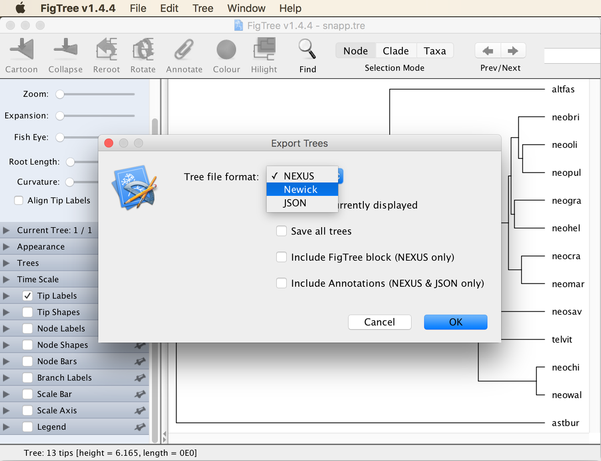
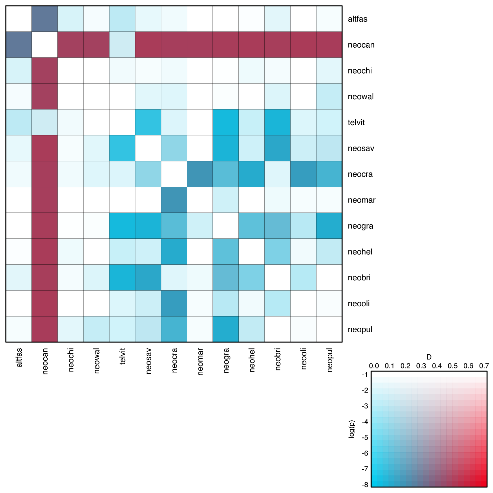
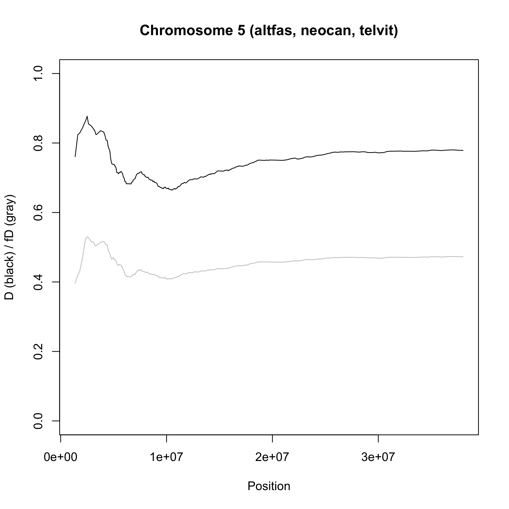
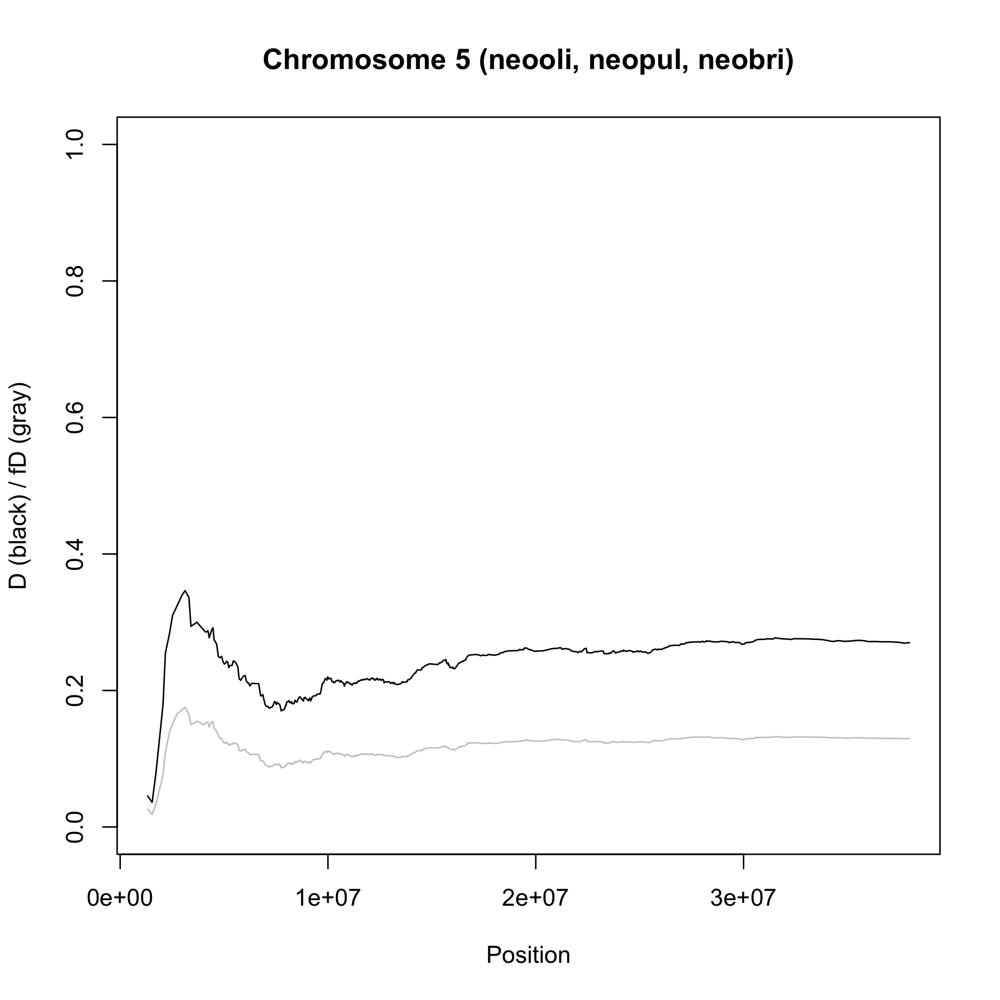

# Analysis of Introgression with SNP Data

A tutorial on the analysis of hybridization and introgression with SNP data

## Summary

A number of approaches for the analysis of introgression based on SNP data have been developed recently. Among these is the well-known ABBA-BABA test ([Green et al. 2010](http://science.sciencemag.org/content/328/5979/710.full)) that uses the so-called *D*-statistic to assess support for introgression in sets of four species. The original ABBA-BABA test has been extended in various ways, including the <i>D</i>FOIL-statistic that allows inferring the direction of introgression from sets of five species ([Pease and Hahn 2015](https://academic.oup.com/sysbio/article/64/4/651/1650669)) and the <i>f</i>D-statistic that is better suited for the identification of gene flow pertaining to certain regions of the genome ([Martin et al. 2014](https://academic.oup.com/mbe/article/32/1/244/2925550)). If a putative hybrid individual as well as the presumed parental species have already been identified, patterns of introgression can be investigated with ancestry painting, a method that focuses on sites that are fixed between the parental species and the alleles observed at these sites in the putative hybrid.

## Table of contents

* [Outline](#outline)
* [Dataset](#dataset)
* [Requirements](#requirements)
* [Identifying introgression with D-statistics](#dsuite)
* [Ancestry painting](#painting)

## Outline

In this tutorial I am going to present the application of *D*-statistics to identify introgression based on SNP data. Cases of introgression will be further investigated with sliding-window analyses, and ancestry painting will be used to  verify putatitve cases of hybridization.

## Dataset

The SNP data used in this tutorial is the unfiltered dataset used for species-tree inference with SVDQuartets in tutorial [Species-Tree Inference with SNP Data](../species_tree_inference_with_snp_data/README.md). More detailed information about the origin of this dataset is given in the Dataset section of this other tutorial. In brief, the dataset includes SNP data for the 28 samples of 14 cichlid species listed in the table below, and this data has already been filtered based on read quality and depth. Only SNPs mapping to chromosome 5 of the tilapia genome assembly ([Conte et al. 2017](https://bmcgenomics.biomedcentral.com/articles/10.1186/s12864-017-3723-5)) are included in the dataset.

| Sample ID | Species ID | Species name                  | Tribe         |
|-----------|------------|-------------------------------|---------------|
| IZA1      | astbur     | *Astatotilapia burtoni*       | Haplochromini |
| IZC5      | astbur     | *Astatotilapia burtoni*       | Haplochromini |
| AUE7      | altfas     | *Altolamprologus fasciatus*   | Lamprologini  |
| AXD5      | altfas     | *Altolamprologus fasciatus*   | Lamprologini  |
| JBD5      | telvit     | *Telmatochromis vittatus*     | Lamprologini  |
| JBD6      | telvit     | *Telmatochromis vittatus*     | Lamprologini  |
| JUH9      | neobri     | *Neolamprologus brichardi*    | Lamprologini  |
| JUI1      | neobri     | *Neolamprologus brichardi*    | Lamprologini  |
| LJC9      | neocan     | *Neolamprologus cancellatus*  | Lamprologini  |
| LJD1      | neocan     | *Neolamprologus cancellatus*  | Lamprologini  |
| KHA7      | neochi     | *Neolamprologus chitamwebwai* | Lamprologini  |
| KHA9      | neochi     | *Neolamprologus chitamwebwai* | Lamprologini  |
| IVE8      | neocra     | *Neolamprologus crassus*      | Lamprologini  |
| IVF1      | neocra     | *Neolamprologus crassus*      | Lamprologini  |
| JWH1      | neogra     | *Neolamprologus gracilis*     | Lamprologini  |
| JWH2      | neogra     | *Neolamprologus gracilis*     | Lamprologini  |
| JWG8      | neohel     | *Neolamprologus helianthus*   | Lamprologini  |
| JWG9      | neohel     | *Neolamprologus helianthus*   | Lamprologini  |
| JWH3      | neomar     | *Neolamprologus marunguensis* | Lamprologini  |
| JWH4      | neomar     | *Neolamprologus marunguensis* | Lamprologini  |
| JWH5      | neooli     | *Neolamprologus olivaceous*   | Lamprologini  |
| JWH6      | neooli     | *Neolamprologus olivaceous*   | Lamprologini  |
| ISA6      | neopul     | *Neolamprologus pulcher*      | Lamprologini  |
| ISB3      | neopul     | *Neolamprologus pulcher*      | Lamprologini  |
| ISA8      | neosav     | *Neolamprologus savoryi*      | Lamprologini  |
| IYA4      | neosav     | *Neolamprologus savoryi*      | Lamprologini  |
| KFD2      | neowal     | *Neolamprologus walteri*      | Lamprologini  |
| KFD4      | neowal     | *Neolamprologus walteri*      | Lamprologini  |

## Requirements

* **Dsuite:** The [Dsuite](https://github.com/millanek/Dsuite) program allows the fast calculation of the *D*-statistic from SNP data in VCF format. The program is particularly useful because it automatically calculates the *D*-statistic either for all possible species trios or for subsets of quartets that are compatible with a user-provided species tree. Instructions for download and installation on Mac OS X and Linux are provided on [https://github.com/millanek/Dsuite](https://github.com/millanek/Dsuite). Installation on Windows is not supported, but Windows users can use the provided output files to learn how to plot and analyze the Dsuite output.

* **FigTree:** The program [FigTree](http://tree.bio.ed.ac.uk/software/figtree/) by Andrew Rambaut is a very intuitive and useful tool for the visualization and (to a limited extent) manipulation of phylogenies encoded in [Newick](http://evolution.genetics.washington.edu/phylip/newicktree.html) format. Executables for Mac OS X, Linux, and Windows are provided on [https://github.com/rambaut/figtree/releases](https://github.com/rambaut/figtree/releases).

## Identifying introgression with *D*-statistics
		
Under incomplete lineage sorting alone, two sister species are expected to share about the same proportion of derived alleles with a third closely related species. Thus, if species "P1" and "P2" are sisters and "P3" is a closely related species, then the number of derived alleles shared by P1 and P3 but not P2 and the number of derived alleles that is shared by P2 and P3 but not P1 should be approximately similar. In contrast, if hybridization leads to introgression between species P3 and one out the two species P1 and P2, then P3 should share more derived alleles with that species than it does with the other one, leading to asymmetry in the sharing of derived alleles. These expectations are the basis for the so-called "ABBA-BABA test" (first described in the Supporting Material of [Green et al. 2010](http://science.sciencemag.org/content/328/5979/710.full)) that quantifies support for introgression by the *D*-statistic. In addition to the three species P1, P2, and P3, the ABBA-BABA test requires a fourth species, "P4", which should be a common outgroup to P1, P2, and P3, and only serves to determine which allele is the ancestral one and which is derived; the ancestral allele is then labelled "A" and the derived allele of a bi-allelic SNP is labelled "B". In the simplest case in which only a single haploid sequence is sampled from each of the four species, "ABBA sites" are those where species P2 and P3 share the derived allele B while P1 retains the ancestral allele A. Similarly "BABA sites" are those where P1 and P3 share the derived allele B while P2 retains the ancestral allele A. The *D*-statistic is then defined as the difference between the counts of ABBA sites and BABA sites relative to the sum of both types of sites:

*D* = (*C*ABBA - *C*BABA) / (*C*ABBA + *C*BABA)

This statistic is expected to be 0 if no introgression occurred, to be 1 in the extreme case of no incomplete lineage sorting but introgression between P2 and P3, and -1 if incomplete lineage sorting is absent but introgression occurred between P1 and P3. By convention, however, P1 and P2 are swapped if P1 turns out to be closer to P3 than P2 is to P3, so that the *D*-statistic remains within the interval [0, 1] and the number of ABBA sites is always greater than the number of BABA sites. When the dataset includes more than a single sequence per species, the calculation of the *D*-statistic is slightly more complicated and involves weighting each site for the ABBA or BABA pattern based on the allele frequencies observed in each species.

When more than four species are included in the dataset, obtaining *D*-statistics has long been a bit tedious because no program was available to calculate them automatically for all possible combinations of species in a VCF input file. This gap the available methodology, however, has recently been filled with the program Dsuite by Milan Malinsky ([Malinsky 2019](https://www.biorxiv.org/content/10.1101/634477v1)), which will be used in this tutorial. To calculate *D*-statistics not just for one specific quartet but comprehensively for sets of species in a VCF file, Dsuite keeps the outgroup (which is specified by the user) fixed, but tests all possible ways in which three species can be selected from the ingroup species and placed into the positions P1, P2, and P3. In addition to the *D*-statistic, Dsuite allows the calculation of a p-value based on jackknifing for the null hypothesis that the D-statistic is 0, which means that the absence of introgression can be rejected if the p-value is below the significance level.

In this part of the tutorial, we are going to calculate *D*-statistics with Dsuite to test for introgression among sets of species from our dataset. We will apply these statistics in particular to determine potential introgression into *Neolamprologus cancellatus*, the species that had been excluded from species-tree analyses in tutorials [Species-Tree Inference with SNP Data](../species_tree_inference_with_snp_data/README.md) and [Divergence-Time Estimation with SNP Data](../divergence_time_estimation_with_snp_data/README.md) due to its presumed hybrid nature. As mentioned in tutorial [Species-Tree Inference with SNP Data](../species_tree_inference_with_snp_data/README.md), *Neolamprologus cancellatus* ("neocan") is not accepted as a valid species by some authors who speculate that it is a "natural hybrid between *Telmatochromis vittatus* and another species" ([Konings 2015](http://www.cichlidpress.com/books/details/tc3.html)), based on field observations.

* Make sure that you have the file [`NC_031969.f5.sub1.vcf.gz`](data/NC_031969.f5.sub1.vcf.gz) in your current analysis directory, either by copying it from the analysis directory for tutorial [Species-Tree Inference with SNP Data](../species_tree_inference_with_snp_data/README.md), or by downloading it with the link. Make sure not to uncompress it yet.
	
* To assign samples to species for the calculation of the *D*-statistic, we'll need to write a table with two tab-delimited columns, where the first column contains the sample IDs and the second column contains the corresponding species ID. We are going to use the only haplochromine species in the dataset, *Astatotilapia burtoni* as the outgroup (its outgroup position was confirmed in tutorial [Divergence-Time Estimation with SNP Data](../divergence_time_estimation_with_snp_data/README.md)), which needs to be specified for Dsuite with the keyword "Outgroup". Thus, write the following text to a new file named `samples.txt`:

		IZA1	Outgroup
		IZC5	Outgroup
		AUE7	altfas
		AXD5	altfas
		JBD5	telvit
		JBD6	telvit
		JUH9	neobri
		JUI1	neobri
		LJC9	neocan
		LJD1	neocan
		KHA7	neochi
		KHA9	neochi
		IVE8	neocra
		IVF1	neocra
		JWH1	neogra
		JWH2	neogra
		JWG8	neohel
		JWG9	neohel
		JWH3	neomar
		JWH4	neomar
		JWH5	neooli
		JWH6	neooli
		ISA6	neopul
		ISB3	neopul
		ISA8	neosav
		IYA4	neosav
		KFD2	neowal
		KFD4	neowal

	(note that the file with the same name written in tutorial [Divergence-Time Estimation with SNP Data](../divergence_time_estimation_with_snp_data/README.md) should not be re-used here as its content differs).

* To familiarize yourself with Dsuite, simply start the program with the command `Dsuite`. When you hit enter, you should see a help text that informs you about three different commands named "Dtrios", "DtriosCombine", and "Dinvestigate", with short descriptions of what these commands do. Of the three commands, we are going to focus on Dtrios, which is the one that calculates the *D*-statistic for all possible species trios.

* To learn more about the command, type `Dsuite Dtrios` and hit enter. The help text should then inform you about how to run this command. You'll see that the available options allow to limit the genomic region used in the analysis, to specify a window size for significance testing based on jackknifing, or to specify a tree file. For now, there is no need to specify any of these options, but we'll look at the tree-file option later in this tutorial.

* As shown at the top of the Dsuite help text, the program can be run with `Dsuite Dtrios [OPTIONS] INPUT_FILE.vcf SETS.txt`. In our case, the input file is [`NC_031969.f5.sub1.vcf.gz`](data/NC_031969.f5.sub1.vcf.gz) and the sets files is the table with sample and species IDs written earlier to [`samples.txt`](res/samples.txt). Thus, start the Dsuite analysis of our dataset with

		Dsuite Dtrios NC_031969.f5.sub1.vcf.gz samples.txt
		
	The program should finish within a few minutes.

* Now have a look at the files in the current directory, using the `ls` command. You should see that Dsuite has written a number of files named after the sample-table file:

		samples__BBAA.txt
		samples__Dmin.txt
		samples__combine.txt
		samples__combine_stderr.txt
		
* Next, have a look at the content of file [`samples__combine.txt`](res/samples__combine.txt), for example using the `less` command. You'll see that the first part of this files has the following content:

		altfas  neobri  neocan  1378.2  13479.6 4066.95
		altfas  neobri  neochi  2281.67 2322.45 8154.16
		altfas  neobri  neocra  1610.98 1495.17 14174.6
		altfas  neobri  neogra  1618.4  1559.8  14312.1
		altfas  neobri  neohel  1549.77 1416.71 14741.8
		altfas  neobri  neomar  1980.94 1728.7  13168.8
		altfas  neobri  neooli  1668.03 1460.84 14734.4
		altfas  neobri  neopul  1279.66 1164.73 14283.7
		altfas  neobri  neosav  1729.49 1616.15 12626.2
		altfas  neobri  neowal  2525.99 2440.28 8572.34
		altfas  neobri  telvit  2581.12 2688.36 8258.12
		altfas  neocan  neochi  12306.4 1310.06 3745.6
		altfas  neocan  neocra  14200.7 1395.33 4097.46
		altfas  neocan  neogra  14825.3 1436.9  4286.4
		altfas  neocan  neohel  14063.7 1361.83 4102.08
		altfas  neocan  neomar  14794.6 1422.08 4181.25
		altfas  neocan  neooli  14834.4 1408.33 4274.5
		...

	Here, each row shows the results for the analysis of one trio, and for example in the first row, *Altolamprologus fasciatus* ("altfas") was used as P1, *Neolamprologus brichardi* was considered as P2, and *Neolamprologus cancellatus* was placed in the position of P3. The numbers in the fifth and sixth column of that row then include the count of ABBA sites, *C*ABBA, in that trio (where the derived allele is shared by "neobri" and "neocan") and the count of BABA sites, *C*BABA (where the derived allele is shared by "altfas" and "neocan"). Note, however, that (perhaps unintuitively) *C*ABBA is given in the sixth column whereas *C*BABA is in the fifth column. **Question 1:** Can you tell why these numbers are not integer numbers but have decimal positions? [(see answer)](#q1)
	
	In addition to the counts of BABA and ABBA sites in columns five and six, the fourth column lists the count of "BBAA" sites, *C*BBAA, at which the derived allele is shared by P1 and P2 (thus by "altfas" and "neobri"). **Question 2:** How many different trios are listed in the file? Are these all possible (unordered) trios? [(see answer)](#q2)
	
	You may note that in this file all trios are ordered alphabetically; thus, P1 is alphabetically before P2 and P2 is before P3. As described above, however, the ABBA-BABA test is based on the assumption that P1 and P2 are sister species. When calculating the *D*-statistic for a given trio, Dsuite first rearranges the species assigned to P1, P2, and P3 (and as a consequence the counts of ABBA, BABA, and BBAA sites are also rearranged), and this is done separately according to certain rules: 
	1. In a first set of calculations, all possible rearrangements are tested, and the lowest *D*-statistic, called *D*min is reported for each trio. *D*min is therefore a conservative estimate of the *D*-statistic in a given trio. This output is written to a file with the ending `__Dmin.txt`.
	2. The trio is arranged so that P1 and P2 are the two species of the trio that share the largest number of derived sites. In other words, the rearrangement is done so that *C*BBAA > *C*ABBA and *C*BBAA > *C*BABA. In addition, P1 and P2 are rotated so that the number of derived sites shared between P2 and P3 is larger than that between P1 and P3. In sum this means that *C*BBAA > *C*ABBA > *C*BABA. The idea behind this type of rearrangement is that the two species that share the largest number of derived sites are most likely the true two sister species in the trio, and thus rightfully placed in the positions P1 and P2. This assumption is expected to hold under certain conditions (e.g. clock-like evolution, absence of homoplasies, absence of introgression, and panmictic ancestral populations), but how reliable it is for real datasets is sometimes difficult to say. *D*-statistics based on this type of rearrangement are written to a file with ending `__BBAA.txt`.
	3. To tell Dsuite directly which species of a trio should be considered sister species (and thus, which should be assigned to P1 and P2), a tree file that contains all species of the dataset can be provided by the user with option `-t` or `--tree`. The output will then be written to an additional file with ending `__tree.txt`. We will use this option later in the tutorial.

* So, let's see how the *D*-statistics were calculated based on the first two rules for trio rearrangement. Have a look at file [`samples__Dmin.txt`](res/samples__Dmin.txt), e.g. with the `less` command:

		less samples__Dmin.txt
		
	You should see the first part of the file as shown below:
	
		P1      P2      P3      Dstatistic      p-value
		altfas  neocan  neobri  0.493787        0
		neobri  neochi  altfas  0.00885755      0.3836
		neocra  neobri  altfas  0.0372849       0.013765
		neogra  neobri  altfas  0.0184394       0.258714
		neohel  neobri  altfas  0.0448571       0.113967
		neomar  neobri  altfas  0.0679957       0.0195241
		neooli  neobri  altfas  0.0662179       0.0133793
		neopul  neobri  altfas  0.0470166       0.10957
		neosav  neobri  altfas  0.0338796       0.103889
		neowal  neobri  altfas  0.0172581       0.266909
		neobri  telvit  altfas  0.0203511       0.199163
		altfas  neocan  neochi  0.481745        0
		altfas  neocan  neocra  0.491942        0
		altfas  neocan  neogra  0.497877        0
		altfas  neocan  neohel  0.501518        0
		altfas  neocan  neomar  0.492416        0
		altfas  neocan  neooli  0.504355        0
		...

	One thing to notice here is that the species in the first three rows are no longer sorted alphabetically, so obviously they have been rearranged. As the header line indicates, the fourth column now shows the *D*-statistic for the trio in this constellation, and the fifth column shows the *p*-value based on jackknifing for the null hypothesis of *D* = 0.
	
* Let's pick one species trio and see how it appears in the three different files [`samples__combine.txt`](res/samples__combine.txt), [`samples__Dmin.txt`](res/samples__Dmin.txt), and [`samples__BBAA.txt`](res/samples__BBAA.txt). We'll select the first species trio, including "altfas", "neocan", and "neobri". To see only the line for this trio from the three files, you could use this command:

		cat samples__combine.txt | grep altfas | grep neocan | grep neobri
		cat samples__Dmin.txt | grep altfas | grep neocan | grep neobri
		cat samples__BBAA.txt | grep altfas | grep neocan | grep neobri

	This should produce the following three output lines:
	
		altfas	neobri	neocan	1378.2	13479.6	4066.95
		altfas	neocan	neobri	0.493787	0
		altfas	neocan	neobri	0.493787	0

	You'll see that compared to the alphabetical arrangement in [`samples__combine.txt`](res/samples__combine.txt), P1 has remained the same ("altfas") in the other two files, but P2 and P3 have been swapped ("neocan" and "neobri"). This swap also implied that the counts for ABBA, BABA, and BBAA patterns were swapped accordingly, so that after the swap and with P1="altfas", P2="neocan", P3="neobri", the counts were as follows: *C*ABBA = 4066.95, *C*BABA = 1378.2, and *C*BBAA = 13479.6. Thus, "neocan" and "neobri" share 4066.95 derived sites, "altfas" and "neobri" share 1378.2 derived sites, and "altfas" and "neocan" share 13479.6 derived sites. With these counts, *D* = (4066.95 - 1378.2) / (4066.95 + 1378.2) = 0.493787, as correctly reported by Dsuite in both files [`samples__Dmin.txt`](res/samples__Dmin.txt) and [`samples__BBAA.txt`](res/samples__BBAA.txt). **Question 3:** With *C*ABBA = 4066.95, *C*BABA = 1378.2, and *C*BBAA = 13479.6, the rule *C*BBAA > *C*ABBA > *C*BABA is fulfilled for this trio rearrangement, and thus it is not surprising that this particular rearrangement is reported in the output corresponding to this rule, the file ending in `__BBAA.txt`. But the fact that the same rearrangement is also included in the file ending in `__Dmin.txt` implies that the *D*-statistic for this rearrangement is smaller than it would be in all alternative rearrangements. Can you confirm this? [(see answer)](#q3)

* Repeat the same as in the last step, but this time using a species trio for which the rearrangements differ between the files [`samples__Dmin.txt`](res/samples__Dmin.txt) and [`samples__BBAA.txt`](res/samples__BBAA.txt). The trio "neobri", "neocra", and "neogra" is one such example. Use these commands to see the line for this trio in all three files:

		cat samples__combine.txt | grep neobri | grep neocra | grep neogra
		cat samples__Dmin.txt | grep neobri | grep neocra | grep neogra
		cat samples__BBAA.txt | grep neobri | grep neocra | grep neogra

	This should produce these output lines:
	
		neobri	neocra	neogra	3788.23	3552.38	2992.93
		neogra	neocra	neobri	0.0321294	0.145298
		neocra	neobri	neogra	0.0854723	8.58201e-07

	The results in file [`samples__BBAA.txt`](res/samples__BBAA.txt) indicate that when P1="neocra", P2="neobri", and P3="neogra", then *C*BBAA = 3788.23, *C*ABBA = 3552.38, and *C*BABA = 2992.93, and therefore *D* = (3552.38 - 2992.93) / (3552.38 + 2992.93) = 0.0854723.
	
	However, the results in file [`samples__Dmin.txt`](res/samples__Dmin) show that this time, another rearrangement (and therefore a rearrangement in which *C*BBAA is not larger than the two other counts) produces a lower *D*-statistic: With P1="neogra", P2="neocra", and P3="neobri", then *C*BBAA = 2992.93, *C*ABBA = 3788.23, and *C*BABA = 3552.38, and therefore *D* = (3788.23 - 3552.38) / (3788.23 + 3552.38) = 0.0321294. This illustrates that the *D*min value, reporting the lowest possible *D*-statistic for a given trio, sometimes selects an arrangement of the trio in which P1 and P2 actually share less derived sites with each other than both of them share with P3. This is in conflict with the original assumption of the ABBA-BABA test that P1 and P2 are more closely related to each other than to P3. When interpreting the results of Dsuite analyses, it should therefore be kept in mind that the *D*min values reported in the file ending in `__Dmin.txt` are in fact conservative estimates of the *D*-statistic. The values reported in the file ending in `__BBAA.txt`, which are based on the rearrangement that ensures *C*BBAA > *C*ABBA > *C*BABA, may often be better measurements of the *D*-statistic, however, the best option may be to also run the analysis with the `--tree` option, providing an input tree that directly tells Dsuite how to rearrange all trios.
	
To use the `--tree` option of Dsuite, we will obviously need a tree file. As a basis for that, we can use the time-calibrated species tree generated in tutorial [Divergence-Time Estimation with SNP Data](../divergence_time_estimation_with_snp_data/README.md), in file [`snapp.tre`](data/snapp.tre). However, we need to prepare the tree file before we can use it with Dsuite. First, Dsuite requires tree files in Newick format, but the tree file [`snapp.tre`](data/snapp.tre) is written in Nexus format. Second, as the tree generated in tutorial [Divergence-Time Estimation with SNP Data](../divergence_time_estimation_with_snp_data/README.md) did not include *Neolamprologus cancellatus*, we will need to add this species to the tree manually.

* To convert the tree file from Nexus to Newick format, simply open [`snapp.tre`](data/snapp.tre) in FigTree, and select "Export Trees..." from FigTree's "File" menu. In the dialog window, select "Newick" from the drop-down menu next to "Tree file format:", as shown in the next screenshot.

 Name the new file `snapp.as_newick.tre`.

	The tree file [`snapp.as_newick.tre`](res/snapp.as_newick.tre) should now have the following content, in which branch lengths are encoded by numbers following colon symbols:

		((altfas:2.594278046475669,((((((neobri:0.4315861683285048,(neooli:0.3619356529967183,neopul:0.3619356529967182):0.06965051533178657):0.12487340944557368,(neogra:0.5002021127811682,neohel:0.5002021127811681):0.05625746499291029):0.046536377715870936,(neocra:0.3843764668581544,neomar:0.3843764668581544):0.21861948863179498):0.13696107245777023,neosav:0.7399570279477196):0.3048349276159825,telvit:1.044791955563702):0.06307730474269935,(neochi:0.1368491602607037,neowal:0.1368491602607037):0.9710201000456977):1.4864087861692676):3.570689300019641,astbur:6.16496734649531);

* To add *Neolamprologus cancellatus* ("neocan") to the tree, we need to make a decision about where to place it. Perhaps the best way to do this would be a separate phylogenetic analysis, but as we will see later, there is no single true position of *Neolamprologus cancellatus* ("neocan") in the species tree anyway. So for now it will be sufficient to use the counts of shared derived sites from file [`samples__BBAA.txt`](res/samples__BBAA.txt) as an indicator for where best to place the species. Thus, we need to find the largest count of derived sites that *neocan* shares with any other species. To do this, we can use the following commands:

		cat samples__combine.txt | grep neocan | sort -n -k 4 -r | head -n 1
		cat samples__combine.txt | grep neocan | sort -n -k 5 -r | head -n 1
		cat samples__combine.txt | grep neocan | sort -n -k 6 -r | head -n 1

	This should produce the following lines:
	
		altfas	neocan	neooli	14834.4	1408.33	4274.5
		altfas	neobri	neocan	1378.2	13479.6	4066.95
		neocan	neochi	neowal	801.883	754.94	12863.7

	The largest number of all of these lines is 14834.4. As this number is found in the fourth column, it specifies the count of BBAA sites, *C*BBAA, and therefore the number of derived sites shared by the first two species on this line, "altfas" and "neocan". This means that "neocan" appears to be more closely related to "altfas" than to other species in the dataset.
	
* To insert "neocan" into the tree string as the sister species of "altfas", replace "altfas" with "(altfas:1.0,neocan:1.0)", including the parentheses (the branch length of 1.0 is arbitrary but will not be used by Dsuite anyway). This could be done using a text editor, or on the command line with the following command, saving the modified tree string in a new file named `snapp.complete.tre`:

		cat snapp.as_newick.tre | sed "s/altfas/(altfas:1.0,neocan:1.0)/g" > snapp.complete.tre

	File snapp.complete.tre should then contain the following tree string:
	
		(((altfas:1.0,neocan:1.0):2.594278046475669,((((((neobri:0.4315861683285048,(neooli:0.3619356529967183,neopul:0.3619356529967182):0.06965051533178657):0.12487340944557368,(neogra:0.5002021127811682,neohel:0.5002021127811681):0.05625746499291029):0.046536377715870936,(neocra:0.3843764668581544,neomar:0.3843764668581544):0.21861948863179498):0.13696107245777023,neosav:0.7399570279477196):0.3048349276159825,telvit:1.044791955563702):0.06307730474269935,(neochi:0.1368491602607037,neowal:0.1368491602607037):0.9710201000456977):1.4864087861692676):3.570689300019641,astbur:6.16496734649531);

* Run Dsuite again, this time adding the `-t` (or `--tree`) option to specify the newly prepared tree file [`snapp.complete.tre`](res/snapp.complete.tre):

		Dsuite Dtrios -t snapp.complete.tre NC_031969.f5.sub1.vcf.gz samples.txt

	Dsuite should again finish the analysis within a few minutes. The output should be identical to the previously written output except that a file named `samples__tree.txt` should now also be written. **Question 4:** Do the results differ when trios are rearranged either to maximize the number of derived sites shared between P1 and P2 (thus, the results in file [`samples__BBAA.txt`](res/samples__BBAA.txt)) or according to the provided tree (in file [`samples__tree.txt`](res/samples__tree.txt))?

* To further explore differences among the output files based on different rules for trio rearrangement, find the highest *D*-statistic reported in each of the files [`samples__Dmin.txt`](res/samples__Dmin.txt)), [`samples__BBAA.txt`](res/samples__BBAA.txt)), and [`samples__tree.txt `](res/samples__tree.txt)). One way to do this are the three following commands:

		cat samples__Dmin.txt | tail -n +2 | sort -n -k 4 -r | cut -f 4 | head -n 1
		cat samples__BBAA.txt | tail -n +2 | sort -n -k 4 -r | cut -f 4 | head -n 1
		cat samples__tree.txt | tail -n +2 | sort -n -k 4 -r | cut -f 4 | head -n 1
		
	You'll see that the highest *D*-statistic reported in file [`samples__Dmin.txt`](res/samples__Dmin.txt)) (0.504355) is smaller than those in the the other two files (0.778765 in both cases). This is not surprising, given that, as explained above, the *D*min values are conservative measure of introgression in a given trio.

* Find the trio responsible for these extreme *D*-statistics, using the following commands:

		cat samples__Dmin.txt | tail -n +2 | sort -n -k 4 -r | head -n 1
		cat samples__BBAA.txt | tail -n +2 | sort -n -k 4 -r | head -n 1
		cat samples__tree.txt | tail -n +2 | sort -n -k 4 -r | head -n 1

	You'll see that the high *D*-statistic of 0.778765 is reported for the trio in which P1="altfas", P2="neocan", and P3="telvit".
	
* Look up the counts of shared sites for this trio from file [`samples__combine.txt`](res/samples__combine.txt), using the following command:

		cat samples__combine.txt | grep altfas | grep neocan | grep telvit
		
	You should then see that *C*BBAA = 12909.6 (in the fourth column), *C*BABA = 893.302 (in the fifth column), and *C*ABBA = 7182.28 (in the sixth column). Thus, "altfas" and "neocan" share 12909.6 derived sites, "neocan" and "telvit" share 7182.28 derived sites, but "altfas" and "telvit" share only 893.302 derived sites.
	
	The *D*-statistic is therefore
	
	*D* = (7182.28 - 893.302) / (7182.28 + 893.302) = 0.778765
	
	as reported in files [`samples__BBAA.txt`](res/samples__BBAA.txt)) and [`samples__tree.txt `](res/samples__tree.txt)). In file [`samples__Dmin.txt`](res/samples__Dmin.txt)), however, *D* was calculated for this trio as 
	
	*D* = (12909.6 - 7182.28) / (12909.6 + 7182.28) = 0.285055
	
	after rearranging the species so that P1="telvit", P2="altfas", and P3="neocan", and thus *C*BBAA = 893.302, *C*ABBA = 12909.6 and *C*BABA = 7182.28. This *D*-statistic is lower than those reported for other trios in file [`samples__Dmin.txt`](res/samples__Dmin.txt)), therefore, the command `cat samples__Dmin.txt | tail -n +2 | sort -n -k 4 -r | head -n 1` reported a different trio that included "neooli" instead of "telvit". Either way, the *p*-values for the *D*-statistics are highly significant for many trios and in particular for those that include *Neolamprologus cancellatus* ("neocan"), indicating introgression involving this species is highly supported. Given that the highest *D*-statistics are reported for the trio in which P1="altfas", P2="neocan", and P3="telvit", we may hypothesize that *Neolamprologus cancellatus* "neocan" has received a large amount of introgression from *Telmatochromis vittatus*, in agreement with the speculation by [Konings (2015)](http://www.cichlidpress.com/books/details/tc3.html) that *Neolamprologus cancellatus* is a "natural hybrid between *Telmatochromis vittatus* and another species".

* To get a better overview of introgression patterns supported by *D*-statistics, we'll plot these in the form of a heatmap in which the species in positions P2 and P3 are sorted on the horizontal and vertical axes, and the color of the corresponding heatmap cell indicates the most significant *D*-statistic found with these two species, across all possible species in P1. To prepare this plot, we will, however, first need to prepare a file that lists the order in which the P2 and P3 species should be listed along the heatmap axes. It makes sense to sort species for this according to the tree file that we used ([`snapp.complete.tre`](res/snapp.complete.tre)); thus, write the following list to a new file named `species_order.txt`:

		altfas
		neocan
		neochi
		neowal
		telvit
		neosav
		neocra
		neomar
		neogra
		neohel
		neobri
		neooli
		neopul
		
	(note that even though the outgroup "astbur" is included in the tree file, we here exclude it because it was never placed in the positions of P2 or P3 in the Dsuite analyses).

* To plot the heatmap, use the Ruby script [`plot_d.rb`](src/plot_d.rb), specifying one of Dsuite's output files, file [`species_order.txt`](res/species_order.txt), the maximum *D* value to plot, and the name of an output file as command-line options. Start the script with the [`samples__Dmin.txt`](res/samples__Dmin.txt) file as input and a maximum *D* of 0.7, and name the output `samples__Dmin.svg`:

		ruby plot_d.rb samples__Dmin.txt species_order.txt 0.7 samples__Dmin.svg
		
* The heatmap plot in file `samples__Dmin.svg` is written scalable vector graphic (SVG) format. Open this file with a program capable of reading files in SVG format, for example with a browser such as Firefox or with Adobe Illustrator. The heatmap plot should look as shown below:

 As you can see from the color legend in the bottom right corner, the colors of this heatmap show two things at the same time, the *D*-statistic as well as its *p*-value. So red colors indicate higher *D*-statistics, and generally more saturated colors indicate greater significance. Thus, the strongest signals for introgression are shown with saturated red, as in the bottom right of the color legend. While none of the cells in this plot actually have that color, almost all cells in rows or columns for "neocan" have a red-purple color corresponding to a highly significant *D*-statistic around 0.3.

	In case that you're wondering why the heatmap looks symmetric, that is because no matter whether the maximum *D*-statistic for two species is obtained with the first species in position P2 and the second in position P3 or vice versa, the same value is plotted. The reason for this is that even though different *D*-statistics may result in the two cases, those differences should not be taken as evidence for a directionality of introgression from P3 to P2; it could just as well have come from P2 and into P3.
		
* Before further interpreting the patterns of introgression shown in the heatmap, we'll also produce heatmap plots for the other two of Dsuite's output files, [`samples__BBAA.txt`](res/samples__BBAA.txt) and [`samples__tree.txt`](res/samples__tree.txt):

		ruby plot_d.rb samples__BBAA.txt species_order.txt 0.7 samples__BBAA.svg
		ruby plot_d.rb samples__tree.txt species_order.txt 0.7 samples__tree.svg

	The two heatmaps should look as shown below (`samples__BBAA.svg` at top, `samples__tree.svg` below):

 As you can see, both of the above heatmaps are overall a bit more saturated than the first heatmap based on *D*min, in agreement with the interpretation of *D*min as a conservative estimate of introgression. The strongest difference, however, is in the patterns shown for *Telmatochromis vittatus* ("telvit"). The most saturated red colors in the latter two plots are those for the cells connecting "neocan" and "telvit", which in contrast is only light blue in the first plot based on *D*min. These plots therefore support the hypothesis that introgression occurred between *Neolamprologus cancellatus* ("neocan") and *Telmatochromis vittatus* ("telvit"). However, the other red-purple cells in the rows and columns for "neocan" and "telvit" may only be side-effects of this introgression. In the last heatmap from file `samples__tree.svg`, for example, the red-purple cells could be caused by sites that are shared between *Neolamprologus cancellatus* ("neocan") and other species only because these other species are closely related to *Telmatochromis vittatus* ("telvit"), the putative donor of introgression.
	
	In addition, there seems to be some support for introgression among the species of the genus *Neolamprologus*, such as between *N. crassus* and *N. brichardi* or between *N. brichardi* and *N. pulcher*.

So far we only calculated *D*-statistics across the entire chromosome 5 (the only chromosome included in the VCF), but we haven't yet tested whether the *D*-statistic is homogeneous or variable throughout the chromosome. This information could be valuable to determine how recent introgression has occurred because younger introgression events are expected to produce more large-scale variation in the *D*-statistic than older introgression events. The information could also help to identify individual introgressed loci.

* To quantify the *D*-statistic in sliding windows across the genome, Dsuite's Dinvestigate command can be used, and we will apply it to the trio with the strongest signals of introgression, composed of the three species *Altolamprologus fasciatus* ("altfas"), *Neolamprologus cancellatus* ("neocan"), and *Telmatochromis vittatus* ("telvit"). Have a look at the available options for this command, simply by typing the following:

		Dsuite Dinvestigate

	You'll see that besides the VCF input file [`NC_031969.f5.sub1.vcf.gz`](data/NC_031969.f5.sub1.vcf.gz) and the samples table [`samples.txt`](res/samples.txt), two more pieces of information are required. One is a file containing only the species names from one or more trios, and the other is a window size (plus the step size by which the window is incremented) that should be used for the sliding window-analyses.
	
* Prepare a file specifying the trio "altfas", "neocan", and "telvit", and name this file `test_trios.txt`. This could be done on the command line with the following command:

		echo -e "altfas\tneocan\ttelvit" > test_trios.txt
		
* We'll use a window size of 2,500 SNPs, incremented by 500 SNPs per iteration. To start sliding-window analyses with these settings, execute the following command:

		Dsuite Dinvestigate -w 2500,500 NC_031969.f5.sub1.vcf.gz samples.txt test_trios.txt 
		
	This analysis should again take only a few minutes. Dsuite should then have written a file named `altfas_neocan_telvit_localFstats__2500_500.txt`.
	
* Have a look at file [`altfas_neocan_telvit_localFstats__2500_500.txt`](res/altfas_neocan_telvit_localFstats__2500_500.txt), for example using the `less` command:

		less altfas_neocan_telvit_localFstats__2500_500.txt
		
	The rows in this file correspond to individual chromosomal windows, and the  six columns included in the file contain information on the chromosome ID and the start and end positions of each window. This is followed by three numbers on each line, which represent the *D*-statistic calculated for the window in the fourth column, and two further statistics aiming to quantify the proportions of the window affected by introgression. The two statistics are the *f*d statistic of [Martin et al. (2015)](https://academic.oup.com/mbe/article/32/1/244/2925550) and the related *f*dM statistic introduced by [Malinsky et al. (2015)](https://science.sciencemag.org/content/350/6267/1493).
	
* Find out into how many windows chromosome 5 was divided, using the following command:

		cat altfas_neocan_telvit_localFstats__2500_500.txt | tail -n +2 | wc -l
		
	This should show that 509 windows were used in Dsuite's Dinvestigate analysis. If this number would be much higher or lower, the information density could be adjusted by specifying a larger or smaller window size with `-w`.
	
* To visualize the variation of the *D* and *f*d statistics across chromosome 5, we'll generate plots with the R environment. If you're familiar with R, you could use the software R Studio or another GUI program for R, but you could also run R on the command line as shown below. To start R interactively on the command line, simply type `R`. Then, write the following commands to read file [`altfas_neocan_telvit_localFstats__2500_500.txt`](res/altfas_neocan_telvit_localFstats__2500_500.txt) and plot the *D* and *f*d statistics against the chromosomal position of the center of the alignment:

		table <- read.table("altfas_neocan_telvit_localFstats__2500_500.txt", header=T)
		windowCenter=(table$windowStart+table$windowEnd)/2
		pdf("altfas_neocan_telvit_localFstats__2500_500.pdf", height=7, width=7)
		plot(windowCenter, table$D, type="l", xlab="Position", ylab="D (gray) / fD (black)", ylim=c(0,1), main="Chromosome 5 (altfas, neocan, telvit)", col="gray")
		lines(windowCenter, table$f_d)
		dev.off()

* To exit the interactive R environment and return to the command line, type this command:

		quit(save="no")

	The above commands should have written the plot to a file named [`altfas_neocan_telvit_localFstats__2500_500.pdf`](res/altfas_neocan_telvit_localFstats__2500_500.pdf) in the analysis directory. The plot should show that the *D*-statistic (in gray) is almost in all windows substantially higher than the *f*d-statistic (in black), and that the *f*d-statistic, which estimates admixture proportion is mostly close 0.5:

 There also appears to be a dip in both statistics at around 5 Mbp; however, whether this is an artifact resulting from e.g. missing data or misassembly in the reference genome, or whether it shows a biological signal of reduced introgression is difficult to tell without further analyses.

* Repeat the same for a second trio that appeared to show signals of introgression, composed of *Neolamprologus olivaceous* ("neooli"), *N. pulcher* ("neopul), and *N. brichardi* ("neobri"). To do so, use these commands on the command line:

		echo -e "neooli\tneopul\tneobri" > test_trios.txt
		Dsuite Dinvestigate -w 2500,500 NC_031969.f5.sub1.vcf.gz samples.txt test_trios.txt

* To produce the same type of plot as before now for the trio of "neooli", "neopul", and "neobri", use again the R environment and enter the following commands:

		table <- read.table("neooli_neopul_neobri_localFstats__2500_500.txt", header=T)
		windowCenter=(table$windowStart+table$windowEnd)/2
		pdf("neooli_neopul_neobri_localFstats__2500_500.pdf", height=7, width=7)
		plot(windowCenter, table$D, type="l", xlab="Position", ylab="D (gray) / fD (black)", ylim=c(0,1), main="Chromosome 5 (neooli, neopul, neobri)", col="gray")
		lines(windowCenter, table$f_d)
		dev.off()
		
	(again, quit the R environment with `quit(save="no")`). This should have produced the plot shown below, saved to file [`neooli_neopul_neobri_localFstats__2500_500.pdf`](res/neooli_neopul_neobri_localFstats__2500_500.pdf):

	As you can see, the *D*-statistic (in black) now shows more variation and even becomes negative in several windows, indicating that in these windows, *neooli* shares more similarity with *neobri* than *neopul*. Overall, both statistics are lower than for the first trio. Notably, the dip at around 5 Mbp that was apparent in both statistics for the first trio is again visible. As it appears improbable that the same region has more introgression in both species trios, this may indicate that the dip is in fact caused by technical artifacts rather than biological processes. To further investigate whether any of the peaks or troughs in this plot result from actual changes in the introgression proportion, it might be necessary to compare the *D* and *f*d-statistics to measures of between-species differentiation (*F*ST) and divergence (*d*XY) (see, e.g. [The Heliconius Genome Consortium 2012](https://www.nature.com/articles/nature11041)). The reliability of these patterns could also be tested by repeating the analysis after mapping to an alternative, if possible more closely related, reference genome. Such in-depth analyses of introgressed loci based on genome scans are covered, for example, in the [Physalia Speciation Genomics workshop](https://www.physalia-courses.org/courses-workshops/course37/curriculum-37/) run by Mark Ravinet and Joana Meier.

## Ancestry painting

A very simple alternative way of investigating patterns of ancestry in potentially introgressed or hybrid species is to "paint" their chromosomes according to the genotypes carried at sites that are fixed between the presumed parental species. This type of plot, termed "ancestry painting" was used for example by [Fu et al. (2015; Fig. 2)](https://www.nature.com/articles/nature14558) to find blocks of Neanderthal ancestry in an ancient human genome, by [Der Sarkassian et al. (2015; Fig. 4)](https://www.cell.com/current-biology/abstract/S0960-9822(15)01003-9) to investigate the ancestry of Przewalski's horses, by [Runemark et al. (2018; Suppl. Fig. 4)](https://www.nature.com/articles/s41559-017-0437-7) to assess hybridization in sparrows, and by [Barth et al. (2019; Fig. 2)](https://www.biorxiv.org/content/10.1101/635631v1) to identify hybrids in tropical eels.

* If you haven't seen any of the above-named studies, you might want to have a look at the ancestry-painting plots in some of them. You may note that the ancestry painting in [Fu et al. (2015; Fig. 2)](https://www.nature.com/articles/nature14558) is slightly different from the other two studies because no discrimination is made between heterozygous and homozygous Neanderthal alleles. Each sample in Fig. 2 of [Fu et al. (2015)](https://www.nature.com/articles/nature14558) is represented by a single row of cells that are white or colored depending on whether or not the Neanderthal allele is present at a site. In contrast, each sample in the ancestry paintings of [Der Sarkassian et al. (2015; Fig. 4)](https://www.cell.com/current-biology/abstract/S0960-9822(15)01003-9), [Runemark et al. (2018; Suppl. Fig. 4)](https://www.nature.com/articles/s41559-017-0437-7), and [Barth et al. (2019; Fig. 2)](https://www.biorxiv.org/content/10.1101/635631v1) is drawn with two rows of cells. However, as the analyses in both studies were done with unphased data, these two rows do not represent the two haplotypes per sample. Instead, the two cells per site were simply both colored in the same way for homozygous sites or differently for heterozygous sites without regard to haplotype structure.

	Here, we are going to use ancestry painting to investigate ancestry in *Neolamprologus cancellatus* ("neocan"), assuming that it is a hybrid between the parental species *Altolamprologus fasciatus* ("altfas") and *Telmatochromis vittatus* ("telvit"). As in [Der Sarkassian et al. (2015; Fig. 4)](https://www.cell.com/current-biology/abstract/S0960-9822(15)01003-9), [Runemark et al. (2018; Suppl. Fig. 4)](https://www.nature.com/articles/s41559-017-0437-7), and [Barth et al. (2019; Fig. 2)](https://www.biorxiv.org/content/10.1101/635631v1), we are going to draw two rows per sample to indicate whether genotypes are homozygous or heterozygous.

* To generate an ancestry painting, we will need to run two Ruby scripts. The first of these, [`get_fixed_site_gts.rb`](src/get_fixed_site_gts.rb) determines the alleles of the putative hybrid species at sites that are fixed differently in the two putative parental species. The second script, [`plot_fixed_site_gts.rb`](src/plot_fixed_site_gts.rb) then uses the output of the first script to draw an ancestry painting. As the first script requires an uncompressed VCF file as input, first uncompress the VCF file for the SNP dataset with the following command:

		gunzip -c NC_031969.f5.sub1.vcf.gz > NC_031969.f5.sub1.vcf

* Then, run the Ruby script [`get_fixed_site_gts.rb`](src/get_fixed_site_gts.rb) to determine the alleles at sites that are fixed differently in the two parents. This script expects six arguments; these are
	* the name of the uncompressed VCF input file, `NC_031969.f5.sub1.vcf`,
	* the name of an output file, which will be a tab-delimited table,
	* a string of comma-separated IDs of samples for the first putative parent species,
	* a string of comma-separated IDs of samples for the putative hybrid species,
	* another string of comma-separated IDs of samples for the second putative parent species,
	* a threshold value for the required completeness of parental genotype information so that sites with too much missing data are discarded.

	We'll use `NC_031969.f5.sub1.vcf` as the input and name the output file `pops1.fixed.txt`. Assuming that the parental species are *Altolamprologus fasciatus* ("altfas") and *Telmatochromis vittatus* ("telvit") and the hybrid species is *Neolamprologus cancellatus* ("neocan"), we'll specify the sample IDs for these species with the strings "AUE7,AXD5", "JBD5,JBD6", and "LJC9,LJD1". Finally, we'll filter for sites without missing data by specifying "1.0" as the sixth argument. Thus, run the script [`get_fixed_site_gts.rb`](src/get_fixed_site_gts.rb) with the following command:

		ruby get_fixed_site_gts.rb NC_031969.f5.sub1.vcf pops1.fixed.txt AUE7,AXD5 LJC9,LJD1 JBD5,JBD6 1.0

* The second script, [`plot_fixed_site_gts.rb`](src/plot_fixed_site_gts.rb), expects four arguments, which are
	* the name of the file written by script [`get_fixed_site_gts.rb`](src/get_fixed_site_gts.rb),
	* the name of an output file which will be a plot in SVG format,
	* a threshold value for the required completeness, which now applies not only to the parental species but also to the putative hybrid species,
	* the minimum chromosomal distance in bp between SNPs included in the plot. This last argument aims to avoid that the ancestry painting is overly dominated by high-divergence regions.

	We'll use the file [`pops1.fixed.txt`](res/pops1.fixed.txt) as input, name the output file `pops1.fixed.svg`, require again that no missing data remains in the output, and we'll thin the remaining distances so that those plotted have a minimum distance of 1,000 bp to each other. Thus, use the following command to draw the ancestry painting:

		ruby plot_fixed_site_gts.rb pops1.fixed.txt pops1.fixed.svg 1.0 1000
		
	The screen output of this script will include some warnings about unexpected genotypes, these can be safely ignored as the script automatically excludes those sites. At the very end, the output should indicate that 6,069 sites with the required completeness were found, these are the sites included in the ancestry painting. Th output also reports, for all analyzed specimens, the heterozygosity at those 6,069 sites. For first-generation hybrids, this heterozygosity is expected to be close to 1.

* Open the file [`pops1.fixed.svg`](res/pops1.fixed.svg) with a program capable of reading files in SVG format, for example with a browser such as Firefox or with Adobe Illustrator. You should see a plot like the one shown below. 

	In this ancestry painting, the two samples of the two parental species are each drawn in solid colors because all included sites were required to be completely fixed and completely without missing data. The samples of *Neolamprologus cancellatus*, "LJC9" and "LJD1" are drawn in between, with two rows per sample that are colored according to genotypes observed at the 6,069 sites. Keep in mind that even though the pattern may appear to show phased haplotypes, this is not the case; instead the bottom row for a sample is arbitrarily colored in red and the top row is colored in blue when the genotype is heterozygous.
	
	**Question 5:** Do you notice any surprising difference to the ancestry plots of [Der Sarkassian et al. (2015; Fig. 4)](https://www.cell.com/current-biology/abstract/S0960-9822(15)01003-9) and [Runemark et al. (2018; Suppl. Fig. 4)](https://www.nature.com/articles/s41559-017-0437-7)? [(see answer)](#q5)

	**Question 6:** How can this difference be explained? [(see answer)](#q6)

 

                   

## Answers

* **Question 1:** In fact, integer counts of ABBA and BABA sites would only be expected if each species would be represented only by a single haploid sequence. With diploid sequences and multiple samples per species, allele frequences are taken into account to weigh the counts of ABBA and BABA sites as described by equation 1 of Malinsky [(2019](https://www.biorxiv.org/content/10.1101/634477v1)).

* **Question 2:** Because each trio is listed on a single row, the number of trios in file [`samples__combine.txt`](res/samples__combine.txt) is identical to the number of lines in this file. This number can easily be counted using, e.g. the following command:

		cat samples__combine.txt | wc -l
		
	You should see that the file includes 286 lines and therefore results for 286 trios. Given that the dataset includes (except the outgroup species) 13 species and 3 of these are required to form a trio, the number of possible trios is 
	
	[13 choose 3](https://en.wikipedia.org/wiki/Binomial_coefficient) = 13! / (3! &times; 10!) = 6227020800 / (6 &times; 3628800) = 286.
	
	(where ! denotes the [factorial function](https://en.wikipedia.org/wiki/Factorial))
	
	Thus, all possible trios seem to be included in file [`samples__combine.txt`](res/samples__combine.txt).
	

* **Question 3:** *D*-statistics that could be obtained with alternative rearrangements of the trio "altfas", "neocan", and "neobri" are the following:
	
	*D* = (13479.6 - 1378.2) / (13479.6 + 1378.2) = 0.814481
	*D* = (13479.6 - 4066.95) / (13479.6 + 4066.95) = 0.536438
	
	Without violating the convention that *C*ABBA > *C*BABA, ensuring that *D* is positive, no other *D* statistics can be obtained for this trio. Thus, the reported *D*-statistic of 0.493787, even though it is extremely high, is in fact the lowest *D*-statistic possible for this trio.
	

* **Question 4:** Comparing the two files [`samples__BBAA.txt`](res/samples__BBAA.txt) and [`samples__tree.txt`](res/samples__tree.txt), for example using the command `diff samples__BBAA.txt samples__tree.txt` shows some differences. For example, the trio "neobri", "neocan", and "telvit" is arranged so that "neocan" and "telvit" are in the positions of P1 and P2 in [`samples__BBAA.txt`](res/samples__BBAA.txt), but "neobri" and "telvit" are in the same positions in [`samples__tree.txt`](res/samples__tree.txt). Such disagreement can arise when sister species do not share the largest number of derived sites with each other, for example as a result of introgression, ancestral population structure, or variation in substitution rates.

* **Question 5:** One remarkable difference compared to the ancestry painting of [Der Sarkassian et al. (2015; Fig. 4)](https://www.cell.com/current-biology/abstract/S0960-9822(15)01003-9) and [Runemark et al. (2018; Suppl. Fig. 4)](https://www.nature.com/articles/s41559-017-0437-7) is that almost no homozygous genotypes are observed in the two samples of *Neolamprologus cancellatus*: the bottom rows are drawn almost entirely in red for the two putative hybrid individuals and the top rows are almost entirely in blue. The same pattern, however, can be found in [Barth et al. (2019; Fig. 2)](https://www.biorxiv.org/content/10.1101/635631v1).

* **Question 6:** The fact that both *Neolamprologus cancellatus* samples are heterozygous for basically all sites that are differentially fixed in the two parental species can only be explained if both of these samples are in fact first-generation hybrids. If introgression would instead be more ancient and backcrossing (or recombination within the hybrid population) had occurred, we would expect that only certain regions of the chromosome are heterozygous while others should be homozygous for the alleles of one or the other of the two parental species. However, unlike in cases where the genomes have been sequenced of parent-offspring trios, we do not know who the actual parent individuals were. We can guess that the parent individuals were members of the species *Altolamprologus fasciatus* and *Telmatochromis vittatus*, but whether the parental individuals were part of the same population as the sampled individuals or a more distantly related population within these species remains uncertain. 