# Analysis of Introgression with SNP Data

A tutorial on the analysis of hybridization and introgression with SNP data by Milan Malinsky (millanek@gmail.com) and Michael Matschiner

## Introduction

Admixture between populations and hybridisation between species are common and a bifurcating tree is often insufficient to capture their evolutionary history ([example](https://www.sciencedirect.com/science/article/pii/S0959437X16302052)). Patterson’s D, also known as ABBA-BABA, and the related estimate of admixture fraction <i>f</i>, referred to as the f4-ratio are commonly used to assess evidence of gene flow between populations or closely related species in genomic datasets. They are based on examining patterns of allele sharing across populations or closely related species. Although they were developed in within a population genetic framework the methods can be successfully applied for learning about hybridisation and introgression within groups of closely related species, as long as common population genetic assumptions hold – namely that (a) the species share a substantial amount of genetic variation due to common ancestry and incomplete lineage sorting; (b) recurrent and back mutations at the same sites are negligible; and (c) substitution rates are uniform across species. 

Patterson's D and related statistics have also been used to identify introgressed loci by sliding window scans along the genome, or by calculating these statistics for particular short genomic regions. Because the D statistic itself has large variance when applied to small genomic windows and because it is a poor estimator of the amount of introgression, additional statistics which are related to the f4-ratio have been designed specifically to investigate signatures of introgression in genomic windows along chromosomes. These statistics include <i>f</i><sub>d</sub> (Martin et al., 2015), its extension <i>f</i><sub>dM</sub> (Malinsky et al., 2015), and the distance fraction <i>d</i><sub>f</sub> (Pfeifer & Kapan, 2019).

## Table of contents

* [Outline](#outline)
* [Requirements](#requirements)
* [1. Inferring the species-tree and gene-flow from a simulated dataset](#simulation)
* [1.1 Simulating phylogenomic data with msprime](#simulation)
* [1.2 Reconstructing phylogenies from simulated data](#ReconstructingFromSimulation)
* [1.3 Testing for gene-flow in simulated data ](#TestingInSimulations)
* [1.3.2 Do we find geneflow in data simulated without geneflow?](#TestingWithoutGeneflow)
* [1.3.2 Do we find geneflow in data simulated with geneflow?](#TestingWithGeneflow)
* [2. Finding specific introgressed loci - adaptive introgression in Malawi cichlids](#SpecificLoci)
* [3. Finding geneflow in a real dataset - Tanganyikan cichlids](#Tanganyika)
* [4. Ancestry painting](#painting)

<!--- * [Dataset](#dataset)-->

<a name="outline"></a>
## Outline

In this tutorial, we are first going to use simulated data to demonstrate that, under gene-flow, some inferred species relationships might not correspond to any real biologial relationships. Then we are going to use [Dsuite](https://doi.org/10.1111/1755-0998.13265), a software package that implements Patterson’s D and related statistics in a way that is straightforward to use and computationally efficient. This will allow us to identify admixed taxa. While exploring Dsuite, we are also going to learn or revise concepts related to application, calculation, and interpretation of the D and of related statistics. Next we apply sliding-window statistics to identify particular introgressed loci in a real dataset of Malawi cichlid fishes. Finally, we look at the same data that was used for species-tree inference with SVDQuartets in tutorial [Species-Tree Inference with SNP Data](../species_tree_inference_with_snp_data/README.md) to see if we can reach the same conclusions as a 2016 manuscript which used a more limited dataset with fewer species. 

Students who are interested can also apply ancestry painting to investigate a putatitve case of hybrid species.  

<!--- The original ABBA-BABA test has been extended in various ways, including the <i>D</i><sub>FOIL</sub>-statistic that allows inferring the direction of introgression from sets of five species ([Pease and Hahn 2015](https://academic.oup.com/sysbio/article/64/4/651/1650669)) and the <i>f</i><sub>D</sub>-statistic that is better suited for the identification of gene flow pertaining to certain regions of the genome ([Martin et al. 2014](https://academic.oup.com/mbe/article/32/1/244/2925550)). If a putative hybrid individual as well as the presumed parental species have already been identified, patterns of introgression can be investigated with ancestry painting, a method that focuses on sites that are fixed between the parental species and the alleles observed at these sites in the putative hybrid.) -->


<!--- 
<a name="dataset"></a>
## Dataset

The SNP data used in this tutorial is the unfiltered dataset used for species-tree inference with SVDQuartets in tutorial [Species-Tree Inference with SNP Data](../species_tree_inference_with_snp_data/README.md). More detailed information about the origin of this dataset is given in the Dataset section of this other tutorial. In brief, the dataset includes SNP data for the 28 samples of 14 cichlid species listed in the table below, and this data has already been filtered based on read quality and depth. Only SNPs mapping to chromosome 5 of the tilapia genome assembly ([Conte et al. 2017](https://bmcgenomics.biomedcentral.com/articles/10.1186/s12864-017-3723-5)) are included in the dataset.

<center>

| Sample ID | Species ID | Species name                  | Tribe         |
|-----------|------------|-------------------------------|---------------|
| IZA1      | astbur     | *Astatotilapia burtoni*       | Haplochromini |
| IZC5      | astbur     | *Astatotilapia burtoni*       | Haplochromini |
| AUE7      | altfas     | *Altolamprologus fasciatus*   | Lamprologini  |
| AXD5      | altfas     | *Altolamprologus fasciatus*   | Lamprologini  |
| JBD5      | telvit     | *Telmatochromis vittatus*     | Lamprologini  |
| JBD6      | telvit     | *Telmatochromis vittatus*     | Lamprologini  |
| JUH9      | neobri     | *Neolamprologus brichardi*    | Lamprologini  |
| JUI1      | neobri     | *Neolamprologus brichardi*    | Lamprologini  |
| LJC9      | neocan     | *Neolamprologus cancellatus*  | Lamprologini  |
| LJD1      | neocan     | *Neolamprologus cancellatus*  | Lamprologini  |
| KHA7      | neochi     | *Neolamprologus chitamwebwai* | Lamprologini  |
| KHA9      | neochi     | *Neolamprologus chitamwebwai* | Lamprologini  |
| IVE8      | neocra     | *Neolamprologus crassus*      | Lamprologini  |
| IVF1      | neocra     | *Neolamprologus crassus*      | Lamprologini  |
| JWH1      | neogra     | *Neolamprologus gracilis*     | Lamprologini  |
| JWH2      | neogra     | *Neolamprologus gracilis*     | Lamprologini  |
| JWG8      | neohel     | *Neolamprologus helianthus*   | Lamprologini  |
| JWG9      | neohel     | *Neolamprologus helianthus*   | Lamprologini  |
| JWH3      | neomar     | *Neolamprologus marunguensis* | Lamprologini  |
| JWH4      | neomar     | *Neolamprologus marunguensis* | Lamprologini  |
| JWH5      | neooli     | *Neolamprologus olivaceous*   | Lamprologini  |
| JWH6      | neooli     | *Neolamprologus olivaceous*   | Lamprologini  |
| ISA6      | neopul     | *Neolamprologus pulcher*      | Lamprologini  |
| ISB3      | neopul     | *Neolamprologus pulcher*      | Lamprologini  |
| ISA8      | neosav     | *Neolamprologus savoryi*      | Lamprologini  |
| IYA4      | neosav     | *Neolamprologus savoryi*      | Lamprologini  |
| KFD2      | neowal     | *Neolamprologus walteri*      | Lamprologini  |
| KFD4      | neowal     | *Neolamprologus walteri*      | Lamprologini  |

</center>
-->

<a name="requirements"></a>
## Requirements

* **Dsuite:** The [Dsuite](https://github.com/millanek/Dsuite) program allows the fast calculation of the *D*-statistic from SNP data in VCF format. The program is particularly useful because it automatically calculates the *D*-statistic for all possible species trios, optionally also in a way that the trios are compatible with a user-provided species tree. Instructions for download and installation on Mac OS X and Linux are provided on [https://github.com/millanek/Dsuite](https://github.com/millanek/Dsuite). Installation on Windows is not supported, but Windows users can use the provided output files to learn how to plot and analyze the Dsuite output.

* **FigTree:** The program [FigTree](http://tree.bio.ed.ac.uk/software/figtree/) should already be installed if you followed the tutorials [Bayesian Phylogenetic Inference](../bayesian_phylogeny_inference/README.md), [Phylogenetic Divergence-Time Estimation](../divergence_time_estimation/README.md) or other tutorials. If not, you can download it for Mac OS X, Linux, and Windows from [https://github.com/rambaut/figtree/releases](https://github.com/rambaut/figtree/releases).

* **pypopgen3:** (with dependencies, uncluding msprime) [Pypopgen3](https://github.com/feilchenfeldt/pypopgen3) provides various useful population genetics tools, including, importantly, a wrapper for the msprime program to allow convenient simulations of phylogenomic data.


<a name="simulation"></a>
## 1. Inferring the species-tree and gene-flow from a simulated dataset

### 1.1 Simulating phylogenomic data with msprime
One difficulty with applying and comparing different methods in evolutionary genomics and phylogenomics is that we rarely know what the right answer is. If methods give us conflicting answers, or any answers, how do we know if we can trust them? One approach that is often helpful is the use of simulated data. Knowing the truth allows us to see if the methods we are using make sense. 

One of fastest software packages around for simulating phylogenomic data is the coalescent-based [msprime](https://msprime.readthedocs.io/en/stable/) ([manuscript](https://journals.plos.org/ploscompbiol/article?id=10.1371/journal.pcbi.1004842)). The msprime manuscript and the software itself are presented in population genetic framework. However, we can use it to produce phylogenomic data. This is because, from the point of view of looking purely at genetic data, there is no fundamental distinction between a set of allopatric populations of a single species and a set of different species. The genealogical processes that play out across different population are indeed the same as the processes that determine the genetic relationships along-the-genome of any species that may arise. We will return to this theme of a continuum between population genetics and phylogenomics later.

We have simulated SNP data for 20 species in the VCF format, two individuals from each species. The species started diverging 1 million years ago, with effective population sizes on each branch set to 50,000. Both the recombination and mutation rates were set to 1e-8 and 20Mb of data were simulated. Because these simulations take some time to run, we have the ready simulated data available for you. First a simulation without gene-flow ([VCF](data/chr1_no_geneflow.vcf.gz), true tree: [image](img/simulated_tree_no_geneflow.pdf), [newick](data/simulated_tree_no_geneflow.nwk), [json](data/simulated_tree_no_geneflow.nwk.mass_migrations.json)), and second, a simulation where five gene-flow events have been added to a tree ([VCF](data/with_geneflow.vcf.gz), true tree with gene-flow: [image](img/simulated_tree_with_geneflow.pdf), [newick](data/simulated_tree_with_geneflow.nwk), [json](data/simulated_tree_with_geneflow.nwk.mass_migrations.json)). Details for how to generate such simulated datasets are provided below.      

<details>
  <summary>Generating simulated phylogenomic data with msprime</summary>
  
  It is in principle possible to simulate data from an arbitrary phylogeny with msprime, but specifying the phylogenetic tree directly in the program is complicated. Therefore, a number of 'helper' wrapper programs have been developed that can make this task much easier for us. For this exercise, we use Hannes Svardal's [pypopgen3](https://github.com/feilchenfeldt/pypopgen3). After installing pypogen3 and its dependencies, using the instructions on the webpage, we simulated the data using the following code:
  
  ```python3
  from pypopgen3.modules import treetools
  from pypopgen3.modules import simulate
  
  # generating a 'random' tree with 20 species, 2 diploid individuals per species, and no gene-flow events:
  t = treetools.get_random_geneflow_species_tree(n_species=20,n_geneflow_events=0,sample_sizes=4,random_tree_process='ete3')
  # preparing the msprime command input:
  (samples, population_configurations, sorted_events, sample_to_pop, sample_names, id_to_name) = simulate.msprime_input_from_split_tree(t)
  # running the simulation - this takes about 2 hours
  tree_sequence = simulate.simulate_to_vcf("self_chr1_no_geneflow.vcf.gz", samples, population_configurations, sorted_events, 1e-8, 1e-8, 20000000, sample_names=sample_names, chrom_id="chr1")
  # write out the tree:
  t.write(format=1, outfile="self_simulated_tree_no_geneflow.nwk")
  
  # generating a 'random' tree with 20 species, 2 diploid individuals per species, and five randomly placed gene-flow events:
  t_gf = treetools.get_random_geneflow_species_tree(n_species=20,n_geneflow_events=5,sample_sizes=4,random_tree_process='ete3')
  # preparing the msprime command input:
  (samples, population_configurations, sorted_events, sample_to_pop, sample_names, id_to_name) = simulate.msprime_input_from_split_tree(t_gf)
  # running the simulation - this takes about 2 hours
  tree_sequence = simulate.simulate_to_vcf("self_chr1_with_geneflow.vcf.gz", samples, population_configurations, sorted_events, 1e-8, 1e-8, 20000000, sample_names=sample_names, chrom_id="chr1")
  # write out the tree:
  t_gf.write(format=1, outfile="self_simulated_tree_with_geneflow.nwk")
  ```
  
  Note that if you run this code yourselves, the data and the trees that you get out will be somewhat different from the ones we prepared for you, because the trees are randomly generated and the coalescent simulation run by msprime is also a stochastic process. Therefore, every simulation will be different. If you want to simulate more data using the trees we provided to you, you would replace the  ```treetools.get_random_geneflow_species_tree```  commands with the following code to read the provided trees:


 ```python3
    # reads the newick tree without gene-flow (the empty json file also needs to be in the folder) 
    t = treetools.HsTree("simulated_tree_no_geneflow.nwk")
  
    # reads the newick tree and json file with gene-flow evens
    t_gf = treetools.HsTree("simulated_tree_with_geneflow.nwk")
```
  
</details>

<a name="ReconstructingFromSimulation"></a>
### 1.2 Reconstructing phylogenies from simulated data

Now we apply the phylogentic (or phylogenomic) approaches that we have learned to the simulated SNP data to see if we can recover the phylogentic trees that were used as input to the simulations. As in the tutorial on [Species-Tree Inference with SNP Data](../species_tree_inference_with_snp_data/README.md), we are going to use algorithms implemented in [PAUP\*](http://phylosolutions.com/paup-test/). 

Our msprime simulation did not use any specific [substitution model](https://en.wikipedia.org/wiki/Models_of_DNA_evolution) for mutations, but simply designated alleles as `0` for ancestral and `1` for derived. The alleles are indicated in the fourth (REF) and fifth (ALT) column of the VCF as per the [VCF file format](https://samtools.github.io/hts-specs/VCFv4.2.pdf). To use PAUP\* we first need to convert the the VCF into the Nexus format, and this needs the  `0` and `1` alleles to be replaced by actual DNA bases. We can use the [vcf2phylip.py](src/vcf2phylip.py) python script and achieve these steps as follows, first for the dataset simulated without gene-flow:

```bash
# unzip the VCF and process it with AWK to replace each ancestral allele (fourth column) with an A and each derived allele (fifth column) with a T
gunzip -c chr1_no_geneflow.vcf.gz | awk 'BEGIN{OFS=FS="\t"}{ if(NR > 6) { $4="A"; $5="T"; print $0} else {print}};' | gzip -c > chr1_no_geneflow_nt.vcf.gz
# convert the VCF to the Nexus format:
python2 vcf2phylip.py -i chr1_no_geneflow_nt.vcf.gz -p --nexus
```
* Next, open the Nexus file `chr1_no_geneflow_nt.min4.nexus` in PAUP\*, again making sure that the option "Execute" is set in the opening dialog, as shown in the screenshot.<p align="center">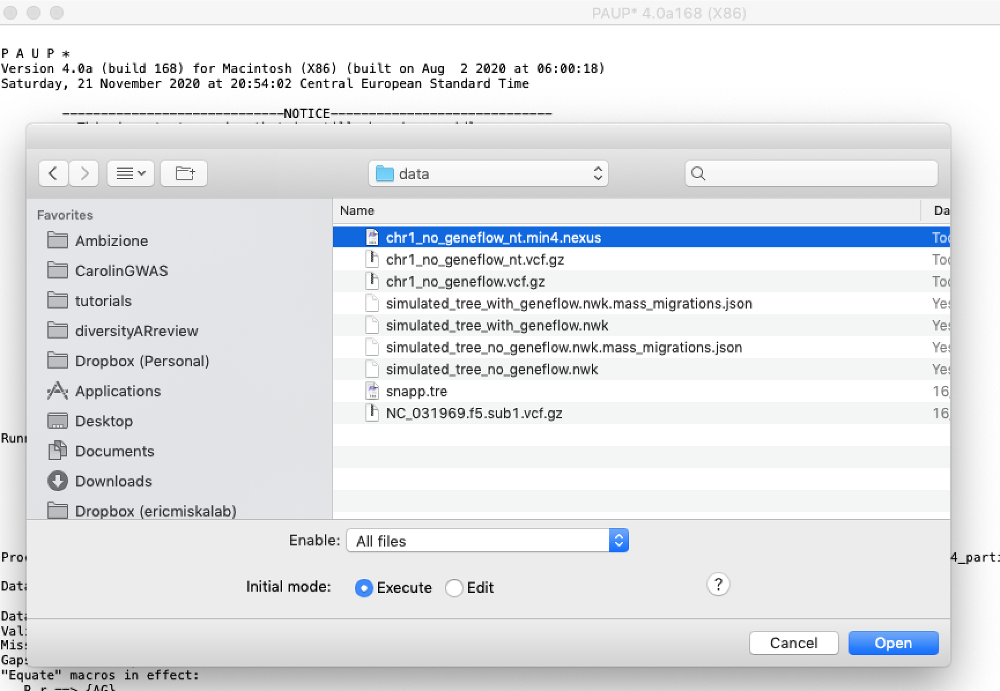</p>

* Then designate the outgroup (Data->Define_outgroup) as you learned in the tutorial on [Species-Tree Inference with SNP Data](../species_tree_inference_with_snp_data/README.md).

* Then use the Neighbor Joining algorithm (Analysis->Neighbor-Joining/UPGMA) with default parameters to build a quick phylogeny. 

As you can see by comparison of the tree you just reconstructed (also below) against [the input tree](img/simulated_tree_no_geneflow.pdf), a simple Neigbor Joining algorithm easily reconstructs the tree topology perfectly, and even the branch lengths are almost perfect. 

<details>
<summary>Click here to see the reconstructed NJ tree without gene-flow</summary>

<p align="center">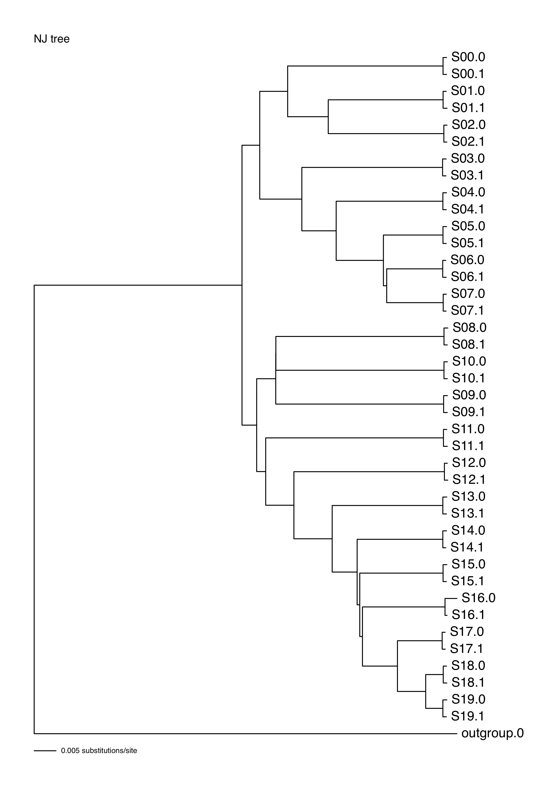</p>

</details>

Now we repeat the same tree-reconstruction procedure for the simulation with gene-flow, starting with file format conversion: 

```bash
# unzip the VCF and process it with AWK to replace each ancestral allele (fourth column) with an A and each derived allele (fifth column) with a T
gunzip -c with_geneflow.vcf.gz | awk 'BEGIN{OFS=FS="\t"}{ if(NR > 27) { $4="A"; $5="T"; print $0} else {print}};' | gzip -c > with_geneflow_nt.vcf.gz
# convert the VCF to the Nexus format:
python2 vcf2phylip.py -i with_geneflow_nt.vcf.gz -p --nexus
```

Then load the file `with_geneflow_nt.min4.nexus` into PAUP\*, again making sure the option "Execute" is set, then designate the outgroup, and finally run the Neighbor Joining tree reconstruction. You should get a tree like the one below:

<p align="center">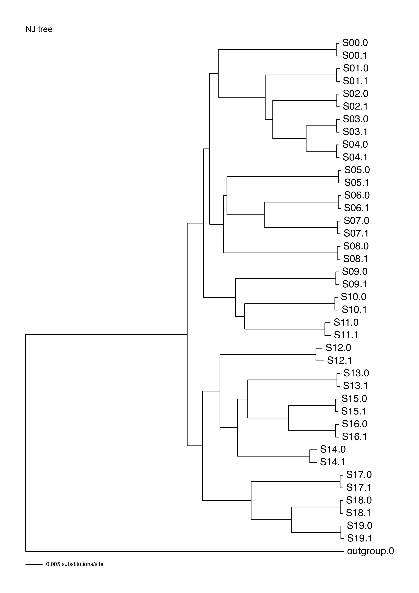</p>

An examination of this reconstructed tree reveals that in this case we did not recover the topology of the [true tree](img/simulated_tree_with_geneflow.pdf) used as input to the simulation. Unlike in the true tree, in the reconstructed tree species  `S14` is "pulled outside" the group formed by  `S13,S15,S16`. This is most likely because of the gene-flow that `S14` received from `S00`. This is a typical pattern: when one species from within a group receives introgression from another group, it tends to be "pulled out" like this in phylogenetic reconstruction. One argument that could be made here is that the Neighbor Joining algorithm is outdated, and that perhaps newer, more sophisticated, methods would recover the correct tree. You can now try to apply SVDQuartets in PAUP\*, and also try any of the other phylogenomic methods you know to see if any of these will succeed.

<details>
<summary>Click here to see the reconstructed SVDQuartets tree with gene-flow</summary>

As you can see, the topology is in fact different from the Neighbor Joining, but also is not correct (`S13,S14` should not be sister taxa, also `S10` and `S11` are swapped) . 

<p align="center">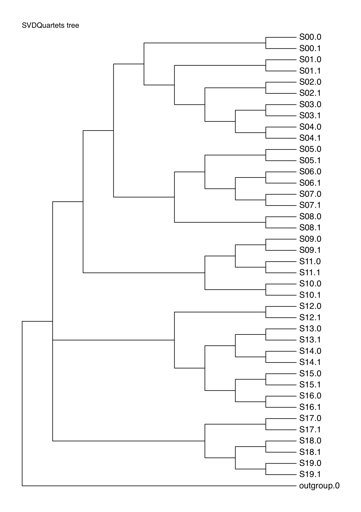</p>

</details>

<a name="TestingInSimulations"></a>
### 1.3 Testing for gene-flow in simulated data 

Under incomplete lineage sorting alone, two sister species are expected to share about the same proportion of derived alleles with a third closely related species. Thus, if species "P1" and "P2" are sisters and "P3" is a closely related species, then the number of derived alleles shared by P1 and P3 but not P2 and the number of derived alleles that is shared by P2 and P3 but not P1 should be approximately similar. In contrast, if hybridization leads to introgression between species P3 and one out the two species P1 and P2, then P3 should share more derived alleles with that species than it does with the other one, leading to asymmetry in the sharing of derived alleles. These expectations are the basis for the so-called "ABBA-BABA test" (first described in the Supporting Material of [Green et al. 2010](http://science.sciencemag.org/content/328/5979/710.full)) that quantifies support for introgression by the *D*-statistic. Below is an illustration of the basic principle. 

<p align="center">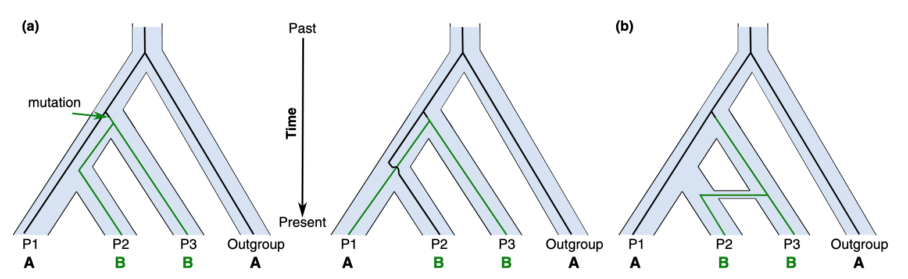</p>

In short, if there is gene-flow between P2 &lt;-&gt; P3, there is going to be an excess of the of the ABBA pattern, leading to positive D statistics. In contrast, gene-flow between P1 &lt;-&gt; P3 would lead to a an excess of the BABA pattern and a negative D statistic. However, whether a species is assigned in the P1 or P2 position is arbitrary, so we can always assign them so that P2 and P3 share more derived alleles and the D statistic is then bounded between 0 and 1. There is also a related and somewhat more complicated measure,  the f4-ratio, which strives to estimate the admixture proportion in percentage. We will not go into the maths here - if you are interested, have a look at the [Dsuite paper](https://doi.org/10.1111/1755-0998.13265). 


The Dsuite software has several advantages: it brings several related statistics together into one software package, has a straightforward workflow to calculate the D statistics and the f4-ratio for all combinations of trios in the dataset, and the standard VCF format, thus generally avoiding the need for format conversions or data duplication. It is computationally more efficient than other software in the core tasks, making it more practical for analysing large genome-wide data sets with tens or even hundreds of populations or species. Finally, Dsuite implements the calculation of the <i>f</i><sub>dM</sub> and <i>f</i>-branch statistics for the first time in publicly available software.

To calculate the D statistics and the f4-ratio for all combinations of trios of species, all we need is the file that specifies what individuals belong to which population/species - we prepared it for you: [species_sets.txt](data/species_sets.txt). Such a file could be simply prepared manually, but, in this case we can save ourselves the work and automate the process using a combination of `bcftools` and `awk`:   

```bash
bcftools query -l chr1_no_geneflow.vcf.gz | awk '{ if (NR <= 40) {sp=substr($1,1,3); print $1"\t"sp} else {print $1"\tOutgroup";}}' > species_sets.txt
```
Something similar to the above can be useful in many cases, depending on how the individuals are named in your VCF file. 

* Then, to familiarize yourself with Dsuite, simply start the program with the command `Dsuite`. When you hit enter, you should see a help text that informs you about three different commands named "Dtrios", "DtriosCombine", and "Dinvestigate", with short descriptions of what these commands do. Of the three commands, we are going to focus on Dtrios, which is the one that calculates the *D*-statistic for all possible species trios.

* To learn more about the command, type `Dsuite Dtrios` and hit enter. The help text should then inform you about how to run this command. There are numerous options, but the defaults are approprite for a vast majority of use-cases.  All we are going to do is to provide a run name using the `-n` option, the correct tree using the `-t` option, and use the `-c` option to indicate that this is the entire dataset and, therefore, we don't need intermediate files for "DtriosCombine". 

<a name="TestingWithoutGeneflow"></a>
#### 1.3.1 Do we find geneflow in data simulated without geneflow?

We run Dsuite for the dataset without gene-flow as follows:

```bash
Dsuite Dtrios -c -n no_geneflow -t simulated_tree_no_geneflow.nwk chr1_no_geneflow.vcf.gz species_sets.txt 
```
The run takes about 50 minutes. Therefore, we already put the output files for you in the [data](data/) folder.  Let's have a look at the first few lines of  [`species_sets_no_geneflow_BBAA.txt`](data/species_sets_no_geneflow_BBAA.txt):

```bash
head species_sets_no_geneflow_BBAA.txt
P1    P2    P3    Dstatistic    Z-score    p-value    f4-ratio    BBAA    ABBA    BABA
S01    S02    S00    0.00645161    0.228337    0.409692    7.6296e-05    40635    936    924
S01    S00    S03    0.0299321    1.08142    0.139754    0.000543936    28841    1724.75    1624.5
S01    S00    S04    0.0072971    0.308069    0.379015    0.00013279    28889.2    1691    1666.5
S01    S00    S05    0.00312175    0.133303    0.446977    5.6877e-05    28861.2    1687    1676.5
S01    S00    S06    0.00312175    0.135082    0.446273    5.69626e-05    28876.5    1687    1676.5
S01    S00    S07    0.00490269    0.210116    0.416789    8.92693e-05    28871.5    1691    1674.5
S00    S01    S08    0.0613992    1.7814    0.0374237    0.000460113    45178.5    806    712.75
S00    S01    S09    0.0704225    2.17799    0.0147034    0.000530632    45323    817    709.5
S00    S01    S10    0.07982    2.25263    0.0121413    0.000589494    45131.8    810    690.25
```

Each row shows the results for the analysis of one trio. For example in the first row, species *S01* was used as P1, *S02* was considered as P2, and *S00* was placed in the position of P3. Then we see the D statistic, associated Zscore and p-value, the f4-ratio estimating admixture proportion and then the counts of BBAA sites (where  `S01` and  `S02` share the derived allele) and then the counts of ABBA and BABA sites. As you can see, ABBA is always more than BABA and the D statistic is always positive because Dsuite orients P1 and P2 in this way. Since these results are for coalescent simulations without gene-flow, the ABBA and BABA sites arise purely through incomplete lineage sorting and the difference between them is purely random - therefore, even though the D statistic can be quite high (e.g. up to 8% on the last line), this is not a result of gene flow. 

**Question 1:** Can you tell why the BBAA, ABBA, and BABA numbers are not integer numbers but have decimal positions? 
<details>
<summary>Click here to see the answer</summary>

Integer counts of ABBA and BABA sites would only be expected if each species would be represented only by a single haploid sequence. With diploid sequences and multiple samples per species, allele frequences are taken into account to weigh the counts of ABBA and BABA sites as described by equations 1a to 1c of the [Dsuite paper](https://doi.org/10.1111/1755-0998.13265).
</details>

**Question 2:** How many different trios are listed in the file? Are these all possible (unordered) trios? 
<details>
<summary>Click here to see the answer</summary>


Because each trio is listed on a single row, the number of trios in file [`species_sets_no_geneflow_BBAA.txt`](data/species_sets_no_geneflow_BBAA.txt) is identical to the number of lines in this file. This number can easily be counted using, e.g. the following command:

    cat species_sets_no_geneflow_BBAA.txt | wc -l
    
You should see that the file includes 1140 lines and therefore results for 1140 trios. Given that the dataset includes (except the outgroup species) 20 species and 3 of these are required to form a trio, the number of possible trios is 

[20 choose 3](https://en.wikipedia.org/wiki/Binomial_coefficient) = 20! / (3! &times; 17!) = 1140.

(where ! denotes the [factorial function](https://en.wikipedia.org/wiki/Factorial))

</details>

In [`species_sets_no_geneflow_BBAA.txt`](data/species_sets_no_geneflow_BBAA.txt), trios are arranged so that P1 and P2 always share the most derived alleles (BBAA is always the highest number). There are two other output files: one with the `_tree.txt` suffix: [`species_sets_no_geneflow_tree.txt`](data/species_sets_no_geneflow_tree.txt) where trios are arranged according to the tree we gave Dsuite, and a file with the `_Dmin.txt` suffix [`species_sets_no_geneflow_Dmin.txt`](data/species_sets_no_geneflow_Dmin.txt) where trios are arranged so that the D statistic is minimised - providing a kind of "lower bound" on gene-flow statistics. This can be useful in cases where the true relationships between species are not clear, as illustrated for example in [this paper](https://doi.org/10.1038/s41559-018-0717-x) (Fig. 2a). 

Let's first see how the other outputs differ from the  `_tree.txt` file, which has the correct trio arrangments. :

```bash
diff species_sets_no_geneflow_BBAA.txt species_sets_no_geneflow_tree.txt
922c922
< S08    S10    S09    0.0170473    1.22568    0.110159    0.00133751    6829.88    6764    6537.25
---
> S09    S10    S08    0.0218914    1.73239    0.0416019    0.00172128    6764    6829.88    6537.25
```
There is one difference in the `_BBAA.txt` ile. Because of incomplete lineage sorting being a stochastic (random) process, we see that  `S08` and  `S10` share more derived alleles than `S09` and  `S10`, which are sister species in the input tree. If you look again at the input tree, you will see that  the branching order between `S08`,  `S09` and  `S10` is very rapid, it is almost a polytomy.

A comparison of the `_tree.txt` file against the `_Dmin.txt`, which minimises the Dstatistic, reveals nine differences. However, the correct trio arrangements in all these cases are very clear.

```bash
diff species_sets_no_geneflow_Dmin.txt species_sets_no_geneflow_no_geneflow_tree.txt
```

Next, let's look at the results in more detail, for example in [R](https://www.r-project.org). We load the `_BBAA.txt` file and first look at the distribution of D values:  

```R
D_BBAA_noGF <- read.table("species_sets_no_geneflow_BBAA.txt",as.is=T,header=T)
plot(D_BBAA_noGF$Dstatistic, ylab="D",xlab="trio number")
```

<p align="center">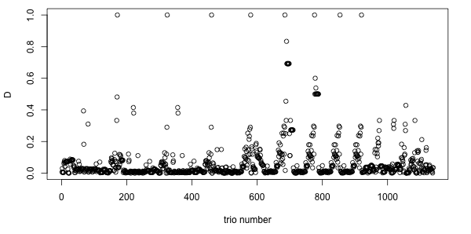</p>

There are some very high D statistics. In fact, the D statistics for 9 trios are &gt;0.7, which is extremely high. So how is this possible in a dataset simulated with no geneflow?

```R
D_BBAA_noGF[which(D_BBAA_noGF$Dstatistic > 0.7),]
     P1  P2  P3 Dstatistic Z.score    p.value    f4.ratio   BBAA ABBA BABA
171 S18 S19 S00   1.000000 0.00000        NaN 7.42372e-06 179922  1.5    0
324 S18 S19 S01   1.000000 0.00000        NaN 7.42743e-06 179814  1.5    0
460 S18 S19 S02   1.000000 0.00000        NaN 7.39892e-06 179800  1.5    0
580 S18 S19 S03   1.000000 0.00000        NaN 7.43931e-06 179778  1.5    0
685 S18 S19 S04   1.000000 0.00000        NaN 7.44097e-06 179765  1.5    0
690 S06 S05 S11   0.833333 2.91667 0.00176897 4.94462e-05 138120 11.0    1
776 S18 S19 S05   1.000000 0.00000        NaN 7.43290e-06 179768  1.5    0
854 S18 S19 S06   1.000000 0.00000        NaN 7.44536e-06 179777  1.5    0
920 S18 S19 S07   1.000000 0.00000        NaN 7.42259e-06 179771  1.5    0
```
These nine cases arise because there is amost no incomplete lineage sorting among these trios almost all sites are `BBAA` - e.g. 179922 sites for the first trio, while the count for `ABBA` is only 1.5 and for `BABA` it is 0 . The D statistic is calculated as D = (ABBA-BABA)/(ABBA+BABA), which for the first trio would be D = (1.5-0)/(1.5+0)=1. So, the lesson here is that the D statistic is very sensitive to random fluctuations when there is a small number of ABBA and BABA sites. One certainly cannot take the D value seriously unless it is supported by a statistical test suggesting that the D is significanly different from 0. In the most extreme cases above, the p-value could not even be calculated, becuase there were so few sites. Those definitely do not represent geneflow. But in one case we see a p value of 0.0018. Well, that looks significant, if one considers for example the traditional 0.05 cutoff. So, again, how is this possible in a dataset simulated with no geneflow?

```R
plot(D_BBAA_noGF$p.value, ylab="p value",xlab="trio number",ylim=c(0,0.05))
```
<p align="center">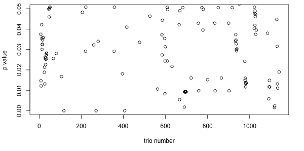</p>

In fact, there are many p values that are &lt;0.05. For those who have a good understanding of statistics this will be not be suprising. This is because [p values are uniformly distributed](https://neuroneurotic.net/2018/10/29/p-values-are-uniformly-distributed-when-the-null-hypothesis-is-true/) when the null hypopthesis is true. Therefore, we expect 5% of the (or 1 in 20) p-values, they will be &lt;0.05. If we did a 1140 tests, we can expect 57 of them to be &lt;0.05. Therefore, any time we conduct a large amount of statistical tests, we should apply a multiple testing correction - commonly used is the Benjamini-Hochberg (BH) correction which controls for the [false discovery rate](https://en.wikipedia.org/wiki/False_discovery_rate).

```R
plot(p.adjust(D_BBAA_noGF$p.value,method="BH"), ylab="p value",xlab="trio number",ylim=c(0,0.05))
```
<p align="center">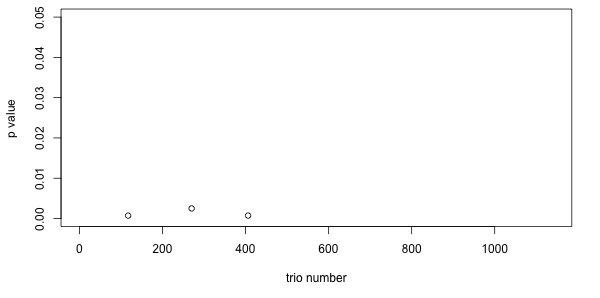</p>

However, even after applying the BH correction there are three p-values which look significant. These are all false discoveries. Here comes an important scientific lesson - that even if we apply statistical tests correctly, seeing a p-value below 0.05 is not a proof that the null hypothesis is false. All hypothesis testing has [false positives and false negatives](https://en.wikipedia.org/wiki/Type_I_and_type_II_errors). It may be helpful to focus less on statistical testing and aim for a more nuanced understanding of the dataset, as argued for example in this [Nature commentary](https://www.nature.com/articles/d41586-019-00857-9). 

Therefore, we should also plot the f4-ratio, which estimates the proportion of genome affected by geneflow. It turns out that this is perhaps the most reliable - all the f4-ratio values are tiny, as they should be for a dataset without geneflow.  

```R
plot(D_BBAA_noGF$f4.ratio, ylab="f4-ratio",xlab="trio number", ylim=c(0,1))
```
<p align="center">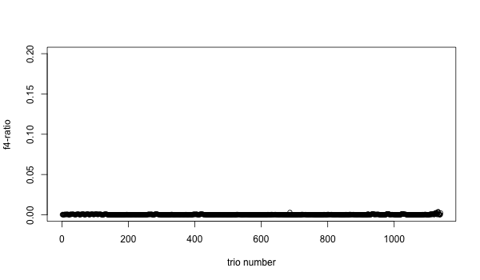</p>

Finally, we use visualisation heatmap in which the species in positions P2 and P3 are sorted on the horizontal and vertical axes, and the color of the corresponding heatmap cell indicates the most significant *D*-statistic found between these two species, across all possible species in P1. To prepare this plot, we need to prepare a file that lists the order in which the P2 and P3 species should be plotted along the heatmap axes. The file should look like  [`plot_order.txt`](data/plot_order.txt). You could prepare this file manually, or below is a programmatic way: 

```bash
cut -f 2 species_sets.txt | uniq | head -n 20 > plot_order.txt
```

Then make the plots using the scripts [`plot_d.rb`](src/plot_d.rb) and [`plot_f4ratio.rb`](src/plot_f4ratio.rb). 

```bash
ruby plot_d.rb species_sets_no_geneflow_BBAA.txt plot_order.txt 0.7 species_sets_no_geneflow_BBAA_D.svg
ruby plot_f4ratio.rb species_sets_no_geneflow_BBAA.txt plot_order.txt 0.2 species_sets_no_geneflow_BBAA_f4ratio.svg
```

<p align="center">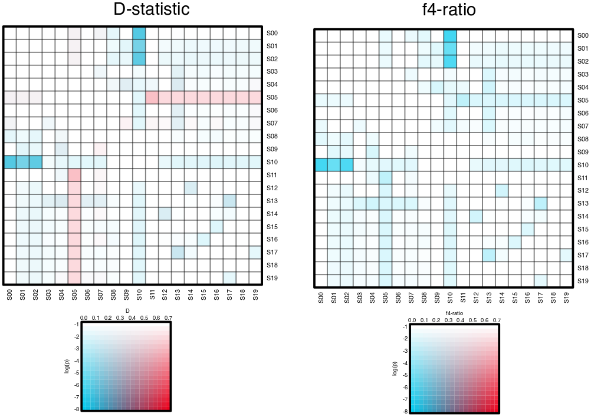</p>


<a name="TestingWithGeneflow"></a>
#### 1.3.2 Do we find geneflow in data simulated with geneflow?

How do the results for the simulation with geneflow differ from the above? Here we are going to run a similar set of analyses and make comparisons. We run Dsuite for the dataset with gene-flow as follows:

```bash
Dsuite Dtrios -c -n with_geneflow -t simulated_tree_with_geneflow.nwk with_geneflow.vcf.gz species_sets.txt 
```

Again, this takes about 50 minutes, so the output files  [`species_sets_with_geneflow_BBAA.txt`](data/species_sets_with_geneflow_BBAA.txt),  [`species_sets_with_geneflow_tree.txt`](data/species_sets_with_geneflow_tree.txt) and [`species_sets_with_geneflow_Dmin.txt`](data/species_sets_with_geneflow_Dmin.txt) are already provided.

Now we find 39 differences between the  `_tree.txt` file and the `_BBAA.txt`, reflecting that, under geneflow, sister species often do not share the most derived alleles. Between  `_tree.txt` file and the `_Dmin.txt` there are 124 differences.

```bash
diff species_sets_with_geneflow_BBAA.txt species_sets_with_geneflow_tree.txt | grep -c '<'
diff species_sets_with_geneflow_Dmin.txt species_sets_with_geneflow_tree.txt | grep -c '<'
```

We can visualise the overlap between these different files using a Venn diagram. For example in R:

```R
library("VennDiagram")
D_BBAA <- read.table("species_sets_with_geneflow_BBAA.txt",as.is=T,header=T)
D_Dmin <- read.table("species_sets_with_geneflow_Dmin.txt",as.is=T,header=T)
D_tree <- read.table("species_sets_with_geneflow_tree.txt",as.is=T,header=T)

D_BBAA$P123 <- paste(D_BBAA$P1,D_BBAA$P2,D_BBAA$P3,sep="_"); D_Dmin$P123 <- paste(D_Dmin$P1, D_Dmin$P2, D_Dmin$P3,sep="_"); D_tree$P123 <- paste(D_tree$P1, D_tree$P2, D_tree$P3,sep="_")

draw.triple.venn(length(D_BBAA$P123),length(D_Dmin$P123),length(D_tree$P123),length(which(D_BBAA$P123 == D_Dmin$P123)),length(which(D_tree$P123 == D_Dmin$P123)),length(which(D_tree$P123 == D_BBAA$P123)),length(which(D_tree$P123 == D_BBAA$P123 & D_Dmin$P123 == D_BBAA$P123 & D_Dmin$P123 == D_tree$P123)),category = c("BBAA", "Dmin", "tree"), lty = "blank", fill = c("skyblue", "pink1", "darkolivegreen1"))
```

<p align="center">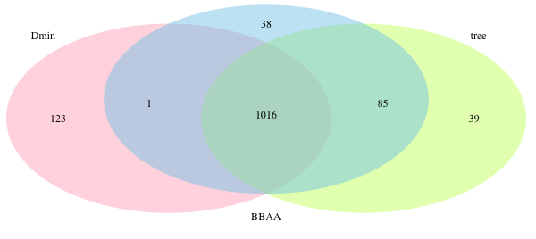</p>

Then we explore the results in the `_BBAA.txt` in R, analogously to how we did it above for the no-geneflow case:

```R
plot(D_BBAA$Dstatistic, ylab="D",xlab="trio number") # The D statistic
plot(p.adjust(D_BBAA$p.value,method="BH"), ylab="corected p value",xlab="trio number",ylim=c(0,0.05))
plot(D_BBAA$f4.ratio, ylab="f4-ratio",xlab="trio number", ylim=c(0,0.2))
```

<details>
<summary>Click here to see the resulting R plots</summary>

<p align="center">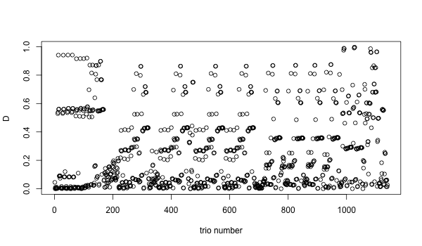</p>
<p align="center">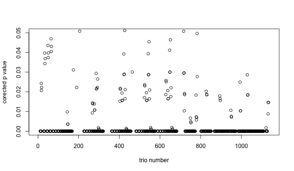</p>
<p align="center">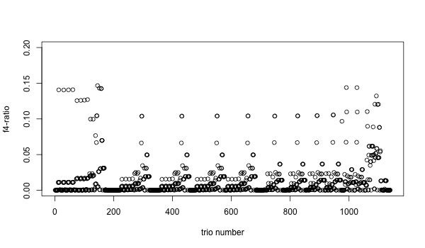</p>

</details>

<p>
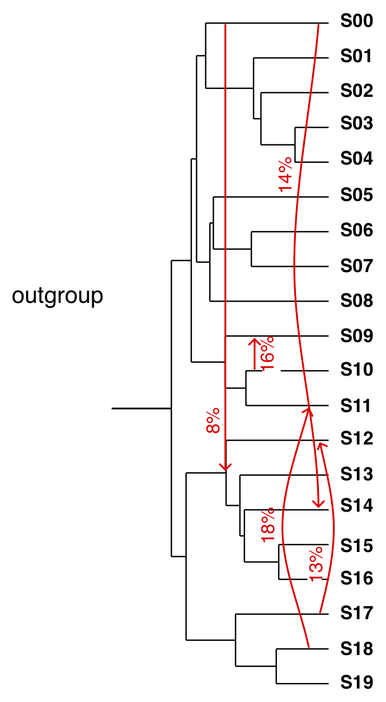 

As you can see if you click above, the distributions of the statistics are markedly different when compared against the no-geneflow scenario. The number of D statistics &gt;0.7 here is 85 (compared with 9 under no-geneflow) and very many trios now have significant p values - even after FDR correction, we have p&lt;0.05 for whopping 671 trios. Finally, the f4-ratios are also elevated, up to almost 15% in some cases.  

To remind ourselves, the simulated tree and geneflow events are shown on the left. The 15% f4-ratios estimates correspond reasonably well with the strength of the geneflow events that we simulated (in the region of 8% to 18%). However, we simulated only five geneflow events and have 671 significant p values and 138 f4-ratio values above 3%. This is because the test statistics are correlated when trios share an (internal) branch in the overall population or species tree. Therefore, a system of all possible four taxon tests across a data set can be difficult to interpret. In any case (and with any methods) pinpointing specific introgression events in data sets with tens or hundreds of populations or species remains challenging - especially when genetic data is all the evidence we have.  

The scripts [`plot_d.rb`](src/plot_d.rb) and [`plot_f4ratio.rb`](src/plot_f4ratio.rb) were originally developed to help with such interpretation, and can still be useful. Because they take the maximum D or f4-ratio value between species in the P2 and P3 positions, across all possible species in P1, the plot deals with some of the correlated signals and redundancy in the data by focusing on the overall support for geneflow between pairs of species or their ancestors, which could have happened at any time in the past since the species in P2 and P3 positions diverged from each other.
</p>

```bash
ruby plot_d.rb species_sets_with_geneflow_BBAA.txt plot_order.txt 0.7 species_sets_with_geneflow_BBAA_D.svg
ruby plot_f4ratio.rb species_sets_with_geneflow_BBAA.txt plot_order.txt 0.2 species_sets_with_geneflow_BBAA_f4ratio.svg
```

<p align="center">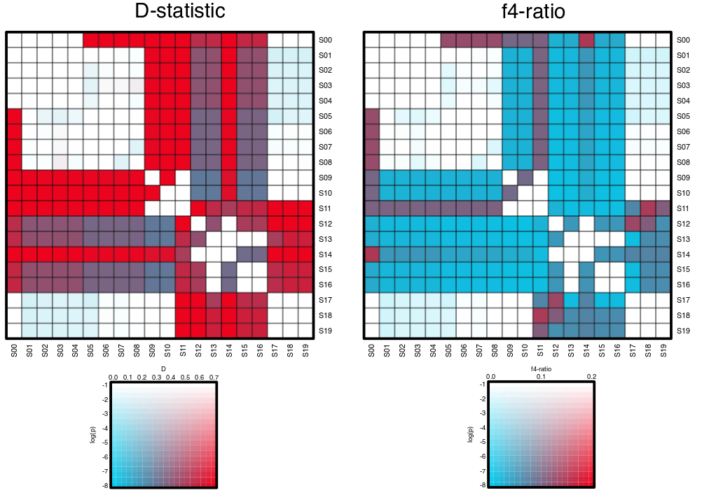</p>

**Question 3:** How informative are the plots above? Can you identify the gene flow events from the plots? 

As an upgrade on the above plots we developed with Hannes Svardal, the f-branch or fb(C) metric (introduced in [Malinsky et al. (2018)](https://doi.org/10.1038/s41559-018-0717-x). This is designed to disentangle correlated f4-ratio results and, unlike the matrix presentation above, f-branch can assign gene flow to specific, possibly internal, branches on a phylogeny. The f-branch metric builds upon and formalises verbal arguments employed by [Martin et al. (2013)](http://www.genome.org/cgi/doi/10.1101/gr.159426.113), who used these lines of reasoning to assign gene flow to specific internal branches on the phylogeny of Heliconius butterflies. 

The logic of f-branch is illustated in the following figure. The panel (c) provides an example illustrating interdependences between different f4-ratio scores, which can be informative about the timing of introgression. In this example, different choices for the P1 population provide constraints on when the gene flow could have happened. (d) Based on relationships between the f4-ratio results from different four taxon tests, the f-branch, or f<sub>b</sub> statistic, distinguishes between admixture at different time periods, assigning signals to different (possibly internal) branches in the population/species tree

<p align="center">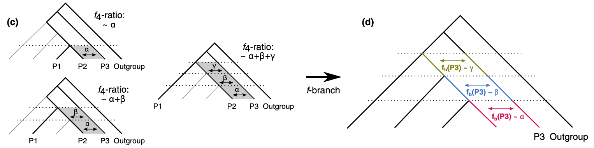</p>

This is implemented in the `Dsuite Fbranch` subcommand, and the plotting utility, called `dtools.py` is in the utils subfolder of the Dsuite package.

```bash
Dsuite Fbranch simulated_tree_with_geneflow.nwk species_sets_with_geneflow_tree.txt > species_sets_with_geneflow_Fbranch.txt
python3 /Users/milanmalinsky/Sanger_work/Dsuite/Dsuite/utils/dtools.py species_sets_with_geneflow_Fbranch.txt simulated_tree_with_geneflow.nwk
```

The second command creates a file called `fbranch.png`, which is shown below.

<p align="center">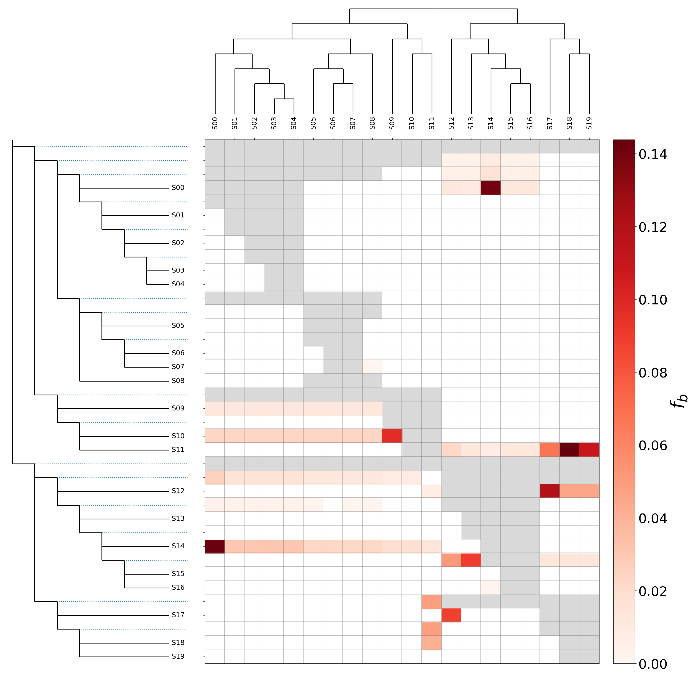</p>

**Question 4:** Can you identify the gene flow events clearer here than from the matrix plots above? Is this a good showcase for the f-branch method?  

**Question 5:** If you exclude species with the strongest f4-ratio of f-branch signals, can you then get a correct phylogeny from PAUP\*?

**Question 6:** What happens when you re-run Dsuite with the inferred (wrong) tree from PAUP\*?


<a name="SpecificLoci"></a>
## 2. Finding specific introgressed loci - adaptive introgression in Malawi cichlids

This exercise is based on analysis from the [Malinsky et al. (2018)](https://doi.org/10.1038/s41559-018-0717-x) manuscript published in Nature Ecol. Evo.. The paper shows that two deep water adapted lineages of cichlids share signatures of selection and very similar haplotypes in two green-sensitive opsin genes (RH2Aβ and RH2B). The genes are located next to each other on scaffold_18. To find out whether these shared signatures are the result of convergent evolution or of adaptive introgression, we used the f_dM statistic. The f_dM is related to Patterson’s D and to the f4-ratio, but is better suited to analyses of sliding genomic windows. The calculation of this statistic is implemented in the program `Dsuite Dinvestigate`.

The data for this exercise are in the [data](data/) folder. It includes the VCF file with variants mapping to the scaffold_18 of the Malawi cichlid reference genome we used at the time - [`scaffold_18.vcf.gz`](data/scaffold_18.vcf.gz). There are also two other files required to run Dinvestigate: the “SETS” file and the “test_trios” file. In this case they are called: [`MalawiSetsFile.txt`](data/MalawiSetsFile.txt) and [`MalawiTestTriosForInvestigate.txt`](data/MalawiTestTriosForInvestigate.txt). The “TestTrios” file specifies that we want to investigate the admixture signal between the Diplotaxodon genus and the deep benthic group, compared with the mbuna group. The “SETS” file specifies which individuals belong to these groups. Finally, the command to execute the analysis is:

```bash
Dsuite Dinvestigate -w 50,25 scaffold_18.vcf.gz MalawiSetsFile.txt MalawiTestTriosForInvestigate.txt
```

The `-w 50,25` option specifies that the statistics should be averaged over windows of 50 informative SNPs, moving forward by 25 SNPs at each step. The run should take a little under 10 minutes. We suggest you have a tea/coffee break while you wait for the results ;).

**Question 7:**  What are the overall D and f4-ratio (fG) values over the entire scaffold_18? What does this suggest?

The results are output by Dsuite into the file `mbuna_deep_Diplotaxodon_localFstats__50_25.txt`. A little R plotting function [`plotInvestigateResults.R`](src/plotInvestigateResults.R) is prepared for you. Use the script to load in the file you just produced (line 3) and plot the D statistic (line 6).

**Question 8:** Do you see any interesting signal in the D statistic? The opsin genes are located between 4.3Mb and 4.4Mb. Do you see anything interesting there?

Now execute line 8 of the script to plot the f_dM values. Do you see any signal near the opsin coordinates? We also plot the f_d statistic. As you can see, the top end of the plot is the same as for the f_dM, but the f_d is asymmetrical, extending far further into negative values. Finally, we zoom in at the region of the opsin genes (line 12). As you can see, the results look like a single “mountain” extending over 100kb. But there is more structure than that. Perhaps we need to reduce the window or step size to see that.

To save time, we prepared result files for runs with varying window and step sizes: [`mbuna_deep_Diplotaxodon_localFstats__50_5.txt`](data/mbuna_deep_Diplotaxodon_localFstats__50_5.txt),  [`mbuna_deep_Diplotaxodon_localFstats__50_1.txt`](data/mbuna_deep_Diplotaxodon_localFstats__50_1.txt),  [`mbuna_deep_Diplotaxodon_localFstats__10_1.txt`](data/mbuna_deep_Diplotaxodon_localFstats__10_1.txt), and  [`mbuna_deep_Diplotaxodon_localFstats__2_1.txt`](data/mbuna_deep_Diplotaxodon_localFstats__2_1.txt).

 They can be plotted with the same R script. Have a look at the results.

**Question 9:** What combination of window size/step seems to have the best resolution? Why is the smallest window so noisy?

**Question 10:** What happens if you plot individual data points, instead of a continuous line? Are the results clearer?


<a name="Tanganyika"></a>
## 3. Finding geneflow in a real dataset - Tanganyikan cichlids

In this execise, we are going to see if we can reproduce the findings reported by [Gante et al. (2016)](https://doi.org/10.1111/mec.13767), with a different dataset. The Gante et al. dataset contained whole genome sequence data from five species from the cichlid genus Neolamprologus. The authors analysed these data and reported conclusions that are summarised by the figure below:

<p align="center">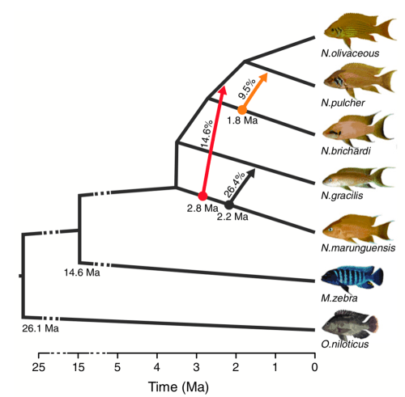</p>

A dataset containing these species, but also six additional Neolamprologus species (for a total of 11) was used in the tutorials on [Species-Tree Inference with SNP Data](../species_tree_inference_with_snp_data/README.md) and [Divergence-Time Estimation with SNP Data](../divergence_time_estimation_with_snp_data/README.md).

**Question 11:** Are the trees you reconstructed in these exercises consistent with the relationships reported by Gante et al.?

Here we use data with 10 Neolamprologus species (the clearly hybrid Neolamprologus cancellatus removed), to reassess the evidence for geneflow within this genus with the f4-ratio and f-branch statistics. The genetic data are in [`NC_031969.vcf.gz`](data/TanganyikaCichlids/NC_031969.vcf.gz), the file specifying sample->species relationships is [`NC_031969_sets.txt`](data/TanganyikaCichlids/NC_031969_sets.txt) and the tree topology hypothesis is in [`SNAPP_tree.txt`](data/TanganyikaCichlids/SNAPP_tree.txt). We run the analysis for all possible trios as follows:

```bash
Dsuite Dtrios -c -t SNAPP_tree.txt NC_031969.vcf.gz NC_031969_sets.txt
```

This should finish in a couple of minutes. There are 'only' ten species, so 120 trios. Could this be manageable? Have a look at the output file [TanganyikaCichlids/NC_031969_sets__tree.txt](data/TanganyikaCichlids/NC_031969_sets__tree.txt) and see if you can interpret the results. Chances are that is is still too complex to interpret the results for the trios just by looking at them. Perhaps you can try the ‘f-branch’ method:

```bash
Dsuite Fbranch SNAPP_tree.txt NC_031969_sets__tree.txt > Tanganyika_Fbranch.txt
python3 dtools.py Tanganyika_Fbranch.txt SNAPP_tree.txt
```

<p align="center">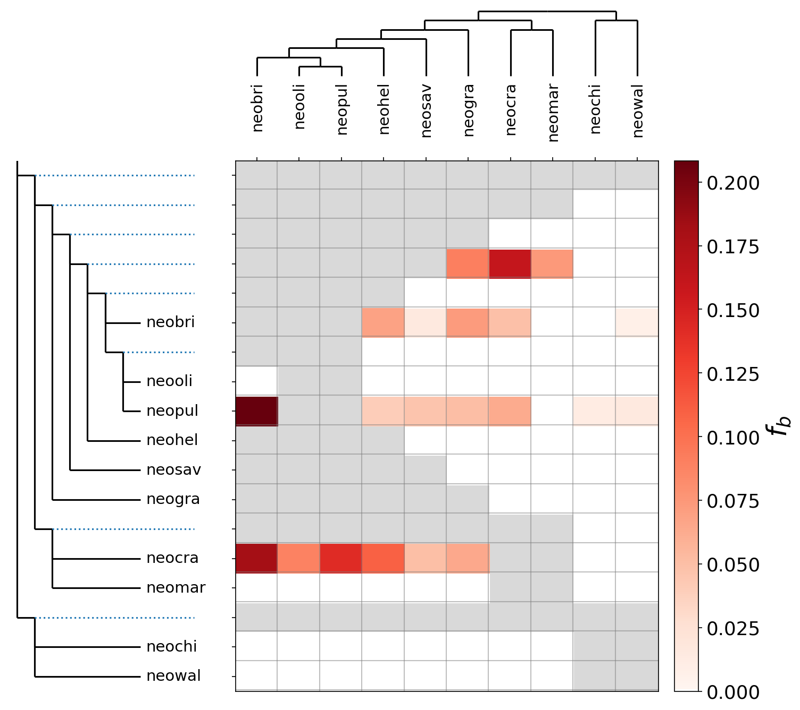</p>

**Question 12:** Are the geneflow signals seen here consistent with the Gante et al. figure?

**Question 13:** What happens when we focus only on the five species from Gante et al. and exclude all others?

<details>
<summary>Click here for an answer</summary>

The files [`NC_031969_setsOnlyGante.txt`](data/TanganyikaCichlids/NC_031969_setsOnlyGante.txt) and [`GanteTree.txt`](data/TanganyikaCichlids/GanteTree.txt) will come in handy.

```bash
Dsuite Dtrios -c -t SNAPP_tree.txt NC_031969.vcf.gz NC_031969_setsOnlyGante.txt
Dsuite Fbranch GanteTree.txt NC_031969_setsOnlyGante__tree.txt > Tanganyika_Fbranch_reduced.txt
python3 dtools.py -n reduced Tanganyika_Fbranch_reduced.txt GanteTree.txt 
```
Notice the `-n` option to `dtools.py`, to specify the output file name, making sure that our previous plots are not overwritten. Below is the plot, after a little editing in Inkscape.

<p align="center">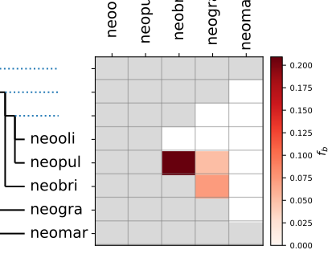</p>

</details>

<a name="painting"></a>
## 4. Ancestry painting

A very simple alternative way of investigating patterns of ancestry in potentially introgressed or hybrid species is to "paint" their chromosomes according to the genotypes carried at sites that are fixed between the presumed parental species. This type of plot, termed "ancestry painting" was used for example by [Fu et al. (2015; Fig. 2)](https://www.nature.com/articles/nature14558) to find blocks of Neanderthal ancestry in an ancient human genome, by [Der Sarkassian et al. (2015; Fig. 4)](https://www.cell.com/current-biology/abstract/S0960-9822(15)01003-9) to investigate the ancestry of Przewalski's horses, by [Runemark et al. (2018; Suppl. Fig. 4)](https://www.nature.com/articles/s41559-017-0437-7) to assess hybridization in sparrows, and by [Barth et al. (2019; Fig. 2)](https://www.biorxiv.org/content/10.1101/635631v1) to identify hybrids in tropical eels.

* If you haven't seen any of the above-named studies, you might want to have a look at the ancestry-painting plots in some of them. You may note that the ancestry painting in [Fu et al. (2015; Fig. 2)](https://www.nature.com/articles/nature14558) is slightly different from the other two studies because no discrimination is made between heterozygous and homozygous Neanderthal alleles. Each sample in Fig. 2 of [Fu et al. (2015)](https://www.nature.com/articles/nature14558) is represented by a single row of cells that are white or colored depending on whether or not the Neanderthal allele is present at a site. In contrast, each sample in the ancestry paintings of [Der Sarkassian et al. (2015; Fig. 4)](https://www.cell.com/current-biology/abstract/S0960-9822(15)01003-9), [Runemark et al. (2018; Suppl. Fig. 4)](https://www.nature.com/articles/s41559-017-0437-7), and [Barth et al. (2019; Fig. 2)](https://www.biorxiv.org/content/10.1101/635631v1) is drawn with two rows of cells. However, as the analyses in both studies were done with unphased data, these two rows do not represent the two haplotypes per sample. Instead, the two cells per site were simply both colored in the same way for homozygous sites or differently for heterozygous sites without regard to haplotype structure.

	Here, we are going to use ancestry painting to investigate ancestry in *Neolamprologus cancellatus* ("neocan"), assuming that it is a hybrid between the parental species *Altolamprologus fasciatus* ("altfas") and *Telmatochromis vittatus* ("telvit"). As in [Der Sarkassian et al. (2015; Fig. 4)](https://www.cell.com/current-biology/abstract/S0960-9822(15)01003-9), [Runemark et al. (2018; Suppl. Fig. 4)](https://www.nature.com/articles/s41559-017-0437-7), and [Barth et al. (2019; Fig. 2)](https://www.biorxiv.org/content/10.1101/635631v1), we are going to draw two rows per sample to indicate whether genotypes are homozygous or heterozygous.

* To generate an ancestry painting, we will need to run two Ruby scripts. The first of these, [`get_fixed_site_gts.rb`](src/get_fixed_site_gts.rb) determines the alleles of the putative hybrid species at sites that are fixed differently in the two putative parental species. The second script, [`plot_fixed_site_gts.rb`](src/plot_fixed_site_gts.rb) then uses the output of the first script to draw an ancestry painting. As the first script requires an uncompressed VCF file as input, first uncompress the VCF file for the SNP dataset with the following command:

		gunzip -c NC_031969.f5.sub1.vcf.gz > NC_031969.f5.sub1.vcf

* Then, run the Ruby script [`get_fixed_site_gts.rb`](src/get_fixed_site_gts.rb) to determine the alleles at sites that are fixed differently in the two parents. This script expects six arguments; these are
	* the name of the uncompressed VCF input file, `NC_031969.f5.sub1.vcf`,
	* the name of an output file, which will be a tab-delimited table,
	* a string of comma-separated IDs of samples for the first putative parent species,
	* a string of comma-separated IDs of samples for the putative hybrid species,
	* another string of comma-separated IDs of samples for the second putative parent species,
	* a threshold value for the required completeness of parental genotype information so that sites with too much missing data are discarded.

	We'll use `NC_031969.f5.sub1.vcf` as the input and name the output file `pops1.fixed.txt`. Assuming that the parental species are *Altolamprologus fasciatus* ("altfas") and *Telmatochromis vittatus* ("telvit") and the hybrid species is *Neolamprologus cancellatus* ("neocan"), we'll specify the sample IDs for these species with the strings "AUE7,AXD5", "JBD5,JBD6", and "LJC9,LJD1". Finally, we'll filter for sites without missing data by specifying "1.0" as the sixth argument. Thus, run the script [`get_fixed_site_gts.rb`](src/get_fixed_site_gts.rb) with the following command:

		ruby get_fixed_site_gts.rb NC_031969.f5.sub1.vcf pops1.fixed.txt AUE7,AXD5 LJC9,LJD1 JBD5,JBD6 1.0

* The second script, [`plot_fixed_site_gts.rb`](src/plot_fixed_site_gts.rb), expects four arguments, which are
	* the name of the file written by script [`get_fixed_site_gts.rb`](src/get_fixed_site_gts.rb),
	* the name of an output file which will be a plot in SVG format,
	* a threshold value for the required completeness, which now applies not only to the parental species but also to the putative hybrid species,
	* the minimum chromosomal distance in bp between SNPs included in the plot. This last argument aims to avoid that the ancestry painting is overly dominated by high-divergence regions.

	We'll use the file [`pops1.fixed.txt`](res/pops1.fixed.txt) as input, name the output file `pops1.fixed.svg`, require again that no missing data remains in the output, and we'll thin the remaining distances so that those plotted have a minimum distance of 1,000 bp to each other. Thus, use the following command to draw the ancestry painting:

		ruby plot_fixed_site_gts.rb pops1.fixed.txt pops1.fixed.svg 1.0 1000
		
	The screen output of this script will include some warnings about unexpected genotypes, these can be safely ignored as the script automatically excludes those sites. At the very end, the output should indicate that 6,069 sites with the required completeness were found, these are the sites included in the ancestry painting. Th output also reports, for all analyzed specimens, the heterozygosity at those 6,069 sites. For first-generation hybrids, this heterozygosity is expected to be close to 1.

* Open the file [`pops1.fixed.svg`](res/pops1.fixed.svg) with a program capable of reading files in SVG format, for example with a browser such as Firefox or with Adobe Illustrator. You should see a plot like the one shown below. <p align="center">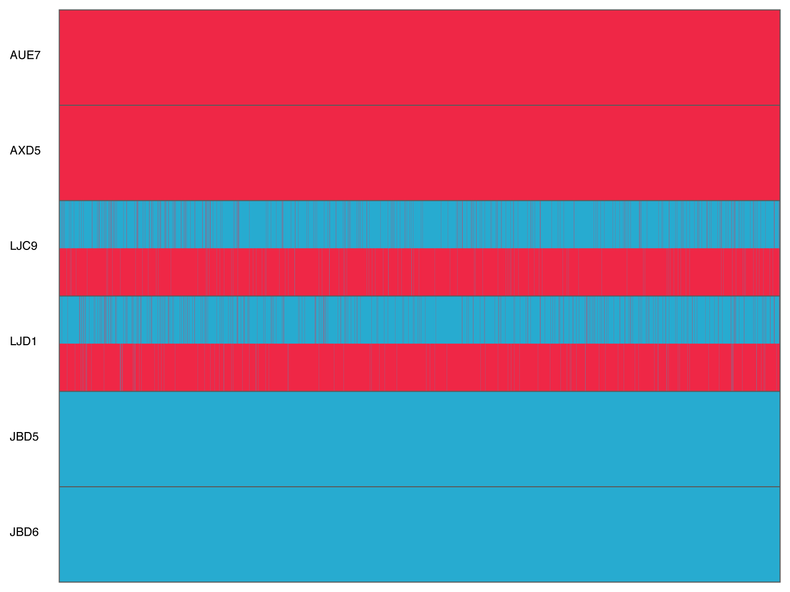</p>

	In this ancestry painting, the two samples of the two parental species are each drawn in solid colors because all included sites were required to be completely fixed and completely without missing data. The samples of *Neolamprologus cancellatus*, "LJC9" and "LJD1" are drawn in between, with two rows per sample that are colored according to genotypes observed at the 6,069 sites. Keep in mind that even though the pattern may appear to show phased haplotypes, this is not the case; instead the bottom row for a sample is arbitrarily colored in red and the top row is colored in blue when the genotype is heterozygous.
	
	**Question 14:** Do you notice any surprising difference to the ancestry plots of [Der Sarkassian et al. (2015; Fig. 4)](https://www.cell.com/current-biology/abstract/S0960-9822(15)01003-9) and [Runemark et al. (2018; Suppl. Fig. 4)](https://www.nature.com/articles/s41559-017-0437-7)? 
    <details>
    <summary>Click here to see the answer</summary>
    
    One remarkable difference compared to the ancestry painting of [Der Sarkassian et al. (2015; Fig. 4)](https://www.cell.com/current-biology/abstract/S0960-9822(15)01003-9) and [Runemark et al. (2018; Suppl. Fig. 4)](https://www.nature.com/articles/s41559-017-0437-7) is that almost no homozygous genotypes are observed in the two samples of *Neolamprologus cancellatus*: the bottom rows are drawn almost entirely in red for the two putative hybrid individuals and the top rows are almost entirely in blue. The same pattern, however, can be found in [Barth et al. (2019; Fig. 2)](https://www.biorxiv.org/content/10.1101/635631v1).
        </details>

	**Question 15:** How can this difference be explained? 
    <details>
    <summary>Click here to see the answer</summary>
    
 The fact that both *Neolamprologus cancellatus* samples are heterozygous for basically all sites that are differentially fixed in the two parental species can only be explained if both of these samples are in fact first-generation hybrids. If introgression would instead be more ancient and backcrossing (or recombination within the hybrid population) had occurred, we would expect that only certain regions of the chromosome are heterozygous while others should be homozygous for the alleles of one or the other of the two parental species. However, unlike in cases where the genomes have been sequenced of parent-offspring trios, we do not know who the actual parent individuals were. We can guess that the parent individuals were members of the species *Altolamprologus fasciatus* and *Telmatochromis vittatus*, but whether the parental individuals were part of the same population as the sampled individuals or a more distantly related population within these species remains uncertain. 
         </details>
 

