# Bayesian Analysis of Species Networks

A tutorial on Bayesian phylogenetic analysis of species networks

## Summary

By taking incomplete lineage sorting into account, the multi-species-coalescent model used in tutorial [Divergence-Time Estimation with SNP Data](../divergence_time_estimation_with_snp_data/README.md) and other tutorials allows a more reliable inference of phylogenetic relationships than the concatenation model that assumes that all parts of the genome share an identical evolutionary history. However, the multi-species-coalescent model ignores hybridization, another important process that influences the variation among individual gene trees and could thus lead to unreliable inference even when the multi-species-coalescent model is applied. Fortunately, there is currently very active development of tools for the inference of species networks. In contrast to bi-furcating species trees, these species networks may include reticulation branches that can be interpreted as hybridization events leading to the merging of two species into one. While many of these new methods are still computationally very demanding, their continued development is likely going to have a strong impact on the field of phylogenomics.

## Table of contents

* [Outline](#outline)
* [Dataset](#dataset)
* [Requirements](#requirements)
* [Bayesian analysis of species networks with BEAST2](#speciesnetworks)

## Outline

In this tutorial I am going to present the use of the Species Network model ([Zhang et al. 2017](https://academic.oup.com/mbe/article/35/2/504/4705834)), which is implemented as an add-on package for [BEAST2](https://www.beast2.org) ([Bouckaert et al. 2014](http://journals.plos.org/ploscompbiol/article?id=10.1371/journal.pcbi.1003537)) and allows the joint Bayesian inference of species relationships and possible hybridization events among them.

## Dataset

The dataset used in this tutorial is the set of 68 alignments generated in tutorial [Local Assembly](../local_assembly/README.md). These 68 alignments contain gene sequences of five species of the cichlid genus *Neolamprologus* of Lake Tanganyika: *Neolamprologus brichardi* ("neobri"), *Neolamprologus gracilis* ("neogra") *Neolamprologus marunguensis* ("neomar"), *Neolamprologus olivaceous* ("neooli"), and *Neolamprologus pulcher* ("neopul"). The generation of these alignments is described in detail in tutorials [Ortholog Detection](../ortholog_detection/README.md) and [Local Assembly](../local_assembly/README.md). In brief, sequences of all species except *Neolamprologus pulcher* ("neopul") were extracted from whole-genome assemblies generated by [Brawand et al. (2014)](https://www.nature.com/articles/nature13726) and [Gante et al. (2016)](https://onlinelibrary.wiley.com/doi/abs/10.1111/mec.13767) in tutorial [Ortholog Detection](../ortholog_detection/README.md). Orthologous sequences of the fifth species, *Neolamprologus pulcher* ("neopul"), were identified and assembled from genomic read data in tutorial [Local Assembly](../local_assembly/README.md), and were then added to the alignments for the other four species. The set of alignments was then filtered so that the remaining 68 alignments that are used in this tutorial all contain sequence information for all five species and are each at least 500 bp in length.

## Requirements

* **BEAST2:** If you followed other tutorials in this collection, you likely have the BEAST2 package, including BEAST2 itself, BEAUti, TreeAnnotator, and Densitree, installed already. If not, you can downloaded it from the BEAST2 website [https://www.beast2.org](https://www.beast2.org). As all these programs are written in Java, compilation is not required, and all programs should work on Mac OS X, Linux, and Windows. I recommend downloading the program versions that include the Java Runtime Environment, which may prevent conflicts with Java versions that may already be installed on your machine. 

* **Tracer:** Like BEAST2, you probably have Tracer installed already if you did other tutorials of this collection. If not, you can download Tracer for Mac OS X, Linux, or Windows from [https://github.com/beast-dev/tracer/releases](https://github.com/beast-dev/tracer/releases). The file with the extension `.dmg` is for Mac OS X, the one with the extension `.tgz` is for Linux, and the Windows version is the file ending in `.zip`.

## Bayesian analysis of species networks with BEAST2

We are going to estimate the relationships among the five *Neolamprlogus* species together with possible hybridization events using the Species Network model for BEAST2.

* Download the compressed directory [`10.tgz`](data/10.tgz) containing the 68 gene-sequence alignments generated in tutorial [Local Assembly](../local_assembly/README.md), either by clicking on the link or by using the following command:

		wget https://raw.githubusercontent.com/mmatschiner/tutorials/master/bayesian_analysis_of_species_networks/data/10.tgz

* Uncompress the directory with the following command:

		tar -xzf 10.tgz

* To install the Species Networks add-on package for BEAST2, open BEAUti and click on "Manage Packages" in the "File" menu. In the pop-up window for the BEAST2 Package Manager, select "SpeciesNetwork" from the list of available packages as shown in the next screenshot and click on "Install/Upgrade".
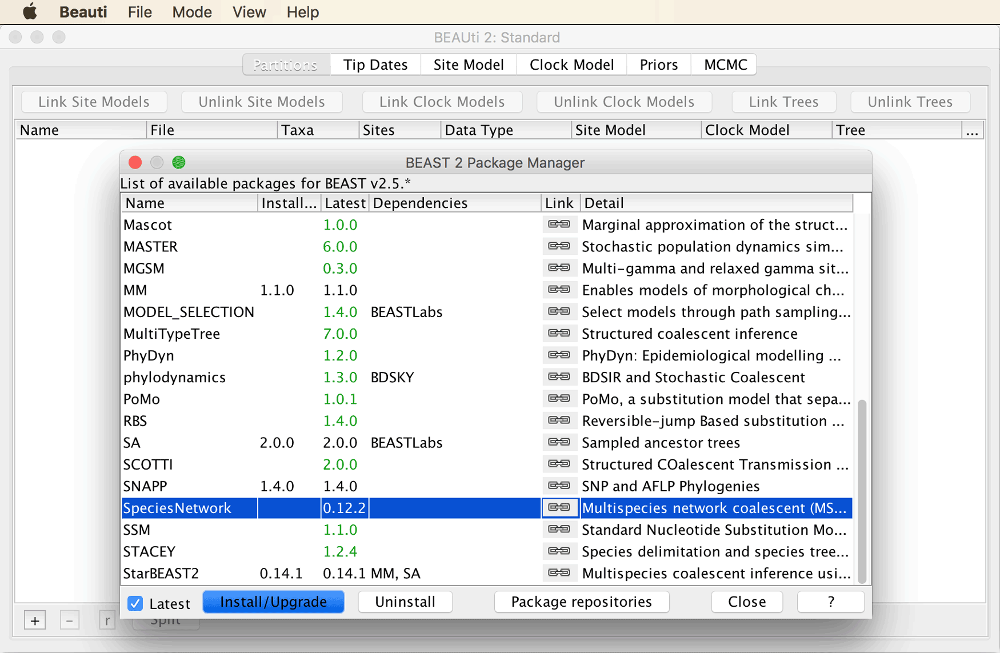

* Close and reopen BEAUti, then select the "SpeciesNetwork" template from BEAUti's "File" menu as shown in the next screenshot.
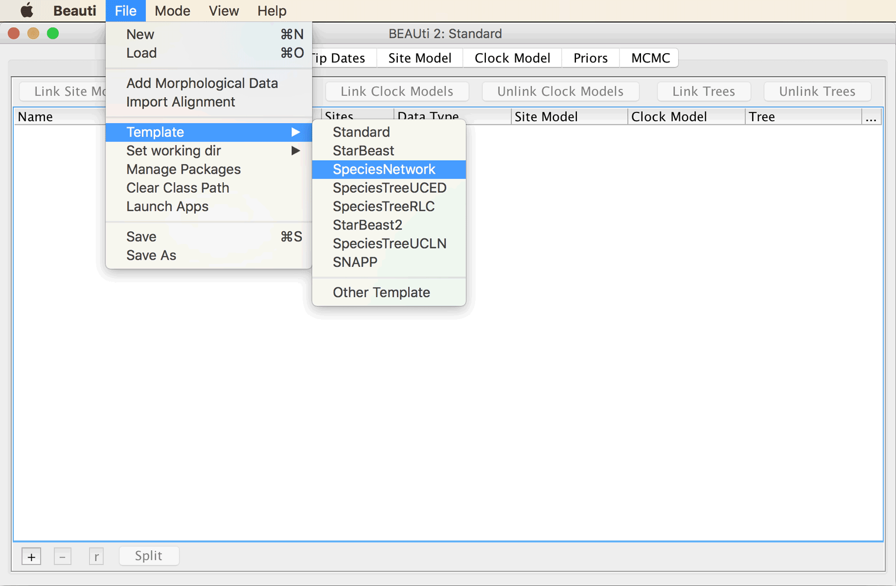
 Two new tabs named "Taxon sets" and "Gene Ploidy" should then have appeared.

* Click "Import Alignment" in the "File" menu and select and open all 68 alignments from directory `10`. If a pop-up window should appear asking about the type of data, select "all are nucleotide" and click "OK". The "Partitions" tab should then look as shown in the next screenshot.
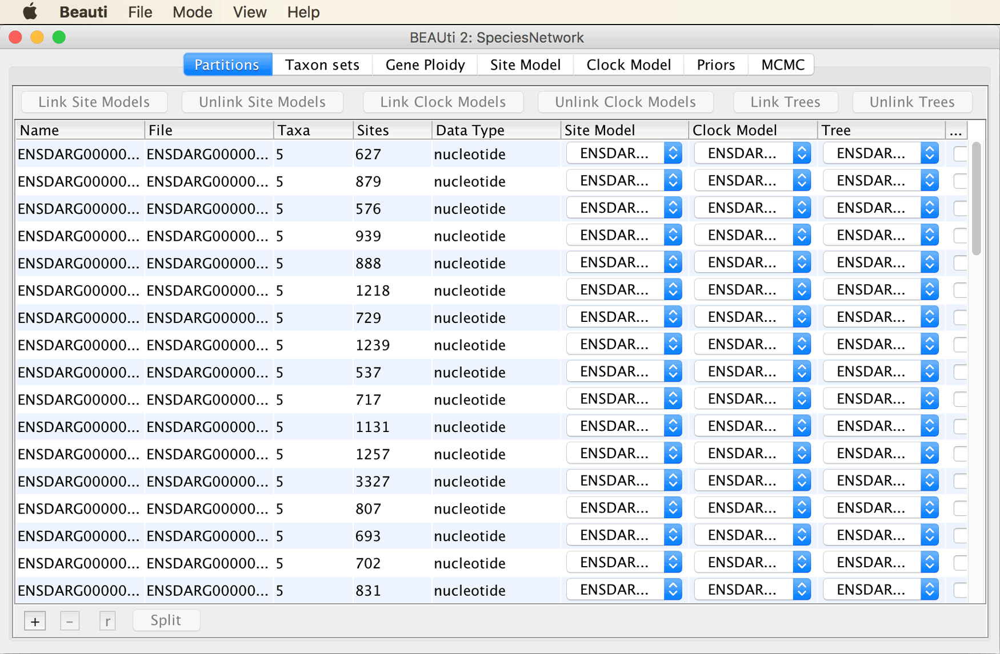

* Select all 68 partitions and click on "Link Clock Models" so that a single model of rate variation is used for all partitions jointly (each partition will still be given a rate multiplier that is going to be estimated, to account for slower or faster-evolving genes).

* Then, click on the "Taxon sets" tab. As the StarBEAST2 model used in tutorial [Bayesian Species-Tree Inference](../bayesian_species_tree_inference/README.md), the Species Network model also allows sequences from multiple samples per species, and the "Taxon sets" tab can be used to assign samples to the different species. In our case, however, the dataset contains sequences of only a single sample per species, thus, no particular assignment needs to be done. Nevertheless, the IDs used for samples and species are not allowed to be identical. Therefore, name the species with the sample name plus a suffix such as "\_spc", as shown in the screenshot below.
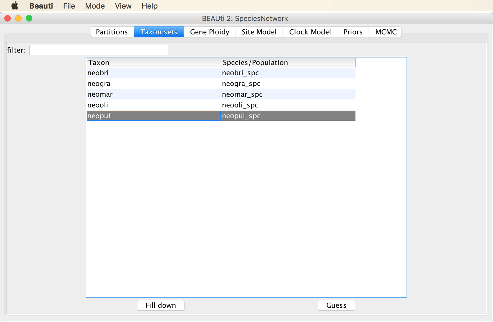

* As in tutorial [Bayesian Species-Tree Inference](../bayesian_species_tree_inference/README.md), the "Gene Ploidy" tab can be skipped since all sequences of our dataset are nuclear and the correct ploidy for nuclear sequences, 2, is the default setting. Thus, continue to the "Site Model" tab where the substitution model is to be specified. Ideally, we would use model averaging with the bModelTest model, and separate such models for the three different codon positions of each gene, as in some of the other tutorials. However, this will be far too computationally demanding for the analysis with the Species Network model. As a reasonable compromise between computational demand and flexibility, we'll use the HKY model of sequence evolution ([Hasegawa et al. 1985](https://link.springer.com/article/10.1007/BF02101694)) without rate variation for each gene, and we'll assume that the empirical nucleotide frequencies in each alignment correspond to their stationary frequencies so that these do not need to be estimated. Thus, select "Gamma Site Model" from the first drop-down menu, "HKY" from the second drop-down menu, and "Empirical" from the last drop-down menu next to "Frequencies", as shown in the next screenshot. Make sure that the gamma category count is set to 0 to disable among-site rate variation. Finally, set a tick in the checkbox next to "estimate" to the right of "Substitution Rate" to allow a rate multiplier for the selected gene.
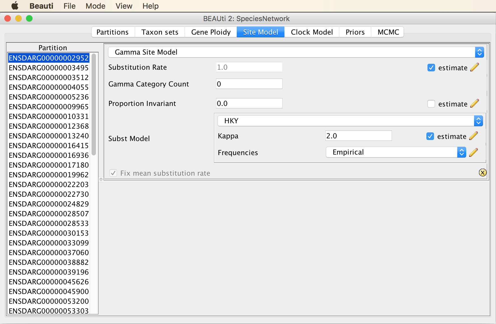

* Then, select all 68 genes simultaneously from the list at the left of the window (make sure to scroll down to select all), and click "OK" to clone the settings from the first gene to all other genes.

* Continue to the "Clock Model" tab. Select the "Strict Clock" model from the drop-down menu to disable branch-rate variation. As in the analyses with the multi-species coalescent model in tutorial [Bayesian Species-Tree Inference](../bayesian_species_tree_inference/README.md), this is justified given that the species included in the dataset are closely related and have a similiar lifestyle, suggesting that their substitution rates should in fact be very comparable. As a starting value for the clock rate we can use the substitution rate estimated in tutorial [Bayesian Species-Tree Inference](../bayesian_species_tree_inference/README.md), as the analysis in that tutorial was performed with a similar set of nuclear alignments and an overlapping set of species. To use this estimate from the previous analysis as a starting value, specify "6.548E-4" in the field next to "Clock.rate". Importantly, set a tick in the checkbox at the right as shown in the below screenshot, so that a prior distribution can be placed on this rate. 
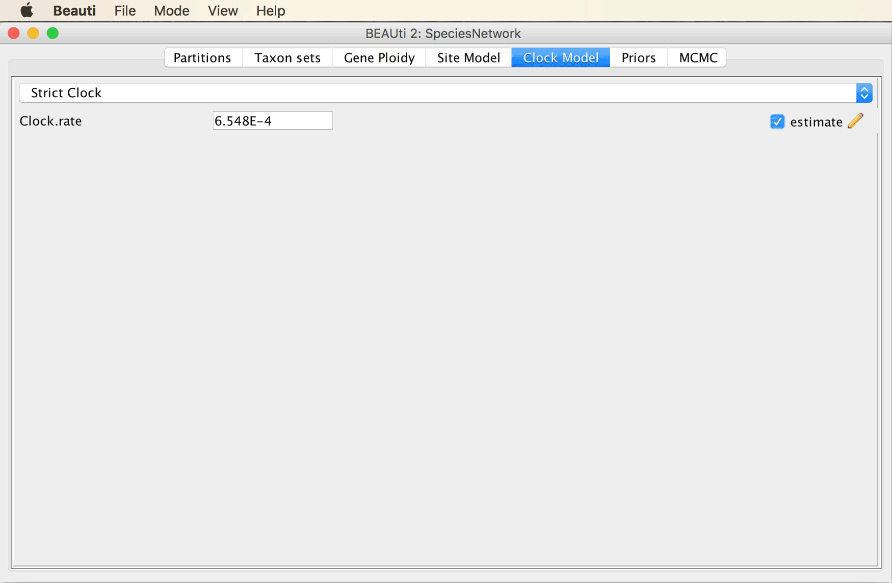

* In the "Priors" tab, you should see a long list of lognormally distributed priors for the transition/transversion (kappa) ratios of each gene. Keep the default settings for these, but scroll to the bottom of the list to change the priors for other parameters.
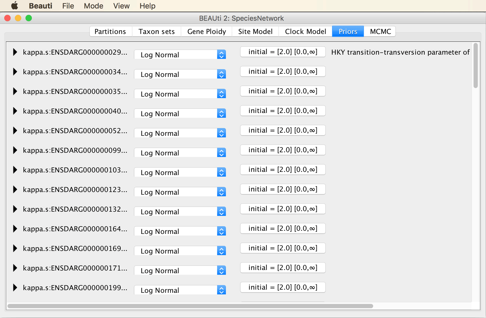
 At the bottom of the list, you'll find the "networkPrior", the prior of the Species Network model, among other priors, as shown in the next screenshot.
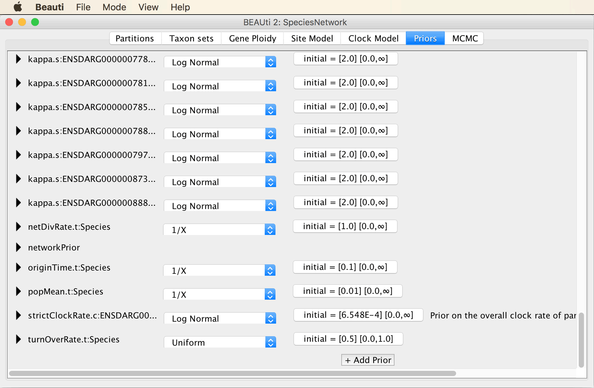

* Click on the black triangle to the left of "networkPrior" to see the parameters of this prior. You'll see that it includes three parameters, as shown in the next screenshot: the "Net Diversification", the "Turn Over", and the "Beta Shape".
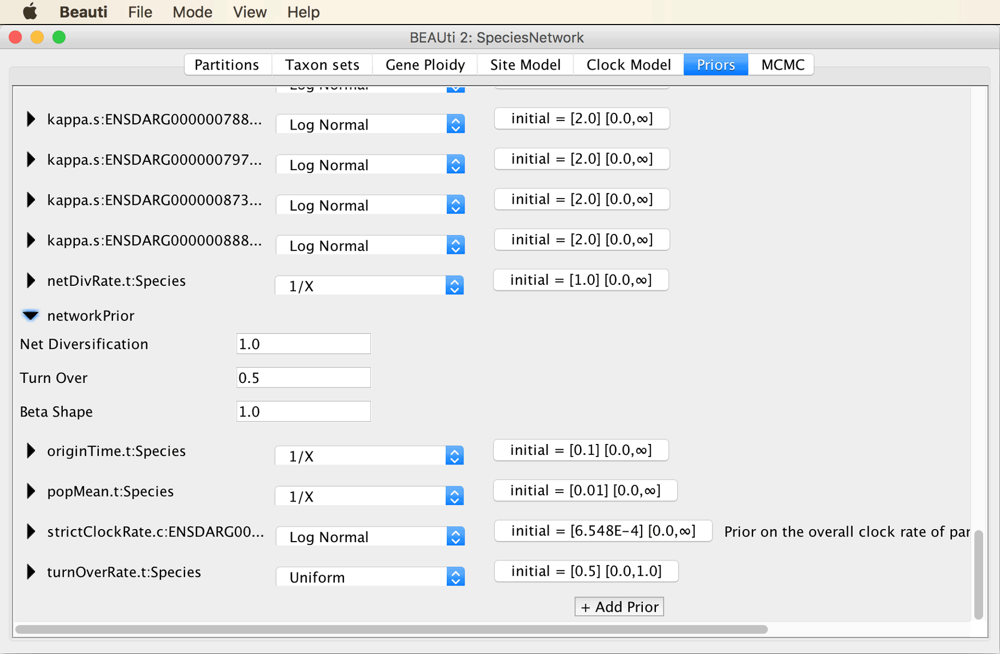
 Of these, the "Net Diversification" and the "Turn Over" should not be confused with the net diversification and turnover in other BEAST2 analyses, where the net diversification rate is the difference between the speciation rate and the extinction rate and the turnover is the ratio of the extinction rate over the speciation rate. In the Species Network model, extinction is not included, however, hybridization has a similar effect to extinction because it reduces the number of species when two lineages merge through hybridization. Thus, the "Net Diversification" in the Species Network model is the difference between the speciation rate and the hybridization rate, and the "Turn Over" is the ratio of the speciation rate over the hybridization rate. The "Beta Shape" parameter is the shape parameter of a beta-distributed prior density on the proportion of the genome that is transferred in a hybridization event. With the default setting, this prior density is equivalent to a uniform probability between 0 and 1. We'll keep the default setting for this prior density.

* If you extend the window to the right or scroll to the right, you'll see three checkboxes, the first two of which should be ticked. This means that the parameters "Net Diversification" and "Turn Over" of the species-network prior are themselves going to be estimated, meaning that hyper-priors are placed on them. 
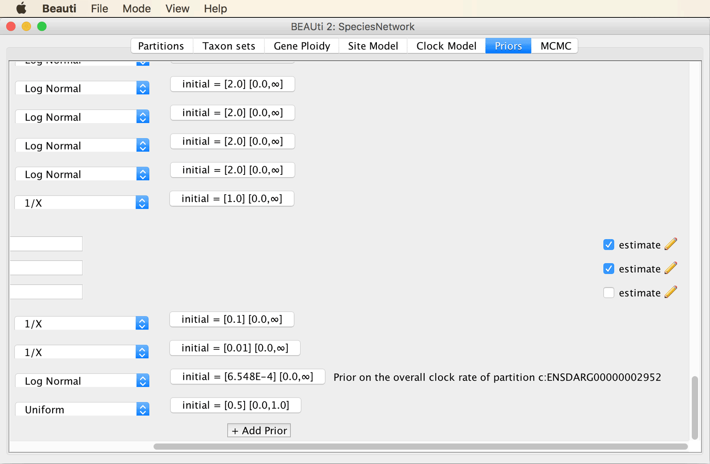
These two hyper-priors are named "netDivRate.t:Species" and "turnOverRate.t:Species" and you'll see them above the "networkPrior" and at the very end of the list of priors when you scroll back to the left. Before we change these two priors, first change the starting value for the "Turn Over" to 0.1, as shown in the next screenshot.
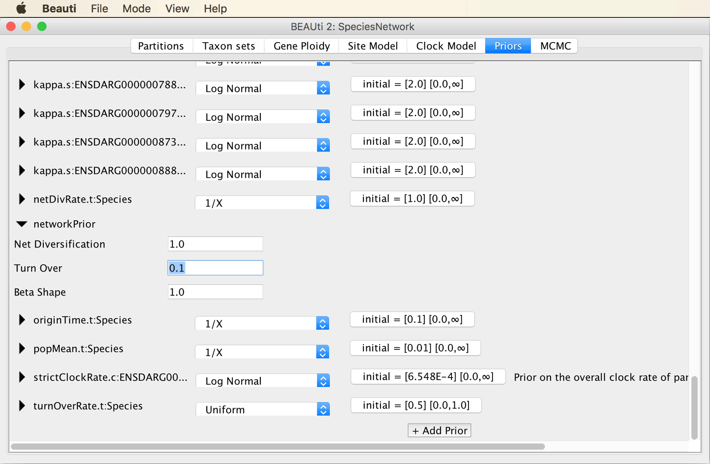
.

* Then, click on the black triangle to the left of "netDivRate.t:Species" to set a prior distribution on the net diversification rate. An exponentially distributed prior density with a mean of 1.0 might be a reasonable choice for this prior, because the number of lineages among the samples *Neolamprologus* species may in fact double approximately once per time unit (= 1 million years). Specify this prior density as shown in the next screenshot. 
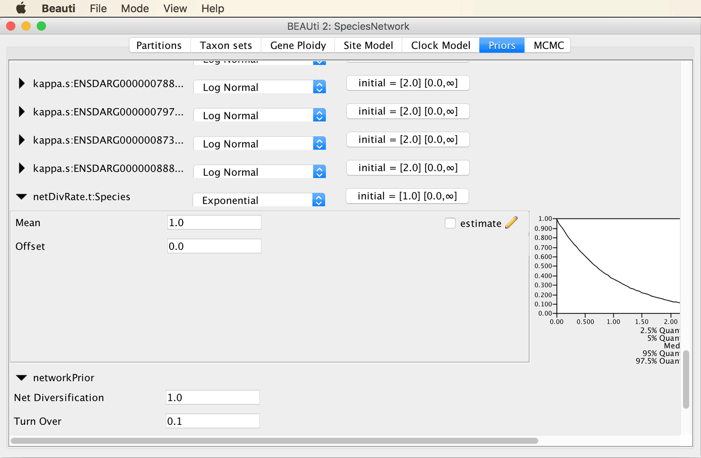

* Next, click on the triangle to the left of "turnOverRate.t:Species". This is possibly the most influential prior of the model, as it determines the probability of hybridization. Because the turnover is the ratio of the hybridization rate over the speciation rate, it is bound to lie between 0 and 1. This is a general property of beta distributions; therefore, beta-distributed prior densities are well suited to express prior belief in the turnover rate. For example, with a beta distribution parameterized with alpha = 1.0 and beta = 3.0, the prior probability is highest for a turnover of 0 (meaning no hybridization at all) and gradually declines until it becomes zero for a turnover of 1 (which would mean an infinite amount of hybridization). Thus, set "Alpha" to 1.0 and "Beta" to 3.0 as shown in the next screenshot to parameterize the prior density in this way.
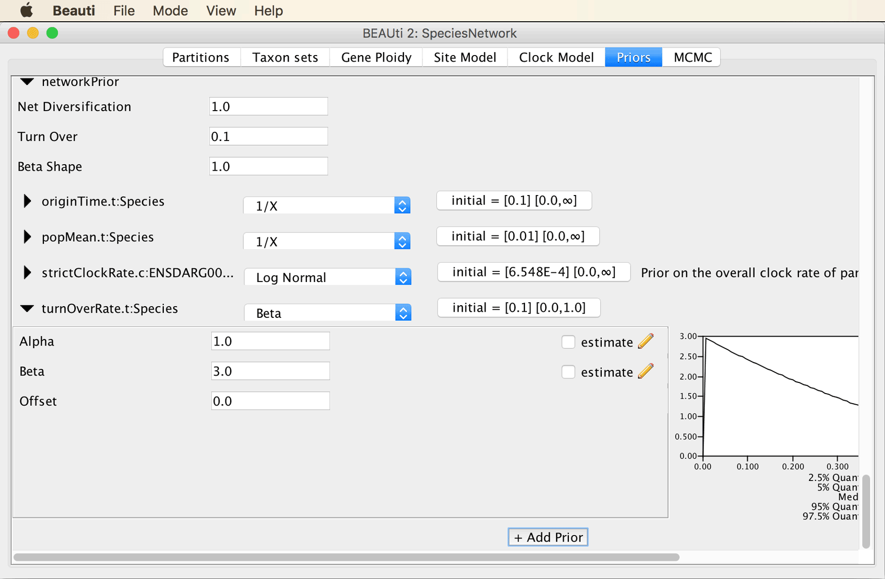

* Three more prior densities should still be optimized; these are "originTime.t:Species" for the age of the network, "popMean.t:Species" for the mean population size, and "strictClockRate.c:ENSDARG..." for the substitution rate (recall that we ticked the checkbox to estimate this parameter in tab "Clock Model"). The parameter on the age of the network may need some explanation: In a species network, estimating its age is not as simple as in a time calibrated tree, because the network could theoretically be much older than all or most of the variation among the sampled species. This is because new species could have branched off many times from the most ancestral branches only to merge again with them in hybridization events. Thus, none or very little of the genetic variation resulting from the very first splits in the network might still be observable in the extant species. For this reason, the prior on the age of the network should not be confused with a prior on the divergence time of the root as used in tutorial [Bayesian Species-Tree Inference](../bayesian_species_tree_inference/README.md). In fact, such calibrations on divergence times can not even be applied in the context of a species network because different parts of the genomes of the species might have diverged in different speciation events. For the specification of the prior density on the age of the network, it is important that this prior density extends to ages older than the divergence times estimated with other methods, so that the possibility of previous speciation and hybridization events can be accomodated. In our case, the divergence of the five *Neolamprologus* species was estimated at around 0.60 Ma (with an 95% HPD interval ranging from 0.41 to 0.78 Ma) with the multi-species coalescent model of SNAPP in tutorial [Divergence-Time Estimation with SNP Data](../divergence_time_estimation_with_snp_data/README.md). Thus a prior density that allows a network origin some time between 0.4 and, say, 2.0 Ma could be appropriate. To implement such a prior density, choose a lognormally-distributed density with a mean of 1.0 and a standard deviation (in real space) of 0.3, as shown in the next screenshot.
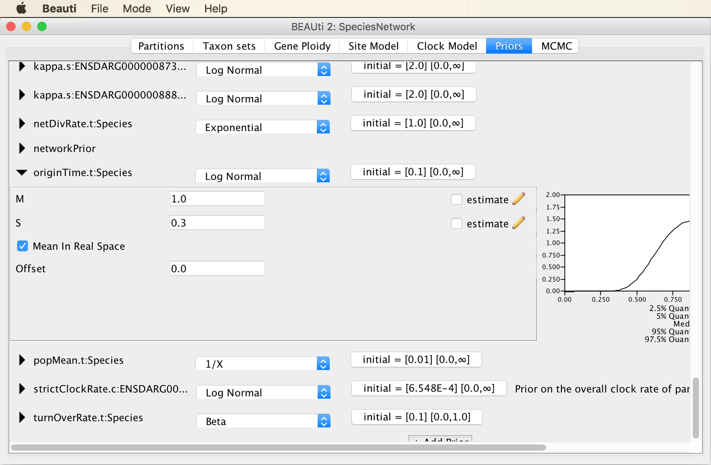

* In the Species Network model, the population sizes are allowed to vary on different branches, but instead of estimating each of these population sizes, BEAST2 integrates over all possible population sizes when calculating the posterior probability of a network. Nevertheless, the mean over all population sizes is estimated in the model, and a prior density is required for this mean population size. To specify this prior density, we can re-use the population-size estimate from the species-tree analysis based on SNP data in tutorial [Divergence-Time Estimation with SNP Data](../divergence_time_estimation_with_snp_data/README.md). In that tutorial, the mean population-size estimate was 9.3 &times; 104 with a 95% HPD interval ranging from 6.5 &times; 104 to 1.2 &times; 105. To use this estimate as the prior on "popMean.t:Species", the effective population size must again (as in tutorial [Bayesian Species-Tree Inference](bayesian_species_tree_inference/README.md)) be divided by the number of generations per time unit. With a time unit of 1 million years and a generation time of 3 years, the mean of the prior density on "popMean.t:Species" should be around 9.3 &times; 104 &div; 333333 &asymp; 0.3. We'll use a normally-distributed prior density for "popMean.t:Species" with this mean and with a standard deviation of 0.05 to approximate the 95% HPD interval of the population-size estimate from the species-tree analysis in tutorial [Divergence-Time Estimation with SNP Data](../divergence_time_estimation_with_snp_data/README.md). Thus, specify the normally-distributed prior density with the mean of 0.3 and the standard deviation of 0.05 as shown in the next screenshot.
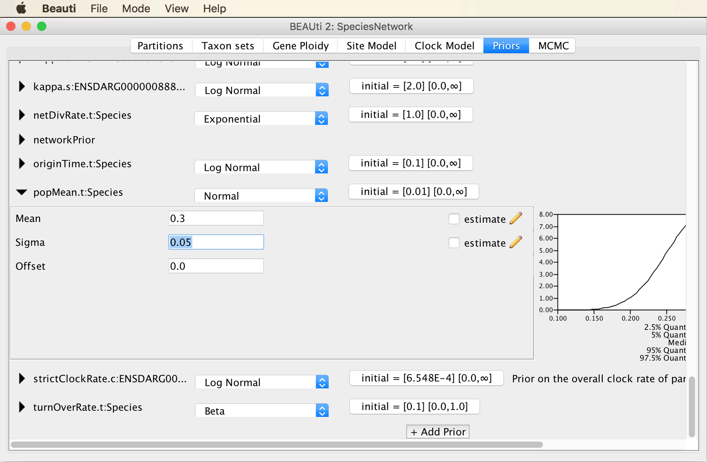

* Finally, we need to specify a prior on the rate of the strict clock (= the mean substitution rate across all genes). This is particularly important because, as explained above, age priors on divergence times can not be used with the Species Network model and a constraint on the clock rate is therefore the only way to calibrate the species network in units of absolute time. To do so, we are going to re-use the estimate for the clock rate from the analysis with the multi-species-coalescent model in tutorial [Bayesian Species-Tree Inference](../bayesian_species_tree_inference/README.md). In that analysis, the strict-clock rate for twelve nuclear genes was estimated as 6.548 &times; 10-4 substitutions per site and time unit of 1 million years, with a 95% HPD interval ranging from 5.555 to 7.624 &times; 10-4. To implement this mean and the range of uncertainty in a prior density for the strict-clock-rate parameter "strictClockRate.c:ENSDARG...", use a lognormally-distributed density with a mean (in real space) of 6.548E-4 and a standard deviation of 0.08, as shown in the next screenshot.
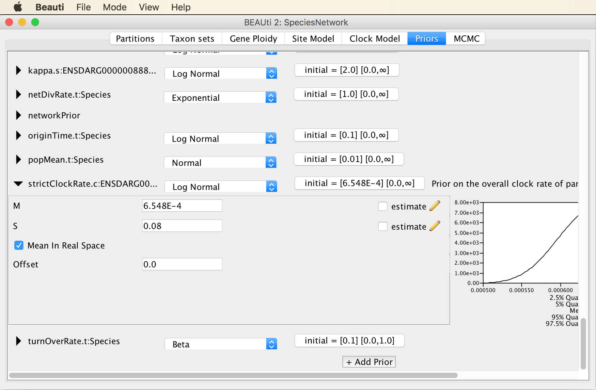

* In preliminary analyses I found that the MCMC chain of this analysis approaches stationarity faster when the estimates for the per-gene substitution-rate multipliers are updated more often than they are by default. The frequency at which they are operated can be tuned either directly in the XML file, or through the hidden "Operators" panel in BEAUti. To show this hidden panel, click on "Show Operators panel" in BEAUti's "View" menu. This should add a new tab as shown in the screenshot below.
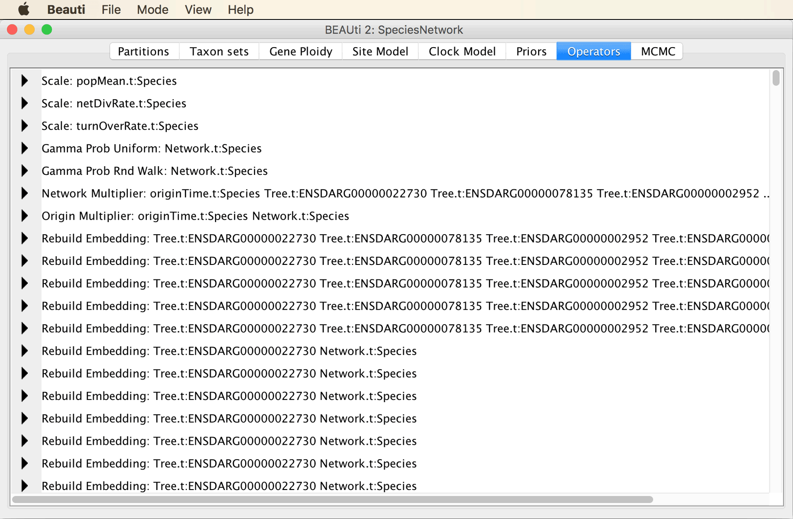

* Scroll down the list of operators until you see the the operator named "Delta Exchange: mutationRate..." shown in the next screenshot.
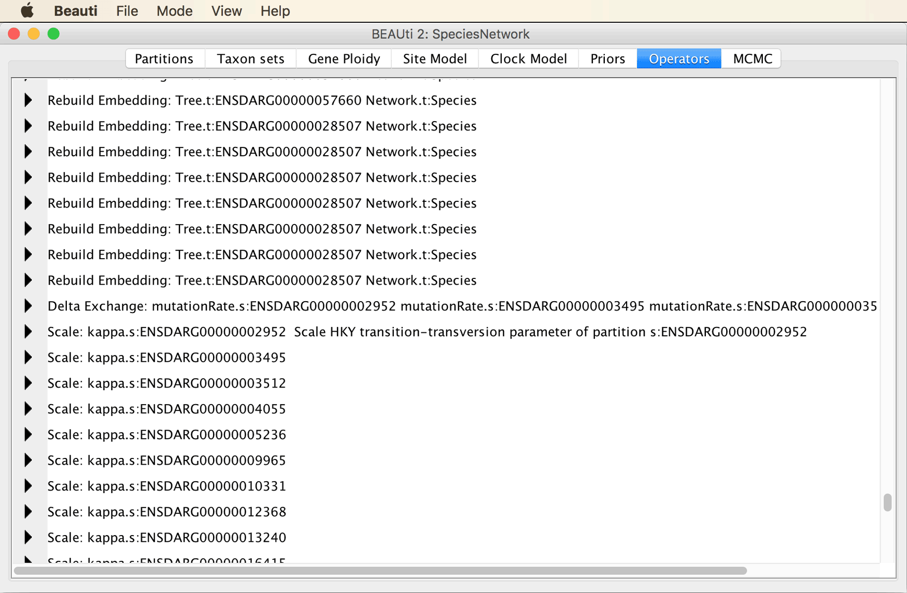

* Once you found the operator named "Delta Exchange: mutationRate..." you may have to scroll to the right or extend the width of the window to be able to specify a weight for this operator. The currently specified weight should be the default of 2.0. Increase this weight to 40.0 as shown in the next screenshot.
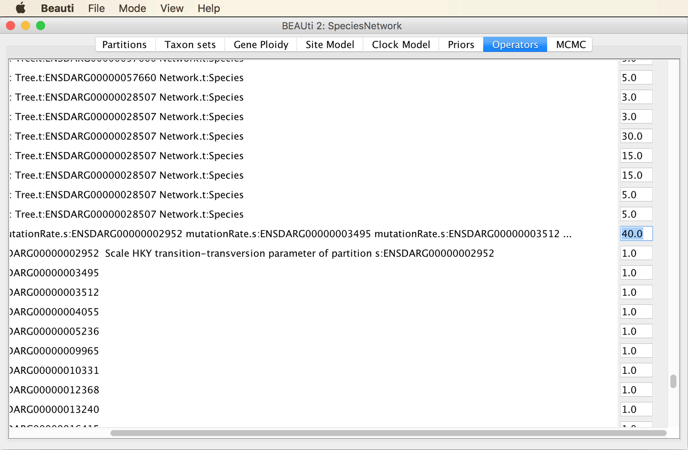

* Then, continue to the "MCMC" tab. There, you may keep all default values for the MCMC chain length as well as log frequencies and file names. Save the file by clicking "Save" in BEAUti's "File" menu, and name it `speciesnetwork.xml`.

* Then, use either the GUI version or the command-line version of BEAST2 to start the analysis of the XML file [`speciesnetwork.xml`](res/speciesnetwork.xml). To start the analysis with the command-line version of BEAST2, you could use the following command if your BEAST2 installation is in directory `/Applications/Beast/2.5.0` (if not, replace this path with the actual path to your BEAST2 installation):

		/Applications/Beast/2.5.0/bin/beast speciesnetwork.xml

	To run the full MCMC chain length of 50 million iterations, this analysis is going to take about 10 hours of run time. Thus, unless you have the chance to run this analysis overnight, you might want to stop it at some point and continue the rest of the tutorial with the results of my completed analysis. The result files that you will need to continue the tutorial are [`speciesnetwork.log`](res/speciesnetwork.log), [`speciesnetwork.trees`](res/speciesnetwork.trees), and the 68 tree files for the individual gene trees. You can find these in the compressed directory [`speciesnetwork_genetrees.tgz`](res/speciesnetwork_genetrees.tgz).
	
* When the BEAST2 analysis has completed, or if you decided to use the results of my analysis for the rest of the tutorial, inspect the degree of the stationarity of the MCMC chain by opening the log file [`speciesnetwork.log`](res/speciesnetwork.log) in Tracer. You should see that while most ESS values are sufficiently high (above 200) to indicate stationarity, the ESS values of the parameters "originTime.t:Species", "Network.t:Species.height", and "Network.t.Species.length" are far from sufficient, as shown in the next screenshot.
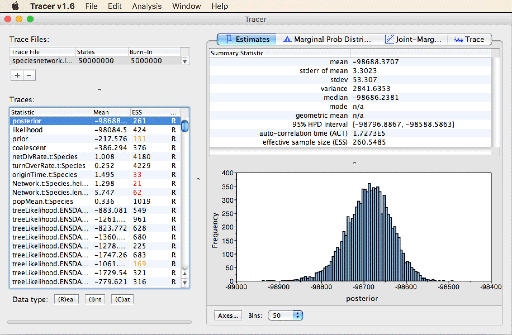

* Have a closer look at the parameter with the lowest ESS value, the "Network.t:Species.height" parameter. It is highly correlated with the two parameters "originTime.t:Species" and "Network.t:Species.length"; therefore it is not surprising that these also have similarly low ESS values. Click on the "Trace" tab to see a plot of the trace of "Network.t:Species.height", as shown in the next screenshot.
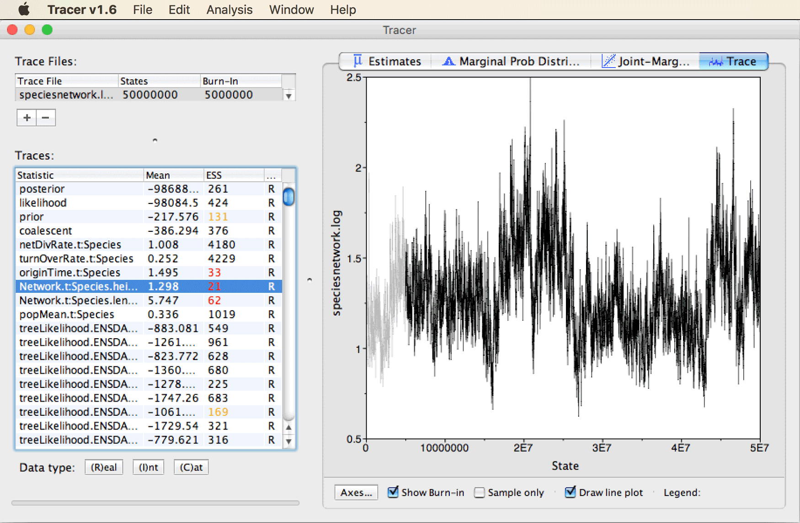
 There's no doubt that the MCMC chain should have been run for more iterations if this analysis was to be published (and that at least a second analysis should have been run in parallel to see if both reach the same posterior distribution). Nevertheless, we'll assume here that the stationarity of the chain is sufficient for our interpretation.

* To understand the difference between the three parameters "Network.t:Species.height", "originTime.t:Species", and "Network.t:Species.length", select all three in the list of parameters and click the tab for "Marginal Prob Distribution", which should show the smoothed posterior distributions as in the next screenshot.
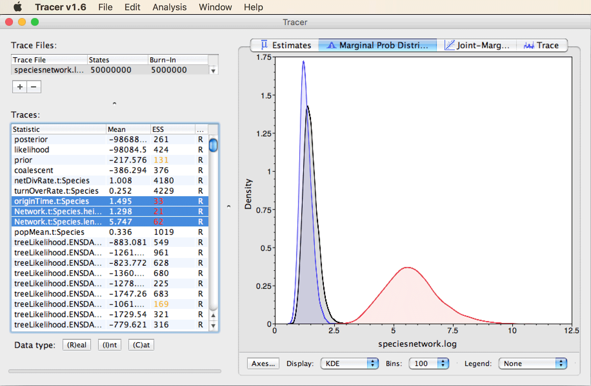
 The black density represents the posterior estimates for "originTime.t:Species", which corresponds roughly to the lognormally-distributed prior density that we defined for this parameter with a mean age 1.0 and a standard deviation of 0.3. A little shifted to the left, and thus about 0.2 million years younger is the density for "Network.t:Species.height". The difference between the two parameters is that "Network.t:Species.height" represents the age of the earliest speciation event in the network whereas "originTime.t:Species" is a node that may be even older (this is well illustrated in Fig. 9 of [Zhang et al. 2017](https://academic.oup.com/mbe/article/35/2/504/4705834)). The third parameter, "Network.t:Species.length", is the sum of all branch lengths in the network.

* To learn how species networks are encoded in Extended Newick ([Cardona et al. 2008](https://bmcbioinformatics.biomedcentral.com/articles/10.1186/1471-2105-9-532)), have a look at the first 30 or so lines of the output file [`speciesnetwork.trees`](res/speciesnetwork.trees), using for example the following command:

		head -n 30 speciesnetwork.trees
		
	You might notice that some of the lines coding for trees contain the label "#H1". More precisely, those that contain this label always contain it twice. This is because this label codes for the connection points of hybdridization branches in the network.
	
* To illustrate the way in which species networks are encoded in Extended Newick format, write the following text to a new file that you could for example name `tmp.tre`:

		#NEXUS
		Begin trees;
			tree example = (((A,#H1),B),(C)#H1);
		End;

	As you may guess, this text encodes a species network in which "A" and "B" are sister species, and a hybridization branch connects "A" with the outgroup "C".

* Because FigTree does not support the Extended Newick format, we'll use another tree viewer, [IcyTree](https://icytree.org) ([Vaughan 2017](https://academic.oup.com/bioinformatics/article/33/15/2392/3604867)), instead to visualize this network of species "A", "B", and "C". As IcyTree is an online tree viewer, no installation is needed. Open the [IcyTree webpage](https://icytree.org) in a browser and load the file `tmp.tre` that you just wrote. As expected, the tree includes a hybridization branch that connects species "A" and "C", as shown in the next screenshot.
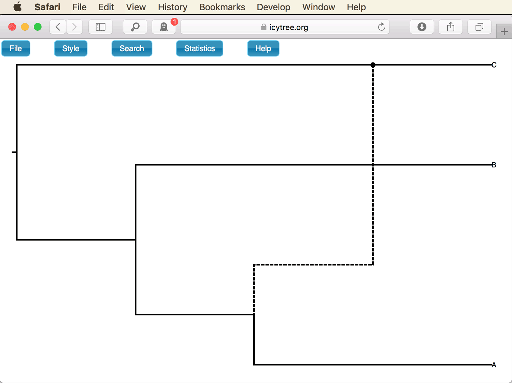

* You could browse the style settings of IcyTree to learn a bit about how to optimize the visualization. For example, you could change the width of the branches by clicking "Edge width" > "Increase" in IcyTree's "Style" menu as in the next screenshot. You may need to click on it multiple times to see a difference.
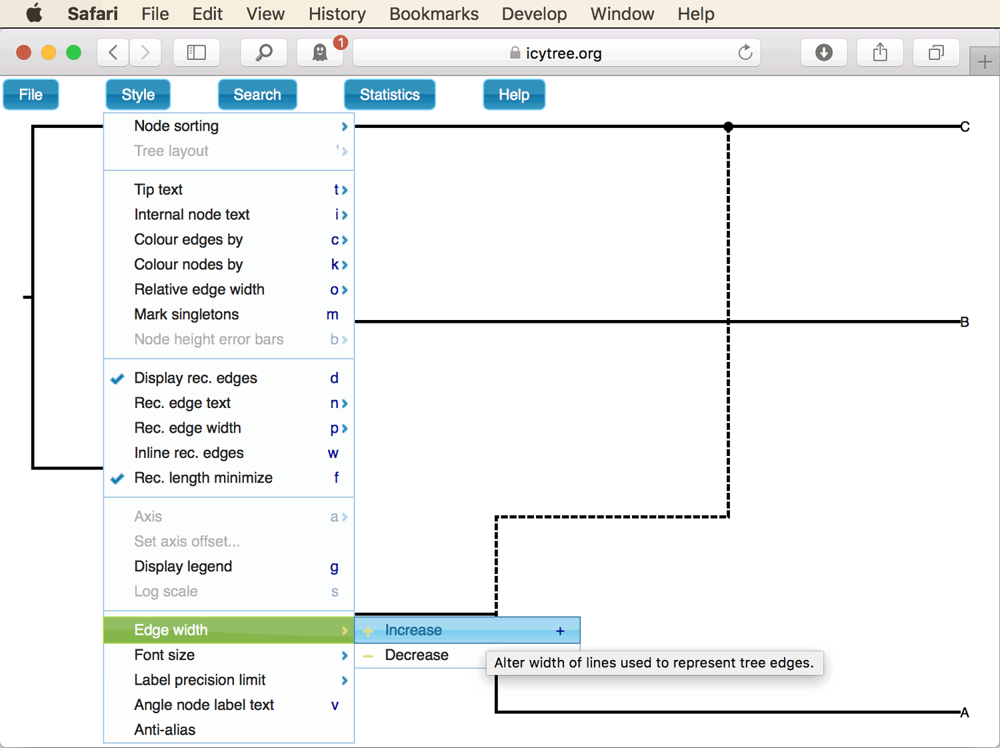

* You could also to increase the font size for the tip labels, as shown below. click on "Font size" > "Increase" in the "Style" menu multiple times, the network will look as shown below.
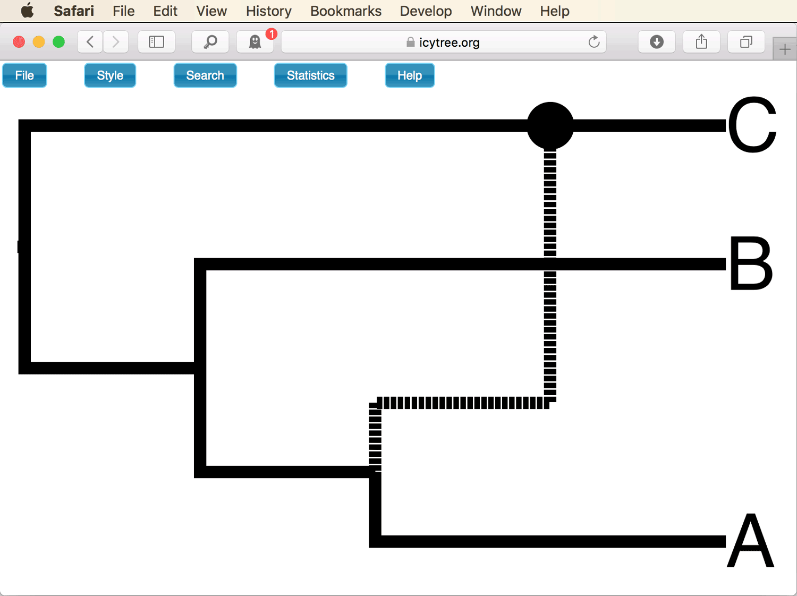

* To get a feeling for the posterior distribution of networks in file [`speciesnetwork.trees`](res/speciesnetwork.trees), also load this file in IcyTree and use the arrows at the bottom left of the window to browse through the networks of the posterior distribution. You might want to type "1000" in the field between the left and right arrows to skip the burnin and jump directly to the 1,000th sampled network. While you browse through the posterior distribution of networks, you'll probably see some that look as shown in the next screenshot.
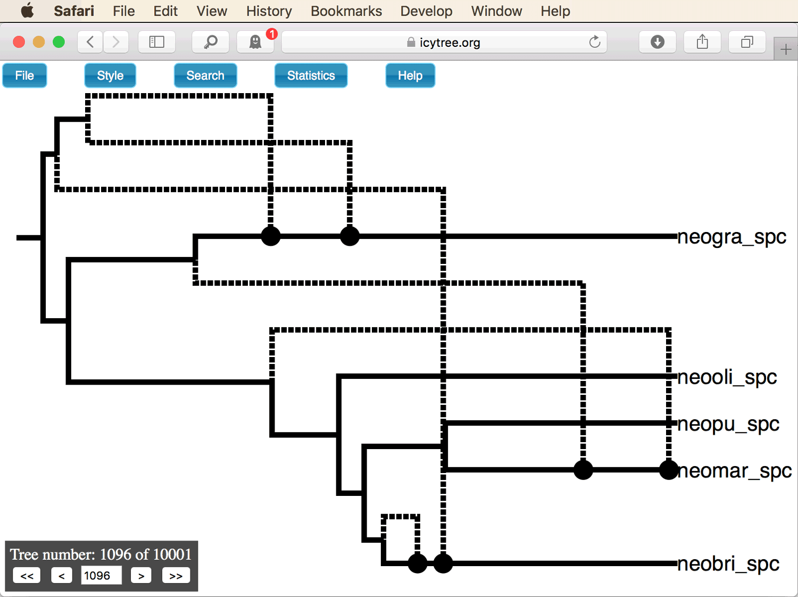
 As in the above example, some networks of the posterior distribution can be rather complex and even include "bubbles" as shown in the above screenshot on the branch leading to *Neolamprologus brichardi* ("neobri\_spc"), where a speciation event is followed by a hybridization event that effectively reverses the speciation. These "bubbles" are allowed in the model; however, it is impossible to obtain strong support for them as they do not influence the likelihood of the data.

* As in other tutorials, it would be convenient to summarize the posterior distribution of species networks into something equivalent to the maximum-clade-credibility trees generated by TreeAnnotator. However, TreeAnnotator unfortunately can not summarize species networks. Instead, we can use another very short BEAST2 analysis to identify the unique network topologies included in file [`speciesnetwork.trees`](res/speciesnetwork.trees), quantify their posterior probabilities, and then calculate the mean ages of speciation and hybridization events from each set of posterior networks that share the same topology. To do so, we'll need to write another short XML input file for BEAST2, which should contain the following text:

		<?xml version="1.0" encoding="UTF-8"?>
		<beast namespace="beast.core:beast.app" version="2.5">
			<run id="network.summary" spec="speciesnetwork.tools.SummarizePosterior" inputFileName="speciesnetwork.trees" outputFileName="speciesnetwork_sum.trees" burnin="1000"/>
		</beast>

	Write this text to a new file named `speciesnetwork_sum.xml`. With the above XML code, we specify that file `speciesnetwork.trees` should be used as input, that output summarizing the species networks should be written to a new file named `speciesnetwork_sum.trees`, and that the first 1,000 networks (= 10%) from file `speciesnetwork.trees` should be discarded as burnin.
	
* Use the command-line version of BEAST2 to execute the file `speciesnetwork_sum.xml` written in the last step (if you would use the GUI version instead, you might need to specify the absolute path to the input and output tree files). This BEAST2 analysis should finish within a few seconds.

* Then, also load the new file [`speciesnetwork_sum.trees`](res/speciesnetwork_sum.trees) in IcyTree, and make sure that the first network is shown by typing "1" in the field between the arrows at the bottom left of the window, as in the next screenshot.
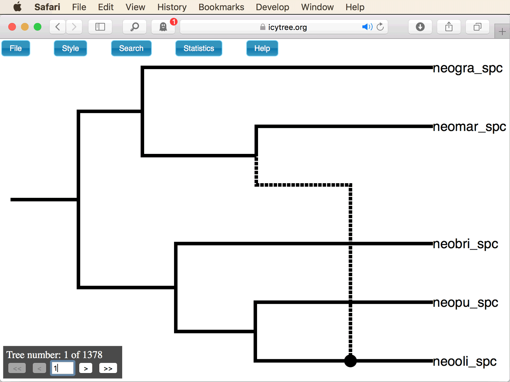

* The networks in this file are now in the order of decreasing posterior probability for the respective unique network topology. To see the posterior probability of the first network topology, click "Internal node text" > "topologySupport" in the "File" menu, as shown in the below screenshot.
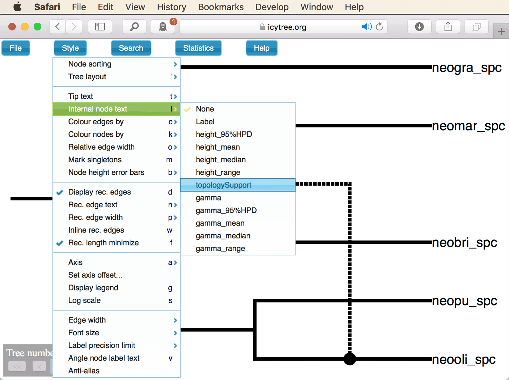

* To limit the number of decimals shown for the topology support, also click "Label precision limit" > "3 sig. figures" also in the "File" menu, then the topology support should be given on the branch leading to the first speciation event, as in the next screenshot.
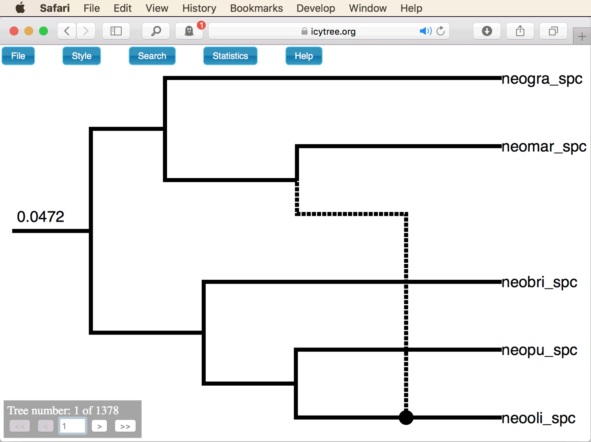
 **Question 1:** Would you say this topology looks reliable? [(see answer)](#q1)

* If you hover with the mouse over the branches of the network, IcyTree will show detailed information for these branches, including the age estimates for the nodes at the beginning and the end of the branch (named "parent" and "child", respectively). If you hover over a branch leading to a black dot that represents a hybridization event, the branch information will also include estimates for gamma, as shown in the next screenshot.
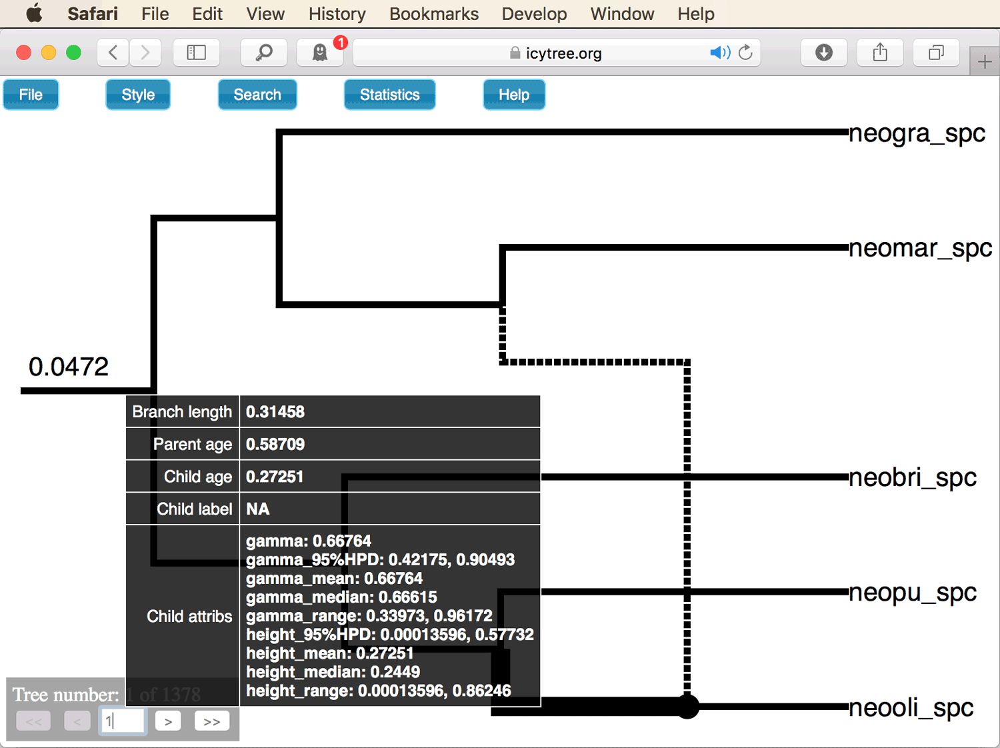
 This gamma estimate represents the proportion of the genome that has been inherited along this branch. In the case shown above, about 67% were inherited along the branch, meaning that the species *Neolamprologus olivaceous* ("neooli\_spc") received the remaining 33% through the hybridization event with *Neolamprologus marunguensis* ("neomar\_spc").

* Click the arrow symbol `>` in the bottom left to browse through the next network topologies with decreasing posterior probabilities. You may notice that the "bubbles" observed with file `speciesnetwork.trees` are not present in the set of unique networks of file `speciesnetwork_sum.trees`. This is because those "bubbles" were ignored in the summary analysis with BEAST2. If instead they had been taken into account, the posterior probabilities of the unique networks would be even lower. **Question 2:** Despite the low posterior probability of each unique topology, what can we learn from these results? [(see answer)](#q2)

* Finally, we can also visualize the set of gene trees to get a feeling for how concordant or discordant they are. In contrast to the species networks, the  posterior distributions of gene trees can be summarized in the form of maximum-clade-credibility trees with TreeAnnotator. To do so for all 68 gene trees, use the following set of commands (make sure to replace `/Applications/Beast/2.5.0` with the actual path to your BEAST2 installation if it should be in another directory):

		for i in ENSDARG*.trees
		do
			/Applications/Beast/2.5.0/bin/treeannotator -burnin 10 -heights mean ${i} ${i%.trees}.tre
		done

* The above step should have generated 68 files named `ENSDARG*.tre` that contain the maximum-clade-credibility gene trees. To combine these into a single file, we can (as in tutorial [Bayesian Species-Tree Inference](../bayesian_species_tree_inference/README.md)) use the Python script [`logcombiner.py`](src/logcombiner.py) with the following commands:
 
		ls ENSDARG*.tre > speciesnetwork_genetrees.txt
		python3 logcombiner.py speciesnetwork_genetrees.txt speciesnetwork_genetrees.trees

* Then, open the new file [`speciesnetwork_genetrees.trees`](res/speciesnetwork_genetrees.trees) in the program Densitree. This program is part of the BEAST2 distribution and should be located in the same directory as BEAST2. You should see a visualization of the maximum-clade-credibility gene trees as shown in the next screenshot.
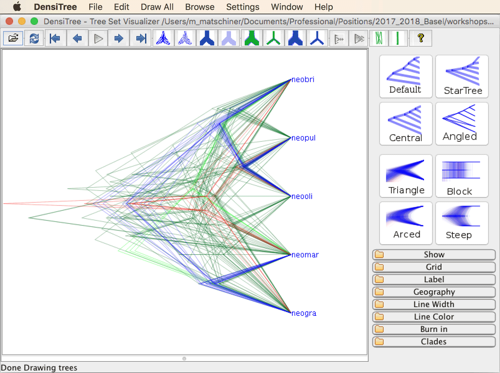
 **Question 3:** What does this distribution of gene trees tell us about the relationships of the five species? [(see answer)](#q3)

The interpretation of the results based on the Species Network model remains speculative regarding the species-tree topology and the exact hybridization events among the five *Neolamprologus* species. Nevertheless, it is clear that different parts of the genomes of these species have different evolutionary histories, which would be consistent with both incomplete lineage sorting or hybridization. A way to assess to overall support for hybridization would be to perform a second analysis with the same model that only allows incomplete lineage sorting but no hybridization at all (to do so, one could fix parameter "turnOverRate.t:Species" to 0), followed by a Bayes-Factor comparison to assess the relative fit of the two models (more information on this type of model comparison can be found on the [BEAST2 website](https://www.beast2.org/path-sampling/)). The relationships and hybridization events among *Neolamprologus* species will also be further investigated based on SNP data and chromosome-length alignments in tutorials [Analysis of Introgression with SNP Data](../analysis_of_introgression_with_snp_data/README.md) and [Analysis of Introgression with Chromosome-Length Alignments](analysis_of_introgression_with_chromosome_length_alignments/README.md).

 

                   

## Answers

* **Question 1:** Even though the topology shown above is the best-supported of all network topologies in the posterior distribution, its probability is very low, even below 5%. However, support for a particular topology should not be compared with the support for individual nodes, for example in a species-tree analysis, and particularly with larger numbers of species in the dataset, each individual overall topology usually receives increasingly lower support. This is best exemplified by the species-tree analyses with bird genomes in [Jarvis et al. (2014)](http://science.sciencemag.org/content/346/6215/1320), where the exact topology of the summary tree was not found in any of the thousands of gene trees even though almost all nodes received very strong support. To allow a better discrimination among network topologies based on their posterior support, it might help to either perform the analysis with a larger dataset or to reduce the number of all possible topologies by reducing the number of species in the dataset.

* **Question 2:** Obviously it is not easy to pinpoint a particular hybridization event based on the results of the analysis with the Species Network model. Nevertheless, these results are valuable to demonstrate the surprising variety of networks that would be consisitent with the sequence data of the five species. In addition, I would argue that most networks do support a clustering of the three species *Neolamprologus brichardi* ("neobri\_spc"), *Neolamprologus olivaceous* ("neooli\_spc"), and *Neolamprologus pulcher* ("neopul\_spc") as well as a genetic connection between *Neolamprologus olivaceous* and the remaining species.

* **Question 3:** Clearly there is a wide variety of gene-tree topologies for the five *Neolamprologus* species. It appears that the gene trees drawn in blue, with a topology supporting the species trio *Neolamprologus brichardi* ("neobri"), *Neolamprologus olivaceous* ("neooli"), and *Neolamprologus pulcher* ("neopul"), as well as a sister-group relationship between *Neolamprologus gracilis* ("neogra") and *Neolamprologus marunguensis* ("neomar") are more dominant than other gene trees, which would support the interpretation based on species networks. On the other hand, it is interesting that the oldest gene trees are those shown in red which group *Neolamprologus brichardi* ("neobri") with *Neolamprologus gracilis* ("neogra"), because hybridization leads to younger divergences in the gene trees and the oldest gene trees could therefore be speculated to represent the true species tree.