# Bayesian Phylogenetic Inference

A tutorial on Bayesian inference of time-calibrated phylogenies

## Summary

In contrast to maximum-likelihood inference, Bayesian inference can take into account prior expectations. In the context of phylogenetic inference, this means for example that substitution rate parameters could be constrained towards values that are considered realistic based on the findings of previous studies on the group of interest. More importantly, however, by incorporating prior expecations, Bayesian inference provides a flexible framework for phylogenetic divergence-time estimation as particular divergence times can be constrained according to fossil or biogeographic evidence. These in turn can then inform the timing in other parts of the phylogeny so that an overall timeline of diversification can be estimated. Conveniently, Bayesian inference also results in confidence intervals that are probabilistic and can thus be directly used for hypothesis testing.

## Table of contents

* [Outline](#outline)
* [Dataset](#dataset)
* [Requirements](#requirements)
* [Bayesian phylogenetic inference with BEAST2](#beast2)
* [Automatic substitution model selection with BEAST2](#bmodeltest)
* [Assessing MCMC stationarity with Tracer](#tracer)
* [Summarizing the posterior tree distribution](#treeannotator)

## Outline

In this tutorial, I will demonstrate how time-calibrated phylogenies can be inferred with programs of the Bayesian software package [BEAST2](https://www.beast2.org) ([Bouckaert et al. 2014](http://journals.plos.org/ploscompbiol/article?id=10.1371/journal.pcbi.1003537)). The settings for the analysis will be specified with the program BEAUti, the Bayesian analysis itself is going to be conducted with BEAST2, and a summary tree will be generated with the program TreeAnnotator. These three programs are part of the BEAST2 package. In addition, I will present the use of the program [Tracer](http://tree.bio.ed.ac.uk/software/tracer/) ([Rambaut et al. 2018](https://academic.oup.com/sysbio/advance-article/doi/10.1093/sysbio/syy032/4989127)) to assess stationarity of the Bayesian analysis. Finally, I am going to demonstrate the use of the very convenient new [bModelTest](https://github.com/BEAST2-Dev/bModelTest) ([Bouckaert and Drummond 2017](https://bmcevolbiol.biomedcentral.com/articles/10.1186/s12862-017-0890-6)) add-on package for BEAST2, which removes the requirement of specifying a particular substitution model as it automatically infers the substitution model as part of the phylogenetic analysis and averages over several models if more than one is found to fit the data well.

## Dataset

The data used in this tutorial are the filtered versions of the alignments generated for 16s and rag1 sequences in tutorial [Multiple Sequence Alignment](../multiple_sequence_alignment/README.md). These alignments contain sequence data for 41 teleost fish species and are 486 and 1,368 bp long, respectively. More information on the origin of the dataset can be found in the [Multiple Sequence Alignment](../multiple_sequence_alignment/README.md) tutorial. The software BEAST2 requires input in Nexus format, therefore we will use the files [`16s_filtered.nex`](data/16s_filtered.nex) and [`rag1_filtered.nex`](data/rag1_filtered.nex).

## Requirements

* **BEAST2:** The BEAST2 package, including BEAUti, BEAST2 itself, TreeAnnotator, and other tools can be downloaded from the BEAST2 website [https://www.beast2.org](https://www.beast2.org). As all these programs are written in Java, compilation is not required, and all programs should work on Mac OS X, Linux, and Windows. I recommend downloading the program versions that include the Java Runtime Environment, which may prevent conflicts with Java versions that may already be installed on your machine. 

* **Tracer:** Just like BEAST2, Tracer is written in Java and should work on your system without problems. The program can be downloaded for Mac OS X, Linux, or Windows from [https://github.com/beast-dev/tracer/releases](https://github.com/beast-dev/tracer/releases). The file with the extension `.dmg` is for Mac OS X, the one with the extension `.tgz` is for Linux, and the Windows version is the file ending in `.zip`.

* **FigTree:** If you followed tutorial [Maximum-Likelihood Phylogenetic Inference](../ml_phylogeny_inference/README.md), you should already have [FigTree](http://tree.bio.ed.ac.uk/software/figtree/) installed. If not, you will find executables for Mac OS X, Linux, and Windows on [https://github.com/rambaut/figtree/releases](https://github.com/rambaut/figtree/releases).

## Bayesian phylogenetic inference with BEAST2

In this part of the tutorial, we will run a basic Bayesian phylogenetic analysis for the 16s and rag1 alignments, using the programs of the BEAST2 software package. In this analysis, we are going to assume that the 16s and rag1 genes share the same evolutionary history and that this history is also identical to the evolutionary history of the 41 teleost fish species from which the sequences were obtained. In other words, we are going to assume that the two "gene trees" are identical and that they also are identical to the "species tree".

* If you're not familiar yet with Bayesian analyses and Markov-Chain Monte Carlo methods in general, you might be overwhelmed at first by the complexities of this type of analyses. Thus, it might be worth noting the many resources made available by BEAST2 authors that provide a wealth of information, that, even if you don't need them right now, could prove to be useful at a later stage. Thus, you might want to take a moment to explore the [BEAST2 website](https://www.beast2.org) and quickly browse through the [glossary of terms related to BEAST2 analyses](https://www.beast2.org/glossary/index.html). Note that the BEAST2 website also provides a [wide range of tutorials and manuals](https://www.beast2.org/tutorials/index.html). In addition, you can find many further tutorials on the [Taming the BEAST](https://taming-the-beast.org) website, where you will also find information about the excellent [Taming-the-BEAST workshops](https://taming-the-beast.org/workshops/). Finally, if you have further questions regarding BEAST2, you could have a look if somebody else already asked those questions on the very active [user forum](https://groups.google.com/forum/#!forum/beast-users), or you could ask these questions there yourself.

* Open the program BEAUti from the BEAST2 package, and import both the filtered 16s and rag1 alignments. To do so, click "Import Alignment" from the "File" menu and select the two files [`16s_filtered.nex`](data/16s_filtered.nex) and [`rag1_filtered.nex`](data/rag1_filtered.nex). The BEAUti window should then look as shown in the screenshot below.
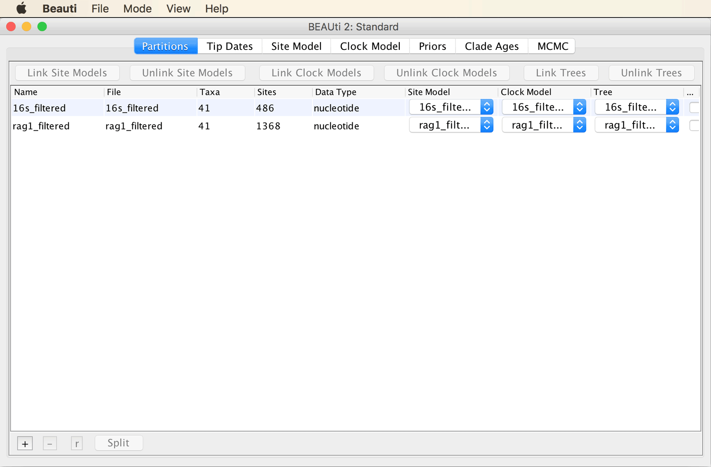

* Note that the BEAUti interface has six different tabs, of which (at the top of the window), the first one named "Partitions" is currently selected. We will browse through the other tabs later, but first need to specify settings regarding the partitioning in the currently open tab. Click on the row for the rag1 alignment to select it. Then, click the "Split" button at the bottom of the BEAUti window. As suggested, split the alignment into partitions "1 + 2 + 3", which will divide the alignment by codon position, and thus implement the partitioning scheme suggest by PAUP\* in tutorial [Substitution Model Selection](../substitution_model_selection/README.md). Click "OK". You should now see four rows in the "Partitions" tab of BEAUti, one for 16s and three for rag1, and each of the rag1 alignments should have a length of 456 sites:
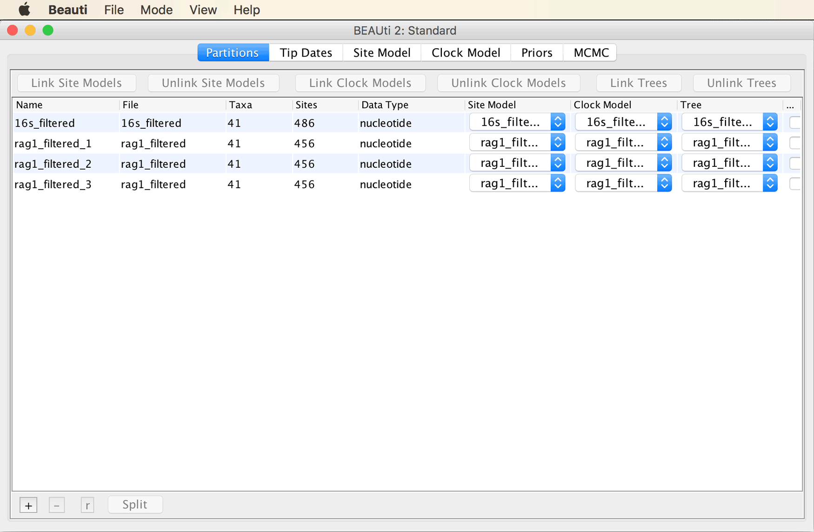

* Select all four rows at the same time and click on "Link Trees" near the top of the BEAUti window. This will force BEAST2 to use the same phylogeny for all partitions, which is equivalent to concatenating the sequences as we did for maximum-likelihood analyses with RAxML in tutorial [Maximum-Likelihood Phylogenetic Inference](../ml_phylogeny_inference/README.md). As explained in that tutorial the practice of concatenation may lead to bias in the phylogenetic inference, particularly if young and rapidly-diverging groups of taxa are investigated. However, in this first introduction to phylogenetic inference with BEAST2, we will ignore this potential issue and assume that the true gene trees for 16s and rag1 are in fact identical to each other and to the species tree of the 41 teleost fish species. After clicking on "Link Trees", you should notice that all cells in the column to the right, under the heading "Tree" show the same value, "16s_filtered...", as in the screenshot below. This indicates that they now all share the same tree.
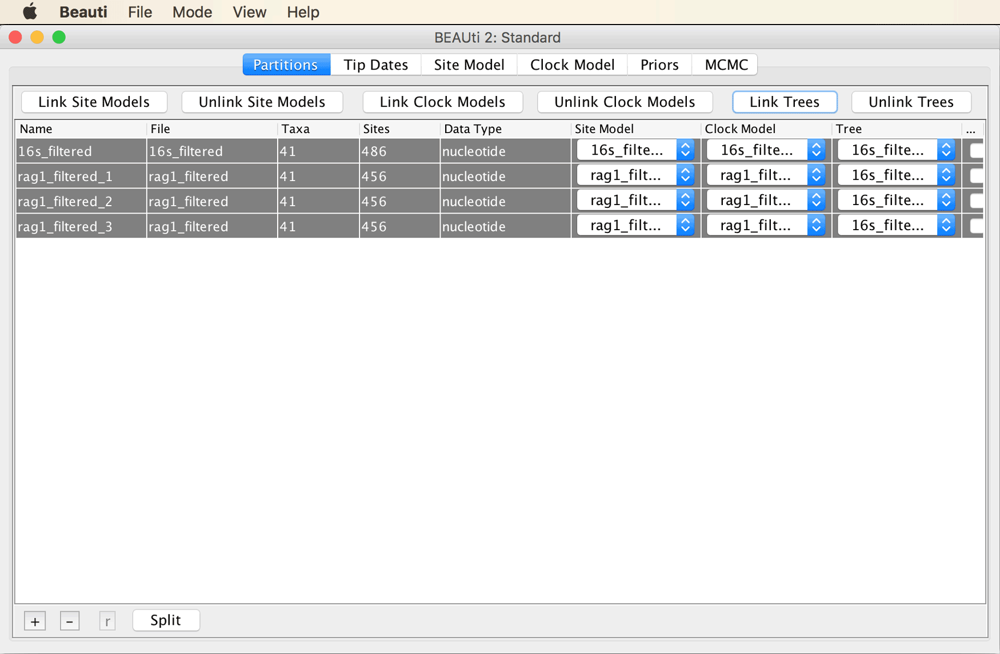

* With all four rows still selected, also click on "Link Clock Models". This means that the clock model that we will select for 16s will also apply to all partitions of the rag1 gene. With the relaxed clock model that we will select, it means that some branches are allowed to evolve faster than other branches (= to have higher substitution rates than others), but that this variation in rates is not inferred separately for each gene. Thus, branches that are inferred to have a high rate in the 16s sequences will also receive a high rate for each of the rag1 partitions. Vice versa, a branch that is inferred to evolve comparatively slowly is assumed to evolve slowly both in 16s and in rag1. However, this branch will still be allowed to have a higher absolute rate in one partition compared to another partition because the branch rates specified by the clock model (one rate per branch) will still be multiplied by a partition-specific rate multiplier (so that in total we then have four rates per branch: one for each partition). A good justification for this linking of clock models is that in nature, the speed of the molecular clock often depends on factors that are species-specific, such as metabolism and generation time ([Moorjani et al. 2016](http://www.pnas.org/content/113/38/10607.long)). This means that a species with a short generation time will be expected to have a comparatively slow rate not only in one gene but in all its genes. After clicking on "Link Clock Models", the BEAUti window should look as shown in the screenshot below. Note that all cells in the column with heading "Clock Model" now have the value "16s_filtered...".
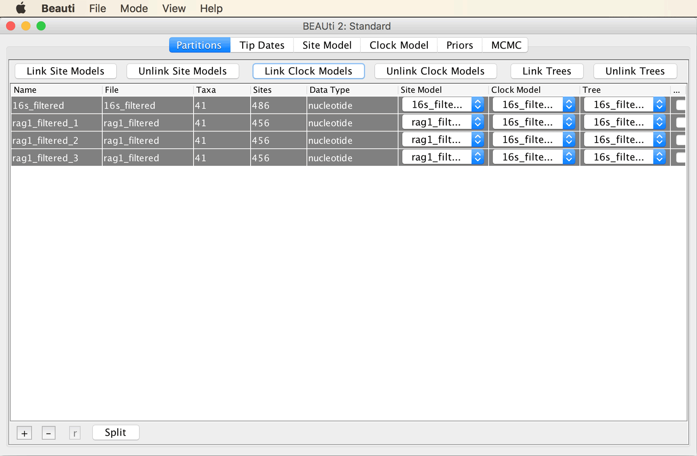

* The settings in the "Partitions" tab are now complete. Skip the next tab called "Tip Dates". This tab could be used to specify the times at which samples were taken, which allows time-calibration of viral phylogenies. But compared to the time scales over which the 41 fish sequences have diverged, the small difference in sampling times (a few years) is completely negligible, thus we can safely ignore these. Thus, click on the "Site Model" tab next. In this tab we can specify the substitution models for all four partitions. Select the 16s partition in the panel at the left and click on the drop-down menu that currently says "JC69". Instead of the Jukes-Cantor model, use the GTR model as suggested by the model selection that we did with PAUP\* in tutorial [Substitution Model Selection](../substitution_model_selection/README.md). Also specify "4" in the field for the "Gamma Category Count" two lines above, to use a gamma model of rate variation with four rate categories. This was also supported by the selection of substitution models in PAUP\*. Finally, set a tick in the checkbox to the right of "Substitution Rate" so that this rate will be estimated. The BEAUti window should then look as shown in the screenshot below.
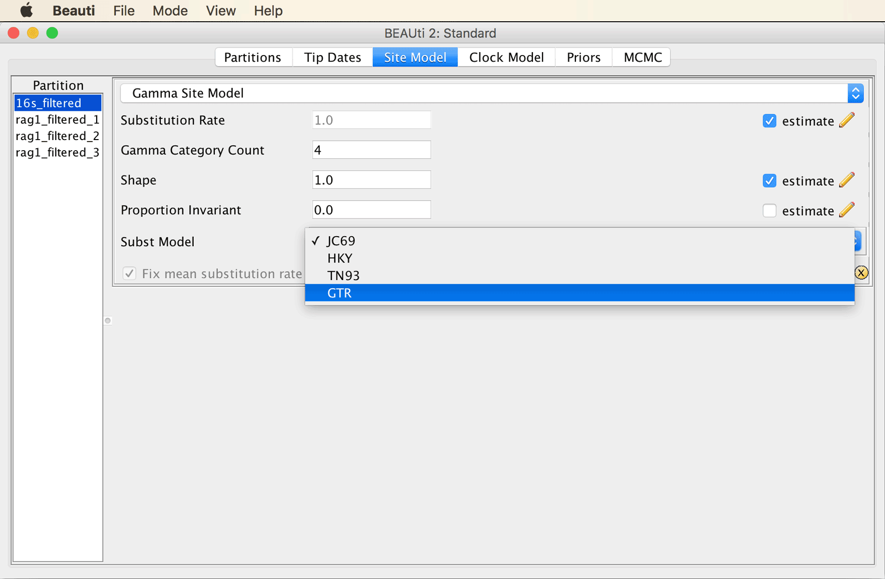

* Still in the "Site Model" tab, select all four partitions in the panel at the left of the window. The main part of the window should then show the option "Clone from 16s_filtered" as in the screenshot below. Click "OK" to use the same site model as for 16s for all rag1 partitions.
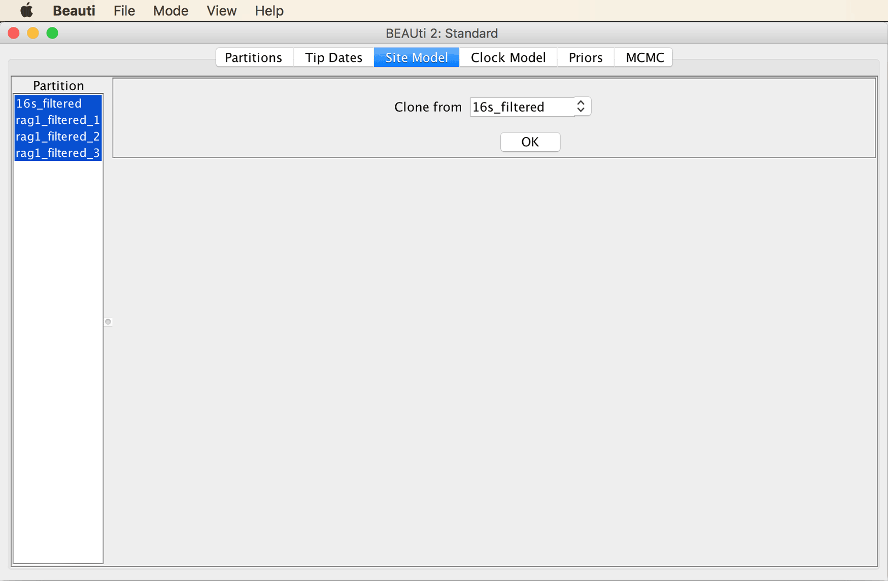

* Next, click on the "Clock Model" tab. From the drop-down menu that currently says "Strict Clock", choose "Relaxed Clock Log Normal" instead. This is the most commonly used relaxed clock model in which substitution rates of individual branches are drawn from a lognormal distribution. Also set a tick in the checkbox on the right side of the window. If this checkbox appears gray and you are unable to set it, you'll need to click on "Automatic set clock rate" in BEAUti's "Mode" menu. The mean and standard deviation of this lognormal distribution will be estimated as part of the MCMC search. The model is described in [Drummond et al. (2006)](http://journals.plos.org/plosbiology/article?id=10.1371/journal.pbio.0040088), there it is named the "UCLN" model. Ignore the additional options ("Number of Discrete Rates" etc.) that appear after selecting the model.
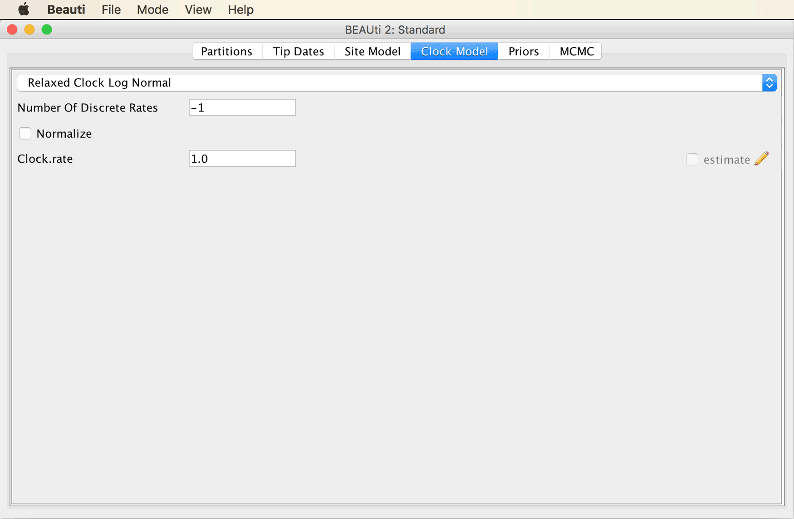

* Click on the "Priors" tab. From the drop-down menu at the very top of the window, select "Birth Death Model" instead of "Yule Model". By doing so we add a parameter to the model for the extinction rate. If we would choose the alternative Yule model ([Yule 1925](http://rstb.royalsocietypublishing.org/content/213/402-410/21?intcmp=trendmd)), we would assume that no extinction ever occurred in the history of teleost fishes. As this seems rather unrealistic, the birth-death model ([Gernhard 2008](https://www.sciencedirect.com/science/article/pii/S0022519308001811)) is in most cases the more appropriate choice. Nevertheless, results are in practice rather little affected by the choice of this prior.
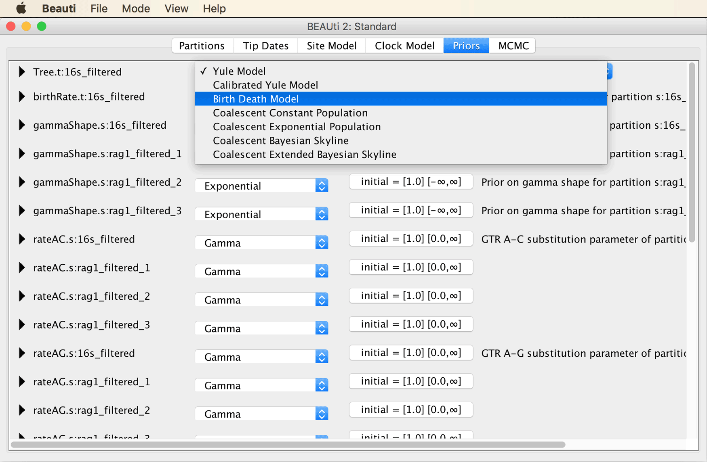

* Most of the other items shown in the "Prior" panel correspond to prior densities placed on the parameters of the substitution models for the four partitions. You may keep the default priors for each of these parameters. However, to allow time calibration of the phylogeny, a prior density still needs to be specified for at least one divergence time, otherwise BEAST2 would have very little information (only from the priors on speciation and mutation rates) to estimate branch lengths according to an absolute time scale. But before prior densities can be placed on the divergence of certain clades, these clades must first be defined. This can be done at the bottom of the "Priors" tab. Thus, scroll down to the end of the list until you see the "+ Add Prior" button, as shown in the below screenshot.
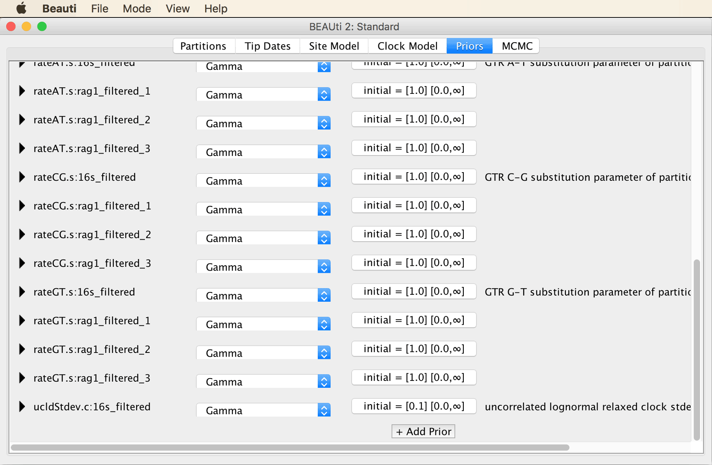

* Click on the "+ Add Prior" button to open the "Taxon set editor" pop-up window. Select all taxa from the list on the left of that window, and click the double-right-arrow symbol (`>>`) to shift them to the right side of the window. Then, click on the ID for zebrafish ("Danioxxrerioxx") to shift it back to the left with the double-left-arrow symbol (`<<`). This way, the ingroup, including all taxa except zebrafish is defined as a clade, so that the divergence of this clade can later be used for time calibration. The clade currently selected corresponds to the taxonomic group of "Euteleosteomorpha" ([Betancur-R. et al. 2017](https://bmcevolbiol.biomedcentral.com/articles/10.1186/s12862-017-0958-3)), thus, enter this name at the top of the pop-up window as the "Taxon set label", as shown in the below screenshot. Then, click "OK".
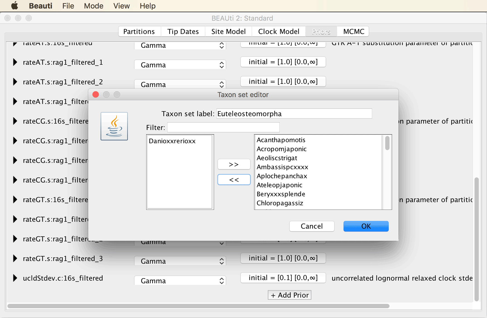

* For now, we will simply constrain this divergence between "Euteleosteomorpha" and zebrafish according to the results of a previous publication rather than placing several constraints according to the fossil record of teleost fishes. In [Betancur-R. et al. (2013)](http://currents.plos.org/treeoflife/article/the-tree-of-life-and-a-new-classification-of-bony-fishes/), the divergence of Euteleosteomorpha and Otomorpha was estimated to have occurred around 250 million years ago (Ma), thus, we will here place a prior density centered on that time on the same divergence. To time calibrate this divergence, click on the drop-down menu to the right of the button for "Euteleosteomorpha.prior" that currently says "[none]", and select "Log Normal" as shown in the next screenshot.
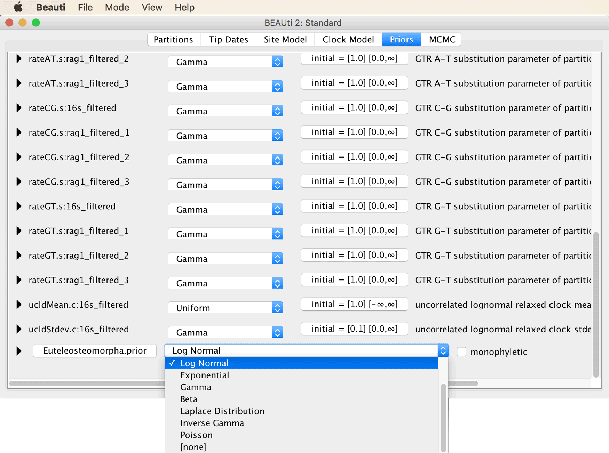

* Then, click on the black triangle to the left of the button for "Euteleosteomorpha.prior". Specify "10.0" as the value for "M" (that is the mean of the prior density) and "0.5" as the value for "S" (that is the standard deviation). Importantly, set a tick in the checkbox for "Mean in Real Space", otherwise the specified value for the mean will be considered to be in log space (meaning that its exponent would be used). Next, specify "240" as the offset”. In the plot to the right, you should then see that the density is centered around 250, with a hard minimum boundary at 240 and a "soft" maximum boundary (a tail of decreasing probability). Make sure to activate the checkbox for "Use Originate" a bit further below to specify that the divergence time of this clade from this sister clade should be constrained, not the time when the lineages within this clade began to diverge. Finally, also set a tick in the checkbox for "monophyletic" to the right of the drop-down menu in which "Log Normal" is now selected. By doing so, we constrain the specified ingroup clade of "Euteleosteomorpha" to be monophyletic. The BEAUti window should then look as shown in the below screenshot.
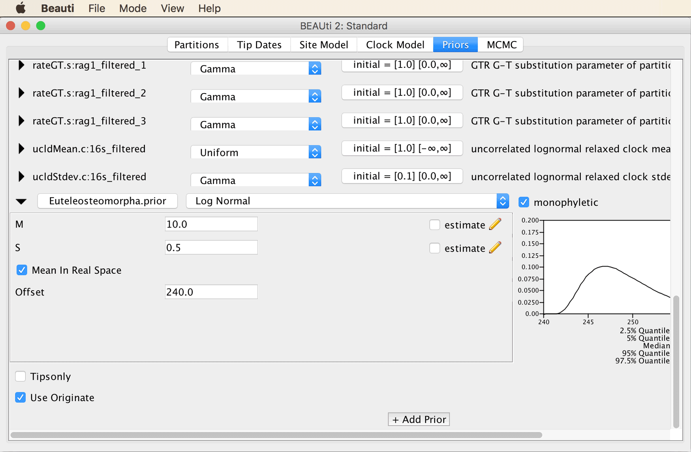

* Also constrain the monophyly of other clades that were found to be well-supported in the maximum-likelihood phylogenetic inference of the concatenated alignment (see tutorial [Maximum-Likelihood Phylogenetic Inference](../ml_phylogeny_inference/README.md)). This will limit the parameter space that BEAST2 will have to search, and thus it will speed up the Bayesian analysis. In addition to Euteleosteomorpha, constrain the following clades:

	* "Neoteleostei": Select all taxa, then exclude "Danioxxrerioxx" and "Oncorhyketaxxx" again.
	* "Acanthopterygii": Select all taxa, then exclude "Ateleopjaponic", "Chloropagassiz", "Danioxxrerioxx", "Muraenomarmora", "Oncorhyketaxxx", "Percopstransmo", "Polymixjaponic", and "Zeusxxxfaberxx".
	* "Eupercaria": Include "Acanthapomotis", "Acropomjaponic", "Gasteroaculeat", "Niphonxspinosu", "Percalanovemac", "Percichtruchax", "Tautogoadspers", "Triacananomalu", and "Zancluscornutu".
	* "Perciformes": Include "Gasteroaculeat" and "Niphonxspinosu".
	* "Ovalentaria": Include "Ambassispcxxxx", "Aplochepanchax", "Cichlaxtemensi", "Ectodusdescamp", "Etroplumaculat", "Geophagbrasili", "Herichtcyanogu", "Maylandzebraxx", "Monocirpolyaca", "Mugilxxcephalu", "Neolampbrichar", "Opistogaurifro", "Oreochrnilotic", "Oryziaslatipes", "Paratilpolleni", "Paretromaculat", "Ptychocgrandid", "Pundaminyerere", and "Tylochrpolylep".
	* "Cichlidae": Include "Cichlaxtemensi", "Ectodusdescamp", "Etroplumaculat", "Geophagbrasili", "Herichtcyanogu", "Maylandzebraxx", "Neolampbrichar", "Oreochrnilotic", "Paratilpolleni", "Paretromaculat", "Ptychocgrandid", "Pundaminyerere", and "Tylochrpolylep".
	* "Etroplinae": Include "Etroplumaculat" and "Paretromaculat".
	* "Ptychochrominae": Include "Paratilpolleni" and "Ptychocgrandid".
	* "Cichlinae" (Neotropical cichlids): Include "Cichlaxtemensi", "Geophagbrasili", and "Herichtcyanogu".
	* "Pseudocrenilabrinae" (African cichlids): Include "Ectodusdescamp", "Maylandzebraxx", "Neolampbrichar", "Oreochrnilotic", "Pundaminyerere", and "Tylochrpolylep".
	* "Pseudocrenilabrinae+Cichlinae": Include "Cichlaxtemensi", "Ectodusdescamp", "Geophagbrasili", "Herichtcyanogu", "Maylandzebraxx", "Neolampbrichar", "Oreochrnilotic", "Pundaminyerere", and "Tylochrpolylep".
		
	Specify that all of these clades should be monophyletic, using the checkbox at the right of the row corresponding to each clade. The bottom part of the list in the "Prior" tab should then look as in the below screenshot.
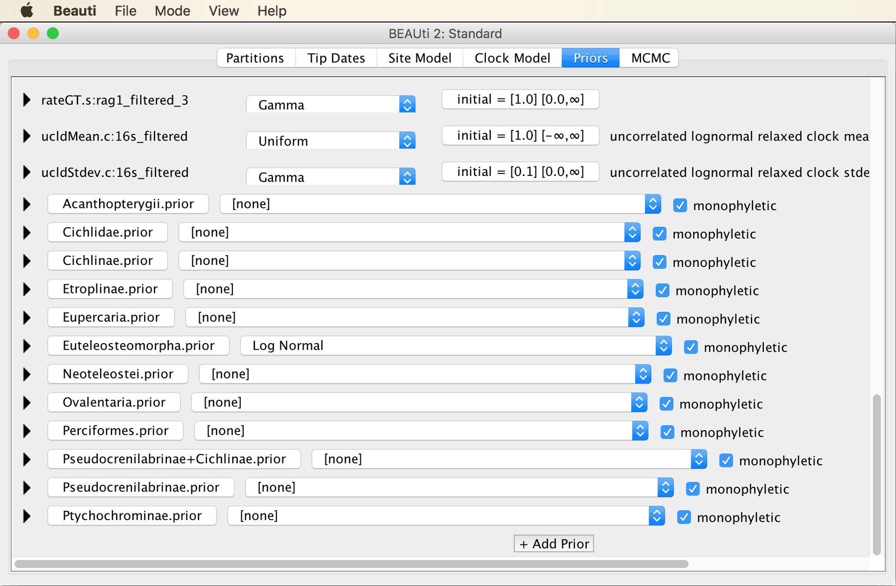

		
* Continue to the "MCMC" tab, where you can specify the run length. This analysis will require a few hundred million iterations before the MCMC chain reaches full stationarity, which would take several days of run time. As you may not want to wait that long before you continue the tutorial, I recommend that you use a chain length of 100 million states and either run the analysis overnight or that you cancel the run after following it for some time, and then use output files from my analysis (you'll find the links below) for the rest of the tutorial. Either way, type "100000000" in the field to the right of "Chain Length". 
Also change the names of the output files: Click on the triangle to the left of "tracelog" and specify "combined.log" as the name of the log file. In the next field for "Log Every", set the number to "10000" (instead of the default 1,000) so that only every 10,000th MCMC state is written to the log file. Click on the triangle again, then click on the black triangle to the left of "treelog". Specify "combined.trees" as the name of the tree file and again use "10000" as the number in the field for "Log Every". When the window looks as in the below screenshot, click on "Save" in BEAUti's "File" menu, and name the resulting file in XML format `combined.xml`.
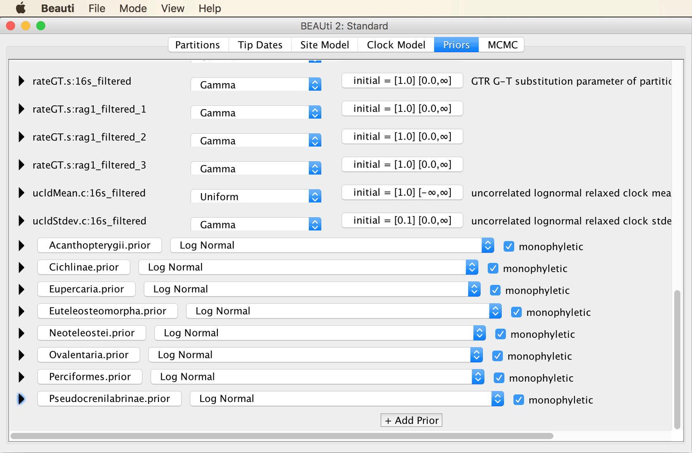

* Now, open the program BEAST2 and select the file [`combined.xml`](res/combined.xml) as input file, as shown in the screenshot below. When you click the "Run" button, BEAST2 will start the analysis.
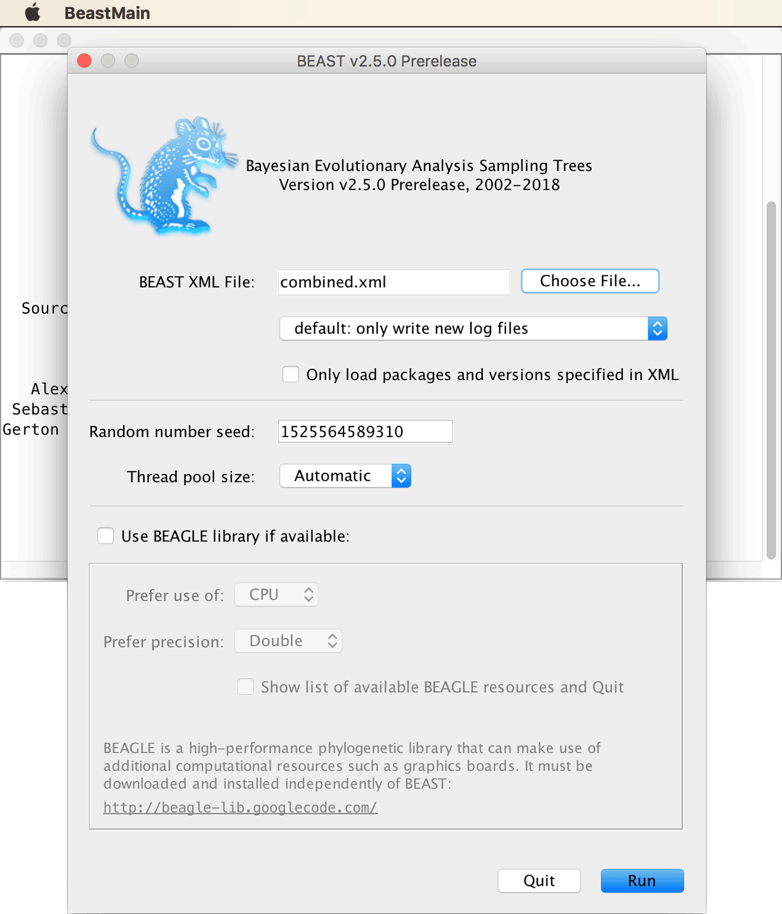
While BEAST2 is running, you may continue with the next part of this tutorial. The results of this analysis and of the analysis described below will be investigated and compared after both analyses have completed.

## Automatic substitution model selection with BEAST2

In the above phylogenetic inference, we assumed that the GTR substitution model with gamma-distributed rate variation would provide the best fit to the sequence data, as suggested by the model selection done with PAUP\* in tutorial [Substitution Model Selection](../substitution_model_selection/README.md). While this substitution model in fact seemed to fit well to all partitions, it would be more convenient if we would not have to specify a substitution model at all *a priori*, and if during the Bayesian analysis, one could average over multiple substitution models according to their relative fit to the data. This is made possible by the new [bModelTest](https://github.com/BEAST2-Dev/bModelTest) ([Bouckaert and Drummond 2017](https://bmcevolbiol.biomedcentral.com/articles/10.1186/s12862-017-0890-6)) add-on package for BEAST2, which we will use in this part of the tutorial. For further information, note that an excellent tutorial on the use of bModelTest is available at the [Taming the BEAST](https://taming-the-beast.org/tutorials/Substitution-model-averaging/) website.

* To install the bModelTest add-on package, open BEAUti once again and click on "Manage Packages" in BEAUti's "File" menu, as shown in the next screenshot.
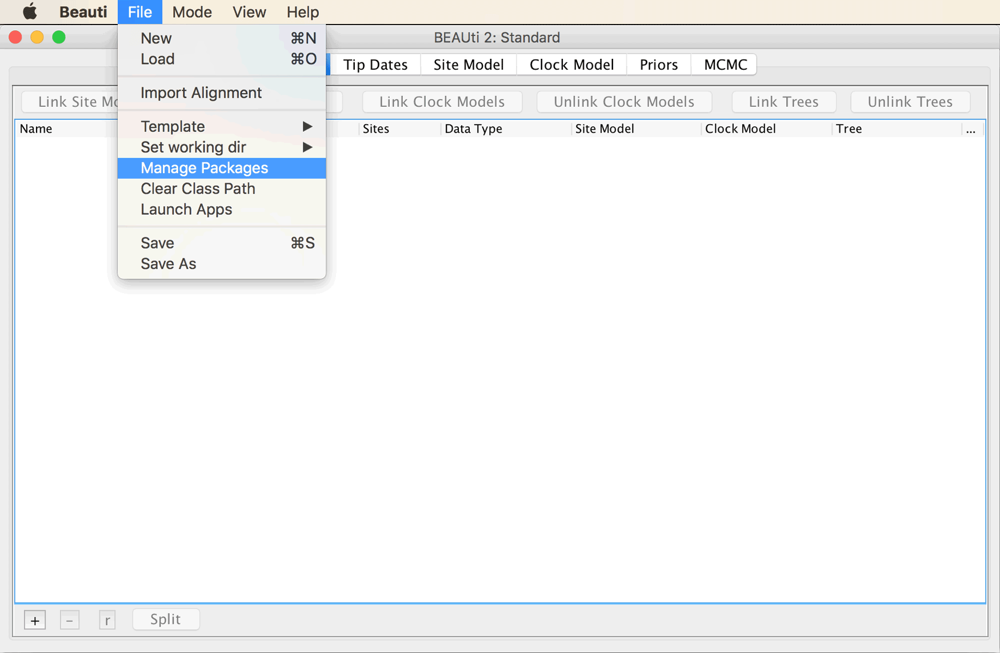

* This will open the BEAST2 Package Manager as shown in the next screenshot. Select "bModelTest" and click on "Install/Upgrade".
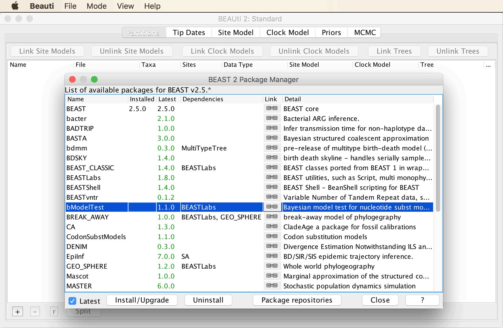

* You will see a notice that any changes will only take effect after you restart BEAUti, thus, do so.

* Then, click "Load" in BEAUti's "File" menu to reload the file [`combined.xml`](res/combined.xml) that you generated in the first part of this tutorial.
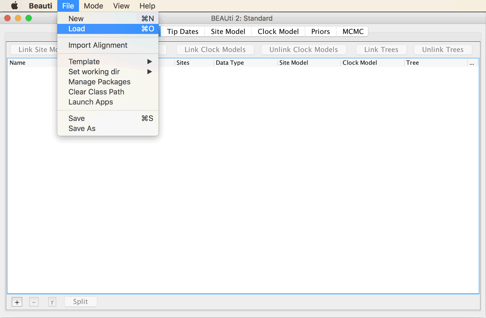

* Go straight to the "Site Model" tab once the data and settings from file `combined.xml` are loaded. There, click on the drop-down menu at the top of the window, where currently "Gamma Site Model" is selected. You'll see that a second option, the "BEAST Model Test" is now available in this drop-down menu, as shown in the screenshot below.
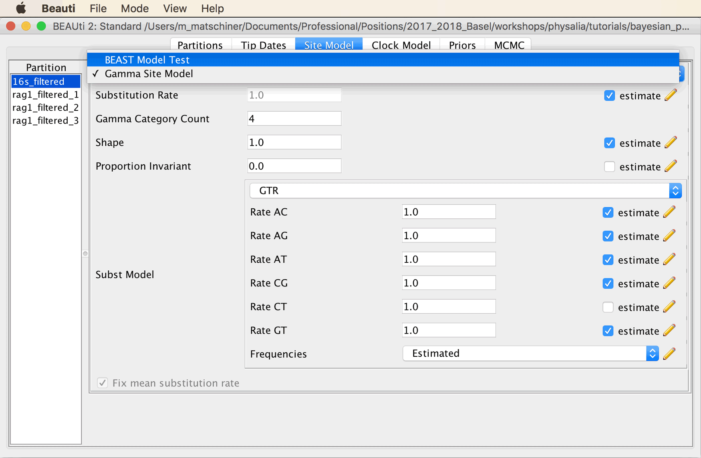

* Click on "BEAST Model Test" to select this model. The drop-down menu of which currently "transitionsTransversionsSplit" is selected allows to specify a set of substitution models that should be considered in the analysis. Which models are included in each set is shown in Fig. 1 of [Bouckaert and Drummond (2017)](https://bmcevolbiol.biomedcentral.com/articles/10.1186/s12862-017-0890-6). In most cases it should be more than sufficient to use a smaller set of models, such as the "namedExtended" set that includes nine different models (and their derivations with or without estimated nucleotide frequencies; see Fig. 1c of [Bouckaert and Drummond (2017)](https://bmcevolbiol.biomedcentral.com/articles/10.1186/s12862-017-0890-6)). Thus, select "namedSelected" from this drop-down menu. Leave the checkbox next to "Empirical" unticked to allow estimation of nucleotide frequencies. Then, again set the tick to the right of "Mutation Rate" to specify that this rate should be estimated. The window should then look as in the next screenshot.
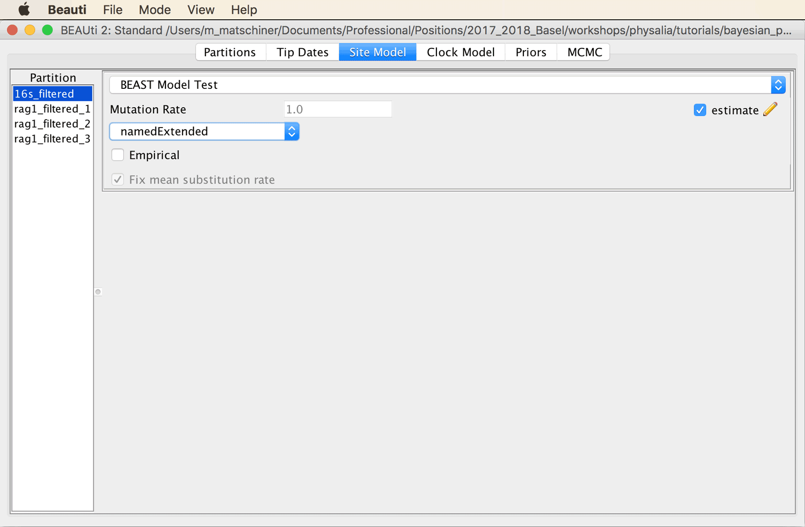

* As before, select all four partitions in the panel at the left of the window, and click "OK" to clone the settings from the first partition to all other partitions, as shown in the next screenshot.
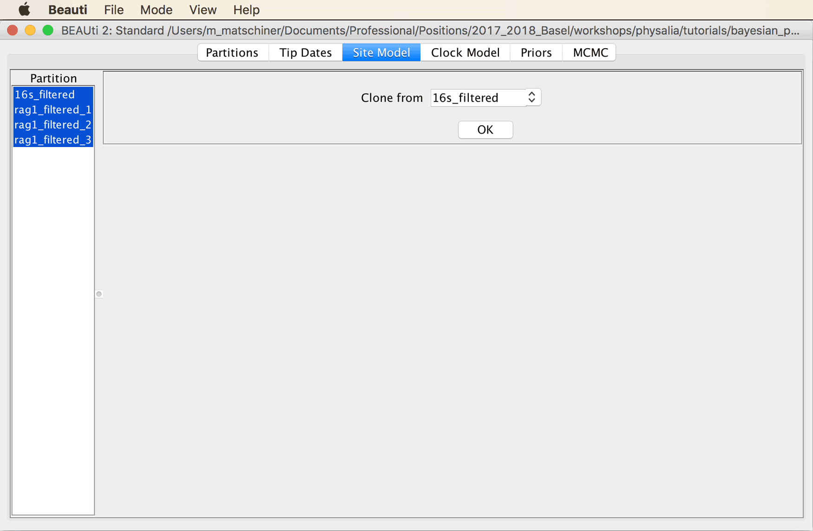

* Leave all settings in the "Clock Model" and "Priors" tabs unchanged, and go to the "MCMC" tab, where the output file names should be changed to avoid overwriting the output of the previous BEAST2 analysis. Click on the black triangle to the left of "tracelog" and specify "combined\_bmodeltest.log" as the name of the log output file. Then, click on the triangle next to "treelog" and specify "combined\_bmodeltest.trees" as the name of the tree file. Finally, click "Save As" in BEAUti's "File" menu and save the analysis settings to a new file named `combined_bmodeltest.xml`.

* To run BEAST2 with the file [`combined_bmodeltest.xml`](res/combined_bmodeltest.xml), we may now not be able to do so with the GUI version of BEAST2 because the analysis of file `combined.xml` may still be running. If this is the case, we can run BEAST2 on the command-line instead, because the BEAST2 package that you downloaded also includes scripts to do so. Find out the path to your BEAST2 program package (on Mac OS X, this is usually `/Applications/BEAST\ 2.5.0/bin/` but you may have placed the package elsewhere). To familiarize yourself with the command-line options of BEAST2, type either

		/Applications/BEAST\ 2.5.0/bin/beast -help
		
	or
	
		export JAVA_HOME=/Applications/BEAST\ 2.5.0/jre1.8.0_161
		/Applications/BEAST\ 2.5.0/jre1.8.0_161/bin/java -jar /Applications/BEAST\ 2.5.0/lib/beast.jar -help
		
	(assuming that your BEAST2 package is in that location; if not, just change the path).
	If this works, then run BEAST2 on the command line with file [`combined_bmodeltest.xml`](res/combined_bmodeltest.xml):
	
		/Applications/BEAST\ 2.5.0/bin/beast combined_bmodeltest.xml
		
	or
	
		/Applications/BEAST\ 2.5.0/jre1.8.0_161/bin/java -jar /Applications/BEAST\ 2.5.0/lib/beast.jar combined_bmodeltest.xml
		
* While the two versions of BEAST2 are running with the files `combined.xml` (the GUI version) and `combined_bmodeltest.xml` (the command-line version), have a look at the screen output produced by both analyses. **Question 1:** How long does each analysis require per one million MCMC iterations? Is one of them faster? [(see answer)](#q1) If you don't want to wait for the analyses to finish, you may continue this tutorial with the output files of my analysis: The files [`combined.log`](res/combined.log) and [`combined.trees`](res/combined.trees) are the log and tree files resulting from the analysis of file `combined.xml`, and the files [`combined.log`](res/combined.log) and [`combined.trees`](res/combined.trees) are the output of the analysis with file [`combined_bmodeltest.xml`](res/`combined_bmodeltest.xml`).

## Assessing MCMC stationarity with Tracer

In Bayesian analyses with the software BEAST2, it is rarely possible to tell *a priori* how many MCMC iterations will be required before the analysis can be considered complete. Instead, whether or not an analysis is complete is usually decided based on the inspection of the log file once BEAST2 has performed the specified number of MCMC iterations. There are various ways in which MCMC output can be used to assess whether or not an analysis can be considered complete, and in the context of phylogenetic analyses with BEAST2, the most commonly used diagnostic tools are those implemented in [Tracer](http://tree.bio.ed.ac.uk/software/tracer/) ([Rambaut et al. 2018](https://academic.oup.com/sysbio/advance-article/doi/10.1093/sysbio/syy032/4989127)) or the R package [coda](https://cran.r-project.org/web/packages/coda/index.html) ([Plummer et al. 2006](https://cran.r-project.org/doc/Rnews/Rnews_2006-1.pdf#page=7)). Here, we are going to investigate run completeness with Tracer. Ideally, we should have conducted the same BEAST2 analysis multiple times, then we could assess whether the replicate MCMC chains "converge" to the same posterior distribution, which would be a requirement for a complete MCMC analysis. However, given that we only conducted a single replicate of each of the two MCMC analyses (one with file `combined.xml` and one with file `combined_bmodeltest.xml`), we are limited to assessing the "stationarity" of the two chains. The easiest ways to do this in Tracer are:

1. Calculation of "effective sample sizes" (ESS). Because consecutive MCMC iterations are always highly correlated, the number of effectively independent samples obtained for each parameter is generally much lower than the total number of sampled states. Calculating ESS values for each parameter is a way to assess the number of independent samples that would be equivalent to the much larger number of auto-correlated samples drawn for these parameters. These ESS values are automatically calculated for each parameter by Tracer. As a rule of thumb, the ESS values of all model parameters, or at least of all parameters of interest, should be above 200.
2. Visual investigation of trace plots. The traces of all parameter estimates, or at least of those parameters with low ESS values should be visually inspected to assess MCMC stationarity. A good indicator of stationarity is when the trace plot has similarities to a "hairy caterpillar". While this comparison might sound odd, you'll understand its meaning when you see such a trace plot in Tracer.

Thus, both the calculation of ESS values as well as the visual inspection of trace plots should indicate stationarity of the MCMC chain; if this is not the case, the run should be resumed. For BEAST2 analyses, resuming a chain is possible with the "-resume" option when using BEAST2 on the command-line, or by selecting option "resume: appends log to existing files" in the drop-down menu at the top of the BEAST2 window when using the GUI version.

* After the two BEAST2 analyses have completed (or if you decided not to wait and use the output of my analysis instead), open file [`combined.log`](res/combined.log) in the program Tracer. The Tracer window should then look more or less as shown in the next screenshot
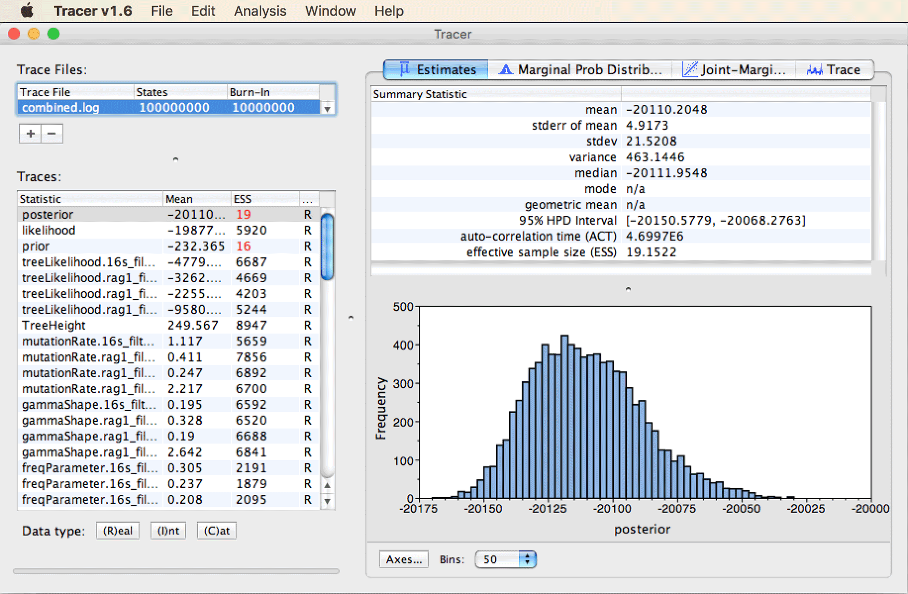
In the top left part of the Tracer window, you'll see a list of the loaded log files, which currently is just the single file [`combined.log`](res/combined.log). This part of the window also specifies the number of states found in this file, and the burn-in to be cut from the beginning of the MCMC chain. Cutting away a burn-in removes the initial period of the MCMC chain during which it may not have sampled from the true posterior distribution yet. 
In the bottom left part of the Tracer window, you'll see statistics for the estimate of the posterior probability (just named "posterior"), the likelihood, and the prior probability (just named "prior"), as well as for the parameters estimated during the analysis (except the phylogeny, which also represents a set of parameters). The second column in this part shows the mean estimates for each parameter and their ESS values. **Question 2:** Do the ESS values of all parameters indicate stationarity? [(see answer)](#q2) 
In the top right part of the Tracer window, you will see more detailed statistics for the parameter currently selected in the bottom left part of the window. Finally, in the bottom right, you will see a visualization of the samples taken during the MCMC search. By default these are shown in the form of a histogram as in the above screenshot.

* With the posterior probability still being selected in the list at the bottom left, click on the tab for "Trace" (at the very top right). You will see how the posterior probability changed over the course of the MCMC. This trace plot should ideally have the form of a "hairy caterpillar", but as you can see from the next screenshot, this is not the case for the posterior probability.
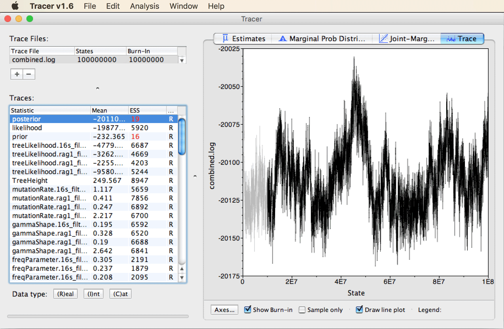

* Now, click on the prior probability in the list at the bottom left of the window. You'll note that the trace looks very similar to that of the posterior, which may not be surprising given that the posterior probability is a (normalized) product of the prior probability and the likelihood. Thus, the auto-correlation in the prior probability seems to drive the auto-correlation in the posterior probability. Another way to visualize this is to select both the posterior and the prior probability at the same time (you may have to shift-click to do so) and then click on the "Joint-Marginal" tab next to the "Trace" tab. You'll see once again that the two measures are strongly correlated as in the next screenshot.
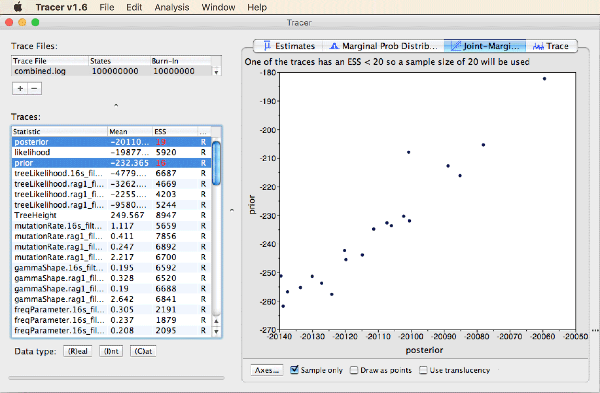

* Have a look at the list of ESS values in the bottom left again. **Question 3:** Besides the prior and posterior probabilities, which parameter has the lowest ESS value? [(see answer)](#q3) **Question 4:** Could this parameter be responsible for the auto-correlation in the prior and posterior probabilities? [(see answer)](#q4)

* Calculate the number of sites in the 16s alignment at which each pair of alleles co-occur, using the Ruby script [`count_substitutions.rb`](src/count_substitutions.rb):

		ruby count_substitutions.rb 16s_filtered.nex

	**Question 5:** Which types of substitutions appear to be particularly rare in the 16s alignment - do these correspond to the substitution rate parameters with particularly low ESS values? [(see answer)](#q5)

* Next, also open file [`combined_bmodeltest.log`](res/combined_bmodeltest.log) in Tracer. The trace plot for the posterior probability in this analysis with the bModelTest model should look much more like a "hairy caterpillar", as shown in the next screenshot.
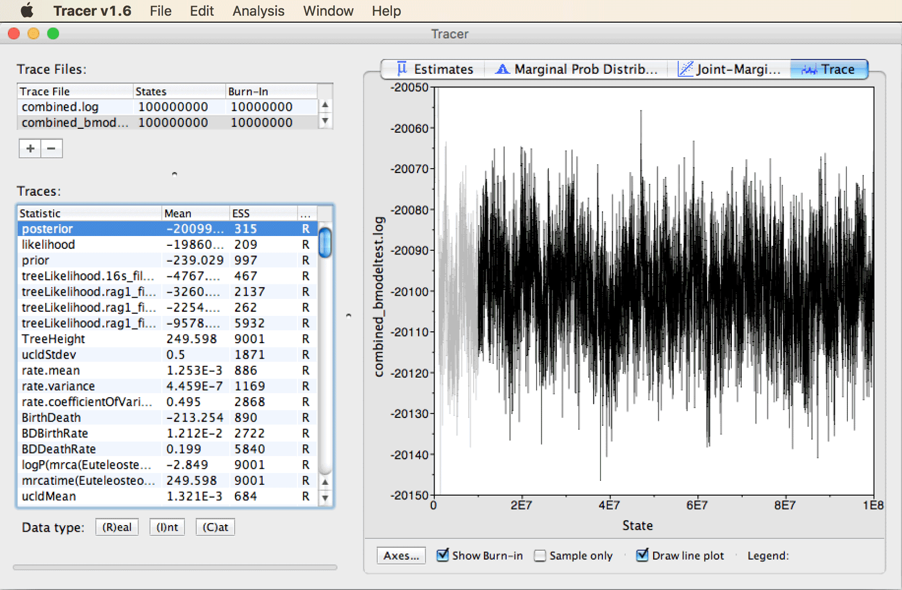
Nevertheless, some auto-correlation is apparent also in the above trace plot, indicating that this analysis, too, should be continued if it were to be used in a publication.

* Scroll down in the list of parameters at the bottom left of the window to see if any parameters still have low ESS values. You'll see that this is indeed the case for some parameters of the bModelTest model, as shown in the next screenshot.
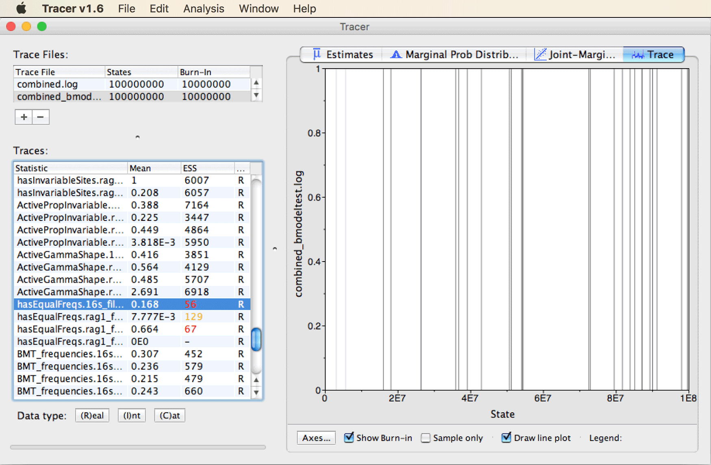
The parameters named "hasEqualFreqs..." shown in the above plot indicate if nucleotide frequencies should be estimated (then the parameter state is "0") or if they they should be assumed to be all equal (then the parameter state is "1"). Whenever during the MCMC analysis bModelTest switches between a model that includes estimation of nucleotide frequencies and a model that doesn't, these parameters switch from "1" to "0" or vice versa. I would argue that these parameters named "hasEqualFreqs..." as well as some other parameters of the bModelTest model are not directly of interest and that these should therefore be excepted from the rule that parameters should have ESS values above 200.

* To see which substitution models have been used in the analysis by bModelTest, we can use the BModelAnalyser App that comes with the bModelTest installation. It can be opened with the program AppLauncher that you should find in the same directory as BEAST2 and BEAUti. After double-clicking on the AppLauncher icon, you'll see the window shown below.
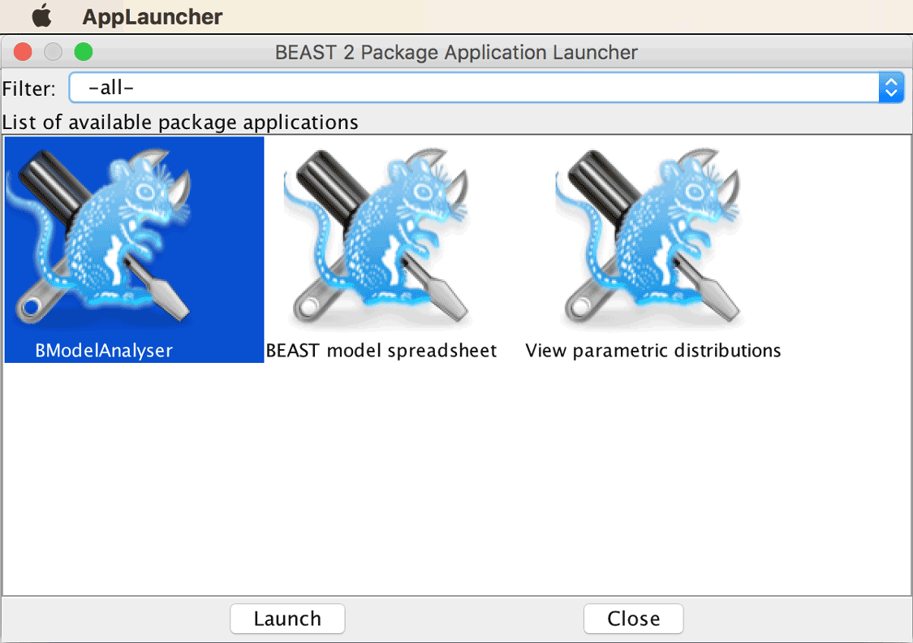

* Click "Launch". A second window will open where you can specify the log file of the BEAST2 analysis with the bModelTest model. Select file [`combined_bmodeltest.log`](res/combined_bmodeltest.log) as in the next screenshot. Also set the drop-down menu to the right of "Model Set" to "namedExtended", the model set used in our analysis.
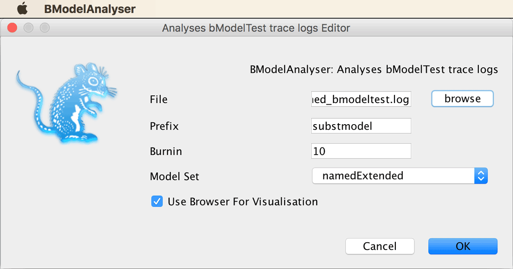

* Click "OK" to close the window. This will open an output window as shown in the below screenshot, which lists the relative frequency at which the different substitution models were used for each partition. The models are encoded with six numbers that indicate which of the six subsitution rates (in this order: A &rarr; C, A &rarr; G, A &rarr; T, C &rarr; G, C &rarr; T, G &rarr; T) are linked in this model. For example the GTR model in which all rates are unlinked is encoded by the numbers "123456", the HKY model in which all transitions and all transversions are linked is encoded by "121121", and the Jukes-Cantor model in which all rates are linked is encoded by "111111". Codes for other models are listed in the Supplementary Material of [Bouckaert and Drummond (2017)](https://bmcevolbiol.biomedcentral.com/articles/10.1186/s12862-017-0890-6). 
The output in the below screenshot lists two percentages for each model of each of the four partitions; the first of these indicates the frequency of this model and the second indicates the cumulative frequency of this and all models listed above it. **Question 6:** Which models are most frequently used for the four partitions? [(see answer)](#q6)
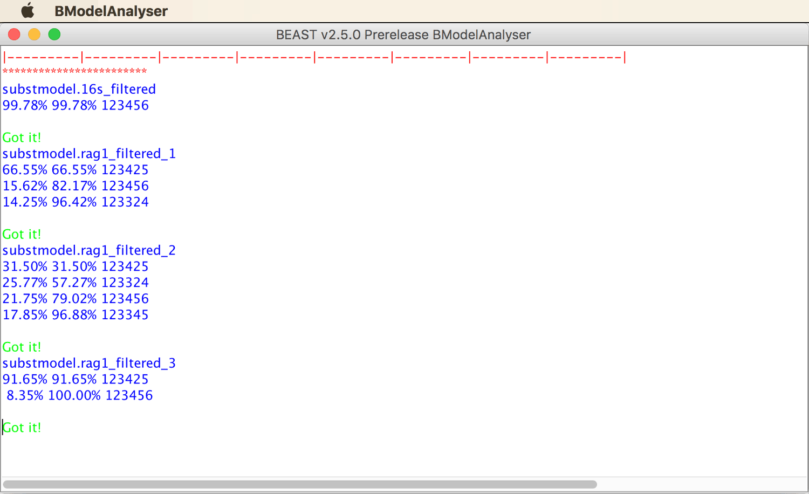
As you'll see, the BModelAnalyser App will also have opened four browser tabs with visualizations of these frequencies as well as the ways in which the different models are connected.

From the above comparison of the log files resulting from BEAST2 analyses with and without the bModelTest model, we have learned that the bModelTest model has led to a roughly acceptable degree of MCMC stationarity after 100 million iterations whereas the analysis without this model still appears to be far from stationary after the same number of iterations. Given that the bModelTest model also required hardly any more time per iteration, I generally recommend the use of the bModelTest model.

## Summarizing the posterior tree distribution

So far, we have only used the log files produced by the two BEAST2 analyses to assess run completeness, but we have not yet looked into the results that are usually of greater interest: The phylogenetic trees inferred by BEAST2. We will do so in this part of the tutorial.

* Open the tree file resulting from the analysis with the bModelTest model, file [`combined_bmodeltest.trees`](res/combined_bmodeltest.trees) in the FigTree. If you're not familiar with the software yet, you may want to have a look at tutorial [Maximum-Likelihood Phylogenetic Inference](../ml_phylogeny_inference/README.md) where the basic features of FigTree are explained. Once the tree file is opened (it might take a short while to load), the FigTree window should look more or less as shown in the next screenshot.
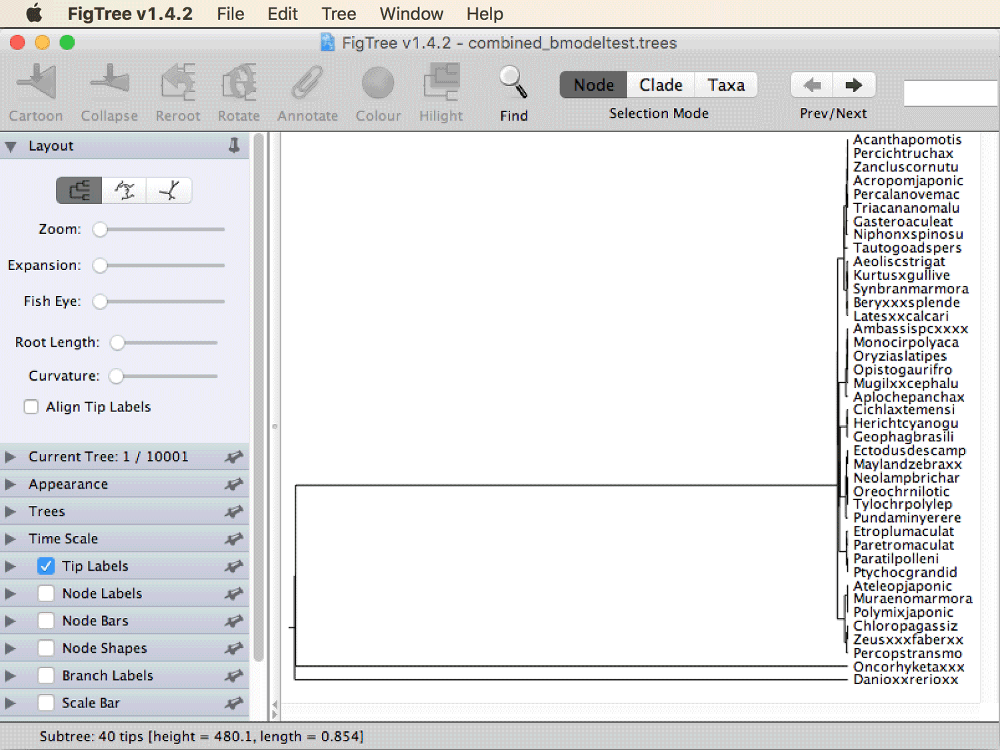
Note that in contrast to the trees shown in tutorial [Maximum-Likelihood Phylogenetic Inference](../ml_phylogeny_inference/README.md), this tree now is ultrametric, meaning that all tips are lined up and equally distant from the root. This is because the branch lengths in this tree represents time and all samples were taken (nearly) at the same time.

* Display node ages by clicking the triangle next to "Node Labels" in the panel on the left of the window. You'll see that the age of the root is over a hundred (that is in millions of years), while most other divergence are younger than 10, as in the next screenshot.
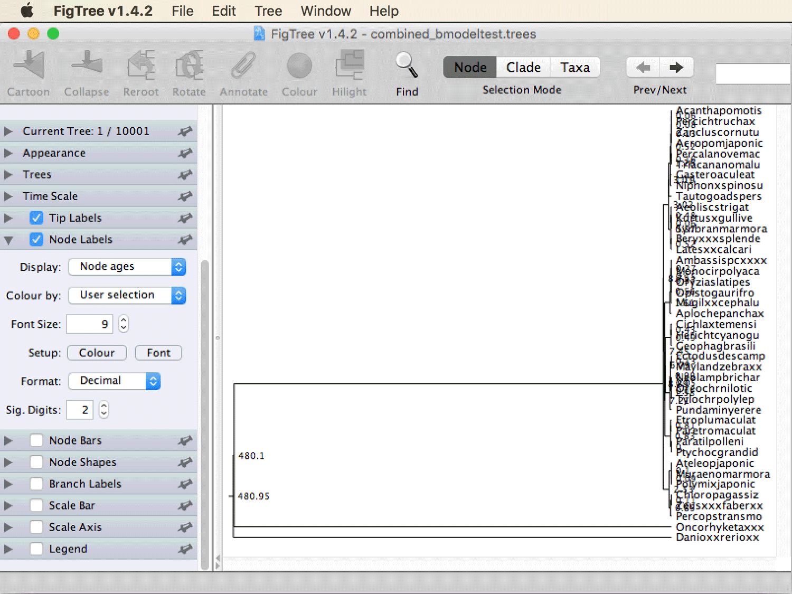
The reason why this phylogeny looks rather unexpected is that it is not the final tree estimate, but only the first phylogeny sampled during the MCMC analysis, and as you can see in the panel on the left (where it says "Current Tree: 1 / 10001"), there are several thousands of phylogenies in this file. This currently displayed phylogeny is in fact the starting tree that was randomly generated by BEAST 2 to initiate the MCMC chain. At the right of the top menu, you'll see two buttons for "Prev/Next". If you click on the symbol for "Next" repeatedly, you can see how the sampled phylogenies have changed troughout the course of the MCMC search (FigTree is a bit slow with this many trees in memory). As you can see, the root age quickly moves towards the age that we had specified in BEAUti, 250 million years. Instead of clicking on this icon for "Next" 10,000 times to see the last phylogeny, click on the triangle to the left of "Current Tree: X / 10001" in the menu at the left. This will open a field where you can directly enter the number of the tree that you'ld like to see. Type "10000" and hit enter. You should then see a phylogeny that looks much more realistic than the very first sampled phylogeny. But note that this is only the last sampled phylogeny, it may not be representative for the entire collection of phylogenies sampled during the MCMC; the "posterior tree distribution".

* To generate a more representative phylogeny summarizing the information from the posterior tree distribution, open the program TreeAnnotator that you downloaded as part of the BEAST2 package. You should see a window as shown below.
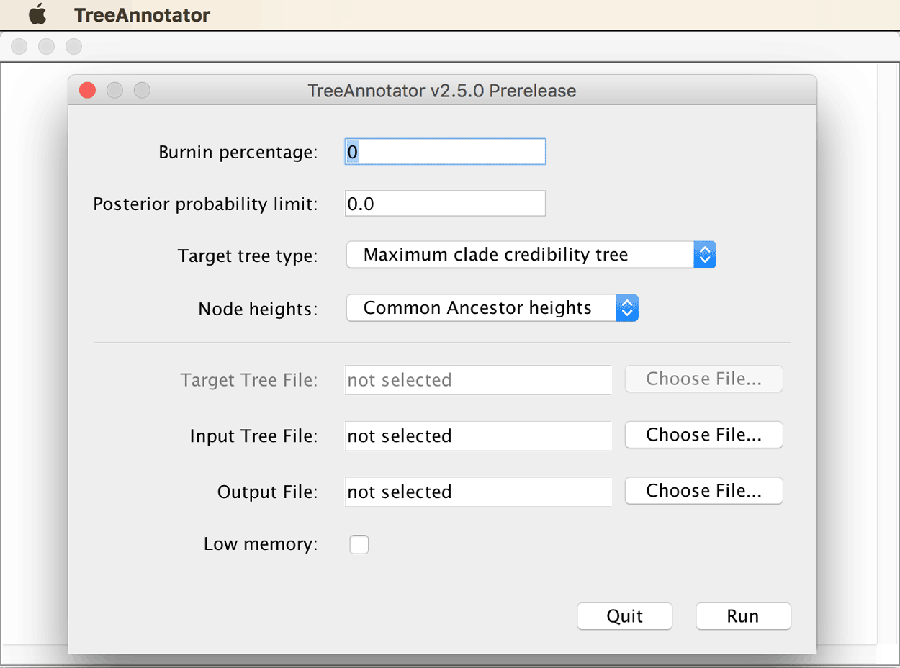

* Specify a burnin percentage of 10, in agreement with the trace plots that we inspected earlier in Tracer, which looked stationary after the first 10% of the chain. Leave the default options for "Posterior probability limit" and "Target tree type" to generate a "Maximum clade credibility tree" (this is the most commonly used type of summary tree for Bayesian analyses; described in [Heled and Bouckaert 2013](https://bmcevolbiol.biomedcentral.com/articles/10.1186/1471-2148-13-221)). However, as "Node heights", choose "Mean heights" rather than the default "Common Ancestor heights". As input file, select [`combined_bmodeltest.trees`](res/combined_bmodeltest.trees) and specify `combined_bmodeltest.tre` (note the different extension) as the output file. When the window looks as shown in the next screenshot, click "Run".
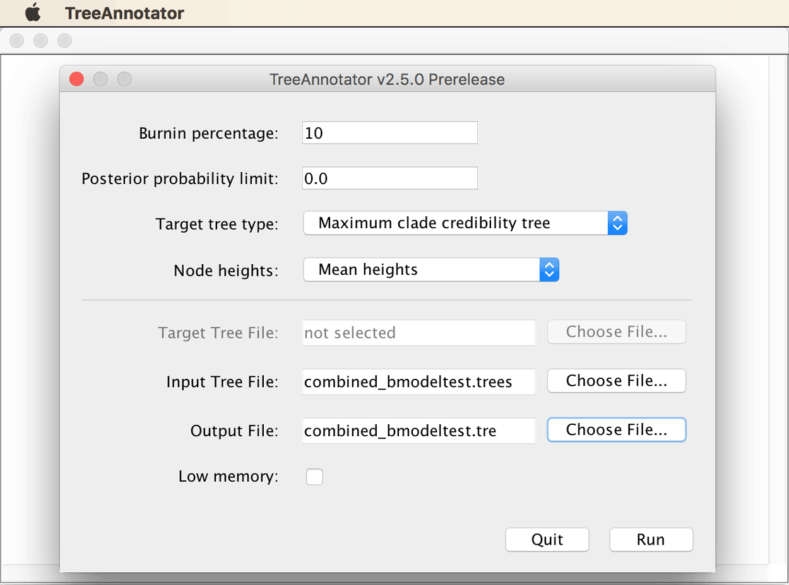

* When TreeAnnotator has finished (after a few seconds), close the program, and open the new file `combined_bmodeltest.tre` in FigTree. To see the support values for each node, set a tick next to "Node Labels" in the menu on the left, and click on the triangle next to it. Then choose "posterior" from the drop-down menu to the right of "Display". The posterior node support values represent our confidence that a given node is monophyletic, under the assumption that the employed model is correct. As shown in the next screenshot, not many clades are well-supported besides those that we constrained to be monophyletic (the constrained clades must have a node support of 1).
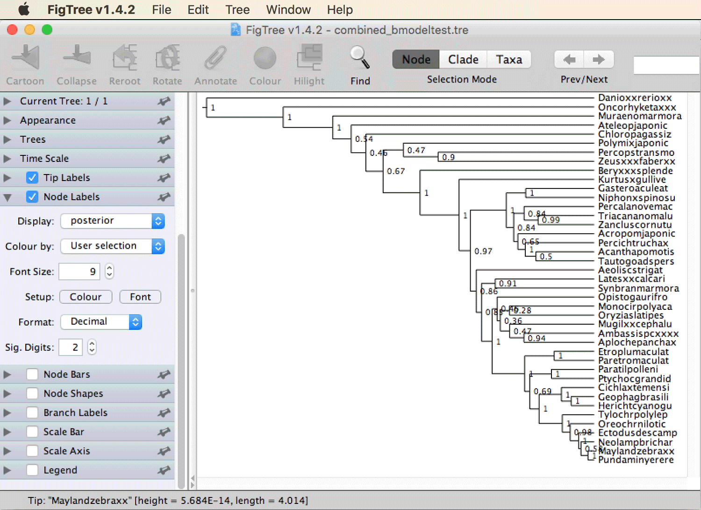

* To add a time scale to the phylogeny, set a tick next to "Scale Axis" in the menu on the left. Also click the triangle next to it, remove the tick next to "Show grid" in the newly opened menu field, but set a tick next to "Reverse axis" instead. The result is shown in the next screenshot.
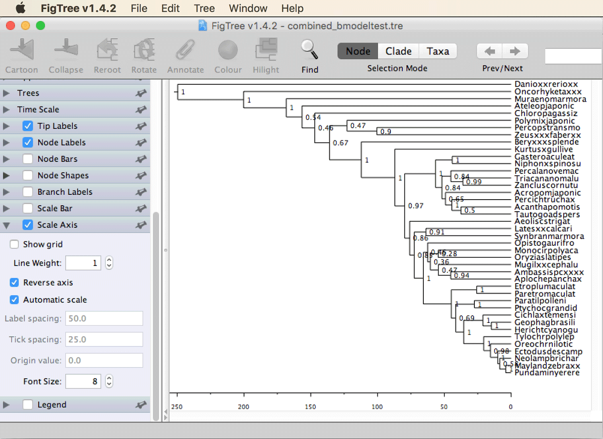

* To also see the confidence intervals for the age estimates, click on the triangle next to "Node Bars" in the menu on the left. Also set a tick in the checkbox for "Node Bars". Choose the first item from the drop-down menu for "Display", the "height_95%_HPD" ("HPD" = "highest posterior density"; this is the most common measure of the 95% confidence interval in a Bayesian analysis). You should then see blue bars on each node, these indicate the age range within which the node lies with 95% certainty. You should then see the phylogeny as shown below.
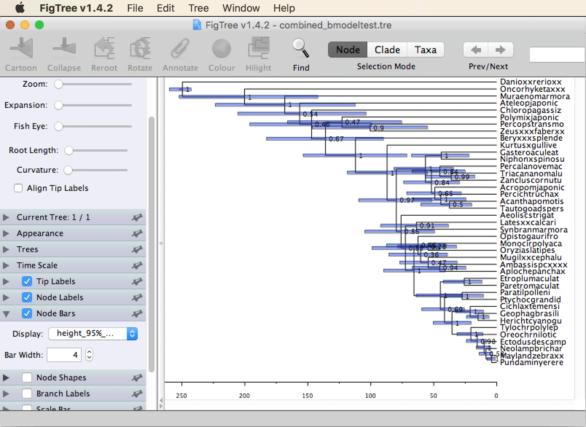

The timeline resulting from the BEAST2 analysis based on the 16s and rag1 alignments suggests that African and Neotrocial cichlid fishes diverged about 35 million years ago. However, the reliability of these estimates may be questioned, given that we used sequences of only two markers, and particularly because we calibrated the phylogeny with only a single constraint on the root node, which was taken from the results of another study rather than based on our own interpretation of the fossil record.
([Betancur-R. et al. 2013](http://currents.plos.org/treeoflife/article/the-tree-of-life-and-a-new-classification-of-bony-fishes/)).

 

                   

## Answers

* **Question 1:** The times required per one million iterations should be very comparable between the two analyses. On my machine, about 6 minutes are required in both cases, with the analysis of file `combined.xml` being slightly faster. Thus, to complete the 25 million iterations specified in both files, run times of about 2.5 hours are required.

* **Question 2:** The low ESS values for the posterior and the prior probabilities clearly show that the chain can not be considered stationary yet. Even though the posterior and the prior probabilities are not themselves parameters of the model, their ESS values should also be above 200 (or ideally much higher) before the analysis can be considered complete.

* **Question 3:** If you used the results of my analysis (file [`combined.log`](res/combined.log)) for plotting in Tracer, the parameter with the lowest ESS value is the rate of C &rarr; G substitutions (named "rateCG.16s\_filtered"), with an ESS of 113.

* **Question 4:** In my analysis (file [`combined.log`](res/combined.log)), the parameter for the rate of C &rarr; G substitutions in fact seems to influence the prior probability. This is suggested by the apparently coinciding shifts in both traces, as shown in the next two screenshots.
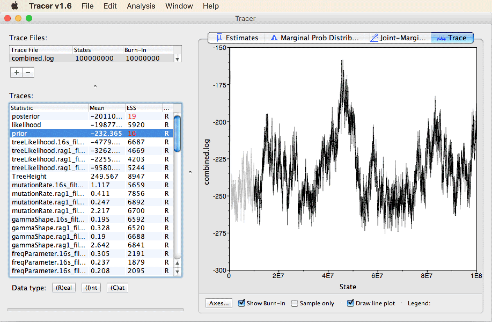

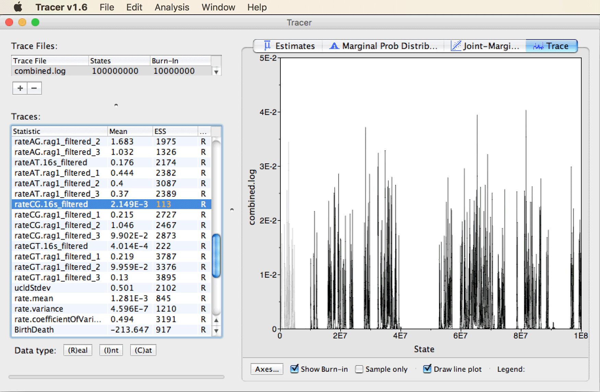
The correlation between the C &rarr; G rate parameter and the prior probability is also apparent when the two values are plotted against each other, as shown below. The prior probability is particularly high when the substitution rate is extremely close to zero.
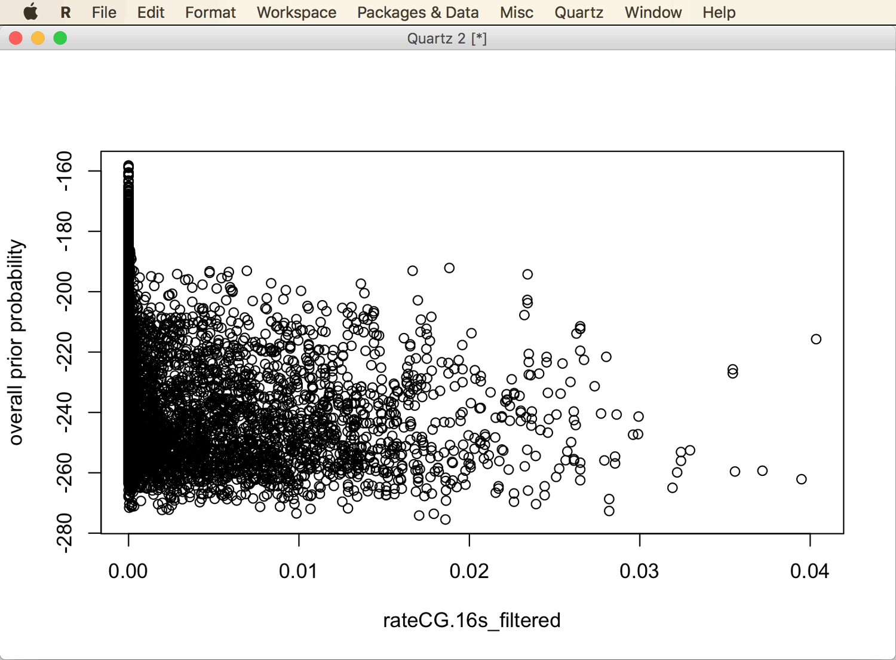
This strong effect of the C &rarr; G substitution rate parameter on the overall prior probability can be explained when we look at the prior-probability density that we had placed on this parameter (just like on other substitution rates; this is a default prior-probability density for all rates when using the GTR model in BEAST2): This prior-probability density is specified in file [`combined.xml`](res/combined.xm) as follows:

		<prior id="RateCGPrior.s:16s_filtered" name="distribution" x="@rateCG.s:16s_filtered">
			<Gamma id="Gamma.3" name="distr">
				<parameter id="RealParameter.11" estimate="false" name="alpha">0.05</parameter>
				<parameter id="RealParameter.12" estimate="false" name="beta">10.0</parameter>
			</Gamma>
		</prior>

	The above code specifies a gamma-distributed prior-probability density for the C &rarr; G substitution rate parameter, and the distribution parameters are alpha=0.05 and beta=10.0. The prior probability is therefore distributed as shown below:
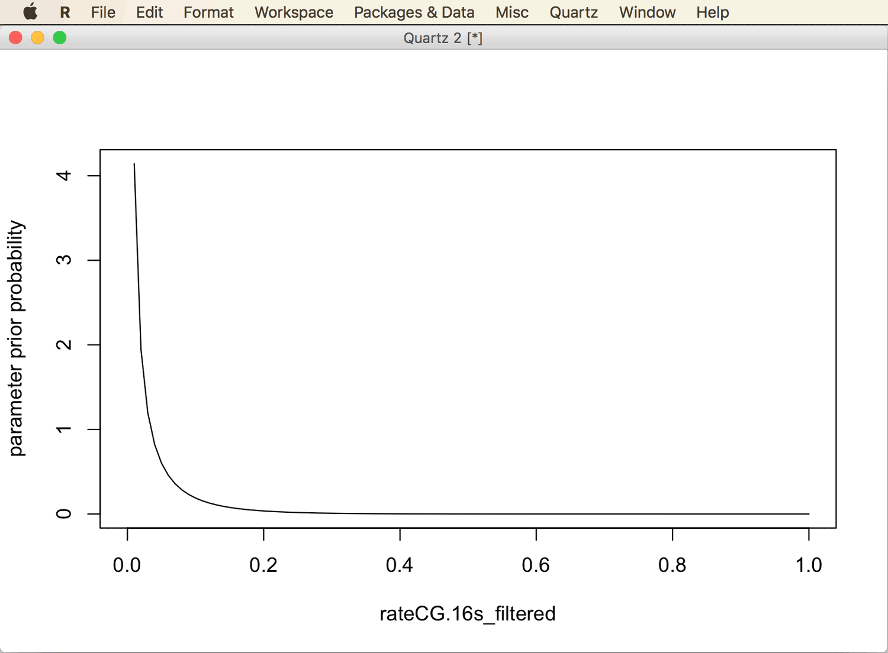
As shown in the above plot, the prior-probability density for the rate parameter grows towards infinity when the rate is very close to zero. This is fine as long as the sequence data supports a non-zero substitution rate strongly enough to pull the estimate away from zero. If one particular alignment partition, however, has very few substitutions of a particular type, the parameter estimate may be pulled towards zero by the increasing prior probability for this parameter, which then may have a strong influence on the overall prior probability.
	

* **Question 5:** The nucleotides C and G co-occur at only 41 sites in the 16s alignment and G and T co-occur at only 40 sites, thus the subsitution rates C &rarr; G and G &rarr; T are likely harder to estimate than those for other types of substitutions. This is the reason why the rate parameters for these two substitutions are estimated very close to zero, which in turn has a strong influence on the overall prior probability and causes the absence of stationarity in the MCMC analysis for file [`combined.xml`](res/combined.xml).

* **Question 6:** The GTR model is most frequently used (99.78%) for the 16s partition, and the TVM model in which all transversions are unlinked but the transversions A &rarr; G and C &rarr; T are linked is used most frequently for all three rag1 partitions (66.55%, 31.50%, and 91.65%). So even though the GTR model is used almost exclusively for the 16s partition, and thus the C &rarr; G and G &rarr; T substitution rates are again (as in the previous analysis without the bModelTest model) estimated individually, the analysis with the bModelTest model does not seem to run into the issues that led to strong auto-correlation in the previous analysis (see the [answer to Question 4](#q4)). A possible explanation for this is that the bModelTest model might internally use a different prior-probability density for substitution rates, instead of the gamma distribution using without the bModelTest model.