# Bayesian Species-Tree Inference

A tutorial on Bayesian inference of time-calibrated species trees

## Summary

Most approaches for species-tree inference based on the multi-species coalescent model use sets of gene trees as input and assume that these gene trees are known without error. Unfortunately, this is rarely the case and misleading estimates can result if gene trees are in fact incorrect due to poor phylogenetic signal or other reasons. This problem can be avoided when gene trees and species trees are co-estimated in one and the same analysis, and when this is done in a Bayesian framework. One of the most popular tools implementing this approach is StarBEAST2, which, as an add-on package for the software BEAST2, also has the advantage that it allows the estimation of accurate divergence times under the multi-species coalescent model.

## Table of contents

* [Outline](#outline)
* [Dataset](#dataset)
* [Requirements](#requirements)
* [Bayesian species-tree inference with StarBEAST2](#starbeast2)
* [Bayesian species-tree inference with concatenation](#concatenation)
* [Comparing species trees estimated with StarBEAST2 and concatenation](#comparison)

## Outline

In this tutorial, I am going to present how a time-calibrated species tree can be inferred from a set of alignments with the multi-species-coalescent model implemented in StarBEAST2 ([Ogilvie et al. 2017](https://academic.oup.com/mbe/article/34/8/2101/3738283)), an add-on package for the program BEAST2. For comparison, the species tree will also be inferred based on concatenation, and differences between the divergence times estimated with both approaches will be investigated and discussed.

## Dataset

As in tutorial [Maximum-Likelihood Species-Tree Inference](../ml_species_tree_inference/README.md), the dataset used here is the set of alignments for 72 genes produced in tutorial [Ortholog Detection](../ortholog_detection/README.md). This dataset includes sequences for eleven cichlid species, two of which represent Neotropical cichlids while the remaining nine species are from Africa. The focus of the taxon set is on cichlids of the rapid radiations in the East African lakes Tanganyika, Malawi, and Victoria. The table below lists all species included in the set of alignments. Note that the sequence data for *Ophthalmotilapia ventralis* were extracted from a transcriptome assembly whereas genome assemblies were available for all other species.

| ID     | Species                         | Tribe          | Distribution    |
|--------|---------------------------------|----------------|-----------------|
| ampcit | *Amphilophus citrinellus*       | Heroini        | Neotropics      |
| andcoe | *Andinoacara coeruleopunctatus* | Cichlasomatini | Neotropics      |
| orenil | *Oreochromis nilotiucs*         | Oreochromini   | African rivers  |
| ophven | *Ophthalmotilapia ventralis*    | Ectodini       | Lake Tanganyika |
| astbur | *Astatotilapia burtoni*         | Haplochromini  | Lake Tanganyika |
| metzeb | *Metriaclima zebra*             | Haplochromini  | Lake Malawi     |
| punnye | *Pundamilia nyererei*           | Haplochromini  | Lake Victoria   |
| neobri | *Neolamprologus brichardi*      | Lamprologini   | Lake Tanganyika |
| neomar | *Neolamprologus marunguensis*   | Lamprologini   | Lake Tanganyika |
| neogra | *Neolamprologus gracilis*       | Lamprologini   | Lake Tanganyika |
| neooli | *Neolamprologus olivaceous*     | Lamprologini   | Lake Tanganyika |

## Requirements

* **BEAST2:** If you already did tutorials [Bayesian Phylogenetic Inference](../bayesian_phylogeny_inference/README.md) or [Phylogenetic Divergence-Time Estimation](../divergence_time_estimation/README.md), you should have the BEAST2 package installed already. If not, you can download this package, including BEAUti, BEAST2 itself, TreeAnnotator, and other tools from the BEAST2 website [https://www.beast2.org](https://www.beast2.org). As all these programs are written in Java, compilation is not required, and all programs should work on Mac OS X, Linux, and Windows. I recommend downloading the program versions that include the Java Runtime Environment, which may prevent conflicts with Java versions that may already be installed on your machine. 

* **Tracer:** Like BEAST2, you probably have Tracer installed already if you followed the tutorials [Bayesian Phylogenetic Inference](../bayesian_phylogeny_inference/README.md) or [Phylogenetic Divergence-Time Estimation](../divergence_time_estimation/README.md). If not, you'll find the program for Mac OS X, Linux, or Windows on [http://tree.bio.ed.ac.uk/software/tracer/](http://tree.bio.ed.ac.uk/software/tracer/). The file with the extension `.dmg` is for Mac OS X, the one with the extension `.tgz` is for Linux, and the Windows version is the file ending in `.zip`.

* **FigTree:** The program [FigTree](http://tree.bio.ed.ac.uk/software/figtree/) should also already be installed if you followed the tutorials [Bayesian Phylogenetic Inference](../bayesian_phylogeny_inference/README.md) or [Phylogenetic Divergence-Time Estimation](../divergence_time_estimation/README.md). If not, you can download it for Mac OS X, Linux, and Windows from [http://tree.bio.ed.ac.uk/software/figtree/](http://tree.bio.ed.ac.uk/software/figtree/).

## Bayesian species-tree inference with StarBEAST2

In the part of the tutorial, we are going to use the multi-species-coalescent model implementation of StarBEAST2 ([Ogilvie et al. 2017](https://academic.oup.com/mbe/article/34/8/2101/3738283)) to estimating a time-calibrated species tree from the set of twelve alignments. If you're not familiar with the BEAST2 environment yet, you might want to check the tutorials on [Bayesian Phylogenetic Inference](../bayesian_phylogeny_inference/README.md) and [Phylogenetic Divergence-Time Estimation](../divergence_time_estimation/README.md) before going through this tutorial.

* Download the compressed directory [`09.tgz`](data/09.tgz) containing the 72 filtered alignments produced in tutorial [Ortholog Detection](../ortholog_detection/README.md).

* If your browser did not already uncompress the directory, do so with the following command:

		tar -xzf 09.tgz

* As analyses with StarBEAST2 are relatively computationally demanding, we are going to limit the dataset to those alignments that contain sequence information for all of the eleven cichlid species. This is not the case for most of the 72 alignments in directory `09` because sequences for many genes were apparently not included in the transcriptome assembly for *Ophthalmotilapia ventralis* generated by [Baldo et al. (2011)](https://academic.oup.com/gbe/article/doi/10.1093/gbe/evr047/583924). To remove these alignments without sequence information for *Ophthalmotilapia ventralis*, we can use the Ruby script [`filter_genes_by_missing_data.rb`](src/filter_genes_by_missing_data.rb). Like the Ruby scripts used in tutorial [Ortholog Detection](../ortholog_detection/README.md), the first two command-line arguments required by this script are the names of a directory with sequence alignments and the name of another directory to which the filtered alignments should be written. In addition, a third arguments is required for the number of sequences per alignment that may be completely missing. In our case, this number should be zero to ensure that all alignments contain at least partial sequence information for all species. Thus, run the script with the following command:

		ruby filter_genes_by_missing_data.rb 09 10 0

	**Question 1:** How many alignments are left after this filtering step? [(see answer)](#q1)

* Open BEAUti and click on "Manage Packages" in the "File" menu. This should open the BEAST2 Package Manager in a new window as shown in the next screenshot. Scroll to the bottom of the list of available packages, select "StarBEAST2", and click on "Install/Upgrade". Also make sure that the bModelTest package is installed, which should be the case if you did the tutorial on [Bayesian Phylogenetic Inference](../bayesian_phylogeny_inference/README.md) earlier (you can tell that a package is installed if a version number is listed for it in the second column of the table). The CladeAge package is not going to be needed for this tutorial, so you could uninstall it now if you installed it earlier.
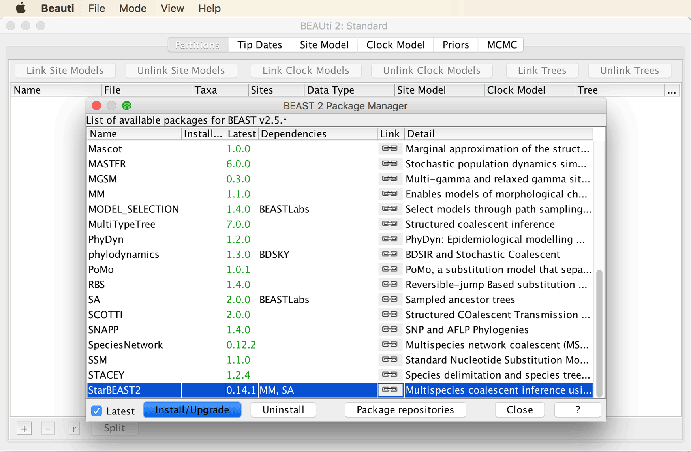

* You may notice that the interface of BEAUti apparently has not yet changed after installing the StarBEAST2 package. This is because we still need to load one of several BEAUti templates that are provided by StarBEAST2. If you hover with the mouse over "Template" in BEAUti's "File" menu, you'll see that several templates are now available that apparently are connected to StarBEAST2, as shown in the next screenshot.
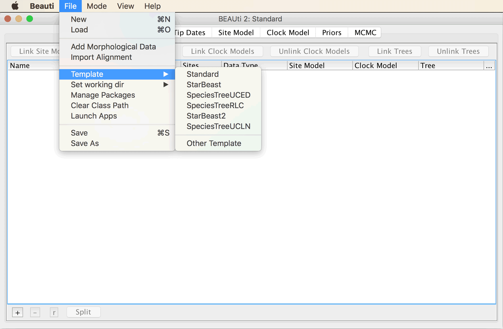
The templates provided by StarBEAST2 are "SpeciesTreeUCED", "SpeciesTreeRLC", "StarBeast2", and "SpeciesTreeUCLN" (the template named "StarBeast" refers to the older version of StarBEAST that is installed by default). Of the four templates for StarBEAST2, the one named "StarBeast2" implements a strict-clock model, the two templates named "SpeciesTreeUCED" and "SpeciesTreeUCLN" implement relaxed-clock models with exponentially or lognormally distributed rate variation, respectively, and the template named "SpeciesTreeRLC" implements a random local clock. In contrast to the first version of StarBEAST (\*BEAST), rate variation is modelled in StarBEAST2 as a species trait that applies to all genes instead of being estimated individually for each gene; this is one of the reasons why StarBEAST2 is much faster than StarBEAST (\*BEAST). The different clock models and their implementations are described in detail in [Ogilvie et al. (2017)](https://academic.oup.com/mbe/article/34/8/2101/3738283). Because we are here investigating relationships of rather closely related species with comparable lifestyle and habitat, we'll assume that differences in their evolutionary rates are negligible. This choice will also be the more convenient one for this tutorial as relaxed-clock models would be computationally more demanding. Thus, select the template named "StarBeast2" to use the strict-clock model. Note, however, that if the analysis would be for a publication, it would be worth also exploring models of rate variation. After clicking on the "StarBeast2" template, you should see that the tabs "Taxon sets", "Gene Ploidy", and "Population Model" have been added to the BEAUti window, as shown in the next screenshot.

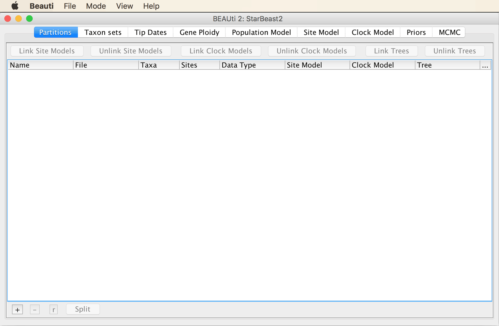

* Click on "Import Alignment" in the "File" menu and select the twelve alignment files from directory `10`. The window should then look as shown below.
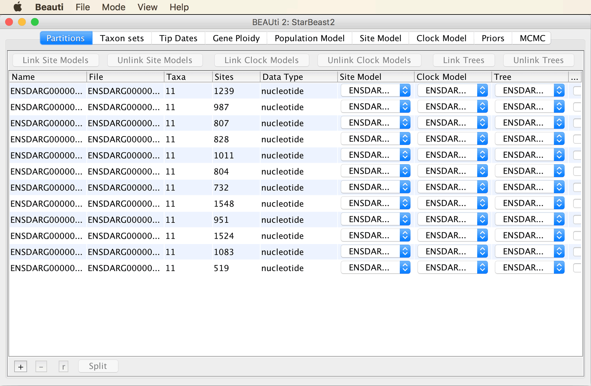

* Select all partitions and click on "Link Clock Models" in the menu bar above the partitions table. However, unlike in tutorial [Bayesian Phylogenetic Inference](../bayesian_phylogeny_inference/README.md), leave the tree models unlinked. In contrast to the analyses in this other tutorial, we will also not split each partition according to codon positions. For a full analysis it could be worthwile to do so, but to reduce computational requirements, we will here use only one partition per gene.

* Move on to the tab named "Taxon Sets". To allow the estimation of population sizes, StarBEAST2 analyses are usually performed with sequences of more than one individual per species, and the table in tab "Taxon Sets" then allows one to specify which individuals belong to which species. Here, however, our dataset includes only sequences from a single individual of each species (this means that with our dataset we are unable to estimate population sizes reliably but we will avoid this problem by using a fixed population size, as will be described below). Nevertheless, it is required that we specify a species name for each taxon in our phylogeny, and these species names must not be identical to the names of the individuals. A simple solution is to reuse the names assigned to individuals also for the species and add a prefix such as "_spc" to the end of each name, as shown in the screenshot below.
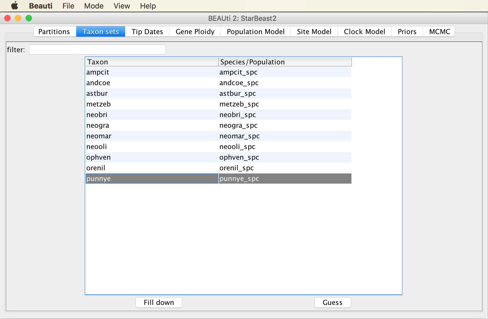

* We'll ignore the "Tip Dates" tab as in tutorial [Bayesian Phylogenetic Inference](../bayesian_phylogeny_inference/README.md). Have a look at the "Gene Ploidy" tab instead. This is where you can specify the ploidy for each gene, which would have to be adjusted if we had mitochondrial markers. Given that all genes are from the nuclear genome (and assuming that none are from sex chromosomes), the default ploidy of 2 is correct; thus, don't change anything in this tab.
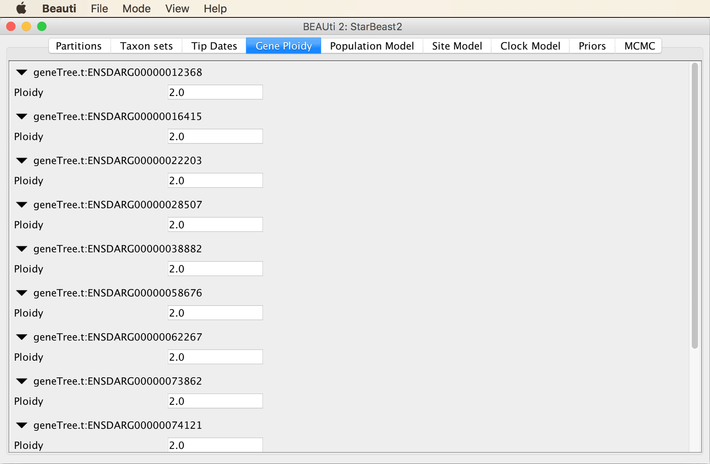

* Move on to the tab named "Population Model". As you can see from the selection in the drop-down menu at the top of this window, the default setting for the population model is "Analytical Population Size Integration". This default is a good option when multiple individuals are used per species; however, because our dataset includes only a single individual for each species, we should fix the population size to a reasonable estimate instead. To do so, select "Constant Populations" from the drop-down menu. In the field to the right of "Population Sizes", just leave the default value of 1.0. Even though unintuitive, this value does not directly specify the effective population size. Instead, this value needs to be scaled by the number of generations per time unit. Given that we will use 1 million years as the time unit in our analysis (as in the other tutorials), and assuming a generation time of 3 years for cichlids ([Malinsky et al. 2015](http://science.sciencemag.org/content/350/6267/1493)), there are 333,333 generations per time unit. Thus the value of 1.0 specified for the population size in fact translates to an assumed effective population size of 333,333, which is comparable to the population sizes estimated for African cichlid fishes in [Meyer et al. (2017)](https://academic.oup.com/sysbio/article/66/4/531/2670093). Make sure to leave the checkbox for to the left of "estimate" at the right of the window unticked so that the specified population size is in fact fixed. The window should then look as in the screenshot below.

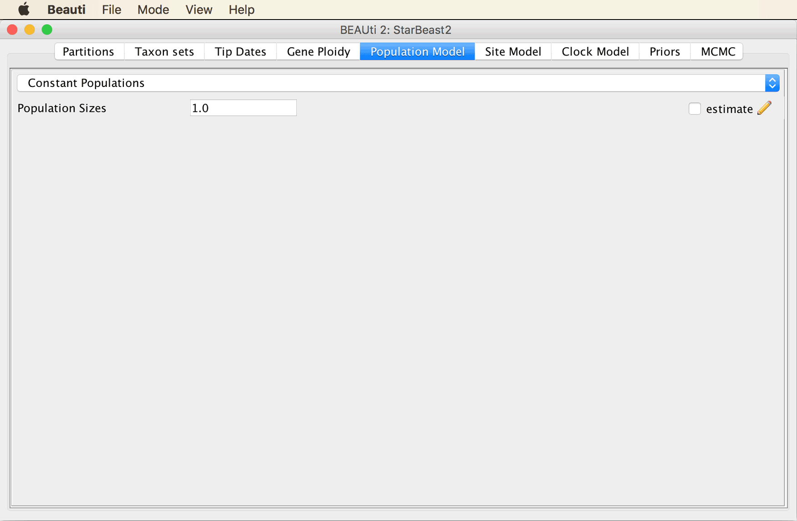

* Continue to the "Site Model" tab. As in the other tutorials, select the "BEAST Model Test" model from the first drop-down menu to average over a set of substitution models, and choose the "namedExtended" set of substitution models from the second drop-down menu. Make sure to set a tick in the checkbox next to "estimate" at the right of the window to estimate the mutation rate of the first partition relative to those of other partitions. The BEAUti window should then look as shown in the next screenshot.
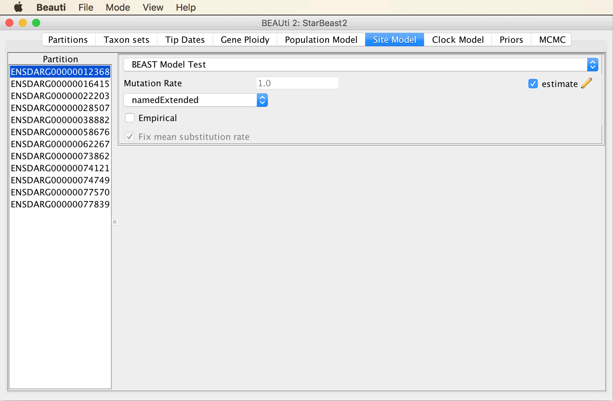

* Still in the "Site Model" tab, select all partitions from the list at the left of the window as shown below, and click "OK" to copy the settings for the first partition also to all other partitions.
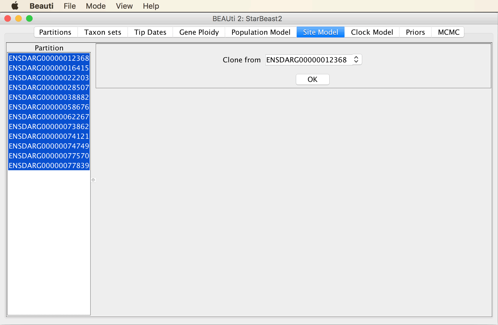

* Move on to the "Clock Model" tab. The "Strict Clock" model should already be selected in the drop-down menu; don't change this selection. However, we are going to estimate the rate of the clock through a calibration on the root of the phylogeny (this will be described below). To enable this estimation of the clock rate, set a tick next to "estimate" at the right of the window, as shown in the next screenshot.
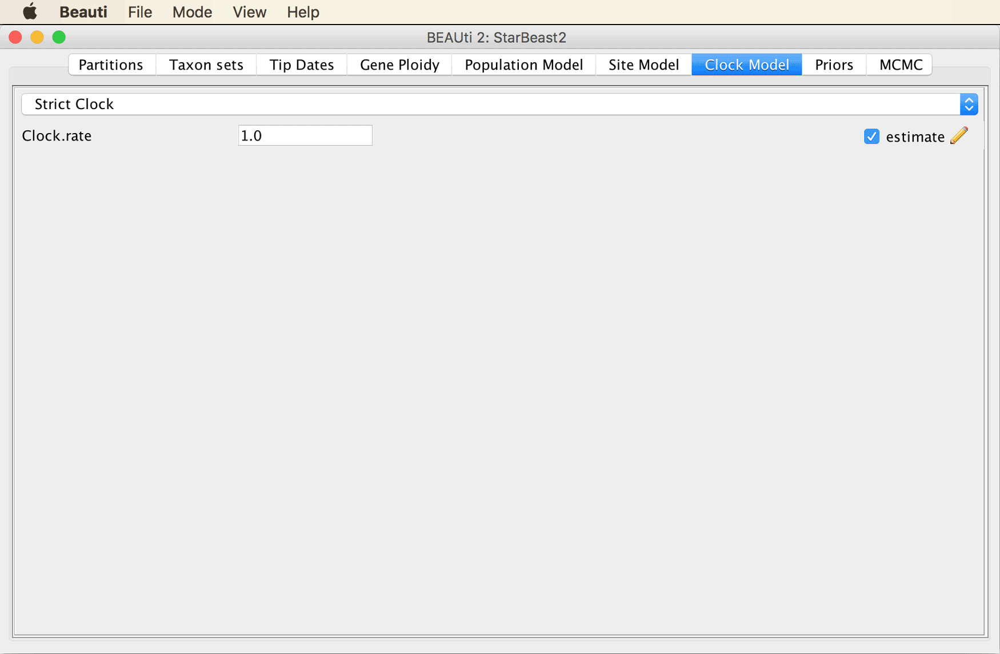

* Continue to the "Priors" tab. At the very top of the list, select the "Birth Death Model" from the first drop-down menu next to "Tree.t:Species" to allow the possibility that extinction occurred during the evolution of cichlid fishes, as shown in the screenshot below.
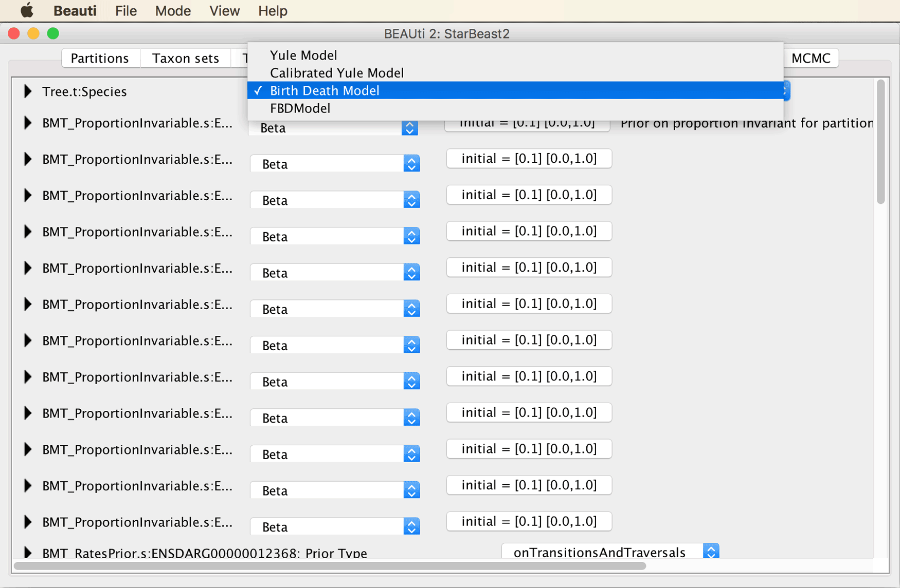

* Then, scroll to the very bottom of the list in the "Priors" tab. To specify a time calibration, click the "+ Add Prior" button at the very bottom. This should open a pop-up window as shown in the next screenshot. Keep the selection of "MRCA prior" in the drop-down menu and click "OK".
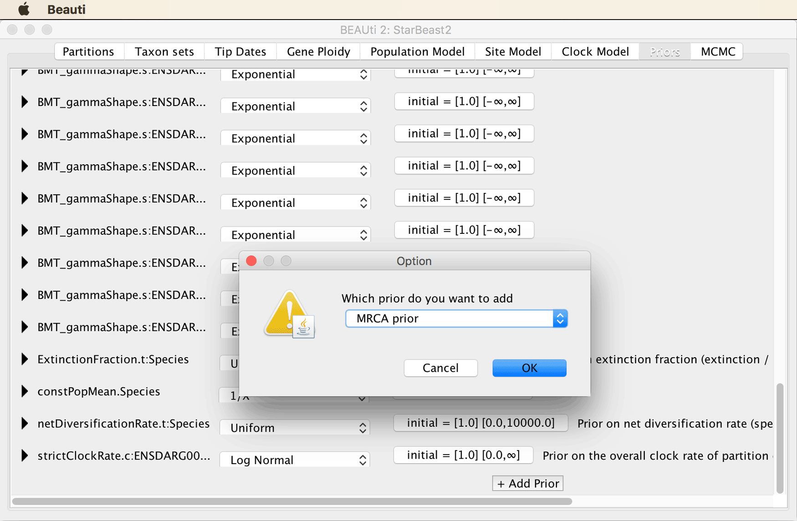

* This should open another pop-up window in which you should select a tree to which the calibration should be applied. Unfortunately, the window lists the names of all gene trees next to each other and thus may be wider than the computer screen. The button for the selection of the species tree, named "Tree.t:Species", is located at the very right of the window, as shown in the screenshot below. Thus, to select the species tree, you might have to move the window to the left until you can click on this button.
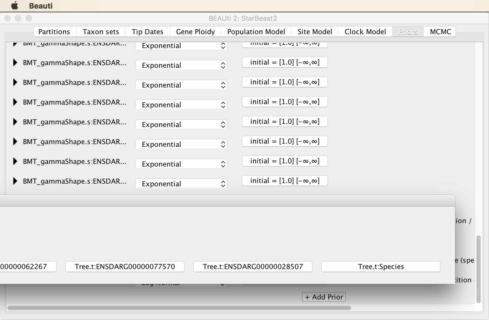

* Once you clicked the button, yet another pop-up window should open in which you can specify the ingroup of the clade that is to be time calibrated. We are going to calibrate the divergence of Neotropical and African cichlid fishes according to the results obtained in tutorial [Phylogenetic Divergence-Time Estimation](../divergence_time_estimation/README.md). And since the dataset used in the current tutorial contains no species besides Neotropical and African cichlid fishes, their divergence represents the root of the phylogeny. Thus, to constrain the age of the root, select all species names from the left side of the pop-up window and click the `>>` button to move all of them into the ingroup on the right-hand side of the pop-up window. In the field at the top of the pop-up window next to "Taxon set label", specify "All" as the name of this group, as shown in the screenshot below. Then, click "OK".
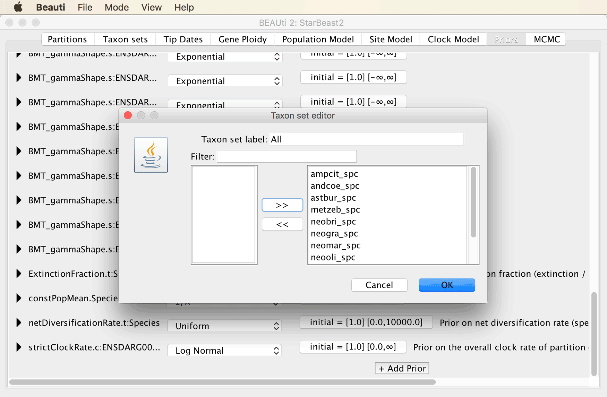

* In tutorial [Phylogenetic Divergence-Time Estimation](../divergence_time_estimation/README.md), the age of the divergence of Neotropical and African cichlid fishes was estimated as 65 Ma, with a confidence interval ranging from 55 to 75 Ma. To implement this age as a calibration for the current phylogeny, we can select a normally distributed prior density with a mean of 65 and a standard deviation of 5.1. To do so, choose "Normal" from the drop-down menu to the right of "All.prior" and write "65" and "5.1" in the fields to the right of "Mean" and "Sigma", as in the screenshot below.
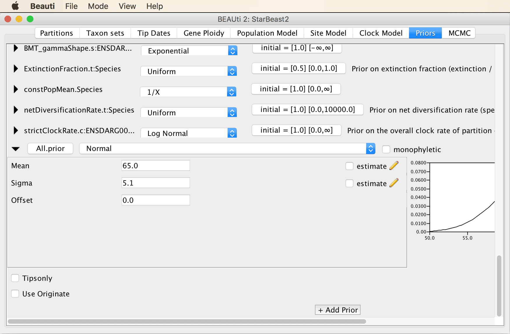

* Scroll to the right of the window to see the shape of the specified prior density for the age of the divergence of Neotropical and African cichlid fishes, as shown in the next screenshot.
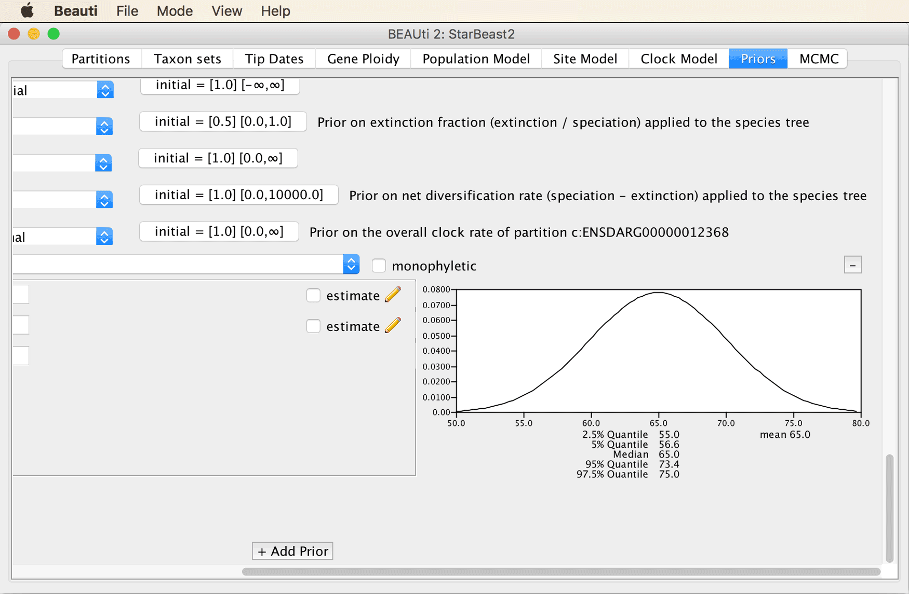
As listed in the summary statistics below the density plot, the 2.5% quantile is at exactly 55.0 Ma and the 97% quantile is at 75.0 Ma; thus 95% of the prior mass lie between these values.

* Finally, continue to the "MCMC" tab. Depending on the time available for this analysis, set the chain length to 100 million as shown in the next screenshot or even to 1 billion. In the first case, the analysis will take about an hour but will not reach stationarity. Setting the chain length to 1 billion could make sense if you plan to run the analysis overnight. The chain will then approach stationarity but the analysis might still not be fully complete. Note that if you decide to run a shorter chain, you could use the results of my analysis (linked below) for the rest of the tutorial. Set the value for "Store Every" to 50,000. Click on the black triangle to the left of "tracelog" to open the settings for the log file, and specify "starbeast.log" as the file name and 50,000 as the log frequency (to the right of "Log Every") as shown in the screenshot below.
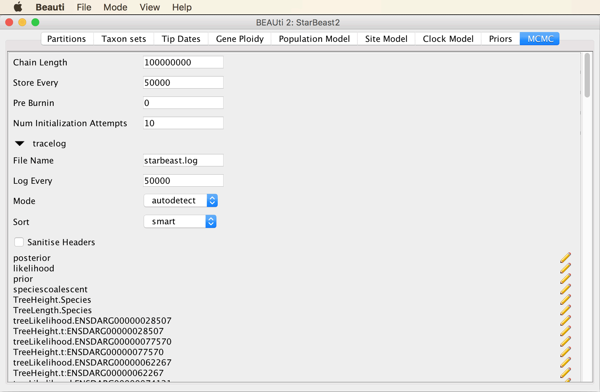

* Click on the next black triangle to see the settings for the species-tree log file. Set the name of this file to "starbeast_species.trees" and the log frequency again to 50,000 as in the next screenshot.
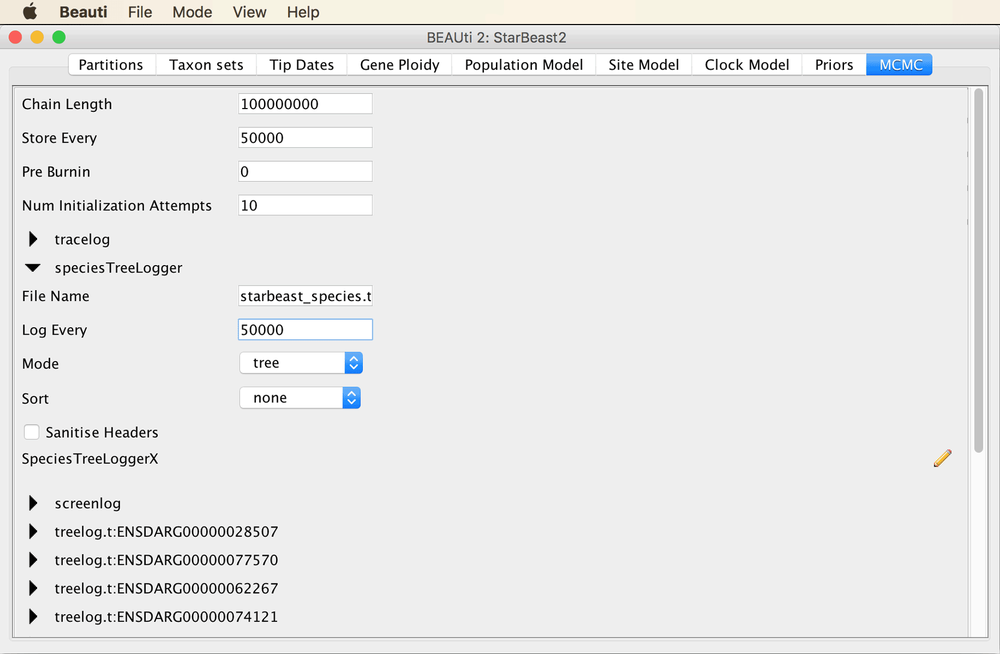

* The settings for the log output to the screen ("screenlog") do not need to be changed. But click on the triangle below it to open the settings for the log file for the first gene tree, named "t:ENSDARG00000028507". Here, add "starbeast_" before the default file, and specify again a log frequency of 50,000 as shown in the screenshot below.
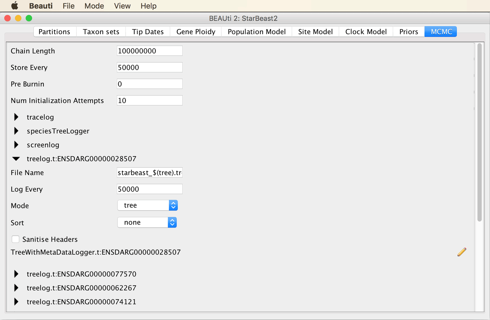

* Repeat the above step also for the log files of all other gene trees.

* Then, save the file using "Save As" in BEAUti's "File" menu and name it "starbeast.xml".

* Before we analyze file `starbeast.xml` with BEAST2, we still need to make small adjustments to the XML file (**Update: This step is no longer necessary with StarBEAST2 v.0.15.1 and newer**). This is because for some reason, BEAUti writes a parameter for the population size to the file and also places operators and a prior density on this parameter, even though we specified to use a constant population size. As a result, the prior probability would change throughout the MCMC analysis without any impact on the likelihood, which massively increases the number of iterations required to reach stationarity. Thus, we'll completely remove this parameter from the BEAST2 input file. To do so, open the file in a text editor find the following line on which the parameter is introduced, and delete the line:

		<parameter id="constPopMean.Species" lower="0.0" name="stateNode">1.0</parameter>
				
	The prior for the population-size parameter is specified with the three lines below. Search for these and also delete them.
	
		<prior id="constPopMeanPrior.Species" name="distribution" x="@constPopMean.Species">
			<OneOnX id="OneOnX.13" name="distr"/>
		</prior>
		
	The parameter is included in a multi-parameter operator named "updownAll:Species". Do not remove the whole operator, but only the following line in which the population-size parameter is included in it:
	
			<down idref="constPopMean.Species"/>
			
	A second operator acts exclusively on the population-size parameter. It is specified on the following line, which should be removed:
	
		<operator id="constPopMeanScale.Species" spec="ScaleOperator" parameter="@constPopMean.Species" scaleFactor="0.75" weight="1.0"/>
	
	Finally, the following line specifies that the population-size parameter should be included in the log output. Also remove this line:
	
		<log idref="constPopMean.Species"/>
		
	Save your changes to file `starbeast.xml`. This file is then ready to be analyzed with BEAST2.
		
* Open the program BEAST2, select file [`starbeast.xml`](res/starbeast.xml), and click on "Run" to start the analysis.

As described above, this analysis may take between 1 and 10 hours depending on the length of the MCMC chain that you decided to specify. Instead of waiting for the analysis to finish, you could cancel it at some point and use the output of my analysis to complete this tutorial. However, you could in any case first continue with the next part of the tutorial which is independent of the results of the StarBEAST2 analysis, and you could keep the StarBEAST2 analysis running in the meantime.

## Bayesian species-tree inference with concatenation

For comparison only, we are also going to repeat the above analysis not with the multi-species-coalescent model of StarBEAST2, but with BEAST2 based on concatenation. Several studies have already suggested that concatenation may not only lead to strong support for incorrect topologies ([Kubatko and Degnan 2007](https://academic.oup.com/sysbio/article/56/1/17/1658327)), but that it might also bias divergence times towards overestimation ([Meyer et al. 2017](https://academic.oup.com/sysbio/article/66/4/531/2670093); [Ogilvie et al. 2017](https://academic.oup.com/mbe/article/34/8/2101/3738283)). To see how this effect might influence divergence-time estimates of the eleven cichlid species, we are here going to analyze the dataset of twelve gene alignments also with concatenation and we will afterwards compare the results to those of the analysis with the multi-species-coalescent model.

* Open BEAUti once again and do not load a template this time.

* Import the same twelve alignments again. If you're asked to choose the datatype of the alignments, select "all are nucleotide" as before.

* Select again all partitions, and this time click on both "Link Trees" and "Link Clock Models". As before, do not split the partitions according to codon position so that the results of this analysis with concatenation will be as comparable as possible with those of the analysis with the multi-species-coalescent model.

* In the "Site Model" tab, select again the "BEAST Model Test" model to average over a set of substitution models, and choose the set of "namedExtended" models for this. Also set the tick in the checkbox next to "estimate" to allow estimation of the mutation rate of the first partition compared to other partitions. The window should then look as shown in the screenshot below.
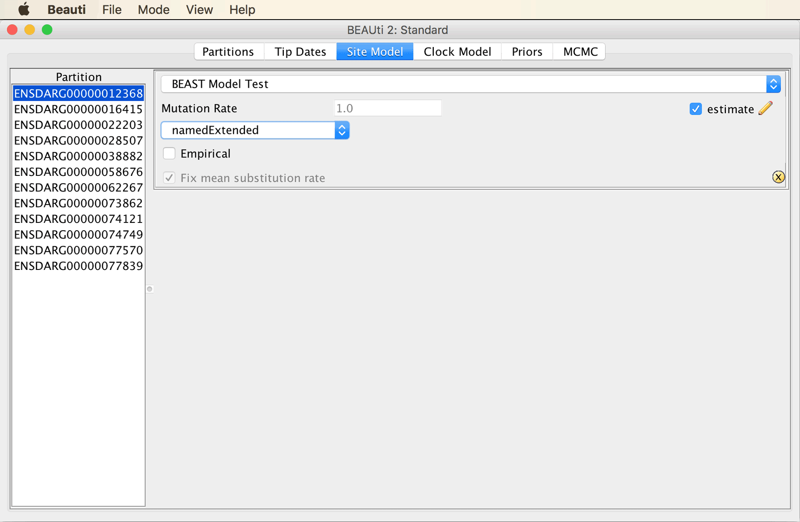

* As before, select all partitions in the list on the left-hand side of the window and click "OK" to copy the settings from the first partition to all other partitions.

* In the "Clock Model" tab, again select the strict-clock model. If the checkbox next to "estimate" at the right of the screen should be inactive, click on "Automatic set clock rate" in BEAUti's "Mode" menu to activate it. Then, set a tick in this checkbox, as shown in the next screenshot, to enable estimation of the clock rate.
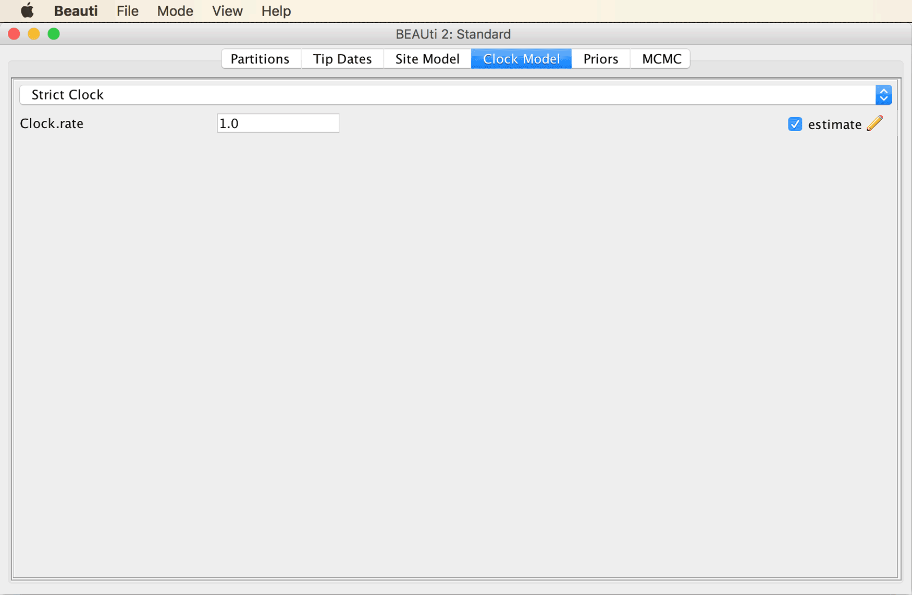

* In the "Priors" tab, select again the "Birth Death Model" from the first drop-down menu.

* Then, scroll again to the bottom of the list shown in the "Priors" tab and click the "+ Add Prior" button to add a calibration for the age of the root of the phylogeny as we did before for the StarBEAST2 analysis. Use again a normally distributed prior density with a mean of 65 and a standard deviation of 5.1. The BEAUti window should then look as shown in the next screenshot.
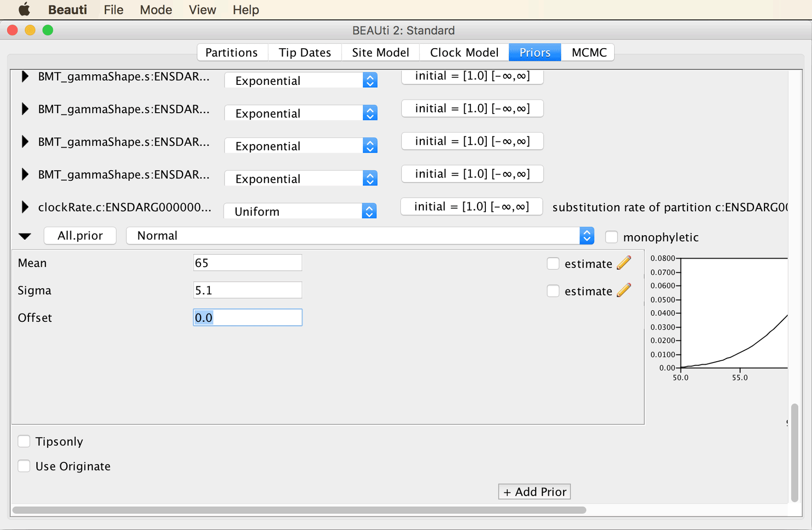

* For some reason, the default prior density for the clock rate is different when the StarBeast template is not used. Therefore, to keep the two two analyses as comparable as possible, we'll change the currently selected prior density for the clock rate so that it matches the one that we used in the the analysis with the multi-species-coalescent model. In that earlier analysis, the default prior density for the clock rate was lognormally distributed with a mean of 1 and a standard deviation (in real space) of 1. To use the same density here again, select "Log Normal" from the drop-down menu to the right of  "clockRate.c:ENSDARG000..." and click on the black triangle to the left of it. Then, specify "1.0" in the fields to the right of "M" (the mean) and "S" (the standard deviation). Also make sure to set a tick for "Mean In Real Space", as shown in the screenshot below.
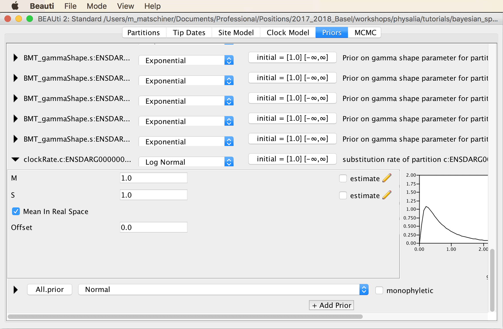

* Continue to the "MCMC" tab and specify a chain length according to the time available for this analysis. A chain with 20 million iterations would probably require about 45 minutes and could be used in the rest of the tutorial, but it will not have reached stationarity. For a more complete analysis, use 100 million iterations if you can wait 4-5 hours for the analysis to finish. Specify a frequency of 5,000 in the field to the right of "Store Every", name the log output file "concatenated.log", and also specify a log frequency of 5,000 as shown in the next screenshot.
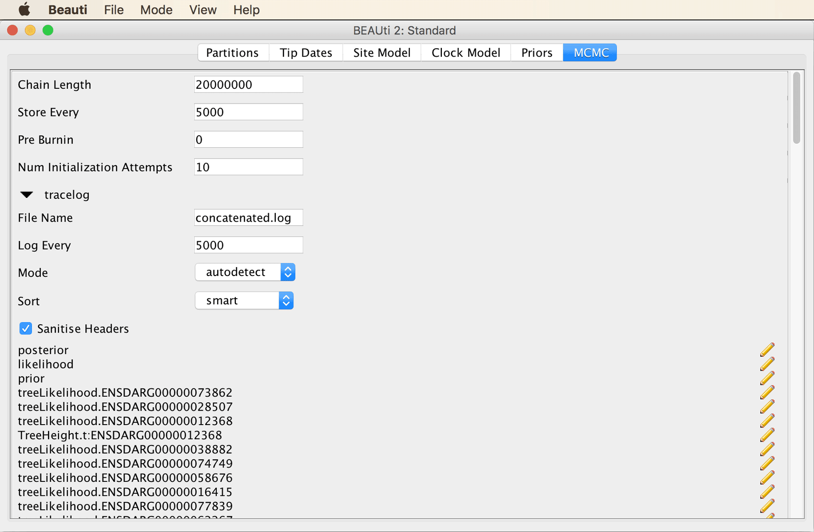
Finally, set the name of the tree file to "concatenated.trees" and again use a log frequency of 5,000 as shown below.
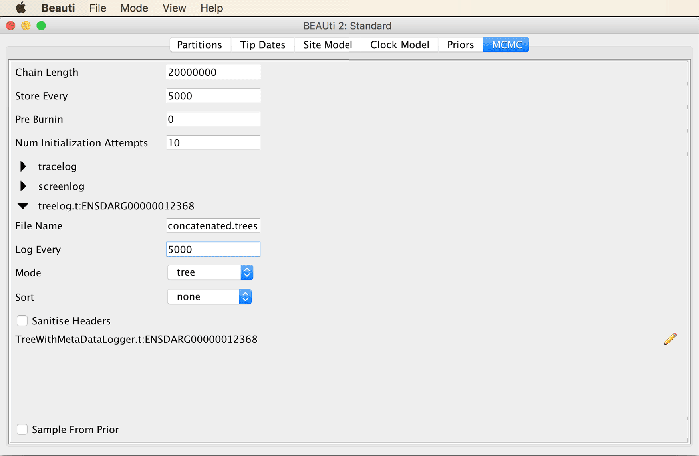

* Then, use "Save As" in BEAUti's "File" menu to save the settings to a file named `concatenated.xml`.
 
* If the analysis with the GUI version of BEAST2 is still running for the analysis with the multi-species-coalescent model you can again (as described in tutorial [Bayesian Phylogenetic Inference](../bayesian_phylogeny_inference/README.md)) the command-line version of BEAST2 to analyze the file [`concatenated.xml`](res/concatenated.xml). Assuming that your BEAST2 installation is `/Applications/BEAST\ 2.5.0`, use one of the two following commands to start the analysis:

		/Applications/BEAST\ 2.5.0/bin/beast concatenated.xml
		
	or
	
		export JAVA_HOME=/Applications/BEAST\ 2.5.0/jre1.8.0_161
		/Applications/BEAST\ 2.5.0/jre1.8.0_161/bin/java -jar /Applications/BEAST\ 2.5.0/lib/beast.jar concatenated.xml

Depending on the chosen number of MCMC iterations, this analysis is likely to run for a duration between 45 minutes (with a chain length of 20 million) and 5 hours (with a chain length of 100 million).

## Comparing species trees estimated with StarBEAST2 and concatenation

We are now going to compare the time-calibrated species trees estimated with the multi-species coalescent model and with concatenation. Recall that both analyses used the same sequence data, the same time calibration, and the same substitution and clock models. The difference between the two approaches is only that the multi-species coalescent model estimates the species tree and all gene trees separately whereas just a single tree is estimated based on concatenation.

* First, we'll assess the stationarity of the MCMC analyses once again with the software Tracer. Thus, open the log files resulting from both analyses, [`starbeast.log`](starbeast.log) and [`concatenated.log`](concatenated.log) in Tracer. If you ran the analysis with StarBEAST2 for a billion generations, the trace plot for the posterior of that analysis should look more or less as shown in the next screenshot.
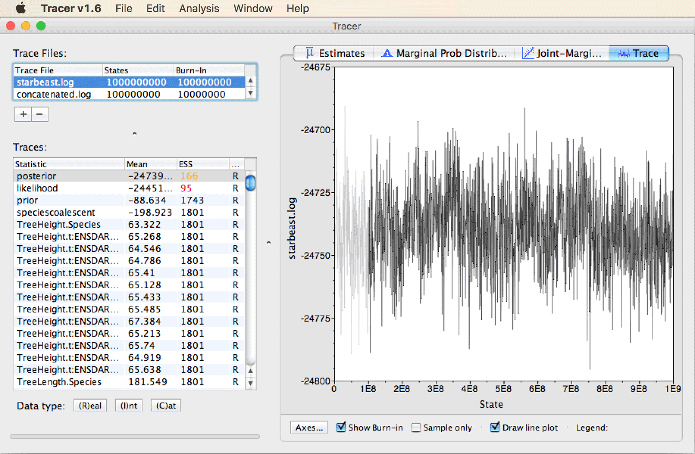
The ESS value for the posterior as well as for the likelihood are below 200, suggesting that the analysis should ideally have run even longer. Nevertheless, the current results are sufficient to allow a comparison of the divergence times obtained with the two models.

* Have a look at the estimates for the parameters named "TreeHeight.Species" or "TreeHeight.t:ENSDAR...". These are the mean age estimates for the roots of the species tree and the all gene trees. You'll see that the mean estimate for the root of the species tree is slightly younger than the mean of the prior density that we placed on it. This could for example be caused by the prior density on the clock rate that might push the rate towards larger values and thus the tree age towards a younger origin. However, given that the relative difference to the expected root age is minor, we'll ignore it here. More interesting is the difference between the age of the species-tree root and the ages of the gene-tree roots. **Question 2:** What is the average age difference between the root of the species tree and those of the gene trees; and could we have expected this difference? [(see answer)](#q2)

* Note the estimate for the mean substitution rate across all genes. The parameter for this substitution rate is named "strictClockRate.c:ENS..." and you'll find it near the end of the list of parameters. This estimate should be around 6.5 &times; 10-4 per million years (6.548 &times; 10-4 in my analysis). It will be used again for time calibration of a Bayesian species network of Lake Tanganyika ciclid species in tutorial [Bayesian Analysis of Species Networks](bayesian_species_tree_inference/README.md).

* Scroll down the list of parameters to check the other ESS values. You'll notice that particularly the ESS values for the first two gene-tree likelihoods are rather poor. The histogram for the first of these gene-tree likelihoods should have a bimodal distribution similar to that shown in the next screenshot.
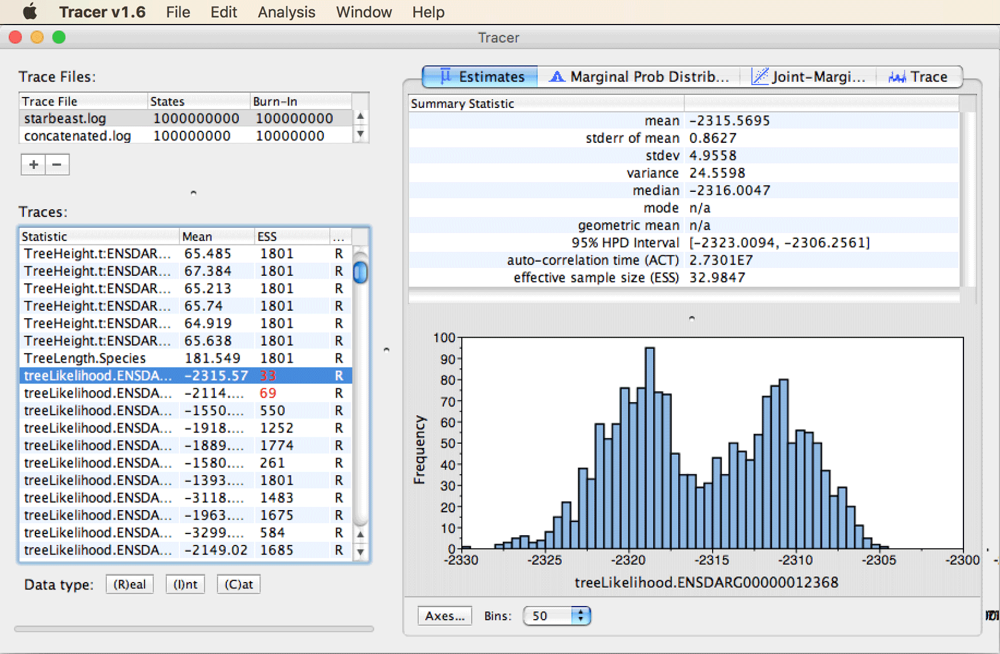
The trace plot for the same gene-tree likelihood shows that the MCMC chain seems to have switched back and forth between two different states, as shown below.
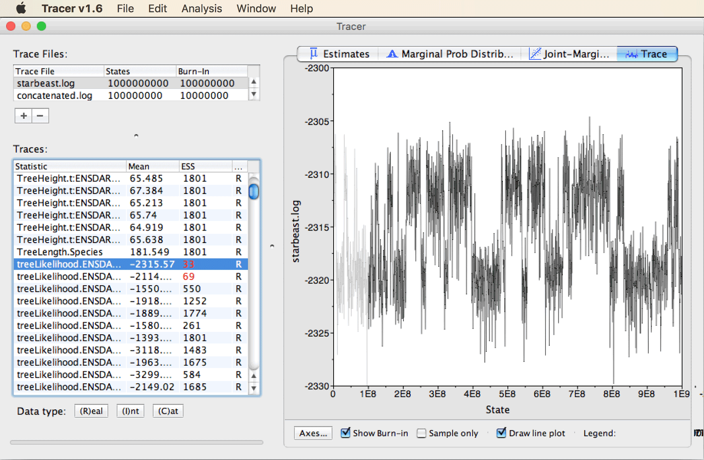
 **Question 3:** Can you figure out what might cause these switches? [(see answer)](#q3)

* Next, check the stationarity of the chain for the concatenated analysis. You'll see that the patter for this analysis (after 100 million MCMC iterations) is quite comparable to that of the analysis with the multi-species-coalescent model (after 1 billion iterations). It is not surprising that the analysis with the multi-species coalescent model requires more iterations to reach a similar level of stationarity, given that twelve gene trees and a species tree need to be optimized by that model wheras only a single tree is estimated based on concatenation.

* Next, use TreeAnnotator (see tutorial [Bayesian Phylogenetic Inference](../bayesian_phylogeny_inference/README.md) if you are not familiar with this tool yet) to generate maximum-clade-credibility summary trees for the species tree of the analysis with the multi-species-coalescent model (file [`starbeast_species.trees`](res/starbeast_species.trees)) and for the tree based on concatenation (file [`concatenated.trees`](res/concatenated.trees)). To do so, use a burnin percentation of 10 and select "Mean heights" from the drop-down menu next to "Node heights:". Select either [`starbeast_species.trees`](res/starbeast_species.trees)) or [`concatenated.trees`](res/concatenated.trees) as input tree file and name the output file accordingly `starbeast_species.tre` or `concatenated.tre`. The next screenshot shows these settings for the species tree of the analysis with the multi-species-coalescent model.
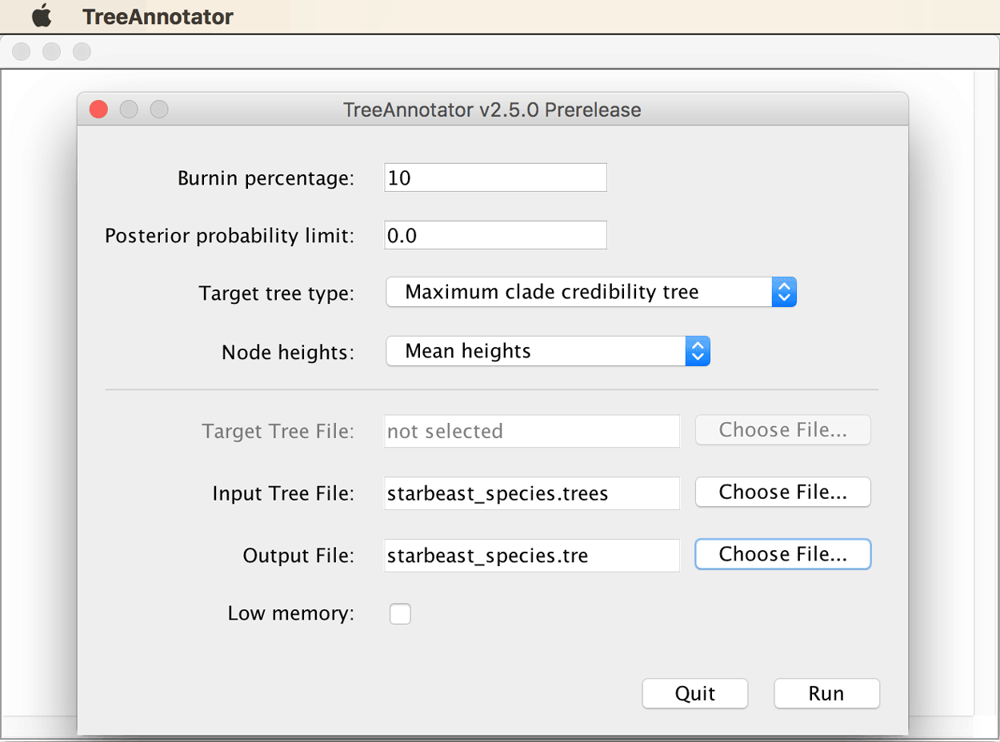

* Open the two summary trees of files [`starbeast_species.tre`](res/starbeast_species.tre) and [`concatenated.tre`](res/concatenated.tre) in FigTree, select "Node ages" to be displayed as node labels, and compare these between the two trees. The two summary trees should look similar to those shown in the next two screenshots.  **Question 4:** What do you notice? [(see answer)](#q4)

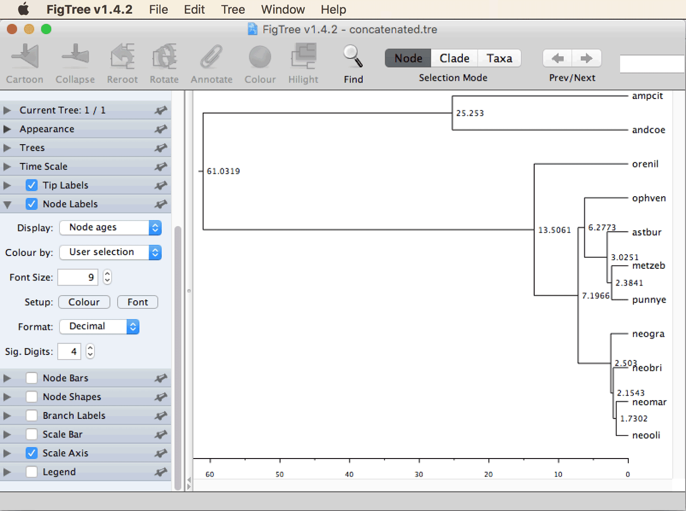

* If you display the "posterior" instead of the node ages as the node labels in both trees, you'll see that generally the support values are higher when based on concatenation. **Question 5:** Given these differences, which phylogeny do you consider more reliable? [(see answer)](#q5)

* To visualize the variation among the gene trees, we'll also generate maximum-clade-credibility summary trees for each of the twelve gene trees. We could do so again using the GUI verson of TreeAnnotator, but it will be faster to do so with the command-line version of the program instead. If your BEAST2 installation should be located in `/Applications/Beast/2.5.0`, you should be able to use the following command to run TreeAnnotator for all gene trees; if not, you will have to adjust the path given in this command:

		for i in starbeast_ENSDARG*.trees
		do
			/Applications/Beast/2.5.0/bin/treeannotator -burnin 10 -heights mean ${i} ${i%.trees}.tre
		done

* You should then have twelve summary-tree files ending in `.tre`. To see if this is the case, you could do a quick check with

		ls starbeast_ENSDARG*.tre | wc -l
		
* To visualize the summary trees for all genes jointly with the species tree from the analysis with the multi-species-coalescent model, we can use the program Densitree ([Bouckaert 2010](https://academic.oup.com/bioinformatics/article/26/10/1372/192963)) that is distributed as part of the BEAST2 package. Thus, you will find it in the same directory as BEAST2, BEAUti, and TreeAnnotator. However, before we can open all summary trees jointly in Densitree, we'll need to prepare a single file containing all of them. The easiest way to do so is with the Python script [`logcombiner.py`](src/logcombiner.py), which accepts a list with the names of tree files as input and produces a single tree file with these trees as output. Thus, first generate a file with a list of the names of the summary-tree files for the species tree as well as the gene trees from the analysis with the multi-species-coalescent mode:
		
		ls starbeast_species.tre starbeast_ENSDARG*.tre > starbeast_trees.txt
		

* Then, use this file as input for the script `logcombiner.py` and specify `starbeast_genes.trees` as the name of the output file:
	
		python3 logcombiner.py starbeast_trees.txt starbeast.trees
		
	(there will be a warning message but you can ignore it).

* You can then open file [`starbeast.trees`](res/starbeast.trees) in the software Densitree. After rotating some nodes to match the node order of the FigTree screenshots above (click "Show Edit Tree" in DensiTree's "Edit" menu to do this), the set of trees should look as shown in the next screenshot.
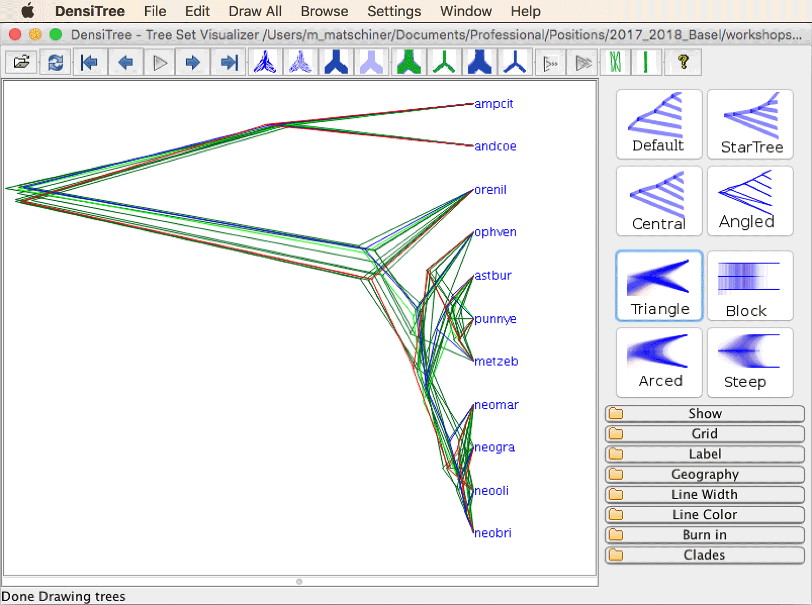
 **Question 6:** Can you tell which of the trees shown in DensiTree is the species tree? [(see answer)](#q6)

* As you'll see from the DensiTree visualization, there is much variation in the topologies of the gene trees. This could either only appear to be so due to a lack of phylogenetic signal or it could reflect real gene-tree discordance due to incomplete lineage sorting. To find out which of the two possibilities is responsible for the displayed variation, we can check if discordant relationships are strongly supported in different gene trees. For example, open the summary trees for the genes ENSDARG00000058676 and ENSDARG00000062267 (files [`starbeast_ENSDARG00000058676.tre`](res/starbeast_ENSDARG00000058676.tre) and [`starbeast_ENSDARG00000062267.tre`](res/starbeast_ENSDARG00000062267.tre)) in FigTree, and select the "posterior" to be displayed as node labels in both trees. The two FigTree windows should then look more or less like the two screenshots below.
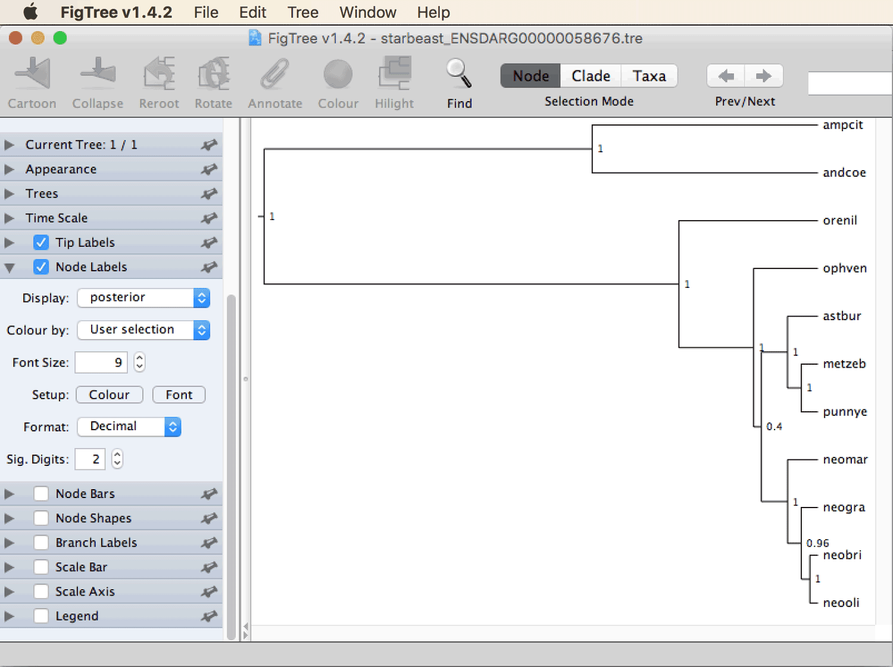

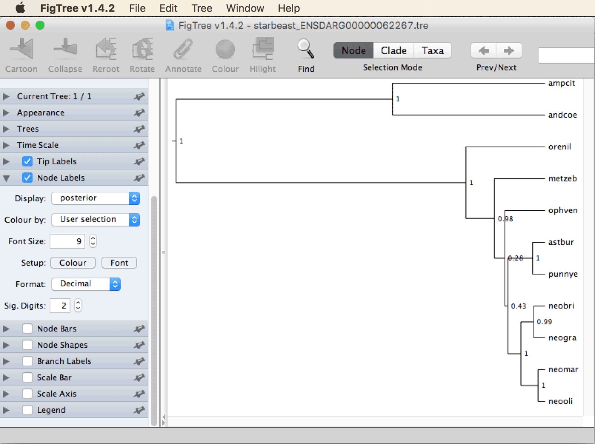
You'll see that many relationships in these two trees are strongly supported but nevertheless disagree between the two genes. For example, a sister-group relationship between *Metriaclima zebra* ("metzeb")and *Pundamilia nyererei* ("punnye") is strongly supported (Bayesian posterior probability = 1.0) by gene ENSDARG00000058676 whereas gene ENSDARG00000062267 gives the same strong support to a sister-group relationship between *Astatotilapia burtoni* ("astbur") and *Pundamilia nyererei* ("punnye"). Moreover, none of the relationships among the species of genus *Neolamprologus* ("neobri", "neogra", "neomar", and "neooli") agree between the two trees and yet all are very strongly supported. These well-supported conflicts are strong evidence for either incomplete lineage sorting or introgression, two processes that would result in misleading estimates when concatenation is used for phylogenetic inference.

By accounting for incomplete lineage sorting, our analysis with the multi-species coalescent model have now generated a timeline of cichlid divergences that may be considered relatively robust (assuming that it is not overly biased by unaccounted introgression). Notably, our estimates indicate that the four *Neolamprologus* species from Lake Tanganyika diversified within the last million years, a time period that is very short compared to the estimated age of the lake of 9-12 million years ([Salzburger et al. 2015](https://www.annualreviews.org/doi/10.1146/annurev-ecolsys-120213-091804)).

 

                   

## Answers

* **Question 1:** After removing alignments that do not contain sequence information for all eleven cichlid species, twelve sequence alignments remain in the dataset, as can be shown with this command:

		ls 10/*.fasta | wc -l
		

* **Question 2:** In file [`starbeast.log`](starbeast.log), the ages of gene trees are 65.268, 64.546, 64,786, 65.410, 65.128, 65.433, 65.485, 67.384, 65.213, 65.740, 64.919, and 65.638 Ma. The mean of these ages is 65.413 Ma, a little more than 2 million years older than the age of the species tree. This is pretty much what we could have expected, because the time expected for two alleles in a panmictic population is 2 &times; <i>N</i>e &times; <i>g</i>, where <i>N</i>e is the effective population size and <i>g</i> is the generation time (note that in the model, the ancestral population is assumed to be panmictic before the species divergence). Recall that we had fixed the population-size value in the "Population Model" tab in BEAUti to 1.0, because we assumed a population size of 333,333, equal to the number of generations per million year if we assume a generation time of 3 years for cichlids. With the same assumed values for the population size and generation time, the expected time to coalescence is 2 &times; 333,333 * 3 = 2,000,000, very much in line with the observed age difference between the species tree and the gene trees.

* **Question 3:** The reason for the switches in the likelihood of the first gene tree are actually not very obvious. Usually, such patterns can arise when rare topological changes of the species tree occur during the MCMC chain, that increase the likelihood of one gene tree while decreasing the likelihood of another gene tree so that the overall likelihood remains more or less constant. However, this is not the case here. Examining the tree files for the species tree ([`starbeast_species.trees`](res/starbeast_species.trees)) and the first gene tree ([`starbeast_ENSDARG00000012368.trees`](starbeast_ENSDARG00000012368.trees)) shows that both topologies change much more frequently than the switches in the likelihood occur. Instead, it is possible that the changes in the likelihood are driven by variation in substitution-rate estimates. At least a comparison of the first gene-tree likelihood with the rate of C &rarr; T changes indicates that both correlate, as shown in the next screenshot. Regardless of the underlying cause it appears that running the chain with more iterations (perhaps five times longer) might allow to average adequately over both states so that the chain can eventually be considered stationary despite the switches between the two states.
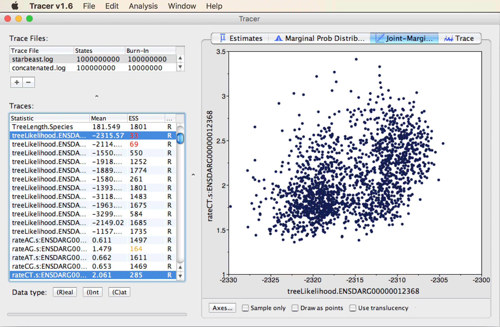

* **Question 4:** You should be able to see that particularly the young divergence times are proportionally very different between the two trees. In the extreme case, the divergence of youngest divergence event is estimated around 0.4 Ma with the multi-species-coalescent model, but four times older, around 1.7 Ma based on concatenation. Note, however, that the two species involved in this divergence are not identical in the two trees, the two divergence times are therefore not directly comparable. Nevertheless, age estimates are also very different for strongly supported nodes that are only slightly older: The first divergence among the species of the genus *Neolamprologus* is estimated at around 0.9 Ma with the multi-species coalescent model, but around 2.5 Ma (still more than twice as old!) with concatenation.

* **Question 5:** It is well known that concatenation can lead to inflated node support (e.g. [Kubatko and Degnan 2007](https://academic.oup.com/sysbio/article/56/1/17/1658327); [Degnan and Rosenberg 2009](https://www.sciencedirect.com/science/article/pii/S0169534709000846)), so the higher node-support values based on concatenation are not unexpected and they should not be trusted. In addition, the divergence-time estimates based on concatenation should also be seen with caution, as simulations have shown in several studies (e.g. [Ogilvie et al. 2017](https://academic.oup.com/mbe/article/34/8/2101/3738283); [Stange et al. 2018](https://academic.oup.com/sysbio/advance-article/doi/10.1093/sysbio/syy006/4827616)) that these can be overestimated. The multi-species-coalescent model, on the other hand, accounts for variation in gene trees due to incomplete lineage sorting and recombination, and thus should be robust to one of the most important sources of potential bias. However, it should be noted that the multi-species-coalescent model also does not account for other processes that might influence the reliability of the phylogenetic estimates, such as hybridization and gene flow or ancestral population structure.

* **Question 6:** Even though it is difficult to see, one can tell that the species tree is shown in dark green. This is because necessarily all divergences in the species tree are younger than the corresponding divergences in the gene tree, and this is the case for the tree shown in dark green. The opposite, gene tree divergences younger than species tree divergences, could only be possible through introgression; however, this since introgression is not included in the the multi-species-coalescent model used for this analysis, gene trees must be older than the species tree.