# Phylogenetic Divergence-Time Estimation

A tutorial on phylogenetic divergence-time estimation with with fossils

## Summary

The field of phylogenetic divergence-time estimation has seen tremendous progress over the last two decades, fuelled by increasing availability of molecular data as well as many methodological advances. Some of the most noteworthy advances include the development of Bayesian phylogenetic approaches for divergence-time estimation, the introduction of relaxed-clock models, as well as the implementation of quantitative models of the fossil-sampling process. In particular the latter development promises great improvements to the accuracy of divergence-time estimates as it addresses a major shortcoming of the previously common practice of node dating in which age calibrations were usually specified arbitrarily (and therefore differently by different researchers) due to the absence of quantitative criteria.

## Table of contents

* [Outline](#outline)
* [Dataset](#dataset)
* [Requirements](#requirements)
* [Divergence-time estimation with CladeAge](#cladeage)
* [Divergence-time estimation with the FBD model](#fbd)
* [Interpretation of the inferred timelines](#interpretation)

## Outline

In this tutorial I am going to demonstrate the application of two related approaches for phylogenetic divergence-time estimation based on quantitative models of fossil sampling. Both approaches are implemented in add-on packages for BEAST2; the CA package implementing the CladeAge method of [Matschiner et al. (2017)](https://academic.oup.com/sysbio/article/66/1/3/2418030), and the SA package implementing the Fossilized Birth-Death (FBD) model developed by [Stadler (2010)](https://www.sciencedirect.com/science/article/pii/S0022519310004765), [Heath et al. (2014)](http://www.pnas.org/content/111/29/E2957), and [Gavryushkina et al. (2017)](https://academic.oup.com/sysbio/article/66/1/57/2670056). Both approaches are going to be applied to the same set of fossil calibrations as well as the same sequence alignments. Finally, I will discuss possible reasons for differences between the results obtained with both approaches.

## Dataset

To allow a more reliable divergence-time estimation, the analyses in this tutorial will be based on a dataset that is larger than the one used in tutorial [Bayesian Phylogenetic Inference](../bayesian_phylogeny_inference/README.md) and earlier tutorials. Instead of a single mitochondrial and a single nuclear marker, we are now going to make use of the far more comprehensive dataset of [Near et al. (2013)](http://www.pnas.org/content/110/31/12738), comprising alignments for ten nuclear genes. In their study, [Near et al. (2013)](http://www.pnas.org/content/110/31/12738) used this dataset to estimate divergence times of spiny-rayed fishes (=Acanthomorphata), and to identify shifts in diversification rates among different groups of these fishes. While, the dataset of [Near et al. (2013)](http://www.pnas.org/content/110/31/12738) did not focus on cichlid diversification, it included nine cichlid species among the 520 species sampled for the extensive phylogeny. Thus, we can here use part of this dataset of [Near et al. (2013)](http://www.pnas.org/content/110/31/12738) to estimate early divergences among cichlid fishes, and these estimates will in turn serve as calibrations in subsequent analyses of cichlid diversification in some of the following tutorials. To facilitate the analyses in this tutorial, we will reduce the dataset of [Near et al. (2013)](http://www.pnas.org/content/110/31/12738) to sequences from only selected 24 species. These species represent divergent cichlid lineages as well as the most ancestral groups of spiny-rayed fishes so that the fossil record of these lineages can be employed for calibration.

## Requirements

* **BEAST2:** If you already did tutorial [Bayesian Phylogenetic Inference](../bayesian_phylogeny_inference/README.md), you should have the BEAST2 package installed already. If not, you can download this package, including BEAUti, BEAST2 itself, TreeAnnotator, and other tools from the BEAST2 website [https://www.beast2.org](https://www.beast2.org). As all these programs are written in Java, compilation is not required, and all programs should work on Mac OS X, Linux, and Windows. I recommend downloading the program versions that include the Java Runtime Environment, which may prevent conflicts with Java versions that may already be installed on your machine. 

* **Tracer:** Like BEAST2, you probably have Tracer installed already if you followed the tutorial [Bayesian Phylogenetic Inference](../bayesian_phylogeny_inference/README.md). If not, you'll find the program for Mac OS X, Linux, or Windows on [https://github.com/beast-dev/tracer/releases](https://github.com/beast-dev/tracer/releases). The file with the extension `.dmg` is for Mac OS X, the one with the extension `.tgz` is for Linux, and the Windows version is the file ending in `.zip`.

* **FigTree:** The program [FigTree](http://tree.bio.ed.ac.uk/software/figtree/) should also already be installed if you followed the tutorial [Bayesian Phylogenetic Inference](../bayesian_phylogeny_inference/README.md). If not, you can download it for Mac OS X, Linux, and Windows from [https://github.com/rambaut/figtree/releases](https://github.com/rambaut/figtree/releases).

## Divergence-time estimation with CladeAge

The first of two quantitative approaches for the specification of age constraints that will be applied in this tutorial is the CladeAge approach that I developed together with colleagues in our study [Matschiner et al. (2017)](https://academic.oup.com/sysbio/article/66/1/3/2418030). This approach shares similarities with the more traditional node-dating approach in the sense that prior densities are defined for the ages of different clades, and the minimum ages of these prior densities are provided by the oldest fossils of these clades. However, important differences exist between the CladeAge approach and node dating: First, the shape of age-prior densities is informed by a model of diversification and fossil sampling in the CladeAge approach, whereas in node dating, lognormal or gamma distributions with more or less arbitrarily chosen distribution parameters were usually applied. Second, because of the quantitative model used in the CladeAge approach, the clades used for calibration should also not be chosen at will. Instead, strictly all clades included in the phylogeny that (i) have a fossil record, (ii) are morphologically recognizable, and (iii) have their sister lineage also included in the phylogeny should be constrained according to the age of their oldest fossil. A consequence of this is that clades are constrained even when their known sister lineage has an older fossil record, and that the same fossil may be used to constrain not just one clade, but multiple nested clades, if the more inclusive clades do not have an even older fossil record. More details about these criteria can be found in our paper ([Matschiner et al. 2017](https://academic.oup.com/sysbio/article/66/1/3/2418030)), and further information on using CladeAge is given in our [Rough Guide to CladeAge](http://evoinformatics.eu/cladeage.pdf).

* Download the molecular dataset of [Near et al. (2013)](http://www.pnas.org/content/110/31/12738) from the Dryad data repository connected to their publication:

		wget https://datadryad.org/bitstream/handle/10255/dryad.50839/Near_et_al.nex
	
	This file in Nexus format contains the sequence alignments for ten nuclear markers, sequenced for 608 species of spiny-rayed fishes. As this dataset is far too large to be analyzed in this tutorial, we'll extract the sequences of 24 species that represent major groups of spiny-rayed fishes ([Betancur-R. et al. 2017](https://bmcevolbiol.biomedcentral.com/articles/10.1186/s12862-017-0958-3)) as well as the most divergent groups of cichlid fishes. The 24 species that we will focus on are listed in the table below.

| ID                       | Species                   | Group                |
|--------------------------|---------------------------|----------------------|
| Oreochromis_niloticus    | *Oreochromis niloticus*   | African cichlids     |
| Heterochromis_multidensA | *Heterochromis multidens* | African cichlids     |
| Cichla_temensisA         | *Cichla temensis*         | Neotropical cichlids |
| Heros_appendictulatusA   | *Heros appendictulatus*   | Neotropical cichlids |
| Etroplus_maculatusA      | *Etroplus maculatus*      | Indian cichlids      |
| Oryzias_latipes          | *Oryzias latipes*         | Atherinomorphae      |
| Trachinotus_carolinusA   | *Trachinotus carolinus*   | Carangaria           |
| Channa_striataA          | *Channa striata*          | Anabantiformes       |
| Monopterus_albusA        | *Monopterus albus*        | Synbranchiformes     |
| Gasterosteus_acuC        | *Gasterosteus aculeatus*  | Eupercaria           |
| Astrapogon_stellatusA    | *Astrapogon tellatus*     | Gobiaria             |
| Aulostomus_chinensisA    | *Aulostomus chinensis*    | Syngnatharia         |
| Thunnus_albacaresA       | *Thunnus albacares*       | Pelagaria            |
| Porichthys_notatusA      | *Porichthys notatus*      | Batrachoidiaria      |
| Diplacanthopoma_brunneaA | *Diplacanthopoma brunnea* | Ophidiaria           |
| Sargocentron_cornutumA   | *Sargocentron cornutum*   | Holocentrimorphaceae |
| Rondeletia_loricataA     | *Rondeletia loricata*     | Beryciformes         |
| Monocentris_japonicaA    | *Monocentris japonica*    | Trachichthyiformes   |
| Polymixia_japonicaA      | *Polymixia japonica*      | Polymixiipterygii    |
| Regalecus_Glesne         | *Regalecus glesne*        | Lampripterygii       |
| Percopsis_omiscomaycusA  | *Percopsis omiscomaycus*  | Percopsaria          |
| Zenopsis_conchiferaB     | *Zenopsis conchifera*     | Zeiariae             |
| Stylephorus_chordatusB   | *Stylephorus chordatus*   | Stylephoriformes     |
| Gadus_morhua             | *Gadus morhua*            | Gadiformes           |

* A list of the 24 species ids in plain text format is also in file [`Near_et_al_ids.txt`](data/Near_et_al_ids.txt). Use that file to extract the sequences of these species from the full alignment, and write them to a new file in Nexus format named `Near_et_al_red.nex`:

		head -n 7 Near_et_al.nex | sed 's/ntax=608/ntax=24/g'> Near_et_al_red.nex
		grep -f Near_et_al_ids.txt -e "\[" Near_et_al.nex | sed -e $'s/\[/\\\n\[/g' >> Near_et_al_red.nex
		tail -n 35 Near_et_al.nex | sed 's/paup/assumptions/g' >> Near_et_al_red.nex

* To specify fossil constraints as calibrations points in BEAUti according to the CladeAge model of [Matschiner et al. (2017)](https://academic.oup.com/sysbio/article/66/1/3/2418030), we'll first have to install the CladeAge add-on package for BEAST2. To do so, open BEAUti, and click on "Manage Packages" in the "File" menu. This will open a window for the BEAST2 Package Manager. In this window, select "CA" and click "Intstall/Upgrade" as shown in the screenshot below.
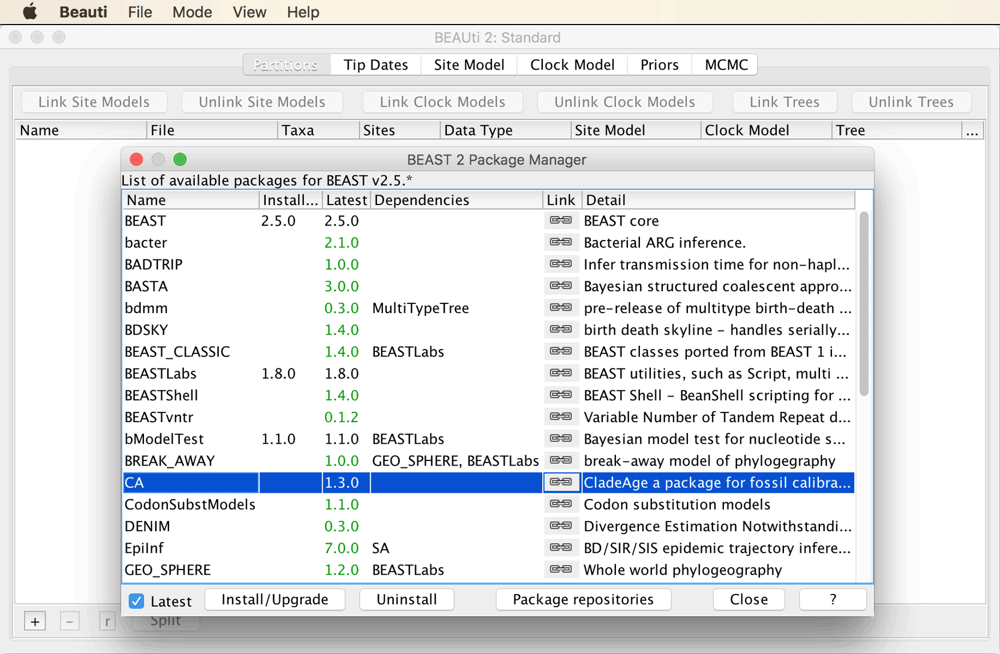

* Close and reopen BEAUti. You should then see that an additional tab has been added named "Clade Age", as in the screenshot below.
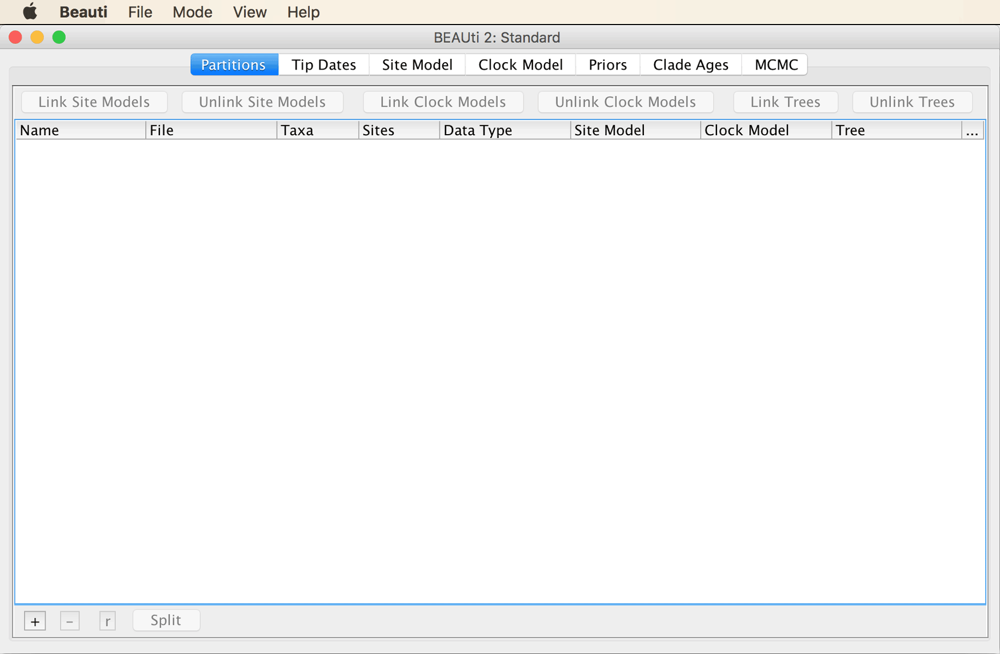

* Now click on "Import Alignment" in the "File" menu, and select file [`Near_et_al_red.nex`](data/Near_et_al_red.nex). BEAUti should then recognize 30 different partitions, one for each codon position of each of the ten markers. The BEAUti window should then look as shown in the screenshot below.
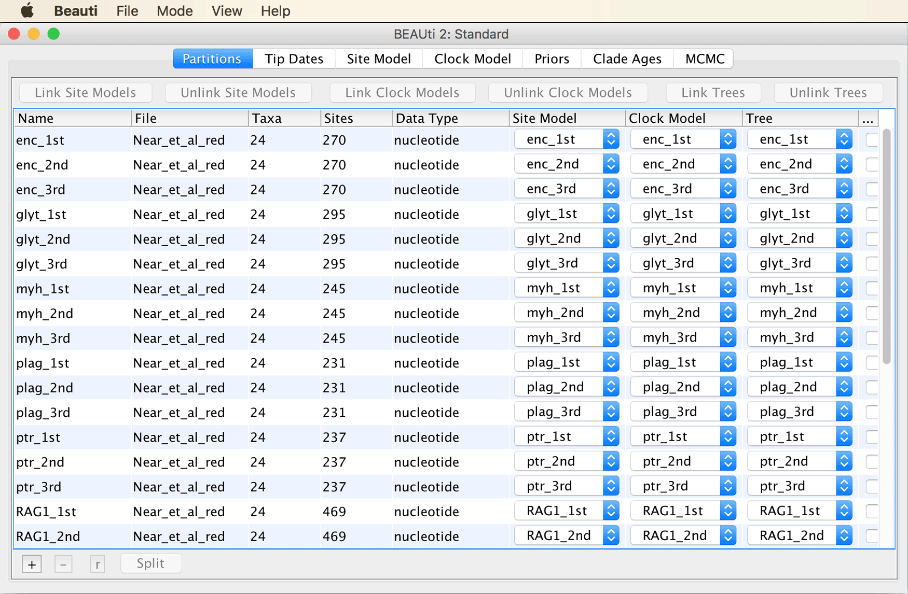

* Select all partitions, and click "Link Trees" as well as "Link Clock Models", as shown below.
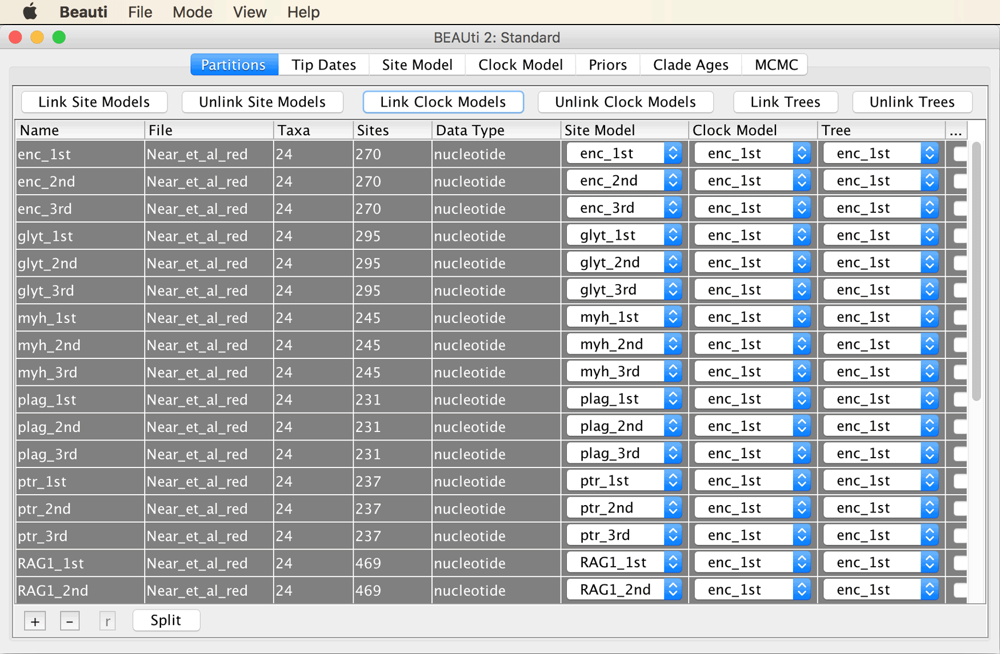

* Go the the "Site Model" tab, and select "BEAST Model Test" from the drop-down menu at the top of the window, as shown below (if this option is not available for you then you probably did not run the tutorial [Bayesian Phylogenetic Inference](../bayesian_phylogeny_inference/README.md) - you can find more information on the background and the installation of the bModelTest model in that tutorial).
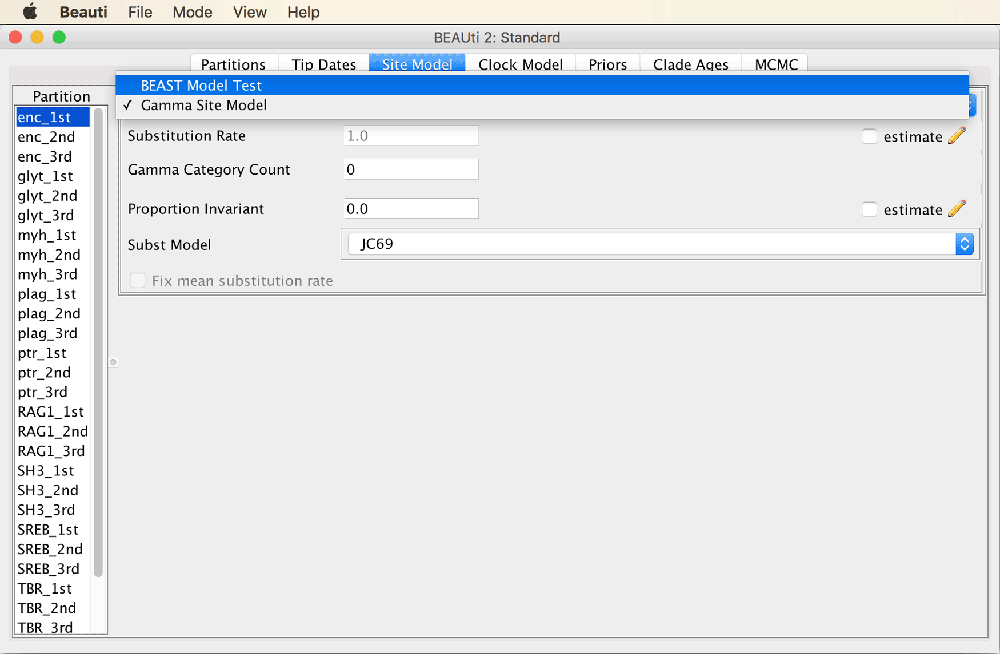

* As in tutorial [Bayesian Phylogenetic Inference](../bayesian_phylogeny_inference/README.md), select "namedSelected" from the drop-down menu that at first had "transitionTransversionSplit" selected. Leave the checkbox next to "Empirical" unticked to allow estimation of nucleotide frequencies. Then, again set the tick to the right of "Mutation Rate" to specify that this rate should be estimated. The window should then look as in the next screenshot.
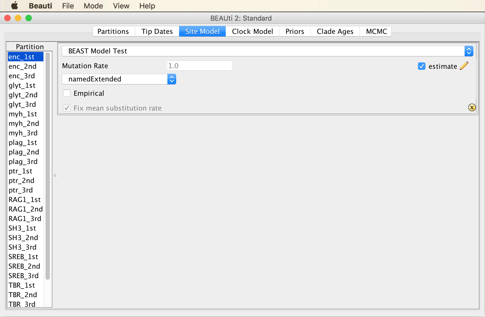

* Select all partitions in the list at the left of the window, and click "OK" to clone the substitution model from the first partition to all other partitions, as shown below.
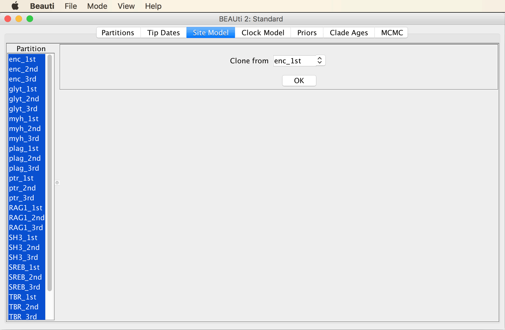

* In the "Clock Model" tab, again select the "Relaxed Clock Log Normal" clock model, as shown in the next screenshot.
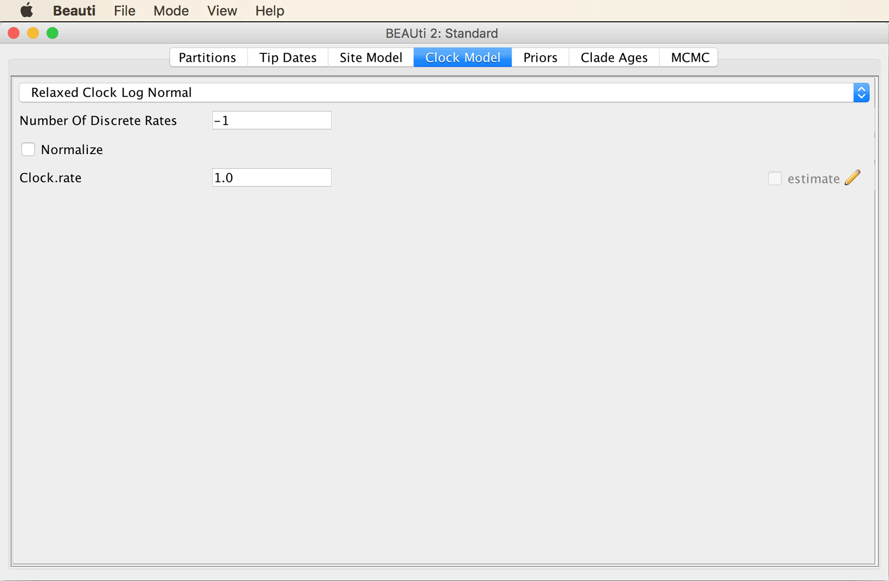

* Because we are going to calibrate the molecular clock with fossil constraints, we should allow the clock rate to be estimated. By default, however, the checkbox that we would need to tick, next to "estimate" at the bottom right, is disabled. To enable this checkbox, click on "Automatic set clock rate" in BEAUti's "Mode" menu as shown in the net screenshot.
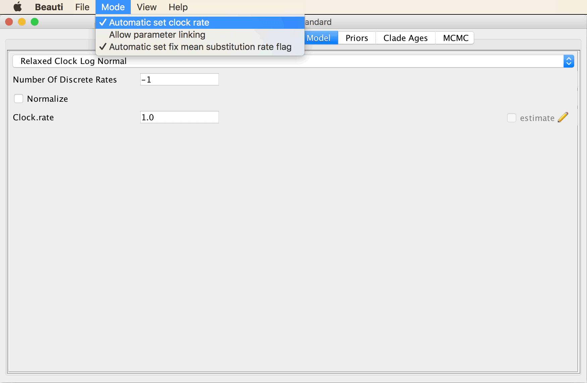

* You should then be able to set a tick in the checkbox at the bottom right as shown below to allow the estimation of the clock rate.
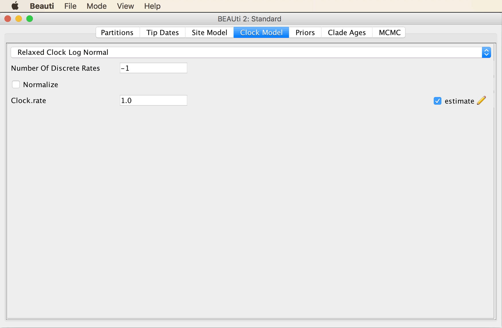

* In the "Priors" tab, again select the "Birth Death Model" as the tree prior, from the drop-down menu at the very top of the window, as shown below.
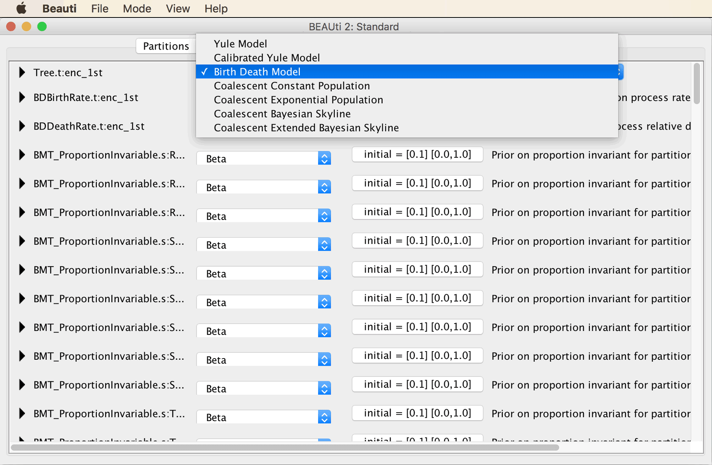

* Instead of specifying constraints on monophyly and divergence times in the "Priors" tab as we did in tutorial [Bayesian Phylogenetic Inference](../bayesian_phylogeny_inference/README.md), this can now be done in the separate tab named "Clade Ages". Open that tab and click on the "+ Add Prior" button, as shown in the next screenshot.
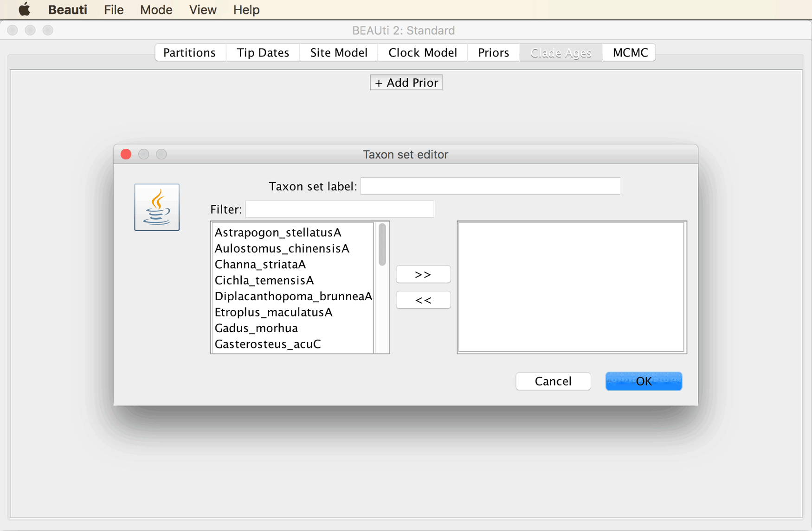

* We will now have to specify a rather long list of constraints to make the best possible use of the information provided by the fossil record and to obtain divergence time estimates that are as reliable as possible given our dataset. We'll start simple by specifying that the origin of African cichlid tribe *Heterochromini*, represented in our dataset by *Heterochromis multidens*, must have occurred at least 15.97-33.9 million years ago (Ma), since this is the age of the oldest fossil of Heterochromi, which was reported from the Baid Formation of Saudi Arabia by [Lippitsch and Micklich (1998)](https://www.tandfonline.com/doi/abs/10.1080/11250009809386810). Thus, specify "Heterochromini" in the field next to "Taxon set label", and select only "Heterochromis\_multidensA" as the ingroup of this taxon set, as shown below.
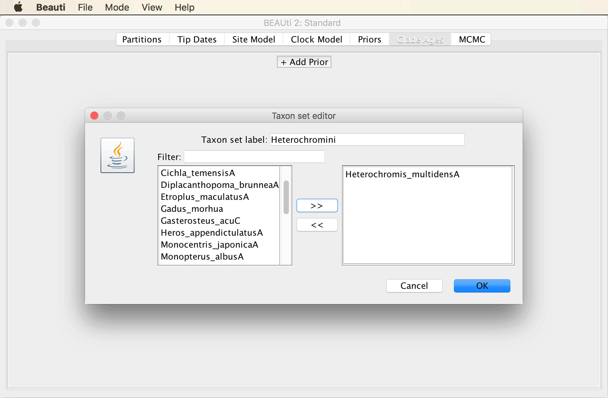

* After you click "OK", you'll see the following window, in which you can specify minimum and maximum values for the parameters net diversification rate, turnover rate, and sampling rate. Based on these values as well as the fossil age, the CladeAge model is going to automatically determine the optimal shape of the prior density used for each constraint. The CladeAge model thus removes the previous requirement of specifying these densities manually, which in practice were usually specified rather arbitrarily. This practice is problematic because the shape of prior densities for age calibrations are known to have a great influence on the resulting divergence-time estimates, which was the main motivation for me to develop the CladeAge model. However, note that other solutions to the same problem exist, such as the Fossilized Birth-Death model ([Heath et al. 2014](http://www.pnas.org/content/111/29/E2957); [Gavryushkina et al. 2017](https://academic.oup.com/sysbio/article/66/1/57/2670056)) that will also be presented in this tutorial.
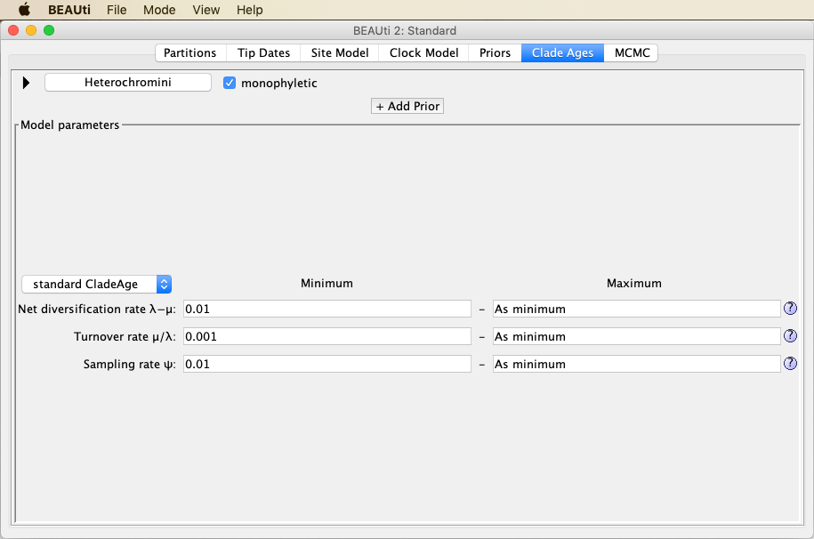

* While it might sometimes be preferable to estimate the net diversification (speciation  minus extinction) and turnover (extinction divided by speciation) rates as part of the analysis, this is not implemented in the CladeAge model yet. Instead, the values for the two parameters have to be specified *a priori*, together with the "sampling rate", the rate at which fossils that are eventually sampled by scientists were once deposited in the fossil record. Fortunately, estimates for these three rates can be found in the literature, and the confidence intervals for these estimates can be accounted for by the CladeAge model. Here, as in [Matschiner et al. (2017)](https://academic.oup.com/sysbio/article/66/1/3/2418030), we adopt teleost-specific estimates for net diversification and turnover from [Santini et al. (2009)](https://bmcevolbiol.biomedcentral.com/articles/10.1186/1471-2148-9-194), and a sampling-rate estimate for bony fishes from [Foote and Miller (2007)](https://books.google.ch/books/about/Principles_of_Paleontology.html?id=8TsDC2OOvbYC&redir_esc=y). These estimates are 0.041-0.081 for the net diversification rate, 0.0011-0.37 for the turnover, and 0.0066-0.01806 for the sampling rate. Thus, enter these ranges as shown in the next screenshot. Don't change the selection of "empirical CladeAge" in the drop-down menu to the left.
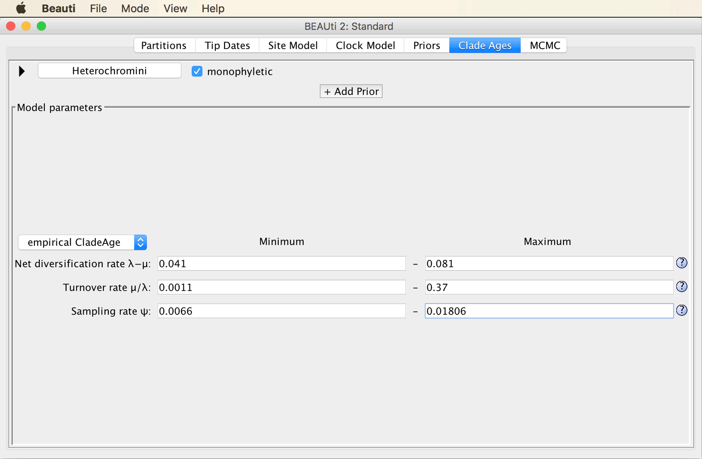

* While these three rate estimates are going to apply to all fossil constraints, information specific to the fossil constraint still must be added. To do so for the constraint on the age of Heterochromini, click on the triangle to the left of "Heterochromini". You'll see four more fields in which you can specify minimum and maximum values for the "First occurrence age" (the age of the oldest fossil of the clade) and a "Sampling gap". This sampling gap is supposed to represent a period of time right after the origin of the clade during which one might assume that either fossilization is unlikely (for example because the clade's population might still be too small) or that fossils would not be recognized as belonging to that clade (because it might not have evolved diagnostic characters yet). We are going to ignore the possibility of a sampling gap here. So, just specify the known age of the oldest fossil of Heterochromini in million of years, 15.97-33.9, as shown below:
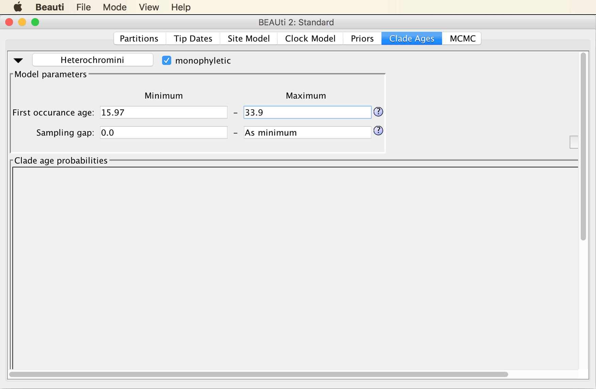

* It is also possible to preview the shape of the prior densities as calculated by CladeAge based on the specified parameters. To do so, you may have to increase the window size so that you can click on the "Preview" button below the icon on the right. A plot outlining the prior densities should then appear as in the screenshot below.
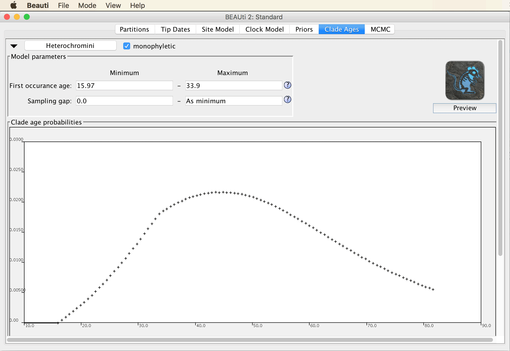
From this plot, you can see that under the assumption that all specified model parameters are correct, there's a good probability that Heterochromini originated some time between 25 and 80 Ma. While this range is rather wide, it is based on only one fossil; we will obtain more precise estimates when we run the phylogenetic analysis with multiple fossil constraints.

* Click the triangle to the left of "Heterochromini" again to close the section with details on this fossil constraint, and add further fossil constraints for the following clades (see the Supplementary Material of [Matschiner et al. 2017](https://academic.oup.com/sysbio/article/66/1/3/2418030) if interested in details and references):
	* **"Other African cichlid tribes"** Ingroup: *Oreochromis niloticus* ("Oreochromis\_niloticus") Oldest fossil species: *Mahengechromis* spp. First occurrence age: 45.0-46.0 Ma
	* **"African cichlids"** Ingroup: *Heterochromis multidens* ("Heterochromis\_multidensA"), *Oreochromis niloticus* ("Oreochromis\_niloticus") Oldest fossil species: *Mahengechromis* spp. First occurrence age: 45.0-46.0 Ma
	* **"Retroculini and Cichlini"** Ingroup: *Cichla temensis* ("Cichla\_temensisA") Oldest fossil species: *Palaeocichla longirostrum* First occurrence age: 5.332-23.03 Ma
	* **"Other Neotropical cichlid tribes"** Ingroup: *Heros appendictulatus* ("Heros\_appendictulatusA") Oldest fossil species: *Plesioheros chauliodus* First occurrence age: 39.9-45.0 Ma
	* **"Neotropical cichlids"** Ingroup: *Cichla temensis* ("Cichla\_temensisA"), *Heros appendictulatus* ("Heros\_appendictulatusA") Oldest fossil species: *Plesioheros chauliodus* First occurrence age: 39.9-45.0 Ma
	* **"Afro-American cichlids"** Ingroup: *Cichla temensis* ("Cichla\_temensisA"), *Heros appendictulatus* ("Heros\_appendictulatusA"), *Heterochromis multidens* ("Heterochromis\_multidensA"), *Oreochromis niloticus* ("Oreochromis\_niloticus") Oldest fossil species: *Mahengechromis* spp. First occurrence age: 45.0-46.0 Ma
	* **"Cichlids"** *Cichla temensis* ("Cichla\_temensisA"), *Etroplus maculatus* ("Etroplus\_maculatusA"), *Heros appendictulatus* ("Heros\_appendictulatusA"), *Heterochromis multidens* ("Heterochromis\_multidensA"), *Oreochromis niloticus* ("Oreochromis\_niloticus") Oldest fossil species: *Mahengechromis* spp. First occurrence age: 45.0-46.0 Ma
	* **"Atherinomorphae"** Ingroup: *Oryzias latipes* ("Oryzias\_latipes") Oldest fossil species: *Rhamphexocoetus volans* First occurrence age: 49.1-49.4 Ma
	* **"Ovalentaria"** Ingroup: *Cichla temensis* ("Cichla\_temensisA"), *Etroplus maculatus* ("Etroplus\_maculatusA"), *Heros appendictulatus* ("Heros\_appendictulatusA"), *Heterochromis multidens* ("Heterochromis\_multidensA"), *Oreochromis niloticus* ("Oreochromis\_niloticus"), *Oryzias latipes* ("Oryzias\_latipes") Oldest fossil species: *Rhamphexocoetus volans* First occurrence age: 49.1-49.4 Ma
	* **"Carangaria"** Ingroup: *Trachinotus carolinus* ("Trachinotus\_carolinusA") Oldest fossil species: *Trachicaranx tersus* First occurrence age: 55.8-57.23 Ma
	* **"Anabantiformes"** Ingroup: *Channa striata* ("Channa\_striataA") Oldest fossil species: *Osphronemus goramy* First occurrence age: 45.5-50.7 Ma
	* **"Anabantaria"** Ingroup: *Channa striata* ("Channa\_striataA"), *Monopterus albus* ("Monopterus\_albusA") Oldest fossil species: *Osphronemus goramy* First occurrence age: 45.5-50.7 Ma
	* **"Eupercaria"** Ingroup: *Gasterosteus aculeatus* ("Gasterosteus_acuC") Oldest fossil species: *Cretatriacanthus guidottii* First occurrence age: 83.5-99.6 Ma
	* **"Gobiaria"** Ingroup: *Astrapogon tellatus* ("Astrapogon\_stellatusA") Oldest fossil species: *"Gobius" gracilis* First occurrence age: 30.7-33.9 Ma
	* **"Syngnatharia"** Ingroup: *Aulostomus chinensis* ("Aulostomus\_chinensisA") Oldest fossil species: *Prosolenostomus lessinii* First occurrence age: 49.1-49.4 Ma
	* **"Pelagaria"** Ingroup: *Thunnus albacares* ("Thunnus\_albacaresA") Oldest fossil species: *Eutrichiurides opiensis* First occurrence age: 56.6-66.043 Ma
	* **"Batrachoidiaria"** Ingroup: *Porichthys notatus* ("Porichthys\_notatusA") Oldest fossil species: *Louckaichthys novosadi* First occurrence age: 27.82-33.9 Ma
	* **"Ophidiaria"** Ingroup: *Diplacanthopoma brunnea* ("Diplacanthopoma\_brunneaA") Oldest fossil species: *Eolamprogrammus senectus* First occurrence age: 55.8-57.23 Ma
	* **"Percomorphaceae"** Ingroup: *Astrapogon tellatus* ("Astrapogon\_stellatusA"), *Aulostomus chinensis* ("Aulostomus\_chinensisA"), *Channa striata* ("Channa\_striataA"), *Cichla temensis* ("Cichla\_temensisA"), *Diplacanthopoma brunnea* ("Diplacanthopoma\_brunneaA"), *Etroplus maculatus* ("Etroplus\_maculatusA"), *Gasterosteus aculeatus* ("Gasterosteus_acuC"), *Heros appendictulatus* ("Heros\_appendictulatusA"), *Heterochromis multidens* ("Heterochromis\_multidensA"), *Monopterus albus* ("Monopterus\_albusA"), *Oreochromis niloticus* ("Oreochromis\_niloticus"), *Oryzias latipes* ("Oryzias\_latipes"), *Porichthys notatus* ("Porichthys\_notatusA"), *Thunnus albacares* ("Thunnus\_albacaresA"), *Trachinotus carolinus* ("Trachinotus\_carolinusA") Oldest fossil species: *Cretatriacanthus guidottii* First occurrence age: 83.5-99.6 Ma
	* **"Holocentrimorphaceae"** Ingroup: *Sargocentron cornutum* (Sargocentron\_cornutumA) Oldest fossil species: *Caproberyx pharsus* First occurrence age: 97.8-99.1 Ma
	* **"Acanthopterygii"** Ingroup: *Astrapogon tellatus* ("Astrapogon\_stellatusA"), *Aulostomus chinensis* ("Aulostomus\_chinensisA"), *Channa striata* ("Channa\_striataA"), *Cichla temensis* ("Cichla\_temensisA"), *Diplacanthopoma brunnea* ("Diplacanthopoma\_brunneaA"), *Etroplus maculatus* ("Etroplus\_maculatusA"), *Gasterosteus aculeatus* ("Gasterosteus_acuC"), *Heros appendictulatus* ("Heros\_appendictulatusA"), *Heterochromis multidens* ("Heterochromis\_multidensA"), *Monocentris japonica* ("Monocentris\_japonicaA"), *Monopterus albus* ("Monopterus\_albusA"), *Oreochromis niloticus* ("Oreochromis\_niloticus"), *Oryzias latipes* ("Oryzias\_latipes"), *Porichthys notatus* ("Porichthys\_notatusA"), *Rondeletia loricata* ("Rondeletia\_loricataA"), *Thunnus albacares* ("Thunnus\_albacaresA"), *Trachinotus carolinus* ("Trachinotus\_carolinusA"), *Sargocentron cornutum* (Sargocentron\_cornutumA) Oldest fossil species: *Caproberyx pharsus* First occurrence age: 97.8-99.1 Ma
	* **"Polymixiipterygii"** Ingroup: *Polymixia japonica* ("Polymixia\_japonicaA") Oldest fossil species: *Homonotichthys rotundus* First occurrence age: 93.5-96.0 Ma
	* **"Percopsaria"** Ingroup: *Percopsis omiscomaycus* ("Percopsis\_omiscomaycusA") Oldest fossil species: *Mcconichthys longipinnis* First occurrence age: 61.1-66.043 Ma
	* **"Zeiariae"** Ingroup: *Zenopsis conchifera* ("Zenopsis\_conchiferaB") Oldest fossil species: *Cretazeus rinaldii* First occurrence age: 69.2-76.4 Ma
	* **"Gadiformes"** Ingroup: *Gadus morhua* ("Gadus\_morhua") Oldest fossil species: *Protacodus* sp. First occurrence age: 59.7-62.8 Ma
	* **"Paracanthopterygii"** Ingroup: *Gadus morhua* ("Gadus\_morhua"), *Percopsis omiscomaycus* ("Percopsis\_omiscomaycusA"), *Stylephorus chordatus* ("Stylephorus\_chordatusB"), *Zenopsis conchifera* ("Zenopsis\_conchiferaB") Oldest fossil species: *Cretazeus rinaldii* First occurrence age: 69.2-76.4 Ma

	Once all these constraints are added, the BEAUti window should look as shown below.
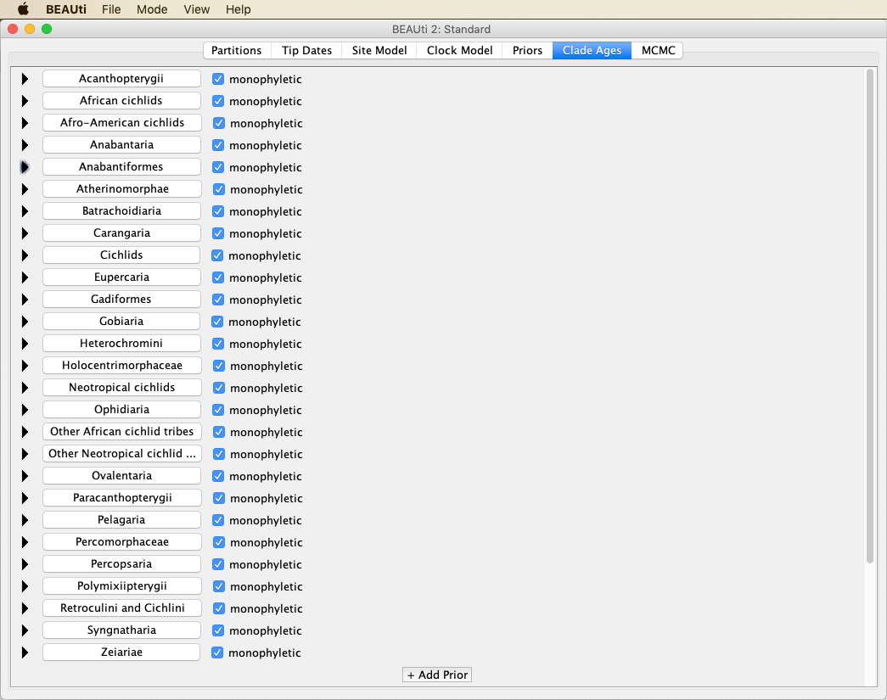

* Move on to the "MCMC" tab. Specify again an MCMC chain length of 100 million iterations, name the log file `Near_et_al_red.log` and the tree file `Near_et_al_red.trees`. The BEAUti window should then look as in the next screenshot.
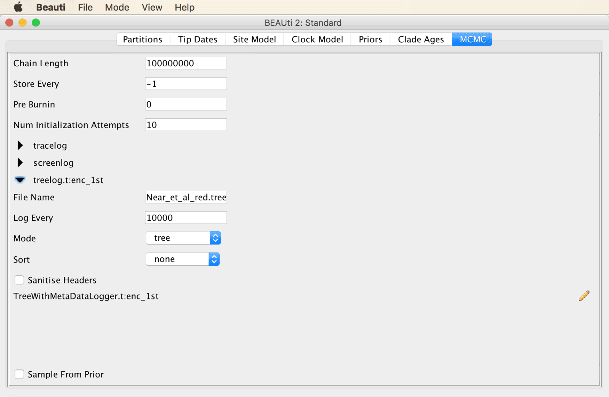

* Save the analysis settings to a new file named `Near_et_al_red.xml` by clicking "Save As" in BEAUti's "File" menu.

* Open BEAST2, load file [`Near_et_al_red.xml`](data/Near_et_al_red.xml) as in the screenshot below, and try running the MCMC analysis.
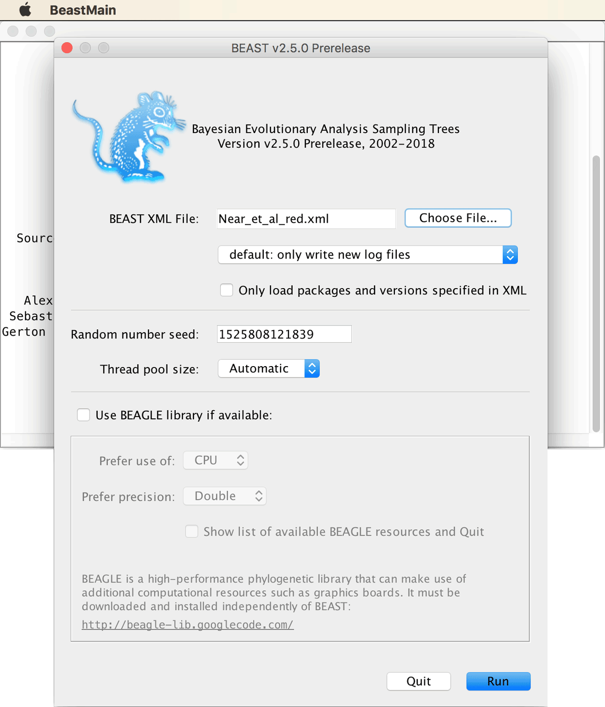
Most likely, the MCMC analysis is going to crash right at the start with an error message as shown below.
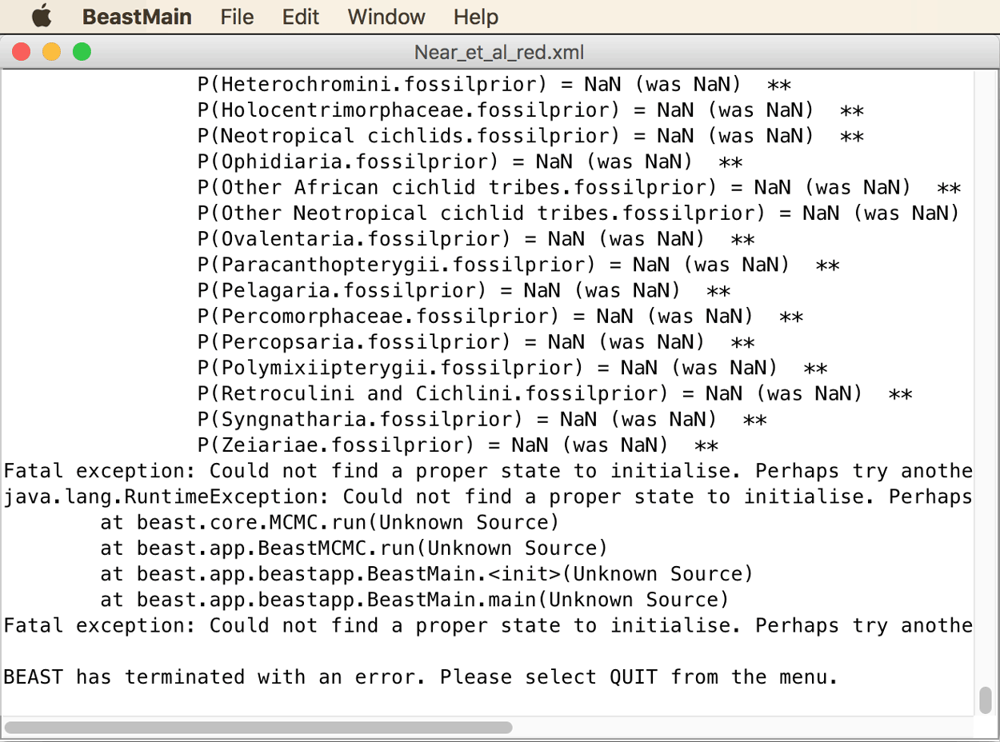
This is a common problem when several fossil constraints are specified: According to the error message, BEAST2 could not find a proper state to initialise. This means that even after several attempts, no starting state of the MCMC chain could be found that had a non-zero probability. Most often, the issue is that the tree that BEAST2 randomly generates to start the chain is in conflict with one or more fossil constraints. Unfortunately, the only way to fix this issue is to manually edit the XML file and specify a starting tree that is in agreement with the specified fossil constraints. In particular, because all fossil constraints imposed hard minimum ages on the origin of the respective clades, this clades must at least be as old as this minimum age in the starting tree. In case of doubt, it is usually safer to make the starting tree too old rather than too young, the course of the MCMC chain should, at least after the burnin, not be influenced by the starting state anymore anyway. Some helpful advice on how to specify starting trees is provided on the [BEAST2](https://www.beast2.org/fix-starting-tree/) webpage. With trees of hundreds of taxa, generating a suitable starting tree can be a tricky task in itself, but with the small number of 24 species used here, it was easier to write a starting tree by hand.

* Copy and paste the below starting tree string into a new FigTree window.

		((((((((((((((Oreochromis_niloticus:50,Heterochromis_multidensA:50):10,(Cichla_temensisA:50,Heros_appendictulatusA:50):10):10,Etroplus_maculatusA:70):30,Oryzias_latipes:100):10,(Trachinotus_carolinusA:70,(Channa_striataA:60,Monopterus_albusA:60):10):40):10,Gasterosteus_acuC:120):10,Astrapogon_stellatusA:130):10,(Aulostomus_chinensisA:80,Thunnus_albacaresA:80):60):10,Porichthys_notatusA:150):10,Diplacanthopoma_brunneaA:160):10,Sargocentron_cornutumA:170):10,(Rondeletia_loricataA:100,Monocentris_japonicaA:100):80):10,Polymixia_japonicaA:190):10,((((Gadus_morhua:70,Stylephorus_chordatusB:70):10,Zenopsis_conchiferaB:80):10,Percopsis_omiscomaycusA:90):10,Regalecus_Glesne:100):100)
		
	As you'll see, I just arbitrarily specified for most branches a length of 10 million years, and I made sure that particularly the more recent divergence events agree with the respective fossil constraints (e.g. by placing the divergence of *Oreochromis niloticus* and *Heterochromis multidens* at 50 Ma because the origin of the clade "Other African cichlid tribes", represented by *Oreochromis niloticus* is constrained to be at least 45 Ma)
	
* Now, open file [`Near_et_al_red.xml`](data/Near_et_al_red.xml) in a text editor and find the following block on lines 335-340.

		<init id="RandomTree.t:ZIC_2nd" spec="beast.evolution.tree.RandomTree" estimate="false" initial="@Tree.t:enc_1st">
			<taxa id="ZIC_2nd" spec="FilteredAlignment" data="@Near_et_al_red" filter="7697-8576\3"/>
			<populationModel id="ConstantPopulation0.t:ZIC_2nd" spec="ConstantPopulation">
				<parameter id="randomPopSize.t:ZIC_2nd" name="popSize">1.0</parameter>
			</populationModel>
		</init>

* Replace the above block with the code below, which contains the starting tree string:

		<init spec="beast.util.TreeParser" id="NewickTree.t:enc_1st"
			initial="@Tree.t:enc_1st"
			IsLabelledNewick="true"
			newick="((((((((((((((Oreochromis_niloticus:50,Heterochromis_multidensA:50):10,(Cichla_temensisA:50,Heros_appendictulatusA:50):10):10,Etroplus_maculatusA:70):30,Oryzias_latipes:100):10,(Trachinotus_carolinusA:70,(Channa_striataA:60,Monopterus_albusA:60):10):40):10,Gasterosteus_acuC:120):10,Astrapogon_stellatusA:130):10,(Aulostomus_chinensisA:80,Thunnus_albacaresA:80):60):10,Porichthys_notatusA:150):10,Diplacanthopoma_brunneaA:160):10,Sargocentron_cornutumA:170):10,(Rondeletia_loricataA:100,Monocentris_japonicaA:100):80):10,Polymixia_japonicaA:190):10,((((Gadus_morhua:70,Stylephorus_chordatusB:70):10,Zenopsis_conchiferaB:80):10,Percopsis_omiscomaycusA:90):10,Regalecus_Glesne:100):100)">
			<taxa id="ZIC_2nd" spec="FilteredAlignment" data="@Near_et_al_red" filter="7697-8576\3"/>
		</init>

* Save the file after adding the tree string, open it again in BEAST2, and try running the analysis again. This time, the MCMC should begin to run.

	**Question 1:** How long does BEAST2 take for one million iterations this time? [(see answer)](#q1)

As in tutorial [Bayesian Phylogenetic Inference](../bayesian_phylogeny_inference/README.md) you could cancel the BEAST2 analysis after some time if you don't want to wait for it to finish, and you could instead continue the rest of tutorial with the results from my analysis (files [`Near_et_al_red.log`](res/Near_et_al_red.log) and [`Near_et_al_red.trees`](res/Near_et_al_red.trees)). However, you could keep the analysis running at least while you go through the next part of the tutorial in which we set up another BEAST2 analysis with the Fossilized Birth-Death model.

## Divergence-time estimation with the FBD model

As the CladeAge approach, the FBD model also assumes a time-homogeneous rate at which fossils (the subset of fossils that are eventually found) are deposited in the sediment. However, unlike the CladeAge approach, the FBD approach was not explicitly developed for a data set of diverse lineages that includes fossil information only for the oldest representatives of these lineages. As a consequence, the FBD approach does not require specification of estimates for the diversification, turnover, and fossil-sampling rates, but it is able to estimate these parameters if the dataset conforms to model expectations. This means that the data set should contain all known extant and fossil lineages, or a randomly sampled set of these lineages, of the clade descending from the root of the phylogeny. Alternatively, these parameters can also be fixed, in which case the FBD approach has been shown to produce the same results as the CladeAge approach with fixed parameters ([Matschiner et al. 2017](https://academic.oup.com/sysbio/article/66/1/3/2418030)) even if only the oldest fossils of each clade are used. Here, we are going to use the FBD approach with the same dataset of sequences and fossil information that we also used with the CladeAge approach. This dataset violates the model of the FBD process, in two ways: First, the included extant species are not randomly sampled from the clade of spiny-rayed fishes but instead were chosen because they represent particularly old lineages. Second, of each clade, only the oldest known fossil of the clade is used for calibration. Despite these violations that might lead to bias in the estimation of the diversification and sampling parameters, we are not going to fix these parameters as we do not know their true values. Instead we are going to again specify ranges of uncertainty for these parameters, similar to how we did this in the analyses with the CladeAge approach. 
Note that a far more extensive tutorial on divergence-time estimation with the FBD model is available at the [Taming the BEAST](https://taming-the-beast.org/tutorials/FBD-tutorial/FBD-tutorial.pdf) website, which you might find useful if you'ld like to learn more about this type of analysis.

* In contrast to CladeAge, the FBD model considers fossils as tips in the phylogeny that are assumed to result from a joint process of diversification and fossilization, the Fossilized Birth-Death process. This means that fossils should be included as taxa in the Nexus input file, even if no molecular or morphological character information is available for them. In that case, the phylogenetic position of the fossils will be determined exclusively based on taxonomic constraints (which, just like in the CladeAge approach, assumes that the taxonomic affiliation is known without error). Thus, as a first step, we'll need to include the fossil species from the above list of fossil constraints in the Nexus-format alignment file. At the same time, we'll add to each species name the age of this species: For the extant species for which we have sequence data, this age is 0, and for fossil species, the age will be sampled at random from the ranges of uncertainty for the fossil age, as given in the list above. For example, for the fossil species *Palaeocichla longirostrum*, the oldest fossil of the Neotropical cichlid tribe Cichlini ([Bardack 1961](http://digitallibrary.amnh.org/handle/2246/3477)) which is thought to be Miocene in age, an age will be picked at random from the age range corresponding to the Miocene, 5.332-23.03 Ma. Note, however, that these randomly drawn ages will only be used as starting values for fossil ages in the MCMC; the full range of uncertainty will later be accounted for through prior densities that we will add manually to the XML file. To include fossil species as taxa in the Nexus file and at the same time include ages in the names used for extant and fossil taxa, you can use the Ruby script [`add_fossils_to_nexus.rb`](src/add_fossils_to_nexus.rb). As input, this script requires the Nexus-format alignment file [`Near_et_al_red.nex`](data/Near_et_al_red.nex) as well as a tab-delimited table of species names and ages for all fossils, which you can find in file [`fossil_ids.txt`](data/fossil_ids.txt). Use the following command to specify these two input files and write the output to a new file named `Near_et_al_red_fossils.nex`.

		ruby add_fossils_to_nexus.rb Near_et_al_red.nex fossil_ids.txt Near_et_al_red_fossils.nex
		
* Have a brief look at both the file with the table of fossil information [`fossil_ids.txt`](data/fossil_ids.txt) and the resulting alignment that includes the fossil species [`Near_et_al_red_fossils.nex`](data/Near_et_al_red_fossils.nex), to understand the changes made by the Ruby script.

* Now that the input file is ready, open BEAUti once again, and start the Package Manager by clicking on "Manage Packages" in the "File" menu. Select "CA" and click "Uninstall" as we are not going to need the CladeAge package for the rest of the tutorial.

* Still in the Package Manager, select "SA" and click "Install/Upgrade" to install the "Sampled Ancestors" package that implements the FBD model, as shown below.
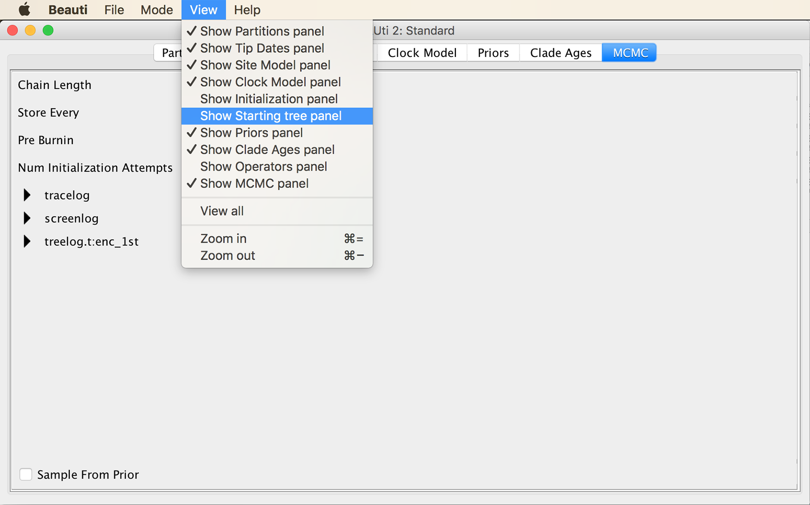

* Close and re-open BEAUti, then load the alignment file [`Near_et_al_red_fossils.nex`](data/Near_et_al_red_fossils.nex) with "Import Alignment" in the BEAUti's "File" menu. The "Partitions" tab should then look just as it did previously when you loaded the alignment without fossils from file [`Near_et_al_red.nex`](data/Near_et_al_red.nex):

* Again, select all partitions and click on "Link Trees" and "Link Clock Models", as shown below.

* This time, do not skip the "Tip Dates" tab. When you click on it, the window should look as shown in the next screenshot.
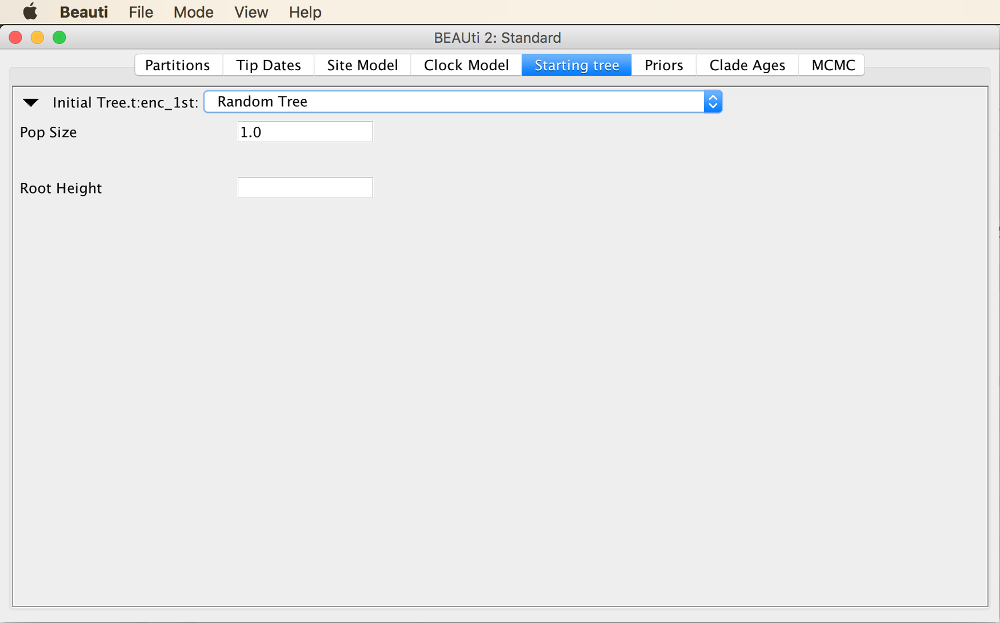

* Set a tick in the checkbox for "Use tip dates". The window will then look as shown below.
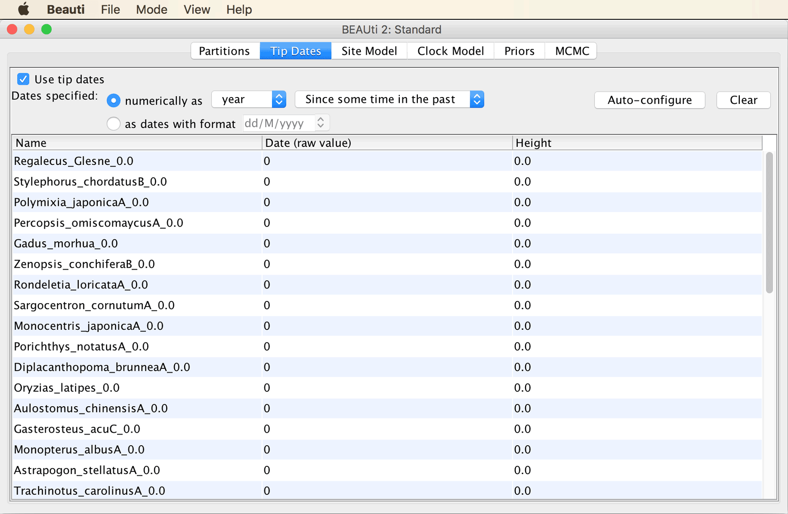

* We now have to specify the direction and the unit in which the ages of fossil (and extant) species are given. To the right of "Dates specified:", keep the selection of "numerically as ..."; the alternative option of "as dates with format..." would only be useful if we would build a phylogeny of rapidly evolving virus sequences. In the drop-down menu to the right of "numerically as ..." use "year" as the unit of time even though the ages are in fact given in millions of years. This will not make a difference as long as we interpret the results also in millions of years as we would anyway. In the next drop-down menu, select "Before the present" as shown in the next screenshot.
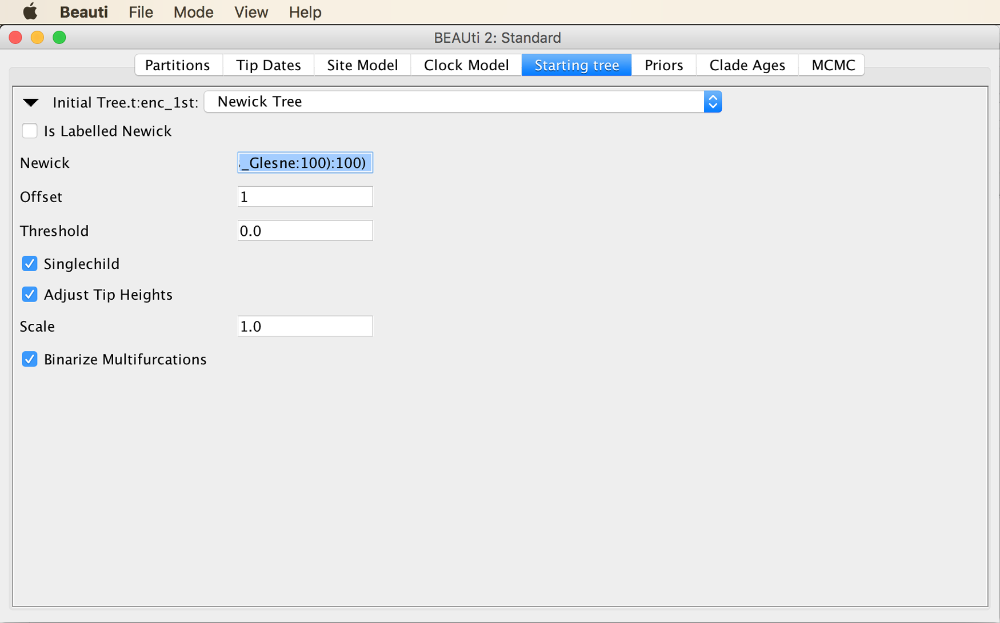

* Click on the "Auto-configure" button in the top right of the window, which should open a pop-up window as shown below.

* Change the drop-down menu at the top of the pop-up window to "after last", and keep the underscore in the field to the right of it, as shown in the below screenshot. This specifies that BEAUti should interpret the text after the last underscore symbol in each species id as the age of the species
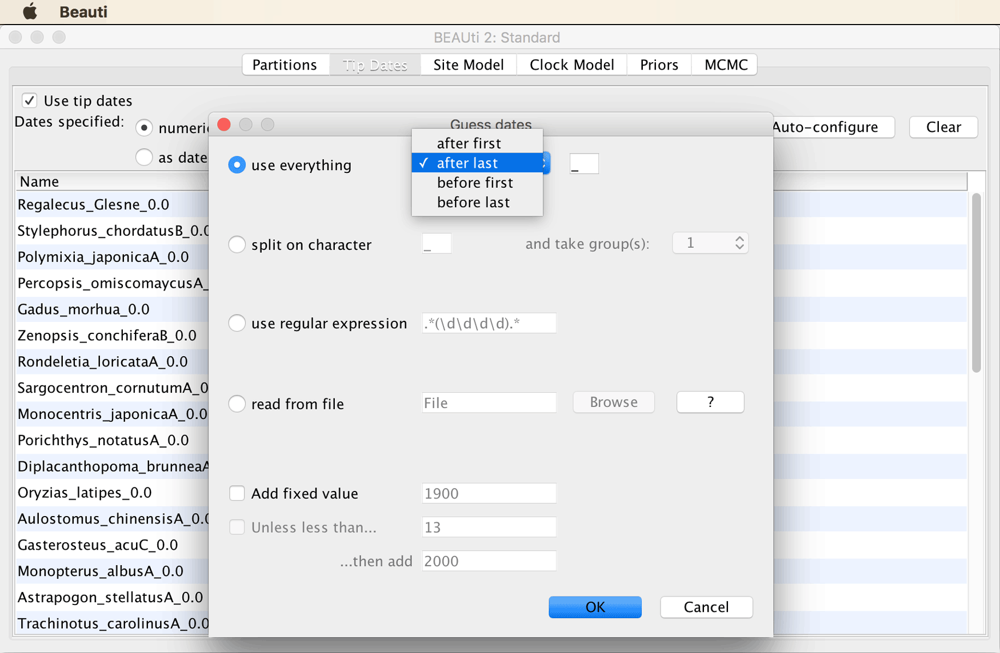

* When you click "OK" and scroll down in the list shown in the "Tip Dates" tab, you should see that the ages ("Height") of all fossil species have been correctly interpretated while the ages of extant species remain at "0.0", as shown below.

* Next, move on to the "Site Model" tab. As before, select "BEAST Model Test" from the first drop-down menu, "namedExtended" from the second drop-down menu, and set a tick in the checkbox at the right to estimate the mutation rate of this partition. The window should then look as shown in the screenshot below.
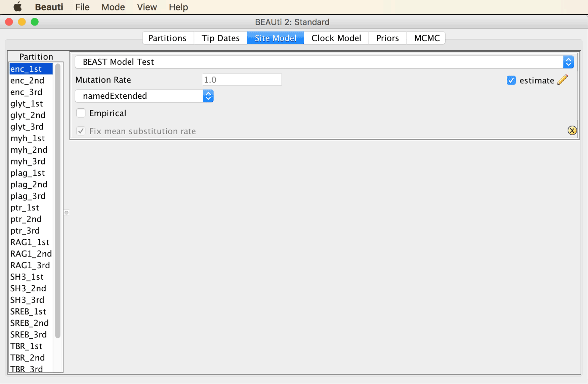

* Again, select all partitions from the list at the left-hand side of the window and click "OK" to clone the substitution model from the first partition to all other partitions, as shown below.
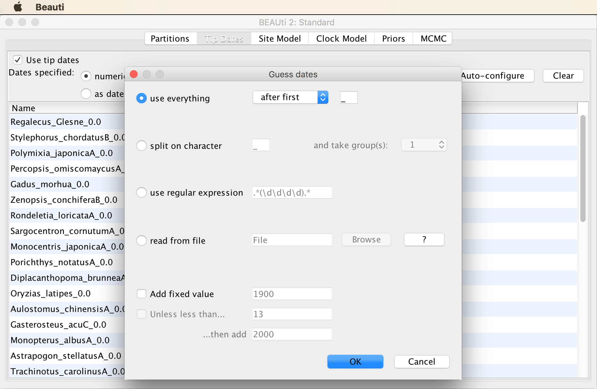

* In the tab for "Clock Model", select once again the "Relaxed Clock Log Normal" model from the drop-down menu and leave all other settings unchanged, as shown below.
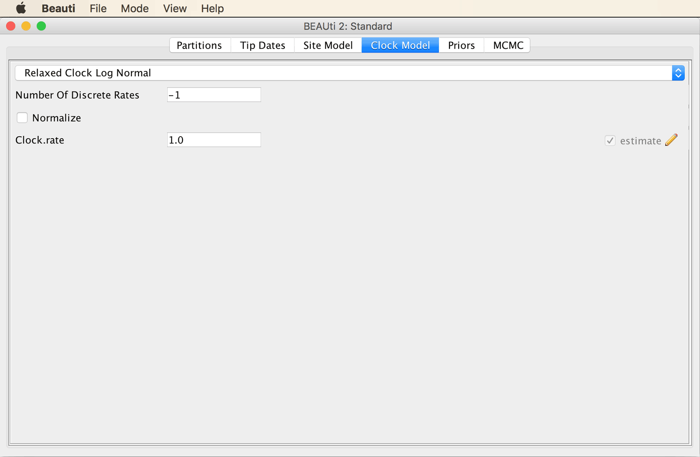

* Move on to the "Priors" tab. This is where we now have to specify, in the first drop-down menu, the "Fossilized Birth Death Model" as the assumed tree-generating process, as shown in the next screenshot.
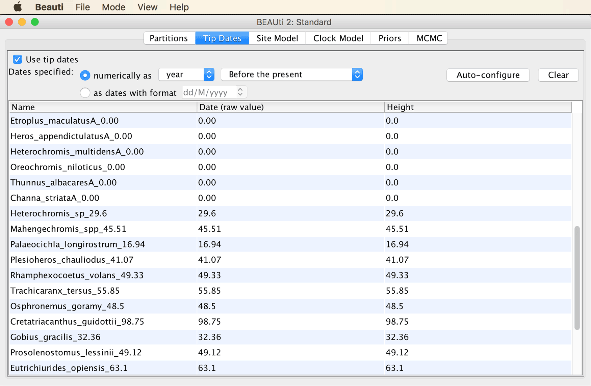

* Click on the black triangle at the left of the first row, next to "Tree.t:enc_1st". This will open the settings for the FBD model, as shown below (you may have to increase the window size to see the checkboxes on the right).

As a first step, set the tick next to "Condition on Root" at the left of the window, to indicate that none of the fossils of our phylogeny are placed on the stem branch of the phylogeny. The field next to "Origin" should then be replaced by a drop-down menu that reads "None", as shown in the following screenshot.
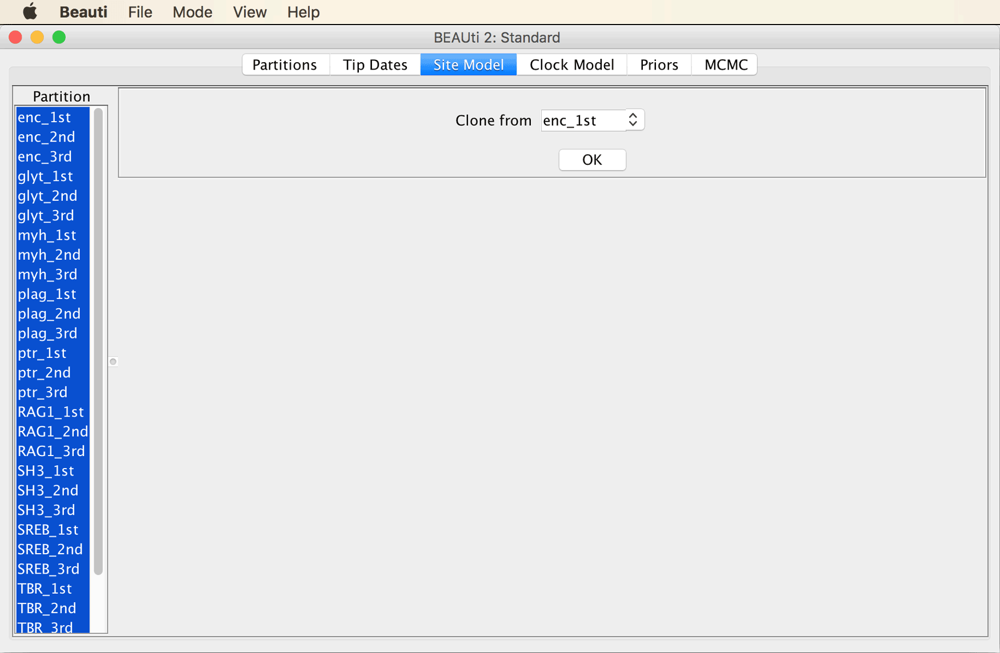
As you'll see we still have to specify parameter values for the "Diversification Rate", the "Turnover", the "Sampling Proportion", and "Rho". Of these, the parameters "Diversification Rate" and "Turnover" correspond to the net diversification rate and the turnover rate as specified in the CladeAge model before. The "Sampling Proportion", however, is not the same as the sampling rate of the CladeAge model. Instead, it is defined as 
*s* = &psi; / (&psi; + &mu;), where &psi; is the sampling rate as used in the CladeAge model and &mu; is the extinction rate ([Gavryushkina et al. 2014; Eqn. 8](http://journals.plos.org/ploscompbiol/article?id=10.1371/journal.pcbi.1003919)). If an estimate of the extinction rate &mu; is not available but the net diversification rate *d* (*d* = &lambda; - &mu;; with &lambda; being the speciation rate) and the turnover *r* (*r* = &mu; / &lambda;) have been estimated, the sampling proportion can be calculated as *s* = &psi; / (&psi; + *rd* / (1 - *r*) ). Parameter "Rho" is the proportion of the sampled extant species among all extant species descending from the root of the phylogeny.

* For the diversification rate, we'll pick a starting value within the range that we used with the CladeAge model (which was 0.041-0.081). Type "0.06" to the right of "Diversification Rate" as shown below.
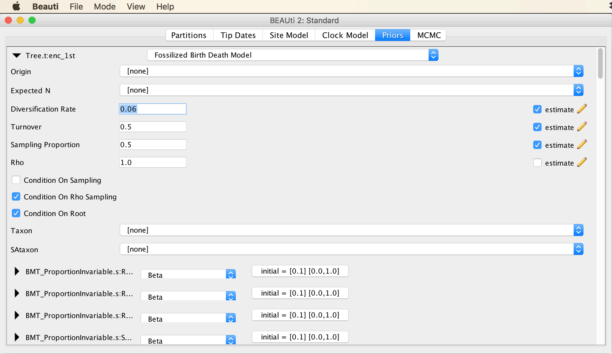

* We'll do the same for the turnover, and specify "0.1" to the right of "Turnover" as shown below. (recall that we had specified a range of 0.0011-0.37 for the turnover in the CladeAge model).

* To specify an appropriate starting value for the sampling proportion *s* we need to consider the equation given above: *s* = &psi; / (&psi; + *rd* / (1 - *r*) ). For the net diversification rate (*d*) and turnover (*r*), we can again assume the values 0.06 and 0.1, respectively, as in the last two steps. For the sampling rate &psi;, we can pick a value from the range used for the CladeAge model. As this range was 0.0066-0.01806, use 0.01 as the estimate for the sampling rate &psi; (keep in mind that these rough estimates only serve to calculate a starting value for the sampling proportion; the uncertainty in these estimates will be taken into account when we define prior densities). With &psi; = 0.01, *d* = 0.06, and *r* = 0.1, we then get *s* = 0.01 / (0.01 + 0.1 &times; 0.06 / (1 - 0.1) ) = 0.6. Use this number as the starting value for the sampling proportion, as shown in below.
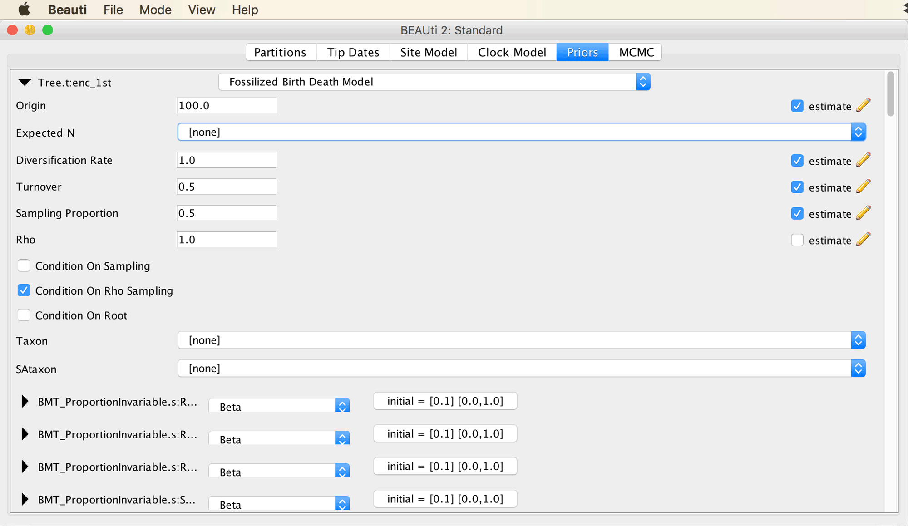

* In contrast to the last three parameters, we don't have to rely on estimates for the proportion of sampled extant taxa, "Rho", but we can directly calculate it. The root of our phylogeny represents the first diversification event of the crown group of Acanthomorphata, an extremely diverse group of fishes with around 15,000 species. Of these we have sampled 24 for our phylogeny, thus the proportion of sampled taxa is 24/15000 = 0.0016. Specify this value to the right of "Rho", as shown in the next screenshot.
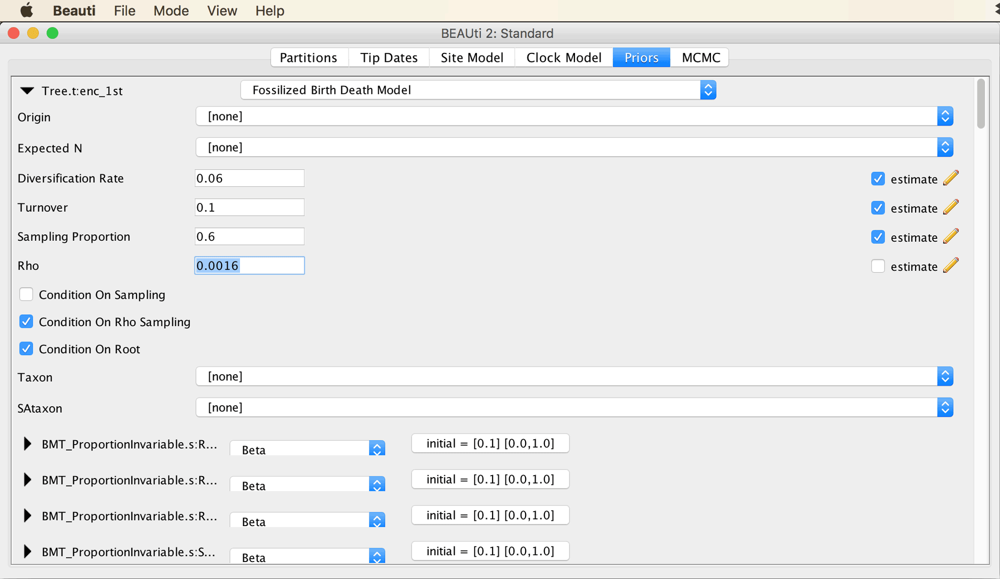
Make sure that the checkbox next to "estimate" at the very right end of this row is not set in contrast to the checkboxes above.

* We still have to specify prior densities for the diversification rate, the turnover, and the sampling rate, the three parameters of the FBD model that will be estimated. You'll find these parameters if you scroll to the very bottom of the "Priors" tab, as shown below.

* Click on the triangle to the left of "diversificationRateFBD.t:...". To replicate the settings that we used for the earlier analyses with the CladeAge model, we'll use again the same range for the diversification rate, taken from [Santini et al. (2009)](https://bmcevolbiol.biomedcentral.com/articles/10.1186/1471-2148-9-194). Thus, make sure that the drop-down menu to the right of "diversificationRateFBD.t:..." reads "Uniform", indicating that a uniformly distributed prior density is used for this parameter. Then, specify "0.041" as the lower boundary, and "0.081" as the upper boundary of this uniform density, as shown in the next screenshot.
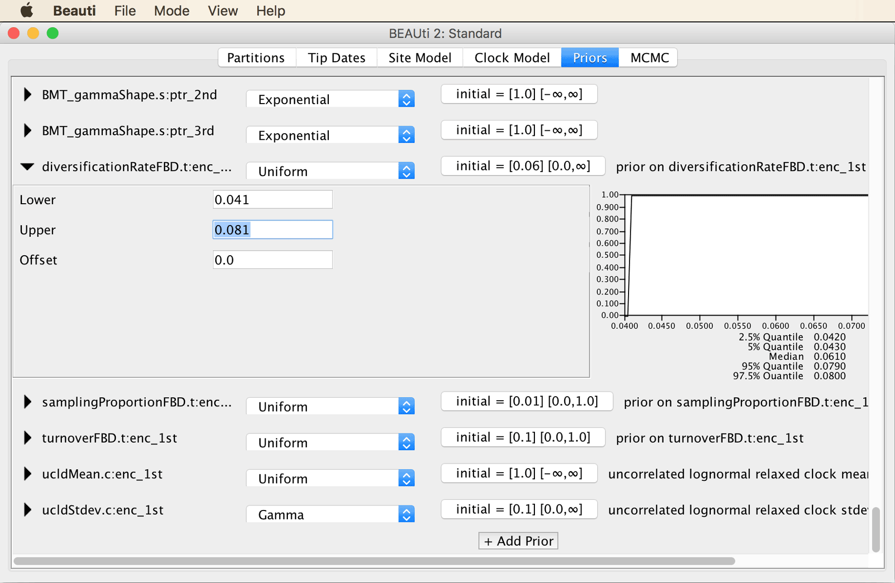

* Click on the triangle next to "diversificationRateFBD.t:..." again to close the settings for this parameter. Instead, open the settings for the sampling-proportion parameter, named "samplingProportionFBD.t:...". As described above, the sampling proportion *s* is *s* = &psi; / (&psi; + *rd* / (1 - *r*) ), with &psi; being the sampling rate as used with CladeAge, *d* being the net diversification rate and *r* being the turnover. The prior density for the sampling proportion *s* therefore needs to take into account the confidence intervals for each of these three parameters. One way to do this is by generating a distribution of *s* values by randomly sampling (many times) values of &psi;, *d*, and *r* from their confidence intervals, and calculating *s* for each of the sampled combinations of these three parameters. This results in a distribution for *s* as shown in the plot below.
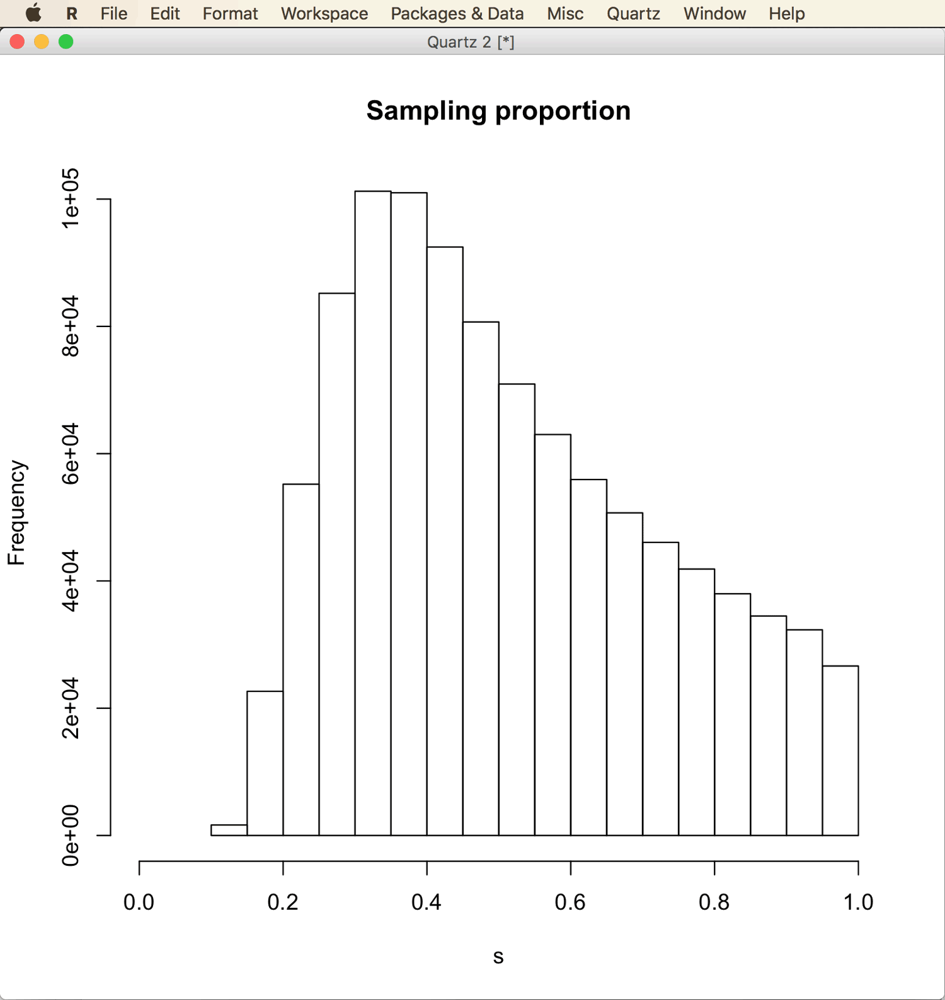

	It would be possible to try to approximate this distribution with a similarly shaped prior density; however, given that the assumption of uniform prior densities for &psi;, *d*, and *r* was already very simplistic, the resulting distribution for *s* should maybe not be overinterpreted. We'll simply use a uniform prior density also for *s*, with the lower and upper boundaries according to the 2.5% and 97.5% quantiles of the distribution shown above. These are 0.2 and 0.95, respectively. Thus, specify "0.2" as the lower boundary and "0.95" as the upper boundary of this density, as shown below.
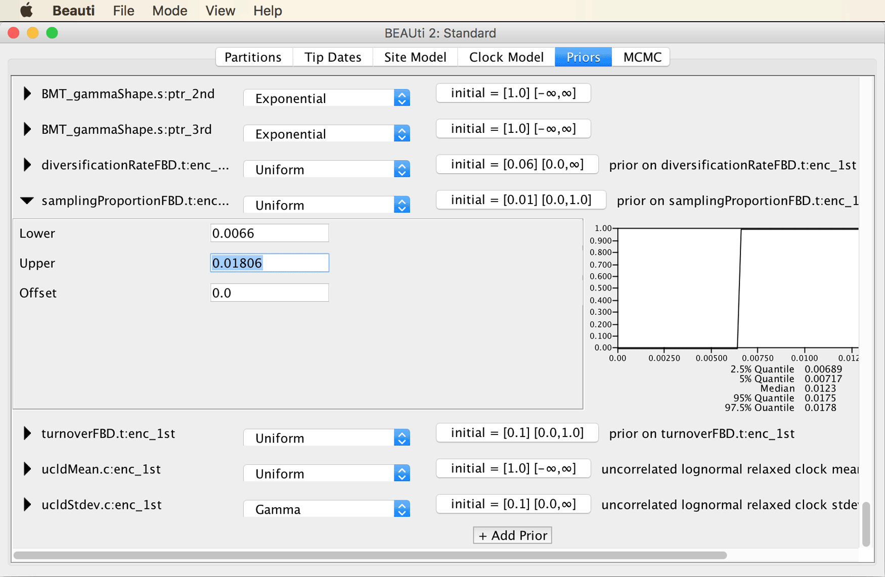

* Close the settings for the sampling-proportion parameter again and open instead those for the turnover parameter. As before, use a uniform prior density, with lower and upper boundaries according to the settings that we used in the analyses with CladeAge: Specify "0.0011" as the lower boundary and "0.37" as the upper boundary of this uniform density, as shown in the below screenshot.
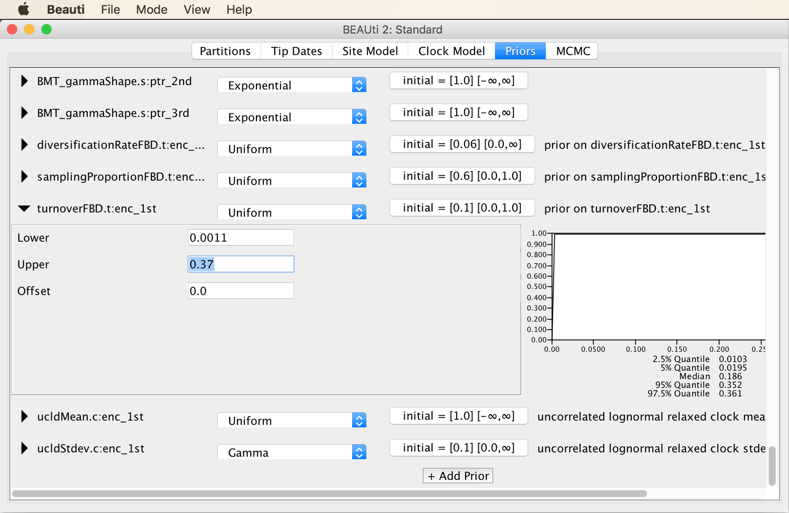

* Finally, we still need to specify taxonomic constraints to assign fossils to clades represented by extant taxa. To do so, click on the "+ Add Prior" button at the very end of the list in the "Priors" tab. When asked "Which prior do you want to add" as in the below screenshot, choose "Multiple monophyletic constraint" from the drop-down menu (alternatively, it would be possible to specify individuals constraints one by one by selecting "MRCA prior", however, this might take some time with a large number of constraints).
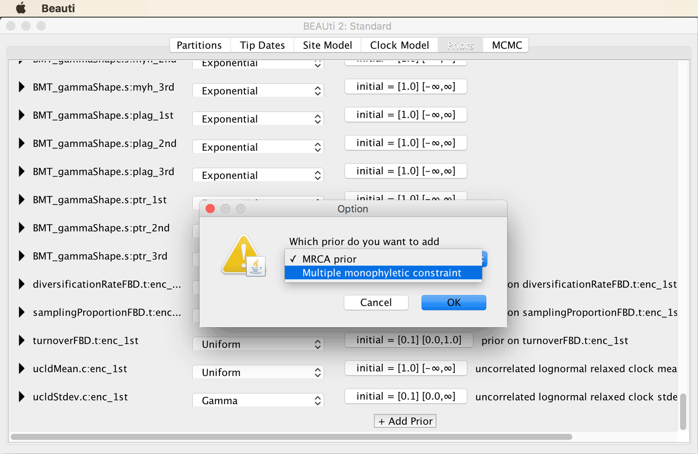

* After clicking "OK", another line will be added to the list of priors named "MultiMonophyleticConstraint.t:enc\_1st" (the 6th from the bottom of the list) as shown below.
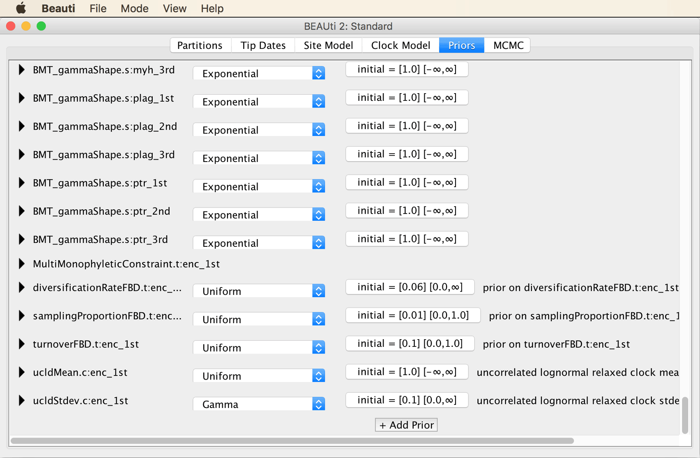
Click on the triangle to the left of "MultiMonophyleticConstraint.t:enc\_1st". As shown in the next screenshot, this will open a field in which you can specify a monophyly constraint in Newick format.
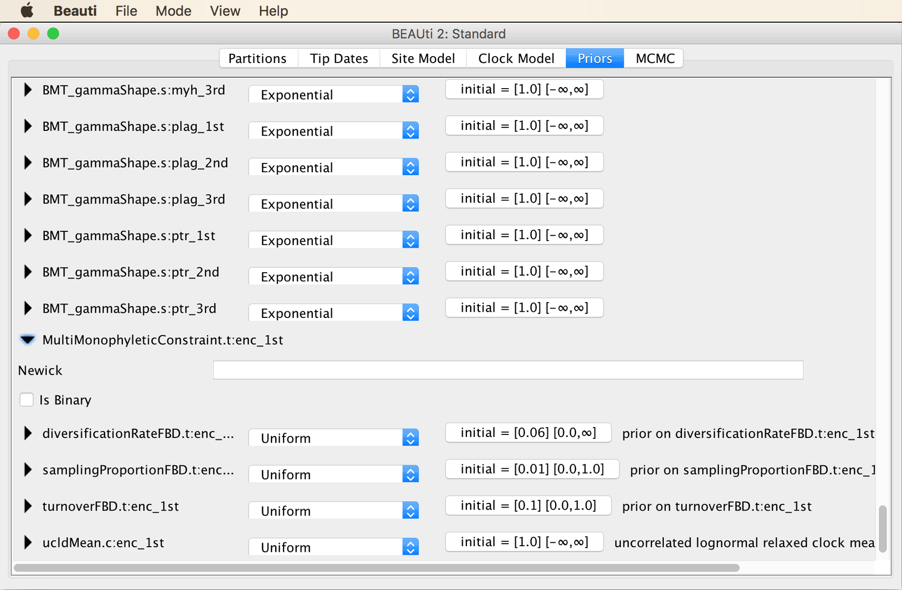

* You'll find the string encoding all monophyly constraints in Newick format below. As you'll see, this string is basically a tree string but it does not contain branch-length information and it includes several unresolved nodes.

		((((((((Heros_appendictulatusA_0.00,Plesioheros_chauliodus_41.07),(Cichla_temensisA_0.00,Palaeocichla_longirostrum_16.94)),((Oreochromis_niloticus_0.00,Mahengechromis_spp_45.51),(Heterochromis_sp_29.6,Heterochromis_multidensA_0.00))),Etroplus_maculatusA_0.00),(Oryzias_latipes_0.00,Rhamphexocoetus_volans_49.33)),(Trachinotus_carolinusA_0.00,Trachicaranx_tersus_55.85),((Channa_striataA_0.00,Osphronemus_goramy_48.5),Monopterus_albusA_0.00),(Gasterosteus_acuC_0.00,Cretatriacanthus_guidottii_98.75),(Astrapogon_stellatusA_0.00,Gobius_gracilis_32.36),(Aulostomus_chinensisA_0.00,Prosolenostomus_lessinii_49.12),(Thunnus_albacaresA_0.00,Eutrichiurides_opiensis_63.1),(Porichthys_notatusA_0.00,Louckaichthys_novosadi_32.29),(Diplacanthopoma_brunneaA_0.00,Eolamprogrammus_senectus_57.14)),(Sargocentron_cornutumA_0.00,Caproberyx_pharsus_98.0),Rondeletia_loricataA_0.00,Monocentris_japonicaA_0.00),(Polymixia_japonicaA_0.00,Homonotichthys_rotundus_94.64),((Percopsis_omiscomaycusA_0.00,Mcconichthys_longipinnis_64.85),(Zenopsis_conchiferaB_0.00,Cretazeus_rinaldii_71.55),(Gadus_morhua_0.00,Protacodus_sp_60.69),Stylephorus_chordatusB_0.00),Regalecus_Glesne_0.00)

	If you copy this string and paste it into a new FigTree window, you'll see a cladogram visualizing all specified monophyly constraints, as shown in the screenshot below. Each resolved branch in this cladogram represents a clade for which the monophyly is constrained. Also note that each pair of sister taxa in this phylogeny groups one extant representative of a clade with the oldest fossil of that clade. The set of monophyly constraints defined by this Newick string is effectively identical to the the assignment of fossil taxa to taxonomic groups as we did it before in the analysis with the CladeAge model.
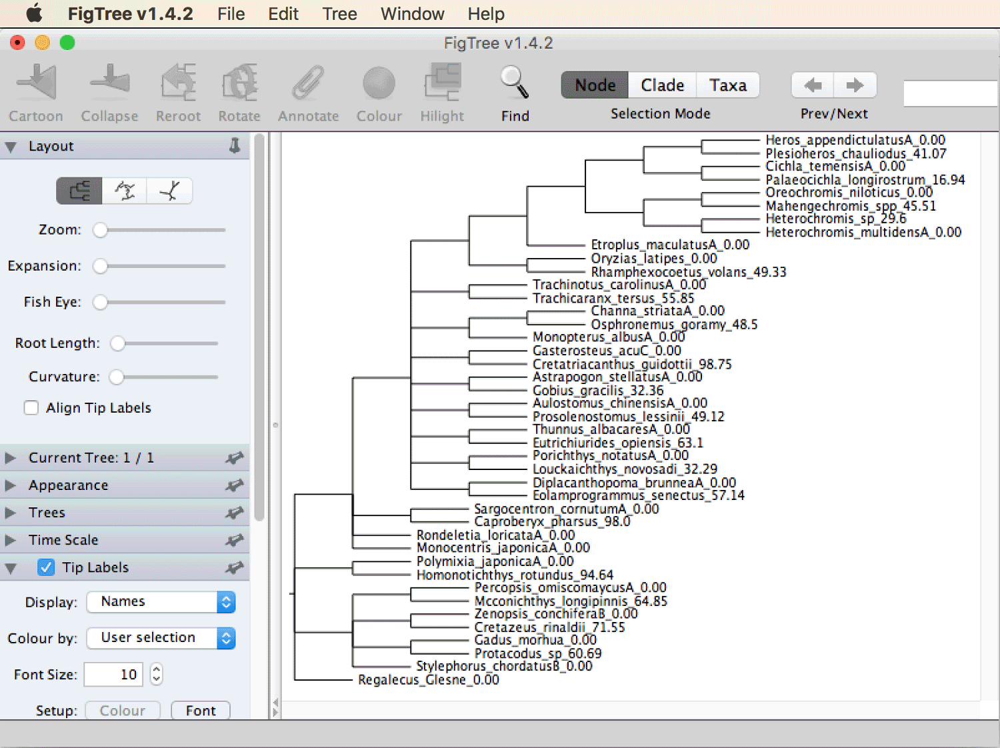
Thus, copy the Newick string and paste it into the "Newick" field below "MultiMonophyleticConstraint.t:enc_1st, as in the next screenshot.
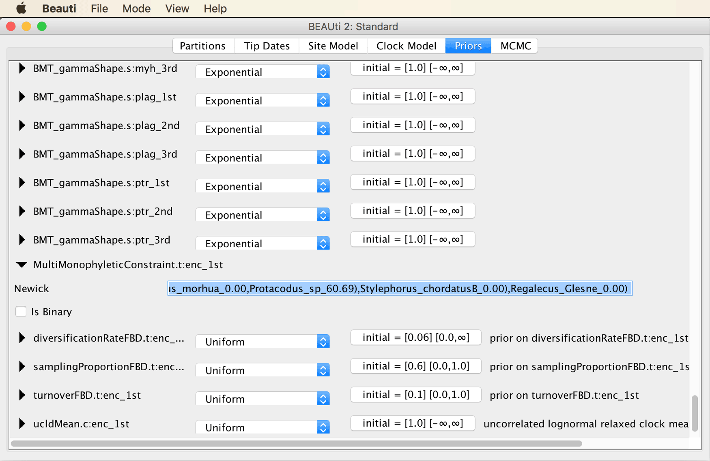

* Move on to the "MCMC" tab and specify again a chain length of 100 million generations. Name the log output file `Near_et_al_red_fbd.log` and the tree output file `Near_et_al_red_fbd.trees`. Set the interval for logging of log and tree files each to "10000" in the fields to the right of "Log Every", as shown below.
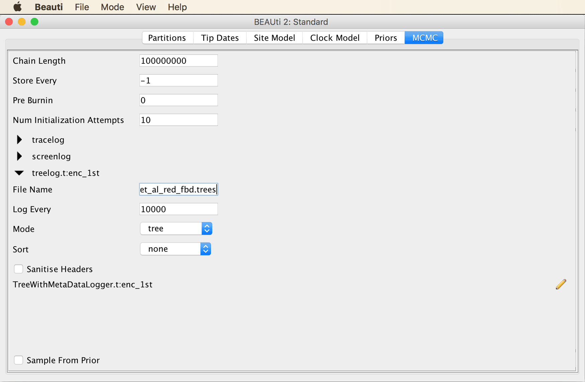

* Save the settings to a new file named `Near_et_al_red_fbd.xml`, by clicking "Save As" in BEAUti's "File" menu.

* Before we start the analysis, there are two more types of changes that we need to make manually to the XML. First, we would like to account for the uncertainties in the ages of all fossils. This is possible by adding a certain type of operator elements to the XML file. Thus, open the XML file [`Near_et_al_red_fbd.xml`](data/Near_et_al_red_fbd.xml) in a text editor and scroll to line 1758, after the last operator element and before the first logger element. You should recognize the following lines:

		...
    		<operator id="SATreeRootScalerFBD.t:enc_1st" spec="SAScaleOperator" rootOnly="true" scaleFactor="0.95" tree="@Tree.t:enc_1st" weight="1.0"/>

		    <operator id="SATreeScalerFBD.t:enc_1st" spec="SAScaleOperator" scaleFactor="0.95" tree="@Tree.t:enc_1st" weight="3.0"/>

			<logger id="tracelog" fileName="Near_et_al_red_fbd.log" logEvery="10000" model="@posterior" sanitiseHeaders="true" sort="smart">
				<log idref="posterior"/>
				<log idref="likelihood"/>
				<log idref="prior"/>
		...

	Without deleting any of these lines, add the following code just above the line beginning with `<logger id...`:

		    <operator spec='SampledNodeDateRandomWalker' windowSize="1"  tree="@Tree.t:enc_1st" weight="10">
				<taxonset spec="TaxonSet">
					<taxon id="Heterochromis_sp_29.6" spec="Taxon"/>
					<taxon id="Mahengechromis_spp_45.51" spec="Taxon"/>
					<taxon id="Palaeocichla_longirostrum_16.94" spec="Taxon"/>
					<taxon id="Plesioheros_chauliodus_41.07" spec="Taxon"/>
					<taxon id="Rhamphexocoetus_volans_49.33" spec="Taxon"/>
					<taxon id="Trachicaranx_tersus_55.85" spec="Taxon"/>
					<taxon id="Osphronemus_goramy_48.5" spec="Taxon"/>
					<taxon id="Cretatriacanthus_guidottii_98.75" spec="Taxon"/>
					<taxon id="Gobius_gracilis_32.36" spec="Taxon"/>
					<taxon id="Prosolenostomus_lessinii_49.12" spec="Taxon"/>
					<taxon id="Eutrichiurides_opiensis_63.1" spec="Taxon"/>
					<taxon id="Louckaichthys_novosadi_32.29" spec="Taxon"/>
					<taxon id="Eolamprogrammus_senectus_57.14" spec="Taxon"/>
					<taxon id="Caproberyx_pharsus_98.0" spec="Taxon"/>
					<taxon id="Homonotichthys_rotundus_94.64" spec="Taxon"/>
					<taxon id="Mcconichthys_longipinnis_64.85" spec="Taxon"/>
					<taxon id="Cretazeus_rinaldii_71.55" spec="Taxon"/>
					<taxon id="Protacodus_sp_60.69" spec="Taxon"/>
				</taxonset>
				<samplingDates id="samplingDate1" spec="beast.evolution.tree.SamplingDate" taxon="Heterochromis_sp_29.6" upper="33.9" lower="15.97"/>
				<samplingDates id="samplingDate2" spec="beast.evolution.tree.SamplingDate" taxon="Mahengechromis_spp_45.51" upper="46.0" lower="45.0"/>
				<samplingDates id="samplingDate3" spec="beast.evolution.tree.SamplingDate" taxon="Palaeocichla_longirostrum_16.94" upper="23.03" lower="5.332"/>
				<samplingDates id="samplingDate4" spec="beast.evolution.tree.SamplingDate" taxon="Plesioheros_chauliodus_41.07" upper="45.0" lower="39.9"/>
				<samplingDates id="samplingDate5" spec="beast.evolution.tree.SamplingDate" taxon="Rhamphexocoetus_volans_49.33" upper="49.4" lower="49.1"/>
				<samplingDates id="samplingDate6" spec="beast.evolution.tree.SamplingDate" taxon="Trachicaranx_tersus_55.85" upper="57.23" lower="55.8"/>
				<samplingDates id="samplingDate7" spec="beast.evolution.tree.SamplingDate" taxon="Osphronemus_goramy_48.5" upper="50.7" lower="45.5"/>
				<samplingDates id="samplingDate8" spec="beast.evolution.tree.SamplingDate" taxon="Cretatriacanthus_guidottii_98.75" upper="99.6" lower="83.5"/>
				<samplingDates id="samplingDate9" spec="beast.evolution.tree.SamplingDate" taxon="Gobius_gracilis_32.36" upper="33.9" lower="30.7"/>
				<samplingDates id="samplingDate10" spec="beast.evolution.tree.SamplingDate" taxon="Prosolenostomus_lessinii_49.12" upper="49.4" lower="49.1"/>
				<samplingDates id="samplingDate11" spec="beast.evolution.tree.SamplingDate" taxon="Eutrichiurides_opiensis_63.1" upper="66.043" lower="56.6"/>
				<samplingDates id="samplingDate12" spec="beast.evolution.tree.SamplingDate" taxon="Louckaichthys_novosadi_32.29" upper="33.9" lower="27.82"/>
				<samplingDates id="samplingDate13" spec="beast.evolution.tree.SamplingDate" taxon="Eolamprogrammus_senectus_57.14" upper="57.23" lower="55.8"/>
				<samplingDates id="samplingDate14" spec="beast.evolution.tree.SamplingDate" taxon="Caproberyx_pharsus_98.0" upper="99.1" lower="97.8"/>
				<samplingDates id="samplingDate15" spec="beast.evolution.tree.SamplingDate" taxon="Homonotichthys_rotundus_94.64" upper="96.0" lower="93.5"/>
				<samplingDates id="samplingDate16" spec="beast.evolution.tree.SamplingDate" taxon="Mcconichthys_longipinnis_64.85" upper="66.043" lower="61.1"/>
				<samplingDates id="samplingDate17" spec="beast.evolution.tree.SamplingDate" taxon="Cretazeus_rinaldii_71.55" upper="76.4" lower="69.2"/>
				<samplingDates id="samplingDate18" spec="beast.evolution.tree.SamplingDate" taxon="Protacodus_sp_60.69" upper="62.8" lower="59.7"/>
			</operator>

	In the above code block, the first half does nothing else than define "taxon" elements with the IDs of the fossil species exactly as they are in the Nexus-format alignment file [`Near_et_al_red_fossils.nex`](data/Near_et_al_red_fossils.nex). The second half then refers to these definitions and adds a "samplingDates" element for each fossil, with an upper and a lower value that represent the range of uncertainty for the age of that fossil.
	
* The second change that we still have to make to the XML file [`Near_et_al_red_fbd.xml`](data/Near_et_al_red_fbd.xml) is that we again have to add a starting tree, because the random generation of a starting tree would most likely fail again as it did in the earlier analyses with the CladeAge model. The difference to when we added the starting tree before is that now the starting tree also has to include all fossil species, and that therefore preparing a Newick string for the starting tree by hand is a bit more tedious. This prepared Newick string is as follows:

		(((((((((((((((Oreochromis_niloticus_0.00:47,Mahengechromis_spp_45.51:1.49):3,(Heterochromis_sp_29.6:0.4,Heterochromis_multidensA_0.00:30):20):10,((Cichla_temensisA_0.00:20,Palaeocichla_longirostrum_16.94:3.06):30,(Heros_appendictulatusA_0.00:45,Plesioheros_chauliodus_41.07:3.93):5):10):10,Etroplus_maculatusA_0.00:70):30,(Oryzias_latipes_0.00:60,Rhamphexocoetus_volans_49.33:10.67):40):10,((Trachinotus_carolinusA_0.00:60,Trachicaranx_tersus_55.85:4.15):10,((Channa_striataA_0.00:50,Osphronemus_goramy_48.5:1.5):10,Monopterus_albusA_0.00:60):10):40):10,(Gasterosteus_acuC_0.00:100,Cretatriacanthus_guidottii_98.75:1.25):20):10,(Astrapogon_stellatusA_0.00:40,Gobius_gracilis_32.36:7.64):90):10,((Aulostomus_chinensisA_0.00:60,Prosolenostomus_lessinii_49.12:10.88):20,(Thunnus_albacaresA_0.00:70,Eutrichiurides_opiensis_63.1:6.9):10):60):10,(Porichthys_notatusA_0.00:40,Louckaichthys_novosadi_32.29:7.71):10):10,(Diplacanthopoma_brunneaA_0.00:60,Eolamprogrammus_senectus_57.14:2.86):100):10,(Sargocentron_cornutumA_0.00:100,Caproberyx_pharsus_98.0:2):70):10,(Rondeletia_loricataA_0.00:100,Monocentris_japonicaA_0.00:100):80):10,(Polymixia_japonicaA_0.00:100,Homonotichthys_rotundus_94.64:5.36):90):10,(((((Gadus_morhua_0.00:65,Protacodus_sp_60.69:4.31):5,Stylephorus_chordatusB_0.00:70):10,(Zenopsis_conchiferaB_0.00:75,Cretazeus_rinaldii_71.55:3.45):5):10,(Percopsis_omiscomaycusA_0.00:70,Mcconichthys_longipinnis_64.85:5.15):20):10,Regalecus_Glesne_0.00:100):100)
		
	If curious, you could copy and paste this string into a FigTree window to see how this starting tree with fossils looks like.
	
* Then, find the following block on lines 359-363 of the XML file [`Near_et_al_red_fbd.xml`](data/Near_et_al_red_fbd.xml):

			<init id="RandomTree.t:enc_1st" spec="beast.evolution.tree.RandomTree" estimate="false" initial="@Tree.t:enc_1st" taxa="@enc_1st">
				<populationModel id="ConstantPopulation0.t:enc_1st" spec="ConstantPopulation">
					<parameter id="randomPopSize.t:enc_1st" name="popSize">1.0</parameter>
				</populationModel>
			</init>

	Replace the above block with the following lines that contain the starting tree as a Newick string:
	
			<init spec="beast.util.TreeParser" id="NewickTree.t:enc_1st"
				initial="@Tree.t:enc_1st"
				IsLabelledNewick="true"
				taxa="@enc_1st"
				newick="(((((((((((((((Oreochromis_niloticus_0.00:47,Mahengechromis_spp_45.51:1.49):3,(Heterochromis_sp_29.6:0.4,Heterochromis_multidensA_0.00:30):20):10,((Cichla_temensisA_0.00:20,Palaeocichla_longirostrum_16.94:3.06):30,(Heros_appendictulatusA_0.00:45,Plesioheros_chauliodus_41.07:3.93):5):10):10,Etroplus_maculatusA_0.00:70):30,(Oryzias_latipes_0.00:60,Rhamphexocoetus_volans_49.33:10.67):40):10,((Trachinotus_carolinusA_0.00:60,Trachicaranx_tersus_55.85:4.15):10,((Channa_striataA_0.00:50,Osphronemus_goramy_48.5:1.5):10,Monopterus_albusA_0.00:60):10):40):10,(Gasterosteus_acuC_0.00:100,Cretatriacanthus_guidottii_98.75:1.25):20):10,(Astrapogon_stellatusA_0.00:40,Gobius_gracilis_32.36:7.64):90):10,((Aulostomus_chinensisA_0.00:60,Prosolenostomus_lessinii_49.12:10.88):20,(Thunnus_albacaresA_0.00:70,Eutrichiurides_opiensis_63.1:6.9):10):60):10,(Porichthys_notatusA_0.00:40,Louckaichthys_novosadi_32.29:7.71):10):10,(Diplacanthopoma_brunneaA_0.00:60,Eolamprogrammus_senectus_57.14:2.86):100):10,(Sargocentron_cornutumA_0.00:100,Caproberyx_pharsus_98.0:2):70):10,(Rondeletia_loricataA_0.00:100,Monocentris_japonicaA_0.00:100):80):10,(Polymixia_japonicaA_0.00:100,Homonotichthys_rotundus_94.64:5.36):90):10,(((((Gadus_morhua_0.00:65,Protacodus_sp_60.69:4.31):5,Stylephorus_chordatusB_0.00:70):10,(Zenopsis_conchiferaB_0.00:75,Cretazeus_rinaldii_71.55:3.45):5):10,(Percopsis_omiscomaycusA_0.00:70,Mcconichthys_longipinnis_64.85:5.15):20):10,Regalecus_Glesne_0.00:100):100)"/>
			
	Save the XML file again with the same name (`Near_et_al_red_fbd.xml`).
	
* The XML file [`Near_et_al_red_fbd.xml`](res/Near_et_al_red_fbd.xml) is then ready to be analyzed with BEAST2. Since the GUI version of BEAST2 might still be running for the analysis with the CladeAge model, use once again (as in tutorial [Bayesian Phylogenetic Inference](../bayesian_phylogeny_inference/README.md)) the command-line version of BEAST2 for this analysis with the FBD model. Assuming that your BEAST2 installation is `/Applications/BEAST\ 2.5.0`, use one of the two following commands to start the analysis:

		/Applications/BEAST\ 2.5.0/bin/beast Near_et_al_red_fbd.xml
		
	or
	
		export JAVA_HOME=/Applications/BEAST\ 2.5.0/jre1.8.0_161
		/Applications/BEAST\ 2.5.0/jre1.8.0_161/bin/java -jar /Applications/BEAST\ 2.5.0/lib/beast.jar Near_et_al_red_fbd.xml

	**Question 2:** How long does BEAST2 take for one million iterations in this analysis? [(see answer)](#q2)

## Interpretation of the inferred timelines

We are now going to use the program [Tracer](http://tree.bio.ed.ac.uk/software/tracer/) ([Rambaut et al. 2018](https://academic.oup.com/sysbio/advance-article/doi/10.1093/sysbio/syy032/4989127)) once again (as in tutorial [Bayesian Phylogenetic Inference](../bayesian_phylogeny_inference/README.ml)) to assess stationarity of the MCMC chains produced by the analyses with CladeAge and the FBD model, and we will make an interpretation of the differences between these results.

* Open Tracer and the log file [`Near_et_al_red.log`](res/Near_et_al_red.log) resulting from the analysis with CladeAge. The Tracer window should then look as shown in the next screenshot.
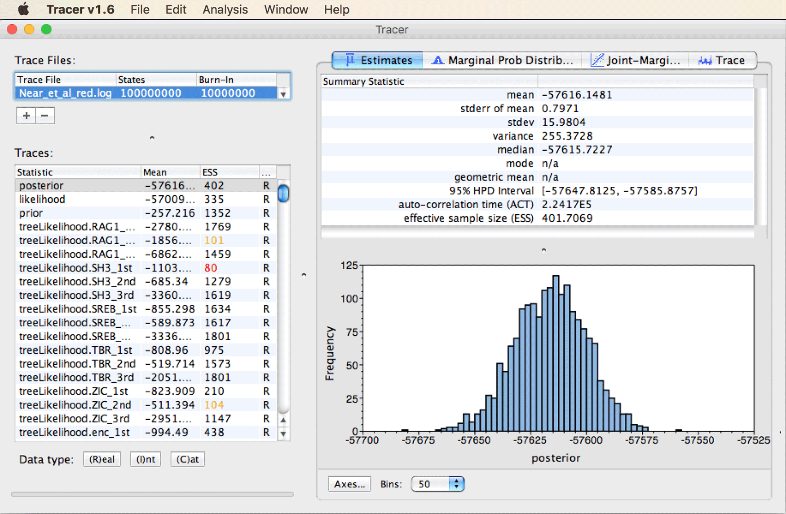

* Quickly browse through the long list of parameters to see if any have particularly low ESS values. We'll ignore those parameters of the bModelTest model named "hasEqualFreqs..." Besides these, the lowest ESS values should be around 80, indicating that the chain is approaching stationarity, but that it should be run for more iterations if the analysis was to be published. Nevertheless, the degree of stationarity appears to be sufficient for our interpretation here.

* To see a good example of the "hairy caterpillar" trace pattern indicating stationarity, click on "prior" in the list of parameters and on the tab for "Trace" in the top right of the window. You should see a trace as shown below.
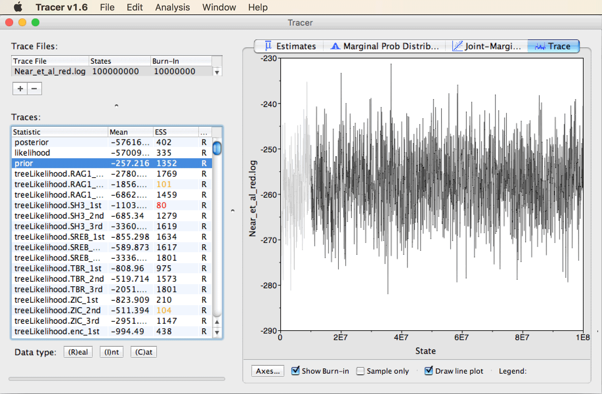
Note that in principle all traces should look similar to this pattern once the chain is fully stationary.

* Find the "TreeHeight" parameter indicating the root age in the list on the left.

	**Question 3:** What is the mean estimate and its confidence interval for the age of the first split in the phylogeny? [(see answer)](#q3)

* Next, find the estimated divergence time between African and Neotropical cichlid fishes. To do so, scroll to the bottom of the list on the left, select "mrcatime(Afro-American cichlids)". You'll see that this divergence event was estimated around 65 Ma, with a range of uncertainty between around 55 Ma and 75 Ma, as shown in the next screenshot.

* Finally, select the speciation-rate parameter named "BDBirthRate" from the list on the left to see the summary statistics for this parameter, as in the next screenshot.
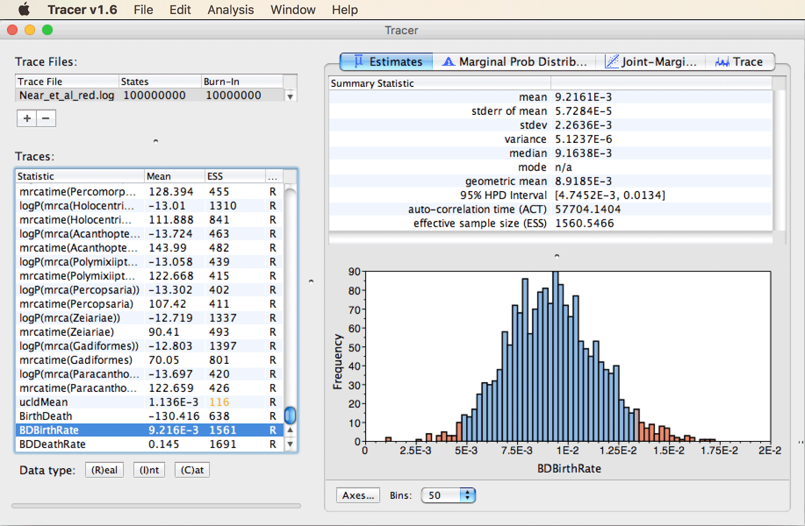

	**Question 4:** How to these estimates compare to those that we used to define prior densities for fossil calibrations with the CladeAge approach? [(see answer)](#q4)

* Next, also open the log file of the analysis with the FBD model, named [`Near_et_al_red_fbd.log`](res/Near_et_al_red_fbd.log), in Tracer. You'll see that the degree of stationarity in the MCMC chain of this analysis, shown below, is comparable to that obtained with CladeAge.
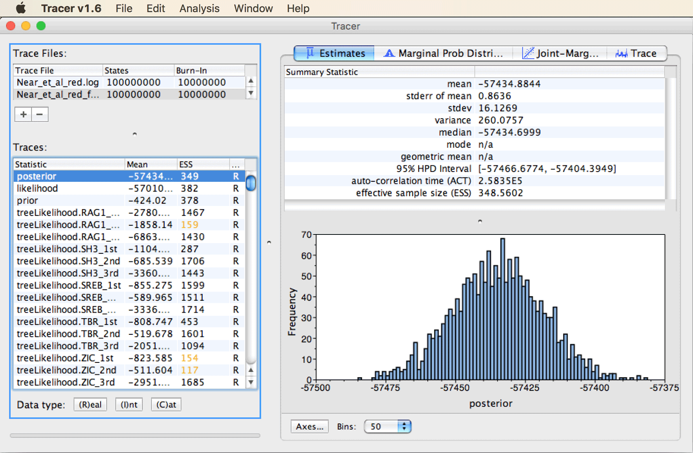

* Again, find the "TreeHeight" parameter.
	
	**Question 5:** How old is the age of the first split, as estimated with the FBD model? [(see answer)](#q5)

* The divergence time of African and Neotropical cichlids is this time not included in the list of parameters. To see it, you'll need to use the posterior tree distribution. Thus, open the program TreeAnnotator and select file [`Near_et_al_red_fbd.trees`](res/Near_et_al_red_fbd.trees) as the input tree file. Also set the burnin percentage to 10 and select "Mean heights" from the drop-down menu to the right of "Node heights". Finally, choose `Near_et_al_red_fbd.tre` as the name of the output file, as shown in the next screen shot. Then, click "Run".
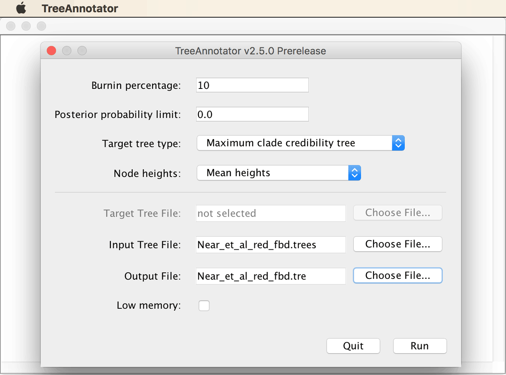

* Open the summary tree file [`Near_et_al_red_fbd.tre`](res/Near_et_al_red_fbd.tre) in FigTree. After orientating the tree, adding a scale axis, and displaying node labels (see tutorial [Bayesian Phylogenetic Inference](../bayesian_phylogeny_inference/README.md) if you're uncertain how to do this), the tree should be shown as in the next screenshot.
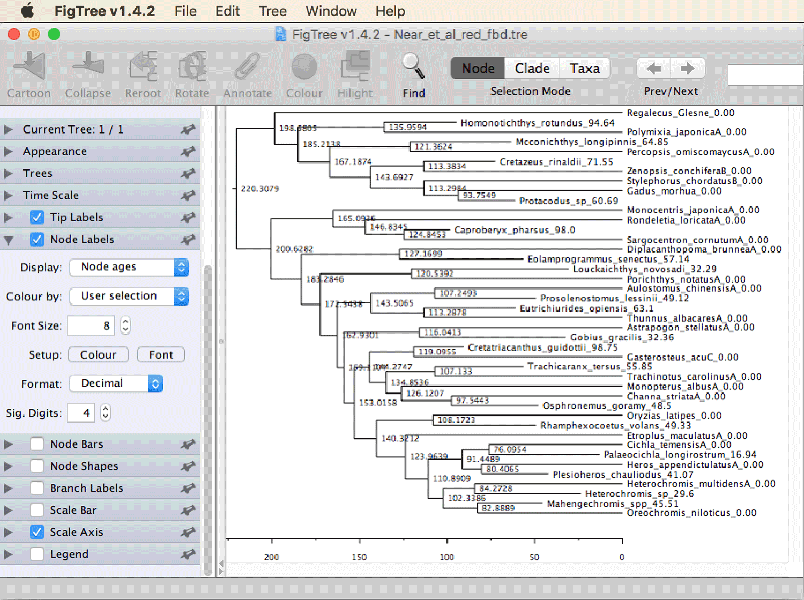
Note that the fossil species are included in the tree and that their tip length corresponds to their ages. You'll see that just like the age of the very first divergence, the divergence of cichlids fishes is now also much older than it appeared in the previous analysis with CladeAge. This divergence, shown near the bottom of the tree in the above screenshot, is now estmated around 113 Ma. The confidence interval for this divergence ranges from around 86 Ma to about 137 Ma (to see this, select "height\_95%\_HPD") from the drop-down menu at the left, next to "Display", in which "Node ages" are selected in the above screenshot).
 
* To figure out the reason for this large difference in age estimates between the CladeAge and FBP approaches, go back to Tracer, scroll to the very bottom of the list of parameters on the left, and select the parameter named "diversificationRateFBD" to display the estimate for the net diversification rate. The Tracer window should then look as shown in the screenshot below.
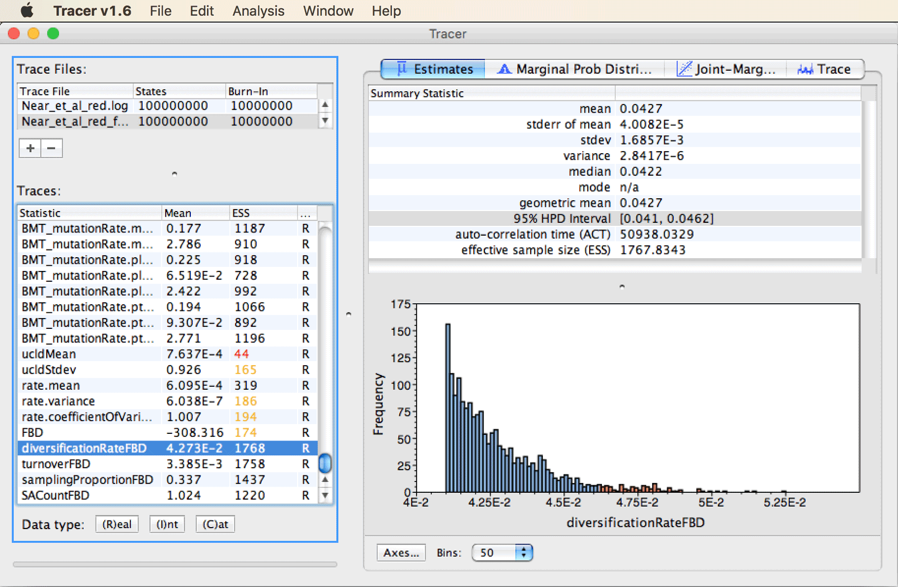

	**Question 6:** How does this estimate compare to the range of uncertainty that we had specified in both the analysis with CladeAge and the analysis with the FBD model? [(see answer)](#q7)

 

                   

## Answers

* **Question 1:** BEAST2 should require about 8-10 minutes per million iterations. Thus, running the full 100 million iterations will take about 13-15 hours. If you don't want to wait for your analyses to finish, you could use the results of my BEAST2 analysis of the same data with the CladeAge approach, in files [`Near_et_al_red.log`](res/Near_et_al_red.log) and [`Near_et_al_red.trees`](res/Near_et_al_red.trees) for the rest of the tutorial.

* **Question 2:** The run time per iteration should be very comparable between the analysis with the FBD model and the analysis with the CladeAge model. On my machine, both require 8-10 minutes per million iterations. Thus, the analysis with the FBD model may also take 13-15 hours, depending on the speed of your computer. Again, if you don't want to wait that long for the results, you could take those from my analysis with the FBD approach, in files [`Near_et_al_red_fbd.log`](res/Near_et_al_red_fbd.log) and [`Near_et_al_red_fbd.trees`](res/Near_et_al_red_fbd.trees) to continue with the rest of the tutorial.

* **Question 3:** When you select "TreeHeight" in the list on the left and click on the tab for "Estimates" in the top right, you'll see the following information:
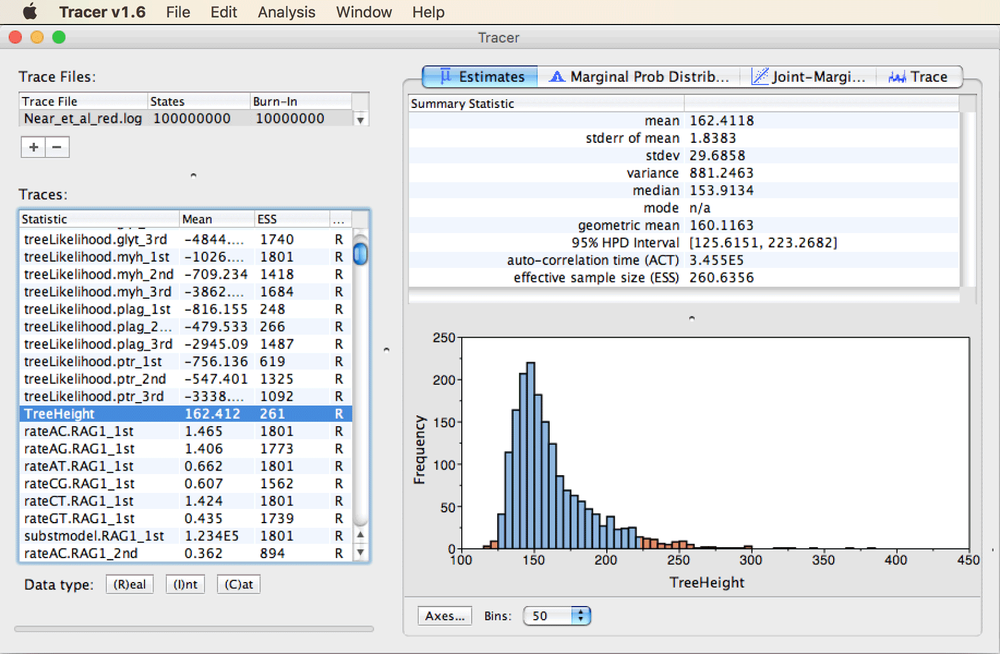
As specified in the summary statistics on the top right part of the window, the mean estimate for the age of the first split should be around 160 Ma. The confidence interval is reported as the "95% HPD interval", the highest-posterior-density interval containing 95% of the posterior distribution. In other words, this is the shortest interval within which 95% of the samples taken by the MCMC can be found. In this case, it is relatively wide, ranging from around 125 Ma to about 225 Ma.

* **Question 4:** The estimated speciation rate is far lower than the values that we assumed when we specified prior densities for clade ages with CladeAge. Recall that we had used the estimates for the net diversification rate from [Santini et al. (2009)](https://bmcevolbiol.biomedcentral.com/articles/10.1186/1471-2148-9-194), which were 0.041-0.081 (per millon year). Thus, the estimated speciation of around 0.0009 is almost an order of magnitude lower than the values that we had assumed for the net diversification rate. This is remarkable because the speciation rate should always be higher than the net diversification rate, given that the latter is defined as the difference between the speciation and extinction rates. The explanation for this difference is that BEAST2 estimated the speciation rate under the assumption that the species that we included in the phylogeny are in fact all the extant species that descended from the root of the phylogeny. This means that BEAST2 assumed that no spiny-rayed fish species besides those 24 included in the phylogeny exist. On the other hand the estimates for the net diversification rate obtained by [Santini et al. (2009)](https://bmcevolbiol.biomedcentral.com/articles/10.1186/1471-2148-9-194) accounted for the fact that only a subset of the living species were included in their phylogeny. Thus, the speciation-rate estimate resulting from our analysis is most certainly a severe underestimate. This bias, however, should not lead to strong bias in the timeline inferred in the analysis with CladeAge, because it did not influence the prior densities placed on clade ages.

* **Question 5:** You may be surprised to find that the estimate for the age of the first split in the analysis with the FBD model is much older than in the analysis with CladeAge. As shown in the next screenshot, the tree height is now estimated around 225 Ma, with a confidence interval from around 185 Ma to about 260 Ma.
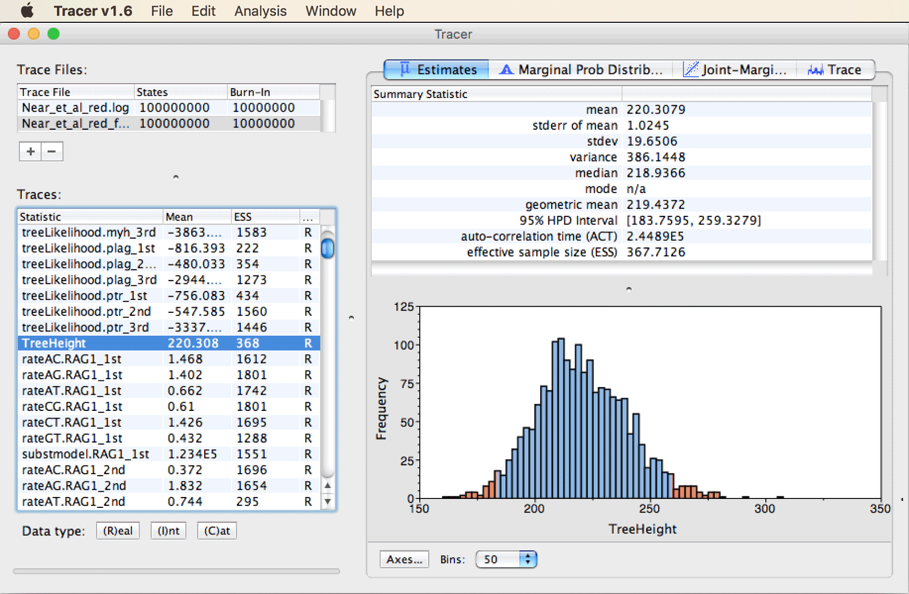
As we will see, this difference most likely results from a biased estimate of the diversification rate due to the way in which the species included in our phylogeny were selected.

* **Question 6:** You may recall that we had adopted the estimates of [Santini et al. (2009)](https://bmcevolbiol.biomedcentral.com/articles/10.1186/1471-2148-9-194) for the net diversification rate, the turnover, and the sampling rate. For the net diversification rate, the range estimated by Santini et al. (2009) was 0.041-0.081 per million year. As you can see from the histogram shown in Tracer, the posterior distribution for the net diversification rate (unsuprisingly) falls within this range, however, most of the posterior distribution appears squeezed against the lower boundary of the distribution at 0.041. The mean of the posterior distribution is only slightly larger at around 0.043. This appears to be the reason for the much older age estimates with the FBD model: With a lower net diversification rate, the age constraint imposed by fossils is weaker and thus allows divergence times much older than the age of the fossil. The reason why the posterior distribution of net-diversification-rate estimates is so particularly low can also be explained. Recall that we had specified that our dataset contains only a small proportion of the existing species diversity within spiny-rayed fishes. Because we had sampled 24 out of 15,000 living species, we had specified 0.0016 as the value of parameter "Rho". This should in principle allow to estimate the net diversification rate without bias, however, only under the assumption that the 24 species included in the phylogeny are randomly sampled from the diversity of 15,000 species. This clearly is not the case in our dataset because the included species were selected to represent the most divergent groups among spiny-rayed fishes. This means that the true ages of the nodes incuded in the phylogeny are older and more concentrated than they would have been if we had sampled species at random (see [Hoehna et al. 2011](https://academic.oup.com/mbe/article/28/9/2577/1013496) for a good discussion of this). Nevertheless, the model assumes that the distribution of node ages results from random sampling, and as a result the posterior probability becomes larger when the distribution of node ages is extended compared to when it is as narrow as it actually should be. And because the fossil constraints impose lower boundaries on node ages, extending their distribution is only possible by shifting them upward, leading to bias in age estimates as well as the net-diversification-rate estimate.