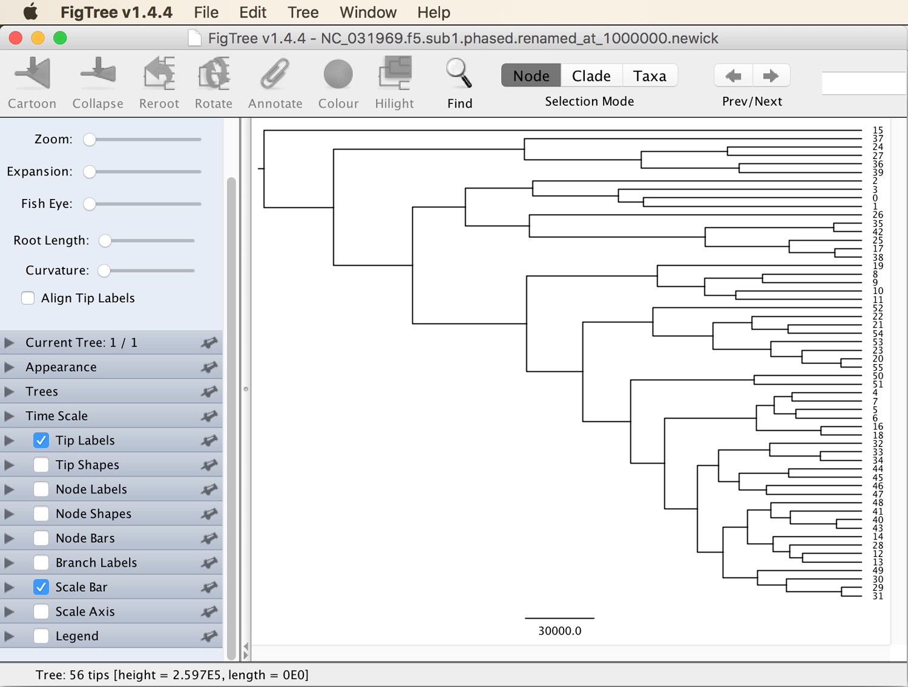

# Genome-Wide Genealogy Estimation with SNP Data

A tutorial on the estimation of genealogies across the entire genome with SNP data

## Summary

In sets of closely related species, phylogenetic approaches based on sequence alignments can be problematic because individual short alignments may not contain sufficient information for phylogenetic inference, but longer alignments are likely to contain many recombination breakpoints that can bias phylogenetic inference when they are not accounted for. On the other hand, SNP-based phylogenetic inference such as that supported by the software SNAPP (the focus of tutorial [Divergence-Time Estimation with SNP Data](../divergence_time_estimation_with_snp_data/README.md)), does not account for introgression and may therefore also produce misleading phylogenetic estimates when introgression is present. Thus, neither alignment-based phylogenetic inference, nor SNP-based inference with a tool like SNAPP may provide unbiased phylogenies of rapidly diverging clades in which introgression occurs. However, a possible solution to this problem may come from an entirely different type of methods has recently seen a lot of development. These methods use genome-wide SNPs to estimate the so-called ancestral recombination graph (ARG), which represents a collection of genealogies that are all linked to segments on the genome and separated from each other by inferred recombination breakpoints. Even when recombination breakpoints are very frequent, the segments in between them may not too short for reliable inference with ARG methods. The reason for this is that by jointly estimating the genealogies of all segments, each genealogy can also be informed by its neighboring genealogies, from which it should differ only in the position of a single branch due to recombination.

Until recently, methods for the inference of ARGs were far too computationally demanding to be applied to more than just a handful of species. This has changed dramatically with the release of the programs [tsinfer](https://github.com/tskit-dev/tsinfer) by [Kelleher et al. (2018)](https://www.biorxiv.org/content/10.1101/458067v1.abstract) and [Relate](https://myersgroup.github.io/relate/index.html) by [Speidel et al. (2019)](https://www.biorxiv.org/content/10.1101/550558v1), which can be applied even to thousands of samples. Of the two programs, we will here use Relate because tsinfer so far does not estimate divergence times, but Relate does. Common to both programs is that they do not consider species as something different from populations, and thus genetic exchange is always allowed among the units into which individuals are grouped. But as the distinction between populations and closely related species is often arbitrary anyway, this does not mean that Relate should not be applied to species-level datasets. As the program is extremely new, this tutorial should be considered work in progress and may only serve to understand the first basic steps of analyses with Relate.

## Table of contents

* [Outline](#outline)
* [Dataset](#dataset)
* [Requirements](#requirements)
* [Genotype phasing](#phasing)
* [Estimating genome-wide genealogies with Relate](#relate)
* [Estimating population sizes and splits](#popsizes)

## Outline

In this tutorial, I am going to present the estimation of genome-wide genealogies with the program Relate. The set of estimated genealogies will then serve to quantify population sizes and coalescence rates within and among species. Patterns of temporal variation in these coalescence rates may then allow to estimate relationships among species as well as their divergence times.

## Dataset

The SNP data used in this tutorial is the phased and imputed dataset generated in tutorial [Analysis of Introgression with Chromosome-Length Alignments](../analysis_of_introgression_with_chromosome_length_alignments/README.md). More detailed information about the origin of this dataset is given in the [Genotype phasing](../analysis_of_introgression_with_chromosome_length_alignments/README.md#phasing) section of this other tutorial. In brief, the dataset includes SNP data for the 28 samples of 14 cichlid species listed in the table below, and this data has already filtered based on read quality and depth. Only SNPs mapping to chromosome 5 of the tilapia genome assembly ([Conte et al. 2017](https://bmcgenomics.biomedcentral.com/articles/10.1186/s12864-017-3723-5)) are included in the dataset. In contrast to the analyses in tutorial [Analysis of Introgression with Chromosome-Length Alignments](../analysis_of_introgression_with_chromosome_length_alignments/README.md), we will not use the version of the dataset in which imputed genotypes were masked when they originally had missing data, because Relate does not allow sites with missing data.

| Sample ID | Species ID | Species name                  | Tribe         |
|-----------|------------|-------------------------------|---------------|
| IZA1      | astbur     | *Astatotilapia burtoni*       | Haplochromini |
| IZC5      | astbur     | *Astatotilapia burtoni*       | Haplochromini |
| AUE7      | altfas     | *Altolamprologus fasciatus*   | Lamprologini  |
| AXD5      | altfas     | *Altolamprologus fasciatus*   | Lamprologini  |
| JBD5      | telvit     | *Telmatochromis vittatus*     | Lamprologini  |
| JBD6      | telvit     | *Telmatochromis vittatus*     | Lamprologini  |
| JUH9      | neobri     | *Neolamprologus brichardi*    | Lamprologini  |
| JUI1      | neobri     | *Neolamprologus brichardi*    | Lamprologini  |
| LJC9      | neocan     | *Neolamprologus cancellatus*  | Lamprologini  |
| LJD1      | neocan     | *Neolamprologus cancellatus*  | Lamprologini  |
| KHA7      | neochi     | *Neolamprologus chitamwebwai* | Lamprologini  |
| KHA9      | neochi     | *Neolamprologus chitamwebwai* | Lamprologini  |
| IVE8      | neocra     | *Neolamprologus crassus*      | Lamprologini  |
| IVF1      | neocra     | *Neolamprologus crassus*      | Lamprologini  |
| JWH1      | neogra     | *Neolamprologus gracilis*     | Lamprologini  |
| JWH2      | neogra     | *Neolamprologus gracilis*     | Lamprologini  |
| JWG8      | neohel     | *Neolamprologus helianthus*   | Lamprologini  |
| JWG9      | neohel     | *Neolamprologus helianthus*   | Lamprologini  |
| JWH3      | neomar     | *Neolamprologus marunguensis* | Lamprologini  |
| JWH4      | neomar     | *Neolamprologus marunguensis* | Lamprologini  |
| JWH5      | neooli     | *Neolamprologus olivaceous*   | Lamprologini  |
| JWH6      | neooli     | *Neolamprologus olivaceous*   | Lamprologini  |
| ISA6      | neopul     | *Neolamprologus pulcher*      | Lamprologini  |
| ISB3      | neopul     | *Neolamprologus pulcher*      | Lamprologini  |
| ISA8      | neosav     | *Neolamprologus savoryi*      | Lamprologini  |
| IYA4      | neosav     | *Neolamprologus savoryi*      | Lamprologini  |
| KFD2      | neowal     | *Neolamprologus walteri*      | Lamprologini  |
| KFD4      | neowal     | *Neolamprologus walteri*      | Lamprologini  |

## Requirements

* **Relate:** The software [Relate](https://myersgroup.github.io/relate/index.html) estimates genome-wide sets of genealogies and is extremely fast in doing so. Downloads for Mac OS X and Linux are provided on [https://myersgroup.github.io/relate/index.html](https://myersgroup.github.io/relate/index.html); however, installation on Windows is not supported. After downloading and decompressing the file containing the software, a collection of compiled programs (named `Relate`, `RelateMutationRate` etc.) can be found in the `bin` subdirectory inside of the decompressed directory.

* **FigTree:** The program [FigTree](http://tree.bio.ed.ac.uk/software/figtree/) by Andrew Rambaut is a very intuitive and useful tool for the visualization and (to a limited extent) manipulation of phylogenies encoded in [Newick](http://evolution.genetics.washington.edu/phylip/newicktree.html) format. Executables for Mac OS X, Linux, and Windows are provided on [https://github.com/rambaut/figtree/releases](https://github.com/rambaut/figtree/releases).

<!--XXX Replace with actual librarires XXX
* **Libraries for R:** Two R libraries will be required in this tutorial; these are [ape](https://cran.r-project.org/web/packages/ape/index.html) ([Paradis et al. 2004](https://academic.oup.com/bioinformatics/article/20/2/289/204981)) and [coda](https://cran.r-project.org/web/packages/coda/index.html) ([Plummer et al. 2006](http://oro.open.ac.uk/22547/)). If you're already familiar with R, just install these packages in the usual way. If not, the easiest way to do so might be via the command line. Type `R` to open the R environment interactively. Then, run the following commands:

		install.packages("ape", repos="http://ftp.gwdg.de/pub/misc/cran/", dependencies=T)
		install.packages("coda", repos="http://ftp.gwdg.de/pub/misc/cran/", dependencies=T)
		
	To ensure that both packages have been successfully installed, type these commands:
	
		library(ape)
		library(coda)

	If both commands result in no error messages, the two packages are ready to be used. Then, quit the R environment with `quit(save="no")`.
-->

## Estimating genome-wide genealogies

Relate expects the input in the haplotype format used by the phasing program [SHAPEIT](https://mathgen.stats.ox.ac.uk/genetics_software/shapeit/shapeit.html) ([Delaneau et al. 2012](https://www.nature.com/articles/nmeth.1785)), but Relate also comes with scripts that allow the conversion from VCF format into SHAPEIT's haplotype format. As these scripts, however, expect chromosomes to be named only with integers, we first need to replace the chromosome name "NC_031969" in the VCF file.

* To replace the chromosome name "NC_031969" in file [`NC_031969.f5.sub1.phased.vcf.gz`](../data/NC_031969.f5.sub1.phased.vcf.gz) with the number "5" (because the chromosome is in fact chromosome 5 of tilapia) and write a new file named `NC_031969.f5.sub1.phased.renamed.vcf.gz`, use the `sed` command:

		gunzip -c NC_031969.f5.sub1.phased.vcf.gz | sed "s/NC_031969/5/g" | gzip > NC_031969.f5.sub1.phased.renamed.vcf.gz

* To convert file `NC_031969.f5.sub1.phased.renamed.vcf.gz` into SHAPEIT's haplotype format, we can use the RelateFileFormats program that should be installed in the same directory as Relate itself. Run it with the following command:

		RelateFileFormats --mode ConvertFromVcf --haps NC_031969.f5.sub1.phased.renamed.haps --sample NC_031969.f5.sub1.phased.renamed.sample -i NC_031969.f5.sub1.phased.renamed

* In addition to the input files generated above, Relate is going to require a genetic map that quantifies recombination rates across the genome. A good map for our dataset, however, is currently not available. As a workaround, we will prepare a genetic map based on the assumption that the recombination rate is commpletely homogeneous across chromosome 5, and that 1 centimorgan corresponds to 1 Mbp. While this assumption is certainly not realistic, it was also made when phasing was performed with BEAGLE in tutorial [Analysis of Introgression with Chromosome-Length Alignments](../analysis_of_introgression_with_chromosome_length_alignments/README.md). To determine the robustness of Relate analyses to the specified genetic map, different maps could be tested; however, for the purpose of this tutorial, a map with homogeneous rates should be sufficient. The format of the map file is explained on the [Relate website](https://myersgroup.github.io/relate/input_data.html). Write the map with homogeneous rates using the text below, and save it to a new file named `flat.map`:

		pos COMBINED_rate Genetic_Map
		0       1     0
		38360022        0       38.360022

* In the inference of genome-wide genealogies with Relate, we also need to make assumptions about the effective population size and the mutation rate, but at least for the effictive population size, the specified value will be updated and estimated during the Relate analysis. As for the phasing in tutorial [Analysis of Introgression with Chromosome-Length Alignments](../analysis_of_introgression_with_chromosome_length_alignments/README.md), we can again use the population size estimate of 100,000, obtained in tutorial [Divergence-Time Estimation with SNP Data](../divergence_time_estimation_with_snp_data/README.md). Specifying an appropriate mutation rate is more difficult, because how well this rate corresponds to the dataset depends on how strictly the dataset is filtered. The good thing is that at least after the analysis, we will be able to judge how appropriate the mutation-rate estimate was, based on how well the resulting divergence times correspond to those that we estimated in tutorial [Divergence-Time Estimation with SNP Data](../divergence_time_estimation_with_snp_data/README.md). Tweaking the mutation rate and rerunning the analysis could then iteratively improve the results of the Relate analysis. As a start, we could use the mutation rate determined by sequencing father-mother-offspring trios from three different cichlid species by [Malinsky et al. (2018)](https://www.nature.com/articles/s41559-018-0717-x); this rate is 3.5 &times; 10-9 per bp per generation. Keep in mind, however, that this rate is most likely an overestimate for our dataset because many true SNPs may have been removed in the filtering for quality and depth. Start the Relate analysis with the following command, in which the mutation rate of 3.5 &times; 10-9 is specified with the `-m` option, the effective population size of 100,000 is specified with `-N`, and the genetic map file [`flat.map`](res/flat.map) is specified with `--map`:

		Relate --mode All -m 3.5e-9 -N 100000 --haps NC_031969.f5.sub1.phased.renamed.haps --sample NC_031969.f5.sub1.phased.renamed.sample --map flat.map -o NC_031969.f5.sub1.phased.renamed

	This analysis should finish within a few minutes.
	
* Check which files present in your current directory, for example using the `ls` command. You should see at least the following files:

		NC_031969.f5.sub1.phased.renamed.anc
		NC_031969.f5.sub1.phased.renamed.haps
		NC_031969.f5.sub1.phased.renamed.mut
		NC_031969.f5.sub1.phased.renamed.sample
		...
		
	The two files `NC_031969.f5.sub1.phased.renamed.anc` and `NC_031969.f5.sub1.phased.renamed.mut` are the output files of Relate. Of these, `NC_031969.f5.sub1.phased.renamed.anc` contains the inferred genealogies, and `NC_031969.f5.sub1.phased.renamed.mut` contains information about the mutations inferred to have occurred on those trees.
	
* Have a look at the content of `NC_031969.f5.sub1.phased.renamed.anc`, using, for example, the `less` command with option `-S` to avoid line wrapping. This should show more or less the following output:

		NUM_HAPLOTYPES 56
		NUM_TREES 38962
		0: 86:(1803.64969 2.077 0 65) 75:(4163.23310 6.758 0 575) 75:(4163.23310 13.454 0 575) 110:(
		65: 92:(2154.53825 0.000 65 86) 56:(4319.41568 6.758 0 575) 56:(4319.41568 13.454 0 575) 104
		86: 80:(3624.98532 1.500 86 272) 56:(5595.21322 6.758 0 575) 56:(5595.21322 13.454 0 575) 80
		111: 77:(3494.82820 1.500 86 272) 56:(4648.34200 6.758 0 575) 56:(4648.34200 13.454 0 575) 7
		120: 77:(3920.86808 1.500 86 272) 56:(4403.36588 6.758 0 575) 56:(4403.36588 13.454 0 575) 7
		137: 77:(3934.88503 1.500 86 272) 56:(4495.74078 6.758 0 575) 56:(4495.74078 13.454 0 575) 7
		177: 97:(3827.91020 1.500 86 272) 56:(4646.73315 6.758 0 575) 56:(4646.73315 13.454 0 575) 9
		188: 92:(4818.90426 1.500 86 272) 56:(5146.76792 6.758 0 575) 56:(5146.76792 13.454 0 575) 9
		196: 108:(4188.03328 1.500 86 272) 56:(4414.11292 6.758 0 575) 56:(4414.11292 13.454 0 575) 
		198: 108:(4474.93828 1.500 86 272) 56:(5706.95189 6.758 0 575) 56:(5706.95189 13.454 0 575) 
		201: 108:(3560.80238 1.500 86 272) 56:(5445.60224 6.758 0 575) 56:(5445.60224 13.454 0 575) 
		203: 108:(3698.91906 1.500 86 272) 56:(5081.65949 6.758 0 575) 56:(5081.65949 13.454 0 575) 
		211: 108:(4450.84729 1.500 86 272) 56:(4548.29507 6.758 0 575) 56:(4548.29507 13.454 0 575) 
		221: 107:(3818.56511 1.500 86 272) 56:(5379.28002 6.758 0 575) 56:(5379.28002 13.454 0 575) 
		240: 108:(3121.81418 1.500 86 272) 56:(4444.24124 6.758 0 575) 56:(4444.24124 13.454 0 575) 
		262: 97:(4155.74586 1.500 86 272) 56:(5258.00178 6.758 0 575) 56:(5258.00178 13.454 0 575) 9
		...
		
	As specified on the first two lines, this file includes 38,962 trees for 56 haplotypes. **Question 1:** Why are there 56 haplotypes? [(see answer)](#q1) Obviously, the format in which trees are saved in this file is not the Newick format.
	
* To visualize one randomly selected genealogy, we can use the RelateExtract program that should have been installed in the same directory as Relate itself. The following command extracts the tree that was inferred for chromosome position 1 Mbp and writes it to a new file in Newick format named `NC_031969.f5.sub1.phased.renamed_at_1000000.newick`:

		RelateExtract --mode TreeAtSNPAsNewick --anc NC_031969.f5.sub1.phased.renamed.anc --mut NC_031969.f5.sub1.phased.renamed.mut --bp_of_interest 1000000 -o NC_031969.f5.sub1.phased.renamed

* Open the tree file [`NC_031969.f5.sub1.phased.renamed_at_1000000.newick`](res/NC_031969.f5.sub1.phased.renamed_at_1000000.newick) in FigTree. The genealogy should look as shown in the next screenshot.

	As you can see, the tips in this genealogy are labeled with numbers instead of their sample IDs. It is possible, however, to link these numbers to sample IDs, because they correspond to the order in which samples are listed in file [`NC_031969.f5.sub1.phased.renamed.sample`](res/NC_031969.f5.sub1.phased.renamed.sample), and two consecutive numbers (e.g. "0" and "1") represent the two haplotypes of the same sample (in this case IZA1). We are going to translate the IDs later in this tutorial for a larger sample of trees. Another thing to notice in the genelogy shown in FigTree is the scale bar, which is in units of generations. The root age of this genealogy is around 259,000 generations, which is less than 1 million years when assuming a generation time of 3 years for cichlids as in tutorial [Divergence-Time Estimation with SNP Data](../divergence_time_estimation_with_snp_data/README.md). This is far younger than the divergence time estimated in this other tutorial, indicating that perhaps the mutation rate used for the Relate analysis was in fact too high for the dataset (there is no need to change it now, though).

* To figure out how the contents of files `NC_031969.f5.sub1.phased.renamed.anc` and `NC_031969.f5.sub1.phased.renamed.mut` correspond to each other, let's count the numbers of lines in both files:

		cat NC_031969.f5.sub1.phased.renamed.anc | wc -l
		cat NC_031969.f5.sub1.phased.renamed.mut | wc -l
		
	You'll see that file `NC_031969.f5.sub1.phased.renamed.mut` has many more lines than `NC_031969.f5.sub1.phased.renamed.anc`, 417,379 instead of 38,964.
	
* Now have a look at the content of file `NC_031969.f5.sub1.phased.renamed.mut`:

		less -S NC_031969.f5.sub1.phased.renamed.mut
		
	This should show something like the following content:
	
		snp;pos_of_snp;dist;rs-id;tree_index;branch_indices;is_not_mapping;is_flipped
		0;45158;13671;.;0;35 39;1;0;0;0;A/C;
		1;58829;29535;.;0;21 52 23 9;1;1;0;0;T/C;
		2;88364;7;.;0;;0;0;0;0;T/G;
		3;88371;9996;.;0;;0;0;0;0;C/T;
		4;98367;37;.;0;;0;0;0;0;T/A;
		5;98404;26364;.;0;26 38 24 36 50 49;1;0;0;0;G/C;
		6;124768;17088;.;0;9;0;0;0;1614.95;A/C;
		7;141856;40;.;0;2;0;1;0;4163.23;G/A;
		8;141896;12;.;0;6 4;1;0;0;0;G/T;
		9;141908;1760;.;0;;0;0;0;0;G/A;
		10;143668;6238;.;0;;0;0;0;0;A/C;
		11;149906;13;.;0;2 43 15;1;0;0;0;G/T;
		12;149919;6;.;0;26 24;1;0;0;0;C/T;
		13;149925;13898;.;0;3;0;0;0;8358.43;C/T;
		14;163823;245;.;0;;0;0;0;0;T/C;
		15;164068;16;.;0;;0;0;0;0;C/T;
		16;164084;27;.;0;109;0;0;5250.15;8358.43;G/A;
		17;164111;38645;.;0;;0;0;0;0;A/C;
		18;202756;87;.;0;44 39 10 69 31 12 14 9;1;0;0;0;C/T;
		...
		
	The rows in this file correspond to information from individual SNPs. It has twelve columns separated by semicolons, of which the second column specifies the position of the SNP on the chromosome. Importantly, the information in the fifth column specifies how SNPs are linked to the trees in file `NC_031969.f5.sub1.phased.renamed.anc`. All rows shown above contain "0" in the fifth column, indicating that they all represent SNPs associated with the first tree. You'll need to scroll down a bit (to line 66 in my case) to find the first SNP that is associated with the second tree, indicated by number "1" in the fifth column.
	

## Estimating population sizes and splits

Once the genome-wide genealogies are inferred and mutations are mapped to them with Relate, the progam can use this wealth of information to estimate the sizes of different populations in the dataset. The estimation of split times, however, is only possible indirectly, through temporal variation in the coalescence rate between two populations. As mentioned at the beginning of this tutorial, Relate does not discriminate between species and populations and therefore there is not a single time point at which two groups of samples separate from each other, but instead the inferred temporal variation in coalescence rates more commonly indicates a gradual decline of among-population exchange, and the decision when exactly to call the two groups separate species may be arbitrary. Of course, this is in no way different with actual "species" in nature.

* To estimate population sizes and splits, we need to provide information about the population/species assignment to Relate. This is done with a "poplabels" file, the format of which is specified on the [Relate website](https://myersgroup.github.io/relate/input_data.html#.poplabels). Somewhat confusingly, two types of grouping are possible and expected, to indicate the "population" and the "group". In the example given on the Relate website, "GBR" (= Great Britain) is considered a "population" and "EUR" (= Europe) is a group. As these distinctions are somewhat arbitrary, we will only use the nominal species of the samples in our dataset for both the "population" and the "group". Furthermore, the sex of samples can be specified, and because we have that information for most samples, we can provide it. Males are coded with "1", females with "2", and samples without sex information can be marked with "NA". Thus, write the following information to a new file named `samples.poplabels`:

		sample	population	group	sex
		IZA1    astbur	astbur	1
		IZC5    astbur	astbur	2
		AUE7    altfas	altfas	1
		AXD5    altfas	altfas	2
		JBD5    telvit	telvit	1
		JBD6    telvit	telvit	2
		JUH9    neobri	neobri	2
		JUI1    neobri	neobri	1
		LJC9    neocan	neocan	NA
		LJD1    neocan	neocan	NA
		KHA7    neochi	neochi	1
		KHA9    neochi	neochi	2
		IVE8    neocra	neocra	1
		IVF1    neocra	neocra	2
		JWH1    neogra	neogra	2
		JWH2    neogra	neogra	1
		JWG8    neohel	neohel	2
		JWG9    neohel	neohel	1
		JWH3    neomar	neomar	1
		JWH4    neomar	neomar	2
		JWH5    neooli	neooli	2
		JWH6    neooli	neooli	1
		ISA6    neopul	neopul	1
		ISB3    neopul	neopul	2
		ISA8    neosav	neosav	1
		IYA4    neosav	neosav	2
		KFD2    neowal	neowal	2
		KFD4    neowal	neowal	1

* With the prepared "poplabels" file, we can then run the script `EstimatePopulationSize.sh` that should be located in the `scripts` directory of the Relate package. If for example, Relate itself is in `/Applications/Relate/bin/Relate` on your machine, then the script `EstimatePopulationSize.sh` should be placed in `/Applications/Relate/scripts/EstimatePopulationSize/EstimatePopulationSize.sh`. So, locate this script on your machine, and then execute the following command, in which we specify the prefix of the input files `NC_031969.f5.sub1.phased.renamed.anc` and `NC_031969.f5.sub1.phased.renamed.mut` with `-i`, the mutation rate of 3.5 &times; 10-9 once again with `-m`, and the prefix of the output with `-o`. In addition, we need to specify the "poplabels" file [`samples.poplabels`](res/samples.poplabels) with `--poplabels` and the generation time of 3 years with `--years_per_gen`, otherwise the default of 28 years would be used. And finally, we'll use `--threshold` to specify a minimum number of 100 SNPs that should be associated with a genealogy, so that genealogies with less SNPs, which could be unreliable, are ignored in the analysis. As the default minimum SNP number per genealogy is the number of haplotypes, which is 56 in our case, increasing this threashold to 100 is going to reduce the number of genealogies used in the analysis and thus the run time of the script. The complete command to execute is then the following:

		PATH_TO_SCRIPT/EstimatePopulationSize.sh -i NC_031969.f5.sub1.phased.renamed -m 3.5e-9 --poplabels samples.poplabels --years_per_gen 3 --threshold 100 -o NC_031969.f5.sub1.phased.renamed.reestimated

	This script should take around 10 minutes to finish.

 

                   

## Answers

* **Question 1:** Out dataset included 2 samples of each of 14 species, therefore 28 samples. For each sample, two phased sequences (= haplotypes) are included in the dataset, therefore there are 56 haplotypes in total.
