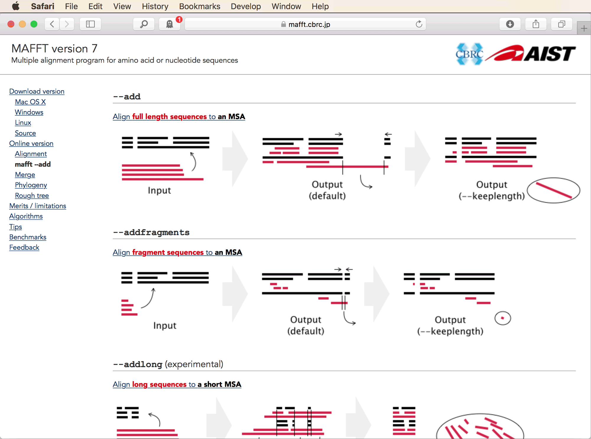
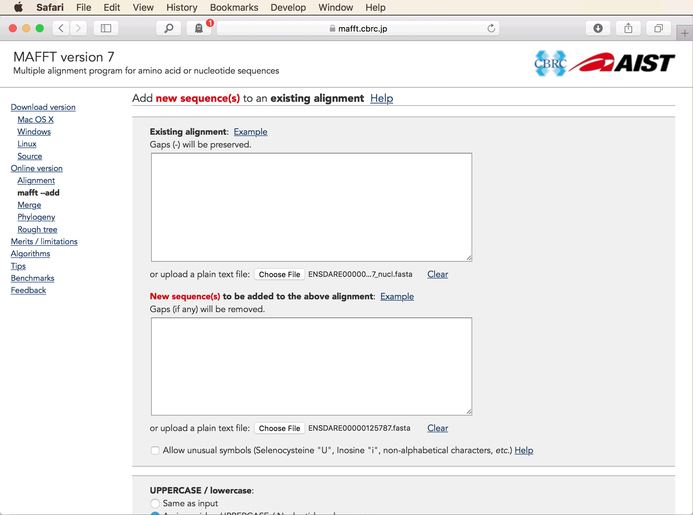
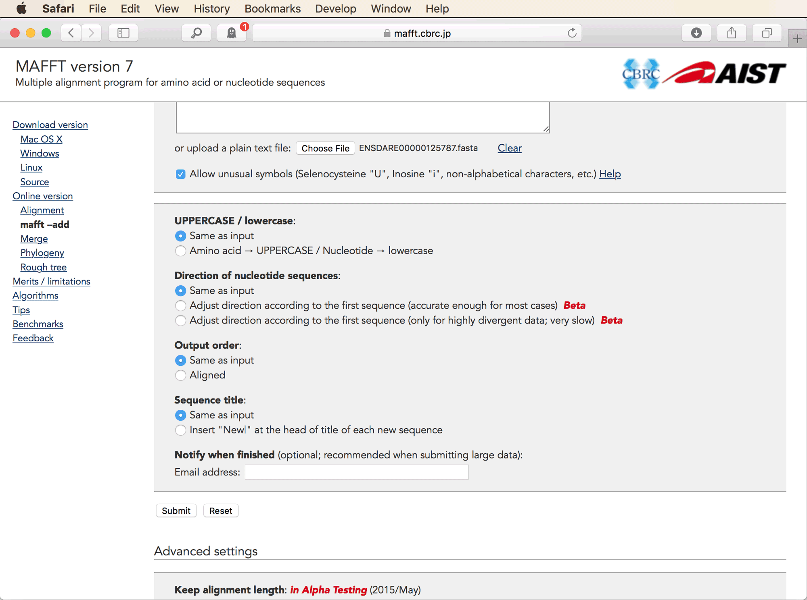
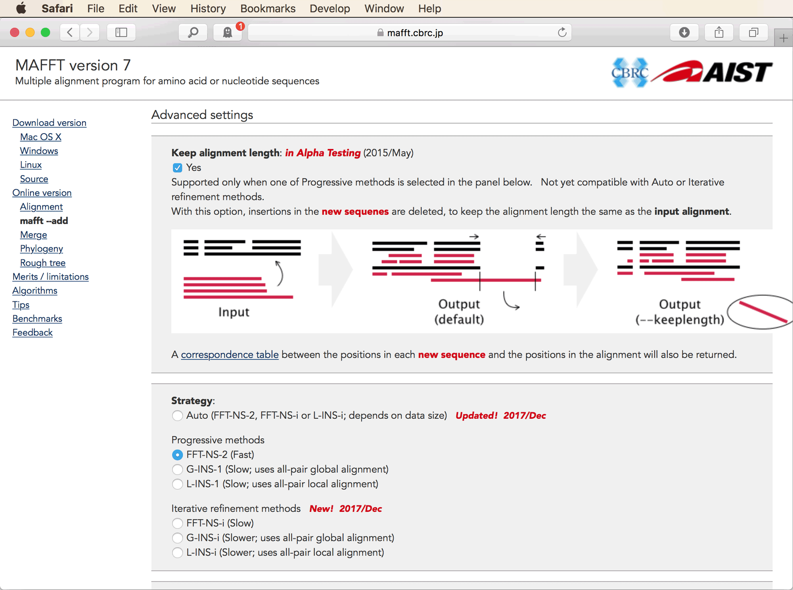

# Local Assembly

A tutorial on the assembly of individual marker sequences from short reads

## Summary

The identification of orthologous sequences in tutorial [Ortholog Detection](../ortholog_detection/README.md) relied on the availability of genome or transcriptome assemblies for all investigated species. However, for many species, assemblies have not been released even if their genomes have been sequenced and short-read data are available from public repositories such as the [European Nucleotide Archive](https://www.ebi.ac.uk/ena). In such cases, one could of course use the publicly available sequence data to generate an assembly prior the ortholog-detection analysis. A faster and possibly even more accurate ([Kucuk et al. 2017](https://academic.oup.com/bioinformatics/article/33/17/2789/3953892)) alternative is the local assembly only of those genomic regions that are of interest. Several tools have been developed for this approach, including [aTRAM](https://github.com/juliema/aTRAM) ([Allen et al. 2018](http://journals.sagepub.com/doi/abs/10.1177/1176934318774546)) and [Kollector](https://github.com/bcgsc/kollector) ([Kucuk et al. 2017](https://academic.oup.com/bioinformatics/article/33/17/2789/3953892)), both of which use a set of query sequences for the initial identification of reads that correspond to target regions. Importantly, the set of query sequences can derive from the genome of another species, and particularly in the case of aTRAM which allows amino-acid sequences as input, this other species does not even have to be closely related to the target species.

## Table of contents

* [Outline](#outline)
* [Dataset](#dataset)
* [Requirements](#requirements)
* [Local assembly with aTRAM2](#atram)
* [Ortholog detection with local assemblies](#detection)
* [Alignment preparation and filtering](#filtering)

## Outline

In this tutorial I am going to present local assembly with [aTRAM](https://github.com/juliema/aTRAM) ([Allen et al. 2018](http://journals.sagepub.com/doi/abs/10.1177/1176934318774546)). Compared to [Kollector](https://github.com/bcgsc/kollector) ([Kucuk et al. 2017](https://academic.oup.com/bioinformatics/article/33/17/2789/3953892)), aTRAM2 requires more computational resources (time and disk space); however, Kollector depends on a range of other tools that may be harder to install than the dependencies of aTRAM2. If possible, I encourage trying to install Kollector, following the description on the [Kollector github repository](https://github.com/bcgsc/kollector) even though I am going to focus on aTRAM2 in this tutorial. Once installed, the use of both tools is rather straighforward. Following local assembly, orthologs will be detected from the assembled read data similar to how this was done based on genome and transcriptome assemblies in tutorial [Ortholog Detection](../ortholog_detection/README.md). Finally, the set of identified orthologs will be added to the exon alignments generated in tutorial [Ortholog Detection](../ortholog_detection/README.md), and the combined alignments will be reduced and filtered so that they can subsequently be used in tutorial [Bayesian Analysis of Reticulate Evolution](../bayesian_analysis_of_reticulate_evolution/README.md).

## Dataset

We are going to perform local assembly with read data of *Neolamprologus pulcher*, another member of the cichlid genus *Neolamprologus* from Lake Tanganyika that was already represented by four species in the dataset used in the [Ortholog Detection](../ortholog_detection/README.md) tutorial. Like the assemblies of the other *Neolamprologus* species, the read data of *Neolamprologus pulcher* were produced for the phylogenomic study of [Gante et al. (2016)](https://onlinelibrary.wiley.com/doi/abs/10.1111/mec.13767). The full read data for *Neolamprologus pulcher* can be found at the European Nucleotide Archive ([https://www.ebi.ac.uk/ena/data/view/PRJEB12322](https://www.ebi.ac.uk/ena/data/view/PRJEB12322)); however, due to the large sizes of the original files (around 10 GB in compressed format, and aTRAM2 requires uncompressing), these would be unnecessarily difficult to handle for this tutorial. Thus, instead of the original files, we are here going to use a pre-filtered dataset from which reads distant to the target regions were already excluded.

## Requirements

* **aTRAM2:** The software aTRAM2 itself is easy to install as it is written in Python3. The installation is described on the [aTRAM github repository](https://github.com/juliema/aTRAM), but you can skip the part in those instructions about the virtual environment, and simply use the two commands below to download the latest version of aTRAM2 and install required Python libraries:

		git clone https://github.com/juliema/aTRAM.git
		pip3 install -r aTRAM/requirements.txt
		
	If the second command should fail, you might have to check if pip3 is installed under the name of "pip" instead. To do so, use `pip --version` and if this outputs a pip version associated with Python 3, then you can use `pip` instead of `pip3`.
		
* **Abyss:** [Abyss](https://github.com/bcgsc/abyss) ([Jackman et al. 2017](https://genome.cshlp.org/content/27/5/768)) is one out of four interchangeable assembler programs supported and internally used by aTRAM2, and is recommended here as its installation is relatively easy on Mac OS X, Linux, and Windows. The other three supported assemblers are [Trinity](https://github.com/trinityrnaseq/trinityrnaseq/wiki) ([Grabherr et al. 2011](https://www.nature.com/articles/nbt.1883)), [Velvet](https://www.ebi.ac.uk/%7Ezerbino/velvet/) ([Zerbino 2010](https://currentprotocols.onlinelibrary.wiley.com/doi/abs/10.1002/0471250953.bi1105s31)), and [SPAdes](http://cab.spbu.ru/software/spades/) ([Bankevich et al. 2012](https://www.ncbi.nlm.nih.gov/pubmed/22506599)); if you should have one of these already installed on your machine you could skip the installation of Abyss. The installation of of Abyss is described on the associated [github repository](https://github.com/bcgsc/abyss).

* **BWA:** The [Burrows-Wheeler Aligner](http://bio-bwa.sourceforge.net) (BWA) ([Li and Durbin 2009](https://academic.oup.com/bioinformatics/article/25/14/1754/225615)) is a requirement of Abyss. Download the latest version of BWA with the following command

		git clone https://github.com/lh3/bwa.git
		
	and then follow the instructions in `README.md` located inside the downloaded directory. Note that to compile with `make` on Mac OS X, you might need to change the first line of the file `Makefile` in the same directory from `CC = gcc` to `CC = clang` (but try the compilation without this change first).

* **BLAST+:** The suite of BLAST ([Altschul et al. 1990](https://www.sciencedirect.com/science/article/pii/S0022283605803602?via%3Dihub)) command-line tools will be required by aTRAM2. If you already ran the [Ortholog Detection](../ortholog_detection/README.md) tutorial, these command-line tools should be installed on your machine. If not, you'll find installers for different platforms on [ftp://ftp.ncbi.nlm.nih.gov/blast/executables/blast+/LATEST/](ftp://ftp.ncbi.nlm.nih.gov/blast/executables/blast+/LATEST/) (connect as anonymous guest to access these files). For installation on Mac OS X, choose the file named `ncbi-blast-2.7.1+.dmg`, for Linux, choose file `ncbi-blast-2.7.1+-1.x86_64.rpm`, and on Windows, use `ncbi-blast-2.7.1+-win64.exe`. More detailed installation instructions can be found in the [online application manual](https://www.ncbi.nlm.nih.gov/books/NBK279671/#introduction.RedHat_Linux).

* **MAFFT:** [MAFFT](https://mafft.cbrc.jp/alignment/software/) ([Katoh and Standley 2013](https://academic.oup.com/mbe/article/30/4/772/1073398)) will be required for adding orthologs identified from local assemblies to the alignments generated in tutorial [Ortholog Detection](../ortholog_detection/README.md). If you ran this other tutorial, you should have MAFFT already installed on your machine. If not, you'll find installation instructions and precompiled versions on the [MAFFT webpage](https://mafft.cbrc.jp/alignment/software/).

* **BMGE:** The program [BMGE](https://research.pasteur.fr/en/software/bmge-block-mapping-and-gathering-with-entropy/) (Block Mapping and Gathering with Entropy) ([Criscuolo and Gribaldo 2010](https://bmcevolbiol.biomedcentral.com/articles/10.1186/1471-2148-10-210)) will be used to remove poorly aligned regions from sequence alignments. If you ran tutorial [Ortholog Detection](../ortholog_detection/README.md), you should already have BMGE installed on your machine. If not, you'll find the latest version of BMGE, provided as a Java jar file, at [ftp://ftp.pasteur.fr/pub/gensoft/projects/BMGE/](ftp://ftp.pasteur.fr/pub/gensoft/projects/BMGE/) (choose login as guest to access the ftp server). Place this file in a convenient location on your own computer.

## Local assembly with aTRAM2

In this part of the tutorial, we are going to prepare a set of query sequences, download read data of *Neolamprologus pulcher*, and use the query sequences to target genomic regions of *Neolamprologus pulcher* that will be locally assembled with aTRAM2.

* Since we would like to target genomic regions of *Neolamprologus pulcher* that may contain orthologs to the markers used in our sequence alignments, we are going to use exon sequences of these alignments as queries to initialize the local assembly. Instead of using the final versions of the sequences alignments prepared in tutorial [Ortholog Detection](../ortholog_detection/README.md) (those in directory `09`), we will go back a few filtering steps to start out once again with a larger set of exons. Specifically, we will use the sequences in directory `03` that were already filtered by bitscore and dN/dS ratio (see tutorial [Ortholog Detection](../ortholog_detection/README.md)), but from which poorly aligned sites were not yet cut out with BMGE. Thus, download the compressed directory [`03.tgz`](data/03.tgz) and uncompress it with the following command:

		tar -xzf 03.tgz

* We are going to use sequences of *Metriaclima zebra* ("metzeb") as queries because these have a lower amount of missing data than the sequences of other *Neolamprologus* species. To extract the sequences of *Metriaclima zebra* ("metzeb") from exons that passed the filters on bitscores and dN/dS ratios, using the following set of commands:

		for i in 03/*_nucl.fasta
		do
			exon_id=`basename ${i%_nucl.fasta}`
			seq=`cat ${i} | grep -A 1 "metzeb" | tail -n 1 | sed 's/\-//g'`
			seq_length=`echo ${seq} | wc -m`
			# Include sequence records only if the sequence is not completely missing.
			if [[ ${seq_length} -gt 1 ]]
			then
				echo ">${exon_id}"
				echo "${seq}"
			fi
		done > metzeb.fasta 

* The set of exon sequences for *Metriaclima zebra* ("metzeb") should now be stored in a file named `metzeb.fasta`. You could check how many exon sequences this file includes, using the next command:

		cat metzeb.fasta | grep ">" | wc -l

* Next, download the pre-filtered files containing paired-end read data for *Neolamprologus pulcher*, [`neopul.r1.fastq.gz`](data/neopul.r1.fastq.gz) and [`neopul.r2.fastq.gz`](data/neopul.r2.fastq.gz).

* Uncompress the two files with paired-end read data, using the following command:

		gunzip neopul.r1.fastq.gz
		gunzip neopul.r2.fastq.gz

* With the query-sequence file and the read-data files prepared, we are now ready to perform local assembly with aTRAM2. However, this analysis with aTRAM2 is a two-spep process, where the first step is generating a read library in SQL format. This library is prepared by script `atram_preprocessor.py` which is part of the aTRAM2 package. We'll use "-b neopul" to specify the prefix for the name of the output, as well as "--end-1 neopul.r1.fastq" and "--end-2 neopul.r2.fastq" to specify the names of the input files with the forward and reverse reads, respectively, of each read pair:

		python3 aTRAM/atram_preprocessor.py -b neopul --end-1 neopul.r1.fastq --end-2 neopul.r2.fastq

	This command should finish within seconds, but might take much longer (hours) with input files containing Gigabytes of read data, or when the analysis is done on a machine with a rotating hard drive instead of an SDD drive.

* The previous command should have generated a file for the SQL library named `neopul.sqlite.db` as well as files for a BLAST library that are named `neopul.001.blast.nhr`, `neopul.001.blast.nin`, and `neopul.001.blast.nsq`. Make sure that these files are present in your analysis directory, then run the below command to run the second step of local assembly with aTRAM2. Note that if you did not install the assembler Abyss because you already had Trinity, Velvet, or SPAdes, you should replace "abyss" in this command correspondingly with "trinity", "velvet", or "spades".

		python3 aTRAM/atram.py -b neopul -Q metzeb.fasta -a abyss -o neopul
		
	This analysis with aTRAM2 might take around half an hour.
	
* Once the aTRAM2 analysis has finished, you should find a large number of Fasta files in your analysis directory, each of them representing the local assembly initiated by one of the queries. The Fasta files will all be named `neopul.neopul_metzeb_*.fasta`. You may ignore those that do not end in `.filtered_contigs.fasta`. For ease of handling, we'll concatenate all of these files that do end in `.filtered_contigs.fasta` into a single Fasta file, using the following command:

		cat neopul.neopul_metzeb_*.filtered_contigs.fasta > neopul.fasta
		
* Then, to remove files that are no longer needed from the analysis directory, you could run the following commands:

		rm neopul.neopul_metzeb_*
		rm neopul.001.blast.*
		rm neopul.sqlite.db

* Have a look at the file [`neopul.fasta`](res/neopul.fasta) generated with the command above. **Question 1:** How many sequences are included in this file? [(see answer)](#q1)

The locally assembled sequences in file `neopul.fasta` are likely to include orthologs to most of the exons used as query sequences. As the query sequences were already selected so that no gene duplications occurred during the diversification of cichlid fishes, the absence of paralogs among the locally assembled sequences can not be guaranteed. Thus, before adding locally assembled sequences of *Neolamprologus pulcher* to the dataset of sequence alignments generated in tutorial [Ortholog Detection](../ortholog_detection/README.md), the locally assembled sequences of *Neolamprologus pulcher* will need to be subjected to an additional ortholog-detection analysis.

## Ortholog detection with local assemblies

In this part of the tutorial, we are going to use (as in tutorial [Ortholog Detection](../ortholog_detection/README.md)) the Python script `find_orthologs.py` from the github repository of [Malmstrøm et al. (2016)](https://www.nature.com/articles/ng.3645) to identify orthologs to the query exon sequences from the locally assembled sequences for *Neolamprologus pulcher*. By using this script, the orthologs will also be automatically trimmed so that the resulting sequences begin and end with a first and third codon position, respectively.

* Since `find_orthologs.py` internally runs BLAST searches, a BLAST database should first be prepared for the locally assembled sequences of *Neolamprologus pulcher*. Do so with the following command:

		makeblastdb -in neopul.fasta -dbtype nucl
		
		
* Obtain script `find_orthologs.py` once again from the github repository of [Malmstrøm et al. (2016)](https://www.nature.com/articles/ng.3645) using the following command:

		wget https://raw.githubusercontent.com/uio-cees/teleost_genomes_immune/master/S11_S14_ortholog_detection_and_filtering/scripts/resources/find_orthologs.py
	
	(or copy it from another directory if you already have it on your machine).

* Run script `find_orthologs.py` with the same set of exon queries from *Metriaclima zebra* that we also used to initialize local assembly with aTRAM2. As the subject, we will use the set of locally assembled sequences for  *Neolamprologus pulcher*, stored in file `neopul.fasta`. With the option "-s 1", we specify (as in tutorial [Ortholog Detection](../ortholog_detection/README.md)) a "strictness" setting of 1. Note that in contrast to the analysis in tutorial [Ortholog Detection](../ortholog_detection/README.md), we now don't specify the "-t" option, which means that query sequences are now not in amino-acid code and that therefore the BLASTN algorithm should be used instead of TBLASTN. Thus, run the following command:

		python3 find_orthologs.py -s 1 metzeb.fasta neopul.fasta

* The analysis with the script `find_orthologs.py` should have generated a large number of alignment files named `ENSDARE*.fasta`, and each of these will include two sequences: The query sequence as well as the best significant BLASTN hit (provided that a significant hit was found at all). To see for how many queries a significant hit was found, compare the total number of alignment files generated with the number of alignment files that contain sequence information for *Neolamprologus pulcher*. You can get the first number with

		ls ENSDARE*.fasta | wc -l
	
	and the second number with the following set of commands:
	
		for i in ENSDARE*.fasta
		do
			tail -n 1 ${i} | grep -e A -e C -e G -e T
		done | wc -l
		

## Alignment preparation and filtering

The use of the script `find_orthologs.py` ensured that the *Neolamprologus pulcher* sequences included in the newly generated alignments begin and end with first and third codon positions, respectively. However, they might still not be aligned to the query sequences in exactly the same way as the sequences in the alignments generated for eleven cichlid species (plus the zebrafish reference) in tutorial [Ortholog Detection](../ortholog_detection/README.md). Thus, we can not simply add the new sequences to the previously generated alignments without realigning them jointly. On the other hand, if all sequences would be realigned jointly, care should be taken not to change the relative positions of the previously aligned sequences or their reading frame could change, which in turn could influence phylogenetic analyses if we would use codon information. To add the sequences of *Neolamprologus pulcher* to the alignments of the eleven other species, we will therefore use a special method of the software MAFFT that ensures that an existing alignment is not changed while new sequences are added.

* To see a case in which the new alignments of *Neolamprologus pulcher* and the *Metriaclima zebra* query sequences can differ from the alignments generated previously, open files [`ENSDARE00000125787.fasta`](res/ENSDARE00000125787.fasta) and [`ENSDARE00000125787_nucl.fasta`](res/ENSDARE00000125787_nucl.fasta) in a text editor or an alignment viewer such as AliView. **Question 2:** Why can we not simply copy the sequence for *Neolamprologus pulcher* ("neopul") from the first file and copy it to the alignment of the second file? [(see answer)](#q2)

* Visit the [MAFFT webpage](https://mafft.cbrc.jp/alignment/server/add.html) to learn about the available options for the addition of new sequence data to existing alignments. You should see options shown in the next screenshot.

In our case, the most relevant option is the "--add" option shown at the top, since in our case the *Neolamprologus pulcher* sequences that should be added to the alignments are about the same length as the existing alignments. As shown in the illustrations at the top right, MAFFT also allows to cut out insertions in the newly added sequences that would change the length of the original alignment. This is convenient in our case, since species-specific insertions in *Neolamprologus pulcher* would anyway contain no phylogenetic information. Thus, by using the combination of the options "--add" and "--keeplength", the new sequences can be added to an existing alignment without changing the existing alignment at all.

* To see an exemplary MAFFT alignment when options "--add" and "--keeplength" are used, click on the illustration in the top right of the MAFFT webpage, which should link to the server version of MAFFT where you can upload input data. Choose file [`ENSDARE00000125787_nucl.fasta`](res/ENSDARE00000125787_nucl.fasta) for "Existing alignment" and file [`ENSDARE00000125787.fasta`](res/ENSDARE00000125787.fasta) for "New sequence(s)", as shown in the next screenshot.

* Then, scroll down and set all of the next four options to "Same as input", as shown in the next screenshot.

* Scroll even further to the advanced settings section shown in the next screenshot. There, set a tick in the checkbox below "Keep alignment length", and also select the "FFT-NS-2" alignment strategy in the next section, because, as described on this webpage, the "--keeplength" option is not yet available together with the "Auto" strategy. Then, click one of the "Submit" buttons.

The complete alignment should be displayed within seconds. As you'll be able to see, MAFFT has added the two sequences from file [`ENSDARE00000125787.fasta`](res/ENSDARE00000125787.fasta) without any changes to the existing alignment. Below the alignment, you'll be shown the command-line options that correspond to the selected settings.

* We will now run the same type of MAFFT analysis to add the *Neolamprologus pulcher* sequence from the new alignments to the corresponding existing alignment. Use the following set of commands to do so, and to save the combined alignments to a new directory named `04`:

		mkdir 04
		for i in 03/*_nucl.fasta
		do
			exon_id=`basename ${i%_nucl.fasta}`
			if [ -f ${exon_id}.fasta ]
			then
				# Copy only the neopul sequence to a temporary file.
				tail -n 2 ${exon_id}.fasta > tmp.fasta
				# Add the neopul sequence to the existing alignment of 11 cichlids.
				mafft --inputorder --keeplength --anysymbol --add tmp.fasta ${i} > 04/${exon_id}_nucl.fasta 
				# Clean up the temporary file.
				rm tmp.fasta
			fi
		done
		
* Now that the *Neolamprologus pulcher* sequences have been added to the alignments generated in tutorial [Ortholog Detection](../ortholog_detection/README.md), we could resume the alignment-filtering pipeline presented in that tutorial. The next step in that pipeline would be to remove poorly aligned sites as well as sites that mostly contain gaps or missing data with the software BMGE. However, before doing so, it makes sense to first reduce all alignments to the set of species that will be used in subsequent analyses. The set of filtered alignments generated here is going to be used to infer hybridization among *Neolamprologus* species in tutorial [Bayesian Analysis of Reticulate Evolution](../bayesian_analysis_of_reticulate_evolution/README.md). Thus, all species that are not part of the genus *Neolamprologus* can now be removed from the alignments. An easy way to do so is by using the Python script [`convert.py`](src/convert.py) even though we do not need to convert the file format in the same step. This is because the script [`convert.py`](src/convert.py) allows filtering based on sequence names with the option "-p". Thus, by specifying "-p neo", only *Neolamprologus* species will be included in the output. Thus, run the following set of commands to exclude all species other than *Neolamprologus* species from all alignments, and to save the reduced alignments in a new directory named `05`.

		mkdir 05
		for i in 04/*_nucl.fasta
		do
			exon_id=`basename ${i%_nucl.fasta}`
			python3 convert.py ${i} 05/${exon_id}_nucl.fasta -f fasta -p neo
		done
		
* After removing all species except *Neolamprologus* species, it is now possible that some alignments contain no data at all, if they previously contained only data for the removed species. Since alignments without sequence data would cause BMGE to crash, we'll first first filter alignments based on the number of missing sequences. But instead of just excluding those alignments that have no sequences at all, we'll remove all alignments that have any missing sequences to retain only the most suitable alignments for subsequent phylogenetic analyses in tutorial [Bayesian Analysis of Reticulate Evolution](../bayesian_analysis_of_reticulate_evolution/README.md). We can do so again with the Ruby script [`filter_exons_by_missing_data.rb`](src/filter_exons_by_missing_data.rb) that was also used in tutorial [Ortholog Detection](../ortholog_detection/README.md). To copy only alignments without  completely missing sequences to a new directory named `06`, use the following command:

		ruby filter_exons_by_missing_data.rb 05 06 0 0
		
* Find out how many alignments are now left in directory `06` that contain sequence information for all five *Neolamprologus* species, using the following command:

		ls 06/*.fasta | wc -l

* We can now run BMGE to remove poorly aligned sites as well as sites with a large proportion of gaps or missing data. Use the Ruby script [`filter_sites_with_BMGE.rb`](src/filter_sites_with_BMGE.rb), which was also used in tutorial [Ortholog Detection](../ortholog_detection/README.md), to run BMGE and to remove sites identified by BMGE without disrupting the reading frame of the alignment. As in tutorial [Ortholog Detection](../ortholog_detection/README.md), we'll set the maximum gap rate to 0.2 and the maximum entropy score to 0.5. Thus, run BMGE with the following command (but replace `BMGE.jar` with the actual path to the BMGE jar file if it is not located in your analysis directory).

		ruby filter_sites_with_BMGE.rb 06 07 BMGE.jar 0.2 0.5

* In the next step, we'll re-use the Ruby script [`filter_exons_by_missing_data.rb`](src/filter_exons_by_missing_data.rb) to remove alignments with a length below 150 bp. The reason why this was not done before when the script `filter_exons_by_missing_data.rb` was used the first time is that the size of the alignments may have been reduced since then by the BMGE analysis. Use the following command to copy only alignments of a sufficient length to directory `08`.

		ruby filter_exons_by_missing_data.rb 07 08 0 150

* As in tutorial [Ortholog Detection](../ortholog_detection/README.md), we can then again concatenate alignments of those exons that are part of the same genes, using the Ruby script [`concatenate_exons_per_gene.rb`](src/concatenate_exons_per_gene.rb) and the file [`exons_info.txt`](data/exons_info.txt), which contains a table with gene IDs for each exon. To do so, use the following command.

		ruby concatenate_exons_per_gene.rb 08 09 exons_info.txt

* Have a look at the lengths of the gene alignments, which you can quickly calculate with the following set of commands.

		for i in 09/*.fasta
		do
			echo -ne "${i}\t"
			head -n 2 ${i} | tail -n 1 | wc -m
		done

	You'll see that as in tutorial [Ortholog Detection](../ortholog_detection/README.md), some alignments are again quite short (100-500 bp) and may thus not be very useful for phylogenetic analysis.

* To copy only alignments with a length of at least 500 bp to a new directory named `10`, use the following set of commands.

		mkdir 10
		for i in 09/*.fasta
		do
			gene_id=`basename ${i%.fasta}`
			seq_length=`head -n 2 ${i} | tail -n 1 | wc -m`
			if [[ ${seq_length} -ge 500 ]]
			then
				cp ${i} 10/${gene_id}.fasta
			fi
		done
		
	**Question 3:** How many alignments are now left in directory `10`, and what is their average length? [(see answer)](#q3)

We have now generated a large set of alignments for the five *Neolamprologus* species that will be highly useful for phylogenetic analyses and hopefully allow insights into the causes of the strong tree discordance observed in tutorial [Bayesian Species-Tree Inference](bayesian_species_tree_inference/README.md). To investigate these causes, these alignments will be used for analyses with a model incorporating both incomplete lineage sorting and introgression, in tutorial [Bayesian Analysis of Reticulate Evolution](bayesian_analysis_of_reticulate_evolution).

 

                   

## Answers

* **Question 1:** Due to stochastic variation during the assembly, the exact number of sequences in file `neopul.fasta` may differ, but it should be around around 1,800, as you can find out with the following command:

		cat neopul.fasta | grep ">" | wc -l
		
	One reason why this file includes more sequences than the query file used to initialize local assembly is that per local assembly, results from up to five steps of the assembly process were written to the output files. This means that file `neopul.fasta` contains the same sequences multiple times. While duplicates could be removed from file `neopul.fasta`, this is not necessary as their presence will not influence the outcome of the ortholog-detection analysis for *Neolamprologus pulcher*. Another reason for the larger number of sequences in this file compared to the query sequences is that each query may of course also have matched at several locations of the *Neolamprologus pulcher*, thus leading to more than one locally assembled region per query.

* **Question 2:** The sequences from the two alignments can not simply be combined without realignment, because the larger alignment contains a gap that was opened owing to an insertion in the zebrafish ("danrer") sequence. As zebrafish was not included in the other alignment, the gap is also not present, therefore the total lengths of the alignments differ.

* **Question 3:** Due to stochasticity in the local assembly with aTRAM2, the exact number of the filtered alignments in directory `10` might vary a little, but should be around 68. To find the number of filtered alignments, use the following command.

		ls 10/*.fasta | wc -l
		
	The average alignment length of the filtered alignments is around 1,000 bp, and can be calculated with the following set of commands.
	
		for i in 10/*.fasta
		do
			echo -ne "${i}\t"
			head -n 2 ${i} | tail -n 1 | wc -m
		done | awk '{ sum += $2; n++ } END { if (n > 0) print sum / n; }'