# Maximum-Likelihood Phylogenetic Inference

A tutorial on phylogenetic inference with maximum likelihood

## Summary

As the name indicates, maximum-likelihood phylogenetic inference aims to find the parameters of an evolutionary model that maximize the likelihood of observing the dataset at hand. The model parameters include the tree topology and its branch lengths but also all parameter of the substitution model (such as HKY or GTR) assumed in the inference. As the search space for these parameters is enormous when the dataset contains more than just a handful of taxa, all modern programs for maximum-likelihood phylogenetic inference apply heuristics to reach the maximum-likelihood parameter combination.

## Table of contents

* [Outline](#outline)
* [Dataset](#dataset)
* [Requirements](#requirements)
* [Visualizing sequence alignments](#aliview)
* [Maximum-likelihood phylogenetic inference with IQ-TREE](#iqtree)
* [Reading and visualizing tree files](#figtree)
* [Assessing node support with bootstrapping](#bootstrap)
* [Partitioned maximum-likelihood inference](#partition)
* [Comparing the reliability of different phylogenies](#comparison)
* [Phylogenetic inference with concatenated alignments](#concatenation)

## Outline

In this tutorial, I will present maximum-likelihood phylogeny inference with one of the fastest programs developed for this type of analysis, the program [IQ-TREE](http://www.iqtree.org) ([Nguyen et al. 2015](https://academic.oup.com/mbe/article/32/1/268/2925592)). I will demonstrate how the reliability of nodes in the phylogeny can be assessed with bootstrapping ([Felsenstein 1985](https://www.jstor.org/stable/2408678), [Hoang et al. 2017](https://academic.oup.com/mbe/article/35/2/518/4565479)), how unlinked substitution models can be applied to separate partitions, and how alignments of multiple genes can be concatenated to be jointly used in the same phylogenetic analysis.

## Dataset

The data used in this tutorial are the filtered versions of the alignments generated for 16S and *RAG1* sequences in tutorial [Multiple Sequence Alignment](../multiple_sequence_alignment/README.md). These alignments contain sequence data for 41 teleost fish species and are 486 and 1,368 bp long, respectively. More information on the origin of the dataset can be found in the [Multiple Sequence Alignment](../multiple_sequence_alignment/README.md) tutorial. While IQ-TREE also allows other file formats (including Phylip and Fasta), we will here use the alignment files in Nexus format, [`16s_filtered.nex`](data/16s_filtered.nex) and [`rag1_filtered.nex`](data/rag1_filtered.nex).

## Requirements

<!-- XXX remove this paragraph later XXX--->
* **AliView:** To visualize sequence alignments, the software [AliView](http://www.ormbunkar.se/aliview/) ([Larsson 2014](https://academic.oup.com/bioinformatics/article/30/22/3276/2391211)) is recommended. The installation of AliView is described at [http://www.ormbunkar.se/aliview/](http://www.ormbunkar.se/aliview/) and should be possible on all operating systems.

* **IQ-TREE:** Source code for Mac OS X and Linux, as well as precompiled executables for Windows, can be found on [IQ-TREE's download page](http://www.iqtree.org/#download). To install IQ-TREE on any of these systems, download the version for your operating system, and decompress this file on your machine if necessary. In the decompressed directory, you'll find a subdirectory named `bin` and inside of this subdirectory should be a file named `iqtree` or `iqtree.exe`. To easily access this executable from the command line, place it somewhere on your computer where your system can find it (i.e. in a directory that is included in your [PATH](https://en.wikipedia.org/wiki/PATH_(variable))). One way to guarantee this on Mac OS X or Linux is to place the executable in `/usr/local/bin`, for example using this command:
	
		mv iqtree /usr/local/bin
		
	(on Windows, just use `move` instead of `mv`).
	To verify that the IQ-TREE executable can be found by your system, type the following command:
	
		which iqtree
		
	(on Windows, `where` instead of `which` should do the same). If this command outputs a path such as `/usr/local/bin/iqtree`, the executable can be found. As a second test if IQ-TREE is working as it should, type this:
	
		iqtree -version
		
	You should then see the version number as well as a list of contributing developers. If you do, you're ready to use IQ-TREE.
	
* **FigTree:** The program [FigTree](http://tree.bio.ed.ac.uk/software/figtree/) by Andrew Rambaut is a very intuitive and useful tool for the visualization and (to a limited extent) manipulation of phylogenies encoded in [Newick](http://evolution.genetics.washington.edu/phylip/newicktree.html) format. Executables for Mac OS X, Linux, and Windows are provided on [https://github.com/rambaut/figtree/releases](https://github.com/rambaut/figtree/releases).

<!-- XXX remove this section later XXX--->

## Visualizing sequence alignments

To get an impression of the data used in this tutorial, we will visualize the alignment files in AliView.

* Download the files [`16s_filtered.nex`](data/16s_filtered.nex) and [`rag1_filtered.nex`](data/rag1_filtered.nex) and open them both with the program AliView. With the 16S alignment, the AliView window should look as shown in the screenshot below: 
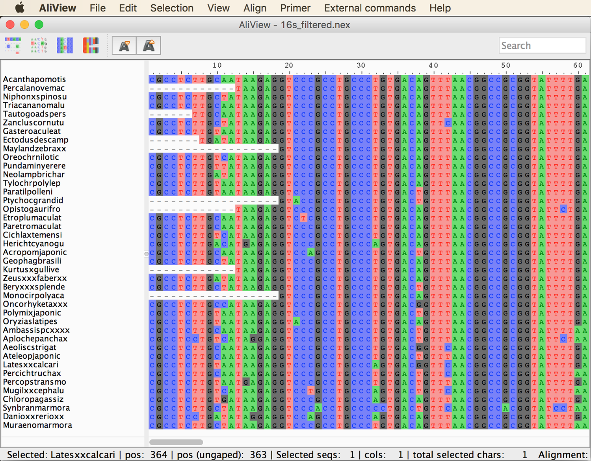

* Scroll to the end of the aligment to see how variable the sequences are and how many of them are partially missing.

* Do the same for the *RAG1* alignment.

* In contrast to 16S, *RAG1* is protein coding. To illustrate the translation of codon triplets to amino acids, click on the fourth icon from the left in AliView menu bar. AliView should then color code triplets as shown below: 
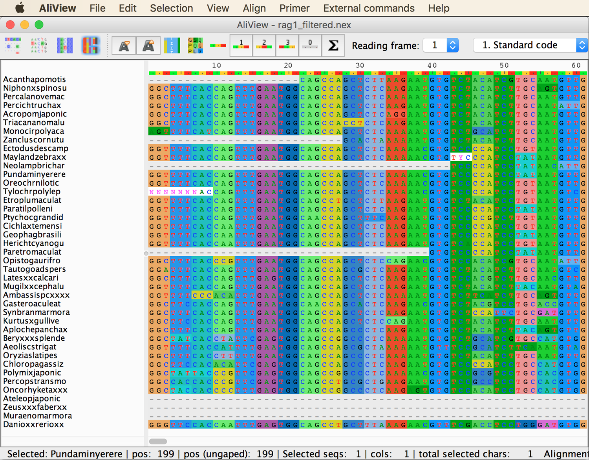

	

## Maximum-likelihood phylogenetic inference with IQ-TREE

We will first generate a simple maximum-likelihood phylogeny only for the filtered 16S sequence alignment.

* To get an impression of the many options available in IQ-TREE, have a look at the long help text of the program:

		iqtree -h
		
* Scroll back up to the beginning of the IQ-TREE help text. Close to the top, you'll see that IQ-TREE could be started as easily as this:

		iqtree -s alignment

	Here, "alignment" would need to be replaced with the actual file name of the alignment.

* So, let's try to run a maximum-likelihood search, first for the 16S sequence data, using the alignment file [`16s_filtered.nex`](data/16s_filtered.nex):

		iqtree -s 16s_filtered.nex

	As you'll see, this minimalistic choice of options in fact seems to be sufficient. IQ-TREE should finish the analysis within 10-30 seconds and present output as shown in the screenshot below.
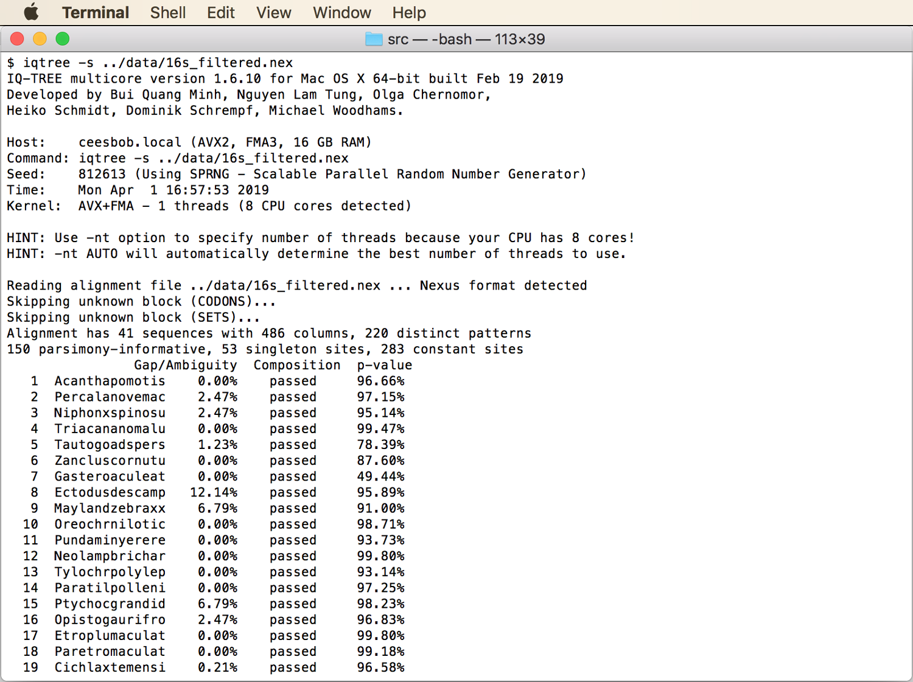
If you read the top section of the output, you'll see that IQ-TREE has apparently automatically determined the number of CPUs available on your machine and indicates that you could use them all by specifying `-nt AUTO`. You'll also see that IQ-TREE has correctly identified the Nexus format of the sequence alignment, and that it reports the proportion of missing data in each sequence.

* Then, scroll down a little to this section:
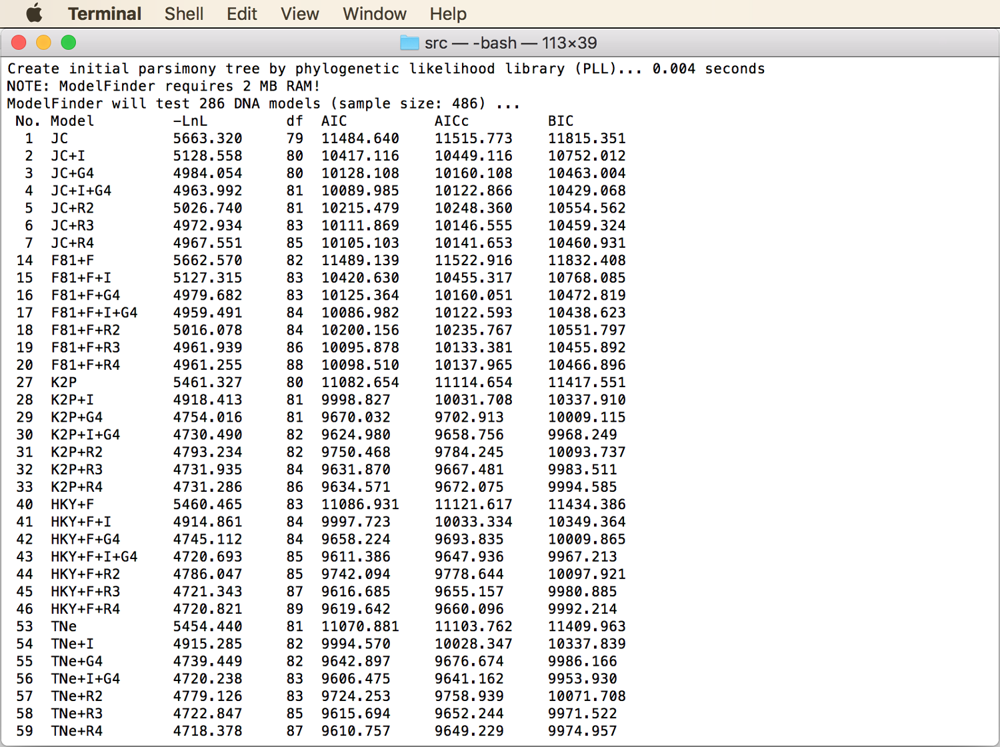
Here, you'll see that IQ-TREE has apparently automatically performed a test for the substitution model that best fits the sequence alignment (see tutorial [`substitution_model_selection`](../substitution_model_selection/README.md) for more information on the choice of substitution models). This means that the default setting of IQ-TREE is equivalent to the `-m MFP` option described in the help text ([Kalyaanamoorthy et al. 2017](https://www.nature.com/articles/nmeth.4285)). Alternatively, other substitution models could be specified, for example with `-m GTR`, but there is no need to do that; it is very convenient that IQ-TREE does the model selection for us.

	**Question 1:** Which model has been chosen by IQ-TREE, and based on which criterion? [(see answer)](#q1)
	
* Scroll to the end of the IQ-TREE output. There, you'll find parameter estimates for the selected substitution model, the maximum-likelihood value (given as logarithm after "BEST SCORE FOUND"), information on the run time, and the names of output files. Write down the maximum-likelihood value.

* The best-scoring maximum-likelihood tree was written to file `16s_filtered.nex.treefile`:
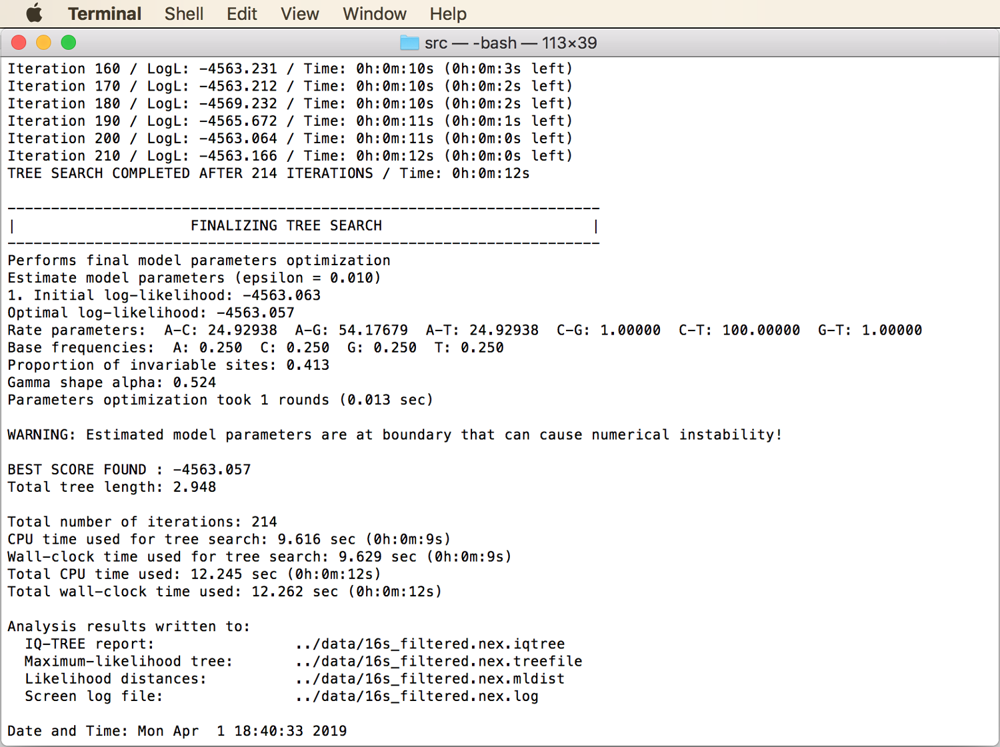
Apparently, all output file names were automatically chosen based on the name of the input file. We could have changed this using the `-pre` option if we wanted to.

## Reading and visualizing tree files

In this part of the tutorial, we will explore how phylogenetic trees are encoded in Newick format, the format used by almost all phylogenetic sofware, and we will visualize the maximum-likelihood phylogeny generated with IQ-TREE with the program [FigTree](http://tree.bio.ed.ac.uk/software/figtree/) (fun fact: The Newick format is named after the [Newick's restaurant](http://www.newicks.com) in Dover, New Hampshire, where Joe Felsenstein and other developers of the format ["enjoyed the meal of lobsters"](http://evolution.genetics.washington.edu/phylip/newicktree.html) in 1986). A good explanation of the format and information on its origin can be also be found [here](http://evolution.genetics.washington.edu/phylip/newicktree.html).

* Open the file [`16s_filtered.nex.treefile`](res/16s_filtered.nex.treefile) in a text editor, or on the command line using for example the `less` command:

		less 16s_filtered.nex.treefile

	You'll see a long string containing the taxon IDs, each of which is followed by a colon and a number, and together with these, the taxon IDs are embedded in parentheses. As an example, a short (and simplified) segment of the string is this:
	
		((Ambassispcxxxx:0.04,Synbranmarmora:0.24):0.02,Mugilxxcephalu:0.13)

* Open the program FigTree, copy the above short part of the tree string, and paste it into the new FigTree window. You'll see a phylogeny of the three taxa *Mugil cephalus* ("Mugilxxcephalu"), *Synbranchus marmoratus* ("Synbranmarmora"), and *Ambassis* sp. ("Ambassispcxxxx"), as shown in the screenshot below.

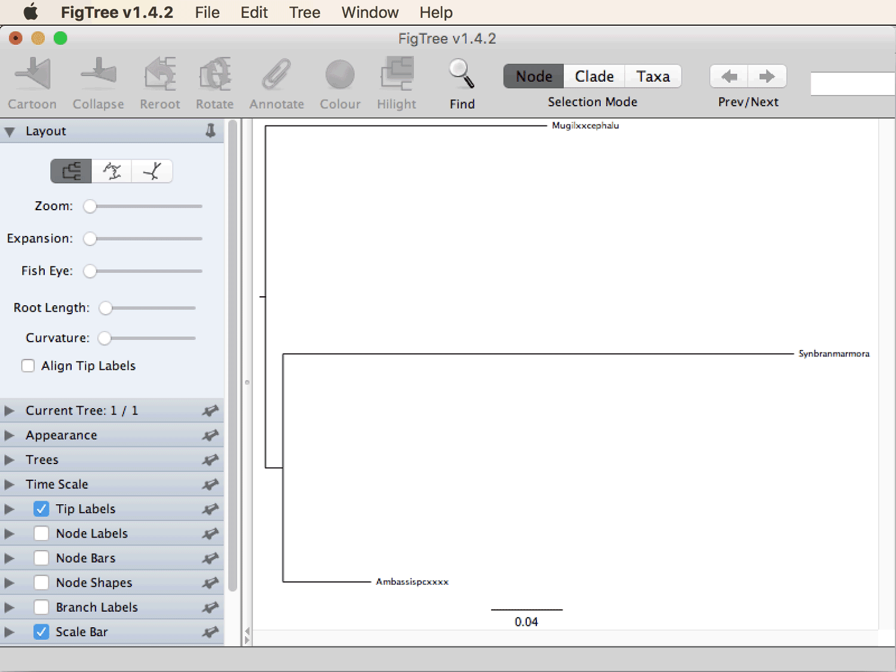

* For better visualization, increase the font size for tip labels in the panel at the left (click on the triangle to the left of "Tip Labels" to open it), and untick the checkbox next to "Scale Bar", as shown in the next screenshot.

* Also tick the checkbox next to "Branch Labels" to display the branch lengths as in the next screenshot. You'll recognize that the branch lengths correspond to the numbers specified in the tree string after the colons:
 
		((Ambassispcxxxx:0.04,Synbranmarmora:0.24):0.02,Mugilxxcephalu:0.13)
		

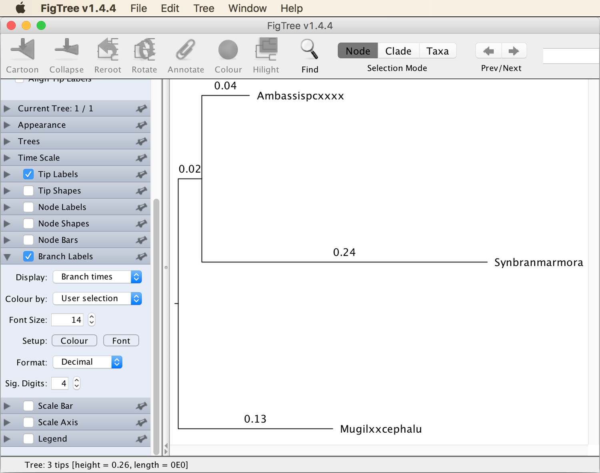
By comparing the tree string and the visualization, you'll see that the parentheses encode the relationships among taxa. For example, the pair of parentheses around "Ambassispcxxxx:0.04,Synbranmarmora:0.24" specifies that the taxon names listed inside of it form one monophyletic clade. Thus, *Synbranchus marmoratus* ("Synbranmarmora") and *Ambassis* sp. ("Ambassispcxxxx") are defined as sister taxa that are closer to each other than either of them is to *Mugil cephalus* ("Mugilxxcephalu").
	
* Next, open the complete phylogeny generated by IQ-TREE (file [`16s_filtered.nex.treefile`](res/16s_filtered.nex.treefile)) in FigTree. It should look more or less as shown in the below screenshot.
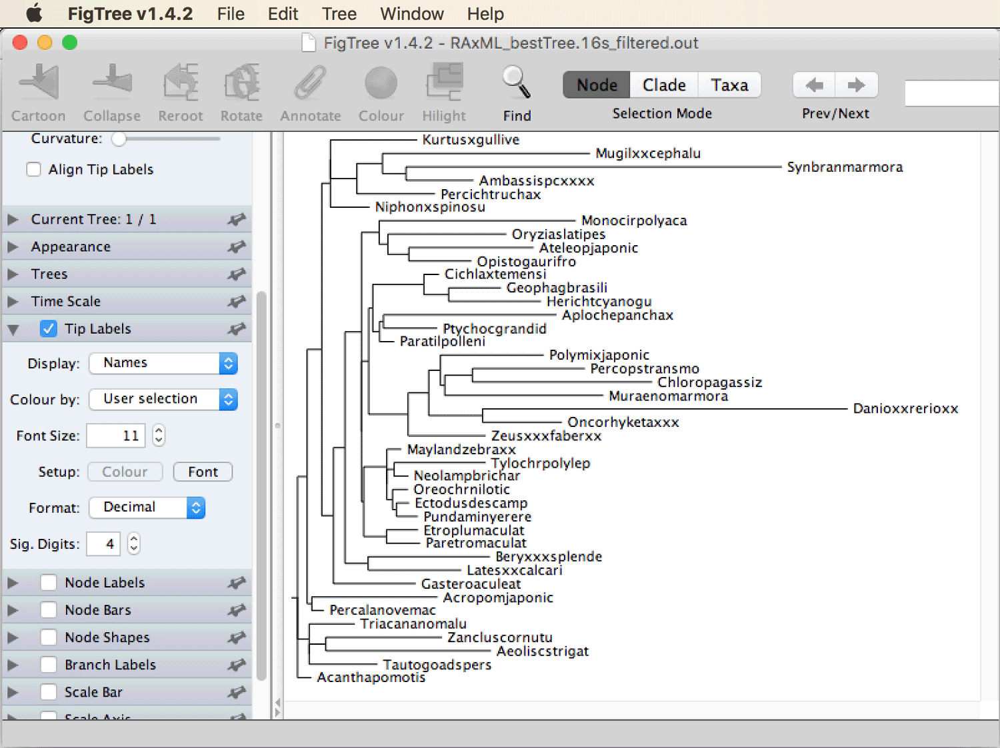
The way the phylogeny is rooted in the above screenshot is arbitrary, because we so far did not specify how the rooting should be done either in the IQ-TREE analysis or in the visualization with FigTree. So this phylogeny provides no evidence that *Acantharchus pomotis* ("Acanthpomotis") is the sister to all the other teleost fishes (only that is is first among these in the alphabet).

* To correct the rooting of the phylogeny, we can specify an outgroup. From the taxonomy of the species included in this dataset, we know that zebrafish (*Danio rerio*; "Danioxxrerioxx") is a member of the clade named "Otomorpha" whereas all other species belong to the clade named "Euteleosteomorpha" ([Betancur-R. et al. 2017](https://bmcevolbiol.biomedcentral.com/articles/10.1186/s12862-017-0958-3)). Thus, the correct root of the phylogeny must lie between zebrafish and the other taxa. To specify zebrafish as an outgroup, click on the branch leading to "Danioxxrerioxx", as shown in the next screenshot.

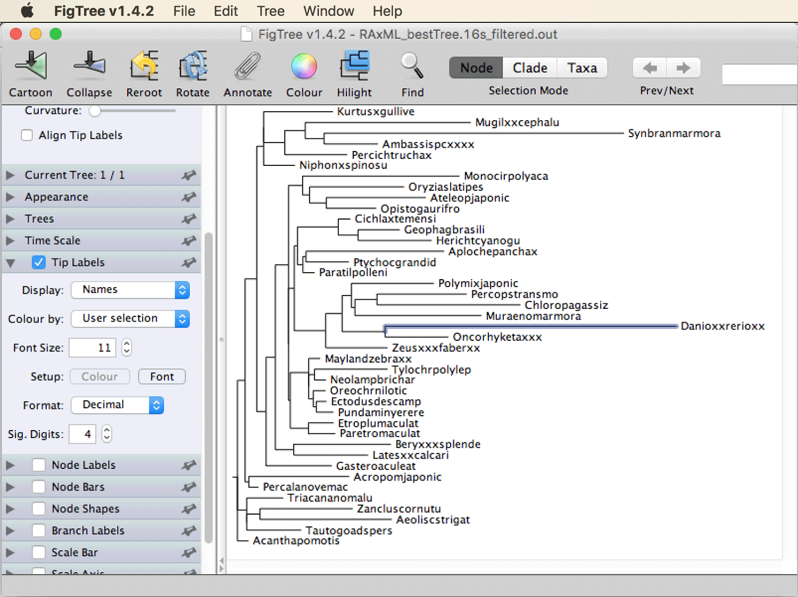

* Then, with that branch being selected, click on the "Reroot" icon with the yellow arrow in the menu bar. The phylogeny should then look as shown in the next screenshot.

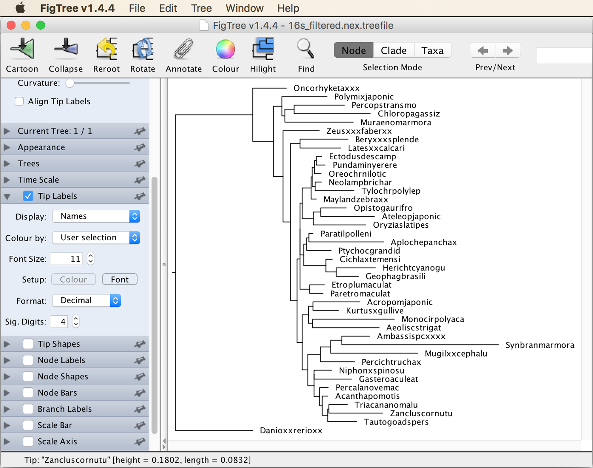

* As a final change, we could sort the taxa according to node order. To do so, click "Decreasing node order" in FigTree's "Tree" menu. This should move "Danioxxrerioxx" to the top of the plot:
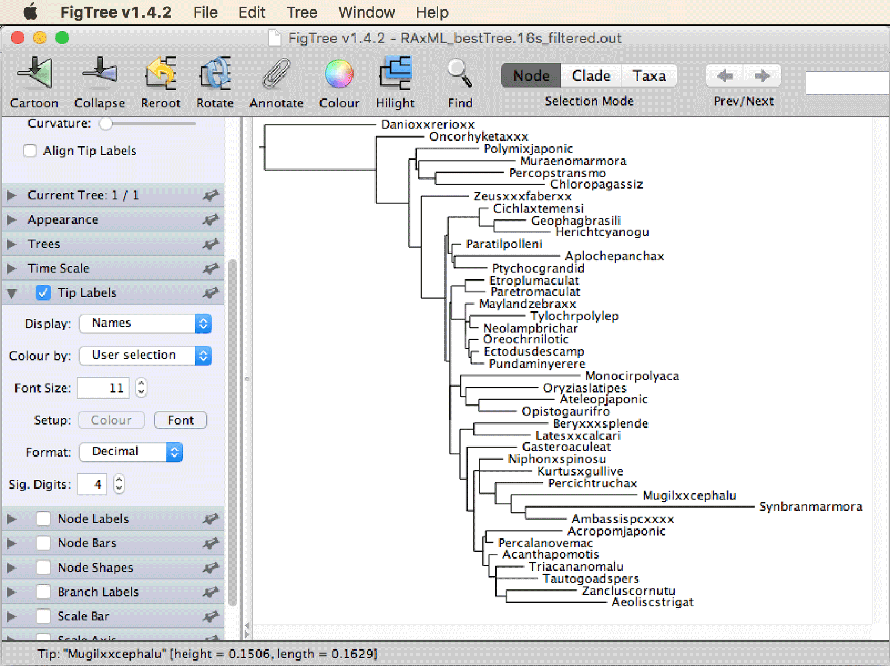
It is almost surprising how well this phylogeny resolves the correct relationships among the 41 taxa (which are known rather well from more extensive studies based on large molecular datasets as well as morphology).

	**Question 2:** Do cichlid fishes appear monophyletic in this phylogeny (to answer this, you may need to look up the [table in the Multiple Sequence Alignment](../multiple_sequence_alignment/README.md) tutorial)? [(see answer)](#q2) 
		
	**Question 3:** And are Neotropical cichlids (*Cichla temensis*, *Geophagus brasiliensis*, *Herichthys cyanoguttatus*) monophyletic? [(see answer)](#q3)

## Assessing node support with bootstrapping

As we've seen, the IQ-TREE phylogeny of 16S sequences does not perfectly agree with relationships inferred in other studies (e.g. [Matschiner et al. 2017](https://academic.oup.com/sysbio/article/66/1/3/2418030); [Betancur-R. et al. 2017](https://bmcevolbiol.biomedcentral.com/articles/10.1186/s12862-017-0958-3)) or with the taxonomy of teleost fishes. However, so far, we have no indication of the reliability of the individual nodes in the phylogeny, therefore we can not assess how strong the evidence of this phylogeny weighs against other findings. To identify which nodes in the phylogeny are more or less trustworthy, we will now perform a bootstrap analysis, again with IQ-TREE.

* Have a look once more at the long help text of IQ-TREE to see the available options for bootstrapping:

		iqtree -h

* Scroll towards the top of the help text, there you should find two sections titled "ULTRAFAST BOOTSTRAP" and "STANDARD NON-PARAMETRIC BOOTSTRAP". We'll pick the `-bb` option to perform the ultrafast bootstrap procedure of [Hoang et al. 2017](https://academic.oup.com/mbe/article/35/2/518/4565479). As specified in the help text, a minimum of 1,000 replicates is recommended, but IQ-TREE will automatically reduce this number if it detects that the resulting node-support values are stable also after a lower number of replicates. Note that the ultrafast bootstrap procedure is actually a convenient combination of analyses of bootstrapped alignments and the original alignment so that support values are based on the bootstrapped alignments and used to annotate the phylogeny based on the original alignment.

* Thus, try to run IQ-TREE with option `-bb 1000` to use the original alignment for the inference of the maximum-likelihood tree, and bootstrapped alignments to assess node support on this tree:

		iqtree -s 16s_filtered.nex -bb 1000

* Unless you've removed your previous result files, you'll see an error message indicating that IQ-TREE recognizes the previous result files and is hesitant to overwrite these. To fix this, we can specify a prefix to use different output-file names, with the `-pre` option:

		iqtree -s 16s_filtered.nex -bb 1000 -pre 16s_filtered.bs.nex
		
	The analysis should not take much longer than the previous one. IQ-TREE will then write the phylogenetic tree to file `16s_filtered.bs.nex.treefile`.

* Open file [`16s_filtered.bs.nex.treefile`](res/16s_filtered.bs.nex.treefile) in FigTree. Once again increase the font size for tip labels, remove the scale bar, root with zebrafish (*Danio rerio*; "Danioxxrerioxx"), and sort all taxa according to node order. In principle, the phylogeny should now look exactly as the one without bootstraps generated earlier, given that the maximum-likelihood inference should be independent of the additional bootstrap procedure. However, due to stochastic variation in the inference, it is possible that IQ-TREE does not always find the actual maximum-likelihood phylogeny, but instead one with a slightly lower likelihood.

	**Question 4:** Is the likelihood now reported in the screen output identical to the previously reported likelihood? [(see answer)](#q4)

* To see node-support values based on bootstrapping, set a tick in the checkbox for "Node Labels", and select "label" from the "Display" drop-down menu, as shown in the below screenshot.

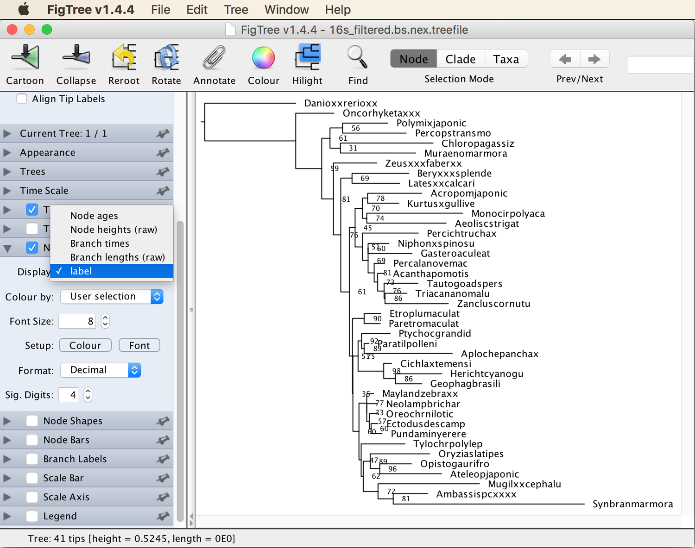

	**Question 5:** Can this phylogeny be considered reliable? [(see answer)](#q6)

## Partitioned maximum-likelihood inference

Given that node support in the phylogeny for 16S sequences turned out to be poor, we'll try now if the *RAG1* alignment leads to a better-supported phylogeny. Because the model selection carried out for the *RAG1* alignment in tutorial [Substitution Model Selection](../substitution_model_selection/README.md) showed support for the use of separate substitution models for each codon position, we will partition the alignment accordingly.

* Recall that for the automated model selection with PAUP\* in tutorial [Substitution Model Selection](../substitution_model_selection/README.md), we had used a Nexus file in which the codon positions were specified in a block near the end of the file. We are now going to use a similar block; however, because IQ-TREE expects this block not in the alignment file but in a separate file, we will first write this file. To do so, open a text editor, then type the following lines:

		#NEXUS
		BEGIN SETS;
			CHARSET codon1 = 1-1368\3;
			CHARSET codon2 = 2-1368\3;
			CHARSET codon3 = 3-1368\3;
		END;

	In this block, which is also written in the flexible Nexus format, "codon1", "codon2", and "codon3" are names for the individual partitions (you're free to choose these as you like), and "2-1368\3" for example specifies that each third site, counting from position 2 (thus sites 2, 5, 8,...) should be considered part of this partition. Save the file and name it `partitions.txt`.
	
* Run IQ-TREE for the *RAG1* alignment as before, and specify the name of the file with the partition information with the option `-spp` (with this option, relative branch lengths will be identical between partitions, but overall substitution rates may differ). The substitution model will again be chosen by IQ-TREE, this time independently for each partition. And as before, we are going to use 1,000 ultrafast bootstrap replicates, and we'll specify a prefix for the output files:

		iqtree -s rag1_filtered.nex -spp partitions.txt -bb 1000 -pre rag1_filtered.bs.nex

* Have a look through the screen output written by IQ-TREE.

	**Question 6:** Which models were now selected by IQ-TREE for the three partitions? [(see answer)](#q6)
		
* IQ-TREE should have written the resulting maximum-likelihood phylogeny with bootstrap support values to file `rag1_filtered.bs.nex.treefile`. Open the file [`rag1_filtered.bs.nex.treefile`](res/rag1_filtered.bs.nex.treefile) in FigTree. After once again rooting and sorting the phylogeny, the phylogeny should look as shown in the below screenshot.
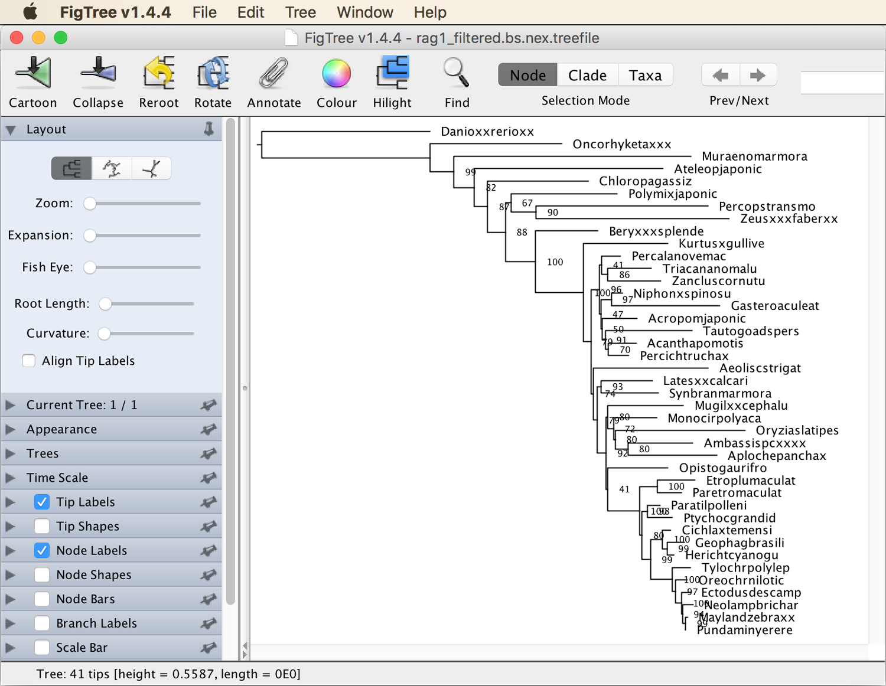

	**Question 7:** Does the *RAG1* phylogeny look more reliable than the 16S phylogeny? [(see answer)](#q7)

## Comparing the reliability of different phylogenies

We have now used bootstrapping to assess node support in two different phylogenies, the phylogeny for the 16S alignment and that of the *RAG1* alignment. We have visually inspected the two phylogenies, but we have not yet quantified the difference between them or the overall support that each of them has.

* As a measure of the distance between two trees, the [Robinson-Foulds distance](https://en.wikipedia.org/wiki/Robinson–Foulds_metric) ([Robinson and Foulds 1981](https://www.sciencedirect.com/science/article/pii/0025556481900432?via%3Dihub)) is commonly used. This measure is defined as the number of topological rearrangements that are required to convert one of the trees into the other. It can be calculated with IQ-TREE, specifying one of the trees with option `-t` and the other with `-rf`:

		iqtree -t 16s_filtered.bs.nex.treefile -rf rag1_filtered.bs.nex.treefile
		
	IQ-TREE should then write the output to a new file named `16s_filtered.bs.nex.treefile.rfdist`. Open this file in a text editor or with the `less` command.
		
	**Question 8:** How many topological rearrangements separate the 16S and *RAG1* trees? [(see answer)](#q8)

* To compare the overall support of the two trees, we can calculate the mean bootstrap support for both trees with the Python script [`get_mean_node_support.py`](src/get_mean_node_support.py):

		python3 get_mean_node_support.py 16s_filtered.bs.nex.treefile
		python3 get_mean_node_support.py rag1_filtered.bs.nex.treefile 

	You'll probably see that the *RAG1* phylogeny has a much higher mean node support (84.9) than the 16S phylogeny (68.6).

## Phylogenetic inference with concatenated alignments

The comparison of phylogenies based on the short 16S alignment and the longer *RAG1* alignment showed that the overall node support can substantially be improved with increased size of the dataset. It is thus usually beneficial to use the information from several alignments jointly in one and the same phylogenetic analysis. This can be done in various ways, the simplest of which is to modify the partition file so that partitions from different files are read and used in the same analysis. Note that IQ-TREE will assume in this analysis that all partitions, and thus the 16S and *RAG1* genes share the same true evolutionary history, and that bias may result if this assumption is violated (which is common, particularly if closely related species are investigated). This effect has been demonstrated in several studies (e.g. [Kubatko and Degnan 2007](https://academic.oup.com/sysbio/article/56/1/17/1658327); [Ogilvie et al. 2017](https://academic.oup.com/mbe/article/34/8/2101/3738283)). However, given that the dataset used here, with sequences from 41 teleost species, includes few taxa that are very closely related to each other, the assumption that the 16S and *RAG1* genes share the same evolutionary history (at least the same true topology) may be justified in this case.

* To use the 16S gene and all *RAG1* codon positions as different partitions in the same analysis, open the file `partitions.txt` that you wrote earlier, and replace the content with the following block:

		#NEXUS
		BEGIN SETS;
			CHARSET 16S = 16s_filtered.nex: *;
			CHARSET rag1_codon1 = rag1_filtered.nex: 1-1368\3;
			CHARSET rag1_codon2 = rag1_filtered.nex: 2-1368\3;
			CHARSET rag1_codon3 = rag1_filtered.nex: 3-1368\3;
		END;
		
	The asterisk on the line for 16S specifies that all sites of that alignment should be used in partition "16S".
	
* Run IQ-TREE with all partitions jointly, specifying the file `partitions.txt` again as before:
	
		iqtree -spp partitions.txt -bb 1000 -pre concatenated.bs.nex

	Note that this time, the option `-s` to specify an alignment file is no longer needed. This analysis should write the resulting phylogeny with bootstrap-support values to a new file called `concatenated.bs.nex.treefile`.
	
* Open file [`concatenated.bs.nex.treefile`](res/concatenated.bs.nex.treefile) in FigTree and find out if the support values now appear better than they did in the phylogeny based on the *RAG1* gene alone. The phylogeny should look more or less as shown in the next screenshot.

* Also quantify again the overall node support with the Python script [`get_mean_node_support.py`](src/get_mean_node_support.py):

		python3 get_mean_node_support.py concatenated.bs.nex.treefile

	**Question 9:** How good is the overall support for this phylogeny compared to that of the phylogeny based only on the *RAG1* gene? [(see answer)](#q9)


 

                   

## Answers

* **Question 1:** The "TIM2e+I+G4" model was chosen, according to the "Bayesian information criterion" (BIC) ([Schwarz 1978](https://projecteuclid.org/euclid.aos/1176344136)). The "+I" and "+G4" parts of the model name indicate that it includes a parameter for the proportion of completely invariable alignment sites and another parameter defining the shape of a Gamma distribution to approximate among-site rate variation. The TIM2e model assumes that the rates of A/C and A/T transversions (and their reverse) are equal, and also that the rates of C/G and G/T transversions (and their reverse) are equal. More information on all substitution models used by IQ-TREE can be found on [http://www.iqtree.org/doc/Substitution-Models](http://www.iqtree.org/doc/Substitution-Models).

* **Question 2:** The dataset includes No, cichlids are not monophyletic in this phylogeny even though many of them cluster together. But e.g. the placement of the killifish *Aplocheilus panchax* ("Aplochepanchax") as the sister species to the Malagasy cichlid *Ptychochromis grandidieri* ("Ptychocgrandid") shows that cichlids do not appear as monophyletic in this phylogeny (in contrast to results from much more extensive studies that clearly show that cichlids are in fact a monophyletic group; [Matschiner et al. 2017](https://academic.oup.com/sysbio/article/66/1/3/2418030); [Betancur-R. et al. 2017](https://bmcevolbiol.biomedcentral.com/articles/10.1186/s12862-017-0958-3)).

* **Question 3:** Yes, the three representatives of Neotropical cichlids form one monophyletic clade in this phylogeny.

* **Question 4:** The likelihood may or may not be identical. If it is different from the previously inferred likelihood, it is worth comparing the parameter estimates for the substitution model between the two analyses. In my analysis, all parameter estimates differed slightly, indicating that this relatively small dataset may not be informative enough to estimate all parameters reliably.

* **Question 5:** The bootstrap support values indicate that most nodes of the phylogeny are not particularly reliable. Only few nodes are supported with moderately strong values above 90 (meaning that more than 90% of the bootstrap replicates included this node), and some nodes are supported even with support values below 50. This overall low support for this phylogeny is not surprising given that it was built from a short alignment of a single marker. One of the most strongly supported nodes is the monophyly of Neotropical cichlid fishes, combining *Cichla temensis*, *Geophagus brasiliensis*, and *Herichthys cyanoguttatus*.

* **Question 6:** IQ-TREE should have selected "TPM2+F+I+G4" as the best-fitting model for the first codon position (partition "codon1"), "K3P+I+G4" for the second codon position (partition "codon2"), and "TPM2u+F+R3" for the third codon position (partition "codon3"). More information about these models can be found at [http://www.iqtree.org/doc/Substitution-Models](http://www.iqtree.org/doc/Substitution-Models). If the lines reporting the models are separated or followed by warnings about log-likelihoods, these may indicate that in some cases, the best likelihoods were not found. In such cases, rerunning the analysis may solve the issue, but that is not needed for this tutorial.

* **Question 7:** The *RAG1* phylogeny indeed seems to be more reliable than the 16S phylogeny, which may not be surprising given the longer length of the *RAG1* alignment. Some nodes are even supported with the maximum bootstrap support of 100, such as the monophyly of the six representatives of African cichlid fishes (*Tylochromis polylepis*, *Oreochromis niloticus*, *Ectodus descampsii*, *Neolamprologus brichardi*, *Maylandia zebra*, and *Pundamilia nyererei*).

* **Question 8:** In my analysis, 62 topological rearrangements were required to convert one of the two trees into the other. This number might be slightly different if, due to stochastic variation, different trees were identified as maximum-likelihood trees.

* **Question 9:** The overall node support should be slightly higher in the joint analysis of 16S and *RAG1*, compared to that based on the *RAG1* alignment only (85.3 compared to 84.9). This could be due to stochastic effects or it could indicate that the increased size of the dataset in fact improves the phylogenetic resolution. Note that most phylogenies published these days are based on far larger datasets than the ones used here, assuming that the additional information in fact improves the analysis (this sounds obvious, but has actually been discussed controversially in recent years - the issue will be dealt with in more detail in other tutorials; e.g. in [Maximum-Likelihood Species-Tree Inference](../ml_species_tree_inference/README.md)).