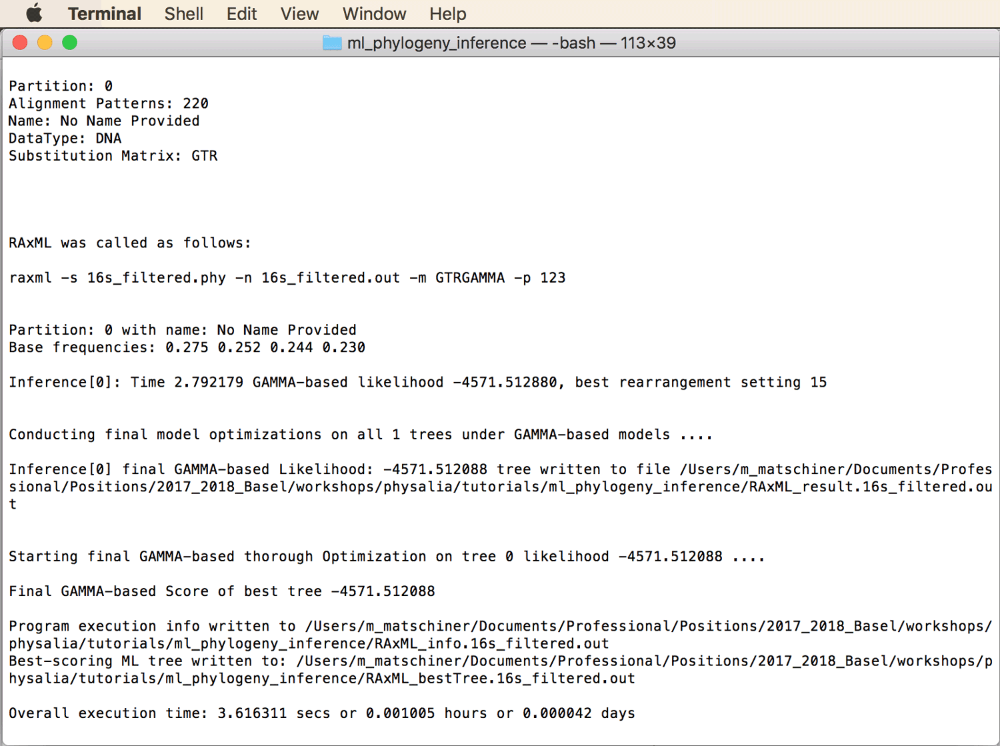
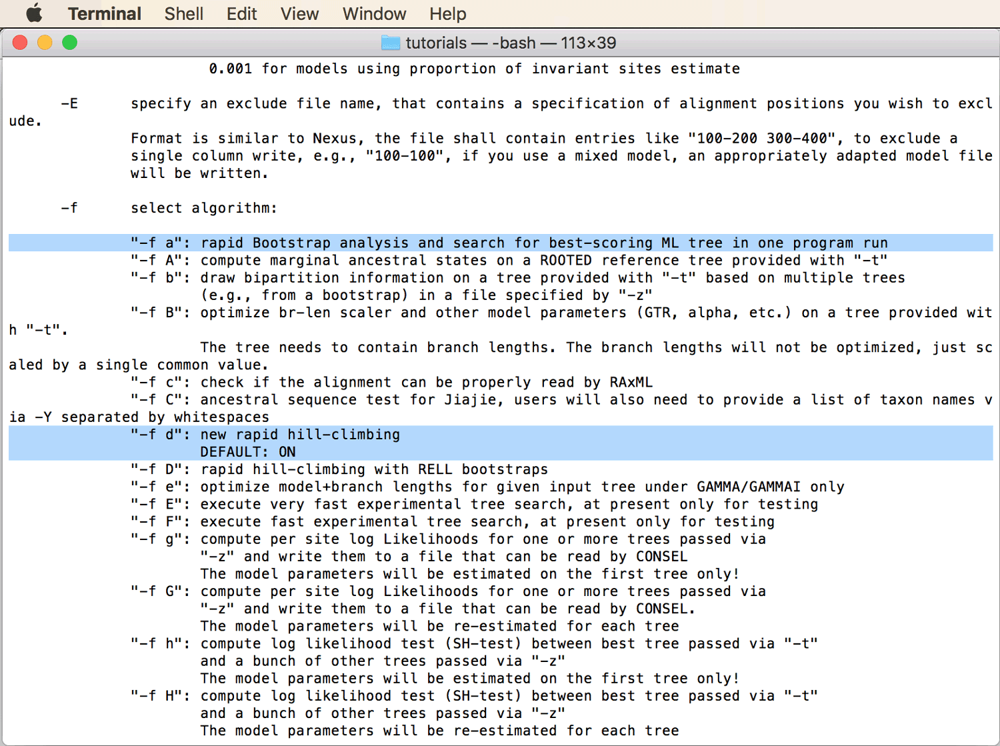
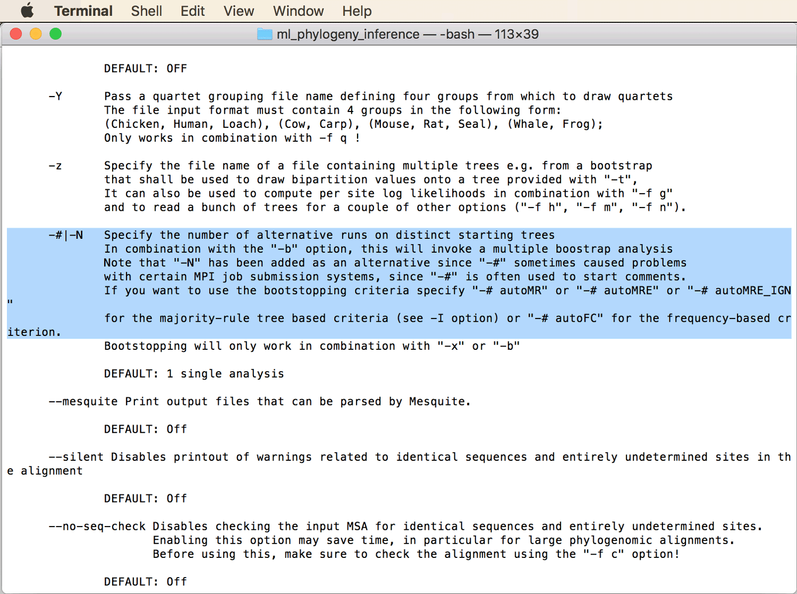
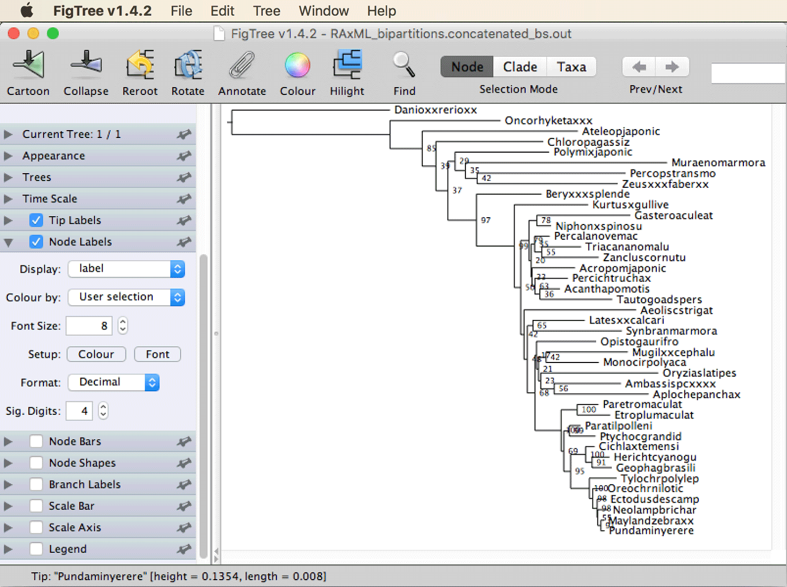

# Maximum-Likelihood Phylogenetic Inference

A tutorial on phylogenetic inference with maximum likelihood

## Summary

As the name indicates, maximum-likelihood phylogenetic inference aims to find the parameters of an evolutionary model that maximize the likelihood of observing the dataset at hand. The model parameters include the tree topology and its branch lengths but also all parameter of the substitution model (such as HKY or GTR) assumed in the inference. As the search space for these parameters is enormous when the dataset contains more than just a handful of taxa, all modern programs for maximum-likelihood phylogenetic inference apply heuristics to reach the maximum-likelihood parameter combination.

## Table of contents

* [Outline](#outline)
* [Dataset](#dataset)
* [Requirements](#requirements)
* [Maximum-likelihood phylogenetic inference with RAxML](#raxml)
* [Reading and visualizing tree files](#figtree)
* [Assessing node support with bootstrapping](#bootstrap)
* [Partitioned maximum-likelihood inference](#partition)
* [Comparing the reliability of different phylogenies](#comparison)
* [Maximum-likelihood inference of concatenated alignments](#concatenation)

## Outline

In this tutorial, I will present maximum-likelihood inference with one of the fastest programs developed for this type of analysis, the program [RAxML](https://sco.h-its.org/exelixis/web/software/raxml/index.html) ([Stamatakis 2014](https://academic.oup.com/bioinformatics/article/30/9/1312/238053)). I will demonstrate how the reliability of nodes in the phylogeny can be assessed with bootstrapping ([Felsenstein 1985](https://www.jstor.org/stable/2408678)), how unlinked substitution models can be applied to separate partitions, and how alignments of multiple genes can be concatenated to be jointly used in the same phylogenetic analysis.

## Dataset

The data used in this tutorial are the filtered versions of the alignments generated for 16s and rag1 sequences in tutorial [Multiple Sequence Alignment](../multiple_sequence_alignment/README.md). These alignments contain sequence data for 41 teleost fish species and are 486 and 1,368 bp long, respectively. More information on the origin of the dataset can be found in the [Multiple Sequence Alignment](../multiple_sequence_alignment/README.md) tutorial. RAxML requires input files in Phylip format, thus we will use the files [`16s_filtered.phy`](data/16s_filtered.phy) and [`rag1_filtered.phy`](data/rag1_filtered.phy) for RAxML analyses, but one of the scripts used in this tutorial requires Nexus format, thus we will then also use files [`16s_filtered.nex`](data/16s_filtered.nex) and [`rag1_filtered.nex`](data/rag1_filtered.nex).

## Requirements

* **RAxML:** Source code for Mac OS X and Linux, as well as precompiled executables for Windows, can be found on RAxML's github page [https://github.com/stamatak/standard-RAxML](https://github.com/stamatak/standard-RAxML). To install RAxML on any of these systems, download the [latest release](https://github.com/stamatak/standard-RAxML/releases), either in its zip or tar.gz-compressed version. Decompress this file on your machine. 
For installation on Linux, instructions are provided in the `README` file that you will find in the decompressed RAxML package. To compile the parallelized PTHREADS version of RAxML, try running

		make -f Makefile.AVX.PTHREADS.gcc

	If this should not work because your computer does not support [AVX](https://en.wikipedia.org/wiki/Advanced_Vector_Extensions), you could try
	
		make -f Makefile.SSE3.PTHREADS.gcc

	If this also fails because your computer also doesn't support [SSE](https://en.wikipedia.org/wiki/Streaming_SIMD_Extensions), then you should nevertheless be able to compile the slower standard version with
	
		make -f Makefile.PTHREADS.gcc

	On Mac OS X, you'll have to use the versions of the `Makefile` that end in `.mac`. This is not described in RAxML's `README` file. So to compile the sequential version, you'll have to run
	
		make -f Makefile.AVX.PTHREADS.mac
		
	or
	
		make -f Makefile.SSE3.PTHREADS.mac
		
	(no Mac version without AVX or SSE3 seems to be included in the latest releases).
		
	On Windows, just use the newest of the precompiled executables that you will find in a directory named `WindowsExecutables_v8.2.10` or similar, within the decompressed RAxML package. 

	The commands given in this tutorial will assume that you compiled the parallelized PTHREADS version of RAxML (rather than the sequential or the MPI version), that you named the file simply `raxml`, and that you placed it somewhere on your computer where your system can find it (i.e. in a directory that is included in your [PATH](https://en.wikipedia.org/wiki/PATH_(variable))). One way to guarantee this on Mac OS X or Linux is to place the executable in `/usr/local/bin`, for example using (if you compiled the AVX version)
	
		mv raxmlHPC-PTHREADS-AVX /usr/local/bin/raxml
		
	To verify that the RAxML executable can be found by your system, type
	
		which raxml
		
	If this command outputs a path such as `/usr/local/bin/raxml`, the executable can be found. As another check if RAxML is working as it should, type
	
		raxml -v
		
	and you should see the version number as well as a list of contributing developers. If you do, you're ready to start the tutorial.
	
* **FigTree:** The program [FigTree](http://tree.bio.ed.ac.uk/software/figtree/) by Andrew Rambaut is a very intuitive and useful tool for the visualization and (to a limited extent) manipulation of phylogenies encoded in [Newick](http://evolution.genetics.washington.edu/phylip/newicktree.html) format. Executables for Mac OS X, Linux, and Windows are provided on [http://tree.bio.ed.ac.uk/software/figtree/](http://tree.bio.ed.ac.uk/software/figtree/).

* **Python library ete3:** The [ete toolkit](http://etetoolkit.org) ([Huerta-Cepas et al. 2016](https://academic.oup.com/mbe/article/33/6/1635/2579822)) will be required to compare phylogenetic trees with the [Robinson-Foulds distance](https://en.wikipedia.org/wiki/Robinson–Foulds_metric) ([Robinson and Foulds 1981](https://www.sciencedirect.com/science/article/pii/0025556481900432?via%3Dihub)). Instructions for the installation of the ete toolkit on Mac OS X and Linux are provided on the [ete download webpage](http://etetoolkit.org/download/); however, the easiest way to install the ete3 toolkit might be with the pip package manager for Python, using the following command:

		python -m pip install --user ete3
		
	To ensure that the installation worked, you could execute the following command:
	
		python -c 'import ete3'
		
	If no error message is given, the ete3 library is correctly installed and ready to be used.

	

## Maximum-likelihood phylogenetic inference with RAxML

We will first generate a simple maximum-likelihood phylogeny only for the filtered 16s sequence alignment.

* To get an impression of the many options available in RAxML, have a look at the impressively long help text of the program:

		raxml -h
		
* Scroll back up to the beginning of the RAxML help text. Close to the top, you'll see that raxml could be started as easily as

		raxmlHPC -s sequenceFileName -n outputFileName -m substitutionModel

	where "sequenceFileName" and "outputFileName" would have to be replaced with the actual sequence and output file names, and a substitution model would have to be chosen to replace "substitutionModel". Note that in our case, we would also start the program with "raxml", not "raxmlHPC", only because we named it that way.

* So, let's try to run a maximum-likelihood search, first for the 16S sequence data, using the alignment file in Phylip format [`16s_filtered.phy`](data/16s_filtered.phy). We'll start with as little command-line options as possible, and learn along the way which other options we need. I suggest doing so only for the reason that I find this easier than remembering all necessary options before the run. We'll use the GTRGAMMA model (the GTR model with gamma-distributed rate variation, as suggested for the 16S alignment by the model selection done in tutorial [`substitution_model_selection`](../substitution_model_selection/README.md)), and we choose `16s_filtered.out` as part of all result file names:

		raxml -s 16s_filtered.phy -n 16s_filtered.out -m GTRGAMMA

* As you'll see, this minimalistic choice of options does not seem to be sufficient, and RAxML asks us to specify a random number seed with the option "-p". Before doing so, make sure to remove the log file (`RAxML_info.16s_filtered.out`) that RAxML just wrote to the current directory:

		rm RAxML_info.16s_filtered.out

	Then, try running RAxML again, this time with a random number seed:

		raxml -s 16s_filtered.phy -n 16s_filtered.out -m GTRGAMMA -p 123
		
* RAxML should finish the analysis within a few seconds and present output as shown in the screenshot below. **Question 1:** Are the inferred stationary frequencies of the four nucleotides (here called the "base frequencies") comparable to those inferred with PAUP\* in tutorial [`substitution_model_selection`](../substitution_model_selection/README.md))? [(see answer)](#q1) As you can see from RAxML's output, the best-scoring maximum-likelihood tree was written to file `RAxML_bestTree.16s_filtered.out`.

## Reading and visualizing tree files

In this part of the tutorial, we will explore how phylogenetic trees are encoded in Newick format, the format used by almost all phylogenetic sofware, and we will visualize the maximum-likelihood phylogeny generated with RAxML with the program [FigTree](http://tree.bio.ed.ac.uk/software/figtree/). Fun fact: The Newick format is named after the [Newick's restaurant](http://www.newicks.com) in Dover, New Hampshire, where Joe Felsenstein and other developers of the format ["enjoyed the meal of lobsters"](http://evolution.genetics.washington.edu/phylip/newicktree.html) in 1986. A good explanation of the format and information on its origin can be also be found [here](http://evolution.genetics.washington.edu/phylip/newicktree.html).

* Open the file [`RAxML_bestTree.16s_filtered.out`](res/RAxML_bestTree.16s_filtered.out) in a text editor, or on the command line using for example the `less` command:

		less RAxML_bestTree.16s_filtered.out

	You'll see a long string containing the taxon IDs, each of which is followed by a codon and a number, and together with these, the taxon IDs are embedded in parentheses. As an example, a short (and simplified) segment of the string is this:
	
		(Mugilxxcephalu:0.16,(Synbranmarmora:0.29,Ambassispcxxxx:0.05):0.01)

* Open the program FigTree, copy the above short part of the tree string, and paste it into the new FigTree window. You'll see a phylogeny of the three taxa *Mugil cephalus* ("Mugilxxcephalu"), *Synbranchus marmoratus* ("Synbranmarmora"), and *Ambassis* sp. ("Ambassispcxxxx"), as shown in the screenshot below.

* For better visualization, increase the font size for tip labels in the panel at the left (click on the triangle to the left of "Tip Labels" to open it), and untick the checkbox next to "Scale Bar", as shown in the next screenshot.

* Also tick the checkbox next to "Branch Labels" to display the branch lengths as in the next screenshot. Note that the label of the branch leading to *Mugil cephalus* ("Mugilxxcephalu") is not displayed due to a minor bug; it is hidden by the menu bar at the top. However, you'll recognize that the other branch lengths correspond to the numbers specified in the tree string after the colons:
 
		(Mugilxxcephalu:0.16,(Synbranmarmora:0.29,Ambassispcxxxx:0.05):0.01
		
	

By comparing the tree string and the visualization, you'll see that the parentheses encode the relationships among taxa. For example, the pair of parentheses around `Synbranmarmora:0.29,Ambassispcxxxx:0.05` specifies that the taxon names listed inside of it form one monophyletic clade. Thus, *Synbranchus marmoratus* ("Synbranmarmora") and *Ambassis* sp. ("Ambassispcxxxx") are defined as sister taxa that are closer to each other than either of them is to *Mugil cephalus* ("Mugilxxcephalu").
	
* Next, open the complete phylogeny generated by RAxML (file [`RAxML_bestTree.16s_filtered.out`](res/RAxML_bestTree.16s_filtered.out)) in FigTree. It should look as shown in the below screenshot.

The way the phylogeny is rooted in the above screenshot is arbitrary, because we so far did not specify how the rooting should be done either in the RAxML analysis or in the visualization with FigTree. So this phylogeny provides no evidence that *Acantharchus pomotis* ("Acanthpomotis") is the sister to all the other teleost fishes (only that is is first among these in the alphabet).

* To correct the rooting of the phylogeny, we can specify an outgroup. From the taxonomy of the species included in this dataset, we know that zebrafish (*Danio rerio*; "Danioxxrerioxx") is a member of the clade named "Otomorpha" whereas all other species belong to the clade named "Euteleosteomorpha" ([Betancur-R. et al. 2017](https://bmcevolbiol.biomedcentral.com/articles/10.1186/s12862-017-0958-3)). Thus, the correct root of the phylogeny must lie between zebrafish and the other taxa. To specify zebrafish as an outgroup, click on the branch leading to "Danioxxrerioxx", as shown in the next screenshot.

* Then, with that branch being selected, click on the "Reroot" icon with the yellow arrow in the menu bar. The phylogeny should then look as shown in the next screenshot.

* As a final change, we could sort the taxa according to node order. To do so, click "Decreasing node order" in FigTree's "Tree" menu. This should move "Danioxxrerioxx" to the top of the plot:

It is almost surprising how well this phylogeny resolves the correct relationships among the 41 taxa (which are known rather well from more extensive studies based on large molecular datasets as well as morphology). **Question 2:** Do cichlids appear monophyletic in this phylogeny (to answer this, you may need to look up the [table in the Multiple Sequence Alignment](../multiple_sequence_alignment/README.md) tutorial)? [(see answer)](#q2) **Question 3:** And are Neotropical cichlids (*Cichla temensis*, *Geophagus brasiliensis*, *Herichthys cyanoguttatus*) monophyletic? [(see answer)](#q3)

## Assessing node support with bootstrapping

As we've seen, the RAxML phylogeny of 16S sequences does not perfectly agree with relationships inferred in other studies (e.g. [Matschiner et al. 2017](https://academic.oup.com/sysbio/article/66/1/3/2418030); [Betancur-R. et al. 2017](https://bmcevolbiol.biomedcentral.com/articles/10.1186/s12862-017-0958-3)) or with the taxonomy of teleost fishes. However, so far we have no indication of the reliability of the individual nodes in the phylogeny, therefore we can not assess how strong the evidence of this phylogeny weighs against other findings. To identify which nodes in the phylogeny are more or less trustworthy, we will now perform a bootstrap analysis, again with RAxML.

* Have a look once more at the long help text of RAxML to see the available options for bootstrapping:

		raxml -h

* Scroll towards the top of the help text, there you should find the details for the "-f" option with which the RAxML algorithm is selected:

From the help text you'll see that if "-f" is not used as a command-line argument, the default algorithm is used, which is "-f d", the "new rapid hill-climbing" algorithm. To run a bootstrap analysis, another algorithm is required. A particularly convenient option for this is "-f a" which triggers a "rapid Bootstrap analysis and search for the best-scoring ML tree in one program run". It would also be possible to run only bootstrapping; however, then the original alignment would not be used at all for inference, only bootstrapped alignments would be used.

* Thus, try to run RAxML with option "-f a" to use the original alignment for the inference of the maximum-likelihood tree, and bootstrapped alignments to assess node support on this tree. To avoid conflict with previously generated files, use e.g. `16s_filtered_bs.out` as part of all output file names:

		raxml -s 16s_filtered.phy -n 16s_filtered_bs.out -m GTRGAMMA -p 123 -f a

* As you'll see, RAxML now also requires specification of a random number seed for the bootstrapping with option "-x". Try again:

		raxml -s 16s_filtered.phy -n 16s_filtered_bs.out -m GTRGAMMA -p 123 -f a -x 456
		
* However, RAxML still needs more information for the bootstrapping: The number of bootstrap replicates should be specified with the option "-#" or "-N" (those two are synonymous, and we'll use "-N" here). As the RAxML help text explains, one can either specify a fixed number of replicates, such as "-N 100", or one could let RAxML decide itself how many bootstrap replicates should be run, by using one of the automatic "bootstopping criteria" autoMR, autoMRE, autoMRE\_IGN, or autoFC.

According to the RAxML authors ([Pattengale et al. 2010](https://www.liebertpub.com/doi/abs/10.1089/cmb.2009.0179)), autoMRE performs best and is fast enough for up to a few thousand taxa, so I suggest using this option:

		raxml -s 16s_filtered.phy -n 16s_filtered_bs.out -m GTRGAMMA -p 123 -f a -x 456 -N autoMRE

* RAxML should now be running. Have a look at the RAxML output on the screen. **Question 4:** What is the proportion of gaps and undetermined characters in the alignment? [(see answer)](#q4) **Question 5:** How long does RAxML take per bootstrap replicate? [(see answer)](#q5) The analysis might take 10-20 minutes, depending on the speed of your computer. RAxML will then write the phylogenetic tree to file `RAxML_bipartitions.16s_filtered_bs.out`. If you don't want to wait for the analysis to finish, you will find this file here: [`RAxML_bipartitions.16s_filtered_bs.out`](res/RAxML_bipartitions.16s_filtered_bs.out).

* Open file `RAxML_bipartitions.16s_filtered_bs.out` again in FigTree. After once again increasing the font size for tip labels, removing the scale bar, rooting with zebrafish (*Danio rerio*; "Danioxxrerioxx"), and sorting of taxa according to node order, the phylogeny should look as shown in the below screenshot (note that this is identical to the phylogeny generated before without bootstraps, except that some nodes are rotated differently).

* To see node-support values based on bootstrapping, set a tick in the checkbox for "Node Labels", and select "label" from the "Display" drop-down menu, as shown in the below screenshot. **Question 6:** Can this phylogeny be considered reliable? [(see answer)](#q6)

## Partitioned maximum-likelihood inference

Given that node support in the phylogeny for 16s sequences turned out to be poor, we'll try now if the rag1 alignment supports a better-supported phylogeny. Because the model selection carried out for the rag1 alignment in tutorial [Substitution Model Selection](../substitution_model_selection/README.md) showed support for the use of separate substitution models for each codon position, we will partition the alignment accordingly.

* Recall that for the automated model selection with PAUP\* in tutorial [Substitution Model Selection](../substitution_model_selection/README.md), we had used a Nexus file in which the codon positions were specified in a block near the end of the file. As RAxML uses Phylip files as input which do not allow the specification of such data, RAxML requires a separate file in which information about partitions is provided. The structure of this file, however, is very simple and similar to the block in the Nexus file. To write such a file and implement a partitioning scheme according to codon position, open a text editor, then type the following lines:

		DNA, codon1 = 1-1368\3
		DNA, codon2 = 2-1368\3
		DNA, codon3 = 3-1368\3

	As is probably self-explanatory, "DNA" tells RAxML that these partitions refer to DNA data (rather than amino acid sequences or morphological characters), "codon1", "codon2", and "codon3" are names for the individual partitions (you're free to choose these as you like), and "2-1368\3" for example specifies that each third site, counting from position 2 (thus sites 2, 5, 8,...) should be considered part of this partition. Save the file and name it `partitions.txt`.
	
* Run RAxML for the rag1 alignment as before, and specify the name of the file with the partition information with the option "-q". We will once again specify "-m GTRGAMMA" to use the GTR model with gamma-distributed rate variation for each partition, as selected by PAUP\*'s automated model selection in tutorial [Substitution Model Selection](../substitution_model_selection/README.md). Feel free to pick other random number seeds than the ones used here, "-p 123" and "-x 456":

		raxml -s rag1_filtered.phy -n rag1_filtered_bs.out -m GTRGAMMA -p 123 -f a -x 456 -N autoMRE -q partitions.txt

* Have a look at the reported proportion of gaps and completely undetermined characters and note that RAxML recognized that we specified three partitions. **Question 7:** How long does RAxML need now for each bootstrap? [(see answer)](#q7) This analysis might take up to an hour, so feel free to cancel it if you don't want to wait that long. You'll find the tree file resulting from this analysis here: [`RAxML_bipartitions.rag1_filtered_bs.out`](res/RAxML_bipartitions.rag1_filtered_bs.out).

* Open the file `RAxML_bipartitions.rag1_filtered_bs.out` in FigTree. After once again rooting and sorting the phylogeny, the phylogeny should look as shown in the below screenshot. **Question 8:** Does the rag1 phylogeny look more reliable than the 16S phylogeny? [(see answer)](#q8) 

## Comparing the reliability of different phylogenies

We have now used bootstrapping to assess node support in two different phylogenies, the phylogeny for the 16s alignment and that of the rag1 alignment. We have visually inspected the two phylogenies, but we have not yet quantified the difference between them or the overall support that each of them has.

* As a measure of the distance between two trees, the [Robinson-Foulds distance](https://en.wikipedia.org/wiki/Robinson–Foulds_metric) ([Robinson and Foulds 1981](https://www.sciencedirect.com/science/article/pii/0025556481900432?via%3Dihub)) is commonly used. This measure is defined as the number of topological rearrangements that are required to convert one of the trees into the other. It can be calculated with the Python script [`get_rf_distance.py`](src/get_rf_distance.py) using this command:

		python get_rf_distance.py RAxML_bipartitions.16s_filtered_bs.out RAxML_bipartitions.rag1_filtered_bs.out
		
	**Question 9:** How many topological rearrangements separate the 16s and rag1 trees? [(see answer)](#q9)

* To compare the overall support of the two trees, we can use the Python script [`get_mean_node_support.py`](src/get_mean_node_support.py) to calculate the mean bootstrap support for both trees:

		python3 get_mean_node_support.py RAxML_bipartitions.16s_filtered_bs.out
		python3 get_mean_node_support.py RAxML_bipartitions.rag1_filtered_bs.out

	You'll see that the rag1 phylogeny has a much higher mean node support (64.9) than the 16s phylogeny (18.8).

## Phylogenetic inference with concatenated alignments

The comparison of phylogenies based on the short 16s alignment and the longer rag1 alignment showed that the overall node support can substantially be improved with increased size of the dataset. It is thus usually beneficial to use the information from several alignments jointly in one and the same phylogenetic analysis. This can be done in various ways, the simplest of which (and the only one possible in RAxML) is concatenation of the alignments, meaning that sequences of the different genes are, for each taxon, pasted together as if they come from just one single gene. While concatenation generally increases the support values of phylogenies, it should be noted that this practice implicitly assumes that all genes share the same evolutionary history, and that bias may result if this assumption is violated (which is common, particularly if closely related species are investigated). This effect has been demonstrated in several studies (e.g. [Kubatko and Degnan 2007](https://academic.oup.com/sysbio/article/56/1/17/1658327); [Ogilvie et al. 2017](https://academic.oup.com/mbe/article/34/8/2101/3738283)). However, given that the dataset used here, with sequences from 41 teleost species, includes few taxa that are very closely related to each other, the assumption that the 16s and rag1 gene share the same evolutionary history (at least the same true topology) may be justified in this case.

* To concatenate the two alignments, you can use the Ruby script [`concatenate.rb`](src/concatenate.rb). First, have a look at the help text of this script:

		ruby concatenate.rb -h
		
	You'll see that multiple input files can be specified with the option "-i", and that one output file should be specified with option "-o". In addition, you can select one out of three output file formats. Because we plan to use the concatenated alignment with RAxML, choose to write the output in Phylip format:

		ruby concatenate.rb -i 16s_filtered.nex rag1_filtered.nex -o concatenated.phy -f phylip

* Open the file `concatenated.phy` in AliView and note the length of the concatenated alignment. You should be able to see the position where the two original alignments have been stitched together at position 1368/1369, as shown in the next screenshot.

* To analyse the concatenated alignment again with RAxML, we'll have to adjust the partitions file by adding the 16s part of the alignment as a fourth partition. To do this, open the file `partitions.txt` again in a text editor and add a fourth line at the bottom, so that the file then contains the following lines:

		DNA, codon1 = 1-1368\3
		DNA, codon2 = 2-1368\3
		DNA, codon3 = 3-1368\3
		DNA, 16s = 1369-1854

	Note that we don't add the "\3" to the end of the last line because all positions, not only every third position, between sites 1369 and 1845 are part of the 16s partition.

* Run RAxML for the concatenated alignment as before, using the GTR model with gamma-distributed rate variation for each of the four partitions. Again, feel free to pick other random number seeds than the ones used here, "-p 123" and "-x 567":

		raxml -s concatenated.phy -n concatenated_bs.out -m GTRGAMMA -p 123 -f a -x 456 -N autoMRE -q partitions.txt

	This analysis might again take around an hour or longer, so you may not want to wait until it is complete. If so, you can find the resulting phylogeny in file [`RAxML_bipartitions.concatenated_bs.out`](res/RAxML_bipartitions. concatenated_bs.out).
	
* Open file `RAxML_bipartitions.concatenated_bs.out` again in FigTree and find out if the support values now appear better than they did in the phylogeny based only on the rag1 gene.

* Also quantify again the overall node support using the Python script [`get_mean_node_support.py`](src/get_mean_node_support.py):

		python3 get_mean_node_support.py RAxML_bipartitions.concatenated_bs.out

	**Question 10:** How good is the overall support for this phylogeny compared to that of the phylogeny based only on the rag1 gene? [(see answer)](#q10)


 

                   

## Answers

* **Question 1:** In the model selection done with PAUP\*, the estimates for the stationary frequencies under the GTR model with gamma-distrbuted rate variation were 0.314 (A), 0.232 (C), 0.211 (G), and 0.242 (T). In contrast, these frequencies were estimated by RAxML as 0.275 (A), 0.252 (C), 0.244 (G), and 0.230 (T). Thus, these estimates differ actually quite a lot. The reason for these differences could be the relatively small alignment size leading to stochastic variation, or the fact that the phylogeny was assumed in the model selection analysis with PAUP\*, but was co-estimated with the model parameters by RAxML.

* **Question 2:** No, cichlids are not monophyletic in this phylogeny even though many of them cluster together. But e.g. the placement of the killifish *Aplocheilus panchax* ("Aplochepanchax") as the sister species to the Malagasy cichlid *Ptychochromis grandidieri* ("Ptychocgrandid") shows that cichlids do not appear as monophyletic in this phylogeny (in contrast to results from much more extensive studies that clearly show that cichlids are in fact a monophyletic group; [Matschiner et al. 2017](https://academic.oup.com/sysbio/article/66/1/3/2418030); [Betancur-R. et al. 2017](https://bmcevolbiol.biomedcentral.com/articles/10.1186/s12862-017-0958-3)).

* **Question 3:** Yes, the three representatives of Neotropical cichlids form one monophyletic clade in this phylogeny.

* **Question 4:** RAxML reports that 1.61% of the characters in the 16s alignment are undetermined.

* **Question 5:** On my MacBook Pro, about 0.2 seconds are required per bootstrap replicate. This may differ on other machines, and it may depend on whether you compiled the AVX, SSE3, or standard version of RAxML.

* **Question 6:** The bootstrap support values indicate that most nodes of the phylogeny are not reliable at all. Only few nodes are supported with even moderate support values, such as a support value of 71 for the monophyly of the three Neotropical cichlid fishes. Some node values are even as low as 0, meaning that none of the phylogenies built from bootstrapped alignments recovered this clade found in the phylogeny based on the original alignment. However, the low support for this phylogeny is not surprising given that it was built from a short alignment of a single marker.

* **Question 7:** Each bootstrap replicate now takes about 0.7 seconds on my MacBook Pro.

* **Question 8:** The rag1 phylogeny indeed seems to be more reliable than the 16s phylogeny, which would not be surprising given the longer length of the rag1 alignment. Some nodes are even supported with the maximum bootstrap support of 100, such as the monophyly of the six representatives of African cichlid fishes (*Tylochromis polylepis*, *Oreochromis niloticus*, *Ectodus descampsii*, *Neolamprologus brichardi*, *Maylandia zebra*, and *Pundamilia nyererei*).

* **Question 9:** 66 topological rearrangements are required to convert one of the two trees into the other.

* **Question 10:** Against our expectation, the overall node support is slightly lower for the phylogeny based on the concatenated alignment compared to that based on the rag1 alignment only (62.9 compared to 64.9). This could be due to stochastic effects or it could indicate conflict between the two alignments, which could arise if the evolutionary histories of the two genes would in fact differ even though few species in these phylogenies are very closely related to each other.