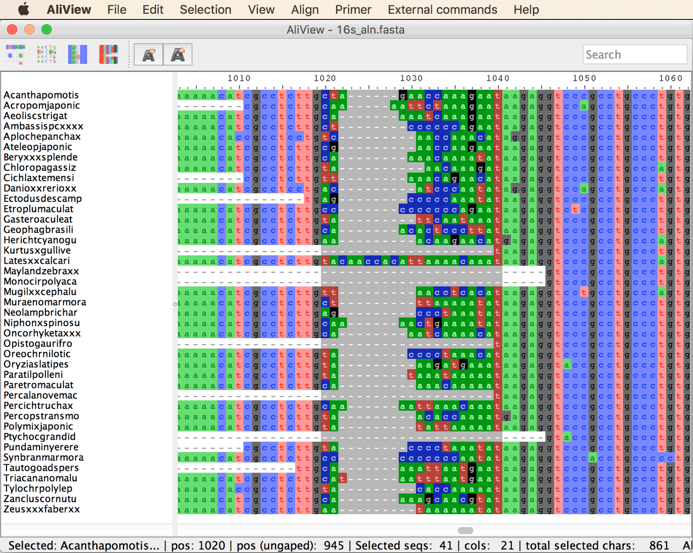
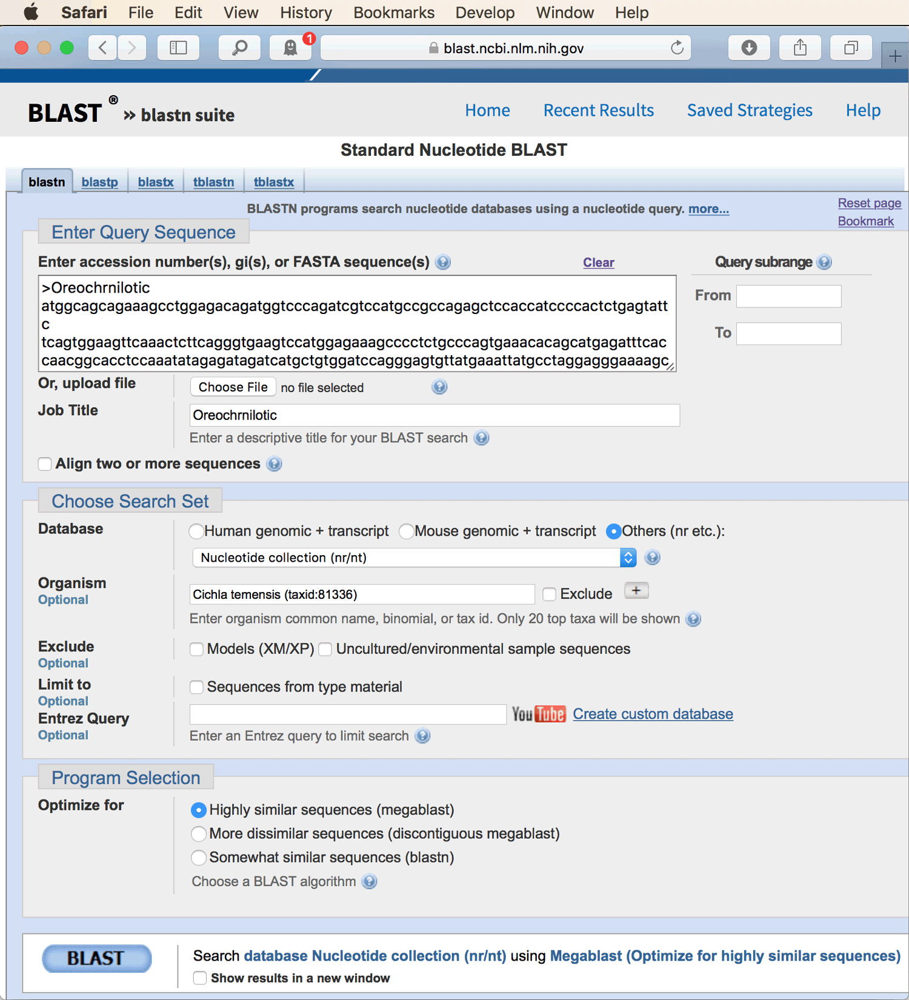
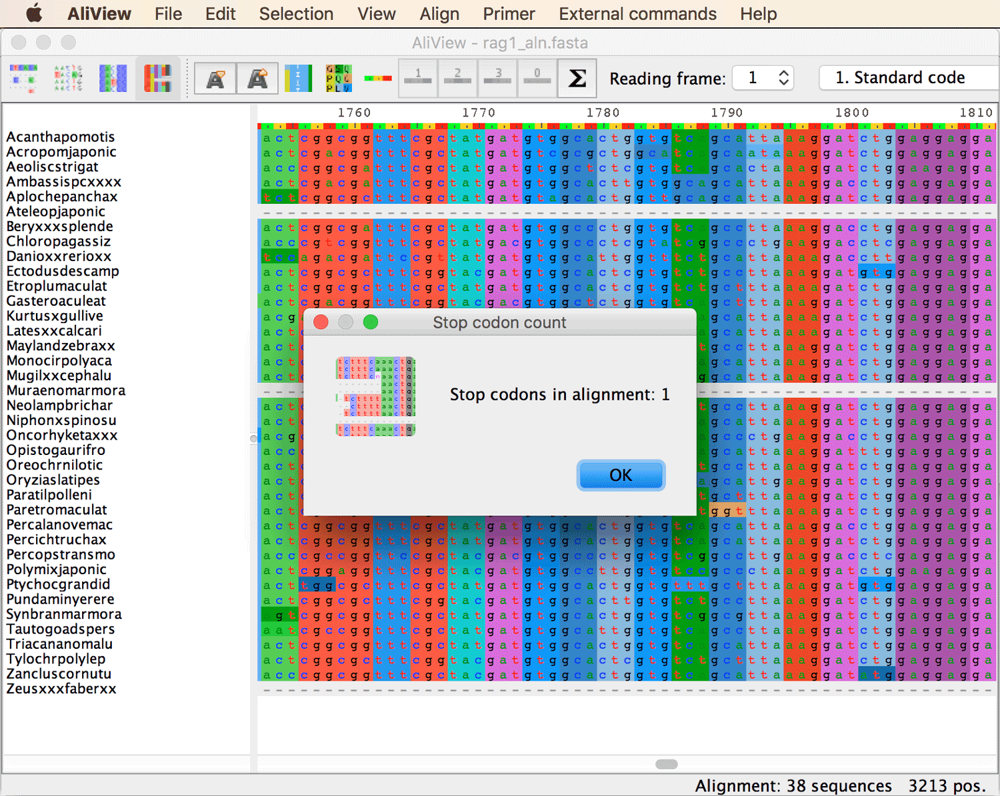

# Multiple Sequence Alignment

A tutorial on multiple sequence alignment

## Summary

All phylogeny-inference methods require sets of homologous characters as input. When nucleotide sequences are used for phylogenetic analyses, a first step is therefore usually to infer which nucleotides in the sequences of different taxa are homologous to each other, so that differences among these nucleotides result only from changes that occurred in the evolution of the sequences. The inference of homology among nucleotides of different sequences is most often done by methods that fall into the class of "multiple sequence alignment".

## Table of contents

* [Outline](#outline)
* [Dataset](#dataset)
* [Requirements](#requirements)
* [Alignment and visualization with MAFFT and AliView](#mafft_aliview)
* [Automated alignment filtering with BMGE](#bmge)
* [Identification of additional homologous sequences](#genbank)
* [Codon-based manual alignment curation](#codonbased) 

## Outline

In this tutorial, I will present the use of one of the fastest and most popular tools for multiple sequence alignment, the program [MAFFT](https://mafft.cbrc.jp/alignment/software/) ([Katoh and Standley 2013](https://academic.oup.com/mbe/article/30/4/772/1073398)). I will further demonstrate how to detect and exclude alignment regions within which nucleotide homology may be questionable, how to identify additional homologous sequences using a public sequence database, [NCBI's GenBank](https://www.ncbi.nlm.nih.gov/genbank/), and how to use these sequences to complement existing datasets.

## Dataset

The dataset used in this tutorial is a small subset of the data used in [Matschiner et al. (2017)](https://academic.oup.com/sysbio/article/66/1/3/2418030) to estimate divergence times of African and Neotropical cichlid fishes in relation to the break-up of the Gondwanan continents India, Madagascar, Africa, and South America. Based on the full dataset as well as 149 fossils used for time calibration, we concluded in that study that cichlids, even though they are with few exceptions strictly freshwater fishes, must have traversed the Atlantic Ocean at a time when it was already hundreds of kilometers wide to reach South America, and that they most likely also crossed the Indian Ocean as well as the Mozambique Channel between Africa and Madagascar.

The dataset used here includes sequences for two genes; the mitochondrial 16S gene coding for [16S ribosomal RNA](https://en.wikipedia.org/wiki/16S_ribosomal_RNA) and the nuclear rag1 gene coding for [recombination activating protein 1](https://en.wikipedia.org/wiki/RAG1). The sequences represent the 41 species listed in the table below.

| ID             | Species                     | Group                |
|----------------|-----------------------------|----------------------|                     
| Acanthapomotis | *Acantharchus pomotis*      | Non-cichlid          |
| Acropomjaponic | *Acropoma japonicum*        | Non-cichlid          |
| Aeoliscstrigat | *Aeoliscus strigatus*       | Non-cichlid          |
| Ambassispcxxxx | *Ambassis* sp.              | Non-cichlid          |
| Aplochepanchax | *Aplocheilus panchax*       | Non-cichlid          |
| Ateleopjaponic | *Ateleopus japonicus*       | Non-cichlid          |
| Beryxxxsplende | *Beryx splendens*           | Non-cichlid          |
| Cichlaxtemensi | *Cichla temensis*           | Neotropical cichlids |
| Chloropagassiz | *Chlorophthalmus agassizi*  | Non-cichlid          |
| Danioxxrerioxx | *Danio rerio*               | Non-cichlid          |
| Ectodusdescamp | *Ectodus descampsii*        | African cichlids     |
| Etroplumaculat | *Etroplus maculatus*        | Indian cichlids      |
| Gasteroaculeat | *Gasterosteus aculeatus*    | Non-cichlid          |
| Geophagbrasili | *Geophagus brasiliensis*    | Neotropical cichlids |
| Herichtcyanogu | *Herichthys cyanoguttatus*  | Neotropical cichlids |
| Kurtusxgullive | *Kurtus gulliveri*          | Non-cichlid          |
| Latesxxcalcari | *Lates calcarifer*          | Non-cichlid          |
| Maylandzebraxx | *Maylandia zebra*           | African cichlids     |
| Monocirpolyaca | *Monocirrhus polyacanthus*  | Non-cichlid          |
| Mugilxxcephalu | *Mugil cephalus*            | Non-cichlid          |
| Muraenomarmora | *Muraenolepis marmorata*    | Non-cichlid          |
| Neolampbrichar | *Neolamprologus brichardi*  | African cichlids     |
| Niphonxspinosu | *Niphon spinosus*           | Non-cichlid          |
| Oncorhyketaxxx | *Oncorhynchus keta*         | Non-cichlid          |
| Opistogaurifro | *Opistognathus aurifrons*   | Non-cichlid          |
| Oreochrnilotic | *Oreochromis niloticus*     | African cichlids     |
| Oryziaslatipes | *Oryzias latipes*           | Non-cichlid          |
| Paratilpolleni | *Paratilapia polleni*       | Malagasy cichlids    |
| Paretromaculat | *Paretroplus maculatus*     | Malagasy cichlids    |
| Percalanovemac | *Percalates novemaculeata*  | Non-cichlid          |
| Percichtruchax | *Percichthys trucha*        | Non-cichlid          |
| Percopstransmo | *Percopsis transmontana*    | Non-cichlid          |
| Polymixjaponic | *Polymixia japonica*        | Non-cichlid          |
| Ptychocgrandid | *Ptychochromis grandidieri* | Malagasy cichlids    |
| Pundaminyerere | *Pundamilia nyererei*       | African cichlids     |
| Synbranmarmora | *Synbranchus marmoratus*    | Non-cichlid          |
| Tautogoadspers | *Tautogolabrus adspersus*   | Non-cichlid          |
| Triacananomalu | *Triacanthodes anomalus*    | Non-cichlid          |
| Tylochrpolylep | *Tylochromis polylepis*     | African cichlids     |
| Zancluscornutu | *Zanclus cornutus*          | Non-cichlid          |
| Zeusxxxfaberxx | *Zeus faber*                | Non-cichlid          |

## Requirements

* **MAFFT:** Installation instructions and precompiled versions of [MAFFT](https://mafft.cbrc.jp/alignment/software/) are available on [https://mafft.cbrc.jp/alignment/software/](https://mafft.cbrc.jp/alignment/software/). While the installation of the program should be easy on all operating systems, all steps of this tutorial can also be conducted using the [server version of MAFFT](https://mafft.cbrc.jp/alignment/server/), installation of this software is optional.

* **AliView:** To visualize sequence alignments, the software [AliView](http://www.ormbunkar.se/aliview/) ([Larsson 2014](https://academic.oup.com/bioinformatics/article/30/22/3276/2391211)) is recommended. The installation of AliView is described at [http://www.ormbunkar.se/aliview/](http://www.ormbunkar.se/aliview/) and should be possible on all operating systems.

* **BMGE:** The program [BMGE](https://research.pasteur.fr/en/software/bmge-block-mapping-and-gathering-with-entropy/) (Block Mapping and Gathering with Entropy) ([Criscuolo and Gribaldo 2010](https://bmcevolbiol.biomedcentral.com/articles/10.1186/1471-2148-10-210)) is highy useful to identify and remove poorly aligned regions of sequence alignments. The latest version of BMGE is provided as a Java jar file at [ftp://ftp.pasteur.fr/pub/gensoft/projects/BMGE/](ftp://ftp.pasteur.fr/pub/gensoft/projects/BMGE/) (choose login as guest to access the ftp server). Place this file in a convenient location on your own computer.

## Alignment and visualization with MAFFT and AliView

We'll start by aligning sequences of the mitochondrial 16S gene with the program MAFFT and we will visualize and improve the alignment using the software AliView.

* Download the file [`16s.fasta`](data/16s.fasta) containing 16S sequences to your computer. Have a look at the file in a text editor, or on the command line using for example the `less` command:

		less 16s.fasta

	You'll see that each record consists of an ID and a sequence, of which the ID is always on a single line that starts with a ‘>' symbol, followed by lines containing the sequence. The sequences are not aligned yet; this is the reason why they contain no gaps and differ in length. Instead of the 14-character IDs used in this file, other naming schemes could be applied; however, I strongly recommend the use of short and simple IDs because in phylogenetic analyses, many programs or scripts may not work if you use actual latin or common species names that contain spaces or hyphens.

* Open the website [https://mafft.cbrc.jp/alignment/server/](https://mafft.cbrc.jp/alignment/server/). This site provides a web interface to the MAFFT alignment program ([Katoh et al. 2017](https://academic.oup.com/bib/advance-article/doi/10.1093/bib/bbx108/4106928)). Instead of using the website, you may also use MAFFT your computer locally if you succeeded in installing it.

* Under the heading "Advanced settings" on the MAFFT server website (scroll down to see it) you'll find the available alignment options. In the first gray box with the title "Strategy" you can choose between global and local alignment methods. The "G-INS-i" method implements the global Needleman-Wunsch algorithm ([Needleman and Wunsch 1970](https://www.sciencedirect.com/science/article/pii/0022283670900574)), the "L-INS-i" method implements the local "Smith-Waterman" algorithm ([Smith and Waterman 1981](https://www.sciencedirect.com/science/article/pii/0022283681900875)). For simplicity, keep the default "Auto" option. If you use the command-line version of MAFFT on your own computer instead of the MAFFT server, the equivalent command would be

		mafft --auto 16s.fasta > 16s_aln.fasta

* In the third gray box in the "Advanced settings" section, which has the title "Parameters", you could change the scoring matrix. For amino-acid sequences you could choose any of the [BLOSUM](https://en.wikipedia.org/wiki/BLOSUM) matrices which are equivalent to [PAM matrices](https://en.wikipedia.org/wiki/Point_accepted_mutation). For nucleotide sequences, one can choose among "1PAM / K=2", "20PAM / K=2", and "200PAM / K=2". It's unclear to me why they list PAM matrices here also for nucleotide sequences and this is also not explained in their paper or the manual, but at least the MAFFT [manual](https://mafft.cbrc.jp/alignment/software/algorithms/algorithms.html) makes it clear that the K (kappa) parameter represents the ratio of scores for transitions and transversions. For now, keep all default options. Click the "Submit" button.

* After a few seconds, the alignment should be ready, and a new page will open that shows the alignment in HTML format. **Question 1:** Can you find out which of the MAFFT alignment algorithms (FFT-NS-1, FFT-NS-2, G-INS-1, FFT-NS-i, E-INS-i, L-INS-i, G-INS-i, or Q-INS-i) has been used? [(see answer)](#q1)

* Download the alignment in Fasta format to your computer. To do so, right-click the link to "Fasta format" at the very top of the page. Name the file `16s_aln.fasta`.

* Repeat the same, this time with a gap-opening penalty of 2 instead of the default value of 1.53. Name the alignment file resulting from this analysis `16s_op2_aln.fasta`. If you use the command-line version of MAFFT, the equivalent command would be 

		mafft --auto --op 2 16s.fasta > 16s_op2_aln.fasta

* Open file `16s_aln.fasta` in AliView.

* To get an overview of the alignment, zoom in and out using the `+` and `-` keys on your keyboard (you may also have to hold the shift key).

* Without closing the AliView window, open the file `16s_op2_aln.fasta` in a second AliView window. Compare the total alignment lengths shown in the status bar at the bottom right. **Question 2:** Which alignment is longer? [(see answer)](#q2)

* In both AliView windows, scroll to the region between positions 1250 and 1350. **Question 3:** What main difference between the alignments do you notice? [(see answer)](#q3)

* Close the window for file `16s_op2_aln.fasta`.

* In the window for `16s_aln.fasta`, identify a poorly aligned region (e.g. around positions 1020 to 1040) and try to realign it. To do so, select the region by clicking in the ruler at the top of the alignment as shown in the below screenshot.

* With the poorly aligned region selected, click on "Realign selected block" in AliView's "Align" menu. **Question 4:** Does the alignment in this region look better now? [(see answer)](#q4)

## Automated alignment filtering with BMGE

As you can see, the alignment of 16S sequences contains a mix of highly variable as well as conserved regions. Thus, the homology of nucleotides is rather obvious in some parts of the gene but can be ambiguous in other parts. To avoid issues resulting from alignment errors in the downstream phylogenetic analyses, we will identify poorly aligned regions based on the proportion of gaps and the genetic variation found within these regions, and we will exclude them from the alignment.

* To exclude unreliably aligned regions from the 16S alignment, use the software BMGE. To check if the program works on your computer, and to see the available options, open a command-line window (e.g. the Terminal application on Mac OSX) and type:

		java -jar PATH_TO_FILE/BMGE.jar -?

	(replace `PATH_TO_FILE` with the actual path to the file on your computer).

* If the above worked, type:

	    java -jar PATH_TO_FILE/BMGE.jar -i 16s_aln.fasta -t DNA -of 16s_filtered.fasta -oh 16s_filtered.html
	
    With the above command, BMGE writes a filtered alignment in Fasta format in file `16s_filtered.fasta`, and visualizes the filtered alignment in HTML format in file `16s_filtered.html`.

* Open file `16s_filtered.html` in your browser. Scroll through the alignment and note the black alignment blocks.

* At the very top of the alignment, you'll see two measures plotted for each site in light grey and black. The gap proportion is shown with light gray equal signs and ranges from 0 to 1. Black colons indicate what the authors of BMGE call a "smoothed entropy-like score". Basically, this is a measure of the nucleotide diversity at this site (please see the [BMGE publication](https://bmcevolbiol.biomedcentral.com/articles/10.1186/1471-2148-10-210) for more information). You'll note that the black alignment blocks coincide with regions of low gap proportion and low entropy, which are be the most suitable alignment positions for phylogenetic inference. Our selection of alignment blocks is based on default settings of BMGE for the entropy score cut-off (option -h), the gap-rate cut-off (-g), and the minimum block size (-b). By default, BMGE selects sites with an entropy score below 0.5 (-h 0.5) and a gap proportion below 0.2 (-g 0.2), and only if these form a block of at least 5 sites with these properties (-b 5).

* Repeat the BMGE block selection with custom settings for entropy-score cut-off, gap-rate cut-off, and minimum block size, and note how this changes the overall number of selected sites and the distribution of selected blocks in the alignment. For example, increase the allowed proportion of gaps using -g 0.3:

		java -jar PATH_TO_FILE/BMGE.jar -i 16s_aln.fasta -t DNA -g 0.3 -of 16s_g03_filtered.fasta -oh 16s_g03_filtered.html
		
* The standard output of BMGE to the Terminal tells you how many sites (characters) remain selected. Note the difference between the last two runs.

* In addition to file `16s_filtered.html`, also open file `16s_g03_filtered.html` in a separate browser window. Scroll through the alignment. You'll note that many more regions are now marked in black due to the increase in the allowed proportion of gaps per site.

* Open the file `16s_filtered.fasta` in AliView. Note that it is now shorter and appears much more compressed than the previous alignment. Save the file in Phylip format as `16s_filtered.phy`, using the "Save as Phylip (full names & padded)" option in AliView's "File" menu. Also save the file in Nexus format as `16s_filtered.nex` with the "Save as Nexus" option.

* Open the Phylip and Nexus files in a text editor to see the differences between the file formats.

## Identification of additional homologous sequences

As mentioned above, the sequence data used in this tutorial are part of the dataset of [Matschiner et al. (2017)](https://academic.oup.com/sysbio/article/66/1/3/2418030). While some of the sequence data used in that study were generated by us, most sequences were taken from publicly available databases such as [GenBank](https://www.ncbi.nlm.nih.gov/genbank/) and [BOLD](http://www.boldsystems.org/index.php) (Barcode of Life Data System, which in some cases holds sequences of the mitochondrial COI gene that are not available on Genbank). The second set of sequences used in this tutorial, which you will find in file [rag1.fasta](data/rag1.fasta) consists of sequences for the nuclear rag1 gene; however, compared to the set of 16S sequences, the three species listed below are not yet represented.

| ID             | Species                     | Group                |
|----------------|-----------------------------|----------------------|                     
| Cichlaxtemensi | *Cichla temensis*           | Neotropical cichlids |
| Geophagbrasili | *Geophagus brasiliensis*    | Neotropical cichlids |
| Herichtcyanogu | *Herichthys cyanoguttatus*  | Neotropical cichlids |

* To fill in these missing sequence data you can retrieve homologous rag1 sequences for Neotropical cichlids from [GenBank](https://www.ncbi.nlm.nih.gov/genbank/), using the sequence of an African cichlid species as a query in a BLAST search for the most closely matching sequence in the database. I suggest to use the 16S sequence of *Oreochromis niloticus* (ID "Oreochrnilotic") from file [`rag1.fasta`](data/rag1.fasta) as the query. On the [BLAST webpage](https://blast.ncbi.nlm.nih.gov/Blast.cgi?PROGRAM=blastn&PAGE_TYPE=BlastSearch&BLAST_SPEC=&LINK_LOC=blasttab&LAST_PAGE=blastn), you can use the "Organism" field to limit the search only to sequences of a particular species. Retrieve the longest sequences for each of the three Neotropical cichlid species listed above.

* Add the three retrieved sequences to file `rag1.fasta`, and rename the sequences, giving them the IDs "Cichlaxtemensi", "Geophagbrasili", and "Herichtcyanogu".

* If anything should go wrong in this part of the tutorial, you can find a complete version of the 16S data that already includes the sequences of the three Neotropical cichlid species in file [`rag1_combined.fasta`](res/rag1_combined.fasta).

## Codon-based manual alignment curation

For protein-coding sequences, it can often be useful to identify the reading frame (i.e. which positions of the alignment correspond to first, second, and third codon positions) and the translation of the nucleotide code into amino-acid sequences. As insertions or deletions ("indels") with lengths that are not multiples of three would disrupt the reading frame and thus cause large changes to the protein structure, these are usually strongly selected against and rarely found in alignments of protein-coding sequences. Similarly, indels observed in protein-coding sequences often begin with a first codon position and end with a third codon position. Thus, in cases where the placement of indels is ambiguous, information about the reading frame can be used to optimize the positioning of these indels.

* Go back to the MAFFT website [https://mafft.cbrc.jp/alignment/server/](https://mafft.cbrc.jp/alignment/server/).

* Upload the file [`rag1.fasta`](data/rag1.fasta), including the three sequences that you added in the previous part of this tutorial, to the MAFFT server. Keep all default options and click the "Submit" button. If you use the command-line version of MAFFT on your own computer, execute the command

		mafft --auto rag1.fasta > rag1_aln.fasta

* When the alignment is ready, find out which of MAFFT's algorithms was used this time.

* Download the alignment in Fasta format to your computer. Name the file `rag1_aln.fasta`.

* Open file `rag1_aln.fasta` in AliView.

* Click the fourth icon from the left in the tool bar to translate nucleotide sequence to amino acids (or the Command-T key combination on a Mac).

* Click the sigma-sign icon in the center of the tool bar to count stop codons, as in the screenshot shown below.

* Change the reading frame using the box to the right of the sigma-sign icon and also count stop codons for the second and the third reading frame. Note how the overall color pattern of the alignment changes when you select different reading frames. **Question 5:** Does one reading frame appear more conserved than the other two? [(see answer)](#q5) Use this reading frame from now on.

* Notice how the reading frame is interrupted between positions 1980 and 2000 by two insertions in the sequence of *Muraenolepis marmorata*. This means that both insertions would have had to evolve at the same time, otherwise the change of the reading frame would have affected the entire rest of the protein in *Muraenolepis marmorata*, for the time between the first and the second insertion event. A more likely explanation may be that only a single insertion occurred and that the other is an artifact resulting from misalignment.

* Select the region from position 1981 to 1998, again by clicking in the ruler above the alignment. Click on "Realign selected block" in AliView's "Align" menu. This should result in an alternative alignment of the region, with only a single insertion from position 1989 to position 1991.

* The precise location of the insertion may still be a bit ambiguous. Therefore, cut out the six base pairs from position 1987 to position 1992. To do so, select these six base pairs by clicking in the ruler above the alignment, and choose "Delete selected" from AliView's "Edit" menu.

* Also remove the regions with many gaps at the end and the beginning of the alignment. Obviously, these gaps result not from insertions or deletions, but from missing data. At the end of the alignment, trim all positions after (and including) position 2998. At the beginning of the alignment, trim all positions before (and including) position 1629. The alignment should then start with a codon that is "GGT" or "GGC" for most species, and it should end with a codon that is "AAA" or "AAG" for most species. It should also include not a single stop codon anymore. Verify if this is the case by again clicking on the sigma-sign icon at the center of the tool bar.

* Save the alignment in Fasta, Phylip, and Nexus format. Use the names `rag1_filtered.fasta`, `rag1_filtered.phy`, and `rag1_filtered.nex`.

 

                   

## Answers

* **Question 1:** As specified directly above the first gray box and also near the end of the page, the accurate but comparatively slow "L-INS-i" algorithm for local alignment with the Smith-Waterman algorithm was used.

* **Question 2:** The alignment in file `16s_aln.fasta` should be 1,839 bp long while that in file `16s_op2_aln.fasta` should be slightly shorter with 1,832 bp. This is to be expected when the penalty for gap openings is increased.

* **Question 3:** More indels were inferred in file `16s_aln.fasta` compared to file `16s_op2_aln.fasta`. In both versions, this part of the alignment appears to be unreliable.

* **Question 4:** Even after realigning, I would consider the region between positions 1,020 and 1,040 unreliably aligned, but I tend to say that it looks better afterwards.

* **Question 5:** Yes, while only a single stop codon is found with the first reading frame, 892 and 1,214 stop codons should be detected with the second and third reading frames, respectively.
