# Ortholog Detection

A tutorial on the detection of orthologs in assembled genomes

## Summary

When sequence alignments are used to infer phylogenetic relationships among species, this is always based the assumption of orthology among the aligned sequences. This means that sequences are assumed to have diverged as the result of species divergences, and not due to other processes such as gene duplications. In cases where this assumption is violated, phylogeny inference may be biased. With Sanger sequencing based on PCR, the validity of the assumption of orthology was rarely investigated, first because the used PCR-primer pairs may in fact most often bind specifically enough to amplify orthologs rather than paralogs, and second because little comparative sequence data were available that would allow a discrimination of orthologs from paralogs. In the age of whole-genome sequencing, however, care can and should be taken to ensure that all sequences within each alignment are orthologous to each other.

## Table of contents

* [Outline](#outline)
* [Dataset](#dataset)
* [Requirements](#requirements)
* [Identifying putative orthologs](#blast)
* [Alignment filtering](#filtering)

## Outline

In this tutorial I am going to present a pipeline for the identification of one-to-one ortholog sequences from a set of genome or transcriptome assemblies. The starting point for this pipeline is a set of 2,231 query exon sequences annotated with criteria required for similar sequences to be considered as candidate orthologs. These query sequences will be employed to search for candidate orthologs in several genome and transcriptome assemblies using the program [BLAST](https://blast.ncbi.nlm.nih.gov/Blast.cgi) ([Altschul et al. 1990](https://www.sciencedirect.com/science/article/pii/S0022283605803602?via%3Dihub)) and alignments will automatically be generated for each set of potential orthologs. These alignments will subsequently be analyzed in more detail to identify and exclude those that might still include paralogous or misaligned sequences. Alignments will also be filtered according to their proportion of missing data, their signals of selection, and their variation in GC content, to retain only the most suitable ones for phylogenetic inference. A more extensive version of this pipeline is used and described in [Malmstrøm et al. (2016)](https://www.nature.com/articles/ng.3645).

## Dataset

The dataset used in this tutorial consists of two parts: The 2,231 query exon sequences as well as twelve genome and transcriptome assemblies from which orthologs to the query sequences are to be identified.

The set of query exon sequences was extracted from the zebrafish (*Danio rerio*) genome assembly of the ENSEMBL database, as described in the Supplementary Information (sections "Markers for phylogenetic reconstruction" and "Ortholog detection and filtering") of [Malmstrøm et al. (2016)](https://www.nature.com/articles/ng.3645). In brief, these query sequences were selected so that no duplications or deletions were present among ten representative teleost fish species with annotated genomes in the ENSEMBL database. These species included, besides zebrafish, cave fish (*Astyanax mexicanus*), cod (*Gadus morhua*), fugu (*Takifugu rubripes*), tetraodon (*Tetraodon nigroviridis*), stickleback(*Gasterosteus aculeatus*), platyfish (*Xiphophorus maculatus*), Amazon molly (*Poecilia formosa*), medaka (*Oryzias latipes*), and tilapia (*Oreochromis niloticus*). The absence of duplications or deletions among these ten species increases the chance that the same exons also remained unaffected by duplications and deletions in other related species, such as those used in this tutorial. Furthermore, the exon query sequences have been selected according to how well their known orthologs in the ten teleost species can be discriminated from paralogs based on genetic distances. If, for one or more of the ten teleost species in the ENSEMBL database, a known ortholog had a similarity score that was not at least 1.5 times as high as the highest score of any other region in these 10 genomes, the query was discarded. The so measured similarity scores among ortholog sequences are also used to annotate each query, so that it can be used as a threshold for the detection of orthologs in other assemblies.

The genome and transcriptome assemblies from which orthologs to the query sequences will be identified represent several lineages of cichlid fishes: Neotropical cichlids are represented by the genome assemblies of *Amphilophus citrinellus*, a member of the tribe Heroini from Nicaragua, and *Andinoacara coeruleopunctatus*, a species of the tribe Cichlasomatini distributed in Panama and Costa Rica. For both species, genome assemblies are publicly available even though they have not yet been described in a publication. Nine further assemblies represent African cichlids. The most complete genome assembly of these is that of tilapia (*Oreochromis nilotiucs*), a riverine cichlid species used globally in aquaculture. The second version of its genome assembly was presented by [Conte et al. (2017)](https://bmcgenomics.biomedcentral.com/articles/10.1186/s12864-017-3723-5). Four more genome assemblies for lacustrine cichlids of the East African Great Lakes were presented by [Brawand et al. (2014)](https://www.nature.com/articles/nature13726); these cichlids include *Neolamprologus brichardi*, a member of tribe Lamprologini from Lake Tanganyika, *Astatotilapia burtoni*, a member of tribe Haplochromini endemic to Lake Tanganyika and its tributaries, *Metriaclima zebra*, another member of Haplochromini that occurs in Lake Malawi, and *Pundamilia nyererei*, a third species of Haplochromini endemic to Lake Victoria. Genome assemblies of other species from the diverse Lamprologini tribe were generated by [Gante et al. (2016)](https://onlinelibrary.wiley.com/doi/abs/10.1111/mec.13767); these include *Neolamprologus marunguensis*, *Neolamprologus gracilis*, and *Neolamprologus olivaceous*. The set of cichlid assemblies will be complemented by a transcriptome assembly of *Ophthalmotilapia ventralis*, generated by [Baldo et al. (2011)](https://academic.oup.com/gbe/article/doi/10.1093/gbe/evr047/583924); this species is part of tribe Ectodini that is also endemic to Lake Tanganyika. The focus of this dataset is thus on cichlid species from Lake Tanganyika, a group that is known for rapid diversification and hybridization, two processes that make phylogenetic inference particularly challenging. The table below lists the eleven cichlid species used in this tutorial.

| ID     | Species                         | Tribe          | Distribution    |
|--------|---------------------------------|----------------|-----------------|
| ampcit | *Amphilophus citrinellus*       | Heroini        | Neotropics      |
| andcoe | *Andinoacara coeruleopunctatus* | Cichlasomatini | Neotropics      |
| orenil | *Oreochromis nilotiucs*         | Oreochromini   | African rivers  |
| ophven | *Ophthalmotilapia ventralis*    | Ectodini       | Lake Tanganyika |
| astbur | *Astatotilapia burtoni*         | Haplochromini  | Lake Tanganyika |
| metzeb | *Metriaclima zebra*             | Haplochromini  | Lake Malawi     |
| punnye | *Pundamilia nyererei*           | Haplochromini  | Lake Victoria   |
| neobri | *Neolamprologus brichardi*      | Lamprologini   | Lake Tanganyika |
| neomar | *Neolamprologus marunguensis*   | Lamprologini   | Lake Tanganyika |
| neogra | *Neolamprologus gracilis*       | Lamprologini   | Lake Tanganyika |
| neooli | *Neolamprologus olivaceous*     | Lamprologini   | Lake Tanganyika |

In addition to these eleven cichlid assemblies, an assembly of zebrafish (*Danio rerio*; "danrer") will be included, only to serve as a reference together with the set of query sequences that are also derived from this zebrafish genome assembly.

## Requirements

* **BLAST+:** The suite of command-line tools related to BLAST (Basic Local Alignment Search Tool; [Altschul et al. 1990](https://www.sciencedirect.com/science/article/pii/S0022283605803602?via%3Dihub)) will be essential for this tutorial. Installers for different platforms are available from [ftp://ftp.ncbi.nlm.nih.gov/blast/executables/blast+/LATEST/](ftp://ftp.ncbi.nlm.nih.gov/blast/executables/blast+/LATEST/) (connect as anonymous guest to access these files). For installation on Mac OS X, choose the file named `ncbi-blast-2.7.1+.dmg`, for Linux, choose file `ncbi-blast-2.7.1+-1.x86_64.rpm`, and on Windows, use `ncbi-blast-2.7.1+-win64.exe`. More detailed installation instructions can be found in the [online application manual](https://www.ncbi.nlm.nih.gov/books/NBK279671/#introduction.RedHat_Linux).

* **PAML:** [PAML (Phylogenetic Analysis by Maximum Likelihood)](http://abacus.gene.ucl.ac.uk/software/paml.html) is a package of tools for phylogenetic inference developed by Ziheng Yang and colleagues ([Yang 2007](https://academic.oup.com/mbe/article/24/8/1586/1103731)). Of this package we are going to use a single tool, the program codeml which allows rapid calculation of the [dN/dS ratio](https://en.wikipedia.org/wiki/Ka/Ks_ratio) from pairwise sequence comparisons. Downloads and installation instructions for Mac OS X, Linux, and Windows are provided on the [PAML webpage](http://abacus.gene.ucl.ac.uk/software/paml.html#download). Make sure to skip the section titled "PAML-X: A GUI for PAML" and follow the instructions in section "UNIX/Linux and Mac OSX" if you use Mac OS X or Linux, or the instructions in section "PAML for Windows 9x/NT/2000/XP/Vista/7" if you use Windows.

* **MAFFT:** Unlike in tutorial [Multiple Sequence Alignment](../multiple_sequence_alignment/README.md) where the online version of MAFFT could be used, the command-line version of MAFFT is going to be required for this tutorial. Installation instructions and precompiled versions of [MAFFT](https://mafft.cbrc.jp/alignment/software/) are available on [https://mafft.cbrc.jp/alignment/software/](https://mafft.cbrc.jp/alignment/software/). 

* **BMGE:** The program [BMGE](https://research.pasteur.fr/en/software/bmge-block-mapping-and-gathering-with-entropy/) (Block Mapping and Gathering with Entropy) ([Criscuolo and Gribaldo 2010](https://bmcevolbiol.biomedcentral.com/articles/10.1186/1471-2148-10-210)) is highy useful to identify and remove poorly aligned regions of sequence alignments. The latest version of BMGE is provided as a Java jar file at [ftp://ftp.pasteur.fr/pub/gensoft/projects/BMGE/](ftp://ftp.pasteur.fr/pub/gensoft/projects/BMGE/) (choose login as guest to access the ftp server). Place this file in a convenient location on your own computer.

## Identifying putative orthologs

In this part of the tutorial we are going to use BLAST searches to identify sets of putatively orthologous sequences.

* Have a look at the github repository associated with the study of [Malmstrøm et al. (2016)](https://www.nature.com/articles/ng.3645), which you can find at [https://github.com/uio-cees/teleost\_genomes\_immune](https://github.com/uio-cees/teleost_genomes_immune). To locate the file `exons.fasta` containing the query exon sequences, click on "S11\_S14\_ortholog\_detection\_and\_filtering", then on "data" and on "queries/nuclear". Then click on the file name to see its contents as shown below.
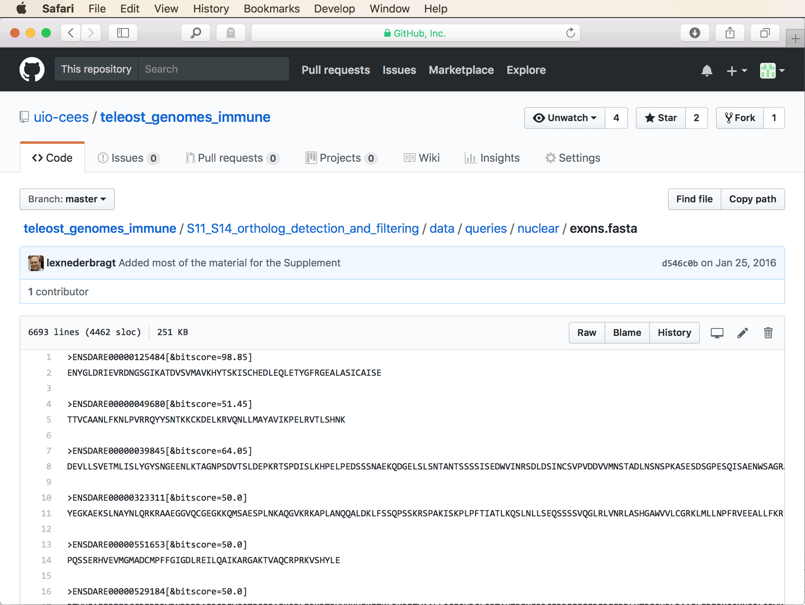
You'll note that all sequences are given as amino-acid code rather than nucleotides. The reason why amino-acid sequences are used is that these have proven to be more sensitive than nucleotide sequences in detecting more divergent orthologs. In the study of [Malmstrøm et al. (2016)](https://www.nature.com/articles/ng.3645), this increased sensitivity was important as their dataset comprised genome assemblies from very divergent lineages. Because the cichlid species used here are more closely related to each other, it would also be possible to use a set of query sequences from a more closely related model species such as medaka (*Oryzias latipes*); these sequences could then also be used as queries in nucleotide format. A set of query sequences could be extracted from the genome assembly of a species within cichlids such as tilapia (*Oreochromis nilotiucs*) that has a well-annotated genome. However, in that case the queries would be more closely related to some of the species in the dataset than to others, meaning that a similarity threshold for the identification of putative orthologs could not as easily be defined. In any case, since the set of query exon sequences from [Malmstrøm et al. (2016)](https://www.nature.com/articles/ng.3645) has already been tried and tested, and it has been found to perform well also with assemblies of cichlid genomes, we'll rely on it in this tutorial. Also note the annotation in each Fasta header line that specifies a "bitscore" value. Bitscores are a type of alignments scores calculated by all BLAST tools (a more detailed explanation is given on the [BLAST website](https://www.ncbi.nlm.nih.gov/BLAST/tutorial/Altschul-1.html#head3)), and the values specified on the Fasta header lines will be used as thresholds in the assessment of whether similar sequences are potential orthologs or not.

* Download file `exons.fasta`, either by clicking on the button for the "Raw" format on the right-hand side of the bar above the first sequence, or by using the following command:

		wget https://raw.githubusercontent.com/uio-cees/teleost_genomes_immune/master/S11_S14_ortholog_detection_and_filtering/data/queries/nuclear/exons.fasta

* Download the genome assemblies for ten of the eleven cichlid species listed in the table above. To do so, use the following commands:

		# Download the genome assembly of Amphilophus citrinellus.
		wget wget ftp://ftp.ncbi.nlm.nih.gov/genomes/all/GCA/000/751/415/GCA_000751415.1_Midas_v5/GCA_000751415.1_Midas_v5_genomic.fna.gz
		gunzip GCA_000751415.1_Midas_v5_genomic.fna.gz
		mv GCA_000751415.1_Midas_v5_genomic.fna ampcit.fasta
		
		# Download the genome assembly of Andinoacara coeruleopunctatus.
		wget http://cichlid.gurdon.cam.ac.uk/Andinoacara_coeruleopunctatus_final_min1000bp_scaffolds.fa.gz
		gunzip Andinoacara_coeruleopunctatus_final_min1000bp_scaffolds.fa.gz
		mv Andinoacara_coeruleopunctatus_final_min1000bp_scaffolds.fa andcoe.fasta
		
		# Download the genome assembly of Oreochromis niloticus.
		wget ftp://ftp.ncbi.nlm.nih.gov/genomes/refseq/vertebrate_other/Oreochromis_niloticus/all_assembly_versions/GCF_001858045.1_ASM185804v2/GCF_001858045.1_ASM185804v2_genomic.fna.gz
		gunzip GCF_001858045.1_ASM185804v2_genomic.fna.gz
		mv GCF_001858045.1_ASM185804v2_genomic.fna orenil.fasta
		
		# Download the genome assembly of Astatotilapia burtoni.
		wget ftp://ftp.ncbi.nlm.nih.gov/genomes/all/GCF/000/239/415/GCF_000239415.1_AstBur1.0//GCF_000239415.1_AstBur1.0_genomic.fna.gz
		gunzip GCF_000239415.1_AstBur1.0_genomic.fna.gz
		mv GCF_000239415.1_AstBur1.0_genomic.fna astbur.fasta
		
		# Download the genome assembly of Metriaclima zebra.
		wget ftp://ftp.ncbi.nlm.nih.gov/genomes/all/GCF/000/238/955/GCF_000238955.4_M_zebra_UMD2a//GCF_000238955.4_M_zebra_UMD2a_genomic.fna.gz
		gunzip GCF_000238955.4_M_zebra_UMD2a_genomic.fna.gz
		mv GCF_000238955.4_M_zebra_UMD2a_genomic.fna metzeb.fasta
		
		# Download the genome assembly of Pundamilia nyererei.
		wget ftp://ftp.ncbi.nlm.nih.gov/genomes/all/GCF/000/239/375/GCF_000239375.1_PunNye1.0//GCF_000239375.1_PunNye1.0_genomic.fna.gz
		gunzip GCF_000239375.1_PunNye1.0_genomic.fna.gz
		mv GCF_000239375.1_PunNye1.0_genomic.fna punnye.fasta
		
		# Download the genome assembly of Neolamprologus brichardi.
		wget ftp://ftp.ncbi.nlm.nih.gov/genomes/all/GCF/000/239/395/GCF_000239395.1_NeoBri1.0//GCF_000239395.1_NeoBri1.0_genomic.fna.gz
		gunzip GCF_000239395.1_NeoBri1.0_genomic.fna.gz
		mv GCF_000239395.1_NeoBri1.0_genomic.fna neobri.fasta
		
		# Download the genome assembly of Neolamprologus marunguensis.
		wget http://evoinformatics.eu/neo_assemblies/Ma.scf.fasta.gz
		gunzip Ma.scf.fasta.gz
		mv Ma.scf.fasta neomar.fasta

		# Download the genome assembly of Neolamprologus gracilis.
		wget http://evoinformatics.eu/neo_assemblies/Gr.scf.fasta.gz
		gunzip Gr.scf.fasta.gz
		mv Gr.scf.fasta neogra.fasta

		# Download the genome assembly of Neolamprologus olivaceous.
		wget http://evoinformatics.eu/neo_assemblies/Ol.scf.fasta.gz
		gunzip Ol.scf.fasta.gz
		mv Ol.scf.fasta neooli.fasta
			
* As a reference, also download the genome assembly of zebrafish. It will be used alongside the cichlid assemblies as a subject, even though zebrafish exon sequences are also going to be used as queries. This will be important for alignment filtering based on pairwise comparisons between cichlid sequences and sequences of an outgroup.

		# Download the genome assembly of Danio rerio.
		wget http://ftp.ensembl.org/pub/release-87/fasta/danio_rerio/dna/Danio_rerio.GRCz10.dna.toplevel.fa.gz
		gunzip Danio_rerio.GRCz10.dna.toplevel.fa.gz
		mv Danio_rerio.GRCz10.dna.toplevel.fa danrer.fasta
		

* Finally, download the transcriptome assembly of *Ophthalmotilapia ventralis*. To do so, open [https://www.ncbi.nlm.nih.gov/nucleotide/](https://www.ncbi.nlm.nih.gov/nucleotide/) and search for the range of accessions given in [Baldo et al. (2011)](https://academic.oup.com/gbe/article/doi/10.1093/gbe/evr047/583924) for the *Ophthalmotilapia ventralis* transcriptome sequences, JL554673-JL597291. The easiest way to obtain all accessions at once is to use the search term "JL554673:JL597291[ACCN]". You should see information for the first 20 out of the 42,619 accessions as shown in the screenshot below.
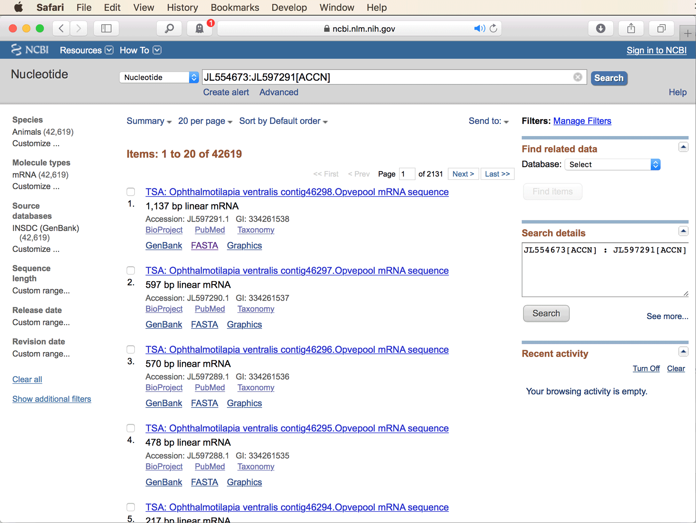

* Click on "Send to:" at the top right of the list of accessions, which will open a dialog box. In that dialog box, select "File" as the destination, and "Fasta" from the drop-down menu below "Format" as shown in the next screenshot.

Then, click "Create File" to download a file containing all these sequences in Fasta format (the file size will be about 30 MB). By default, this file is going to be named `sequence.fasta`, but note that your browser might add `.txt` to the end of the file; if so, remove this file extension.

* Locate the Fasta file `sequence.fasta` in your default download location, copy it to your analysis directory for this tutorial, and rename it with the following command:

		mv sequence.fasta* ophven.fasta

* You should now have the twelve assembly files as well as the file with query exon sequences, `exons.fasta`, in your analysis directory. Make sure that this is the case by typing

		ls *.fasta
		
* Next, make sure that your installation of the BLAST+ command-line tools is working. To test this, type

		blastn -version
		
	If you then see the latest version number, your installation appears to be correctly installed.
	
* Prepare BLAST databases for all assembly files. This can be done with the following commands:

		for i in ??????.fasta
		do
			makeblastdb -in ${i} -dbtype nucl
		done
		
* As a first test, search for an ortholog to the very first query exon sequence in the tilapia (*Oreochromis nilotiucs*) genome assembly. To do this, first generate a temporary file containing only the first query sequence:

		head -n 2 exons.fasta > tmp.fasta
		
* Then, use the TBLASTN algorithm to identify similar sequences in the tilapia genome assembly. In contrast to the standard BLAST algorithm, TBLASTN compares an amino-acid query sequence and a set of nucleotide sequences (such as a genome assembly), and it scores alignments according to all possible translations of the nucleotide code into amino acids. Run TBLASTN with the following command:

		tblastn -query tmp.fasta -db orenil.fasta
		
	You should see the following output:
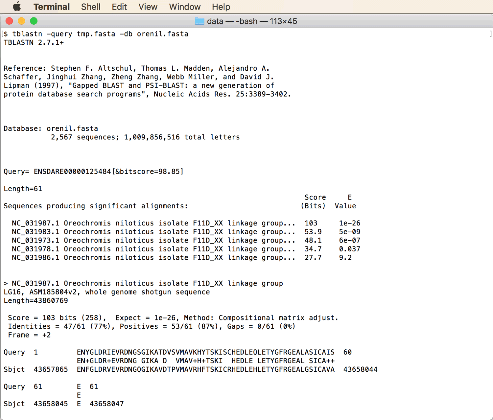
This output shows that five different regions of the tilapia genome produced significant alignments with the query sequence. The first of these alignments is shown near the bottom of the screen, and as you'll see, this alignment is based not on the nucleotide sequence identified from the tilapia genome assembly but on its amino-acid translation that is here referred to as the subject ("Sbjct") sequence. **Question 1:** Should we consider this tilapia sequence as an ortholog to the zebrafish query sequence? [(see answer)](#q1)
	
* You may find that the TBLASTN output contains much more information than we need. To show only the most relevant information in a customized format, you can use the option "-outfmt", for example as shown in the next command:

		tblastn -query tmp.fasta -db orenil.fasta -outfmt "6 qseqid sseqid evalue bitscore pident qstart qend sstart send qseq sseq"
	
	**Question 2:** What are the coordinates in the tilapia genome for the best-scoring fragment? [(see answer)](#q2)
	
* While the "-outfmt" options allows customization of the output, there is unfortunately no option to include the nucleotide sequence of the subject instead of its amino-acid translation. To overcome this limitation, we can use `find_orthologs.py`, a wrapper script for BLAST or TBLASTN searches from the github repository associated with the study of [Malmstrøm et al. (2016)](https://www.nature.com/articles/ng.3645). Download this script, written in Python, with the following command:

		wget https://raw.githubusercontent.com/uio-cees/teleost_genomes_immune/master/S11_S14_ortholog_detection_and_filtering/scripts/resources/find_orthologs.py
		
	This script internally runs BLAST or TBLASTN, reads the output of these programs including the genomic coordinates of the best-scoring alignment, and extracts the nucleotide sequence corresponding to these coordinates from the genome assembly.
		
* To see the available options of this Python script, type

		python3 find_orthologs.py -h

* Test the script by running it again with the first query sequence (in file `tmp.fasta`) and with the tilapia genome assembly as subject sequences:

		python3 find_orthologs.py -t tmp.fasta orenil.fasta
		
	(option "-t" specifies that the query sequence is in amino-acid code, and that therefore TBLASTN should be used instead of BLASTN). 
	The script should produce output as shown in the next screenshot.
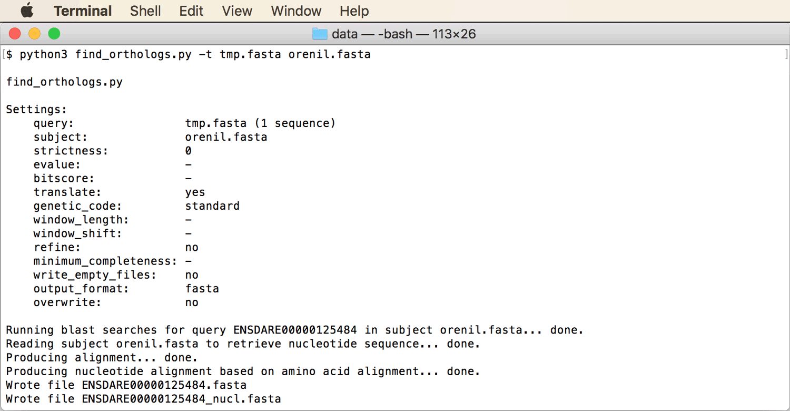

* From the script output, you'll see that two result files were written, named `ENSDARE00000125484.fasta` and `ENSDARE00000125484_nucl.fasta`. Have a look at both files. You'll see that file `ENSDARE00000125484.fasta` contains the aligned parts of the query and the subject sequence, both in amino-acid code. File `ENSDARE00000125484_nucl.fasta` contains the nucleotide sequences corrsponding to the amino-acid sequences in the first file. Given that the nucleotide sequence corresponding to the amino-acid query sequence is not known, the query sequence is not included in this second file.

* Remove the two output files again, or the script will hesitate to overwrite them when we run it next time.

		rm ENSDARE00000125484.fasta
		rm ENSDARE00000125484_nucl.fasta

* A nice feature of the Python script is that it can be used not only with one subject at a time, but also with a list of subjects. The best-scoring sequences from all subjects are then collected and written to a single output file. Moreover, before writing this output file, the Python scripts uses the software MAFFT (see tutorial [Multiple Sequence Alignment](../multiple_sequence_alignment/README.md)) to generate a multiple sequence alignment of all best-scoring sequences. To test the Python script with all assemblies at once, first generate a file that contains only the names of the assembly files. Use the following commands to do so, ensuring that the zebrafish assembly, which will serve as a reference, is listed first:

		ls danrer.fasta > subjects.txt
		ls ??????.fasta | grep -v danrer >> subjects.txt
		
* Then, run the Python script again, this time using the file with the list of genome assemblies as input:

		python3 find_orthologs.py -t -s 1 --refine tmp.fasta subjects.txt
		
	In the above command, option "-s 1" now specifies a "strictness" level of 1 in accepting fragments of the subject sequence when the putativ ortholog sequence is composed. This corrsponds to the BLAST / TBLASTN option "-culling_limit 1" with which fragments of a subject sequence are not considered if they overlap with another subject sequence that has a higher alignment score. This setting only plays a role when the best-scoring sequence alignment does not cover the entire query sequence. Also note option "--refine" in the above command which specifies that the resulting set of best-scoring sequences should be used for multiple sequence alignment with MAFFT. The output files will once again be named `ENSDARE00000125484.fasta` and `ENSDARE00000125484_nucl.fasta`.
	
* Open file [`ENSDARE00000125484_nucl.fasta`](res/01/ENSDARE00000125484_nucl.fasta) in AliView (see tutorial [Multiple Sequence Alignment](../multiple_sequence_alignment/README.md) if you have not used AliView before). The AliView window should then look as shown in the next screenshot.
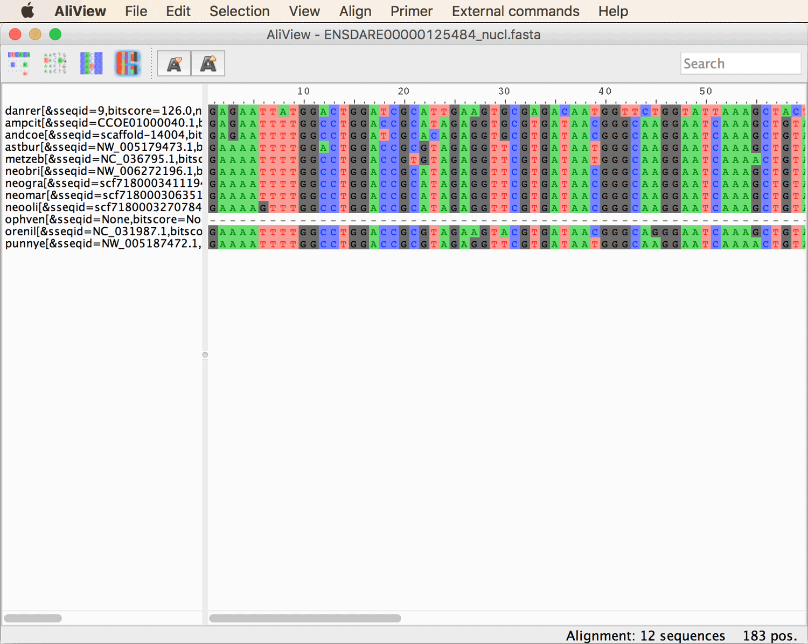
You'll notice that the sequence for ophven is completely missing. This does not mean that the TBLASTN search did not produce a single significant alignment. Instead it means that none of the these alignments had a score above the bitscore threshold specified in the Fasta header line. This bitscore threshold is automatically recognized by the script `find_orthologs.py` and alignments with scores below it are excluded from the output. XXX Update XXX

* Still in AliView, click on the fourth icon from the left in the menu bar to translate the nucleotide sequence to amino-acid code, as shown below.
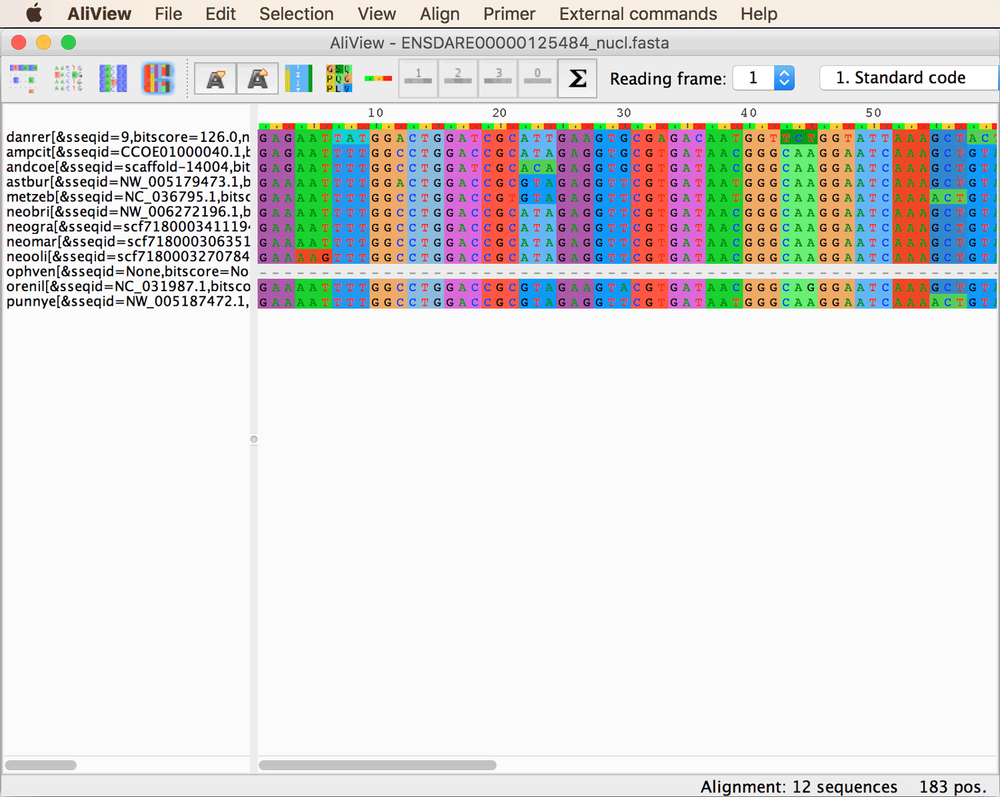

* Then, click on the sigma icon in the middle of the menu bar to count the number of stop codons in the alignment. As shown in the next screenshot, AliView should not find any stop codons at all when the first reading frame is selected.
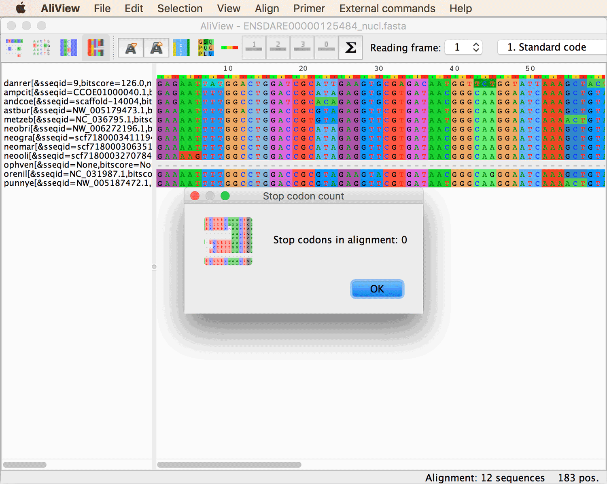

* Repeat counting stop codons when the second or third reading frames are selected. This comparison will show that the first reading frame is the correct translation of nucleotides to amino acids. Conveniently, the alignment also begins with a first codon position and ends with a third codon position. In fact, if the alignment would include insertions or deletions, these should all begin with a first codon position and end with a third codon position. This is because the alignment generated by `find_orthologs.py` (by running MAFFT internally) is based on the amino-acid sequences, and only after these are aligned, they are back-translated to nucleotide sequences.

* Before we go on to generate multiple-sequence alignments for all queries, we filter the set of query sequences to shorten the run time required for the analyses with script `find_orthologs.py`. To exclude all query sequences with either a sequence length shorter than a certain number of amino acids or a comparatively low bitscore threshold (these queries are less sensitive in detecting true orthologs), we can use the script [`filter_queries.rb`](src/filter_queries.rb), written in Ruby. Here, we'll exclude querie sequences that are shorter than 60 amino acides or have a bitscore threshold below 51, using the following command:

		ruby filter_queries.rb exons.fasta exons_red.fasta 60 51
		
	The output file containing only query sequences that pass these filters is then written to file `exons_red.fasta`.
	
* If you would run the Python script `find_orthologs.py` now with

		python3 find_orthologs.py -t -s 1 --refine exons_red.fasta subjects.txt
		
	the analysis would still take about a day. You could start this analysis nevertheless if you either have a day to spare or if you plan to cancel the analysis after following it for some time, and to continue this tutorial not with your own results but with results from my analysis (see next step). Another option to speed up the analysis is by parallelizing it. While `find_orthologs.py` does not use threading, you could split file `exons_red.fasta` into, say, five separate files, and then execute script `find_orthologs.py` five times to process these four files in parallel. If you plan to parallelize the analysis in this way, download the Ruby script [`split_queries.rb`](src/split_queries.rb) and use the following commands:
	
		ruby split_queries.rb exons_red.fasta 5
		
	(the number 5 specifies that the file should be split into five equal parts; just use a different number if you would like to run script `find_orthologs.py` on more or less than five processors simultaneously). Then, run script `find_orthologs.py` with
	
		for i in exons_red.??.fasta
		do
			python3 find_orthologs.py -t -s 1 --refine ${i} subjects.txt &
		done
	
	(the ampersand symbol at the end of the line tells the system to execute the command in the background and continue with the next iteration of the loop rather than waiting for the first command to finish). Note, however, that even with this parallelization, the analysis might take 5-10 hours, so feel free to use the results of my analysis for the rest of this tutorial instead of running it yourself (see next step).
	
* At this point you either decided to cancel the analysis with script `find_orthologs.py` and to continue with the results of my analysis, or you completed the analysis. In the first case, download file [`01.tgz`](res/01.tgz), which is a compressed directory containing all alignments resulting from the analysis. You can uncompress the directory with

		tar -xzf 01.tgz

	In the second case, you might want to clean up the directory in which you ran the analysis, for example with the following commands:
	
		mkdir 01
		mv ENSDARE*.fasta 01
	
	In both cases, all alignment files will be located in a directory named `01`.
	
* Have a look at the content of the directory. **Question 3:** How many nucleotide alignments are included in it? [(see answer)](#q3)

* Open the first five of the nucleotide alignment files (those ending in `_nucl.fasta`) in AliView and check them visually. **Question 4:** Do you notice anything unusual? [(see answer)](#q4)

## Alignment filtering

In this part of the tutorial we are going to apply basic filtering steps to identify and exclude potentially paralogous or misaligned sequences from the set of nucleotide-sequence alignments. We are also going to exclude sites that may be poorly aligned for other reasons, and we will then identify a set of the most suitable alignments for phylogenetic divergence-time estimation.

* Given that all cichlid species included in the analysis are equally distantly related to zebrafish, it can be expected that the bitscores between a zebrafish query sequence and all its cichlid orthologs should be very similar. If this is not the case, and one or more cichlid sequences have markedly lower bitscores than the other cichlid sequences, this indicates the presence of either paralogs or misassembled regions in those cichlid sequences with lower bitscores. Thus, an easy way to filter paralogs and misassembly automatically is to exclude those sequences that have bitscores below a certain threshold proportion of the maximum bitscore. To do this, we can use the Ruby script [`filter_sequences_by_bitscore.rb`](src/filter_sequences_by_bitscore.rb). This script takes three arguments: The name of the directory with alignment files, the name of a second directory to which filtered alignments will be written, and a proportion that will be used as a threshold to exclude sequences with low bitscores. Note that when determining the maximum bitscore, the script ignores the bitscore of the very first sequence in the alignment which is considered to be the reference sequence (and in our case is a nucleotide zebrafish sequence). We'll name the second directory `02` and use a threshold of 0.9 to exclude all sequences with a bitscore that is less than 90% of the maximum bitscore obtained by any sequence besides the reference. Thus, run this script with the following command:

		ruby filter_sequences_by_bitscore.rb 01 02 0.9
		
	The script will report in the screen output how many (if any) sequences it removed from each alignment.
		
* Open the first two of those newly written files from which sequences have been removed. **Question 5:** Can you figure out why these sequences were removed? [(see answer)](#q5)

* If all cichlid sequences within an alignment are orthologous to each other, we might also expect that they share similar signatures of selection, measured by the dN/dS ratio in pairwise comparisons with the reference sequence. If, on the other hand, any of the sequences are paralogous, we might expect that the respective genes have adopted different functions, which would probably involve periods of selection and could thus possibly be detected by an increased dN/dS ratio. Thus we are going to calculate dN/dS ratios between each sequence of each alignment and the reference sequence (this filtering step is the reason why we included the zebrafish reference sequence in the first place), and we'll exclude sequences with dN/dS ratios above a certain threshold. Another reason to exclude sequences with signatures of selection even if they should be ortholous is that these are likely to evolve less clock-like than other markers, which would make them less suitable for divergence-time estimation. To calculate dN/dS ratios, we'll use the software codeml of the [PAML](http://abacus.gene.ucl.ac.uk/software/paml.html) ([Yang 2007](https://academic.oup.com/mbe/article/24/8/1586/1103731)) package for phylogenetic analyses. These codeml analyses will be automatically performed for each sequence of each alignment by the Ruby script [`filter_sequences_by_dNdS.rb`](src/filter_sequences_by_dNdS.rb). As script `filter_sequences_by_bitscore.rb`, this script requires as input the name of the directory with input files, the name of a new directory to which the filtered alignments will be written, and a filtering threshold for the dN/dS ratio. We'll use files from directory `02` as input and write filtered alignment files to a new directory named `03`. As a threshold for the dN/dS ratio, use 0.3. This is a very conservative threshold, but as we will see, it will not exclude many sequences anyway. Thus, run script [`filter_sequences_by_dNdS.rb`](src/filter_sequences_by_dNdS.rb) with the following command:

		ruby filter_sequences_by_dNdS.rb 02 03 0.3

* From the screen output of the script, you'll see that no more than 15 sequences have been removed. Of these, five sequences were removed from file `ENSDARE00000039845_nucl.fasta`. Open the two version of this file, before (from directory `02`) and after (from directory `03`) the sequences were excluded, in AliView and compare them. The alignments should look as shown in the two screenshots below.
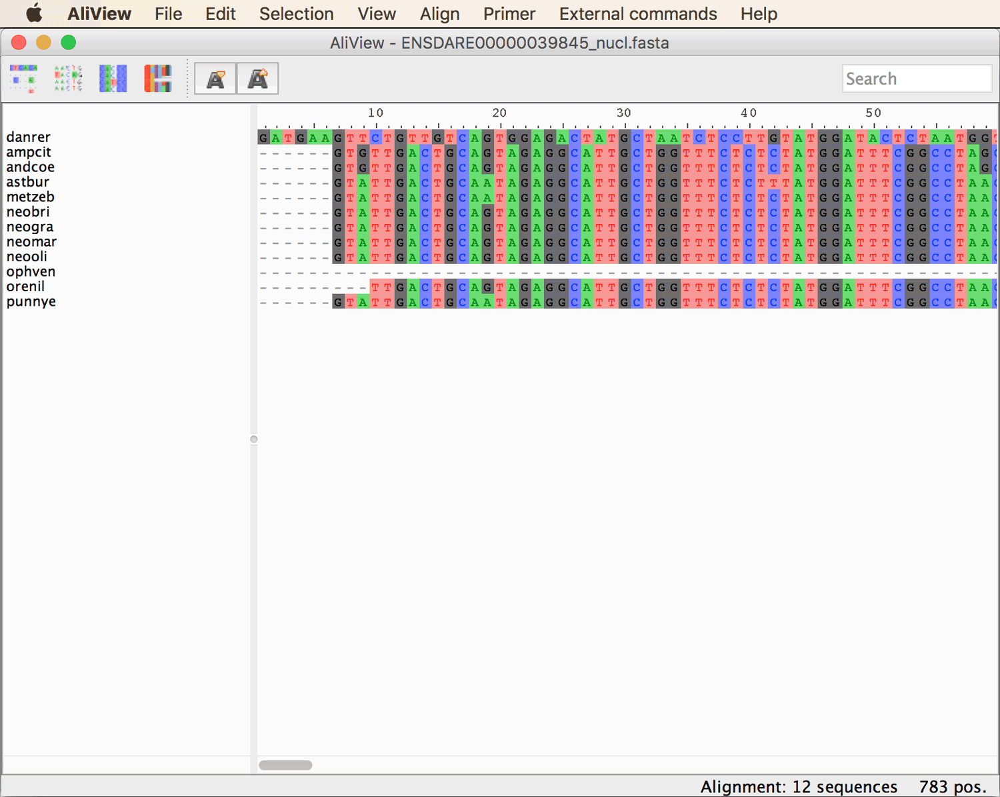

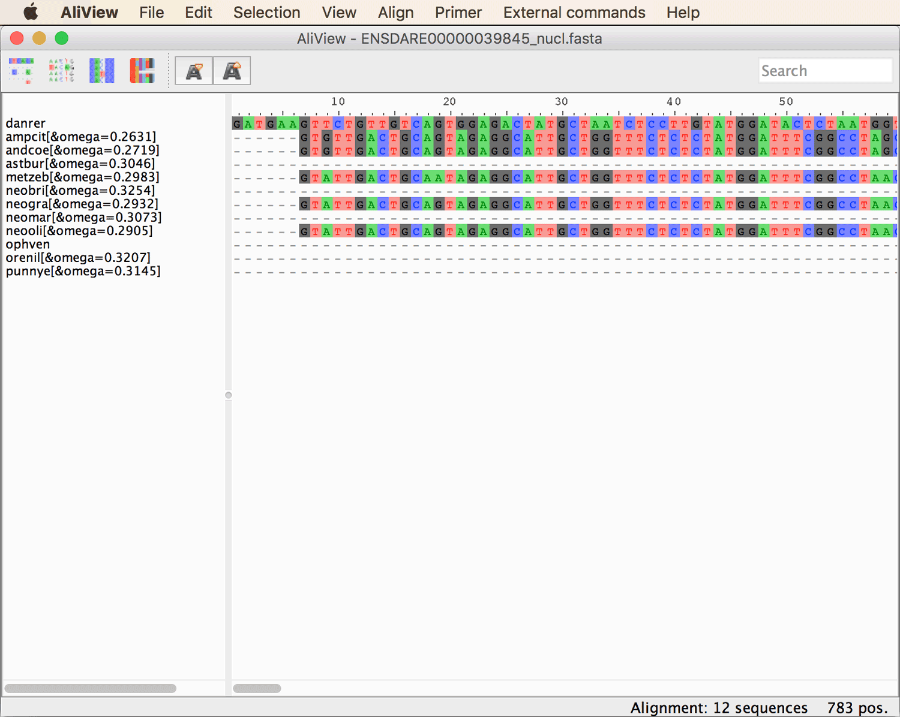
As you'll see from the annotation included in the sequence ids in the newer version of the file, you'll see that most sequences had an omega (= dN/dS) value around 0.3, and that the five sequences that were removed had omega values slightly above 0.3.

* In the AliView window for the unfiltered version of the file, click on the fourth icon from the left in the menu bar to color-code sequences according to their amino-acid translation. When you scroll through the alignment, you'll see that all sequences are quite different from the zebrafish reference in the amino-acid code, which may explain the generally high omega values. For example, the region around positions 500-540 should look as shown in the next screenshot.
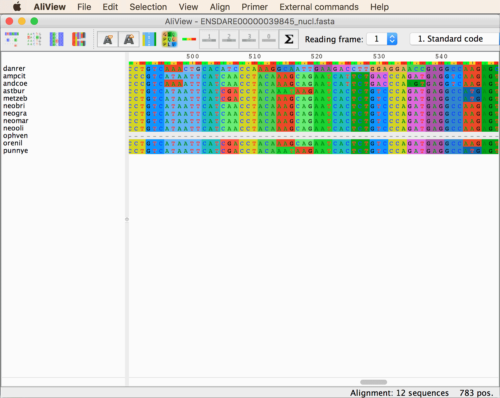
Thus, it appears that the five removed sequences were not much different from those that were not removed, which means that their removal may not have been necessary. However, given that the sequences of this alignment are quite divergent, it could be argued that their orthology may not be as reliable as in other alignments; thus, the more conservative option is to exclude them. Because a later filtering step is going to remove alignments that contain too much missing data, it is likely that the entire alignment is then going to be removed.

* Also open the two versions of file `ENSDARE00000508584_nucl.fasta` in AliView. You'll see that the sequence of *Amphilophus citrinellus* ("ampcit") has been excluded even though its omega value is only slightly higher than that of *Andinoacara coeruleopunctatus* ("andcoe"). One might argue that if one of the two sequences is removed, the other should also be removed. This shows a general limitation of threshold-based filtering to which there is no easy solution. In this case, the absence of insertions or deletions as well as stop codons indicates that all sequences are orthologs, and that the sequence of *Andinoacara coeruleopunctatus* could also have been retained. Nevertheless, when genomic data is used for phylogenetic inference, it is often advisable to remove rather too much than too little.

* After the above two filtering steps we now assume that all sequences remaining in the alignments are in fact orthologous to each other. However, the alignments should still be improved and filtered before they can be used for phylogenetic analyses. As in tutorial [Multiple Sequence Alignment](../multiple_sequence_alignment/README.md), we are once again going to use the software [BMGE](https://research.pasteur.fr/en/software/bmge-block-mapping-and-gathering-with-entropy/) to remove poorly aligned sites as well as alignment regions with too much missing data. However, unlike in tutorial [Multiple Sequence Alignment](../multiple_sequence_alignment/README.md), we now take care not too disrupt the reading frame of the protein-coding nucleotide sequences when alignment regions are removed. Thus, each region that is to be removed should first be extended so that it begins with a first codon position and ends with a third codon position. In this way, the amino-acid translation of the remaining alignment will not be affected. Preserving the reading frame will also be facilitate codon-based partitioning in subsequent phylogenetic analyses (as done in tutorial [Substitution Model Selection](../substitution_model_selection/README.md)). Unfortunately, BMGE has no option to preserve the reading frame as described above. However, we can use the Ruby script [`filter_sites_with_BMGE.rb`](src/filter_sites_with_BMGE.rb) to achieve this. This script runs BMGE internally, reads the output of BMGE, and removes the low-quality alignment regions detected by BMGE while preserving the reading frame. This script requires six command-line arguments: The first and second command-line arguments are as before the names of the input and output directories. As the third command-line argument, the script expects the path to the BMGE installation. If the file `BMGE.jar` is located in the current directory, this argument would simply be "BMGE.jar". The fourth and fifth arguments are the BMGE options gap-rate cut-off and entropy score cut-off (these options are described in tutorial [Multiple Sequence Alignment](../multiple_sequence_alignment/README.md)). We use a maximum gap rate of 0.2 and a maximum entropy score of 0.5. Thus, run script [`filter_sites_with_BMGE.rb`](src/filter_sites_with_BMGE.rb) with the following command (replacing the path to `BMGE.jar` if necessary):

		ruby filter_sites_with_BMGE.rb 03 04 BMGE.jar 0.2 0.5
		
* For the first alignment from which sites have been removed, compare the files before (in directory `03`) and after (in directory `04`) this filtering step by opening both in AliView. **Question 6:** Were these sites removed due to gaps or due to alignment entropy? [(see answer)](#q6)

* In the next filtering step, we will discard the least informative of the alignments that are either particularly short or contain a rather high amount of missing data. We will do so with the Ruby script [`filter_exons_by_missing_data.rb`](src/filter_exons_by_missing_data.rb). This script takes four command-line arguments. The first two of these are again the names of the input and output directories. The third argument is the allowed maximum number of completely missing sequences in the alignment, and the fourth argument is the minimum length that an alignment should still have after the previous filtering steps. To retain only those alignments that have maximally one missing sequence and are still at least 150 bp long, use the following command:

		ruby filter_exons_by_missing_data.rb 04 05 1 150
		
	**Question 7:** How many exon alignments are left after this step? [(see answer)](#q7)

* As the phylogenomic study by [Jarvis et al. (2014)](http://science.sciencemag.org/content/346/6215/1320) has demonstrated, alignments with high among-sequence variation in GC content can strongly mislead phylogenetic inference because under a model assuming GC-content homogeneity, species with extremely high or low GC content might be grouped even if they're not related (see Figure 6a,b of [Jarvis et al. 2014](http://science.sciencemag.org/content/346/6215/1320)). We will thus quantify GC-content variation among the sequences of each alignment, and remove alignments with a particularly high amount of variation. However, before doing so, we'll first remove the zebrafish reference sequences from each alignment; these will not be needed for further filter steps and will also not be included in phylogenetic inference but could contribute to increased GC-content variation. To exclude the reference sequences, use the following commands:

		mkdir 06
		for i in 05/*.fasta
		do
			tail -n +3 ${i} > 06/`basename ${i}`
		done
	
	(note that the ticks around "basename" are backticks).

* Then, use the Ruby script [`filter_exons_by_GC_content_variation.rb`](src/filter_exons_by_GC_content_variation.rb) to identify and remove exon alignments with high among-sequence GC-content variation. This first and second command-line arguments for this script are once again the input and output directories. Only one further argument is required that specifies the threshold for the standard variation of the GC content. We'll set the threshold to a standard variation of 0.03. Thus, run script [`filter_exons_by_GC_content_variation.rb`](src/filter_exons_by_GC_content_variation.rb) with the following command:

		ruby filter_exons_by_GC_content_variation.rb 06 07 0.03

	**Question 8:** How many exon alignments are excluded due to high GC-content variation? [(see answer)](#q8)
	
* Due to recombination and incomplete lineage sorting, it is possible that some regions of the genome have different phylogenetic histories than others, and that these "gene" trees (= local phylogenies, regardless of whether the genomic region is a gene or not) differ from the true species tree. These potential differences have so far been ignored in the phylogenetic analyses of tutorials [Maximum-Likelihood Phylogenetic Inference](../ml_phylogeny_inference/README.md), [Bayesian Phylogenetic Inference](../bayesian_phylogeny_inference/README.md), and [Phylogenetic Divergence-Time Estimation](../divergence_time_estimation/README.md), which was justifiable given that the datasets used in those tutorials contained mostly very divergent lineages that are expected to be less affected by incomplete lineage sorting. The current dataset, however, includes some very closely related taxa, and variation in the phylogenies of different regions of the genome is therefore probable. This variation is going to be accounted for by using the multi-species-coalescent model in the next tutorials, which infers the species tree separately from the gene trees and allows those gene trees to vary. Because the alignments generated in this tutorial will then be used for analyses with the multi-species-coalescent model, it is important that we don't concatenate all alignments into a single alignments. However, the length of most individual exon alignments is rather short and thus these individual alignments may contain too little information to infer the phylogeny of each exon. To see the lengths of all filtered alignments, use the following command:

		for i in 07/*_nucl.fasta
		do
			echo -ne "${i}\t"
			head -n 2 ${i} | tail -n 1 | wc -m
		done
		
	You can also calculate the average alignment length with the next command:
	
		for i in 07/*_nucl.fasta
		do
			echo -ne "${i}\t"
			head -n 2 ${i} | tail -n 1 | wc -m
		done | awk '{ sum += $2; n++ } END { if (n > 0) print sum / n; }'

	**Question 9:** How long is the average exon alignment? [(see answer)](#q9)

* A reasonable compromise between concatenation of all alignments (and thus assuming the same phylogeny for all genomic regions) and no concatenation at all is probably to concatenate exons that are part of the same gene. This means that we are willing to assume that recombination did not occur within the gene but that it may have occurred between different genes. While there is valid criticism to this assumption, partly because exons of one and the same gene can be quite distantly located on the chromosome ([Springer and Gatesy 2016](https://www.sciencedirect.com/science/article/pii/S1055790315002225)), within-gene recombination is likely less frequent than between-gene recombination, and thus we will here assume that its effect is negligible. File [exons_info.txt](data/exons_info.txt) contains a list of exon and gene ids for the zebrafish reference and can therefore be used to determine which exons are part of the same gene. To see how many of the filtered exon alignments share the same gene, use the following command (after downloading file [exons_info.txt](data/exons_info.txt) to your analysis directory):

		for i in 07/*.fasta
		do
			exon_id=`basename ${i%_nucl.fasta}`
			cat exons_info.txt | grep ${exon_id} | cut -f 2
		done | sort | uniq -c
		
* To concatenate the alignments of exons of the same genes, use the Ruby script [`concatenate_exons_per_gene.rb`](src/concatenate_exons_per_gene.rb). This script takes three command-line arguments, of which the first two are again the names of the input and output directories, and the third is the path to the file with a list of exon and gene ids. Thus, run this script with the following command:

		ruby concatenate_exons_per_gene.rb 07 08 exons_info.txt
		
* Find out how many gene alignments were written by the script [`concatenate_exons_per_gene.rb`](src/concatenate_exons_per_gene.rb), using

		ls 08/*.fasta | wc -l
		
* Check the lengths of the concatenated alignments with a similar command to that used above to find the lengths of exon alignments:

		for i in 08/*.fasta
		do
			echo -ne "${i}\t"
			head -n 2 ${i} | tail -n 1 | wc -m
		done

	**Question 10:** How long is the longest alignment now? [(see answer)](#q10)

* Finally, we'll remove all alignments with a length shorter than 500 bp as these may be too uninformative for gene-tree inference. Use the following commands to do so:

		mkdir 09
		for i in 08/*.fasta
		do
			gene_id=`basename ${i%.fasta}`
			seq_length=`head -n 2 ${i} | tail -n 1 | wc -m`
			if [[ ${seq_length} -ge 500 ]]
			then
				cp ${i} 09/${gene_id}.fasta
			fi
		done
		
	**Question 11:** How many alignment are now in directory `09`? [(see answer)](#q11)

We have now generated a set of alignments that can be used for phylogenetic analyses based on the multi-species-coalescent model. Note that additional filtering steps would be possible. For example, in [Malmstrøm et al. (2016)](https://www.nature.com/articles/ng.3645), we performed tree-concordance analyses as a further test for paralogous sequences before concatenating alignments of different exons of each gene. Only genes were then used for which a minimum of three exons shared a concordant tree, and the exons with discordant trees were discarded. In addition, we performed phylogenetic analyses with the software BEAST for each gene alignment separately, and then discarded gene alignments resulting in a high estimate for the standard variation of the molecular clock, indicating that these genes evolved less clock-like than others. Here, we have skipped these steps as they are not essential, but computationally rather demanding. If you would like to learn more about these additional filtering options, you can find explanations and scripts on the github repository for the study of [Malmstrøm et al. (2016)](https://www.nature.com/articles/ng.3645), at [https://github.com/uio-cees/teleost\_genomes\_immune/blob/master/S11\_S14\_ortholog\_detection\_and\_filtering](https://github.com/uio-cees/teleost_genomes_immune/blob/master/S11_S14_ortholog_detection_and_filtering).

 

                   

## Answers

* **Question 1:** In fact this tilapia sequence producing the highest-scoring of the five alignments should be considered as a potential ortholog to the zebrafish query sequence. Its bitscore is 103, almost twice as high as the bitscore for the second-best alignment, which is 53.9. Given that by definition, an orthologous pair of sequences diverged due to a speciation event whereas a paralogous pair of sequences results from an earlier duplication event, it is reasonable to assume that the highest sequences similarity (and thus the highest bitscore) should be found between orthologs, provided that the genome assembly actually contains an ortholog to the query sequence. Thus, if, in our case, the tilapia genome actually contains an ortholog to the zebrafish query, this ortholog is most likely the sequence listed for the very first alignment. Moreover, the bitscore of 103 is above the query-specific threshold, which, as you can see from the annotation next to the query name, is 98.85. Recall that these thresholds were defined based on the range of bitscores of known orthologs among ten teleost genome assemblies included in the ENSEMBL database. The threshold of 98.85 therefore means that one or more of the known orthologs had a bitscore as low as 98.85, lower than the bitscore of 103 for the tilapia sequence in our test run. In addition, recall that query sequences were only included in file `exons.fasta` if the lowerst bitscore for known orthologs was at least 1.5 times as high as the highest bitscore for paralogs, thus, if the threshold is set to 98.85, this also means that no paralog reached a score greater than 98.85 &#247; 1.5 = 65.9, which in our test run is more comparable to the score of the second-best alignment. A further indication that the tilapia sequence in the first alignment is in fact an ortholog is the absence of stop codons in the selected reading frame. Thus, the highest-scoring sequence is most likely an ortholog.

* **Question 2:** With the option "-outfmt 6 qseqid sseqid evalue bitscore pident qstart qend sstart send qseq sseq", the columns of the output contain the following information:
	* qseqid: The ID of the query sequence.
	* sseqid: The ID of the subject sequence.
	* evalue: The e-value of the alignment (the probability of seeing an alignment of this quality by chance alone).
	* bitscore: The bitscore of the alignment.
	* pident: The proportion of identical sites in the aligned sequences.
	* qstart: The first position in the query sequence that is included in the alignment.
	* qend: The last position in the query sequence that is included in the alignment.
	* sstart: The first position in the subject sequence that is included in the alignment.
	* send: The last position in the subject sequence that is included in the alignment.
	* qseq: The aligned part of the query sequence.
	* sseq: The aligned part of the subject sequence.

	For the best-scoring alignment of our test run, the subject sequence ID (in the second column of the output) is reported as "NC_031987.1"; this corresponds to linkage group 16 in the tilapia genome assembly. The first and last positions of the aligned part of this sequence are 43,657,865 (in the eigth column) and 43,658,047 (in the ninth column of the output).
	

* **Question 3:** The directory should include 535 alignment files. An easy way to count these is the following command:

		ls 01/*_nucl.fasta | wc -l

* **Question 4:** You should notice that part of the *Neolamprologus olivaceous* ("neooli") sequence in file [`ENSDARE00000004480_nucl.fasta`](res/ENSDARE00000004480_nucl.fasta) is obviously misaligned. In AliView, this part should look as in the next screenshot.

The occurrence of such misalignment might be surprising given that script `find_orthologs.py` even ran MAFFT internally to refine the alignment. However, the MAFFT alignment step was not performed with nucleotide sequences but with amino-acid sequences instead. Thus, the cause of the misalignment becomes more apparent when we look at the amino-acid sequence version of the same alignment, in file [`ENSDARE00000004480.fasta`](res/ENSDARE00000004480.fasta). In this alignment of amino-acid sequences, the misaligned region appears as shown in the next screenshot.
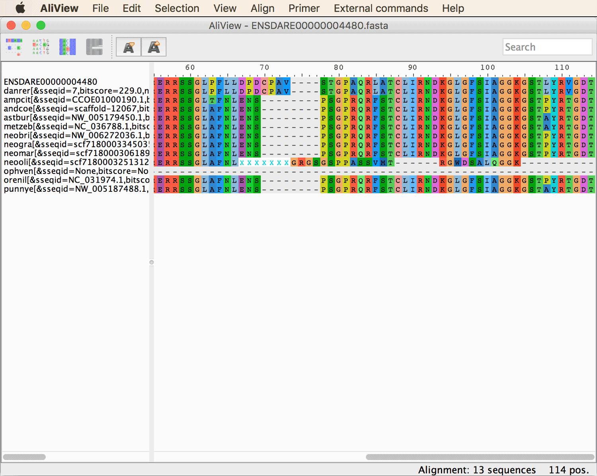
You'll see that the amino-acid sequence of *Neolamprologus olivaceous* ("neooli") also seems to be misaligned after a stretch of missing data marked with several "X"s around position 70. Moreover, this part of the amino-acid sequence is not only misaligned but also surprisingly different from the other sequences, given that the nucleotide sequences looked very similar and only misaligned. The issue is that the stretch of missing data introduced a shift in the reading frame, meaning that MAFFT then tried to align amino-acid sequences that were partially incorrectly translated. This kind of issues shows that it might be a good idea to give all alignments used for phylogenetic inference also a visual inspection in the end. Even if hundreds or thousands of alignments shold be used in phylogenomic studies, it is preferable to spend a few hours or days checking them, than to perform the phylogenetic analysis with undetected misalignments, a point also made recently by [Springer and Gatesy (2018)](https://www.tandfonline.com/doi/abs/10.1080/14772000.2017.1401016). Nevertheless, the here presented pipeline for ortholog detection contains filtering steps that might also identify alignments with misaligned regions automatically. For example, the bitscore of the *Neolamprologus olivaceous* sequence is much lower than the bitscore of most other sequences. These bitscores were written into the Fasta header line by script `find_orthologs.py` and you can make them visible in the AliView window by increasing the width of the left part of the window, as shown below.
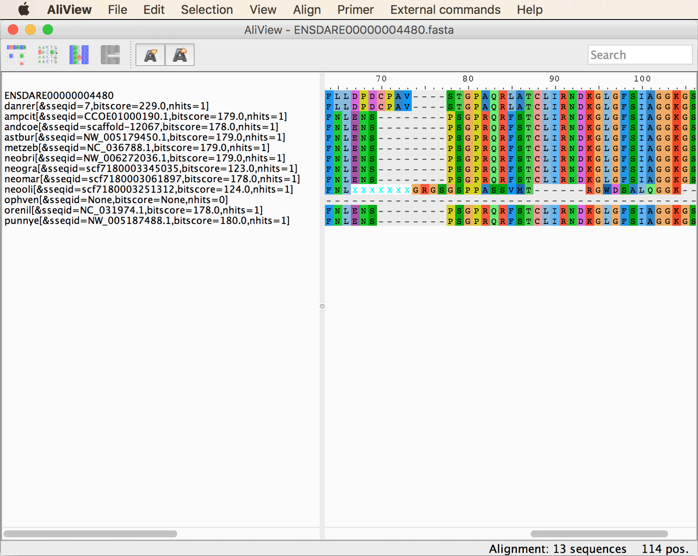
. You'll see that the bitscore of the *Neolamprologus olivaceous*  sequence is 124 whereas most other sequences have a bitscore around 180. Thus, by excluding bitscore outliers, the misaligned sequence might automatically be removed.

* **Question 5:** In the two files `ENSDARE00000004235_nucl.fasta` and `ENSDARE00000004480_nucl.fasta`, the fragmentary sequences for *Neolamprologus gracilis* ("neogra") have been removed due to their low bitscores. Whether or not these sequences should actually be removed is debatable. On the one hand fragmentary sequences do not bias phylogenetic inference as long as they represent fragments of orthologs. On the other hand it is more difficult to distinguish orthologous from paralogous sequences when these are fragmentary. Therefore, the approach implemented in script `filter_sequences_by_bitscore.rb` is to reduce the bitscore required to pass the filter for sequences with missing data, but the reduction of the bitscore threshold is less than proportional to the sequence completeness. In the case of the *Neolamprologus gracilis* sequences, the threshold reduction was apparently too conservative to allow them to pass the filter. More importantly, however, the misaligned sequence for *Neolamprologus olivaceous* ("neooli") in file `ENSDARE00000004480_nucl.fasta` has also been removed. If this sequence alignment had remained unchanged, the misalignment could have led to bias in the phylogenetic inference.

* **Question 6:** With the specified gap rate cut-off of 0.2 we allowed 20% missing data or gaps per site. Given that each alignment contains twelve sequences, this means that maximally two sequences were allowed to have missing data or a gap, otherwise the site was removed. The twelve sites removed from file `ENSDARE00000004382_nucl.fasta` included two gaps, one with a length of three nucleotides that was present in all cichlids and one with a length of nine nucleotides in African cichlid species only. Thus the proportion of sequences without nucleotides at these twelve sites was 0.75-0.0.92, and thus above the specified gap-rate cut-off of 0.2.

* **Question 7:** There should be 368 exon alignments left after the last filtering step, as one can find out with the following command:

		ls 05/*.fasta | wc -l
		

* **Question 8:** The screen output should indicate that a single exon alignment, from file `ENSDARE00000308377_nucl.fasta`, was removed due to high GC-content variation. This is not surprising, given that (after removing the reference sequence) our dataset only includes cichlid sequences that are relatively closely related and should thus be rather similar in GC content. However, when you open the one alignment that was removed (use file `ENSDARE00000308377_nucl.fasta` from directory `06`) in AliView, you'll see that the difference in GC content is actually even noticable visually, as shown in the next screenshot. Therefore, it may actually be reasonable to exclude this alignment.
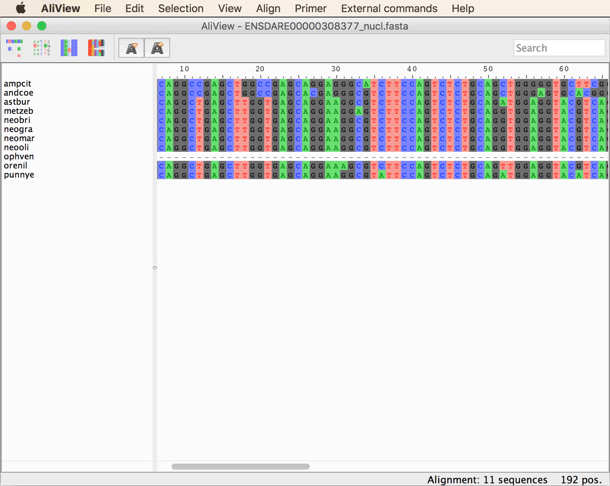

* **Question 9:** The command specified above should output the number "284.144" to the screen, which is the average alignment length. Thus, each individual filtered exon alignment is in fact rather short.

* **Question 10:** The longest alignment is that for the gene with the ID ENSDARG00000037060, with a length of 3,613 bp.

* **Question 11:** Directory `09` should now contain 72 alignment files, which you can find out with this command:

		ls 09/*.fasta | wc -l