# Species-Tree Inference with SNP Data

A tutorial on the inference of species trees from SNP data based on quartets

## Summary

Most methods for species-tree inference with the multi-species coalescent model use gene trees or gene sequences as input. In both cases it is assumed that within-gene recombination is absent and that therefore the entire gene has only a single true phylogeny. This assumption may often not be met, particularly when population sizes are large or speciation is frequent, or when the gene sequences  used for inference are in fact concatenated sequences of exons that are distant to each other on the chromosome. In those cases, species-tree inference based on genes may potentially be affected by the same issues that affect concatenation methods more generally, leading to overconfidence in node support and unreliable tree inference. An approach that completely avoids these issues is species-tree inference based on single-nucleotide polymorphisms (SNPs), where single SNPs instead of genes are considered as phylogenetic markers, and thus each SNP is explicitely allowed have its own phylogenetic history. One tool that implements SNP-based phylogenetic inference is [SVDQuartets](https://www.asc.ohio-state.edu/kubatko.2/software/SVDquartets/) ([Chifman and Kubatko 2014](https://academic.oup.com/bioinformatics/article/30/23/3317/206559)), which estimates the topology of the species tree under the multi-species-coalescent model.

## Table of contents

* [Outline](#outline)
* [Dataset](#dataset)
* [Requirements](#requirements)
* [SNP filtering](#filtering)
* [Species-tree inference with SVDQuartets](#svdquartets)

## Outline

In this tutorial I am going to present how to quickly infer the topology of the species tree from SNP data with the multi-species-coalescent model implemented in the software [SVDQuartets](https://www.asc.ohio-state.edu/kubatko.2/software/SVDquartets/) ([Chifman and Kubatko 2014](https://academic.oup.com/bioinformatics/article/30/23/3317/206559)), and how to assess node support with bootstrapping. The SNP dataset will first be filtered with [bcftools](http://www.htslib.org/doc/bcftools.html) ([Li 2011](https://academic.oup.com/bioinformatics/article/27/21/2987/217423)).

## Dataset

The SNP data used in this tutorial (and in some of the following tutorials) is part of a larger unpublished genomic dataset for Lake Tanganyika cichlid fishes. In this dataset, two individuals (a male and a female) of each cichlid species of Lake Tanganyika have been sequenced on the Illumina platform with a coverage around 10&times;, and read data of all sequenced individuals has been mapped against the tilapia (*Oreochromis niloticus*) genome assembly ([Conte et al. 2017](https://bmcgenomics.biomedcentral.com/articles/10.1186/s12864-017-3723-5)) that has been assembled at the chromosome level. Variant calling was then performed with the [Genome Analysis Toolkit (GATK)](https://software.broadinstitute.org/gatk/) ([McKenna et al. 2010](https://genome.cshlp.org/content/20/9/1297)), and several filtering steps have been applied to remove low-quality genotypes and all indel variation. To reduce computational demands, the part of this dataset used in this tutorial is limited to SNP variation mapped to a single chromosome of tilapia, chromosome 5, and it includes the genotypes of a set of 28 samples of 14 different cichlid species. Most of these species represent the group that has already been the focus of the tutorials [Bayesian Species-Tree Inference](../bayesian_species_tree_inference/README.md) and [Local Assembly](../local_assembly/README.md), fishes of the genus *Neolamprologus* within the Lake Tanganyika tribe Lamprologini. Below is a list of all samples and species included in the dataset of this tutorial.

| Sample ID | Species ID | Species name                  | Tribe         |
|-----------|------------|-------------------------------|---------------|
| IZA1      | astbur     | *Astatotilapia burtoni*       | Haplochromini |
| IZC5      | astbur     | *Astatotilapia burtoni*       | Haplochromini |
| AUE7      | altfas     | *Altolamprologus fasciatus*   | Lamprologini  |
| AXD5      | altfas     | *Altolamprologus fasciatus*   | Lamprologini  |
| JBD5      | telvit     | *Telmatochromis vittatus*     | Lamprologini  |
| JBD6      | telvit     | *Telmatochromis vittatus*     | Lamprologini  |
| JUH9      | neobri     | *Neolamprologus brichardi*    | Lamprologini  |
| JUI1      | neobri     | *Neolamprologus brichardi*    | Lamprologini  |
| LJC9      | neocan     | *Neolamprologus cancellatus*  | Lamprologini  |
| LJD1      | neocan     | *Neolamprologus cancellatus*  | Lamprologini  |
| KHA7      | neochi     | *Neolamprologus chitamwebwai* | Lamprologini  |
| KHA9      | neochi     | *Neolamprologus chitamwebwai* | Lamprologini  |
| IVE8      | neocra     | *Neolamprologus crassus*      | Lamprologini  |
| IVF1      | neocra     | *Neolamprologus crassus*      | Lamprologini  |
| JWH1      | neogra     | *Neolamprologus gracilis*     | Lamprologini  |
| JWH2      | neogra     | *Neolamprologus gracilis*     | Lamprologini  |
| JWG8      | neohel     | *Neolamprologus helianthus*   | Lamprologini  |
| JWG9      | neohel     | *Neolamprologus helianthus*   | Lamprologini  |
| JWH3      | neomar     | *Neolamprologus marunguensis* | Lamprologini  |
| JWH4      | neomar     | *Neolamprologus marunguensis* | Lamprologini  |
| JWH5      | neooli     | *Neolamprologus olivaceous*   | Lamprologini  |
| JWH6      | neooli     | *Neolamprologus olivaceous*   | Lamprologini  |
| ISA6      | neopul     | *Neolamprologus pulcher*      | Lamprologini  |
| ISB3      | neopul     | *Neolamprologus pulcher*      | Lamprologini  |
| ISA8      | neosav     | *Neolamprologus savoryi*      | Lamprologini  |
| IYA4      | neosav     | *Neolamprologus savoryi*      | Lamprologini  |
| KFD2      | neowal     | *Neolamprologus walteri*      | Lamprologini  |
| KFD4      | neowal     | *Neolamprologus walteri*      | Lamprologini  |

Note that one of these *Neolamprologus* species, *Neolamprologus cancellatus* ("neocan") is not accepted by some authors as it is presumed to be a "natural hybrid between *Telmatochromis vittatus* and another species" ([Konings 2015](http://www.cichlidpress.com/books/details/tc3.html)), according to field observations.

## Requirements

* **PAUP\*:** The SVDQuartets method has recently been implemented in the software PAUP\*. Thus, if you already installed PAUP\* for the tutorial [Substitution Model Selection](../substitution_model_selection/README.md), you will not need to install SVDQuartets separately. If you did not yet install PAUP\*, visit the [PAUP\* website]([http://phylosolutions.com/paup-test/](http://phylosolutions.com/paup-test/)) where you will find installation instructions as well as precompiled versions of the program.

* **bcftools:** [bcftools](http://www.htslib.org/doc/bcftools.html) ([Li 2011](https://academic.oup.com/bioinformatics/article/27/21/2987/217423)) is a fast and versatile tool for the manipulation and filtering of variant data in VCF format. Downloads and instructions for installation on Mac OS X and Linux are available at the [HTSlib download webpage](http://www.htslib.org/download/). Installation on Windows is apparently not possible. If you should fail to install bcftools, you could skip the optional [SNP filtering](#filtering) steps in the first part of the tutorial and still run the SVDQuartets analysis.

* **FigTree:** The program [FigTree](http://tree.bio.ed.ac.uk/software/figtree/) by Andrew Rambaut is a very intuitive and useful tool for the visualization and (to a limited extent) manipulation of phylogenies encoded in [Newick](http://evolution.genetics.washington.edu/phylip/newicktree.html) format. Executables for Mac OS X, Linux, and Windows are provided on [https://github.com/rambaut/figtree/releases](https://github.com/rambaut/figtree/releases).

## SNP filtering

The dataset of SNP variation for the above-listed 28 individuals of 14 Lake Tanganyika cichlid species is stored in in compressed variant-call format (VCF) in file [`NC_031969.f5.sub1.vcf.gz`](data/NC_031969.f5.sub1.vcf.gz). To identify the SNPs most suitable for phylogenetic analysis, we will filter the information from this file with the program bcftools. If you failed to install one or both of these tools, you could skip the commands in this part of the tutorial and continue with [Species-tree inference with SVDQuartets](#svdquartets).

* Download the file [`NC_031969.f5.sub1.vcf.gz`](data/NC_031969.f5.sub1.vcf.gz) (24 MB) to your analysis directory without uncompressing it yet.

* As mentioned above, one of the species included in the dataset, *Neolamprologus cancellatus*, is presumed to be a hybrid species. As hybridization would represent a violation of the multi-species-coalescent model, we will here exclude the two samples of this species ("LJC9" and "LJD1") from the dataset (but these will be investigated in more detail in the following tutorials). To exclude the two samples from the VCF file, we can use the program bcftools with the following command:

		bcftools view -s ^LJC9,LJD1 -O z -o NC_031969.f5.sub2.vcf.gz NC_031969.f5.sub1.vcf.gz

	In the above command, the option "-s" specifies a list of sample IDs to be included or excluded, and the "^" character at the beginning of this list specifies that the taxa should be excluded rather than included. In addition, "-O z" specifies that the output should be written in compressed VCF format, and "-o" specifies the name of the output file. All options of bcftools are described in the [bcftools online manual](http://www.htslib.org/doc/bcftools.html), and you can quickly access the general help text of bcftools or the more specific help text for its `view` command by typing only `bcftools` or `bcftools view`, respectively.
	
* To learn a bit about the dataset, you could browse through the first lines of the VCF file with the following command:

		bcftools view NC_031969.f5.sub2.vcf.gz | less -S
		
	As shown in the next screenshot, this command should print the very first part of the header of the VCF file, marked by the double "#" symbol at the beginning of each line. You'll see that the very first line specifies the version of the VCF file format, that other lines beginning with "ALT", "FILTER", "FORMAT", and "INFO" describe the annotation of the records and genotypes, and that the lengths of various contigs are defined. Because all variation of this file was mapped to the tilapia genome assembly, these "contigs" represent the chromosomes of the tilapia genome ([Conte et al. 2017](https://bmcgenomics.biomedcentral.com/articles/10.1186/s12864-017-3723-5)).
	
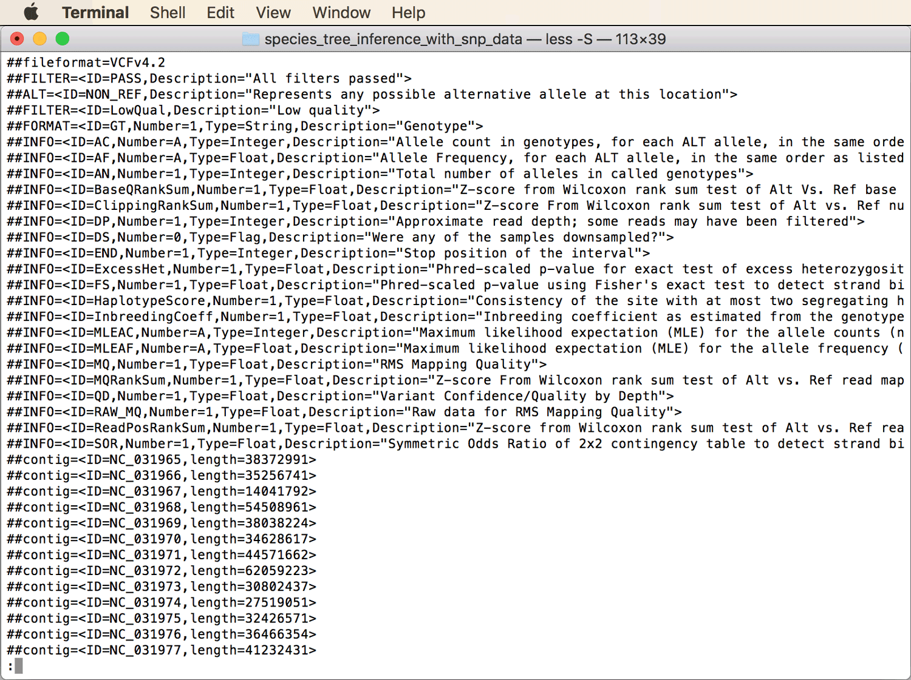

* If you scroll down a few lines, you should see the information shown in the screenshot below. You should see that a single line begins with a single "#" symbol; this line specifies the content of each column in the table below it (note that the tab-delimited columns may be shifted between this line and the lines below). Toward the right of that line, you'll see the first of the sample IDs ("IZA1", "IZC5", "AUE7",...), but the corresponding genotypes may not be visible yet in the lines below it because the fields with format information (the first of which begins with "AC=2;AF=0.004695;AN=36;BaseQRankSum=1.085;...") extend to right end of the screen. These fields contain some information that we will use for filtering, including the total number of called alleles ("AN") and the total number of called non-reference alleles ("AC").
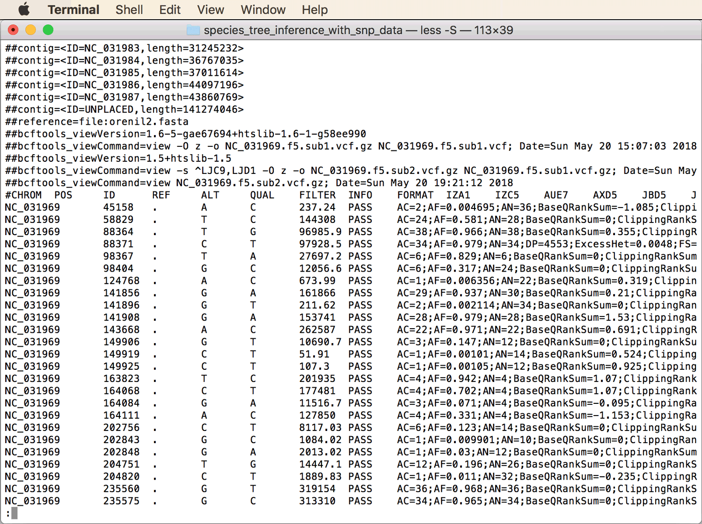

	
	**Question 1:** How far, approximately, is the spacing between SNPs? [(see answer)](#q1)
	
* To see the genotype information for the first few SNPs, hit the right-arrow key a few times to scroll to the right. You should then see the information shown in the next screenshot. Note that, the tab-delimited columns are shifted between lines; thus, genotypes that appear to be in one column are not usually from the same sample. Per SNP, samples that are homozygous for the reference allele are marked with "0/0", samples homozygous for the first alternative allele are marked with "1/1", and "0/1" indicates heterozygous alleles. As you'll see, the dataset contains a large proportion of missing data, marked by "./.".
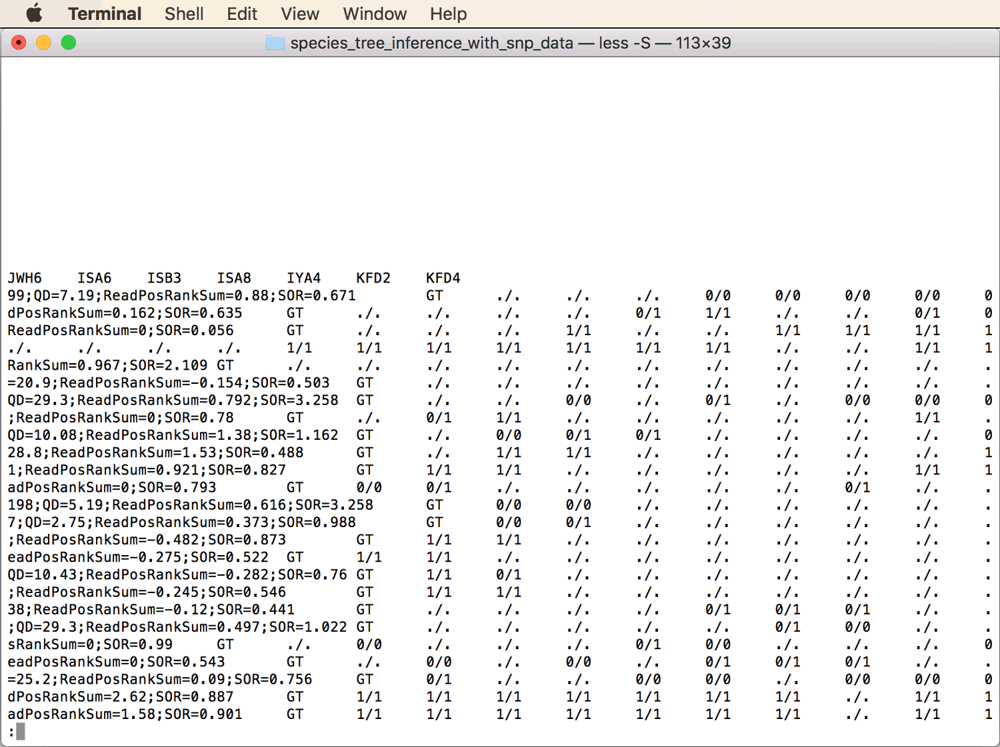

	If you're not familiar with the VCF file format yet, you can more information about it in the [format specification](https://samtools.github.io/hts-specs/VCFv4.2.pdf).
	
* Return to the command-line by hitting the `q` key.

* Find out how many SNPs are included in total in the VCF file `NC_031969.f5.sub2.vcf.gz`. The easiest way to do so is to run the following command:

		bcftools view -H NC_031969.f5.sub2.vcf.gz | wc -l
				
* We will now generate a reduced version of the dataset that includes only the most suitable SNPs for phylogenetic analysis. This means that we exclude all sites at which no alternative alleles are called for any of the samples ("AC==0"), all sites at which only alternative alleles are called ("AC==AN"), and sites at which the proportion of missing data is greater than 20% ("F_MISSING > 0.2"). At the same time, we will ensure that only bi-allelic SNPs are included in the reduced dataset by using the bcftools options "-m2" and "-M2" which set both the minimum ("-m") and maximum ("-M") number of alleles to 2. Thus, use the following bcftools command to write the reduced dataset to a new file named `NC_031969.f5.sub3.vcf.gz`:

		bcftools view -e 'AC==0 || AC==AN || F_MISSING > 0.2' -m2 -M2 -O z -o NC_031969.f5.sub3.vcf.gz NC_031969.f5.sub2.vcf.gz

* Check once again the total number of SNPs included in file `NC_031969.f5.sub3.vcf.gz` **Question 2:** How many SNPs were removed in the last step? [(see answer)](#q2)
		
* As we've seen above, some SNPs in file `NC_031969.f5.sub2.vcf.gz` were too close to each other on the chromosome to be considered independent markers. Some of these might have been removed in the last filtering step. Nevertheless, to ensure that no SNPs are closer to each other than a minimum distance of 100 bp, we can use the "prune" plugin of bcftools, specifying a window size of 100 bp with `-w 100bp` and the number of sites to keep within the window with `-n 1`, as in the following command:

		bcftools +prune -w 100bp -n 1 -o NC_031969.f5.sub4.vcf NC_031969.f5.sub3.vcf.gz
		
	The filtered dataset in file `NC_031969.f5.sub4.vcf` should now contain 65,325 SNPs. Thus, a bit more than every second SNP has been removed in this step.
		

## Species-tree inference with SVDQuartets

SVDQuartets is a highly efficient tool to estimate the species-tree topology based on SNP data under the multi-species-coalescent model. It does so by calculating the single-value decomposition (SVD) score ([Chifman and Kubatko 2014](https://academic.oup.com/bioinformatics/article/30/23/3317/206559)) for each possible four-species (quartets) topologies in the dataset, and by optimizing the overall tree topology to maximize these scores of quartets induced by the tree topology. The SVD score itself is calculated on the basis of a matrix of the genotype probabilities in a given quartet and on the dimensionality of this matrix (see [Chifman and Kubatko 2014](https://academic.oup.com/bioinformatics/article/30/23/3317/206559) for details). The great advantage of species-tree inference with SVDQuartets is the very short analysis time required even for datasets of millions of SNPs. Moreover, simulations have shown that species-tree SVDQuartets is relatively robust to horizontal gene flow even though this process violates the multi-species coalescent model used for the inference ([Long and Kubatko 2018](https://academic.oup.com/sysbio/advance-article-abstract/doi/10.1093/sysbio/syy020/4939203?redirectedFrom=fulltext)). However, a drawback of species-tree inference with SVDQuartets is that only the topology and no branch lengths can be inferred.

* The dataset is now sufficiently filtered for analysis with SVDQuartets. However, as SVDQuartets is implemented in PAUP\* and PAUP does not accept VCF files as input, we'll need to convert file [`NC_031969.f5.sub4.vcf` (if you skipped the first part of the tutorial, use this link to download it)](res/NC_031969.f5.sub4.vcf) into Nexus format. We can use the Ruby script [`convert_vcf_to_nexus.rb`](src/convert_vcf_to_nexus.rb) to do so with the following command:

		ruby convert_vcf_to_nexus.rb NC_031969.f5.sub4.vcf NC_031969.f5.sub4.nex

* Have a look at the Nexus file `NC_031969.f5.sub4.nex`, for example using the `less -S` command:

		less -S NC_031969.f5.sub4.nex
		
	Note that heterozygous sites have been coded with [IUPAC ambiguity codes](https://en.wikipedia.org/wiki/Nucleic_acid_notation), so that for example a "C/T" allele has been replace with the letter "Y". While many phylogenetic algorithms can not deal with this ambiguity information, SVDQuartets will automatically recognize that both alleles are present heterozygously in the sample and will account for both in its calculations of the SVD score.

* Open the Nexus file `NC_031969.f5.sub4.nex` in PAUP\*, and make sure that the option "Execute" is set in the opening dialog, as shown in the next screenshot.
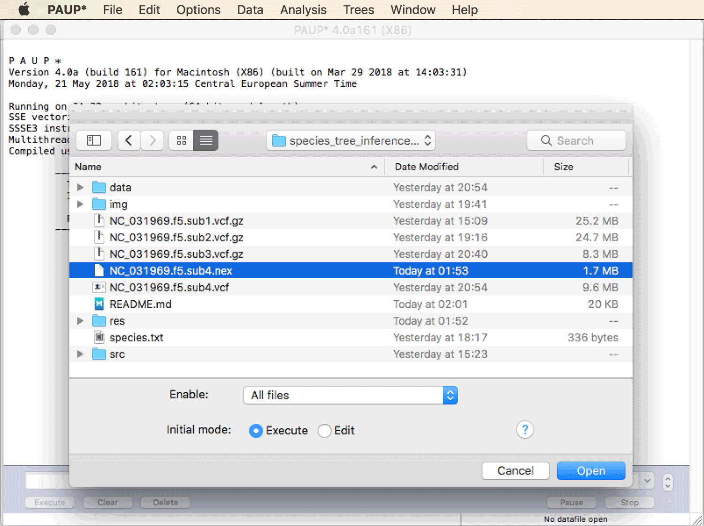

* To specify the two samples of *Astatotilapia burtoni* ("IZA1" and "IZC5") as the outgroup, click on "Define Outgroup..." in PAUP\*'s "Data" menu, as shown below.
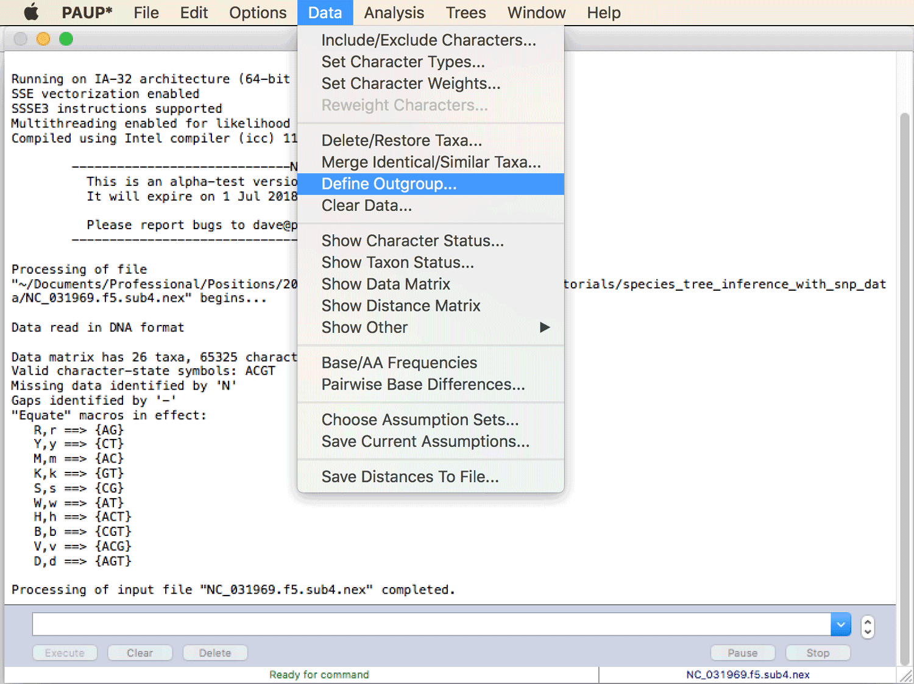

* Then, move the "IZA1" and "IZC5" into the field for the outgroup taxa with the "To Outgroup &rarr;" button, as shown in the next screenshot, and click "OK".
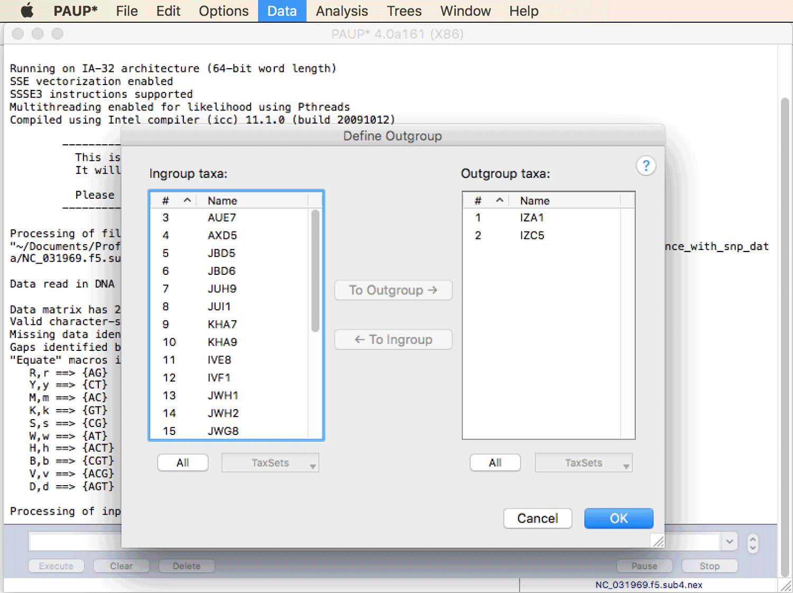
 

* We are first going to run SVDQuartets with all samples as separate taxa to verify that these in fact appear monophyletic before we group all samples per species in a second analysis. To select the settings for this first SVDQuartets analysis, click on "SVDQuartets..." in PAUP\*'s "Analysis" menu, as shown in the next screenshot.
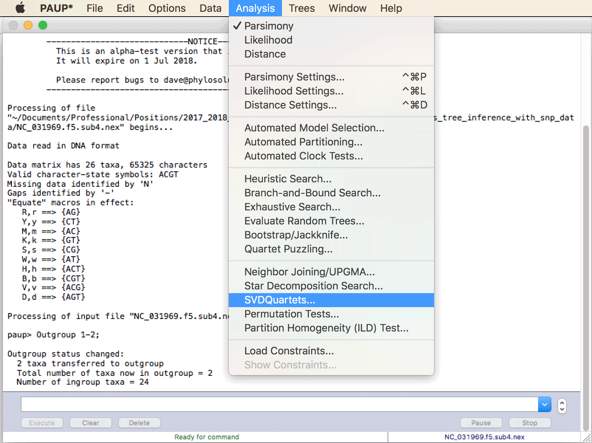
 

* In the pop-up window for the SVDQuartets settings, choose "Evaluate all possible quartets" in the field at the top for "Quartet evaluation". With a larger dataset and limited computational resources, one might want to evaluate only a certain subset instead, but with the compraratively small dataset used in our analysis, evaluating all quartets will be very fast, so there is no reason to only analyze a subset. You can leave the default values for for all other options. Make sure that "Handling of ambiguities" is set to "Distribute". This specifies that the IUPAC ambiguity code for heterozygous sites will be correctly interpreted as both alleles being present in the sample, rather than uncertainty about any of the alleles. The pop-up window should then look as in the next screenshot. Click "Ok" if it does.
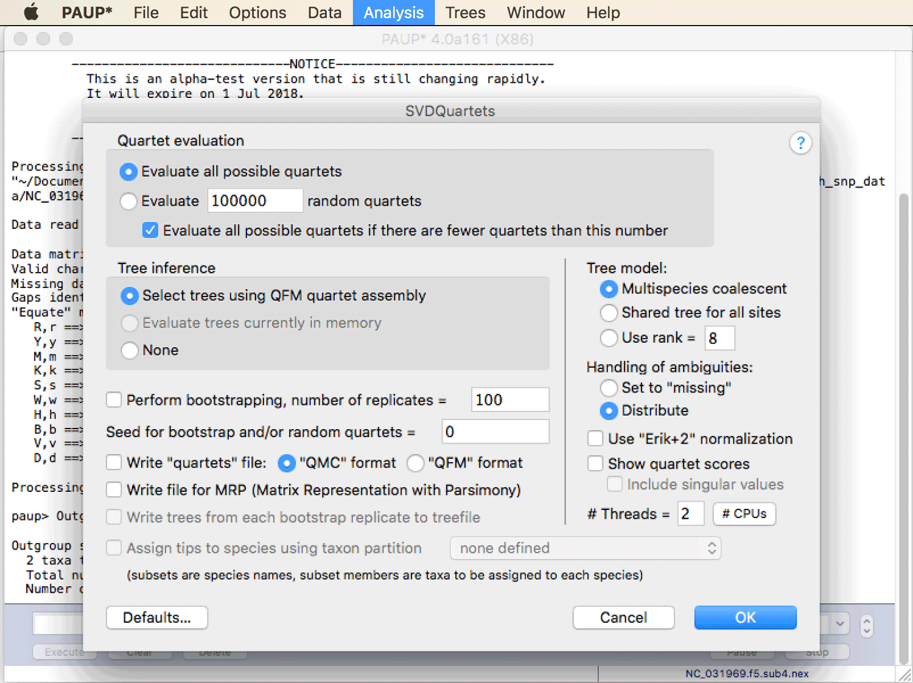
This analysis should finish within a few seconds.

* Have a look at the output in the PAUP\* screen, where the tree estimated by SVDQuartets should now be shown. **Question 3:** Do the two samples of each species cluster monophyletically? Use the table in the [Dataset](#dataset) section to find out. [(see answer)](#q3)

* In a second analysis with SVDQuartets, we are going to specify which samples come from the same species, so that SVDQuartets can use this information to estimate a tree with species as taxa. To specify this information, write the following text to a file named `taxpartitions.txt`: 
		
		BEGIN SETS;
			TAXPARTITION SPECIES =
				astbur: 1-2,
				altfas: 3-4,
				telvit: 5-6,
				neobri: 7-8,
				neochi: 9-10,
				neocra: 11-12,
				neogra: 13-14,
				neohel: 15-16,
				neomar: 17-18,
				neooli: 19-20,
				neopul: 21-22,
				neosav: 23-24,
				neowal: 25-26;
		END;
		
	The above text block uses the "Sets" command of the very flexible Nexus format (a complete command reference can be found in [Maddison et al. (1997)](https://academic.oup.com/sysbio/article/46/4/590/1629695)). It specifies that the first two sequences in the Nexus file correspond to species "astbur", the next two sequences correspond to species "altfas" and so on.
		
* The alignment file [`NC_031969.f5.sub4.nex`](res/NC_031969.f5.sub4.nex) and the file written in the last step [`taxpartitions.txt`](res/taxpartitions.txt) then need to be combined into a single file in Nexus format. Use the following command to do so:

		cat NC_031969.f5.sub4.nex taxpartitions.txt > NC_031969.f5.sub4.parts.nex

* Open the new Nexus file `NC_031969.f5.sub4.parts.nex` again in PAUP\* and make sure that "Execute" is selected in the opening dialog. You will be asked if you want to reset the active datafile. Click "Yes" to do so.

* Once again define the samples of *Astatotilapia burtoni* ("IZA1" and "IZC5") as the outgroup with "Define Outgroup..." in the "Data" menu.

* Click "SVDQuartets..." again in the "Analysis" menu. In the settings for the SVDQuartets analysis, again use "Evaluate all possible quartets" and make sure that "Distribute" is selected for "Handling of ambiguities". Unlike in the first analysis, now assign the samples to species by setting a tick in the last checkbox next to "Assign tips to species using taxon partition". The "SPECIES" taxon partition should already be selected in the drop-down menu to the right of it, this is the taxon set definition that we had added in Nexus format to the end of the alignment file. To also perform a bootstrapping analysis this time to assess node support for the species tree, set a tick next in the checkbox next to "Perform bootstrapping". With 100 bootstrap replicates, the bootstrapping analysis might take around 20 minutes; if you would prefer not to wait that long you could set the number of bootstrap replicates to 50 instead. Another way to speed up the analysis is to use all CPUs available on your machine. To do so, simply click the "#CPUs" button in the bottom right of the settings window. This window should then look as shown in the next screenshot; click "OK" if it does.

* While the bootstrapping analysis is running, have a look at the screen output of PAUP\*, which should look as shown in the next screenshot.
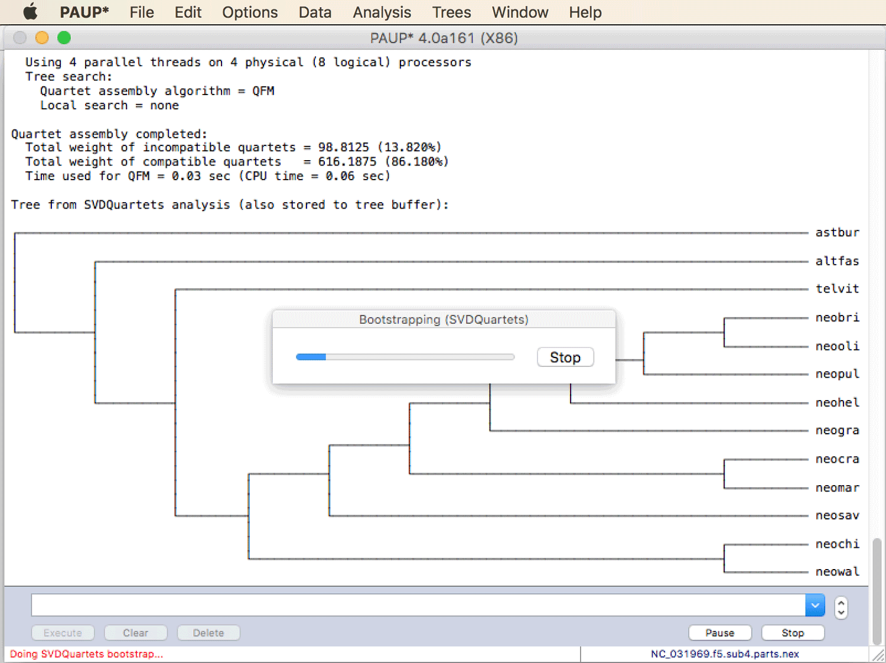
You'll see that PAUP\* has already generate a species tree, and that it reports the number of quartets that are comparable or incomparable with this tree. If all quartets would be comparable with this tree, this would indicate complete absence of incomplete lineage sorting and other processes that might violate the multi-species coalescent model, such as introgression or paralog sequences in the alignment. However, these processes can not be excluded, and introgression is in fact very likely among the species included in this dataset.

* Once bootstrapping has completed, PAUP\* should print the same species tree once again, this time with bootstrap node support values as shown in the screenshot below.
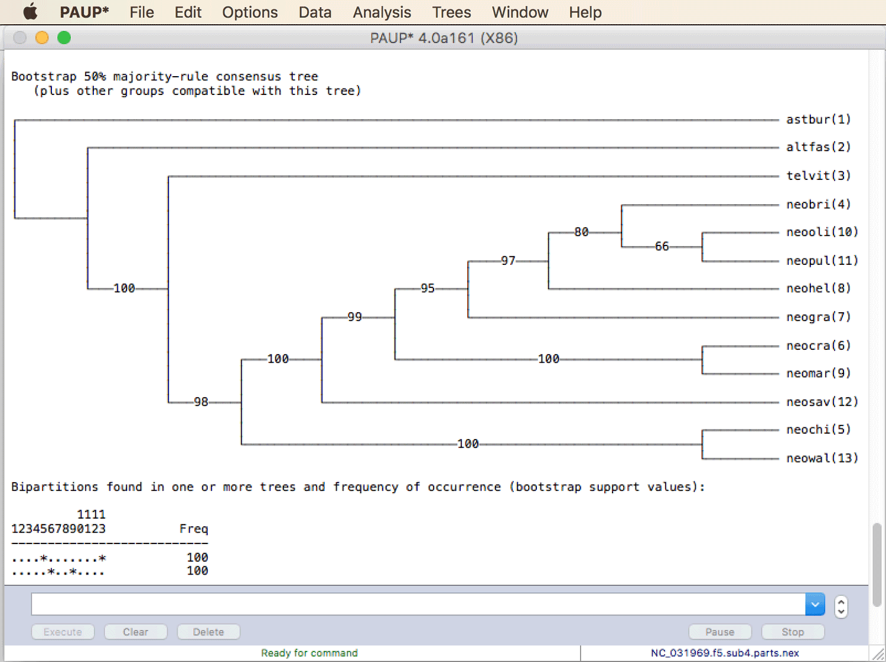
 **Question 4:** Does the species tree inferred by SVDQuartets appear reliable? [(see answer)](#q4) **Question 5 (if you already did tutorial Bayesian Species-Tree Inference):** Is this species tree concordant with the tree generated based on the multi-species coalescent model in tutorial [Bayesian Species-Tree Inference](../bayesian_species_tree_inference/README.md)? [(see answer)](#q5)

* Before closing PAUP\*, save the species tree with bootstrap support values to a new file named `NC_031969.f5.sub4.parts.tre` by clicking "Save Trees to File..." in PAUP\*'s "Trees" menu. Before you click "Save", first open a settings dialog by clicking the "More Options..." button. This should open another dialog window as shown in the next screenshot. In that window, select  "As internal node labels (only for other programs)" as the option for "Bootstrap /jackknife values". By saving the node-support values in this way, they will be readable e.g. for FigTree. Then, click "OK" and save the species tree.
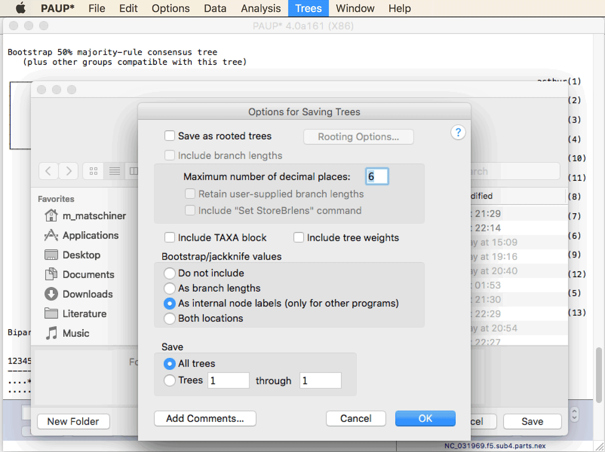

* When you open the species tree inferred with SVDQuartets in FigTree, it should appear as shown in the next screenshot.
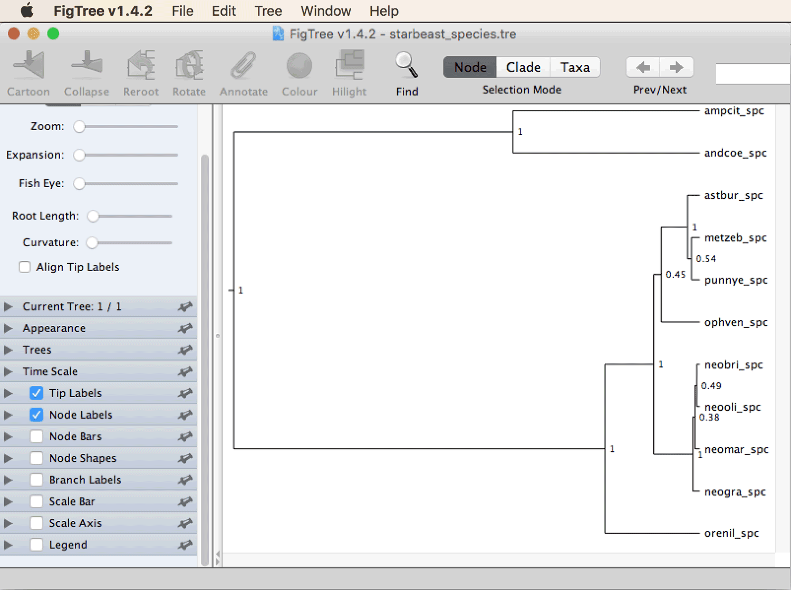
 The species tree reveals that the divergence of the four *Neolamprologus* species included in tutorial [Bayesian Species-Tree Inference](../bayesian_species_tree_inference/README.md) (*Neolamprologus brichardi*, *Neolamprologus gracilis*, *Neolamprologus marunguensis*, and *Neolamprologus olivaceous*) did not represent the most basal divergences within the tribe Lamprologini and also not within the genus *Neolamprologus*. Instead, several lineages within *Neolamprologus* (*N. walteri*, *N. chitamwebwai*, and *N. savoryi*) as well as representatives of other genera within Lamprologini (*Altolamprologus fasciatus* and *Telmatochromis vittatus*) are all outgroups to the four species used in the other tutorial.

 

                   

## Answers

* **Question 1:** As you can tell from the chromosomal positions of each SNP, which are given in the second column of the table, you'll see that the distance between SNPs is highly variable. The first SNP only appears at position 45158 and distances greater than 10,000 bp between SNPs are not uncommon. However, some SNPs are very close to each other, such as the three SNPs at positions 149906, 149919, and 149925. These SNPs likely do not represent independent markers due to linkage. As SVDQuartets assumes that all markers are independent of each other (conditional on the species tree), it might make sense to exclude two of the three SNPs, and to apply a similar filtering in other such cases.

* **Question 2:** You can count the number of SNPs in file `NC_031969.f5.sub3.vcf.gz` with the following command:

		bcftools view -H NC_031969.f5.sub3.vcf.gz | wc -l
		
	You should see that 148,573 SNPs remain in the filtered dataset, compared to 430,552 SNPs in file `NC_031969.f5.sub2.vcf.gz`. Thus, 281,979 SNPs, about two thirds, have been removed.

* **Question 3:** The (first half of) the tree should look as in the next screenshot, where indeed the two samples of each of the 14 species all appear next to each other, indicating monophyly of all species. While non-monophyly of species could result from incomplete lineage sorting, it could also indicate misidentified samples. In any case, the fact that species appear monophyletic means that there is no reason not to combine samples per species into one unit and use species as taxa in another analysis with SVDQuartets.
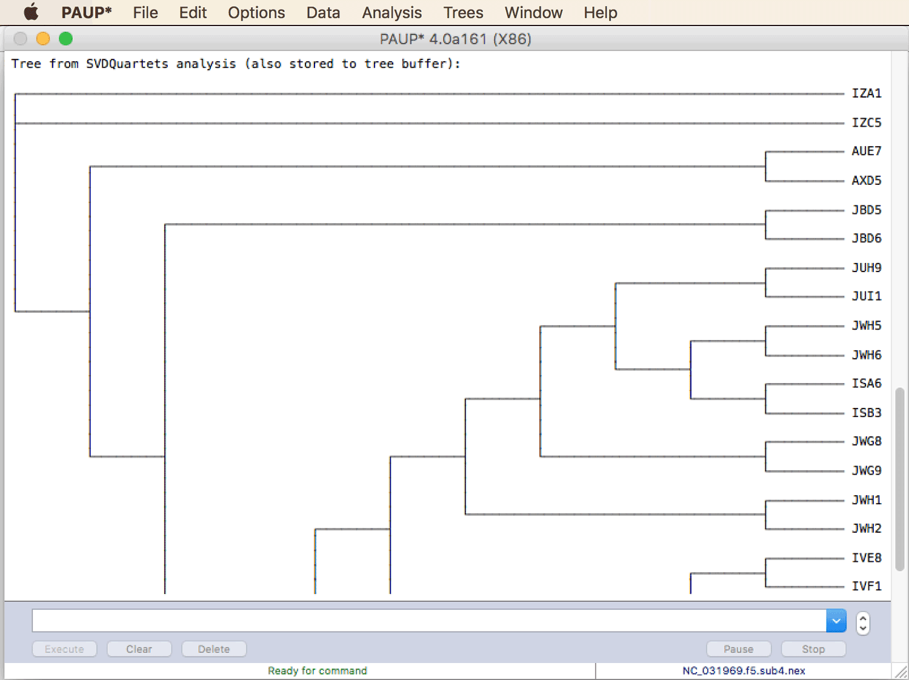

* **Question 4:** Given that this tree is not based on concatenation, but on the multi-species-coalescent model instead, the bootstrap-support values are not expected to be substantially overestimated. As most support values are close to 100, the tree topology appears to be rather reliable.

* **Question 5:** In tutorial [Bayesian Species-Tree Inference](../bayesian_species_tree_inference/README.md), a species tree was inferred with the StarBEAST2 method based on sequence data from twelve genes and eleven cichlid species. Of these species, four are also included in the species tree produced here with SVDQuartets, these are *Neolamprologus brichardi* ("neobri"), *Neolamprologus gracilis* ("neogra"), *Neolamprologus marunguensis* ("neomar"), and *Neolamprologus olivaceous* ("neooli"). The relationship of these four species is very strongly supported in the species tree resulting from the SVDQuartets analysis: *Neolamprologus brichardi* ("neobri") and *Neolamprologus olivaceous* ("neooli") are the most closely related of the four species, with a bootstrap support of 97. The support for the clustering of this pair of species with *Neolamprologus gracilis* ("neogra") receives a similarly strong bootstrap support of 95. The sister-group relationship of the two species *Neolamprologus brichardi* ("neobri\_spc") and *Neolamprologus olivaceous* ("neooli\_spc") was also recovered with the StarBEAST2 analysis (shown in the screenshot below), albeit only with a low Bayesian posterior probability of 0.49. But in contrast to the SVDQuartets species tree, *Neolamprologus marunguensis* ("neomar_spc") instead of *Neolamprologus gracilis* ("neogra\_spc") appeared as the next-closest species in the species tree estimated by StarBEAST2, again with a very low Bayesian posterior probability of 0.38. Thus, while the two topologies are in conflict with each other, the topology inferred with StarBEAST2 did not receive strong support and may thus be incorrect. This difference in the degree of support between the two analyses is not surprising, given that we used a dataset of over 60,000 SNPs for SVDQuartets but only 12 sequence alignmets with StarBEAST2. 
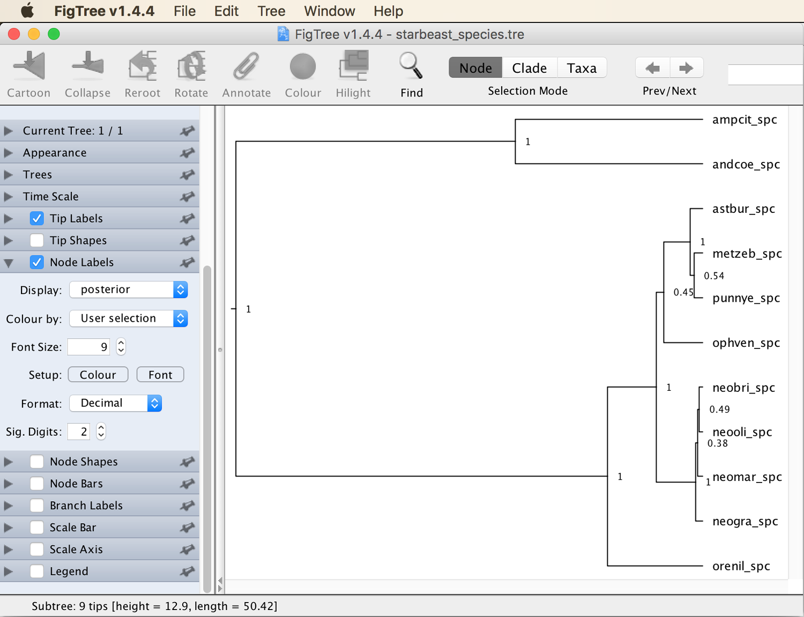
