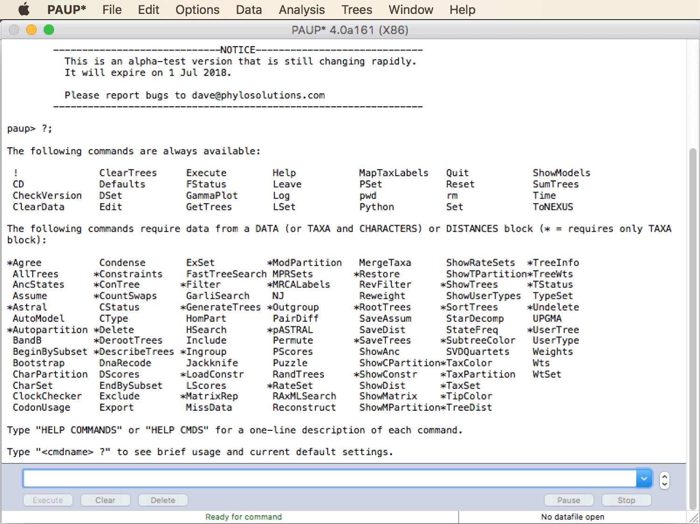
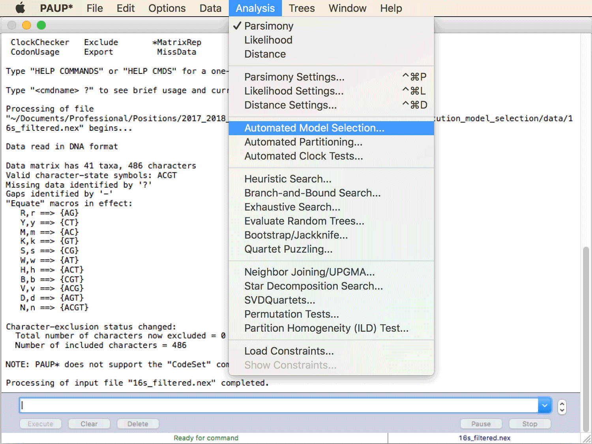
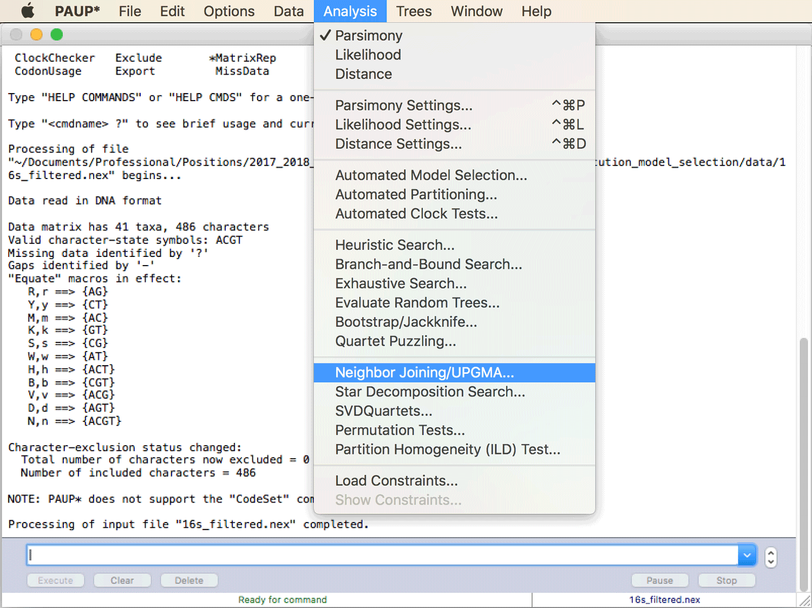
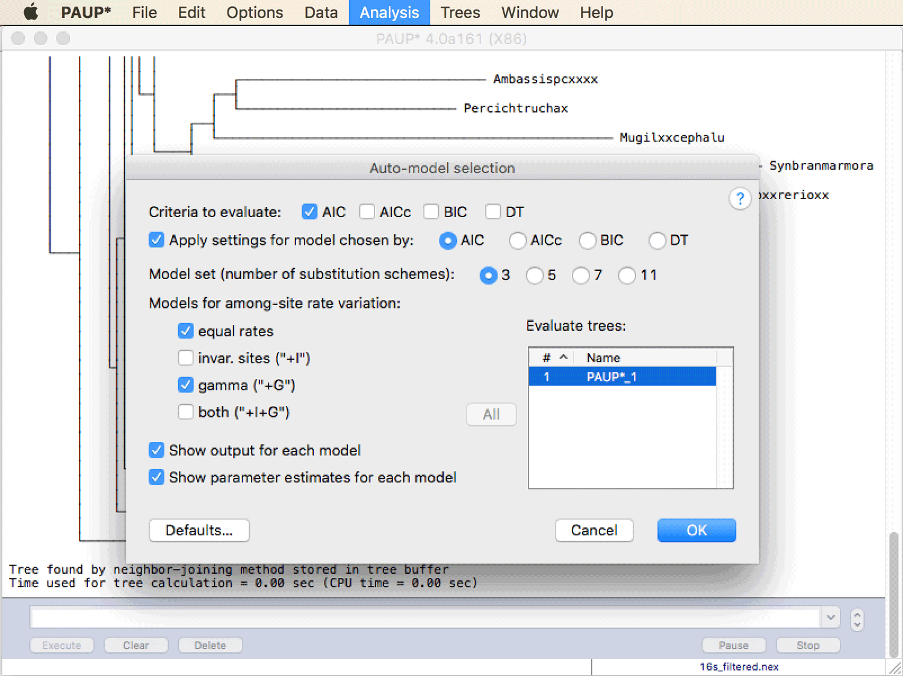
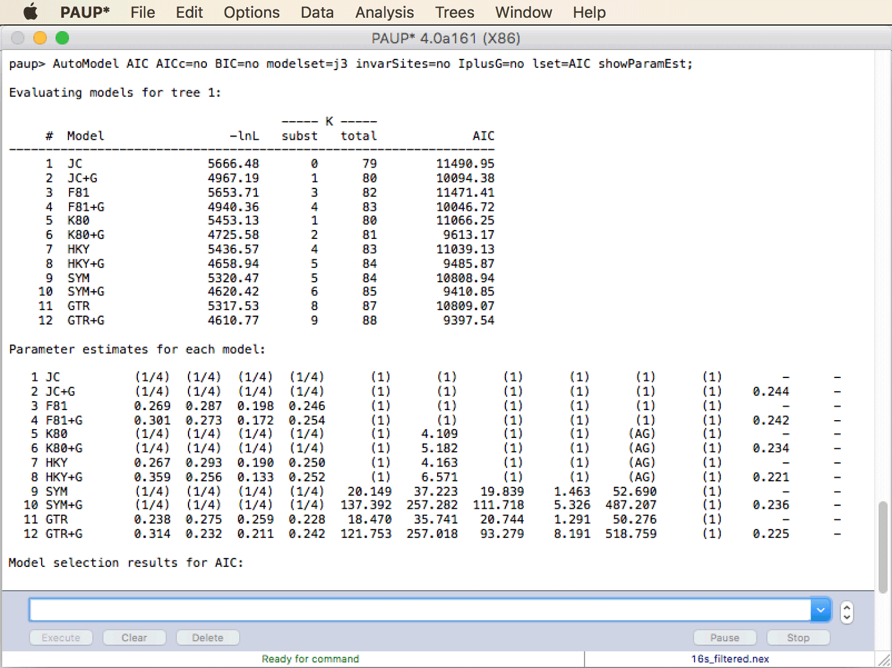
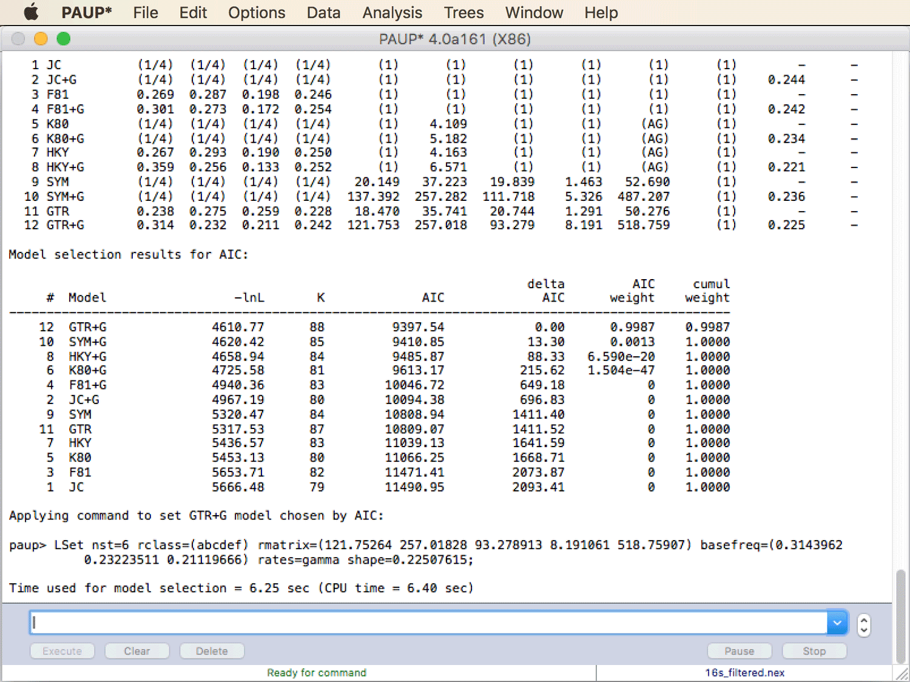
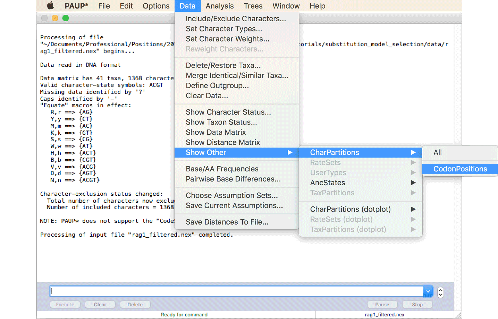
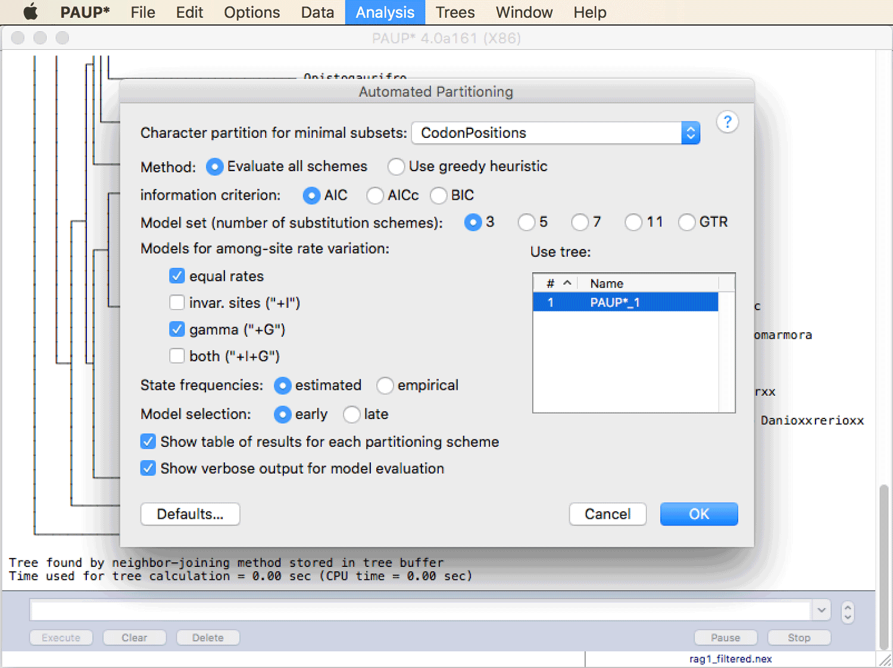
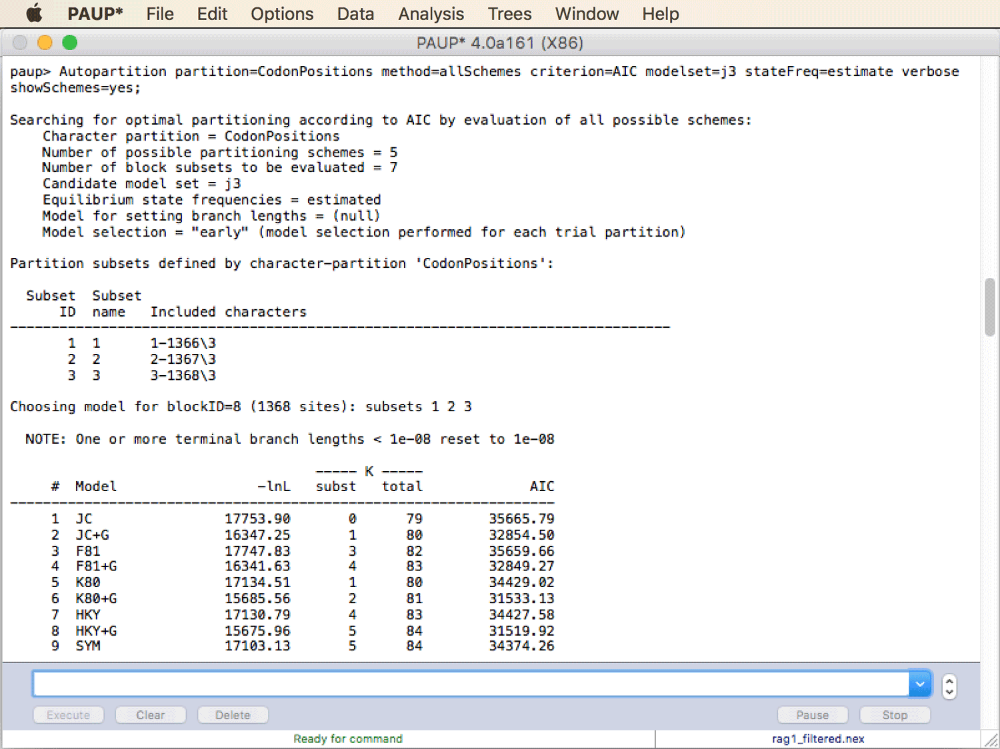

# Substitution Model Selection

A tutorial on the selection of a substitution model for phylogenetic analysis

## Summary

Before running a likelihood-based phylogenetic analysis, the user needs to decide which free parameters should be included in the model: should a single rate be assumed for all substitutions (as in the Jukes-Cantor model of sequence evolution; [Jukes and Cantor 1969](https://www.sciencedirect.com/science/article/pii/B9781483232119500097)) or should different rates be allowed for transitions and transversions (as in the HKY model; [Hasegawa et al. 1985](https://link.springer.com/article/10.1007/BF02101694)). Or should different rates even be used for all substitutions (as in the GTR model; [Taveré 1986](http://www.damtp.cam.ac.uk/user/st321/CV_&_Publications_files/STpapers-pdf/T86.pdf))? And should the frequencies of the four nucleotides (the "state frequencies") be estimated or assumed to be all equal? The optimal number of free model parameters depends on the data available and can be chosen according to criteria such as the Akaike Information Criterion (AIC; [Akaike 1974](https://ieeexplore.ieee.org/document/1100705/)) that aim to strike a balance between improvements in model fit and the number of additional parameters required for it.

## Table of contents

* [Outline](#outline)
* [Dataset](#dataset)
* [Requirements](#requirements)
* [Model selection and basic phylogeny inference in PAUP\*](#paup)
* [Model selection with partitioned alignments](#partitions)

## Outline

In this tutorial, I will present how to select a substitution model for phylogenetic analysis with the software [PAUP* (Swofford 2003)](http://paup.phylosolutions.com), a popular multi-utility tool for various types of phylogenetic analyses.

## Dataset

The data used in this tutorial are the filtered versions of the alignments generated for 16s and rag1 sequences in tutorial [Multiple Sequence Alignment](../multiple_sequence_alignment/README.md). More information on the origin of the dataset can be found in that tutorial. As PAUP* requires alignments in Nexus format as input, use the files [`16s_filtered.nex`](data/16s_filtered.nex) and [`rag1_filtered.nex`](rag1_filtered.nex).

## Requirements

* **PAUP\*:** Installation instructions and precompiled versions of [PAUP\*](http://paup.phylosolutions.com) are available on [http://phylosolutions.com/paup-test/](http://phylosolutions.com/paup-test/). First developed in the late 1980s, this software is one of the oldest programs for phylogenetic analysis, and even despite its age, its author Dave Swofford has never released a final version. Regardless, PAUP* has long been one of the most frequently used phylogenetic programs, and it is still very commonly used. Over its long lifetime, PAUP* has accumulated over [40,000 citations](https://scholar.google.ch/citations?user=H1jbCPkAAAAJ&hl=en&oi=ao) even though there is no paper for it (not even a proper manual). Until recently, PAUP* could only be purchased from Sinauer Associates for around 100 USD. Since 2015, Dave Swofford distributes updated versions of PAUP* 4.0 for free as trial versions on [http://phylosolutions.com/paup-test/](http://phylosolutions.com/paup-test/). These trial versions expire after a few months, so if you would want to use PAUP* also in the future, you might have to re-download it then. This situation is likely only temporary as development is underway for PAUP* 5, which will be distributed at least in part commercially (fun fact: While the acronym PAUP* used to stand for "Phylogenetic Analysis using Parsimony", this has recently changed to the clever recursive acronym "Phylogenetic Analysis Using PAUP"). 
While the descriptions in this tutorial assume that you have installed the GUI version of PAUP* for Mac OS X or Windows, it can also be followed with the command-line version of PAUP\*. If you use this command-line version, you might need to look up the equivalent commands; after starting PAUP\*, this can always be done with PAUP\*'s help screen that will be displayed if you simply type "?" and hit the Enter key. The screenshot below shows the help screen of the command-line versions of PAUP\*.

## Model selection and basic phylogeny inference in PAUP*

Comparisons of substitution models based on their fit to sequence data has been implemented in several tools, and has most often been performed using the program [jModelTest](https://github.com/ddarriba/jmodeltest2) ([Darriba et al. 2012](https://www.nature.com/articles/nmeth.2109)). But since automatic selection of substitution models has recently also been implemented in the PAUP\* and the installation of PAUP\* will anyway be required for other tutorials in this repository, I here present model selection with PAUP\* instead of jModelTest. In practice, the model selection is very similar between the two programs.

* Click "Open..." in the "File" menu of PAUP\*. Make sure that at the bottom of the opening window, "Execute" is selected as the initial mode as shown in the next screenshot. Select the file with the aligned 16s sequences in Nexus format ([`16s_filtered.nex`](data/16s_filtered.nex)) and click "Open". PAUP* will give a short report of its interpretation of the file, including the number of species (taxa) and characters found in the alignment.

* The option for "Automatic Model Selection" can be found in PAUP\*'s "Analysis" menu. However, when you click on it, you'll see that in order to run this model selection, a phylogeny is required. While this might appear as if it would possibly leads to circular inference (selecting a substitution model is required for maximum-likelihood phylogenetic analysis but also depends on a phylogeny), this is not an issue in practice because the outcome of the model selection does not depend strongly on having the correct phylogeny; thus, any reasonable phylogeny will lead to a similar result of the model selection. Thus, the best solution is to run a quick phylogenetic analysis with the Neighbor-Joining algorithm ([Saitou and Nei 1987](https://academic.oup.com/mbe/article/4/4/406/1029664)), which is conveniently also implemented in PAUP\*.

* To choose from the available settings for Neighbor-Joining phylogenetic analysis, click on "Neighbor Joining/UPGMA..." in PAUP\*'s "Analysis" menu.

* In the newly opened pop-up window, keep all default options and click "OK".

* Click once more on "Automated Model Selection..." in the "Analysis" menu. The tree generated with Neighbor-Joining will already be selected for use in the model selection, and the pop-up window will now give you several options for this model selection. The available criteria for model selection are called "AIC", "AICc", "BIC", and "DT". These are similar to likelihood-ratio tests but have the advantage that they can be used to compare models that are not "nested" (two models are nested if one of them has all the parameters of the other models plus additional parameters). "AIC" stands for the "Akaike information criterion", "AICc" is the "Akaike information criterion corrected for small sample sizes", "BIC" is the "Bayesian information criterion", and "DT" is a "decision-theoretic" criterion. The most commonly used of these is the Akaike Information Criterion ([Akaike 1974](https://ieeexplore.ieee.org/document/1100705/)). The AIC of each model is calculated independently as:  
AIC = 2 *k* &minus;2 log(*L*),  
where *k* is the number of free parameters in a model and *L* is the likelihood after all free parameters have been optimized (i.e. the maximum likelihood). Usually, a model is considered preferrable over another model if its AIC score is at least 4 points better (= smaller) than the AIC score of the other model. 
Set the tick next to "AIC" but remove the ticks next to "AICc", "BIC", and "DT". Also select "AIC" to the right of "Apply settings for model chosen by:". As the "Model set", choose the number "3". This means that models with equal substitution rates (e.g. the Jukes-Cantor model), with separate substitution rates for transitions and transversion (e.g. the HKY model), and models with six independent substitution rates (the GTR model) will be tested. Keep the ticks next to "equal rates" and "gamma" (allowing gamma-distributed among-site rate variation), but remove the ticks for "invar. sites" and "both". I recommend doing so because the parameters for the proportion of invariable sites ("+I") and for among-site rate-variation ("+G") are confounded as applying a particularly low rate to a set of sites has nearly the same effect as considering these sites entirely invariable. Keep the tick next to "Show output for each model", and also set the tick next to "Show parameter estimates for each model". Make sure that the settings panel looks as shown in the below screenshot, then click "OK".

* PAUP\* will report the output of the model selection in three tables. In the first (under "Evaluating models for tree 1"), you'll see a list of twelve models that were compared, as shown below ("JC" stands for the Jukes-Cantor model). **Question 1:** Which model has the highest log likelihood? [(see answer)](#q1)

* In columns 4 and 5 of the same table, you'll see *k*, the number of free parameters in the model. Column 4 lists the number of additional free parameters compared to the simplest model, column 5 lists the total number of free parameters. **Question 2:** Even for the simplest model, the Jukes-Cantor model, a total of 79 free parameters are listed, do you know what these could be? [(see answer)](#q2)

* The second table lists the parameter estimates for each model. After the number and the name of each model, there are nine columns with numbers. **Question 3:** Do you know what these numbers mean? [(see answer)](#q3)

* Finally, the third table lists once again the models, but this time ranked by their AIC score. **Question 4:** Which model fits best to the data? [(see answer)](#q4) **Question 5:** What is the difference in AIC score to the second-best model? [(see answer)](#q5)

* Repeat the comparison of substitution models with the alignment of rag1 sequences ([rag1_filtered.nex](data/rag1_filtered.nex)). **Question 6:** Which model is the best-fitting model for this alignment, according to AIC? [(see answer)](#q6)

## Model selection with partitioned alignments

In the selection of a substitution model for the 16S and rag1 sequences we have so far assumed that the model is applicable equally to all sites of the alignment. This may be justified with a comparatively short alignment but may not be appropriate for longer alignments if you have reasons to assume that some sites either evolve at different speeds or that they differ in the stationary nucleotide frequencies or the relative substitution rates applying to them. This is the case for the protein-coding rag1 alignment because third-codon positions are known to usually evolve at higher rates than first or second codon positions. We will therefore test in this part of the tutorial if independent substitution models should be applied to the different codon positions.

* Open file [`rag1_filtered.nex`](data/rag1_filtered.nex) in a text editor and scroll down to the end of the file. You'll see three blocks that start with "BEGIN" and end with "END;", the first of these blocks is apparently for "ASSUMPTIONS", the second is for "CODONS", and the third is for "SETS". All of these blocks were written by AliView when the alignment was exported in Nexus format. The last of the three blocks is empty, and the first also seems to contain no information. We'll ignore these. The important one of the three blocks is the block with codon information. Based on this block, PAUP\* can recognize which sites of the alignment correspond to which codon position. For example, the line "1: 1-1366\3," tells PAUP\* that starting at site 1, every third site corresponds to a first codon position. However, the meaning of the line that contains only "N:," is not clear and it is also not understood by PAUP\*, so please delete this line and save the file again.

* Open the edited file `rag1_filtered.nex` again in PAUP\* (again make sure that "Execute", not "Edit" is selected as the initial model). To make sure that PAUP\* recognizes the partitioning commands, click on "Show Other > CharPartitions > CodonPositions" in PAUP\*'s "Data" menu, as shown in the next screenshot. PAUP\* should then report the three different subsets.

* We are going to run PAUP\*'s automatic partitioning function to test if separate models should be used for the different codon positions of the rag1 gene. As in the model selection carried out before, PAUP\* will base the selection on the calculation of AIC scores, but this time the AIC is calculated for each tested combination of substitution models and partitioning scheme (a scheme describing which substitution model should apply to which partition). All possible combinations of substitution models and partitioning schemes will be tested. Just like for the previous model comparisonts, PAUP\* again requires not only the alignment but also a phylogeny for the automated partitioning. To quickly regenerate the Neigbor-Joining phylogeny for the rag1 sequences, click again on "Neighbor-Joining/UPGMA..." in PAUP's "Analysis" menu, and confirm "OK" in the pop-up window.

* Click on "Automated Partitioning..." in the "Analysis" menu. In the pop-up window, specify that codon positions should be used for "Character partition for minimal subsets" (this is already selected), and choose "Evaluate all schemes" to exhaustively compare all combinations of evolutionary models and partitioning schemes. As the information criterion, again use AIC, and choose "3" as the model set to test again only the Jukes-Cantor, HKY, and GTR models and their derivations (meaning that the state frequencies are either assumed to be equal or not). As the models for among-site rate variation, set a tick for "equal rates", assuming no rate variation, and for "gamma", assuming gamma-distributed rate variation with four rate categories. Choose "estimated" state frequencies and "early" model selection. Finally, set ticks for "Show table of results for each partitioning scheme" and "Show verbose output for model evaluation". Make sure that the pop-up window looks as in the below screenshot; then click "OK".

* The automated model selection should finish in less than a minute. Once it's complete, scroll back to the top of the output given by PAUP\*. Basic information about the analysis is given on the very first lines of this output, after "Searching for optimal partitioning according to AIC...", as shown in the next screenshot. **Question 7:** How many different partitioning schemes are possible (all of these have been evaluated)? [(see answer)](#q7) **Question 8:** Why are exactly this many partitioning schemes possible? [(see answer)](#q8)

* In the next line, the number of evaluated block sets is specified. **Question 9:** Why do this many block subsets need to be evaluated? [(see answer)](#q9)

* In the tables following the first lines of the output, you'll see that PAUP\* has now evaluated twelve evolutionary models. Basically, these are Jukes-Cantor, HKY, and GTR, each with and without equal state frequencies and with and without gamma-distributed rate variation ("+G"). The first two tables in the output report the results for a partitioning scheme that included just a single partition. This can be recognized by the line "Choosing model for blockID=8 (1368 sites): subsets 1 2 3", which means that the three subsets specified for the three codon positions are all included in the partition. From the first table, it is obvious that the addition of the gamma model of among-sites rate variation improves the likelihood of each of the models tremendously. So clearly there must be a lot of among-site rate variation in the alignment that most likely results primarily from the higher substitution rates at third-codon positions.

* After the first two tables, the likelihood and AIC scores are given for the partition combining all codon positions. These values correspond to the likelihood and AIC values of the best model in the first table. **Question 10:** Which model is this? [(see answer)](#q10)

* In the other tables of the output, results are reported for all other evaluated blocks. In the very last table, the best partitioning scheme, and the best-fitting model of each partition are reported. **Question 11:** How do you interpret these results - should we use separate models (and which) for the three different codon positions? [(see answer)](#q11)

* Repeat the analysis with a smaller alignment to see if less complex models will be selected then. To produce a smaller alignment, open file `rag1_filtered.nex` in AliView, remove all positions after position 600 and the positions 1-300. The alignment should then contain exactly 300 bp. Save the alignment again in Nexus format using the "Save as Nexus" command in AliView's "File" menu. Name this file `rag1_filtered_short.nex`. Open the file again in a text editor and, as before, remove the line that contains only "N:," in the codons block at the end of the file. Then use this file again for automated model selection in PAUP\*. **Question 12:** Which partitioning scheme, and which substitution models are now selected? [(see answer)](#q12)

 

                   

## Answers

* **Question 1:** The GTR model with gamma-distributed rate variation has the highest log likelihood (4610.77).

* **Question 2:** These are the branch lengths (scaled by the substitution rate) of the phylogeny, which are optimized to calculate the maximum likelihood for each model. Each unrooted phylogeny of *N* taxa has 2 *N* &minus; 3 branches, therefore the unrooted phylogeny for the 41 species in the 16S alignment has
2 &times; 41 &minus; 3 = 79 branches.

* **Question 3:** These first four of these columns represent the stationary frequencies assumed or estimated for the four nucleotides A, C, G, and T. This is followed by six columns for the assumed or estimated rates for the substitutions A &rarr; C, A &rarr; G, A &rarr; T, C &rarr; G, C &rarr; T, and G &rarr; T. In all models these rates are assumed to be time-reversible, meaning that e.g. the substitution A &rarr; C has the same rate as C &rarr; A. All rates are measured relative to the rate of G &rarr; T substitutions, therefore the last of the six columns shows "1" for all models. The second-last column contains the values for the alpha parameter of the gamma distribution for among-site rate variation only for those models that included this parameter ("+G"). The very last column is empty because a parameter for the proportion of invariable sites was not included in any of the models.

* **Question 4:** According to the AIC, the GTR model with gamma-distributed rate variation has the best fit to the data, with an AIC score of 9,397.54.

* **Question 5:** The model with the second-best AIC score is the SYM model with gamma-distributed rate variation that allows six different substitution rates but assumes that the stationary frequences of all four nucleotides is equal. The difference in AIC score compared to the best-fitting model is 13.3.

* **Question 6:** The GTR model with gamma-distributed rate variation has again the lowest AIC score, indicating the best fit to the sequence data. Given that even with the modest sizes of the alignments used here the complex GTR model with rate variation is selected over other models, this model is highly likely to also fit best to alignments with more taxa and longer sequences that are commonly used in phylogenomic studies.

* **Question 7:** Five partitioning schemes are possible.

* **Question 8:** The five partitioning schemes are:
	1.	Separate partitions for all three codon positions.
	2. A separate partition for the first codon positions and another for all second and third codon positions.
	3. 	A separate partition for the second codon positions and another for all first and third codon positions.
	4. 	A separate partition for the third codon positions and another for all first and second codon positions.
	5. 	A single partition for the entire alignment.

* **Question 9:** Seven different block subsets need to be evaluated. To assess the fit of the different partitioning schemes, PAUP\* needs to calculate the likelihood of the each partition separately, of each of the three possible pairs of partitions, and of the unpartitioned overall alignment.

* **Question 10:** This is the GTR model with gamma-distributed among-site rate variation, which is not surprising, as the analysis with this partitioning scheme (combining all codon positions into a single partition) is equivalent to the model comparison that we performed previously without any partitioning.

* **Question 11:** The best scheme contains three different partitions, and the best-fitting substitution model is in each case, again, the GTR model with gamma-distributed among-site rate variation.

* **Question 12:** Only two separate partitions are now selected, one for all first and second codon positions, and one for all third codon positions. The SYM model with gamma-distributed among-site rate variation is selected for the first partition and the K80 model (equivalent to the Jukes-Cantor model but allowing different state frequencies) with gamma-distributed rate variation is selected for the partition of third codon positions.